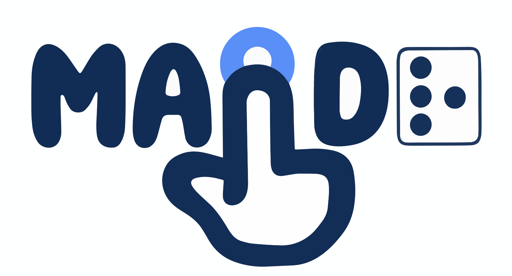

# maidr 

<!-- badges: start -->
[](https://CRAN.R-project.org/package=maidr)
[](https://CRAN.R-project.org/package=maidr)
[](https://github.com/xability/r-maidr/actions/workflows/R-CMD-check.yaml)
[](https://lifecycle.r-lib.org/articles/stages.html#experimental)
<!-- badges: end -->

## Overview

maidr (Multimodal Access and Interactive Data Representation) makes data visualizations accessible to users with visual impairments. It converts ggplot2 and Base R plots into interactive, accessible HTML/SVG formats with keyboard navigation, screen reader support, and sonification. maidr for R is the R binding of [MAIDR](https://maidr.ai/), the JavaScript core developed by the (x)Ability Design Lab at the University of Illinois Urbana-Champaign; the same accessibility layer is available for Python as [py-maidr](https://py.maidr.ai/).

The package provides two main functions:

- `show()` displays an interactive accessible plot in RStudio Viewer or browser
- `save_html()` exports a plot as a standalone HTML file

## Installation

maidr requires R 4.0.0 or later. Install the stable release from CRAN:

``` r
install.packages("maidr")
```

Or install the development version from GitHub:

``` r
# Using pak (recommended)
pak::pak("xability/r-maidr")

# Alternative: using pacman (auto-installs if missing)
pacman::p_load_gh("xability/r-maidr")
```

## Usage

### ggplot2

``` r
library(maidr)
library(ggplot2)

p <- ggplot(mpg, aes(x = class)) +
  geom_bar(fill = "steelblue") +
  labs(title = "Vehicle Classes", x = "Class", y = "Count")

# Display interactive accessible plot
show(p)

# Or save to file
save_html(p, "vehicle_classes.html")
```

### Base R

``` r
library(maidr)

# Create plot first
barplot(
  table(mtcars$cyl),
  main = "Cars by Cylinder Count",
  xlab = "Cylinders",
  ylab = "Count"
)

# Then call show() without arguments
show()
```

## Supported plot types

maidr supports a wide range of visualization types in both ggplot2 and Base R:

### Basic Plot Types
| Plot Type | ggplot2 | Base R |
|-----------|---------|--------|
| Bar charts | `geom_bar()`, `geom_col()` | `barplot()` |
| Grouped/Dodged bars | `position = "dodge"` | `beside = TRUE` |
| Stacked bars | `position = "stack"` | `beside = FALSE` |
| Pie charts | `geom_col()`/`geom_bar()` + `coord_polar("y")` | `pie()` |
| Histograms | `geom_histogram()` | `hist()` |
| Scatter plots | `geom_point()` | `plot()` |
| Line plots | `geom_line()` | `plot(type = "l")`, `lines()` |
| Step plots | `geom_step()` | `plot(type = "s")`, `plot(type = "S")` |
| Box plots | `geom_boxplot()` | `boxplot()` |
| Heatmaps | `geom_tile()` | `image()` |
| Contour plots | — (see below) | `contour()` |
| Violin plots | `geom_violin()` | — |
| Candlestick (OHLC) | `tidyquant::geom_candlestick()` (+ `geom_ma()`, + patchwork volume) | `quantmod::chartSeries()` (OHLC-only; no TA / no volume) |
| Density/Smooth | `geom_smooth()`, `geom_density()` | `lines(density())` |

Note: Volume bars and moving-average overlays for candlestick charts are
supported only on the ggplot2 + {tidyquant} + {patchwork} path. On the
Base R path, `quantmod::chartSeries()` `TA` overlays (`addVo()`,
`addSMA()`, `addEMA()`) — and the default `TA` whenever the input `xts`
carries a `Volume` column — fall back to native (non-accessible)
graphics with a one-time advisory.

### Advanced Plot Types
| Plot Type | ggplot2 | Base R |
|-----------|---------|--------|
| Faceted plots | `facet_wrap()`, `facet_grid()` | `par(mfrow/mfcol)` + loops |
| Multi-panel layouts | `patchwork` package | `par(mfrow)`, `par(mfcol)` |
| Multi-layered plots | Multiple `geom_*` layers | Sequential plot calls |

### Experimental Plot Types

> [!WARNING]
> **These are prototypes. Treat them as prototypes.** They are under active
> development, they are unstable, and **none of them has been through a user
> study**. Field names, announcement wording and navigation may change without
> a deprecation period, including in a patch release. If you are building
> something that has to keep working, build it on the plot types above.

Everything in the two tables above predates the plot coverage roadmap
([#137](https://github.com/xability/r-maidr/issues/137)) and has been exercised
by real readers over real charts. Everything below was added by that roadmap
and the base R sweeps that followed it
([#251](https://github.com/xability/r-maidr/issues/251),
[#262](https://github.com/xability/r-maidr/issues/262)), most inside a few
weeks.

Each was measured against the chart it reads — that is what the issues and the
tests record. But measuring that a reading is *faithful to the drawing* is a
different claim from establishing that it is *useful to a reader*. Nobody has
asked a blind or low-vision reader whether hearing `stars()` as a radar, or
navigating a `termplot()` panel by panel, is the right way to read one. Until
that happens these are proposals about how a chart could be read, not answers.

Feedback is exactly what would move one of these into the tables above.

#### ggplot2

| Layer type | Drawn by |
|-----------|----------|
| `area` | `geom_area()`, `geom_ribbon(aes(ymin = 0, ...))` |
| `stacked_area` | stacked `geom_area()` |
| `stacked_normalized_area` | `geom_area(position = "fill")` |
| `stacked_normalized_bar` | `geom_bar(position = "fill")` |
| `contour` | `geom_contour()`, `geom_density_2d()` |
| `error_bar` | `geom_errorbar()`, `geom_errorbarh()`, `geom_linerange()`, `geom_pointrange()`, `geom_crossbar()`, `geom_ribbon()` as a band |
| `gantt` | `geom_segment()`, `geom_curve()` |
| `hexbin` | `geom_hex()`, `stat_bin_2d()` |
| `polygon` | `geom_polygon()` |
| `rug` | `geom_rug()` |

#### Base R

| Layer type | Drawn by |
|-----------|----------|
| `biplot` | `biplot()` |
| `box_stats` | `bxp()` |
| `conditional_density` | `cdplot()` |
| `correlogram` | `acf()`, `pacf()`, `ccf()` |
| `cumulative_periodogram` | `cpgram()` |
| `dot` | `dotchart()` (ungrouped) |
| `filled_contour` | `filled.contour()` |
| `interaction` | `interaction.plot()` |
| `lag` | `lag.plot()` |
| `lollipop` | `plot(type = "h")` |
| `mosaic` | `mosaicplot()` (two-way tables) |
| `pairs` | `pairs()` |
| `qq` | `qqnorm()` |
| `qqline` | `qqline()` |
| `radar` | `stars()` |
| `residual` | `assocplot()` (two-way tables) |
| `spectral_density` | `spectrum()` |
| `spine` | `spineplot()` |
| `stacked_normalized_bar` | `barplot()` of proportions |
| `strip` | `stripchart()` |
| `subseries` | `monthplot()` |
| `termplot` | `termplot()` |
| `violin` | `vioplot::vioplot()` |
| `word_cloud` | `wordcloud::wordcloud()` |

The split is the diff of each factory's `get_supported_types()` against
`8de0e98`, the last commit on `main` before
[#137](https://github.com/xability/r-maidr/issues/137) was filed.
`tests/testthat/test-plot-type-stability.R` fails if a supported type appears
in neither the stable tables nor the experimental ones, so a new layer type has
to be placed deliberately rather than inherit either promise by being
forgotten.

The [JavaScript core](https://maidr.ai/) and the [Python binding](https://py.maidr.ai/)
make the same distinction over their own type lists, with the same boundary and
for the same reason.

See the [examples gallery](https://r.maidr.ai/articles/examples.html) for a
worked example of each plot type.

## Accessibility features

- **Keyboard navigation** - explore data points using arrow keys
- **Screen reader support** - full ARIA labels and live announcements
- **Sonification** - hear data patterns through sound
- **Text descriptions** - automatic statistical summaries

Press **Tab** (or click) to focus a rendered plot, move between data points with the **arrow keys**, and toggle **B** braille, **T** text, **S** sonification, and **R** review mode. Four global shortcuts open maidr's own interfaces:

| Action | Windows / Linux | macOS |
|---|---|---|
| Show or hide the keyboard shortcut help | Ctrl + / | Command + / |
| Open the command palette listing every available command | Ctrl + Shift + P | Command + Shift + P |
| Open the AI chat (requires your own API key, entered in Settings, or a local Ollama server) | Shift + / (that is, **?**) | Shift + / (**?**) |
| Open Settings | Ctrl + , | Command + , |

The full list, including autoplay, label announcements, and layer switching, is in the [maidr controls documentation](https://maidr.ai/docs/CONTROLS.html).

## Offline support

By default, `show()` and `save_html()` use the bundled maidr.js library, so
the result works offline (`save_html()` writes it to a `lib/` folder beside
the file). Widgets, knitr documents and Shiny apps auto-detect internet
availability and use the CDN when online. Use the `use_cdn` parameter for
explicit control:

``` r
# Force CDN (requires internet)
show(p, use_cdn = TRUE)

# Force bundled files (works offline)
show(p, use_cdn = FALSE)
save_html(p, "plot.html", use_cdn = FALSE)
```

## Getting help

- Report bugs or request features at [GitHub Issues](https://github.com/xability/r-maidr/issues)
- Read the documentation at the [package website](https://r.maidr.ai/)

## Learning more
- `vignette("getting-started", package = "maidr")` for an introduction
- The [examples gallery](https://r.maidr.ai/articles/examples.html) for supported visualizations
- `vignette("shiny-integration", package = "maidr")` for Shiny apps
- The [maidr skill](https://github.com/xability/maidr-skill) for AI coding agents (Claude Code, Codex, Cursor, and others): once installed with `npx skills add xability/maidr-skill`, an agent that writes ggplot2 or base R plotting code routes the result through this package so the chart comes out accessible

## Related projects

maidr for R is one of three MAIDR packages, all developed by the (x)Ability
Design Lab at the University of Illinois Urbana-Champaign:

- [MAIDR JavaScript core](https://maidr.ai/), the TypeScript engine (npm package
  `maidr`) that renders every accessible chart, including the ones this package
  produces.
- [py-maidr for Python](https://py.maidr.ai/), the Python binding for
  matplotlib, seaborn, Plotly and Altair (PyPI package `maidr`).
- [maidr for R](https://r.maidr.ai/), this package, for ggplot2 and Base R
  graphics (CRAN package `maidr`; source at
  [xability/r-maidr](https://github.com/xability/r-maidr)).

## Citation

If you use maidr in research, please cite the MAIDR papers:

- Seo, J., Xia, Y., Lee, B., Mccurry, S., & Yam, Y. J. (2024). MAIDR: Making
  Statistical Visualizations Accessible with Multimodal Data Representation. In
  Proceedings of the CHI Conference on Human Factors in Computing Systems
  (CHI '24). ACM. <https://doi.org/10.1145/3613904.3642730>
- Seo, J., O'Modhrain, S., Xia, Y., Kamath, S., Lee, B., & Coughlan, J. M.
  (2024). Designing Born-Accessible Courses in Data Science and Visualization:
  Challenges and Opportunities of a Remote Curriculum Taught by Blind
  Instructors to Blind Students. In EuroVis 2024 - Education Papers. The
  Eurographics Association. <https://doi.org/10.2312/eved.20241053>

`citation("maidr")` prints both, plus an entry for the package itself, in
text and BibTeX form.
