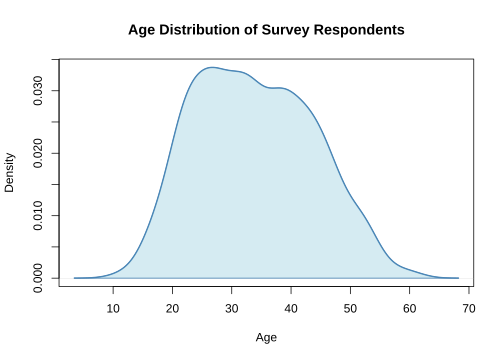

# Histogram, Density, Box and Violin Examples

Distribution plots describe the shape of one variable. A histogram is
walked bin by bin, a density curve point by point along the smoothed
curve, and a box plot as its five-number summary plus outliers, with
sonification tracing the rise and fall of each. Histograms, box plots
and density curves are stable plot types in both ggplot2 and Base R, and
violin plots are stable in ggplot2
([`geom_violin()`](https://ggplot2.tidyverse.org/reference/geom_violin.html));
the Base R reading of
[`vioplot::vioplot()`](https://rdrr.io/pkg/vioplot/man/vioplot.html) is
an experimental plot type (see “Supported plot types” and “Experimental
Plot Types” in the README), so this page shows only the ggplot2 violin
example. The [examples hub](https://r.maidr.ai/articles/examples.md)
lists every other plot family.

## Histogram

A histogram shows the frequency distribution of a continuous variable by
grouping values into bins. The height of each bar indicates how many
observations fall within that range.

### ggplot2

``` r

exam_scores <- data.frame(score = c(
  rnorm(500, mean = 72, sd = 10),
  rnorm(500, mean = 85, sd = 8)
))

p <- ggplot(exam_scores, aes(x = score)) +
  geom_histogram(bins = 25, fill = "skyblue", color = "white") +
  labs(
    title = "Distribution of Exam Scores",
    x = "Score",
    y = "Frequency"
  ) +
  theme_minimal()

p
```

![](data:image/svg+xml;base64,PHN2ZyB4bWxucz0iaHR0cDovL3d3dy53My5vcmcvMjAwMC9zdmciIHhsaW5rPSJodHRwOi8vd3d3LnczLm9yZy8xOTk5L3hsaW5rIiB3aWR0aD0iNTA0cHgiIGhlaWdodD0iMzYwcHgiIHZpZXdib3g9IjAgMCA1MDQgMzYwIiB2ZXJzaW9uPSIxLjEiIGNsYXNzPSJtYWlkci1rbml0ci1zdmciIHJvbGU9ImltZyIgYXJpYS1sYWJlbGxlZGJ5PSJtMG11dHl6cnIyMDAwMDAzMDFhbnUtYWx0IiBkYXRhLW1haWRyLWtuaXRyPSJ7JnF1b3Q7aWQmcXVvdDs6JnF1b3Q7bTBtdXR5enJyMjAwMDAwMzAxYW51LW1haWRyLXBsb3QtMTc5MTEyNzM3NTAwMi02MDQ3NCZxdW90OywmcXVvdDtzdWJwbG90cyZxdW90OzpbW3smcXVvdDtpZCZxdW90OzomcXVvdDttYWlkci1zdWJwbG90LTE3OTExMjczNzUwMDEtNjA0NzQmcXVvdDssJnF1b3Q7bGF5ZXJzJnF1b3Q7Olt7JnF1b3Q7aWQmcXVvdDs6MSwmcXVvdDtzZWxlY3RvcnMmcXVvdDs6JnF1b3Q7I20wbXV0eXpycjIwMDAwMDMwMWFudS1nZW9tX3JlY3RcXC5yZWN0XFwuNDBcXC4xIHJlY3QmcXVvdDssJnF1b3Q7dHlwZSZxdW90OzomcXVvdDtoaXN0JnF1b3Q7LCZxdW90O2RhdGEmcXVvdDs6W3smcXVvdDt4JnF1b3Q7OjQyLjA2OTA5OTE2ODQ3MDcsJnF1b3Q7eSZxdW90OzoxLCZxdW90O3hNaW4mcXVvdDs6NDAuNTkyMTU0NjkwNDgyOSwmcXVvdDt4TWF4JnF1b3Q7OjQzLjU0NjA0MzY0NjQ1ODQsJnF1b3Q7eU1pbiZxdW90OzowLCZxdW90O3lNYXgmcXVvdDs6MX0seyZxdW90O3gmcXVvdDs6NDUuMDIyOTg4MTI0NDQ2MiwmcXVvdDt5JnF1b3Q7OjIsJnF1b3Q7eE1pbiZxdW90Ozo0My41NDYwNDM2NDY0NTg0LCZxdW90O3hNYXgmcXVvdDs6NDYuNDk5OTMyNjAyNDM0LCZxdW90O3lNaW4mcXVvdDs6MCwmcXVvdDt5TWF4JnF1b3Q7OjJ9LHsmcXVvdDt4JnF1b3Q7OjQ3Ljk3Njg3NzA4MDQyMTgsJnF1b3Q7eSZxdW90OzozLCZxdW90O3hNaW4mcXVvdDs6NDYuNDk5OTMyNjAyNDM0LCZxdW90O3hNYXgmcXVvdDs6NDkuNDUzODIxNTU4NDA5NiwmcXVvdDt5TWluJnF1b3Q7OjAsJnF1b3Q7eU1heCZxdW90OzozfSx7JnF1b3Q7eCZxdW90Ozo1MC45MzA3NjYwMzYzOTc0LCZxdW90O3kmcXVvdDs6NiwmcXVvdDt4TWluJnF1b3Q7OjQ5LjQ1MzgyMTU1ODQwOTYsJnF1b3Q7eE1heCZxdW90Ozo1Mi40MDc3MTA1MTQzODUyLCZxdW90O3lNaW4mcXVvdDs6MCwmcXVvdDt5TWF4JnF1b3Q7OjZ9LHsmcXVvdDt4JnF1b3Q7OjUzLjg4NDY1NDk5MjM3MywmcXVvdDt5JnF1b3Q7OjgsJnF1b3Q7eE1pbiZxdW90Ozo1Mi40MDc3MTA1MTQzODUyLCZxdW90O3hNYXgmcXVvdDs6NTUuMzYxNTk5NDcwMzYwOCwmcXVvdDt5TWluJnF1b3Q7OjAsJnF1b3Q7eU1heCZxdW90Ozo4fSx7JnF1b3Q7eCZxdW90Ozo1Ni44Mzg1NDM5NDgzNDg2LCZxdW90O3kmcXVvdDs6MjQsJnF1b3Q7eE1pbiZxdW90Ozo1NS4zNjE1OTk0NzAzNjA4LCZxdW90O3hNYXgmcXVvdDs6NTguMzE1NDg4NDI2MzM2NCwmcXVvdDt5TWluJnF1b3Q7OjAsJnF1b3Q7eU1heCZxdW90OzoyNH0seyZxdW90O3gmcXVvdDs6NTkuNzkyNDMyOTA0MzI0MiwmcXVvdDt5JnF1b3Q7OjMwLCZxdW90O3hNaW4mcXVvdDs6NTguMzE1NDg4NDI2MzM2NCwmcXVvdDt4TWF4JnF1b3Q7OjYxLjI2OTM3NzM4MjMxMiwmcXVvdDt5TWluJnF1b3Q7OjAsJnF1b3Q7eU1heCZxdW90OzozMH0seyZxdW90O3gmcXVvdDs6NjIuNzQ2MzIxODYwMjk5OCwmcXVvdDt5JnF1b3Q7OjM4LCZxdW90O3hNaW4mcXVvdDs6NjEuMjY5Mzc3MzgyMzEyLCZxdW90O3hNYXgmcXVvdDs6NjQuMjIzMjY2MzM4Mjg3NiwmcXVvdDt5TWluJnF1b3Q7OjAsJnF1b3Q7eU1heCZxdW90OzozOH0seyZxdW90O3gmcXVvdDs6NjUuNzAwMjEwODE2Mjc1NCwmcXVvdDt5JnF1b3Q7OjQ5LCZxdW90O3hNaW4mcXVvdDs6NjQuMjIzMjY2MzM4Mjg3NiwmcXVvdDt4TWF4JnF1b3Q7OjY3LjE3NzE1NTI5NDI2MzEsJnF1b3Q7eU1pbiZxdW90OzowLCZxdW90O3lNYXgmcXVvdDs6NDl9LHsmcXVvdDt4JnF1b3Q7OjY4LjY1NDA5OTc3MjI1MSwmcXVvdDt5JnF1b3Q7Ojc5LCZxdW90O3hNaW4mcXVvdDs6NjcuMTc3MTU1Mjk0MjYzMiwmcXVvdDt4TWF4JnF1b3Q7OjcwLjEzMTA0NDI1MDIzODcsJnF1b3Q7eU1pbiZxdW90OzowLCZxdW90O3lNYXgmcXVvdDs6Nzl9LHsmcXVvdDt4JnF1b3Q7OjcxLjYwNzk4ODcyODIyNjUsJnF1b3Q7eSZxdW90Ozo5MywmcXVvdDt4TWluJnF1b3Q7OjcwLjEzMTA0NDI1MDIzODcsJnF1b3Q7eE1heCZxdW90Ozo3My4wODQ5MzMyMDYyMTQzLCZxdW90O3lNaW4mcXVvdDs6MCwmcXVvdDt5TWF4JnF1b3Q7OjkzfSx7JnF1b3Q7eCZxdW90Ozo3NC41NjE4Nzc2ODQyMDIxLCZxdW90O3kmcXVvdDs6ODEsJnF1b3Q7eE1pbiZxdW90Ozo3My4wODQ5MzMyMDYyMTQzLCZxdW90O3hNYXgmcXVvdDs6NzYuMDM4ODIyMTYyMTg5OSwmcXVvdDt5TWluJnF1b3Q7OjAsJnF1b3Q7eU1heCZxdW90Ozo4MX0seyZxdW90O3gmcXVvdDs6NzcuNTE1NzY2NjQwMTc3NywmcXVvdDt5JnF1b3Q7Ojk0LCZxdW90O3hNaW4mcXVvdDs6NzYuMDM4ODIyMTYyMTg5OSwmcXVvdDt4TWF4JnF1b3Q7Ojc4Ljk5MjcxMTExODE2NTUsJnF1b3Q7eU1pbiZxdW90OzowLCZxdW90O3lNYXgmcXVvdDs6OTR9LHsmcXVvdDt4JnF1b3Q7OjgwLjQ2OTY1NTU5NjE1MzMsJnF1b3Q7eSZxdW90Ozo4OCwmcXVvdDt4TWluJnF1b3Q7Ojc4Ljk5MjcxMTExODE2NTUsJnF1b3Q7eE1heCZxdW90Ozo4MS45NDY2MDAwNzQxNDExLCZxdW90O3lNaW4mcXVvdDs6MCwmcXVvdDt5TWF4JnF1b3Q7Ojg4fSx7JnF1b3Q7eCZxdW90Ozo4My40MjM1NDQ1NTIxMjg5LCZxdW90O3kmcXVvdDs6MTAwLCZxdW90O3hNaW4mcXVvdDs6ODEuOTQ2NjAwMDc0MTQxMSwmcXVvdDt4TWF4JnF1b3Q7Ojg0LjkwMDQ4OTAzMDExNjcsJnF1b3Q7eU1pbiZxdW90OzowLCZxdW90O3lNYXgmcXVvdDs6MTAwfSx7JnF1b3Q7eCZxdW90Ozo4Ni4zNzc0MzM1MDgxMDQ1LCZxdW90O3kmcXVvdDs6MTA1LCZxdW90O3hNaW4mcXVvdDs6ODQuOTAwNDg5MDMwMTE2NywmcXVvdDt4TWF4JnF1b3Q7Ojg3Ljg1NDM3Nzk4NjA5MjMsJnF1b3Q7eU1pbiZxdW90OzowLCZxdW90O3lNYXgmcXVvdDs6MTA1fSx7JnF1b3Q7eCZxdW90Ozo4OS4zMzEzMjI0NjQwODAxLCZxdW90O3kmcXVvdDs6NjQsJnF1b3Q7eE1pbiZxdW90Ozo4Ny44NTQzNzc5ODYwOTIzLCZxdW90O3hNYXgmcXVvdDs6OTAuODA4MjY2OTQyMDY3OSwmcXVvdDt5TWluJnF1b3Q7OjAsJnF1b3Q7eU1heCZxdW90Ozo2NH0seyZxdW90O3gmcXVvdDs6OTIuMjg1MjExNDIwMDU1NywmcXVvdDt5JnF1b3Q7OjY0LCZxdW90O3hNaW4mcXVvdDs6OTAuODA4MjY2OTQyMDY3OSwmcXVvdDt4TWF4JnF1b3Q7OjkzLjc2MjE1NTg5ODA0MzUsJnF1b3Q7eU1pbiZxdW90OzowLCZxdW90O3lNYXgmcXVvdDs6NjR9LHsmcXVvdDt4JnF1b3Q7Ojk1LjIzOTEwMDM3NjAzMTMsJnF1b3Q7eSZxdW90OzozNywmcXVvdDt4TWluJnF1b3Q7OjkzLjc2MjE1NTg5ODA0MzUsJnF1b3Q7eE1heCZxdW90Ozo5Ni43MTYwNDQ4NTQwMTkxLCZxdW90O3lNaW4mcXVvdDs6MCwmcXVvdDt5TWF4JnF1b3Q7OjM3fSx7JnF1b3Q7eCZxdW90Ozo5OC4xOTI5ODkzMzIwMDY4LCZxdW90O3kmcXVvdDs6MjAsJnF1b3Q7eE1pbiZxdW90Ozo5Ni43MTYwNDQ4NTQwMTkxLCZxdW90O3hNYXgmcXVvdDs6OTkuNjY5OTMzODA5OTk0NiwmcXVvdDt5TWluJnF1b3Q7OjAsJnF1b3Q7eU1heCZxdW90OzoyMH0seyZxdW90O3gmcXVvdDs6MTAxLjE0Njg3ODI4Nzk4MiwmcXVvdDt5JnF1b3Q7OjcsJnF1b3Q7eE1pbiZxdW90Ozo5OS42Njk5MzM4MDk5OTQ3LCZxdW90O3hNYXgmcXVvdDs6MTAyLjYyMzgyMjc2NTk3LCZxdW90O3lNaW4mcXVvdDs6MCwmcXVvdDt5TWF4JnF1b3Q7Ojd9LHsmcXVvdDt4JnF1b3Q7OjEwNC4xMDA3NjcyNDM5NTgsJnF1b3Q7eSZxdW90OzoyLCZxdW90O3hNaW4mcXVvdDs6MTAyLjYyMzgyMjc2NTk3LCZxdW90O3hNYXgmcXVvdDs6MTA1LjU3NzcxMTcyMTk0NiwmcXVvdDt5TWluJnF1b3Q7OjAsJnF1b3Q7eU1heCZxdW90OzoyfSx7JnF1b3Q7eCZxdW90OzoxMDcuMDU0NjU2MTk5OTM0LCZxdW90O3kmcXVvdDs6MiwmcXVvdDt4TWluJnF1b3Q7OjEwNS41Nzc3MTE3MjE5NDYsJnF1b3Q7eE1heCZxdW90OzoxMDguNTMxNjAwNjc3OTIxLCZxdW90O3lNaW4mcXVvdDs6MCwmcXVvdDt5TWF4JnF1b3Q7OjJ9LHsmcXVvdDt4JnF1b3Q7OjExMC4wMDg1NDUxNTU5MDksJnF1b3Q7eSZxdW90OzoyLCZxdW90O3hNaW4mcXVvdDs6MTA4LjUzMTYwMDY3NzkyMSwmcXVvdDt4TWF4JnF1b3Q7OjExMS40ODU0ODk2MzM4OTcsJnF1b3Q7eU1pbiZxdW90OzowLCZxdW90O3lNYXgmcXVvdDs6Mn0seyZxdW90O3gmcXVvdDs6MTEyLjk2MjQzNDExMTg4NSwmcXVvdDt5JnF1b3Q7OjEsJnF1b3Q7eE1pbiZxdW90OzoxMTEuNDg1NDg5NjMzODk3LCZxdW90O3hNYXgmcXVvdDs6MTE0LjQzOTM3ODU4OTg3MywmcXVvdDt5TWluJnF1b3Q7OjAsJnF1b3Q7eU1heCZxdW90OzoxfV0sJnF1b3Q7dGl0bGUmcXVvdDs6JnF1b3Q7RGlzdHJpYnV0aW9uIG9mIEV4YW0gU2NvcmVzJnF1b3Q7LCZxdW90O2F4ZXMmcXVvdDs6eyZxdW90O3gmcXVvdDs6eyZxdW90O2xhYmVsJnF1b3Q7OiZxdW90O1Njb3JlJnF1b3Q7fSwmcXVvdDt5JnF1b3Q7OnsmcXVvdDtsYWJlbCZxdW90OzomcXVvdDtGcmVxdWVuY3kmcXVvdDt9fSwmcXVvdDtvcmllbnRhdGlvbiZxdW90OzomcXVvdDt2ZXJ0JnF1b3Q7fV19XV0sJnF1b3Q7dGl0bGUmcXVvdDs6JnF1b3Q7RGlzdHJpYnV0aW9uIG9mIEV4YW0gU2NvcmVzJnF1b3Q7fSI+PGcgdHJhbnNmb3JtPSJ0cmFuc2xhdGUoMCwgMzYwKSBzY2FsZSgxLCAtMSkiPjxnIGlkPSJtMG11dHl6cnIyMDAwMDAzMDFhbnUtZ3JpZFNWRyIgc3Ryb2tlPSJyZ2IoMCwwLDApIiBzdHJva2Utb3BhY2l0eT0iMSIgZmlsbD0ibm9uZSIgZmlsbC1vcGFjaXR5PSIwIiBzdHJva2Utd2lkdGg9IjAuNzUiIHN0cm9rZS1kYXNoYXJyYXk9Im5vbmUiIHN0cm9rZS1saW5lY2FwPSJyb3VuZCIgc3Ryb2tlLWxpbmVqb2luPSJyb3VuZCIgc3Ryb2tlLW1pdGVybGltaXQ9IjEwIiBmb250LXNpemU9IjEyIiBmb250LWZhbWlseT0iSGVsdmV0aWNhLCBBcmlhbCwgRnJlZVNhbnMsIExpYmVyYXRpb24gU2FucywgTmltYnVzIFNhbnMgTCwgc2Fucy1zZXJpZiIgZm9udC13ZWlnaHQ9Im5vcm1hbCIgZm9udC1zdHlsZT0ibm9ybWFsIj48ZGVmcz48Y2xpcHBhdGggaWQ9Im0wbXV0eXpycjIwMDAwMDMwMWFudS1tYWlkci1jbGlwLWYzOC4xNV8zMS41OF80NjAuMzdfMzA1LjUzIj48cmVjdCB4PSIzOC4xNSIgeT0iMzEuNTgiIHdpZHRoPSI0NjAuMzciIGhlaWdodD0iMzA1LjUzIiAvPjwvY2xpcHBhdGg+PC9kZWZzPjxnIGlkPSJtMG11dHl6cnIyMDAwMDAzMDFhbnUtbGF5b3V0LjEiPjxnIGlkPSJtMG11dHl6cnIyMDAwMDAzMDFhbnUtbGF5b3V0LjIiPjxnIGlkPSJtMG11dHl6cnIyMDAwMDAzMDFhbnUtbGF5b3V0OjpiYWNrZ3JvdW5kLjEtMTMtMTYtMS4xIj48ZyBpZD0ibTBtdXR5enJyMjAwMDAwMzAxYW51LWJhY2tncm91bmQuMS0xMy0xNi0xLjEiPjxnIGlkPSJtMG11dHl6cnIyMDAwMDAzMDFhbnUtcGxvdC5iYWNrZ3JvdW5kLi5yZWN0Ljc2LjEiPjxyZWN0IGlkPSJtMG11dHl6cnIyMDAwMDAzMDFhbnUtcGxvdC5iYWNrZ3JvdW5kLi5yZWN0Ljc2LjEuMSIgeD0iMCIgeT0iMCIgd2lkdGg9IjUwNCIgaGVpZ2h0PSIzNjAiIHN0cm9rZS13aWR0aD0iMS4wNyIgc3Ryb2tlPSJub25lIiBzdHJva2Utb3BhY2l0eT0iMSIgZmlsbD0icmdiKDI1NSwyNTUsMjU1KSIgZmlsbC1vcGFjaXR5PSIxIiBzdHJva2UtZGFzaGFycmF5PSJub25lIiBzdHJva2UtbGluZWpvaW49InJvdW5kIiAvPjwvZz48L2c+PC9nPjxnIGlkPSJtMG11dHl6cnIyMDAwMDAzMDFhbnUtbGF5b3V0OjpwYW5lbC45LTctOS03LjEiPjxnIGlkPSJtMG11dHl6cnIyMDAwMDAzMDFhbnUtcGFuZWwuOS03LTktNy4xIj48ZyBpZD0ibTBtdXR5enJyMjAwMDAwMzAxYW51LWxheW91dDo6cGFuZWwuOS03LTktNzo6R1JJRC5WUC40LjEiPjxnIGlkPSJtMG11dHl6cnIyMDAwMDAzMDFhbnUtcGFuZWwtMS5nVHJlZS41NC4xIj48ZyBpZD0ibTBtdXR5enJyMjAwMDAwMzAxYW51LWdyaWxsLmdUcmVlLjUyLjEiPjxnIGlkPSJtMG11dHl6cnIyMDAwMDAzMDFhbnUtcGFuZWwuZ3JpZC5taW5vci55Li5wb2x5bGluZS40My4xIiBjbGlwLXBhdGg9InVybCgjbTBtdXR5enJyMjAwMDAwMzAxYW51LW1haWRyLWNsaXAtZjM4LjE1XzMxLjU4XzQ2MC4zN18zMDUuNTMpIj48cG9seWxpbmUgaWQ9Im0wbXV0eXpycjIwMDAwMDMwMWFudS1wYW5lbC5ncmlkLm1pbm9yLnkuLnBvbHlsaW5lLjQzLjEuMSIgcG9pbnRzPSIzOC4xNSw3OC41MyA0OTguNTIsNzguNTMiIHN0cm9rZT0icmdiKDIzNSwyMzUsMjM1KSIgc3Ryb2tlLW9wYWNpdHk9IjEiIGZpbGw9Im5vbmUiIGZpbGwtb3BhY2l0eT0iMSIgc3Ryb2tlLXdpZHRoPSIwLjUzIiBzdHJva2UtZGFzaGFycmF5PSJub25lIiBzdHJva2UtbGluZWNhcD0iYnV0dCIgc3Ryb2tlLWxpbmVqb2luPSJyb3VuZCI+PC9wb2x5bGluZT48cG9seWxpbmUgaWQ9Im0wbXV0eXpycjIwMDAwMDMwMWFudS1wYW5lbC5ncmlkLm1pbm9yLnkuLnBvbHlsaW5lLjQzLjEuMiIgcG9pbnRzPSIzOC4xNSwxNDQuNjcgNDk4LjUyLDE0NC42NyIgc3Ryb2tlPSJyZ2IoMjM1LDIzNSwyMzUpIiBzdHJva2Utb3BhY2l0eT0iMSIgZmlsbD0ibm9uZSIgZmlsbC1vcGFjaXR5PSIxIiBzdHJva2Utd2lkdGg9IjAuNTMiIHN0cm9rZS1kYXNoYXJyYXk9Im5vbmUiIHN0cm9rZS1saW5lY2FwPSJidXR0IiBzdHJva2UtbGluZWpvaW49InJvdW5kIj48L3BvbHlsaW5lPjxwb2x5bGluZSBpZD0ibTBtdXR5enJyMjAwMDAwMzAxYW51LXBhbmVsLmdyaWQubWlub3IueS4ucG9seWxpbmUuNDMuMS4zIiBwb2ludHM9IjM4LjE1LDIxMC44IDQ5OC41MiwyMTAuOCIgc3Ryb2tlPSJyZ2IoMjM1LDIzNSwyMzUpIiBzdHJva2Utb3BhY2l0eT0iMSIgZmlsbD0ibm9uZSIgZmlsbC1vcGFjaXR5PSIxIiBzdHJva2Utd2lkdGg9IjAuNTMiIHN0cm9rZS1kYXNoYXJyYXk9Im5vbmUiIHN0cm9rZS1saW5lY2FwPSJidXR0IiBzdHJva2UtbGluZWpvaW49InJvdW5kIj48L3BvbHlsaW5lPjxwb2x5bGluZSBpZD0ibTBtdXR5enJyMjAwMDAwMzAxYW51LXBhbmVsLmdyaWQubWlub3IueS4ucG9seWxpbmUuNDMuMS40IiBwb2ludHM9IjM4LjE1LDI3Ni45MyA0OTguNTIsMjc2LjkzIiBzdHJva2U9InJnYigyMzUsMjM1LDIzNSkiIHN0cm9rZS1vcGFjaXR5PSIxIiBmaWxsPSJub25lIiBmaWxsLW9wYWNpdHk9IjEiIHN0cm9rZS13aWR0aD0iMC41MyIgc3Ryb2tlLWRhc2hhcnJheT0ibm9uZSIgc3Ryb2tlLWxpbmVjYXA9ImJ1dHQiIHN0cm9rZS1saW5lam9pbj0icm91bmQiPjwvcG9seWxpbmU+PC9nPjxnIGlkPSJtMG11dHl6cnIyMDAwMDAzMDFhbnUtcGFuZWwuZ3JpZC5taW5vci54Li5wb2x5bGluZS40NS4xIiBjbGlwLXBhdGg9InVybCgjbTBtdXR5enJyMjAwMDAwMzAxYW51LW1haWRyLWNsaXAtZjM4LjE1XzMxLjU4XzQ2MC4zN18zMDUuNTMpIj48cG9seWxpbmUgaWQ9Im0wbXV0eXpycjIwMDAwMDMwMWFudS1wYW5lbC5ncmlkLm1pbm9yLnguLnBvbHlsaW5lLjQ1LjEuMSIgcG9pbnRzPSIxMTIuMzksMzEuNTggMTEyLjM5LDMzNy4xMSIgc3Ryb2tlPSJyZ2IoMjM1LDIzNSwyMzUpIiBzdHJva2Utb3BhY2l0eT0iMSIgZmlsbD0ibm9uZSIgZmlsbC1vcGFjaXR5PSIxIiBzdHJva2Utd2lkdGg9IjAuNTMiIHN0cm9rZS1kYXNoYXJyYXk9Im5vbmUiIHN0cm9rZS1saW5lY2FwPSJidXR0IiBzdHJva2UtbGluZWpvaW49InJvdW5kIj48L3BvbHlsaW5lPjxwb2x5bGluZSBpZD0ibTBtdXR5enJyMjAwMDAwMzAxYW51LXBhbmVsLmdyaWQubWlub3IueC4ucG9seWxpbmUuNDUuMS4yIiBwb2ludHM9IjIyNS43NCwzMS41OCAyMjUuNzQsMzM3LjExIiBzdHJva2U9InJnYigyMzUsMjM1LDIzNSkiIHN0cm9rZS1vcGFjaXR5PSIxIiBmaWxsPSJub25lIiBmaWxsLW9wYWNpdHk9IjEiIHN0cm9rZS13aWR0aD0iMC41MyIgc3Ryb2tlLWRhc2hhcnJheT0ibm9uZSIgc3Ryb2tlLWxpbmVjYXA9ImJ1dHQiIHN0cm9rZS1saW5lam9pbj0icm91bmQiPjwvcG9seWxpbmU+PHBvbHlsaW5lIGlkPSJtMG11dHl6cnIyMDAwMDAzMDFhbnUtcGFuZWwuZ3JpZC5taW5vci54Li5wb2x5bGluZS40NS4xLjMiIHBvaW50cz0iMzM5LjA5LDMxLjU4IDMzOS4wOSwzMzcuMTEiIHN0cm9rZT0icmdiKDIzNSwyMzUsMjM1KSIgc3Ryb2tlLW9wYWNpdHk9IjEiIGZpbGw9Im5vbmUiIGZpbGwtb3BhY2l0eT0iMSIgc3Ryb2tlLXdpZHRoPSIwLjUzIiBzdHJva2UtZGFzaGFycmF5PSJub25lIiBzdHJva2UtbGluZWNhcD0iYnV0dCIgc3Ryb2tlLWxpbmVqb2luPSJyb3VuZCI+PC9wb2x5bGluZT48cG9seWxpbmUgaWQ9Im0wbXV0eXpycjIwMDAwMDMwMWFudS1wYW5lbC5ncmlkLm1pbm9yLnguLnBvbHlsaW5lLjQ1LjEuNCIgcG9pbnRzPSI0NTIuNDQsMzEuNTggNDUyLjQ0LDMzNy4xMSIgc3Ryb2tlPSJyZ2IoMjM1LDIzNSwyMzUpIiBzdHJva2Utb3BhY2l0eT0iMSIgZmlsbD0ibm9uZSIgZmlsbC1vcGFjaXR5PSIxIiBzdHJva2Utd2lkdGg9IjAuNTMiIHN0cm9rZS1kYXNoYXJyYXk9Im5vbmUiIHN0cm9rZS1saW5lY2FwPSJidXR0IiBzdHJva2UtbGluZWpvaW49InJvdW5kIj48L3BvbHlsaW5lPjwvZz48ZyBpZD0ibTBtdXR5enJyMjAwMDAwMzAxYW51LXBhbmVsLmdyaWQubWFqb3IueS4ucG9seWxpbmUuNDcuMSIgY2xpcC1wYXRoPSJ1cmwoI20wbXV0eXpycjIwMDAwMDMwMWFudS1tYWlkci1jbGlwLWYzOC4xNV8zMS41OF80NjAuMzdfMzA1LjUzKSI+PHBvbHlsaW5lIGlkPSJtMG11dHl6cnIyMDAwMDAzMDFhbnUtcGFuZWwuZ3JpZC5tYWpvci55Li5wb2x5bGluZS40Ny4xLjEiIHBvaW50cz0iMzguMTUsNDUuNDcgNDk4LjUyLDQ1LjQ3IiBzdHJva2U9InJnYigyMzUsMjM1LDIzNSkiIHN0cm9rZS1vcGFjaXR5PSIxIiBmaWxsPSJub25lIiBmaWxsLW9wYWNpdHk9IjEiIHN0cm9rZS13aWR0aD0iMS4wNyIgc3Ryb2tlLWRhc2hhcnJheT0ibm9uZSIgc3Ryb2tlLWxpbmVjYXA9ImJ1dHQiIHN0cm9rZS1saW5lam9pbj0icm91bmQiPjwvcG9seWxpbmU+PHBvbHlsaW5lIGlkPSJtMG11dHl6cnIyMDAwMDAzMDFhbnUtcGFuZWwuZ3JpZC5tYWpvci55Li5wb2x5bGluZS40Ny4xLjIiIHBvaW50cz0iMzguMTUsMTExLjYgNDk4LjUyLDExMS42IiBzdHJva2U9InJnYigyMzUsMjM1LDIzNSkiIHN0cm9rZS1vcGFjaXR5PSIxIiBmaWxsPSJub25lIiBmaWxsLW9wYWNpdHk9IjEiIHN0cm9rZS13aWR0aD0iMS4wNyIgc3Ryb2tlLWRhc2hhcnJheT0ibm9uZSIgc3Ryb2tlLWxpbmVjYXA9ImJ1dHQiIHN0cm9rZS1saW5lam9pbj0icm91bmQiPjwvcG9seWxpbmU+PHBvbHlsaW5lIGlkPSJtMG11dHl6cnIyMDAwMDAzMDFhbnUtcGFuZWwuZ3JpZC5tYWpvci55Li5wb2x5bGluZS40Ny4xLjMiIHBvaW50cz0iMzguMTUsMTc3LjczIDQ5OC41MiwxNzcuNzMiIHN0cm9rZT0icmdiKDIzNSwyMzUsMjM1KSIgc3Ryb2tlLW9wYWNpdHk9IjEiIGZpbGw9Im5vbmUiIGZpbGwtb3BhY2l0eT0iMSIgc3Ryb2tlLXdpZHRoPSIxLjA3IiBzdHJva2UtZGFzaGFycmF5PSJub25lIiBzdHJva2UtbGluZWNhcD0iYnV0dCIgc3Ryb2tlLWxpbmVqb2luPSJyb3VuZCI+PC9wb2x5bGluZT48cG9seWxpbmUgaWQ9Im0wbXV0eXpycjIwMDAwMDMwMWFudS1wYW5lbC5ncmlkLm1ham9yLnkuLnBvbHlsaW5lLjQ3LjEuNCIgcG9pbnRzPSIzOC4xNSwyNDMuODYgNDk4LjUyLDI0My44NiIgc3Ryb2tlPSJyZ2IoMjM1LDIzNSwyMzUpIiBzdHJva2Utb3BhY2l0eT0iMSIgZmlsbD0ibm9uZSIgZmlsbC1vcGFjaXR5PSIxIiBzdHJva2Utd2lkdGg9IjEuMDciIHN0cm9rZS1kYXNoYXJyYXk9Im5vbmUiIHN0cm9rZS1saW5lY2FwPSJidXR0IiBzdHJva2UtbGluZWpvaW49InJvdW5kIj48L3BvbHlsaW5lPjxwb2x5bGluZSBpZD0ibTBtdXR5enJyMjAwMDAwMzAxYW51LXBhbmVsLmdyaWQubWFqb3IueS4ucG9seWxpbmUuNDcuMS41IiBwb2ludHM9IjM4LjE1LDMxMCA0OTguNTIsMzEwIiBzdHJva2U9InJnYigyMzUsMjM1LDIzNSkiIHN0cm9rZS1vcGFjaXR5PSIxIiBmaWxsPSJub25lIiBmaWxsLW9wYWNpdHk9IjEiIHN0cm9rZS13aWR0aD0iMS4wNyIgc3Ryb2tlLWRhc2hhcnJheT0ibm9uZSIgc3Ryb2tlLWxpbmVjYXA9ImJ1dHQiIHN0cm9rZS1saW5lam9pbj0icm91bmQiPjwvcG9seWxpbmU+PC9nPjxnIGlkPSJtMG11dHl6cnIyMDAwMDAzMDFhbnUtcGFuZWwuZ3JpZC5tYWpvci54Li5wb2x5bGluZS40OS4xIiBjbGlwLXBhdGg9InVybCgjbTBtdXR5enJyMjAwMDAwMzAxYW51LW1haWRyLWNsaXAtZjM4LjE1XzMxLjU4XzQ2MC4zN18zMDUuNTMpIj48cG9seWxpbmUgaWQ9Im0wbXV0eXpycjIwMDAwMDMwMWFudS1wYW5lbC5ncmlkLm1ham9yLnguLnBvbHlsaW5lLjQ5LjEuMSIgcG9pbnRzPSI1NS43MiwzMS41OCA1NS43MiwzMzcuMTEiIHN0cm9rZT0icmdiKDIzNSwyMzUsMjM1KSIgc3Ryb2tlLW9wYWNpdHk9IjEiIGZpbGw9Im5vbmUiIGZpbGwtb3BhY2l0eT0iMSIgc3Ryb2tlLXdpZHRoPSIxLjA3IiBzdHJva2UtZGFzaGFycmF5PSJub25lIiBzdHJva2UtbGluZWNhcD0iYnV0dCIgc3Ryb2tlLWxpbmVqb2luPSJyb3VuZCI+PC9wb2x5bGluZT48cG9seWxpbmUgaWQ9Im0wbXV0eXpycjIwMDAwMDMwMWFudS1wYW5lbC5ncmlkLm1ham9yLnguLnBvbHlsaW5lLjQ5LjEuMiIgcG9pbnRzPSIxNjkuMDcsMzEuNTggMTY5LjA3LDMzNy4xMSIgc3Ryb2tlPSJyZ2IoMjM1LDIzNSwyMzUpIiBzdHJva2Utb3BhY2l0eT0iMSIgZmlsbD0ibm9uZSIgZmlsbC1vcGFjaXR5PSIxIiBzdHJva2Utd2lkdGg9IjEuMDciIHN0cm9rZS1kYXNoYXJyYXk9Im5vbmUiIHN0cm9rZS1saW5lY2FwPSJidXR0IiBzdHJva2UtbGluZWpvaW49InJvdW5kIj48L3BvbHlsaW5lPjxwb2x5bGluZSBpZD0ibTBtdXR5enJyMjAwMDAwMzAxYW51LXBhbmVsLmdyaWQubWFqb3IueC4ucG9seWxpbmUuNDkuMS4zIiBwb2ludHM9IjI4Mi40MSwzMS41OCAyODIuNDEsMzM3LjExIiBzdHJva2U9InJnYigyMzUsMjM1LDIzNSkiIHN0cm9rZS1vcGFjaXR5PSIxIiBmaWxsPSJub25lIiBmaWxsLW9wYWNpdHk9IjEiIHN0cm9rZS13aWR0aD0iMS4wNyIgc3Ryb2tlLWRhc2hhcnJheT0ibm9uZSIgc3Ryb2tlLWxpbmVjYXA9ImJ1dHQiIHN0cm9rZS1saW5lam9pbj0icm91bmQiPjwvcG9seWxpbmU+PHBvbHlsaW5lIGlkPSJtMG11dHl6cnIyMDAwMDAzMDFhbnUtcGFuZWwuZ3JpZC5tYWpvci54Li5wb2x5bGluZS40OS4xLjQiIHBvaW50cz0iMzk1Ljc2LDMxLjU4IDM5NS43NiwzMzcuMTEiIHN0cm9rZT0icmdiKDIzNSwyMzUsMjM1KSIgc3Ryb2tlLW9wYWNpdHk9IjEiIGZpbGw9Im5vbmUiIGZpbGwtb3BhY2l0eT0iMSIgc3Ryb2tlLXdpZHRoPSIxLjA3IiBzdHJva2UtZGFzaGFycmF5PSJub25lIiBzdHJva2UtbGluZWNhcD0iYnV0dCIgc3Ryb2tlLWxpbmVqb2luPSJyb3VuZCI+PC9wb2x5bGluZT48L2c+PC9nPjxnIGlkPSJtMG11dHl6cnIyMDAwMDAzMDFhbnUtZ2VvbV9yZWN0LnJlY3QuNDAuMSIgY2xpcC1wYXRoPSJ1cmwoI20wbXV0eXpycjIwMDAwMDMwMWFudS1tYWlkci1jbGlwLWYzOC4xNV8zMS41OF80NjAuMzdfMzA1LjUzKSI+PHJlY3QgaWQ9Im0wbXV0eXpycjIwMDAwMDMwMWFudS1nZW9tX3JlY3QucmVjdC40MC4xLjEiIHg9IjU5LjA4IiB5PSI0NS40NiIgd2lkdGg9IjE2Ljc0IiBoZWlnaHQ9IjIuNjUiIHN0cm9rZT0icmdiKDI1NSwyNTUsMjU1KSIgc3Ryb2tlLW9wYWNpdHk9IjEiIGZpbGw9InJnYigxMzUsMjA2LDIzNSkiIGZpbGwtb3BhY2l0eT0iMSIgc3Ryb2tlLXdpZHRoPSIxLjA3IiBzdHJva2UtZGFzaGFycmF5PSJub25lIiBzdHJva2UtbGluZWpvaW49Im1pdGVyIiBzdHJva2UtbGluZWNhcD0iYnV0dCIgLz48cmVjdCBpZD0ibTBtdXR5enJyMjAwMDAwMzAxYW51LWdlb21fcmVjdC5yZWN0LjQwLjEuMiIgeD0iNzUuODIiIHk9IjQ1LjQ3IiB3aWR0aD0iMTYuNzQiIGhlaWdodD0iNS4yOSIgc3Ryb2tlPSJyZ2IoMjU1LDI1NSwyNTUpIiBzdHJva2Utb3BhY2l0eT0iMSIgZmlsbD0icmdiKDEzNSwyMDYsMjM1KSIgZmlsbC1vcGFjaXR5PSIxIiBzdHJva2Utd2lkdGg9IjEuMDciIHN0cm9rZS1kYXNoYXJyYXk9Im5vbmUiIHN0cm9rZS1saW5lam9pbj0ibWl0ZXIiIHN0cm9rZS1saW5lY2FwPSJidXR0IiAvPjxyZWN0IGlkPSJtMG11dHl6cnIyMDAwMDAzMDFhbnUtZ2VvbV9yZWN0LnJlY3QuNDAuMS4zIiB4PSI5Mi41NiIgeT0iNDUuNDYiIHdpZHRoPSIxNi43NCIgaGVpZ2h0PSI3Ljk0IiBzdHJva2U9InJnYigyNTUsMjU1LDI1NSkiIHN0cm9rZS1vcGFjaXR5PSIxIiBmaWxsPSJyZ2IoMTM1LDIwNiwyMzUpIiBmaWxsLW9wYWNpdHk9IjEiIHN0cm9rZS13aWR0aD0iMS4wNyIgc3Ryb2tlLWRhc2hhcnJheT0ibm9uZSIgc3Ryb2tlLWxpbmVqb2luPSJtaXRlciIgc3Ryb2tlLWxpbmVjYXA9ImJ1dHQiIC8+PHJlY3QgaWQ9Im0wbXV0eXpycjIwMDAwMDMwMWFudS1nZW9tX3JlY3QucmVjdC40MC4xLjQiIHg9IjEwOS4zIiB5PSI0NS40NyIgd2lkdGg9IjE2Ljc0IiBoZWlnaHQ9IjE1Ljg3IiBzdHJva2U9InJnYigyNTUsMjU1LDI1NSkiIHN0cm9rZS1vcGFjaXR5PSIxIiBmaWxsPSJyZ2IoMTM1LDIwNiwyMzUpIiBmaWxsLW9wYWNpdHk9IjEiIHN0cm9rZS13aWR0aD0iMS4wNyIgc3Ryb2tlLWRhc2hhcnJheT0ibm9uZSIgc3Ryb2tlLWxpbmVqb2luPSJtaXRlciIgc3Ryb2tlLWxpbmVjYXA9ImJ1dHQiIC8+PHJlY3QgaWQ9Im0wbXV0eXpycjIwMDAwMDMwMWFudS1nZW9tX3JlY3QucmVjdC40MC4xLjUiIHg9IjEyNi4wNCIgeT0iNDUuNDciIHdpZHRoPSIxNi43NCIgaGVpZ2h0PSIyMS4xNiIgc3Ryb2tlPSJyZ2IoMjU1LDI1NSwyNTUpIiBzdHJva2Utb3BhY2l0eT0iMSIgZmlsbD0icmdiKDEzNSwyMDYsMjM1KSIgZmlsbC1vcGFjaXR5PSIxIiBzdHJva2Utd2lkdGg9IjEuMDciIHN0cm9rZS1kYXNoYXJyYXk9Im5vbmUiIHN0cm9rZS1saW5lam9pbj0ibWl0ZXIiIHN0cm9rZS1saW5lY2FwPSJidXR0IiAvPjxyZWN0IGlkPSJtMG11dHl6cnIyMDAwMDAzMDFhbnUtZ2VvbV9yZWN0LnJlY3QuNDAuMS42IiB4PSIxNDIuNzgiIHk9IjQ1LjQ2IiB3aWR0aD0iMTYuNzQiIGhlaWdodD0iNjMuNDkiIHN0cm9rZT0icmdiKDI1NSwyNTUsMjU1KSIgc3Ryb2tlLW9wYWNpdHk9IjEiIGZpbGw9InJnYigxMzUsMjA2LDIzNSkiIGZpbGwtb3BhY2l0eT0iMSIgc3Ryb2tlLXdpZHRoPSIxLjA3IiBzdHJva2UtZGFzaGFycmF5PSJub25lIiBzdHJva2UtbGluZWpvaW49Im1pdGVyIiBzdHJva2UtbGluZWNhcD0iYnV0dCIgLz48cmVjdCBpZD0ibTBtdXR5enJyMjAwMDAwMzAxYW51LWdlb21fcmVjdC5yZWN0LjQwLjEuNyIgeD0iMTU5LjUyIiB5PSI0NS40NyIgd2lkdGg9IjE2Ljc0IiBoZWlnaHQ9Ijc5LjM2IiBzdHJva2U9InJnYigyNTUsMjU1LDI1NSkiIHN0cm9rZS1vcGFjaXR5PSIxIiBmaWxsPSJyZ2IoMTM1LDIwNiwyMzUpIiBmaWxsLW9wYWNpdHk9IjEiIHN0cm9rZS13aWR0aD0iMS4wNyIgc3Ryb2tlLWRhc2hhcnJheT0ibm9uZSIgc3Ryb2tlLWxpbmVqb2luPSJtaXRlciIgc3Ryb2tlLWxpbmVjYXA9ImJ1dHQiIC8+PHJlY3QgaWQ9Im0wbXV0eXpycjIwMDAwMDMwMWFudS1nZW9tX3JlY3QucmVjdC40MC4xLjgiIHg9IjE3Ni4yNiIgeT0iNDUuNDciIHdpZHRoPSIxNi43NCIgaGVpZ2h0PSIxMDAuNTIiIHN0cm9rZT0icmdiKDI1NSwyNTUsMjU1KSIgc3Ryb2tlLW9wYWNpdHk9IjEiIGZpbGw9InJnYigxMzUsMjA2LDIzNSkiIGZpbGwtb3BhY2l0eT0iMSIgc3Ryb2tlLXdpZHRoPSIxLjA3IiBzdHJva2UtZGFzaGFycmF5PSJub25lIiBzdHJva2UtbGluZWpvaW49Im1pdGVyIiBzdHJva2UtbGluZWNhcD0iYnV0dCIgLz48cmVjdCBpZD0ibTBtdXR5enJyMjAwMDAwMzAxYW51LWdlb21fcmVjdC5yZWN0LjQwLjEuOSIgeD0iMTkzIiB5PSI0NS40NyIgd2lkdGg9IjE2Ljc0IiBoZWlnaHQ9IjEyOS42MiIgc3Ryb2tlPSJyZ2IoMjU1LDI1NSwyNTUpIiBzdHJva2Utb3BhY2l0eT0iMSIgZmlsbD0icmdiKDEzNSwyMDYsMjM1KSIgZmlsbC1vcGFjaXR5PSIxIiBzdHJva2Utd2lkdGg9IjEuMDciIHN0cm9rZS1kYXNoYXJyYXk9Im5vbmUiIHN0cm9rZS1saW5lam9pbj0ibWl0ZXIiIHN0cm9rZS1saW5lY2FwPSJidXR0IiAvPjxyZWN0IGlkPSJtMG11dHl6cnIyMDAwMDAzMDFhbnUtZ2VvbV9yZWN0LnJlY3QuNDAuMS4xMCIgeD0iMjA5Ljc0IiB5PSI0NS40NiIgd2lkdGg9IjE2Ljc0IiBoZWlnaHQ9IjIwOC45OCIgc3Ryb2tlPSJyZ2IoMjU1LDI1NSwyNTUpIiBzdHJva2Utb3BhY2l0eT0iMSIgZmlsbD0icmdiKDEzNSwyMDYsMjM1KSIgZmlsbC1vcGFjaXR5PSIxIiBzdHJva2Utd2lkdGg9IjEuMDciIHN0cm9rZS1kYXNoYXJyYXk9Im5vbmUiIHN0cm9rZS1saW5lam9pbj0ibWl0ZXIiIHN0cm9rZS1saW5lY2FwPSJidXR0IiAvPjxyZWN0IGlkPSJtMG11dHl6cnIyMDAwMDAzMDFhbnUtZ2VvbV9yZWN0LnJlY3QuNDAuMS4xMSIgeD0iMjI2LjQ4IiB5PSI0NS40NyIgd2lkdGg9IjE2Ljc0IiBoZWlnaHQ9IjI0Ni4wMSIgc3Ryb2tlPSJyZ2IoMjU1LDI1NSwyNTUpIiBzdHJva2Utb3BhY2l0eT0iMSIgZmlsbD0icmdiKDEzNSwyMDYsMjM1KSIgZmlsbC1vcGFjaXR5PSIxIiBzdHJva2Utd2lkdGg9IjEuMDciIHN0cm9rZS1kYXNoYXJyYXk9Im5vbmUiIHN0cm9rZS1saW5lam9pbj0ibWl0ZXIiIHN0cm9rZS1saW5lY2FwPSJidXR0IiAvPjxyZWN0IGlkPSJtMG11dHl6cnIyMDAwMDAzMDFhbnUtZ2VvbV9yZWN0LnJlY3QuNDAuMS4xMiIgeD0iMjQzLjIyIiB5PSI0NS40NiIgd2lkdGg9IjE2Ljc0IiBoZWlnaHQ9IjIxNC4yNyIgc3Ryb2tlPSJyZ2IoMjU1LDI1NSwyNTUpIiBzdHJva2Utb3BhY2l0eT0iMSIgZmlsbD0icmdiKDEzNSwyMDYsMjM1KSIgZmlsbC1vcGFjaXR5PSIxIiBzdHJva2Utd2lkdGg9IjEuMDciIHN0cm9rZS1kYXNoYXJyYXk9Im5vbmUiIHN0cm9rZS1saW5lam9pbj0ibWl0ZXIiIHN0cm9rZS1saW5lY2FwPSJidXR0IiAvPjxyZWN0IGlkPSJtMG11dHl6cnIyMDAwMDAzMDFhbnUtZ2VvbV9yZWN0LnJlY3QuNDAuMS4xMyIgeD0iMjU5Ljk2IiB5PSI0NS40NiIgd2lkdGg9IjE2Ljc0IiBoZWlnaHQ9IjI0OC42NiIgc3Ryb2tlPSJyZ2IoMjU1LDI1NSwyNTUpIiBzdHJva2Utb3BhY2l0eT0iMSIgZmlsbD0icmdiKDEzNSwyMDYsMjM1KSIgZmlsbC1vcGFjaXR5PSIxIiBzdHJva2Utd2lkdGg9IjEuMDciIHN0cm9rZS1kYXNoYXJyYXk9Im5vbmUiIHN0cm9rZS1saW5lam9pbj0ibWl0ZXIiIHN0cm9rZS1saW5lY2FwPSJidXR0IiAvPjxyZWN0IGlkPSJtMG11dHl6cnIyMDAwMDAzMDFhbnUtZ2VvbV9yZWN0LnJlY3QuNDAuMS4xNCIgeD0iMjc2LjcxIiB5PSI0NS40NyIgd2lkdGg9IjE2Ljc0IiBoZWlnaHQ9IjIzMi43OCIgc3Ryb2tlPSJyZ2IoMjU1LDI1NSwyNTUpIiBzdHJva2Utb3BhY2l0eT0iMSIgZmlsbD0icmdiKDEzNSwyMDYsMjM1KSIgZmlsbC1vcGFjaXR5PSIxIiBzdHJva2Utd2lkdGg9IjEuMDciIHN0cm9rZS1kYXNoYXJyYXk9Im5vbmUiIHN0cm9rZS1saW5lam9pbj0ibWl0ZXIiIHN0cm9rZS1saW5lY2FwPSJidXR0IiAvPjxyZWN0IGlkPSJtMG11dHl6cnIyMDAwMDAzMDFhbnUtZ2VvbV9yZWN0LnJlY3QuNDAuMS4xNSIgeD0iMjkzLjQ1IiB5PSI0NS40NyIgd2lkdGg9IjE2Ljc0IiBoZWlnaHQ9IjI2NC41MyIgc3Ryb2tlPSJyZ2IoMjU1LDI1NSwyNTUpIiBzdHJva2Utb3BhY2l0eT0iMSIgZmlsbD0icmdiKDEzNSwyMDYsMjM1KSIgZmlsbC1vcGFjaXR5PSIxIiBzdHJva2Utd2lkdGg9IjEuMDciIHN0cm9rZS1kYXNoYXJyYXk9Im5vbmUiIHN0cm9rZS1saW5lam9pbj0ibWl0ZXIiIHN0cm9rZS1saW5lY2FwPSJidXR0IiAvPjxyZWN0IGlkPSJtMG11dHl6cnIyMDAwMDAzMDFhbnUtZ2VvbV9yZWN0LnJlY3QuNDAuMS4xNiIgeD0iMzEwLjE5IiB5PSI0NS40NyIgd2lkdGg9IjE2Ljc0IiBoZWlnaHQ9IjI3Ny43NSIgc3Ryb2tlPSJyZ2IoMjU1LDI1NSwyNTUpIiBzdHJva2Utb3BhY2l0eT0iMSIgZmlsbD0icmdiKDEzNSwyMDYsMjM1KSIgZmlsbC1vcGFjaXR5PSIxIiBzdHJva2Utd2lkdGg9IjEuMDciIHN0cm9rZS1kYXNoYXJyYXk9Im5vbmUiIHN0cm9rZS1saW5lam9pbj0ibWl0ZXIiIHN0cm9rZS1saW5lY2FwPSJidXR0IiAvPjxyZWN0IGlkPSJtMG11dHl6cnIyMDAwMDAzMDFhbnUtZ2VvbV9yZWN0LnJlY3QuNDAuMS4xNyIgeD0iMzI2LjkzIiB5PSI0NS40NyIgd2lkdGg9IjE2Ljc0IiBoZWlnaHQ9IjE2OS4zIiBzdHJva2U9InJnYigyNTUsMjU1LDI1NSkiIHN0cm9rZS1vcGFjaXR5PSIxIiBmaWxsPSJyZ2IoMTM1LDIwNiwyMzUpIiBmaWxsLW9wYWNpdHk9IjEiIHN0cm9rZS13aWR0aD0iMS4wNyIgc3Ryb2tlLWRhc2hhcnJheT0ibm9uZSIgc3Ryb2tlLWxpbmVqb2luPSJtaXRlciIgc3Ryb2tlLWxpbmVjYXA9ImJ1dHQiIC8+PHJlY3QgaWQ9Im0wbXV0eXpycjIwMDAwMDMwMWFudS1nZW9tX3JlY3QucmVjdC40MC4xLjE4IiB4PSIzNDMuNjciIHk9IjQ1LjQ3IiB3aWR0aD0iMTYuNzQiIGhlaWdodD0iMTY5LjMiIHN0cm9rZT0icmdiKDI1NSwyNTUsMjU1KSIgc3Ryb2tlLW9wYWNpdHk9IjEiIGZpbGw9InJnYigxMzUsMjA2LDIzNSkiIGZpbGwtb3BhY2l0eT0iMSIgc3Ryb2tlLXdpZHRoPSIxLjA3IiBzdHJva2UtZGFzaGFycmF5PSJub25lIiBzdHJva2UtbGluZWpvaW49Im1pdGVyIiBzdHJva2UtbGluZWNhcD0iYnV0dCIgLz48cmVjdCBpZD0ibTBtdXR5enJyMjAwMDAwMzAxYW51LWdlb21fcmVjdC5yZWN0LjQwLjEuMTkiIHg9IjM2MC40MSIgeT0iNDUuNDYiIHdpZHRoPSIxNi43NCIgaGVpZ2h0PSI5Ny44OCIgc3Ryb2tlPSJyZ2IoMjU1LDI1NSwyNTUpIiBzdHJva2Utb3BhY2l0eT0iMSIgZmlsbD0icmdiKDEzNSwyMDYsMjM1KSIgZmlsbC1vcGFjaXR5PSIxIiBzdHJva2Utd2lkdGg9IjEuMDciIHN0cm9rZS1kYXNoYXJyYXk9Im5vbmUiIHN0cm9rZS1saW5lam9pbj0ibWl0ZXIiIHN0cm9rZS1saW5lY2FwPSJidXR0IiAvPjxyZWN0IGlkPSJtMG11dHl6cnIyMDAwMDAzMDFhbnUtZ2VvbV9yZWN0LnJlY3QuNDAuMS4yMCIgeD0iMzc3LjE1IiB5PSI0NS40NiIgd2lkdGg9IjE2Ljc0IiBoZWlnaHQ9IjUyLjkxIiBzdHJva2U9InJnYigyNTUsMjU1LDI1NSkiIHN0cm9rZS1vcGFjaXR5PSIxIiBmaWxsPSJyZ2IoMTM1LDIwNiwyMzUpIiBmaWxsLW9wYWNpdHk9IjEiIHN0cm9rZS13aWR0aD0iMS4wNyIgc3Ryb2tlLWRhc2hhcnJheT0ibm9uZSIgc3Ryb2tlLWxpbmVqb2luPSJtaXRlciIgc3Ryb2tlLWxpbmVjYXA9ImJ1dHQiIC8+PHJlY3QgaWQ9Im0wbXV0eXpycjIwMDAwMDMwMWFudS1nZW9tX3JlY3QucmVjdC40MC4xLjIxIiB4PSIzOTMuODkiIHk9IjQ1LjQ2IiB3aWR0aD0iMTYuNzQiIGhlaWdodD0iMTguNTIiIHN0cm9rZT0icmdiKDI1NSwyNTUsMjU1KSIgc3Ryb2tlLW9wYWNpdHk9IjEiIGZpbGw9InJnYigxMzUsMjA2LDIzNSkiIGZpbGwtb3BhY2l0eT0iMSIgc3Ryb2tlLXdpZHRoPSIxLjA3IiBzdHJva2UtZGFzaGFycmF5PSJub25lIiBzdHJva2UtbGluZWpvaW49Im1pdGVyIiBzdHJva2UtbGluZWNhcD0iYnV0dCIgLz48cmVjdCBpZD0ibTBtdXR5enJyMjAwMDAwMzAxYW51LWdlb21fcmVjdC5yZWN0LjQwLjEuMjIiIHg9IjQxMC42MyIgeT0iNDUuNDciIHdpZHRoPSIxNi43NCIgaGVpZ2h0PSI1LjI5IiBzdHJva2U9InJnYigyNTUsMjU1LDI1NSkiIHN0cm9rZS1vcGFjaXR5PSIxIiBmaWxsPSJyZ2IoMTM1LDIwNiwyMzUpIiBmaWxsLW9wYWNpdHk9IjEiIHN0cm9rZS13aWR0aD0iMS4wNyIgc3Ryb2tlLWRhc2hhcnJheT0ibm9uZSIgc3Ryb2tlLWxpbmVqb2luPSJtaXRlciIgc3Ryb2tlLWxpbmVjYXA9ImJ1dHQiIC8+PHJlY3QgaWQ9Im0wbXV0eXpycjIwMDAwMDMwMWFudS1nZW9tX3JlY3QucmVjdC40MC4xLjIzIiB4PSI0MjcuMzciIHk9IjQ1LjQ3IiB3aWR0aD0iMTYuNzQiIGhlaWdodD0iNS4yOSIgc3Ryb2tlPSJyZ2IoMjU1LDI1NSwyNTUpIiBzdHJva2Utb3BhY2l0eT0iMSIgZmlsbD0icmdiKDEzNSwyMDYsMjM1KSIgZmlsbC1vcGFjaXR5PSIxIiBzdHJva2Utd2lkdGg9IjEuMDciIHN0cm9rZS1kYXNoYXJyYXk9Im5vbmUiIHN0cm9rZS1saW5lam9pbj0ibWl0ZXIiIHN0cm9rZS1saW5lY2FwPSJidXR0IiAvPjxyZWN0IGlkPSJtMG11dHl6cnIyMDAwMDAzMDFhbnUtZ2VvbV9yZWN0LnJlY3QuNDAuMS4yNCIgeD0iNDQ0LjExIiB5PSI0NS40NyIgd2lkdGg9IjE2Ljc0IiBoZWlnaHQ9IjUuMjkiIHN0cm9rZT0icmdiKDI1NSwyNTUsMjU1KSIgc3Ryb2tlLW9wYWNpdHk9IjEiIGZpbGw9InJnYigxMzUsMjA2LDIzNSkiIGZpbGwtb3BhY2l0eT0iMSIgc3Ryb2tlLXdpZHRoPSIxLjA3IiBzdHJva2UtZGFzaGFycmF5PSJub25lIiBzdHJva2UtbGluZWpvaW49Im1pdGVyIiBzdHJva2UtbGluZWNhcD0iYnV0dCIgLz48cmVjdCBpZD0ibTBtdXR5enJyMjAwMDAwMzAxYW51LWdlb21fcmVjdC5yZWN0LjQwLjEuMjUiIHg9IjQ2MC44NSIgeT0iNDUuNDYiIHdpZHRoPSIxNi43NCIgaGVpZ2h0PSIyLjY1IiBzdHJva2U9InJnYigyNTUsMjU1LDI1NSkiIHN0cm9rZS1vcGFjaXR5PSIxIiBmaWxsPSJyZ2IoMTM1LDIwNiwyMzUpIiBmaWxsLW9wYWNpdHk9IjEiIHN0cm9rZS13aWR0aD0iMS4wNyIgc3Ryb2tlLWRhc2hhcnJheT0ibm9uZSIgc3Ryb2tlLWxpbmVqb2luPSJtaXRlciIgc3Ryb2tlLWxpbmVjYXA9ImJ1dHQiIC8+PC9nPjwvZz48L2c+PC9nPjwvZz48ZyBpZD0ibTBtdXR5enJyMjAwMDAwMzAxYW51LWxheW91dDo6c3BhY2VyLjEwLTgtMTAtOC4xIj48ZyBpZD0ibTBtdXR5enJyMjAwMDAwMzAxYW51LXNwYWNlci4xMC04LTEwLTguMSI+PC9nPjwvZz48ZyBpZD0ibTBtdXR5enJyMjAwMDAwMzAxYW51LWxheW91dDo6c3BhY2VyLjEwLTYtMTAtNi4xIj48ZyBpZD0ibTBtdXR5enJyMjAwMDAwMzAxYW51LXNwYWNlci4xMC02LTEwLTYuMSI+PC9nPjwvZz48ZyBpZD0ibTBtdXR5enJyMjAwMDAwMzAxYW51LWxheW91dDo6c3BhY2VyLjgtOC04LTguMSI+PGcgaWQ9Im0wbXV0eXpycjIwMDAwMDMwMWFudS1zcGFjZXIuOC04LTgtOC4xIj48L2c+PC9nPjxnIGlkPSJtMG11dHl6cnIyMDAwMDAzMDFhbnUtbGF5b3V0OjpzcGFjZXIuOC02LTgtNi4xIj48ZyBpZD0ibTBtdXR5enJyMjAwMDAwMzAxYW51LXNwYWNlci44LTYtOC02LjEiPjwvZz48L2c+PGcgaWQ9Im0wbXV0eXpycjIwMDAwMDMwMWFudS1sYXlvdXQ6OmF4aXMtdC44LTctOC03LjEiPjxnIGlkPSJtMG11dHl6cnIyMDAwMDAzMDFhbnUtYXhpcy10LjgtNy04LTcuMSI+PC9nPjwvZz48ZyBpZD0ibTBtdXR5enJyMjAwMDAwMzAxYW51LWxheW91dDo6YXhpcy1sLjktNi05LTYuMSI+PGcgaWQ9Im0wbXV0eXpycjIwMDAwMDMwMWFudS1heGlzLWwuOS02LTktNi4xIj48ZyBpZD0ibTBtdXR5enJyMjAwMDAwMzAxYW51LWxheW91dDo6YXhpcy1sLjktNi05LTY6OkdSSUQuVlAuNi4xIj48ZyBpZD0ibTBtdXR5enJyMjAwMDAwMzAxYW51LUdSSUQuYWJzb2x1dGVHcm9iLjYxLjEiPjxnIGlkPSJtMG11dHl6cnIyMDAwMDAzMDFhbnUtbGF5b3V0OjpheGlzLWwuOS02LTktNjo6R1JJRC5WUC42OjpheGlzLjEiPjxnIGlkPSJtMG11dHl6cnIyMDAwMDAzMDFhbnUtYXhpcy4xIj48ZyBpZD0ibTBtdXR5enJyMjAwMDAwMzAxYW51LWxheW91dDo6YXhpcy1sLjktNi05LTY6OkdSSUQuVlAuNjo6YXhpczo6YXhpcy4xLTMtMS0zLjEiPjxnIGlkPSJtMG11dHl6cnIyMDAwMDAzMDFhbnUtYXhpcy4xLTMtMS0zLjEiPjxnIGlkPSJtMG11dHl6cnIyMDAwMDAzMDFhbnUtR1JJRC50aXRsZUdyb2IuNjAuMSI+PGcgaWQ9Im0wbXV0eXpycjIwMDAwMDMwMWFudS1HUklELnRleHQuNTkuMSI+PGcgaWQ9Im0wbXV0eXpycjIwMDAwMDMwMWFudS1HUklELnRleHQuNTkuMS4xIiB0cmFuc2Zvcm09InRyYW5zbGF0ZSgzMy4yMiwgNDIuNDQpIiBzdHJva2Utd2lkdGg9IjAuMSI+PGcgaWQ9Im0wbXV0eXpycjIwMDAwMDMwMWFudS1HUklELnRleHQuNTkuMS4xLnNjYWxlIiB0cmFuc2Zvcm09InNjYWxlKDEsIC0xKSI+PHRleHQgaWQ9Im0wbXV0eXpycjIwMDAwMDMwMWFudS1HUklELnRleHQuNTkuMS4xLnRleHQiIHg9IjAiIHk9IjAiIHRleHQtYW5jaG9yPSJlbmQiIGZvbnQtc2l6ZT0iOC44IiBzdHJva2U9InJnYig3Nyw3Nyw3NykiIHN0cm9rZS1vcGFjaXR5PSIxIiBmb250LWZhbWlseT0iSGVsdmV0aWNhLCBBcmlhbCwgRnJlZVNhbnMsIExpYmVyYXRpb24gU2FucywgTmltYnVzIFNhbnMgTCwgc2Fucy1zZXJpZiIgZm9udC13ZWlnaHQ9Im5vcm1hbCIgZm9udC1zdHlsZT0ibm9ybWFsIiBmaWxsPSJyZ2IoNzcsNzcsNzcpIiBmaWxsLW9wYWNpdHk9IjEiPjA8L3RleHQ+PC9nPjwvZz48ZyBpZD0ibTBtdXR5enJyMjAwMDAwMzAxYW51LUdSSUQudGV4dC41OS4xLjIiIHRyYW5zZm9ybT0idHJhbnNsYXRlKDMzLjIyLCAxMDguNTcpIiBzdHJva2Utd2lkdGg9IjAuMSI+PGcgaWQ9Im0wbXV0eXpycjIwMDAwMDMwMWFudS1HUklELnRleHQuNTkuMS4yLnNjYWxlIiB0cmFuc2Zvcm09InNjYWxlKDEsIC0xKSI+PHRleHQgaWQ9Im0wbXV0eXpycjIwMDAwMDMwMWFudS1HUklELnRleHQuNTkuMS4yLnRleHQiIHg9IjAiIHk9IjAiIHRleHQtYW5jaG9yPSJlbmQiIGZvbnQtc2l6ZT0iOC44IiBzdHJva2U9InJnYig3Nyw3Nyw3NykiIHN0cm9rZS1vcGFjaXR5PSIxIiBmb250LWZhbWlseT0iSGVsdmV0aWNhLCBBcmlhbCwgRnJlZVNhbnMsIExpYmVyYXRpb24gU2FucywgTmltYnVzIFNhbnMgTCwgc2Fucy1zZXJpZiIgZm9udC13ZWlnaHQ9Im5vcm1hbCIgZm9udC1zdHlsZT0ibm9ybWFsIiBmaWxsPSJyZ2IoNzcsNzcsNzcpIiBmaWxsLW9wYWNpdHk9IjEiPjI1PC90ZXh0PjwvZz48L2c+PGcgaWQ9Im0wbXV0eXpycjIwMDAwMDMwMWFudS1HUklELnRleHQuNTkuMS4zIiB0cmFuc2Zvcm09InRyYW5zbGF0ZSgzMy4yMiwgMTc0LjcpIiBzdHJva2Utd2lkdGg9IjAuMSI+PGcgaWQ9Im0wbXV0eXpycjIwMDAwMDMwMWFudS1HUklELnRleHQuNTkuMS4zLnNjYWxlIiB0cmFuc2Zvcm09InNjYWxlKDEsIC0xKSI+PHRleHQgaWQ9Im0wbXV0eXpycjIwMDAwMDMwMWFudS1HUklELnRleHQuNTkuMS4zLnRleHQiIHg9IjAiIHk9IjAiIHRleHQtYW5jaG9yPSJlbmQiIGZvbnQtc2l6ZT0iOC44IiBzdHJva2U9InJnYig3Nyw3Nyw3NykiIHN0cm9rZS1vcGFjaXR5PSIxIiBmb250LWZhbWlseT0iSGVsdmV0aWNhLCBBcmlhbCwgRnJlZVNhbnMsIExpYmVyYXRpb24gU2FucywgTmltYnVzIFNhbnMgTCwgc2Fucy1zZXJpZiIgZm9udC13ZWlnaHQ9Im5vcm1hbCIgZm9udC1zdHlsZT0ibm9ybWFsIiBmaWxsPSJyZ2IoNzcsNzcsNzcpIiBmaWxsLW9wYWNpdHk9IjEiPjUwPC90ZXh0PjwvZz48L2c+PGcgaWQ9Im0wbXV0eXpycjIwMDAwMDMwMWFudS1HUklELnRleHQuNTkuMS40IiB0cmFuc2Zvcm09InRyYW5zbGF0ZSgzMy4yMiwgMjQwLjg0KSIgc3Ryb2tlLXdpZHRoPSIwLjEiPjxnIGlkPSJtMG11dHl6cnIyMDAwMDAzMDFhbnUtR1JJRC50ZXh0LjU5LjEuNC5zY2FsZSIgdHJhbnNmb3JtPSJzY2FsZSgxLCAtMSkiPjx0ZXh0IGlkPSJtMG11dHl6cnIyMDAwMDAzMDFhbnUtR1JJRC50ZXh0LjU5LjEuNC50ZXh0IiB4PSIwIiB5PSIwIiB0ZXh0LWFuY2hvcj0iZW5kIiBmb250LXNpemU9IjguOCIgc3Ryb2tlPSJyZ2IoNzcsNzcsNzcpIiBzdHJva2Utb3BhY2l0eT0iMSIgZm9udC1mYW1pbHk9IkhlbHZldGljYSwgQXJpYWwsIEZyZWVTYW5zLCBMaWJlcmF0aW9uIFNhbnMsIE5pbWJ1cyBTYW5zIEwsIHNhbnMtc2VyaWYiIGZvbnQtd2VpZ2h0PSJub3JtYWwiIGZvbnQtc3R5bGU9Im5vcm1hbCIgZmlsbD0icmdiKDc3LDc3LDc3KSIgZmlsbC1vcGFjaXR5PSIxIj43NTwvdGV4dD48L2c+PC9nPjxnIGlkPSJtMG11dHl6cnIyMDAwMDAzMDFhbnUtR1JJRC50ZXh0LjU5LjEuNSIgdHJhbnNmb3JtPSJ0cmFuc2xhdGUoMzMuMjIsIDMwNi45NykiIHN0cm9rZS13aWR0aD0iMC4xIj48ZyBpZD0ibTBtdXR5enJyMjAwMDAwMzAxYW51LUdSSUQudGV4dC41OS4xLjUuc2NhbGUiIHRyYW5zZm9ybT0ic2NhbGUoMSwgLTEpIj48dGV4dCBpZD0ibTBtdXR5enJyMjAwMDAwMzAxYW51LUdSSUQudGV4dC41OS4xLjUudGV4dCIgeD0iMCIgeT0iMCIgdGV4dC1hbmNob3I9ImVuZCIgZm9udC1zaXplPSI4LjgiIHN0cm9rZT0icmdiKDc3LDc3LDc3KSIgc3Ryb2tlLW9wYWNpdHk9IjEiIGZvbnQtZmFtaWx5PSJIZWx2ZXRpY2EsIEFyaWFsLCBGcmVlU2FucywgTGliZXJhdGlvbiBTYW5zLCBOaW1idXMgU2FucyBMLCBzYW5zLXNlcmlmIiBmb250LXdlaWdodD0ibm9ybWFsIiBmb250LXN0eWxlPSJub3JtYWwiIGZpbGw9InJnYig3Nyw3Nyw3NykiIGZpbGwtb3BhY2l0eT0iMSI+MTAwPC90ZXh0PjwvZz48L2c+PC9nPjwvZz48L2c+PC9nPjxnIGlkPSJtMG11dHl6cnIyMDAwMDAzMDFhbnUtbGF5b3V0OjpheGlzLWwuOS02LTktNjo6R1JJRC5WUC42OjpheGlzOjpheGlzLjEtNi0xLTYuMSI+PGcgaWQ9Im0wbXV0eXpycjIwMDAwMDMwMWFudS1heGlzLjEtNi0xLTYuMSI+PC9nPjwvZz48ZyBpZD0ibTBtdXR5enJyMjAwMDAwMzAxYW51LWxheW91dDo6YXhpcy1sLjktNi05LTY6OkdSSUQuVlAuNjo6YXhpczo6YXhpcy4xLTEtMS0xLjEiPjxnIGlkPSJtMG11dHl6cnIyMDAwMDAzMDFhbnUtYXhpcy4xLTEtMS0xLjEiPjwvZz48L2c+PC9nPjwvZz48L2c+PC9nPjwvZz48L2c+PGcgaWQ9Im0wbXV0eXpycjIwMDAwMDMwMWFudS1sYXlvdXQ6OmF4aXMtci45LTgtOS04LjEiPjxnIGlkPSJtMG11dHl6cnIyMDAwMDAzMDFhbnUtYXhpcy1yLjktOC05LTguMSI+PC9nPjwvZz48ZyBpZD0ibTBtdXR5enJyMjAwMDAwMzAxYW51LWxheW91dDo6YXhpcy1iLjEwLTctMTAtNy4xIj48ZyBpZD0ibTBtdXR5enJyMjAwMDAwMzAxYW51LWF4aXMtYi4xMC03LTEwLTcuMSI+PGcgaWQ9Im0wbXV0eXpycjIwMDAwMDMwMWFudS1sYXlvdXQ6OmF4aXMtYi4xMC03LTEwLTc6OkdSSUQuVlAuNS4xIj48ZyBpZD0ibTBtdXR5enJyMjAwMDAwMzAxYW51LUdSSUQuYWJzb2x1dGVHcm9iLjU4LjEiPjxnIGlkPSJtMG11dHl6cnIyMDAwMDAzMDFhbnUtbGF5b3V0OjpheGlzLWIuMTAtNy0xMC03OjpHUklELlZQLjU6OmF4aXMuMSI+PGcgaWQ9Im0wbXV0eXpycjIwMDAwMDMwMWFudS1heGlzLjIiPjxnIGlkPSJtMG11dHl6cnIyMDAwMDAzMDFhbnUtbGF5b3V0OjpheGlzLWIuMTAtNy0xMC03OjpHUklELlZQLjU6OmF4aXM6OmF4aXMuMS0xLTEtMS4xIj48ZyBpZD0ibTBtdXR5enJyMjAwMDAwMzAxYW51LWF4aXMuMS0xLTEtMS4yIj48L2c+PC9nPjxnIGlkPSJtMG11dHl6cnIyMDAwMDAzMDFhbnUtbGF5b3V0OjpheGlzLWIuMTAtNy0xMC03OjpHUklELlZQLjU6OmF4aXM6OmF4aXMuNC0xLTQtMS4xIj48ZyBpZD0ibTBtdXR5enJyMjAwMDAwMzAxYW51LWF4aXMuNC0xLTQtMS4xIj48ZyBpZD0ibTBtdXR5enJyMjAwMDAwMzAxYW51LUdSSUQudGl0bGVHcm9iLjU3LjEiPjxnIGlkPSJtMG11dHl6cnIyMDAwMDAzMDFhbnUtR1JJRC50ZXh0LjU1LjEiPjxnIGlkPSJtMG11dHl6cnIyMDAwMDAzMDFhbnUtR1JJRC50ZXh0LjU1LjEuMSIgdHJhbnNmb3JtPSJ0cmFuc2xhdGUoNTUuNzIsIDIwLjU5KSIgc3Ryb2tlLXdpZHRoPSIwLjEiPjxnIGlkPSJtMG11dHl6cnIyMDAwMDAzMDFhbnUtR1JJRC50ZXh0LjU1LjEuMS5zY2FsZSIgdHJhbnNmb3JtPSJzY2FsZSgxLCAtMSkiPjx0ZXh0IGlkPSJtMG11dHl6cnIyMDAwMDAzMDFhbnUtR1JJRC50ZXh0LjU1LjEuMS50ZXh0IiB4PSIwIiB5PSIwIiB0ZXh0LWFuY2hvcj0ibWlkZGxlIiBmb250LXNpemU9IjguOCIgc3Ryb2tlPSJyZ2IoNzcsNzcsNzcpIiBzdHJva2Utb3BhY2l0eT0iMSIgZm9udC1mYW1pbHk9IkhlbHZldGljYSwgQXJpYWwsIEZyZWVTYW5zLCBMaWJlcmF0aW9uIFNhbnMsIE5pbWJ1cyBTYW5zIEwsIHNhbnMtc2VyaWYiIGZvbnQtd2VpZ2h0PSJub3JtYWwiIGZvbnQtc3R5bGU9Im5vcm1hbCIgZmlsbD0icmdiKDc3LDc3LDc3KSIgZmlsbC1vcGFjaXR5PSIxIj40MDwvdGV4dD48L2c+PC9nPjxnIGlkPSJtMG11dHl6cnIyMDAwMDAzMDFhbnUtR1JJRC50ZXh0LjU1LjEuMiIgdHJhbnNmb3JtPSJ0cmFuc2xhdGUoMTY5LjA3LCAyMC41OSkiIHN0cm9rZS13aWR0aD0iMC4xIj48ZyBpZD0ibTBtdXR5enJyMjAwMDAwMzAxYW51LUdSSUQudGV4dC41NS4xLjIuc2NhbGUiIHRyYW5zZm9ybT0ic2NhbGUoMSwgLTEpIj48dGV4dCBpZD0ibTBtdXR5enJyMjAwMDAwMzAxYW51LUdSSUQudGV4dC41NS4xLjIudGV4dCIgeD0iMCIgeT0iMCIgdGV4dC1hbmNob3I9Im1pZGRsZSIgZm9udC1zaXplPSI4LjgiIHN0cm9rZT0icmdiKDc3LDc3LDc3KSIgc3Ryb2tlLW9wYWNpdHk9IjEiIGZvbnQtZmFtaWx5PSJIZWx2ZXRpY2EsIEFyaWFsLCBGcmVlU2FucywgTGliZXJhdGlvbiBTYW5zLCBOaW1idXMgU2FucyBMLCBzYW5zLXNlcmlmIiBmb250LXdlaWdodD0ibm9ybWFsIiBmb250LXN0eWxlPSJub3JtYWwiIGZpbGw9InJnYig3Nyw3Nyw3NykiIGZpbGwtb3BhY2l0eT0iMSI+NjA8L3RleHQ+PC9nPjwvZz48ZyBpZD0ibTBtdXR5enJyMjAwMDAwMzAxYW51LUdSSUQudGV4dC41NS4xLjMiIHRyYW5zZm9ybT0idHJhbnNsYXRlKDI4Mi40MSwgMjAuNTkpIiBzdHJva2Utd2lkdGg9IjAuMSI+PGcgaWQ9Im0wbXV0eXpycjIwMDAwMDMwMWFudS1HUklELnRleHQuNTUuMS4zLnNjYWxlIiB0cmFuc2Zvcm09InNjYWxlKDEsIC0xKSI+PHRleHQgaWQ9Im0wbXV0eXpycjIwMDAwMDMwMWFudS1HUklELnRleHQuNTUuMS4zLnRleHQiIHg9IjAiIHk9IjAiIHRleHQtYW5jaG9yPSJtaWRkbGUiIGZvbnQtc2l6ZT0iOC44IiBzdHJva2U9InJnYig3Nyw3Nyw3NykiIHN0cm9rZS1vcGFjaXR5PSIxIiBmb250LWZhbWlseT0iSGVsdmV0aWNhLCBBcmlhbCwgRnJlZVNhbnMsIExpYmVyYXRpb24gU2FucywgTmltYnVzIFNhbnMgTCwgc2Fucy1zZXJpZiIgZm9udC13ZWlnaHQ9Im5vcm1hbCIgZm9udC1zdHlsZT0ibm9ybWFsIiBmaWxsPSJyZ2IoNzcsNzcsNzcpIiBmaWxsLW9wYWNpdHk9IjEiPjgwPC90ZXh0PjwvZz48L2c+PGcgaWQ9Im0wbXV0eXpycjIwMDAwMDMwMWFudS1HUklELnRleHQuNTUuMS40IiB0cmFuc2Zvcm09InRyYW5zbGF0ZSgzOTUuNzYsIDIwLjU5KSIgc3Ryb2tlLXdpZHRoPSIwLjEiPjxnIGlkPSJtMG11dHl6cnIyMDAwMDAzMDFhbnUtR1JJRC50ZXh0LjU1LjEuNC5zY2FsZSIgdHJhbnNmb3JtPSJzY2FsZSgxLCAtMSkiPjx0ZXh0IGlkPSJtMG11dHl6cnIyMDAwMDAzMDFhbnUtR1JJRC50ZXh0LjU1LjEuNC50ZXh0IiB4PSIwIiB5PSIwIiB0ZXh0LWFuY2hvcj0ibWlkZGxlIiBmb250LXNpemU9IjguOCIgc3Ryb2tlPSJyZ2IoNzcsNzcsNzcpIiBzdHJva2Utb3BhY2l0eT0iMSIgZm9udC1mYW1pbHk9IkhlbHZldGljYSwgQXJpYWwsIEZyZWVTYW5zLCBMaWJlcmF0aW9uIFNhbnMsIE5pbWJ1cyBTYW5zIEwsIHNhbnMtc2VyaWYiIGZvbnQtd2VpZ2h0PSJub3JtYWwiIGZvbnQtc3R5bGU9Im5vcm1hbCIgZmlsbD0icmdiKDc3LDc3LDc3KSIgZmlsbC1vcGFjaXR5PSIxIj4xMDA8L3RleHQ+PC9nPjwvZz48L2c+PC9nPjwvZz48L2c+PGcgaWQ9Im0wbXV0eXpycjIwMDAwMDMwMWFudS1sYXlvdXQ6OmF4aXMtYi4xMC03LTEwLTc6OkdSSUQuVlAuNTo6YXhpczo6YXhpcy42LTEtNi0xLjEiPjxnIGlkPSJtMG11dHl6cnIyMDAwMDAzMDFhbnUtYXhpcy42LTEtNi0xLjEiPjwvZz48L2c+PC9nPjwvZz48L2c+PC9nPjwvZz48L2c+PGcgaWQ9Im0wbXV0eXpycjIwMDAwMDMwMWFudS1sYXlvdXQ6OnhsYWItdC43LTctNy03LjEiPjxnIGlkPSJtMG11dHl6cnIyMDAwMDAzMDFhbnUteGxhYi10LjctNy03LTcuMSI+PC9nPjwvZz48ZyBpZD0ibTBtdXR5enJyMjAwMDAwMzAxYW51LWxheW91dDo6eGxhYi1iLjExLTctMTEtNy4xIj48ZyBpZD0ibTBtdXR5enJyMjAwMDAwMzAxYW51LXhsYWItYi4xMS03LTExLTcuMSI+PGcgaWQ9Im0wbXV0eXpycjIwMDAwMDMwMWFudS1heGlzLnRpdGxlLnguYm90dG9tLi50aXRsZUdyb2IuNjUuMSI+PGcgaWQ9Im0wbXV0eXpycjIwMDAwMDMwMWFudS1HUklELnRleHQuNjIuMSI+PGcgaWQ9Im0wbXV0eXpycjIwMDAwMDMwMWFudS1HUklELnRleHQuNjIuMS4xIiB0cmFuc2Zvcm09InRyYW5zbGF0ZSgyNjguMzQsIDcuOSkiIHN0cm9rZS13aWR0aD0iMC4xIj48ZyBpZD0ibTBtdXR5enJyMjAwMDAwMzAxYW51LUdSSUQudGV4dC42Mi4xLjEuc2NhbGUiIHRyYW5zZm9ybT0ic2NhbGUoMSwgLTEpIj48dGV4dCBpZD0ibTBtdXR5enJyMjAwMDAwMzAxYW51LUdSSUQudGV4dC42Mi4xLjEudGV4dCIgeD0iMCIgeT0iMCIgdGV4dC1hbmNob3I9Im1pZGRsZSIgZm9udC1zaXplPSIxMSIgc3Ryb2tlPSJyZ2IoMCwwLDApIiBzdHJva2Utb3BhY2l0eT0iMSIgZm9udC1mYW1pbHk9IkhlbHZldGljYSwgQXJpYWwsIEZyZWVTYW5zLCBMaWJlcmF0aW9uIFNhbnMsIE5pbWJ1cyBTYW5zIEwsIHNhbnMtc2VyaWYiIGZvbnQtd2VpZ2h0PSJub3JtYWwiIGZvbnQtc3R5bGU9Im5vcm1hbCIgZmlsbD0icmdiKDAsMCwwKSIgZmlsbC1vcGFjaXR5PSIxIj5TY29yZTwvdGV4dD48L2c+PC9nPjwvZz48L2c+PC9nPjwvZz48ZyBpZD0ibTBtdXR5enJyMjAwMDAwMzAxYW51LWxheW91dDo6eWxhYi1sLjktNS05LTUuMSI+PGcgaWQ9Im0wbXV0eXpycjIwMDAwMDMwMWFudS15bGFiLWwuOS01LTktNS4xIj48ZyBpZD0ibTBtdXR5enJyMjAwMDAwMzAxYW51LWF4aXMudGl0bGUueS5sZWZ0Li50aXRsZUdyb2IuNjguMSI+PGcgaWQ9Im0wbXV0eXpycjIwMDAwMDMwMWFudS1HUklELnRleHQuNjYuMSI+PGcgaWQ9Im0wbXV0eXpycjIwMDAwMDMwMWFudS1HUklELnRleHQuNjYuMS4xIiB0cmFuc2Zvcm09InRyYW5zbGF0ZSgxMy4wNSwgMTg0LjM0KSIgc3Ryb2tlLXdpZHRoPSIwLjEiPjxnIGlkPSJtMG11dHl6cnIyMDAwMDAzMDFhbnUtR1JJRC50ZXh0LjY2LjEuMS5zY2FsZSIgdHJhbnNmb3JtPSJzY2FsZSgxLCAtMSkiPjx0ZXh0IGlkPSJtMG11dHl6cnIyMDAwMDAzMDFhbnUtR1JJRC50ZXh0LjY2LjEuMS50ZXh0IiB4PSIwIiB5PSIwIiB0cmFuc2Zvcm09InRyYW5zbGF0ZSgwLDApIHJvdGF0ZSgtOTApIiB0ZXh0LWFuY2hvcj0ibWlkZGxlIiBmb250LXNpemU9IjExIiBzdHJva2U9InJnYigwLDAsMCkiIHN0cm9rZS1vcGFjaXR5PSIxIiBmb250LWZhbWlseT0iSGVsdmV0aWNhLCBBcmlhbCwgRnJlZVNhbnMsIExpYmVyYXRpb24gU2FucywgTmltYnVzIFNhbnMgTCwgc2Fucy1zZXJpZiIgZm9udC13ZWlnaHQ9Im5vcm1hbCIgZm9udC1zdHlsZT0ibm9ybWFsIiBmaWxsPSJyZ2IoMCwwLDApIiBmaWxsLW9wYWNpdHk9IjEiPkZyZXF1ZW5jeTwvdGV4dD48L2c+PC9nPjwvZz48L2c+PC9nPjwvZz48ZyBpZD0ibTBtdXR5enJyMjAwMDAwMzAxYW51LWxheW91dDo6eWxhYi1yLjktOS05LTkuMSI+PGcgaWQ9Im0wbXV0eXpycjIwMDAwMDMwMWFudS15bGFiLXIuOS05LTktOS4xIj48L2c+PC9nPjxnIGlkPSJtMG11dHl6cnIyMDAwMDAzMDFhbnUtbGF5b3V0OjpndWlkZS1ib3gtcmlnaHQuOS0xMS05LTExLjEiPjxnIGlkPSJtMG11dHl6cnIyMDAwMDAzMDFhbnUtZ3VpZGUtYm94LXJpZ2h0LjktMTEtOS0xMS4xIj48L2c+PC9nPjxnIGlkPSJtMG11dHl6cnIyMDAwMDAzMDFhbnUtbGF5b3V0OjpndWlkZS1ib3gtbGVmdC45LTMtOS0zLjEiPjxnIGlkPSJtMG11dHl6cnIyMDAwMDAzMDFhbnUtZ3VpZGUtYm94LWxlZnQuOS0zLTktMy4xIj48L2c+PC9nPjxnIGlkPSJtMG11dHl6cnIyMDAwMDAzMDFhbnUtbGF5b3V0OjpndWlkZS1ib3gtYm90dG9tLjEzLTctMTMtNy4xIj48ZyBpZD0ibTBtdXR5enJyMjAwMDAwMzAxYW51LWd1aWRlLWJveC1ib3R0b20uMTMtNy0xMy03LjEiPjwvZz48L2c+PGcgaWQ9Im0wbXV0eXpycjIwMDAwMDMwMWFudS1sYXlvdXQ6Omd1aWRlLWJveC10b3AuNS03LTUtNy4xIj48ZyBpZD0ibTBtdXR5enJyMjAwMDAwMzAxYW51LWd1aWRlLWJveC10b3AuNS03LTUtNy4xIj48L2c+PC9nPjxnIGlkPSJtMG11dHl6cnIyMDAwMDAzMDFhbnUtbGF5b3V0OjpndWlkZS1ib3gtaW5zaWRlLjktNy05LTcuMSI+PGcgaWQ9Im0wbXV0eXpycjIwMDAwMDMwMWFudS1ndWlkZS1ib3gtaW5zaWRlLjktNy05LTcuMSI+PC9nPjwvZz48ZyBpZD0ibTBtdXR5enJyMjAwMDAwMzAxYW51LWxheW91dDo6c3VidGl0bGUuNC03LTQtNy4xIj48ZyBpZD0ibTBtdXR5enJyMjAwMDAwMzAxYW51LXN1YnRpdGxlLjQtNy00LTcuMSI+PC9nPjwvZz48ZyBpZD0ibTBtdXR5enJyMjAwMDAwMzAxYW51LWxheW91dDo6dGl0bGUuMy03LTMtNy4xIj48ZyBpZD0ibTBtdXR5enJyMjAwMDAwMzAxYW51LXRpdGxlLjMtNy0zLTcuMSI+PGcgaWQ9Im0wbXV0eXpycjIwMDAwMDMwMWFudS1wbG90LnRpdGxlLi50aXRsZUdyb2IuNzIuMSI+PGcgaWQ9Im0wbXV0eXpycjIwMDAwMDMwMWFudS1HUklELnRleHQuNjkuMSI+PGcgaWQ9Im0wbXV0eXpycjIwMDAwMDMwMWFudS1HUklELnRleHQuNjkuMS4xIiB0cmFuc2Zvcm09InRyYW5zbGF0ZSgzOC4xNSwgMzQ1LjQ1KSIgc3Ryb2tlLXdpZHRoPSIwLjEiPjxnIGlkPSJtMG11dHl6cnIyMDAwMDAzMDFhbnUtR1JJRC50ZXh0LjY5LjEuMS5zY2FsZSIgdHJhbnNmb3JtPSJzY2FsZSgxLCAtMSkiPjx0ZXh0IGlkPSJtMG11dHl6cnIyMDAwMDAzMDFhbnUtR1JJRC50ZXh0LjY5LjEuMS50ZXh0IiB4PSIwIiB5PSIwIiBmb250LXNpemU9IjEzLjIiIHN0cm9rZT0icmdiKDAsMCwwKSIgc3Ryb2tlLW9wYWNpdHk9IjEiIGZvbnQtZmFtaWx5PSJIZWx2ZXRpY2EsIEFyaWFsLCBGcmVlU2FucywgTGliZXJhdGlvbiBTYW5zLCBOaW1idXMgU2FucyBMLCBzYW5zLXNlcmlmIiBmb250LXdlaWdodD0ibm9ybWFsIiBmb250LXN0eWxlPSJub3JtYWwiIGZpbGw9InJnYigwLDAsMCkiIGZpbGwtb3BhY2l0eT0iMSI+RGlzdHJpYnV0aW9uIG9mIEV4YW0gU2NvcmVzPC90ZXh0PjwvZz48L2c+PC9nPjwvZz48L2c+PC9nPjxnIGlkPSJtMG11dHl6cnIyMDAwMDAzMDFhbnUtbGF5b3V0OjpjYXB0aW9uLjE0LTctMTQtNy4xIj48ZyBpZD0ibTBtdXR5enJyMjAwMDAwMzAxYW51LWNhcHRpb24uMTQtNy0xNC03LjEiPjwvZz48L2c+PC9nPjwvZz48L2c+PC9nPjwvc3ZnPg==)Distribution
of Exam Scores

### Base R

``` r

scores <- c(rnorm(500, mean = 72, sd = 10), rnorm(500, mean = 85, sd = 8))
hist(scores,
  breaks = 25,
  col = "skyblue",
  border = "white",
  main = "Distribution of Exam Scores",
  xlab = "Score",
  ylab = "Frequency"
)
```

![](data:image/svg+xml;base64,PHN2ZyB4bWxucz0iaHR0cDovL3d3dy53My5vcmcvMjAwMC9zdmciIHhsaW5rPSJodHRwOi8vd3d3LnczLm9yZy8xOTk5L3hsaW5rIiB3aWR0aD0iNTA0cHgiIGhlaWdodD0iMzYwcHgiIHZpZXdib3g9IjAgMCA1MDQgMzYwIiB2ZXJzaW9uPSIxLjEiIGNsYXNzPSJtYWlkci1rbml0ci1zdmciIHJvbGU9ImltZyIgYXJpYS1sYWJlbGxlZGJ5PSJtMG11dHl6cncyMDAwMDA2MDFhbnUtYWx0IiBkYXRhLW1haWRyLWtuaXRyPSJ7JnF1b3Q7aWQmcXVvdDs6JnF1b3Q7bTBtdXR5enJ3MjAwMDAwNjAxYW51LW1haWRyLXBsb3QtMTc5MTEyNzM3NTAwNS02MDQ3NCZxdW90OywmcXVvdDtzdWJwbG90cyZxdW90OzpbW3smcXVvdDtpZCZxdW90OzomcXVvdDttYWlkci1zdWJwbG90LTE3OTExMjczNzUwMDQtNjA0NzQmcXVvdDssJnF1b3Q7bGF5ZXJzJnF1b3Q7Olt7JnF1b3Q7aWQmcXVvdDs6MSwmcXVvdDtzZWxlY3RvcnMmcXVvdDs6JnF1b3Q7cmVjdFtpZF49JiMzOTttMG11dHl6cncyMDAwMDA2MDFhbnUtZ3JhcGhpY3MtcGxvdC0xLXJlY3QtMVxcLjEmIzM5O10mcXVvdDssJnF1b3Q7dHlwZSZxdW90OzomcXVvdDtoaXN0JnF1b3Q7LCZxdW90O2RhdGEmcXVvdDs6W3smcXVvdDt4JnF1b3Q7OjQyLjUsJnF1b3Q7eSZxdW90OzoxLCZxdW90O3hNaW4mcXVvdDs6NDAsJnF1b3Q7eE1heCZxdW90Ozo0NSwmcXVvdDt5TWluJnF1b3Q7OjAsJnF1b3Q7eU1heCZxdW90OzoxfSx7JnF1b3Q7eCZxdW90Ozo0Ny41LCZxdW90O3kmcXVvdDs6OCwmcXVvdDt4TWluJnF1b3Q7OjQ1LCZxdW90O3hNYXgmcXVvdDs6NTAsJnF1b3Q7eU1pbiZxdW90OzowLCZxdW90O3lNYXgmcXVvdDs6OH0seyZxdW90O3gmcXVvdDs6NTIuNSwmcXVvdDt5JnF1b3Q7OjE0LCZxdW90O3hNaW4mcXVvdDs6NTAsJnF1b3Q7eE1heCZxdW90Ozo1NSwmcXVvdDt5TWluJnF1b3Q7OjAsJnF1b3Q7eU1heCZxdW90OzoxNH0seyZxdW90O3gmcXVvdDs6NTcuNSwmcXVvdDt5JnF1b3Q7OjMyLCZxdW90O3hNaW4mcXVvdDs6NTUsJnF1b3Q7eE1heCZxdW90Ozo2MCwmcXVvdDt5TWluJnF1b3Q7OjAsJnF1b3Q7eU1heCZxdW90OzozMn0seyZxdW90O3gmcXVvdDs6NjIuNSwmcXVvdDt5JnF1b3Q7OjY2LCZxdW90O3hNaW4mcXVvdDs6NjAsJnF1b3Q7eE1heCZxdW90Ozo2NSwmcXVvdDt5TWluJnF1b3Q7OjAsJnF1b3Q7eU1heCZxdW90Ozo2Nn0seyZxdW90O3gmcXVvdDs6NjcuNSwmcXVvdDt5JnF1b3Q7OjExMCwmcXVvdDt4TWluJnF1b3Q7OjY1LCZxdW90O3hNYXgmcXVvdDs6NzAsJnF1b3Q7eU1pbiZxdW90OzowLCZxdW90O3lNYXgmcXVvdDs6MTEwfSx7JnF1b3Q7eCZxdW90Ozo3Mi41LCZxdW90O3kmcXVvdDs6MTM3LCZxdW90O3hNaW4mcXVvdDs6NzAsJnF1b3Q7eE1heCZxdW90Ozo3NSwmcXVvdDt5TWluJnF1b3Q7OjAsJnF1b3Q7eU1heCZxdW90OzoxMzd9LHsmcXVvdDt4JnF1b3Q7Ojc3LjUsJnF1b3Q7eSZxdW90OzoxNzMsJnF1b3Q7eE1pbiZxdW90Ozo3NSwmcXVvdDt4TWF4JnF1b3Q7OjgwLCZxdW90O3lNaW4mcXVvdDs6MCwmcXVvdDt5TWF4JnF1b3Q7OjE3M30seyZxdW90O3gmcXVvdDs6ODIuNSwmcXVvdDt5JnF1b3Q7OjE2MSwmcXVvdDt4TWluJnF1b3Q7OjgwLCZxdW90O3hNYXgmcXVvdDs6ODUsJnF1b3Q7eU1pbiZxdW90OzowLCZxdW90O3lNYXgmcXVvdDs6MTYxfSx7JnF1b3Q7eCZxdW90Ozo4Ny41LCZxdW90O3kmcXVvdDs6MTQ2LCZxdW90O3hNaW4mcXVvdDs6ODUsJnF1b3Q7eE1heCZxdW90Ozo5MCwmcXVvdDt5TWluJnF1b3Q7OjAsJnF1b3Q7eU1heCZxdW90OzoxNDZ9LHsmcXVvdDt4JnF1b3Q7OjkyLjUsJnF1b3Q7eSZxdW90Ozo4OCwmcXVvdDt4TWluJnF1b3Q7OjkwLCZxdW90O3hNYXgmcXVvdDs6OTUsJnF1b3Q7eU1pbiZxdW90OzowLCZxdW90O3lNYXgmcXVvdDs6ODh9LHsmcXVvdDt4JnF1b3Q7Ojk3LjUsJnF1b3Q7eSZxdW90Ozo0OCwmcXVvdDt4TWluJnF1b3Q7Ojk1LCZxdW90O3hNYXgmcXVvdDs6MTAwLCZxdW90O3lNaW4mcXVvdDs6MCwmcXVvdDt5TWF4JnF1b3Q7OjQ4fSx7JnF1b3Q7eCZxdW90OzoxMDIuNSwmcXVvdDt5JnF1b3Q7OjEzLCZxdW90O3hNaW4mcXVvdDs6MTAwLCZxdW90O3hNYXgmcXVvdDs6MTA1LCZxdW90O3lNaW4mcXVvdDs6MCwmcXVvdDt5TWF4JnF1b3Q7OjEzfSx7JnF1b3Q7eCZxdW90OzoxMDcuNSwmcXVvdDt5JnF1b3Q7OjIsJnF1b3Q7eE1pbiZxdW90OzoxMDUsJnF1b3Q7eE1heCZxdW90OzoxMTAsJnF1b3Q7eU1pbiZxdW90OzowLCZxdW90O3lNYXgmcXVvdDs6Mn0seyZxdW90O3gmcXVvdDs6MTEyLjUsJnF1b3Q7eSZxdW90OzoxLCZxdW90O3hNaW4mcXVvdDs6MTEwLCZxdW90O3hNYXgmcXVvdDs6MTE1LCZxdW90O3lNaW4mcXVvdDs6MCwmcXVvdDt5TWF4JnF1b3Q7OjF9XSwmcXVvdDt0aXRsZSZxdW90OzomcXVvdDtEaXN0cmlidXRpb24gb2YgRXhhbSBTY29yZXMmcXVvdDssJnF1b3Q7YXhlcyZxdW90Ozp7JnF1b3Q7eCZxdW90Ozp7JnF1b3Q7bGFiZWwmcXVvdDs6JnF1b3Q7U2NvcmUmcXVvdDt9LCZxdW90O3kmcXVvdDs6eyZxdW90O2xhYmVsJnF1b3Q7OiZxdW90O0ZyZXF1ZW5jeSZxdW90O319fV19XV0sJnF1b3Q7dGl0bGUmcXVvdDs6JnF1b3Q7RGlzdHJpYnV0aW9uIG9mIEV4YW0gU2NvcmVzJnF1b3Q7fSI+PGcgdHJhbnNmb3JtPSJ0cmFuc2xhdGUoMCwgMzYwKSBzY2FsZSgxLCAtMSkiPjxnIGlkPSJtMG11dHl6cncyMDAwMDA2MDFhbnUtZ3JpZFNWRyIgc3Ryb2tlPSJyZ2IoMCwwLDApIiBzdHJva2Utb3BhY2l0eT0iMSIgZmlsbD0ibm9uZSIgZmlsbC1vcGFjaXR5PSIwIiBzdHJva2Utd2lkdGg9IjAuNzUiIHN0cm9rZS1kYXNoYXJyYXk9Im5vbmUiIHN0cm9rZS1saW5lY2FwPSJyb3VuZCIgc3Ryb2tlLWxpbmVqb2luPSJyb3VuZCIgc3Ryb2tlLW1pdGVybGltaXQ9IjEwIiBmb250LXNpemU9IjEyIiBmb250LWZhbWlseT0iSGVsdmV0aWNhLCBBcmlhbCwgRnJlZVNhbnMsIExpYmVyYXRpb24gU2FucywgTmltYnVzIFNhbnMgTCwgc2Fucy1zZXJpZiIgZm9udC13ZWlnaHQ9Im5vcm1hbCIgZm9udC1zdHlsZT0ibm9ybWFsIj48ZyBpZD0ibTBtdXR5enJ3MjAwMDAwNjAxYW51LUdSSUQuZ1RyZWUuODAuMSI+PGcgaWQ9Im0wbXV0eXpydzIwMDAwMDYwMWFudS1ncmFwaGljcy1yb290LjEiPjxnIGlkPSJtMG11dHl6cncyMDAwMDA2MDFhbnUtZ3JhcGhpY3Mtcm9vdDo6Z3JhcGhpY3MtaW5uZXIuMSI+PGcgaWQ9Im0wbXV0eXpydzIwMDAwMDYwMWFudS1ncmFwaGljcy1yb290OjpncmFwaGljcy1pbm5lcjo6Z3JhcGhpY3MtZmlndXJlLTEuMSI+PGcgaWQ9Im0wbXV0eXpydzIwMDAwMDYwMWFudS1ncmFwaGljcy1yb290OjpncmFwaGljcy1pbm5lcjo6Z3JhcGhpY3MtZmlndXJlLTE6OmdyYXBoaWNzLXBsb3QtMS4xIj48ZyBpZD0ibTBtdXR5enJ3MjAwMDAwNjAxYW51LWdyYXBoaWNzLXBsb3QtMS1tYWluLTEuMSI+PGcgaWQ9Im0wbXV0eXpydzIwMDAwMDYwMWFudS1ncmFwaGljcy1wbG90LTEtbWFpbi0xLjEuMSIgdHJhbnNmb3JtPSJ0cmFuc2xhdGUoMjY2LjQsIDM0Mi40KSIgc3Ryb2tlLXdpZHRoPSIwLjEiPjxnIGlkPSJtMG11dHl6cncyMDAwMDA2MDFhbnUtZ3JhcGhpY3MtcGxvdC0xLW1haW4tMS4xLjEuc2NhbGUiIHRyYW5zZm9ybT0ic2NhbGUoMSwgLTEpIj48dGV4dCBpZD0ibTBtdXR5enJ3MjAwMDAwNjAxYW51LWdyYXBoaWNzLXBsb3QtMS1tYWluLTEuMS4xLnRleHQiIHg9IjAiIHk9IjAiIHRleHQtYW5jaG9yPSJtaWRkbGUiIGZvbnQtc2l6ZT0iMTQuNCIgZm9udC1mYW1pbHk9IkhlbHZldGljYSwgQXJpYWwsIEZyZWVTYW5zLCBMaWJlcmF0aW9uIFNhbnMsIE5pbWJ1cyBTYW5zIEwsIHNhbnMtc2VyaWYiIHN0cm9rZT0icmdiKDAsMCwwKSIgc3Ryb2tlLW9wYWNpdHk9IjEiIGZvbnQtd2VpZ2h0PSJib2xkIiBmb250LXN0eWxlPSJub3JtYWwiIGZpbGw9InJnYigwLDAsMCkiIGZpbGwtb3BhY2l0eT0iMSI+RGlzdHJpYnV0aW9uIG9mIEV4YW0gU2NvcmVzPC90ZXh0PjwvZz48L2c+PC9nPjwvZz48L2c+PC9nPjwvZz48ZyBpZD0ibTBtdXR5enJ3MjAwMDAwNjAxYW51LWdyYXBoaWNzLXJvb3QuMiI+PGcgaWQ9Im0wbXV0eXpydzIwMDAwMDYwMWFudS1ncmFwaGljcy1yb290OjpncmFwaGljcy1pbm5lci4yIj48ZyBpZD0ibTBtdXR5enJ3MjAwMDAwNjAxYW51LWdyYXBoaWNzLXJvb3Q6OmdyYXBoaWNzLWlubmVyOjpncmFwaGljcy1maWd1cmUtMS4yIj48ZyBpZD0ibTBtdXR5enJ3MjAwMDAwNjAxYW51LWdyYXBoaWNzLXJvb3Q6OmdyYXBoaWNzLWlubmVyOjpncmFwaGljcy1maWd1cmUtMTo6Z3JhcGhpY3MtcGxvdC0xLjIiPjxnIGlkPSJtMG11dHl6cncyMDAwMDA2MDFhbnUtZ3JhcGhpY3MtcGxvdC0xLXhsYWItMS4xIj48ZyBpZD0ibTBtdXR5enJ3MjAwMDAwNjAxYW51LWdyYXBoaWNzLXBsb3QtMS14bGFiLTEuMS4xIiB0cmFuc2Zvcm09InRyYW5zbGF0ZSgyNjYuNCwgMTIuMTQpIiBzdHJva2Utd2lkdGg9IjAuMSI+PGcgaWQ9Im0wbXV0eXpydzIwMDAwMDYwMWFudS1ncmFwaGljcy1wbG90LTEteGxhYi0xLjEuMS5zY2FsZSIgdHJhbnNmb3JtPSJzY2FsZSgxLCAtMSkiPjx0ZXh0IGlkPSJtMG11dHl6cncyMDAwMDA2MDFhbnUtZ3JhcGhpY3MtcGxvdC0xLXhsYWItMS4xLjEudGV4dCIgeD0iMCIgeT0iMCIgdGV4dC1hbmNob3I9Im1pZGRsZSIgZm9udC1zaXplPSIxMiIgZm9udC1mYW1pbHk9IkhlbHZldGljYSwgQXJpYWwsIEZyZWVTYW5zLCBMaWJlcmF0aW9uIFNhbnMsIE5pbWJ1cyBTYW5zIEwsIHNhbnMtc2VyaWYiIHN0cm9rZT0icmdiKDAsMCwwKSIgc3Ryb2tlLW9wYWNpdHk9IjEiIGZvbnQtd2VpZ2h0PSJub3JtYWwiIGZvbnQtc3R5bGU9Im5vcm1hbCIgZmlsbD0icmdiKDAsMCwwKSIgZmlsbC1vcGFjaXR5PSIxIj5TY29yZTwvdGV4dD48L2c+PC9nPjwvZz48L2c+PC9nPjwvZz48L2c+PGcgaWQ9Im0wbXV0eXpydzIwMDAwMDYwMWFudS1ncmFwaGljcy1yb290LjMiPjxnIGlkPSJtMG11dHl6cncyMDAwMDA2MDFhbnUtZ3JhcGhpY3Mtcm9vdDo6Z3JhcGhpY3MtaW5uZXIuMyI+PGcgaWQ9Im0wbXV0eXpydzIwMDAwMDYwMWFudS1ncmFwaGljcy1yb290OjpncmFwaGljcy1pbm5lcjo6Z3JhcGhpY3MtZmlndXJlLTEuMyI+PGcgaWQ9Im0wbXV0eXpydzIwMDAwMDYwMWFudS1ncmFwaGljcy1yb290OjpncmFwaGljcy1pbm5lcjo6Z3JhcGhpY3MtZmlndXJlLTE6OmdyYXBoaWNzLXBsb3QtMS4zIj48ZyBpZD0ibTBtdXR5enJ3MjAwMDAwNjAxYW51LWdyYXBoaWNzLXBsb3QtMS15bGFiLTEuMSI+PGcgaWQ9Im0wbXV0eXpydzIwMDAwMDYwMWFudS1ncmFwaGljcy1wbG90LTEteWxhYi0xLjEuMSIgdHJhbnNmb3JtPSJ0cmFuc2xhdGUoMjcuMzYsIDE4NS4xNCkiIHN0cm9rZS13aWR0aD0iMC4xIj48ZyBpZD0ibTBtdXR5enJ3MjAwMDAwNjAxYW51LWdyYXBoaWNzLXBsb3QtMS15bGFiLTEuMS4xLnNjYWxlIiB0cmFuc2Zvcm09InNjYWxlKDEsIC0xKSI+PHRleHQgaWQ9Im0wbXV0eXpydzIwMDAwMDYwMWFudS1ncmFwaGljcy1wbG90LTEteWxhYi0xLjEuMS50ZXh0IiB4PSIwIiB5PSIwIiB0cmFuc2Zvcm09InRyYW5zbGF0ZSgwLDApIHJvdGF0ZSgtOTApIiB0ZXh0LWFuY2hvcj0ibWlkZGxlIiBmb250LXNpemU9IjEyIiBmb250LWZhbWlseT0iSGVsdmV0aWNhLCBBcmlhbCwgRnJlZVNhbnMsIExpYmVyYXRpb24gU2FucywgTmltYnVzIFNhbnMgTCwgc2Fucy1zZXJpZiIgc3Ryb2tlPSJyZ2IoMCwwLDApIiBzdHJva2Utb3BhY2l0eT0iMSIgZm9udC13ZWlnaHQ9Im5vcm1hbCIgZm9udC1zdHlsZT0ibm9ybWFsIiBmaWxsPSJyZ2IoMCwwLDApIiBmaWxsLW9wYWNpdHk9IjEiPkZyZXF1ZW5jeTwvdGV4dD48L2c+PC9nPjwvZz48L2c+PC9nPjwvZz48L2c+PGcgaWQ9Im0wbXV0eXpydzIwMDAwMDYwMWFudS1ncmFwaGljcy1yb290LjQiPjxnIGlkPSJtMG11dHl6cncyMDAwMDA2MDFhbnUtZ3JhcGhpY3Mtcm9vdDo6Z3JhcGhpY3MtaW5uZXIuNCI+PGcgaWQ9Im0wbXV0eXpydzIwMDAwMDYwMWFudS1ncmFwaGljcy1yb290OjpncmFwaGljcy1pbm5lcjo6Z3JhcGhpY3MtZmlndXJlLTEuNCI+PGcgaWQ9Im0wbXV0eXpydzIwMDAwMDYwMWFudS1ncmFwaGljcy1yb290OjpncmFwaGljcy1pbm5lcjo6Z3JhcGhpY3MtZmlndXJlLTE6OmdyYXBoaWNzLXBsb3QtMS40Ij48ZyBpZD0ibTBtdXR5enJ3MjAwMDAwNjAxYW51LWdyYXBoaWNzLXJvb3Q6OmdyYXBoaWNzLWlubmVyOjpncmFwaGljcy1maWd1cmUtMTo6Z3JhcGhpY3MtcGxvdC0xOjpncmFwaGljcy13aW5kb3ctMS0xLjEiPjxnIGlkPSJtMG11dHl6cncyMDAwMDA2MDFhbnUtZ3JhcGhpY3MtcGxvdC0xLWJvdHRvbS1heGlzLWxpbmUtMS4xIj48cG9seWxpbmUgaWQ9Im0wbXV0eXpydzIwMDAwMDYwMWFudS1ncmFwaGljcy1wbG90LTEtYm90dG9tLWF4aXMtbGluZS0xLjEuMSIgcG9pbnRzPSI3NC40LDUyLjQ2IDM4MS42LDUyLjQ2IiBzdHJva2U9InJnYigwLDAsMCkiIHN0cm9rZS1vcGFjaXR5PSIxIiBzdHJva2Utd2lkdGg9IjAuNzUiIHN0cm9rZS1kYXNoYXJyYXk9Im5vbmUiIHN0cm9rZS1saW5lY2FwPSJyb3VuZCIgc3Ryb2tlLW1pdGVybGltaXQ9IjEwIiBzdHJva2UtbGluZWpvaW49InJvdW5kIiBmaWxsPSJub25lIj48L3BvbHlsaW5lPjwvZz48L2c+PC9nPjwvZz48L2c+PC9nPjxnIGlkPSJtMG11dHl6cncyMDAwMDA2MDFhbnUtZ3JhcGhpY3Mtcm9vdC41Ij48ZyBpZD0ibTBtdXR5enJ3MjAwMDAwNjAxYW51LWdyYXBoaWNzLXJvb3Q6OmdyYXBoaWNzLWlubmVyLjUiPjxnIGlkPSJtMG11dHl6cncyMDAwMDA2MDFhbnUtZ3JhcGhpY3Mtcm9vdDo6Z3JhcGhpY3MtaW5uZXI6OmdyYXBoaWNzLWZpZ3VyZS0xLjUiPjxnIGlkPSJtMG11dHl6cncyMDAwMDA2MDFhbnUtZ3JhcGhpY3Mtcm9vdDo6Z3JhcGhpY3MtaW5uZXI6OmdyYXBoaWNzLWZpZ3VyZS0xOjpncmFwaGljcy1wbG90LTEuNSI+PGcgaWQ9Im0wbXV0eXpydzIwMDAwMDYwMWFudS1ncmFwaGljcy1yb290OjpncmFwaGljcy1pbm5lcjo6Z3JhcGhpY3MtZmlndXJlLTE6OmdyYXBoaWNzLXBsb3QtMTo6Z3JhcGhpY3Mtd2luZG93LTEtMS4yIj48ZyBpZD0ibTBtdXR5enJ3MjAwMDAwNjAxYW51LWdyYXBoaWNzLXBsb3QtMS1ib3R0b20tYXhpcy10aWNrcy0xLjEiPjxwb2x5bGluZSBpZD0ibTBtdXR5enJ3MjAwMDAwNjAxYW51LWdyYXBoaWNzLXBsb3QtMS1ib3R0b20tYXhpcy10aWNrcy0xLjEuMSIgcG9pbnRzPSI3NC40LDUyLjQ2IDc0LjQsNDUuMjYiIHN0cm9rZT0icmdiKDAsMCwwKSIgc3Ryb2tlLW9wYWNpdHk9IjEiIHN0cm9rZS13aWR0aD0iMC43NSIgc3Ryb2tlLWRhc2hhcnJheT0ibm9uZSIgc3Ryb2tlLWxpbmVjYXA9InJvdW5kIiBzdHJva2UtbWl0ZXJsaW1pdD0iMTAiIHN0cm9rZS1saW5lam9pbj0icm91bmQiIGZpbGw9Im5vbmUiPjwvcG9seWxpbmU+PHBvbHlsaW5lIGlkPSJtMG11dHl6cncyMDAwMDA2MDFhbnUtZ3JhcGhpY3MtcGxvdC0xLWJvdHRvbS1heGlzLXRpY2tzLTEuMS4yIiBwb2ludHM9IjE3Ni44LDUyLjQ2IDE3Ni44LDQ1LjI2IiBzdHJva2U9InJnYigwLDAsMCkiIHN0cm9rZS1vcGFjaXR5PSIxIiBzdHJva2Utd2lkdGg9IjAuNzUiIHN0cm9rZS1kYXNoYXJyYXk9Im5vbmUiIHN0cm9rZS1saW5lY2FwPSJyb3VuZCIgc3Ryb2tlLW1pdGVybGltaXQ9IjEwIiBzdHJva2UtbGluZWpvaW49InJvdW5kIiBmaWxsPSJub25lIj48L3BvbHlsaW5lPjxwb2x5bGluZSBpZD0ibTBtdXR5enJ3MjAwMDAwNjAxYW51LWdyYXBoaWNzLXBsb3QtMS1ib3R0b20tYXhpcy10aWNrcy0xLjEuMyIgcG9pbnRzPSIyNzkuMiw1Mi40NiAyNzkuMiw0NS4yNiIgc3Ryb2tlPSJyZ2IoMCwwLDApIiBzdHJva2Utb3BhY2l0eT0iMSIgc3Ryb2tlLXdpZHRoPSIwLjc1IiBzdHJva2UtZGFzaGFycmF5PSJub25lIiBzdHJva2UtbGluZWNhcD0icm91bmQiIHN0cm9rZS1taXRlcmxpbWl0PSIxMCIgc3Ryb2tlLWxpbmVqb2luPSJyb3VuZCIgZmlsbD0ibm9uZSI+PC9wb2x5bGluZT48cG9seWxpbmUgaWQ9Im0wbXV0eXpydzIwMDAwMDYwMWFudS1ncmFwaGljcy1wbG90LTEtYm90dG9tLWF4aXMtdGlja3MtMS4xLjQiIHBvaW50cz0iMzgxLjYsNTIuNDYgMzgxLjYsNDUuMjYiIHN0cm9rZT0icmdiKDAsMCwwKSIgc3Ryb2tlLW9wYWNpdHk9IjEiIHN0cm9rZS13aWR0aD0iMC43NSIgc3Ryb2tlLWRhc2hhcnJheT0ibm9uZSIgc3Ryb2tlLWxpbmVjYXA9InJvdW5kIiBzdHJva2UtbWl0ZXJsaW1pdD0iMTAiIHN0cm9rZS1saW5lam9pbj0icm91bmQiIGZpbGw9Im5vbmUiPjwvcG9seWxpbmU+PC9nPjwvZz48L2c+PC9nPjwvZz48L2c+PGcgaWQ9Im0wbXV0eXpydzIwMDAwMDYwMWFudS1ncmFwaGljcy1yb290LjYiPjxnIGlkPSJtMG11dHl6cncyMDAwMDA2MDFhbnUtZ3JhcGhpY3Mtcm9vdDo6Z3JhcGhpY3MtaW5uZXIuNiI+PGcgaWQ9Im0wbXV0eXpydzIwMDAwMDYwMWFudS1ncmFwaGljcy1yb290OjpncmFwaGljcy1pbm5lcjo6Z3JhcGhpY3MtZmlndXJlLTEuNiI+PGcgaWQ9Im0wbXV0eXpydzIwMDAwMDYwMWFudS1ncmFwaGljcy1yb290OjpncmFwaGljcy1pbm5lcjo6Z3JhcGhpY3MtZmlndXJlLTE6OmdyYXBoaWNzLXBsb3QtMS42Ij48ZyBpZD0ibTBtdXR5enJ3MjAwMDAwNjAxYW51LWdyYXBoaWNzLXJvb3Q6OmdyYXBoaWNzLWlubmVyOjpncmFwaGljcy1maWd1cmUtMTo6Z3JhcGhpY3MtcGxvdC0xOjpncmFwaGljcy13aW5kb3ctMS0xLjMiPjxnIGlkPSJtMG11dHl6cncyMDAwMDA2MDFhbnUtZ3JhcGhpY3MtcGxvdC0xLWJvdHRvbS1heGlzLWxhYmVscy0xLjEiPjxnIGlkPSJtMG11dHl6cncyMDAwMDA2MDFhbnUtZ3JhcGhpY3MtcGxvdC0xLWJvdHRvbS1heGlzLWxhYmVscy0xLjEuMSIgdHJhbnNmb3JtPSJ0cmFuc2xhdGUoNzQuNCwgMjYuNTQpIiBzdHJva2Utd2lkdGg9IjAuMSI+PGcgaWQ9Im0wbXV0eXpydzIwMDAwMDYwMWFudS1ncmFwaGljcy1wbG90LTEtYm90dG9tLWF4aXMtbGFiZWxzLTEuMS4xLnNjYWxlIiB0cmFuc2Zvcm09InNjYWxlKDEsIC0xKSI+PHRleHQgaWQ9Im0wbXV0eXpydzIwMDAwMDYwMWFudS1ncmFwaGljcy1wbG90LTEtYm90dG9tLWF4aXMtbGFiZWxzLTEuMS4xLnRleHQiIHg9IjAiIHk9IjAiIHRleHQtYW5jaG9yPSJtaWRkbGUiIGZvbnQtc2l6ZT0iMTIiIGZvbnQtZmFtaWx5PSJIZWx2ZXRpY2EsIEFyaWFsLCBGcmVlU2FucywgTGliZXJhdGlvbiBTYW5zLCBOaW1idXMgU2FucyBMLCBzYW5zLXNlcmlmIiBzdHJva2U9InJnYigwLDAsMCkiIHN0cm9rZS1vcGFjaXR5PSIxIiBmb250LXdlaWdodD0ibm9ybWFsIiBmb250LXN0eWxlPSJub3JtYWwiIGZpbGw9InJnYigwLDAsMCkiIGZpbGwtb3BhY2l0eT0iMSI+NDA8L3RleHQ+PC9nPjwvZz48ZyBpZD0ibTBtdXR5enJ3MjAwMDAwNjAxYW51LWdyYXBoaWNzLXBsb3QtMS1ib3R0b20tYXhpcy1sYWJlbHMtMS4xLjIiIHRyYW5zZm9ybT0idHJhbnNsYXRlKDE3Ni44LCAyNi41NCkiIHN0cm9rZS13aWR0aD0iMC4xIj48ZyBpZD0ibTBtdXR5enJ3MjAwMDAwNjAxYW51LWdyYXBoaWNzLXBsb3QtMS1ib3R0b20tYXhpcy1sYWJlbHMtMS4xLjIuc2NhbGUiIHRyYW5zZm9ybT0ic2NhbGUoMSwgLTEpIj48dGV4dCBpZD0ibTBtdXR5enJ3MjAwMDAwNjAxYW51LWdyYXBoaWNzLXBsb3QtMS1ib3R0b20tYXhpcy1sYWJlbHMtMS4xLjIudGV4dCIgeD0iMCIgeT0iMCIgdGV4dC1hbmNob3I9Im1pZGRsZSIgZm9udC1zaXplPSIxMiIgZm9udC1mYW1pbHk9IkhlbHZldGljYSwgQXJpYWwsIEZyZWVTYW5zLCBMaWJlcmF0aW9uIFNhbnMsIE5pbWJ1cyBTYW5zIEwsIHNhbnMtc2VyaWYiIHN0cm9rZT0icmdiKDAsMCwwKSIgc3Ryb2tlLW9wYWNpdHk9IjEiIGZvbnQtd2VpZ2h0PSJub3JtYWwiIGZvbnQtc3R5bGU9Im5vcm1hbCIgZmlsbD0icmdiKDAsMCwwKSIgZmlsbC1vcGFjaXR5PSIxIj42MDwvdGV4dD48L2c+PC9nPjxnIGlkPSJtMG11dHl6cncyMDAwMDA2MDFhbnUtZ3JhcGhpY3MtcGxvdC0xLWJvdHRvbS1heGlzLWxhYmVscy0xLjEuMyIgdHJhbnNmb3JtPSJ0cmFuc2xhdGUoMjc5LjIsIDI2LjU0KSIgc3Ryb2tlLXdpZHRoPSIwLjEiPjxnIGlkPSJtMG11dHl6cncyMDAwMDA2MDFhbnUtZ3JhcGhpY3MtcGxvdC0xLWJvdHRvbS1heGlzLWxhYmVscy0xLjEuMy5zY2FsZSIgdHJhbnNmb3JtPSJzY2FsZSgxLCAtMSkiPjx0ZXh0IGlkPSJtMG11dHl6cncyMDAwMDA2MDFhbnUtZ3JhcGhpY3MtcGxvdC0xLWJvdHRvbS1heGlzLWxhYmVscy0xLjEuMy50ZXh0IiB4PSIwIiB5PSIwIiB0ZXh0LWFuY2hvcj0ibWlkZGxlIiBmb250LXNpemU9IjEyIiBmb250LWZhbWlseT0iSGVsdmV0aWNhLCBBcmlhbCwgRnJlZVNhbnMsIExpYmVyYXRpb24gU2FucywgTmltYnVzIFNhbnMgTCwgc2Fucy1zZXJpZiIgc3Ryb2tlPSJyZ2IoMCwwLDApIiBzdHJva2Utb3BhY2l0eT0iMSIgZm9udC13ZWlnaHQ9Im5vcm1hbCIgZm9udC1zdHlsZT0ibm9ybWFsIiBmaWxsPSJyZ2IoMCwwLDApIiBmaWxsLW9wYWNpdHk9IjEiPjgwPC90ZXh0PjwvZz48L2c+PGcgaWQ9Im0wbXV0eXpydzIwMDAwMDYwMWFudS1ncmFwaGljcy1wbG90LTEtYm90dG9tLWF4aXMtbGFiZWxzLTEuMS40IiB0cmFuc2Zvcm09InRyYW5zbGF0ZSgzODEuNiwgMjYuNTQpIiBzdHJva2Utd2lkdGg9IjAuMSI+PGcgaWQ9Im0wbXV0eXpydzIwMDAwMDYwMWFudS1ncmFwaGljcy1wbG90LTEtYm90dG9tLWF4aXMtbGFiZWxzLTEuMS40LnNjYWxlIiB0cmFuc2Zvcm09InNjYWxlKDEsIC0xKSI+PHRleHQgaWQ9Im0wbXV0eXpydzIwMDAwMDYwMWFudS1ncmFwaGljcy1wbG90LTEtYm90dG9tLWF4aXMtbGFiZWxzLTEuMS40LnRleHQiIHg9IjAiIHk9IjAiIHRleHQtYW5jaG9yPSJtaWRkbGUiIGZvbnQtc2l6ZT0iMTIiIGZvbnQtZmFtaWx5PSJIZWx2ZXRpY2EsIEFyaWFsLCBGcmVlU2FucywgTGliZXJhdGlvbiBTYW5zLCBOaW1idXMgU2FucyBMLCBzYW5zLXNlcmlmIiBzdHJva2U9InJnYigwLDAsMCkiIHN0cm9rZS1vcGFjaXR5PSIxIiBmb250LXdlaWdodD0ibm9ybWFsIiBmb250LXN0eWxlPSJub3JtYWwiIGZpbGw9InJnYigwLDAsMCkiIGZpbGwtb3BhY2l0eT0iMSI+MTAwPC90ZXh0PjwvZz48L2c+PC9nPjwvZz48L2c+PC9nPjwvZz48L2c+PGcgaWQ9Im0wbXV0eXpydzIwMDAwMDYwMWFudS1ncmFwaGljcy1yb290LjciPjxnIGlkPSJtMG11dHl6cncyMDAwMDA2MDFhbnUtZ3JhcGhpY3Mtcm9vdDo6Z3JhcGhpY3MtaW5uZXIuNyI+PGcgaWQ9Im0wbXV0eXpydzIwMDAwMDYwMWFudS1ncmFwaGljcy1yb290OjpncmFwaGljcy1pbm5lcjo6Z3JhcGhpY3MtZmlndXJlLTEuNyI+PGcgaWQ9Im0wbXV0eXpydzIwMDAwMDYwMWFudS1ncmFwaGljcy1yb290OjpncmFwaGljcy1pbm5lcjo6Z3JhcGhpY3MtZmlndXJlLTE6OmdyYXBoaWNzLXBsb3QtMS43Ij48ZyBpZD0ibTBtdXR5enJ3MjAwMDAwNjAxYW51LWdyYXBoaWNzLXJvb3Q6OmdyYXBoaWNzLWlubmVyOjpncmFwaGljcy1maWd1cmUtMTo6Z3JhcGhpY3MtcGxvdC0xOjpncmFwaGljcy13aW5kb3ctMS0xLjQiPjxnIGlkPSJtMG11dHl6cncyMDAwMDA2MDFhbnUtZ3JhcGhpY3MtcGxvdC0xLWxlZnQtYXhpcy1saW5lLTEuMSI+PHBvbHlsaW5lIGlkPSJtMG11dHl6cncyMDAwMDA2MDFhbnUtZ3JhcGhpY3MtcGxvdC0xLWxlZnQtYXhpcy1saW5lLTEuMS4xIiBwb2ludHM9IjU5LjA0LDYyLjI5IDU5LjA0LDI3NS4zMyIgc3Ryb2tlPSJyZ2IoMCwwLDApIiBzdHJva2Utb3BhY2l0eT0iMSIgc3Ryb2tlLXdpZHRoPSIwLjc1IiBzdHJva2UtZGFzaGFycmF5PSJub25lIiBzdHJva2UtbGluZWNhcD0icm91bmQiIHN0cm9rZS1taXRlcmxpbWl0PSIxMCIgc3Ryb2tlLWxpbmVqb2luPSJyb3VuZCIgZmlsbD0ibm9uZSI+PC9wb2x5bGluZT48L2c+PC9nPjwvZz48L2c+PC9nPjwvZz48ZyBpZD0ibTBtdXR5enJ3MjAwMDAwNjAxYW51LWdyYXBoaWNzLXJvb3QuOCI+PGcgaWQ9Im0wbXV0eXpydzIwMDAwMDYwMWFudS1ncmFwaGljcy1yb290OjpncmFwaGljcy1pbm5lci44Ij48ZyBpZD0ibTBtdXR5enJ3MjAwMDAwNjAxYW51LWdyYXBoaWNzLXJvb3Q6OmdyYXBoaWNzLWlubmVyOjpncmFwaGljcy1maWd1cmUtMS44Ij48ZyBpZD0ibTBtdXR5enJ3MjAwMDAwNjAxYW51LWdyYXBoaWNzLXJvb3Q6OmdyYXBoaWNzLWlubmVyOjpncmFwaGljcy1maWd1cmUtMTo6Z3JhcGhpY3MtcGxvdC0xLjgiPjxnIGlkPSJtMG11dHl6cncyMDAwMDA2MDFhbnUtZ3JhcGhpY3Mtcm9vdDo6Z3JhcGhpY3MtaW5uZXI6OmdyYXBoaWNzLWZpZ3VyZS0xOjpncmFwaGljcy1wbG90LTE6OmdyYXBoaWNzLXdpbmRvdy0xLTEuNSI+PGcgaWQ9Im0wbXV0eXpydzIwMDAwMDYwMWFudS1ncmFwaGljcy1wbG90LTEtbGVmdC1heGlzLXRpY2tzLTEuMSI+PHBvbHlsaW5lIGlkPSJtMG11dHl6cncyMDAwMDA2MDFhbnUtZ3JhcGhpY3MtcGxvdC0xLWxlZnQtYXhpcy10aWNrcy0xLjEuMSIgcG9pbnRzPSI1OS4wNCw2Mi4yOSA1MS44NCw2Mi4yOSIgc3Ryb2tlPSJyZ2IoMCwwLDApIiBzdHJva2Utb3BhY2l0eT0iMSIgc3Ryb2tlLXdpZHRoPSIwLjc1IiBzdHJva2UtZGFzaGFycmF5PSJub25lIiBzdHJva2UtbGluZWNhcD0icm91bmQiIHN0cm9rZS1taXRlcmxpbWl0PSIxMCIgc3Ryb2tlLWxpbmVqb2luPSJyb3VuZCIgZmlsbD0ibm9uZSI+PC9wb2x5bGluZT48cG9seWxpbmUgaWQ9Im0wbXV0eXpydzIwMDAwMDYwMWFudS1ncmFwaGljcy1wbG90LTEtbGVmdC1heGlzLXRpY2tzLTEuMS4yIiBwb2ludHM9IjU5LjA0LDEzMy4zIDUxLjg0LDEzMy4zIiBzdHJva2U9InJnYigwLDAsMCkiIHN0cm9rZS1vcGFjaXR5PSIxIiBzdHJva2Utd2lkdGg9IjAuNzUiIHN0cm9rZS1kYXNoYXJyYXk9Im5vbmUiIHN0cm9rZS1saW5lY2FwPSJyb3VuZCIgc3Ryb2tlLW1pdGVybGltaXQ9IjEwIiBzdHJva2UtbGluZWpvaW49InJvdW5kIiBmaWxsPSJub25lIj48L3BvbHlsaW5lPjxwb2x5bGluZSBpZD0ibTBtdXR5enJ3MjAwMDAwNjAxYW51LWdyYXBoaWNzLXBsb3QtMS1sZWZ0LWF4aXMtdGlja3MtMS4xLjMiIHBvaW50cz0iNTkuMDQsMjA0LjMyIDUxLjg0LDIwNC4zMiIgc3Ryb2tlPSJyZ2IoMCwwLDApIiBzdHJva2Utb3BhY2l0eT0iMSIgc3Ryb2tlLXdpZHRoPSIwLjc1IiBzdHJva2UtZGFzaGFycmF5PSJub25lIiBzdHJva2UtbGluZWNhcD0icm91bmQiIHN0cm9rZS1taXRlcmxpbWl0PSIxMCIgc3Ryb2tlLWxpbmVqb2luPSJyb3VuZCIgZmlsbD0ibm9uZSI+PC9wb2x5bGluZT48cG9seWxpbmUgaWQ9Im0wbXV0eXpydzIwMDAwMDYwMWFudS1ncmFwaGljcy1wbG90LTEtbGVmdC1heGlzLXRpY2tzLTEuMS40IiBwb2ludHM9IjU5LjA0LDI3NS4zMyA1MS44NCwyNzUuMzMiIHN0cm9rZT0icmdiKDAsMCwwKSIgc3Ryb2tlLW9wYWNpdHk9IjEiIHN0cm9rZS13aWR0aD0iMC43NSIgc3Ryb2tlLWRhc2hhcnJheT0ibm9uZSIgc3Ryb2tlLWxpbmVjYXA9InJvdW5kIiBzdHJva2UtbWl0ZXJsaW1pdD0iMTAiIHN0cm9rZS1saW5lam9pbj0icm91bmQiIGZpbGw9Im5vbmUiPjwvcG9seWxpbmU+PC9nPjwvZz48L2c+PC9nPjwvZz48L2c+PGcgaWQ9Im0wbXV0eXpydzIwMDAwMDYwMWFudS1ncmFwaGljcy1yb290LjkiPjxnIGlkPSJtMG11dHl6cncyMDAwMDA2MDFhbnUtZ3JhcGhpY3Mtcm9vdDo6Z3JhcGhpY3MtaW5uZXIuOSI+PGcgaWQ9Im0wbXV0eXpydzIwMDAwMDYwMWFudS1ncmFwaGljcy1yb290OjpncmFwaGljcy1pbm5lcjo6Z3JhcGhpY3MtZmlndXJlLTEuOSI+PGcgaWQ9Im0wbXV0eXpydzIwMDAwMDYwMWFudS1ncmFwaGljcy1yb290OjpncmFwaGljcy1pbm5lcjo6Z3JhcGhpY3MtZmlndXJlLTE6OmdyYXBoaWNzLXBsb3QtMS45Ij48ZyBpZD0ibTBtdXR5enJ3MjAwMDAwNjAxYW51LWdyYXBoaWNzLXJvb3Q6OmdyYXBoaWNzLWlubmVyOjpncmFwaGljcy1maWd1cmUtMTo6Z3JhcGhpY3MtcGxvdC0xOjpncmFwaGljcy13aW5kb3ctMS0xLjYiPjxnIGlkPSJtMG11dHl6cncyMDAwMDA2MDFhbnUtZ3JhcGhpY3MtcGxvdC0xLWxlZnQtYXhpcy1sYWJlbHMtMS4xIj48ZyBpZD0ibTBtdXR5enJ3MjAwMDAwNjAxYW51LWdyYXBoaWNzLXBsb3QtMS1sZWZ0LWF4aXMtbGFiZWxzLTEuMS4xIiB0cmFuc2Zvcm09InRyYW5zbGF0ZSg0MS43NiwgNjIuMjkpIiBzdHJva2Utd2lkdGg9IjAuMSI+PGcgaWQ9Im0wbXV0eXpydzIwMDAwMDYwMWFudS1ncmFwaGljcy1wbG90LTEtbGVmdC1heGlzLWxhYmVscy0xLjEuMS5zY2FsZSIgdHJhbnNmb3JtPSJzY2FsZSgxLCAtMSkiPjx0ZXh0IGlkPSJtMG11dHl6cncyMDAwMDA2MDFhbnUtZ3JhcGhpY3MtcGxvdC0xLWxlZnQtYXhpcy1sYWJlbHMtMS4xLjEudGV4dCIgeD0iMCIgeT0iMCIgdHJhbnNmb3JtPSJ0cmFuc2xhdGUoMCwwKSByb3RhdGUoLTkwKSIgdGV4dC1hbmNob3I9Im1pZGRsZSIgZm9udC1zaXplPSIxMiIgZm9udC1mYW1pbHk9IkhlbHZldGljYSwgQXJpYWwsIEZyZWVTYW5zLCBMaWJlcmF0aW9uIFNhbnMsIE5pbWJ1cyBTYW5zIEwsIHNhbnMtc2VyaWYiIHN0cm9rZT0icmdiKDAsMCwwKSIgc3Ryb2tlLW9wYWNpdHk9IjEiIGZvbnQtd2VpZ2h0PSJub3JtYWwiIGZvbnQtc3R5bGU9Im5vcm1hbCIgZmlsbD0icmdiKDAsMCwwKSIgZmlsbC1vcGFjaXR5PSIxIj4wPC90ZXh0PjwvZz48L2c+PGcgaWQ9Im0wbXV0eXpydzIwMDAwMDYwMWFudS1ncmFwaGljcy1wbG90LTEtbGVmdC1heGlzLWxhYmVscy0xLjEuMiIgdHJhbnNmb3JtPSJ0cmFuc2xhdGUoNDEuNzYsIDEzMy4zKSIgc3Ryb2tlLXdpZHRoPSIwLjEiPjxnIGlkPSJtMG11dHl6cncyMDAwMDA2MDFhbnUtZ3JhcGhpY3MtcGxvdC0xLWxlZnQtYXhpcy1sYWJlbHMtMS4xLjIuc2NhbGUiIHRyYW5zZm9ybT0ic2NhbGUoMSwgLTEpIj48dGV4dCBpZD0ibTBtdXR5enJ3MjAwMDAwNjAxYW51LWdyYXBoaWNzLXBsb3QtMS1sZWZ0LWF4aXMtbGFiZWxzLTEuMS4yLnRleHQiIHg9IjAiIHk9IjAiIHRyYW5zZm9ybT0idHJhbnNsYXRlKDAsMCkgcm90YXRlKC05MCkiIHRleHQtYW5jaG9yPSJtaWRkbGUiIGZvbnQtc2l6ZT0iMTIiIGZvbnQtZmFtaWx5PSJIZWx2ZXRpY2EsIEFyaWFsLCBGcmVlU2FucywgTGliZXJhdGlvbiBTYW5zLCBOaW1idXMgU2FucyBMLCBzYW5zLXNlcmlmIiBzdHJva2U9InJnYigwLDAsMCkiIHN0cm9rZS1vcGFjaXR5PSIxIiBmb250LXdlaWdodD0ibm9ybWFsIiBmb250LXN0eWxlPSJub3JtYWwiIGZpbGw9InJnYigwLDAsMCkiIGZpbGwtb3BhY2l0eT0iMSI+NTA8L3RleHQ+PC9nPjwvZz48ZyBpZD0ibTBtdXR5enJ3MjAwMDAwNjAxYW51LWdyYXBoaWNzLXBsb3QtMS1sZWZ0LWF4aXMtbGFiZWxzLTEuMS4zIiB0cmFuc2Zvcm09InRyYW5zbGF0ZSg0MS43NiwgMjA0LjMyKSIgc3Ryb2tlLXdpZHRoPSIwLjEiPjxnIGlkPSJtMG11dHl6cncyMDAwMDA2MDFhbnUtZ3JhcGhpY3MtcGxvdC0xLWxlZnQtYXhpcy1sYWJlbHMtMS4xLjMuc2NhbGUiIHRyYW5zZm9ybT0ic2NhbGUoMSwgLTEpIj48dGV4dCBpZD0ibTBtdXR5enJ3MjAwMDAwNjAxYW51LWdyYXBoaWNzLXBsb3QtMS1sZWZ0LWF4aXMtbGFiZWxzLTEuMS4zLnRleHQiIHg9IjAiIHk9IjAiIHRyYW5zZm9ybT0idHJhbnNsYXRlKDAsMCkgcm90YXRlKC05MCkiIHRleHQtYW5jaG9yPSJtaWRkbGUiIGZvbnQtc2l6ZT0iMTIiIGZvbnQtZmFtaWx5PSJIZWx2ZXRpY2EsIEFyaWFsLCBGcmVlU2FucywgTGliZXJhdGlvbiBTYW5zLCBOaW1idXMgU2FucyBMLCBzYW5zLXNlcmlmIiBzdHJva2U9InJnYigwLDAsMCkiIHN0cm9rZS1vcGFjaXR5PSIxIiBmb250LXdlaWdodD0ibm9ybWFsIiBmb250LXN0eWxlPSJub3JtYWwiIGZpbGw9InJnYigwLDAsMCkiIGZpbGwtb3BhY2l0eT0iMSI+MTAwPC90ZXh0PjwvZz48L2c+PGcgaWQ9Im0wbXV0eXpydzIwMDAwMDYwMWFudS1ncmFwaGljcy1wbG90LTEtbGVmdC1heGlzLWxhYmVscy0xLjEuNCIgdHJhbnNmb3JtPSJ0cmFuc2xhdGUoNDEuNzYsIDI3NS4zMykiIHN0cm9rZS13aWR0aD0iMC4xIj48ZyBpZD0ibTBtdXR5enJ3MjAwMDAwNjAxYW51LWdyYXBoaWNzLXBsb3QtMS1sZWZ0LWF4aXMtbGFiZWxzLTEuMS40LnNjYWxlIiB0cmFuc2Zvcm09InNjYWxlKDEsIC0xKSI+PHRleHQgaWQ9Im0wbXV0eXpydzIwMDAwMDYwMWFudS1ncmFwaGljcy1wbG90LTEtbGVmdC1heGlzLWxhYmVscy0xLjEuNC50ZXh0IiB4PSIwIiB5PSIwIiB0cmFuc2Zvcm09InRyYW5zbGF0ZSgwLDApIHJvdGF0ZSgtOTApIiB0ZXh0LWFuY2hvcj0ibWlkZGxlIiBmb250LXNpemU9IjEyIiBmb250LWZhbWlseT0iSGVsdmV0aWNhLCBBcmlhbCwgRnJlZVNhbnMsIExpYmVyYXRpb24gU2FucywgTmltYnVzIFNhbnMgTCwgc2Fucy1zZXJpZiIgc3Ryb2tlPSJyZ2IoMCwwLDApIiBzdHJva2Utb3BhY2l0eT0iMSIgZm9udC13ZWlnaHQ9Im5vcm1hbCIgZm9udC1zdHlsZT0ibm9ybWFsIiBmaWxsPSJyZ2IoMCwwLDApIiBmaWxsLW9wYWNpdHk9IjEiPjE1MDwvdGV4dD48L2c+PC9nPjwvZz48L2c+PC9nPjwvZz48L2c+PC9nPjxnIGlkPSJtMG11dHl6cncyMDAwMDA2MDFhbnUtZ3JhcGhpY3Mtcm9vdC4xMCI+PGcgaWQ9Im0wbXV0eXpydzIwMDAwMDYwMWFudS1ncmFwaGljcy1yb290OjpncmFwaGljcy1pbm5lci4xMCI+PGcgaWQ9Im0wbXV0eXpydzIwMDAwMDYwMWFudS1ncmFwaGljcy1yb290OjpncmFwaGljcy1pbm5lcjo6Z3JhcGhpY3MtZmlndXJlLTEuMTAiPjxnIGlkPSJtMG11dHl6cncyMDAwMDA2MDFhbnUtZ3JhcGhpY3Mtcm9vdDo6Z3JhcGhpY3MtaW5uZXI6OmdyYXBoaWNzLWZpZ3VyZS0xOjpncmFwaGljcy1wbG90LTEuMTAiPjxnIGlkPSJtMG11dHl6cncyMDAwMDA2MDFhbnUtZ3JhcGhpY3Mtcm9vdDo6Z3JhcGhpY3MtaW5uZXI6OmdyYXBoaWNzLWZpZ3VyZS0xOjpncmFwaGljcy1wbG90LTE6OmdyYXBoaWNzLXdpbmRvdy0xLTEuNyI+PGcgaWQ9Im0wbXV0eXpydzIwMDAwMDYwMWFudS1ncmFwaGljcy1wbG90LTEtcmVjdC0xLjEiPjxyZWN0IGlkPSJtMG11dHl6cncyMDAwMDA2MDFhbnUtZ3JhcGhpY3MtcGxvdC0xLXJlY3QtMS4xLjEiIHg9Ijc0LjQiIHk9IjYyLjI5IiB3aWR0aD0iMjUuNiIgaGVpZ2h0PSIxLjQyIiBzdHJva2U9InJnYigyNTUsMjU1LDI1NSkiIHN0cm9rZS1vcGFjaXR5PSIxIiBmaWxsPSJyZ2IoMTM1LDIwNiwyMzUpIiBmaWxsLW9wYWNpdHk9IjEiIHN0cm9rZS1kYXNoYXJyYXk9Im5vbmUiIHN0cm9rZS13aWR0aD0iMC43NSIgc3Ryb2tlLWxpbmVjYXA9InJvdW5kIiBzdHJva2UtbWl0ZXJsaW1pdD0iMTAiIHN0cm9rZS1saW5lam9pbj0icm91bmQiIC8+PHJlY3QgaWQ9Im0wbXV0eXpydzIwMDAwMDYwMWFudS1ncmFwaGljcy1wbG90LTEtcmVjdC0xLjEuMiIgeD0iMTAwIiB5PSI2Mi4yOSIgd2lkdGg9IjI1LjYiIGhlaWdodD0iMTEuMzYiIHN0cm9rZT0icmdiKDI1NSwyNTUsMjU1KSIgc3Ryb2tlLW9wYWNpdHk9IjEiIGZpbGw9InJnYigxMzUsMjA2LDIzNSkiIGZpbGwtb3BhY2l0eT0iMSIgc3Ryb2tlLWRhc2hhcnJheT0ibm9uZSIgc3Ryb2tlLXdpZHRoPSIwLjc1IiBzdHJva2UtbGluZWNhcD0icm91bmQiIHN0cm9rZS1taXRlcmxpbWl0PSIxMCIgc3Ryb2tlLWxpbmVqb2luPSJyb3VuZCIgLz48cmVjdCBpZD0ibTBtdXR5enJ3MjAwMDAwNjAxYW51LWdyYXBoaWNzLXBsb3QtMS1yZWN0LTEuMS4zIiB4PSIxMjUuNiIgeT0iNjIuMjkiIHdpZHRoPSIyNS42IiBoZWlnaHQ9IjE5Ljg4IiBzdHJva2U9InJnYigyNTUsMjU1LDI1NSkiIHN0cm9rZS1vcGFjaXR5PSIxIiBmaWxsPSJyZ2IoMTM1LDIwNiwyMzUpIiBmaWxsLW9wYWNpdHk9IjEiIHN0cm9rZS1kYXNoYXJyYXk9Im5vbmUiIHN0cm9rZS13aWR0aD0iMC43NSIgc3Ryb2tlLWxpbmVjYXA9InJvdW5kIiBzdHJva2UtbWl0ZXJsaW1pdD0iMTAiIHN0cm9rZS1saW5lam9pbj0icm91bmQiIC8+PHJlY3QgaWQ9Im0wbXV0eXpydzIwMDAwMDYwMWFudS1ncmFwaGljcy1wbG90LTEtcmVjdC0xLjEuNCIgeD0iMTUxLjIiIHk9IjYyLjI5IiB3aWR0aD0iMjUuNiIgaGVpZ2h0PSI0NS40NSIgc3Ryb2tlPSJyZ2IoMjU1LDI1NSwyNTUpIiBzdHJva2Utb3BhY2l0eT0iMSIgZmlsbD0icmdiKDEzNSwyMDYsMjM1KSIgZmlsbC1vcGFjaXR5PSIxIiBzdHJva2UtZGFzaGFycmF5PSJub25lIiBzdHJva2Utd2lkdGg9IjAuNzUiIHN0cm9rZS1saW5lY2FwPSJyb3VuZCIgc3Ryb2tlLW1pdGVybGltaXQ9IjEwIiBzdHJva2UtbGluZWpvaW49InJvdW5kIiAvPjxyZWN0IGlkPSJtMG11dHl6cncyMDAwMDA2MDFhbnUtZ3JhcGhpY3MtcGxvdC0xLXJlY3QtMS4xLjUiIHg9IjE3Ni44IiB5PSI2Mi4yOSIgd2lkdGg9IjI1LjYiIGhlaWdodD0iOTMuNzQiIHN0cm9rZT0icmdiKDI1NSwyNTUsMjU1KSIgc3Ryb2tlLW9wYWNpdHk9IjEiIGZpbGw9InJnYigxMzUsMjA2LDIzNSkiIGZpbGwtb3BhY2l0eT0iMSIgc3Ryb2tlLWRhc2hhcnJheT0ibm9uZSIgc3Ryb2tlLXdpZHRoPSIwLjc1IiBzdHJva2UtbGluZWNhcD0icm91bmQiIHN0cm9rZS1taXRlcmxpbWl0PSIxMCIgc3Ryb2tlLWxpbmVqb2luPSJyb3VuZCIgLz48cmVjdCBpZD0ibTBtdXR5enJ3MjAwMDAwNjAxYW51LWdyYXBoaWNzLXBsb3QtMS1yZWN0LTEuMS42IiB4PSIyMDIuNCIgeT0iNjIuMjkiIHdpZHRoPSIyNS42IiBoZWlnaHQ9IjE1Ni4yMyIgc3Ryb2tlPSJyZ2IoMjU1LDI1NSwyNTUpIiBzdHJva2Utb3BhY2l0eT0iMSIgZmlsbD0icmdiKDEzNSwyMDYsMjM1KSIgZmlsbC1vcGFjaXR5PSIxIiBzdHJva2UtZGFzaGFycmF5PSJub25lIiBzdHJva2Utd2lkdGg9IjAuNzUiIHN0cm9rZS1saW5lY2FwPSJyb3VuZCIgc3Ryb2tlLW1pdGVybGltaXQ9IjEwIiBzdHJva2UtbGluZWpvaW49InJvdW5kIiAvPjxyZWN0IGlkPSJtMG11dHl6cncyMDAwMDA2MDFhbnUtZ3JhcGhpY3MtcGxvdC0xLXJlY3QtMS4xLjciIHg9IjIyOCIgeT0iNjIuMjkiIHdpZHRoPSIyNS42IiBoZWlnaHQ9IjE5NC41OCIgc3Ryb2tlPSJyZ2IoMjU1LDI1NSwyNTUpIiBzdHJva2Utb3BhY2l0eT0iMSIgZmlsbD0icmdiKDEzNSwyMDYsMjM1KSIgZmlsbC1vcGFjaXR5PSIxIiBzdHJva2UtZGFzaGFycmF5PSJub25lIiBzdHJva2Utd2lkdGg9IjAuNzUiIHN0cm9rZS1saW5lY2FwPSJyb3VuZCIgc3Ryb2tlLW1pdGVybGltaXQ9IjEwIiBzdHJva2UtbGluZWpvaW49InJvdW5kIiAvPjxyZWN0IGlkPSJtMG11dHl6cncyMDAwMDA2MDFhbnUtZ3JhcGhpY3MtcGxvdC0xLXJlY3QtMS4xLjgiIHg9IjI1My42IiB5PSI2Mi4yOSIgd2lkdGg9IjI1LjYiIGhlaWdodD0iMjQ1LjcxIiBzdHJva2U9InJnYigyNTUsMjU1LDI1NSkiIHN0cm9rZS1vcGFjaXR5PSIxIiBmaWxsPSJyZ2IoMTM1LDIwNiwyMzUpIiBmaWxsLW9wYWNpdHk9IjEiIHN0cm9rZS1kYXNoYXJyYXk9Im5vbmUiIHN0cm9rZS13aWR0aD0iMC43NSIgc3Ryb2tlLWxpbmVjYXA9InJvdW5kIiBzdHJva2UtbWl0ZXJsaW1pdD0iMTAiIHN0cm9rZS1saW5lam9pbj0icm91bmQiIC8+PHJlY3QgaWQ9Im0wbXV0eXpydzIwMDAwMDYwMWFudS1ncmFwaGljcy1wbG90LTEtcmVjdC0xLjEuOSIgeD0iMjc5LjIiIHk9IjYyLjI5IiB3aWR0aD0iMjUuNiIgaGVpZ2h0PSIyMjguNjciIHN0cm9rZT0icmdiKDI1NSwyNTUsMjU1KSIgc3Ryb2tlLW9wYWNpdHk9IjEiIGZpbGw9InJnYigxMzUsMjA2LDIzNSkiIGZpbGwtb3BhY2l0eT0iMSIgc3Ryb2tlLWRhc2hhcnJheT0ibm9uZSIgc3Ryb2tlLXdpZHRoPSIwLjc1IiBzdHJva2UtbGluZWNhcD0icm91bmQiIHN0cm9rZS1taXRlcmxpbWl0PSIxMCIgc3Ryb2tlLWxpbmVqb2luPSJyb3VuZCIgLz48cmVjdCBpZD0ibTBtdXR5enJ3MjAwMDAwNjAxYW51LWdyYXBoaWNzLXBsb3QtMS1yZWN0LTEuMS4xMCIgeD0iMzA0LjgiIHk9IjYyLjI4IiB3aWR0aD0iMjUuNiIgaGVpZ2h0PSIyMDcuMzciIHN0cm9rZT0icmdiKDI1NSwyNTUsMjU1KSIgc3Ryb2tlLW9wYWNpdHk9IjEiIGZpbGw9InJnYigxMzUsMjA2LDIzNSkiIGZpbGwtb3BhY2l0eT0iMSIgc3Ryb2tlLWRhc2hhcnJheT0ibm9uZSIgc3Ryb2tlLXdpZHRoPSIwLjc1IiBzdHJva2UtbGluZWNhcD0icm91bmQiIHN0cm9rZS1taXRlcmxpbWl0PSIxMCIgc3Ryb2tlLWxpbmVqb2luPSJyb3VuZCIgLz48cmVjdCBpZD0ibTBtdXR5enJ3MjAwMDAwNjAxYW51LWdyYXBoaWNzLXBsb3QtMS1yZWN0LTEuMS4xMSIgeD0iMzMwLjQiIHk9IjYyLjI4IiB3aWR0aD0iMjUuNiIgaGVpZ2h0PSIxMjQuOTkiIHN0cm9rZT0icmdiKDI1NSwyNTUsMjU1KSIgc3Ryb2tlLW9wYWNpdHk9IjEiIGZpbGw9InJnYigxMzUsMjA2LDIzNSkiIGZpbGwtb3BhY2l0eT0iMSIgc3Ryb2tlLWRhc2hhcnJheT0ibm9uZSIgc3Ryb2tlLXdpZHRoPSIwLjc1IiBzdHJva2UtbGluZWNhcD0icm91bmQiIHN0cm9rZS1taXRlcmxpbWl0PSIxMCIgc3Ryb2tlLWxpbmVqb2luPSJyb3VuZCIgLz48cmVjdCBpZD0ibTBtdXR5enJ3MjAwMDAwNjAxYW51LWdyYXBoaWNzLXBsb3QtMS1yZWN0LTEuMS4xMiIgeD0iMzU2IiB5PSI2Mi4yOCIgd2lkdGg9IjI1LjYiIGhlaWdodD0iNjguMTgiIHN0cm9rZT0icmdiKDI1NSwyNTUsMjU1KSIgc3Ryb2tlLW9wYWNpdHk9IjEiIGZpbGw9InJnYigxMzUsMjA2LDIzNSkiIGZpbGwtb3BhY2l0eT0iMSIgc3Ryb2tlLWRhc2hhcnJheT0ibm9uZSIgc3Ryb2tlLXdpZHRoPSIwLjc1IiBzdHJva2UtbGluZWNhcD0icm91bmQiIHN0cm9rZS1taXRlcmxpbWl0PSIxMCIgc3Ryb2tlLWxpbmVqb2luPSJyb3VuZCIgLz48cmVjdCBpZD0ibTBtdXR5enJ3MjAwMDAwNjAxYW51LWdyYXBoaWNzLXBsb3QtMS1yZWN0LTEuMS4xMyIgeD0iMzgxLjYiIHk9IjYyLjI5IiB3aWR0aD0iMjUuNiIgaGVpZ2h0PSIxOC40NiIgc3Ryb2tlPSJyZ2IoMjU1LDI1NSwyNTUpIiBzdHJva2Utb3BhY2l0eT0iMSIgZmlsbD0icmdiKDEzNSwyMDYsMjM1KSIgZmlsbC1vcGFjaXR5PSIxIiBzdHJva2UtZGFzaGFycmF5PSJub25lIiBzdHJva2Utd2lkdGg9IjAuNzUiIHN0cm9rZS1saW5lY2FwPSJyb3VuZCIgc3Ryb2tlLW1pdGVybGltaXQ9IjEwIiBzdHJva2UtbGluZWpvaW49InJvdW5kIiAvPjxyZWN0IGlkPSJtMG11dHl6cncyMDAwMDA2MDFhbnUtZ3JhcGhpY3MtcGxvdC0xLXJlY3QtMS4xLjE0IiB4PSI0MDcuMiIgeT0iNjIuMjkiIHdpZHRoPSIyNS42IiBoZWlnaHQ9IjIuODQiIHN0cm9rZT0icmdiKDI1NSwyNTUsMjU1KSIgc3Ryb2tlLW9wYWNpdHk9IjEiIGZpbGw9InJnYigxMzUsMjA2LDIzNSkiIGZpbGwtb3BhY2l0eT0iMSIgc3Ryb2tlLWRhc2hhcnJheT0ibm9uZSIgc3Ryb2tlLXdpZHRoPSIwLjc1IiBzdHJva2UtbGluZWNhcD0icm91bmQiIHN0cm9rZS1taXRlcmxpbWl0PSIxMCIgc3Ryb2tlLWxpbmVqb2luPSJyb3VuZCIgLz48cmVjdCBpZD0ibTBtdXR5enJ3MjAwMDAwNjAxYW51LWdyYXBoaWNzLXBsb3QtMS1yZWN0LTEuMS4xNSIgeD0iNDMyLjgiIHk9IjYyLjI5IiB3aWR0aD0iMjUuNiIgaGVpZ2h0PSIxLjQyIiBzdHJva2U9InJnYigyNTUsMjU1LDI1NSkiIHN0cm9rZS1vcGFjaXR5PSIxIiBmaWxsPSJyZ2IoMTM1LDIwNiwyMzUpIiBmaWxsLW9wYWNpdHk9IjEiIHN0cm9rZS1kYXNoYXJyYXk9Im5vbmUiIHN0cm9rZS13aWR0aD0iMC43NSIgc3Ryb2tlLWxpbmVjYXA9InJvdW5kIiBzdHJva2UtbWl0ZXJsaW1pdD0iMTAiIHN0cm9rZS1saW5lam9pbj0icm91bmQiIC8+PC9nPjwvZz48L2c+PC9nPjwvZz48L2c+PC9nPjwvZz48L2c+PC9zdmc+)Distribution
of Exam Scores

------------------------------------------------------------------------

## KDE (Kernel Density Estimation) Plots

A density curve shows the estimated probability distribution of a
continuous variable. It provides a smooth alternative to histograms for
understanding the shape of data.

### ggplot2

``` r

density_values <- data.frame(value = c(
  rnorm(400, mean = 25, sd = 5),
  rnorm(600, mean = 40, sd = 8)
))

p <- ggplot(density_values, aes(x = value)) +
  geom_density(fill = "lightblue", alpha = 0.5, color = "steelblue") +
  labs(
    title = "Age Distribution of Survey Respondents",
    x = "Age",
    y = "Density"
  ) +
  theme_minimal()

p
```

![](data:image/svg+xml;base64,PHN2ZyB4bWxucz0iaHR0cDovL3d3dy53My5vcmcvMjAwMC9zdmciIHhsaW5rPSJodHRwOi8vd3d3LnczLm9yZy8xOTk5L3hsaW5rIiB3aWR0aD0iNTA0cHgiIGhlaWdodD0iMzYwcHgiIHZpZXdib3g9IjAgMCA1MDQgMzYwIiB2ZXJzaW9uPSIxLjEiIGNsYXNzPSJtYWlkci1rbml0ci1zdmciIHJvbGU9ImltZyIgYXJpYS1sYWJlbGxlZGJ5PSJtMG11dHl6czNhMDAwMDA5MDFhbnUtYWx0IiBkYXRhLW1haWRyLWtuaXRyPSJ7JnF1b3Q7aWQmcXVvdDs6JnF1b3Q7bTBtdXR5enMzYTAwMDAwOTAxYW51LW1haWRyLXBsb3QtMTc5MTEyNzM3NTAwOC02MDQ3NCZxdW90OywmcXVvdDtzdWJwbG90cyZxdW90OzpbW3smcXVvdDtpZCZxdW90OzomcXVvdDttYWlkci1zdWJwbG90LTE3OTExMjczNzUwMDctNjA0NzQmcXVvdDssJnF1b3Q7bGF5ZXJzJnF1b3Q7Olt7JnF1b3Q7aWQmcXVvdDs6MSwmcXVvdDtzZWxlY3RvcnMmcXVvdDs6WyZxdW90OyNtMG11dHl6czNhMDAwMDA5MDFhbnUtR1JJRFxcLnBvbHlsaW5lXFwuMTIxXFwuMVxcLjEmcXVvdDtdLCZxdW90O3R5cGUmcXVvdDs6JnF1b3Q7c21vb3RoJnF1b3Q7LCZxdW90O2RhdGEmcXVvdDs6W1t7JnF1b3Q7eCZxdW90OzoxMC44NTc2MjY3MzgwNjM1LCZxdW90O3kmcXVvdDs6MC4wMDEzNzg1NjQ0MDQ1NzE3Mn0seyZxdW90O3gmcXVvdDs6MTAuOTU5NDUyNDMxMTkyNCwmcXVvdDt5JnF1b3Q7OjAuMDAxNDQ1NjY3MjIzMTc0Nzd9LHsmcXVvdDt4JnF1b3Q7OjExLjA2MTI3ODEyNDMyMTIsJnF1b3Q7eSZxdW90OzowLjAwMTUxNDg1NDg3MTI3NjM0fSx7JnF1b3Q7eCZxdW90OzoxMS4xNjMxMDM4MTc0NTAxLCZxdW90O3kmcXVvdDs6MC4wMDE1ODU5MTc3MzIwMzE0fSx7JnF1b3Q7eCZxdW90OzoxMS4yNjQ5Mjk1MTA1Nzg5LCZxdW90O3kmcXVvdDs6MC4wMDE2NTg4NjcxMjExMTI5MX0seyZxdW90O3gmcXVvdDs6MTEuMzY2NzU1MjAzNzA3OCwmcXVvdDt5JnF1b3Q7OjAuMDAxNzM0NzUyNTQ3MTM3MjN9LHsmcXVvdDt4JnF1b3Q7OjExLjQ2ODU4MDg5NjgzNjYsJnF1b3Q7eSZxdW90OzowLjAwMTgxMjYwMTUyMjczNTY2fSx7JnF1b3Q7eCZxdW90OzoxMS41NzA0MDY1ODk5NjU1LCZxdW90O3kmcXVvdDs6MC4wMDE4OTIzOTQ0NDE4ODY0MX0seyZxdW90O3gmcXVvdDs6MTEuNjcyMjMyMjgzMDk0MywmcXVvdDt5JnF1b3Q7OjAuMDAxOTc0MzE4MTE2MzYwMzR9LHsmcXVvdDt4JnF1b3Q7OjExLjc3NDA1Nzk3NjIyMzIsJnF1b3Q7eSZxdW90OzowLjAwMjA1OTEzNTYwMTkwNDY5fSx7JnF1b3Q7eCZxdW90OzoxMS44NzU4ODM2NjkzNTIsJnF1b3Q7eSZxdW90OzowLjAwMjE0NTk1MDY4MjQyNzc5fSx7JnF1b3Q7eCZxdW90OzoxMS45Nzc3MDkzNjI0ODA5LCZxdW90O3kmcXVvdDs6MC4wMDIyMzQ3NzMwNzA2NTYzNX0seyZxdW90O3gmcXVvdDs6MTIuMDc5NTM1MDU1NjA5NywmcXVvdDt5JnF1b3Q7OjAuMDAyMzI2MDA5MjUxNDg1MTN9LHsmcXVvdDt4JnF1b3Q7OjEyLjE4MTM2MDc0ODczODYsJnF1b3Q7eSZxdW90OzowLjAwMjQyMDAyMDgzNTc0NDA4fSx7JnF1b3Q7eCZxdW90OzoxMi4yODMxODY0NDE4Njc0LCZxdW90O3kmcXVvdDs6MC4wMDI1MTYwOTQ0MDIxMTM1Nn0seyZxdW90O3gmcXVvdDs6MTIuMzg1MDEyMTM0OTk2MiwmcXVvdDt5JnF1b3Q7OjAuMDAyNjE0MjQwNjA3MjcxMDZ9LHsmcXVvdDt4JnF1b3Q7OjEyLjQ4NjgzNzgyODEyNTEsJnF1b3Q7eSZxdW90OzowLjAwMjcxNTEwMjk4NDk0NzY0fSx7JnF1b3Q7eCZxdW90OzoxMi41ODg2NjM1MjEyNTM5LCZxdW90O3kmcXVvdDs6MC4wMDI4MTg2MTg4Njk3NDUyOX0seyZxdW90O3gmcXVvdDs6MTIuNjkwNDg5MjE0MzgyOCwmcXVvdDt5JnF1b3Q7OjAuMDAyOTI0MjcxOTgyOTQxMzN9LHsmcXVvdDt4JnF1b3Q7OjEyLjc5MjMxNDkwNzUxMTYsJnF1b3Q7eSZxdW90OzowLjAwMzAzMjA3NTYxMzYyOTUxfSx7JnF1b3Q7eCZxdW90OzoxMi44OTQxNDA2MDA2NDA1LCZxdW90O3kmcXVvdDs6MC4wMDMxNDI5MzYzMzc5MDQ4MX0seyZxdW90O3gmcXVvdDs6MTIuOTk1OTY2MjkzNzY5MywmcXVvdDt5JnF1b3Q7OjAuMDAzMjU2MzM4NTI0OTc2MX0seyZxdW90O3gmcXVvdDs6MTMuMDk3NzkxOTg2ODk4MiwmcXVvdDt5JnF1b3Q7OjAuMDAzMzcxOTc3MTg4NTQ2MDN9LHsmcXVvdDt4JnF1b3Q7OjEzLjE5OTYxNzY4MDAyNywmcXVvdDt5JnF1b3Q7OjAuMDAzNDg5ODcwMjc0Mjg1MzF9LHsmcXVvdDt4JnF1b3Q7OjEzLjMwMTQ0MzM3MzE1NTksJnF1b3Q7eSZxdW90OzowLjAwMzYxMTIyOTA4MTUzNDc0fSx7JnF1b3Q7eCZxdW90OzoxMy40MDMyNjkwNjYyODQ3LCZxdW90O3kmcXVvdDs6MC4wMDM3MzUwMzczODU1ODc1OX0seyZxdW90O3gmcXVvdDs6MTMuNTA1MDk0NzU5NDEzNiwmcXVvdDt5JnF1b3Q7OjAuMDAzODYxMjIwMzk2Njk4ODd9LHsmcXVvdDt4JnF1b3Q7OjEzLjYwNjkyMDQ1MjU0MjQsJnF1b3Q7eSZxdW90OzowLjAwMzk4OTk1Mzg3ODAxNzY3fSx7JnF1b3Q7eCZxdW90OzoxMy43MDg3NDYxNDU2NzEzLCZxdW90O3kmcXVvdDs6MC4wMDQxMjIzNjUwODQzMzQxMn0seyZxdW90O3gmcXVvdDs6MTMuODEwNTcxODM4ODAwMSwmcXVvdDt5JnF1b3Q7OjAuMDA0MjU3MzA4NDgyODUzNjR9LHsmcXVvdDt4JnF1b3Q7OjEzLjkxMjM5NzUzMTkyOSwmcXVvdDt5JnF1b3Q7OjAuMDA0Mzk0ODE4NDY4MTE5OTd9LHsmcXVvdDt4JnF1b3Q7OjE0LjAxNDIyMzIyNTA1NzgsJnF1b3Q7eSZxdW90OzowLjAwNDUzNTM3NzA2OTkzMDc0fSx7JnF1b3Q7eCZxdW90OzoxNC4xMTYwNDg5MTgxODY3LCZxdW90O3kmcXVvdDs6MC4wMDQ2Nzk2NzkyNDk2NDk2Mn0seyZxdW90O3gmcXVvdDs6MTQuMjE3ODc0NjExMzE1NSwmcXVvdDt5JnF1b3Q7OjAuMDA0ODI2NzYwMzMzNDYxMzF9LHsmcXVvdDt4JnF1b3Q7OjE0LjMxOTcwMDMwNDQ0NDQsJnF1b3Q7eSZxdW90OzowLjAwNDk3NjY2NDg1NTI5MTQ3fSx7JnF1b3Q7eCZxdW90OzoxNC40MjE1MjU5OTc1NzMyLCZxdW90O3kmcXVvdDs6MC4wMDUxMzAyNTE1NDQzNzc2NH0seyZxdW90O3gmcXVvdDs6MTQuNTIzMzUxNjkwNzAyMSwmcXVvdDt5JnF1b3Q7OjAuMDA1Mjg3NjkzMTExMzcwNTd9LHsmcXVvdDt4JnF1b3Q7OjE0LjYyNTE3NzM4MzgzMDksJnF1b3Q7eSZxdW90OzowLjAwNTQ0ODIyOTY5MjEzMTUzfSx7JnF1b3Q7eCZxdW90OzoxNC43MjcwMDMwNzY5NTk4LCZxdW90O3kmcXVvdDs6MC4wMDU2MTE5MTU5OTE1MDAxM30seyZxdW90O3gmcXVvdDs6MTQuODI4ODI4NzcwMDg4NiwmcXVvdDt5JnF1b3Q7OjAuMDA1NzgwMDc5NTMzMDc2NjN9LHsmcXVvdDt4JnF1b3Q7OjE0LjkzMDY1NDQ2MzIxNzUsJnF1b3Q7eSZxdW90OzowLjAwNTk1MjIyOTk3Nzc4MTI1fSx7JnF1b3Q7eCZxdW90OzoxNS4wMzI0ODAxNTYzNDYzLCZxdW90O3kmcXVvdDs6MC4wMDYxMjc4NTY3MDA2OTM2OH0seyZxdW90O3gmcXVvdDs6MTUuMTM0MzA1ODQ5NDc1MiwmcXVvdDt5JnF1b3Q7OjAuMDA2MzA3MDIzMDc5MzQyNjN9LHsmcXVvdDt4JnF1b3Q7OjE1LjIzNjEzMTU0MjYwNCwmcXVvdDt5JnF1b3Q7OjAuMDA2NDkxNjMxNjAwNzk5Mzd9LHsmcXVvdDt4JnF1b3Q7OjE1LjMzNzk1NzIzNTczMjksJnF1b3Q7eSZxdW90OzowLjAwNjY4MDM0MDgyODExODM1fSx7JnF1b3Q7eCZxdW90OzoxNS40Mzk3ODI5Mjg4NjE3LCZxdW90O3kmcXVvdDs6MC4wMDY4NzI5NTYxMTExNTM2MX0seyZxdW90O3gmcXVvdDs6MTUuNTQxNjA4NjIxOTkwNiwmcXVvdDt5JnF1b3Q7OjAuMDA3MDY5NjgzMTY3NjIzNTh9LHsmcXVvdDt4JnF1b3Q7OjE1LjY0MzQzNDMxNTExOTQsJnF1b3Q7eSZxdW90OzowLjAwNzI3MjY5MzMxNTYwNDZ9LHsmcXVvdDt4JnF1b3Q7OjE1Ljc0NTI2MDAwODI0ODMsJnF1b3Q7eSZxdW90OzowLjAwNzQ3OTk4OTE3MDM2Mzg4fSx7JnF1b3Q7eCZxdW90OzoxNS44NDcwODU3MDEzNzcxLCZxdW90O3kmcXVvdDs6MC4wMDc2OTE2Mzk1MDU2ODY1M30seyZxdW90O3gmcXVvdDs6MTUuOTQ4OTExMzk0NTA2LCZxdW90O3kmcXVvdDs6MC4wMDc5MDgzNDc0MDY3ODcwM30seyZxdW90O3gmcXVvdDs6MTYuMDUwNzM3MDg3NjM0OCwmcXVvdDt5JnF1b3Q7OjAuMDA4MTMxNTUzNDUwOTQyNTF9LHsmcXVvdDt4JnF1b3Q7OjE2LjE1MjU2Mjc4MDc2MzcsJnF1b3Q7eSZxdW90OzowLjAwODM1OTQ3NzU3MjM0Nzk5fSx7JnF1b3Q7eCZxdW90OzoxNi4yNTQzODg0NzM4OTI1LCZxdW90O3kmcXVvdDs6MC4wMDg1OTIxODE2ODQ5MjM3Nn0seyZxdW90O3gmcXVvdDs6MTYuMzU2MjE0MTY3MDIxNCwmcXVvdDt5JnF1b3Q7OjAuMDA4ODMwOTQzMTE2Mjk0MTZ9LHsmcXVvdDt4JnF1b3Q7OjE2LjQ1ODAzOTg2MDE1MDIsJnF1b3Q7eSZxdW90OzowLjAwOTA3NjI1MTk3NTIyODg5fSx7JnF1b3Q7eCZxdW90OzoxNi41NTk4NjU1NTMyNzkxLCZxdW90O3kmcXVvdDs6MC4wMDkzMjY2NDYzNTMyMDQzMn0seyZxdW90O3gmcXVvdDs6MTYuNjYxNjkxMjQ2NDA3OSwmcXVvdDt5JnF1b3Q7OjAuMDA5NTgyMTc0MTE3NzUwNTl9LHsmcXVvdDt4JnF1b3Q7OjE2Ljc2MzUxNjkzOTUzNjgsJnF1b3Q7eSZxdW90OzowLjAwOTg0NDcyNjM5OTY5ODQ2fSx7JnF1b3Q7eCZxdW90OzoxNi44NjUzNDI2MzI2NjU2LCZxdW90O3kmcXVvdDs6MC4wMTAxMTM2NTc3OTY0Mjg0fSx7JnF1b3Q7eCZxdW90OzoxNi45NjcxNjgzMjU3OTQ1LCZxdW90O3kmcXVvdDs6MC4wMTAzODc5MjYyODg5MjkzfSx7JnF1b3Q7eCZxdW90OzoxNy4wNjg5OTQwMTg5MjMzLCZxdW90O3kmcXVvdDs6MC4wMTA2Njc1NTg3MzY2Mzg0fSx7JnF1b3Q7eCZxdW90OzoxNy4xNzA4MTk3MTIwNTIyLCZxdW90O3kmcXVvdDs6MC4wMTA5NTUwNDA3MjE1ODgzfSx7JnF1b3Q7eCZxdW90OzoxNy4yNzI2NDU0MDUxODEsJnF1b3Q7eSZxdW90OzowLjAxMTI0ODQ5MTQxNzQzNzR9LHsmcXVvdDt4JnF1b3Q7OjE3LjM3NDQ3MTA5ODMwOTksJnF1b3Q7eSZxdW90OzowLjAxMTU0NzM2ODY5MzY3NzF9LHsmcXVvdDt4JnF1b3Q7OjE3LjQ3NjI5Njc5MTQzODcsJnF1b3Q7eSZxdW90OzowLjAxMTg1MTY5OTUwMDU1MzZ9LHsmcXVvdDt4JnF1b3Q7OjE3LjU3ODEyMjQ4NDU2NzUsJnF1b3Q7eSZxdW90OzowLjAxMjE2NDM4OTYyNzMyOTd9LHsmcXVvdDt4JnF1b3Q7OjE3LjY3OTk0ODE3NzY5NjQsJnF1b3Q7eSZxdW90OzowLjAxMjQ4MjQzMjQ4NzU2NDl9LHsmcXVvdDt4JnF1b3Q7OjE3Ljc4MTc3Mzg3MDgyNTIsJnF1b3Q7eSZxdW90OzowLjAxMjgwNTc5NDUyMTQ2MDZ9LHsmcXVvdDt4JnF1b3Q7OjE3Ljg4MzU5OTU2Mzk1NDEsJnF1b3Q7eSZxdW90OzowLjAxMzEzNTAxMzQ3NTA3MTR9LHsmcXVvdDt4JnF1b3Q7OjE3Ljk4NTQyNTI1NzA4MjksJnF1b3Q7eSZxdW90OzowLjAxMzQ3MTY5ODk5MDg3OH0seyZxdW90O3gmcXVvdDs6MTguMDg3MjUwOTUwMjExOCwmcXVvdDt5JnF1b3Q7OjAuMDEzODEzNDQ2NzU1MTI5NH0seyZxdW90O3gmcXVvdDs6MTguMTg5MDc2NjQzMzQwNiwmcXVvdDt5JnF1b3Q7OjAuMDE0MTYwMTkwODUwODM5Mn0seyZxdW90O3gmcXVvdDs6MTguMjkwOTAyMzM2NDY5NSwmcXVvdDt5JnF1b3Q7OjAuMDE0NTEyODgwNDIxMDU0NX0seyZxdW90O3gmcXVvdDs6MTguMzkyNzI4MDI5NTk4MywmcXVvdDt5JnF1b3Q7OjAuMDE0ODcxODc3NjA4NTQ5Nn0seyZxdW90O3gmcXVvdDs6MTguNDk0NTUzNzIyNzI3MiwmcXVvdDt5JnF1b3Q7OjAuMDE1MjM1NDI5NDkzMjgwM30seyZxdW90O3gmcXVvdDs6MTguNTk2Mzc5NDE1ODU2LCZxdW90O3kmcXVvdDs6MC4wMTU2MDM0Mzg5NjAzOTN9LHsmcXVvdDt4JnF1b3Q7OjE4LjY5ODIwNTEwODk4NDksJnF1b3Q7eSZxdW90OzowLjAxNTk3NzA5OTEzMzc2Mjd9LHsmcXVvdDt4JnF1b3Q7OjE4LjgwMDAzMDgwMjExMzcsJnF1b3Q7eSZxdW90OzowLjAxNjM1NTcyODI3NjM1OTJ9LHsmcXVvdDt4JnF1b3Q7OjE4LjkwMTg1NjQ5NTI0MjYsJnF1b3Q7eSZxdW90OzowLjAxNjczODIwMTU5NzAzMTN9LHsmcXVvdDt4JnF1b3Q7OjE5LjAwMzY4MjE4ODM3MTQsJnF1b3Q7eSZxdW90OzowLjAxNzEyNDM5MzkyMTgwOTN9LHsmcXVvdDt4JnF1b3Q7OjE5LjEwNTUwNzg4MTUwMDMsJnF1b3Q7eSZxdW90OzowLjAxNzUxNTUxNzk5NzY2MjF9LHsmcXVvdDt4JnF1b3Q7OjE5LjIwNzMzMzU3NDYyOTEsJnF1b3Q7eSZxdW90OzowLjAxNzkxMDE5MzU4OTY3ODl9LHsmcXVvdDt4JnF1b3Q7OjE5LjMwOTE1OTI2Nzc1OCwmcXVvdDt5JnF1b3Q7OjAuMDE4MzA3ODI2ODgzNzE3Mn0seyZxdW90O3gmcXVvdDs6MTkuNDEwOTg0OTYwODg2OCwmcXVvdDt5JnF1b3Q7OjAuMDE4NzA4MjY5MTE3MTE4MX0seyZxdW90O3gmcXVvdDs6MTkuNTEyODEwNjU0MDE1NywmcXVvdDt5JnF1b3Q7OjAuMDE5MTEyNDg3NDA2NDI3Nn0seyZxdW90O3gmcXVvdDs6MTkuNjE0NjM2MzQ3MTQ0NSwmcXVvdDt5JnF1b3Q7OjAuMDE5NTE4ODYwOTMwMDQzOH0seyZxdW90O3gmcXVvdDs6MTkuNzE2NDYyMDQwMjczNCwmcXVvdDt5JnF1b3Q7OjAuMDE5OTI3MTY0MDA4NjI0MX0seyZxdW90O3gmcXVvdDs6MTkuODE4Mjg3NzMzNDAyMiwmcXVvdDt5JnF1b3Q7OjAuMDIwMzM3MzM5MTAyNDMzNn0seyZxdW90O3gmcXVvdDs6MTkuOTIwMTEzNDI2NTMxMSwmcXVvdDt5JnF1b3Q7OjAuMDIwNzQ5NDg5MDgxMTQ3MX0seyZxdW90O3gmcXVvdDs6MjAuMDIxOTM5MTE5NjU5OSwmcXVvdDt5JnF1b3Q7OjAuMDIxMTYyNjE2MjUyMTc0fSx7JnF1b3Q7eCZxdW90OzoyMC4xMjM3NjQ4MTI3ODg4LCZxdW90O3kmcXVvdDs6MC4wMjE1NzY1MzkwOTUzMDk2fSx7JnF1b3Q7eCZxdW90OzoyMC4yMjU1OTA1MDU5MTc2LCZxdW90O3kmcXVvdDs6MC4wMjE5OTEwOTk2NDU0ODcyfSx7JnF1b3Q7eCZxdW90OzoyMC4zMjc0MTYxOTkwNDY1LCZxdW90O3kmcXVvdDs6MC4wMjI0MDU4Mjc0MzA0OTk0fSx7JnF1b3Q7eCZxdW90OzoyMC40MjkyNDE4OTIxNzUzLCZxdW90O3kmcXVvdDs6MC4wMjI4MjAzMzQ3ODM2NjN9LHsmcXVvdDt4JnF1b3Q7OjIwLjUzMTA2NzU4NTMwNDIsJnF1b3Q7eSZxdW90OzowLjAyMzIzNDQzMTYzODk2NTV9LHsmcXVvdDt4JnF1b3Q7OjIwLjYzMjg5MzI3ODQzMywmcXVvdDt5JnF1b3Q7OjAuMDIzNjQ3NTkwOTEwMjA2NH0seyZxdW90O3gmcXVvdDs6MjAuNzM0NzE4OTcxNTYxOSwmcXVvdDt5JnF1b3Q7OjAuMDI0MDU5MjkxMDE0NDk2MX0seyZxdW90O3gmcXVvdDs6MjAuODM2NTQ0NjY0NjkwNywmcXVvdDt5JnF1b3Q7OjAuMDI0NDY5NTI2MTU4NTM3M30seyZxdW90O3gmcXVvdDs6MjAuOTM4MzcwMzU3ODE5NiwmcXVvdDt5JnF1b3Q7OjAuMDI0ODc4MTAxNTgwMDQ1OH0seyZxdW90O3gmcXVvdDs6MjEuMDQwMTk2MDUwOTQ4NCwmcXVvdDt5JnF1b3Q7OjAuMDI1MjgzODQ1MDcxOTI3N30seyZxdW90O3gmcXVvdDs6MjEuMTQyMDIxNzQ0MDc3MywmcXVvdDt5JnF1b3Q7OjAuMDI1Njg2NzM3NzE4MDIyNX0seyZxdW90O3gmcXVvdDs6MjEuMjQzODQ3NDM3MjA2MSwmcXVvdDt5JnF1b3Q7OjAuMDI2MDg2OTAwMTM5NDU1N30seyZxdW90O3gmcXVvdDs6MjEuMzQ1NjczMTMwMzM1LCZxdW90O3kmcXVvdDs6MC4wMjY0ODQxMzY0MDIyMTd9LHsmcXVvdDt4JnF1b3Q7OjIxLjQ0NzQ5ODgyMzQ2MzgsJnF1b3Q7eSZxdW90OzowLjAyNjg3NjM1NzYzNzQzODF9LHsmcXVvdDt4JnF1b3Q7OjIxLjU0OTMyNDUxNjU5MjcsJnF1b3Q7eSZxdW90OzowLjAyNzI2NDYwOTY3ODY5Njh9LHsmcXVvdDt4JnF1b3Q7OjIxLjY1MTE1MDIwOTcyMTUsJnF1b3Q7eSZxdW90OzowLjAyNzY0ODg3MDY2MDA3Mn0seyZxdW90O3gmcXVvdDs6MjEuNzUyOTc1OTAyODUwNCwmcXVvdDt5JnF1b3Q7OjAuMDI4MDI4Njk4NjI0OTE4M30seyZxdW90O3gmcXVvdDs6MjEuODU0ODAxNTk1OTc5MiwmcXVvdDt5JnF1b3Q7OjAuMDI4NDAxNTc5ODI3NTY5M30seyZxdW90O3gmcXVvdDs6MjEuOTU2NjI3Mjg5MTA4MSwmcXVvdDt5JnF1b3Q7OjAuMDI4NzY5NDI3MjE5MDY5NX0seyZxdW90O3gmcXVvdDs6MjIuMDU4NDUyOTgyMjM2OSwmcXVvdDt5JnF1b3Q7OjAuMDI5MTMyMDU0OTQ2NDI3OX0seyZxdW90O3gmcXVvdDs6MjIuMTYwMjc4Njc1MzY1OCwmcXVvdDt5JnF1b3Q7OjAuMDI5NDg4MzQ0OTA5MDY2OH0seyZxdW90O3gmcXVvdDs6MjIuMjYyMTA0MzY4NDk0NiwmcXVvdDt5JnF1b3Q7OjAuMDI5ODM2NDQzMzk2MjU1fSx7JnF1b3Q7eCZxdW90OzoyMi4zNjM5MzAwNjE2MjM0LCZxdW90O3kmcXVvdDs6MC4wMzAxNzgzMzI5NDgzOTM3fSx7JnF1b3Q7eCZxdW90OzoyMi40NjU3NTU3NTQ3NTIzLCZxdW90O3kmcXVvdDs6MC4wMzA1MTM4NDAyNTY3MzIzfSx7JnF1b3Q7eCZxdW90OzoyMi41Njc1ODE0NDc4ODExLCZxdW90O3kmcXVvdDs6MC4wMzA4NDA5NDA3OTUzNjY0fSx7JnF1b3Q7eCZxdW90OzoyMi42Njk0MDcxNDEwMSwmcXVvdDt5JnF1b3Q7OjAuMDMxMTU4OTg3ODM2NjI0N30seyZxdW90O3gmcXVvdDs6MjIuNzcxMjMyODM0MTM4OCwmcXVvdDt5JnF1b3Q7OjAuMDMxNDY5NzUyMDc3MzQ3Mn0seyZxdW90O3gmcXVvdDs6MjIuODczMDU4NTI3MjY3NywmcXVvdDt5JnF1b3Q7OjAuMDMxNzczMDc5MTIyNzk2OH0seyZxdW90O3gmcXVvdDs6MjIuOTc0ODg0MjIwMzk2NSwmcXVvdDt5JnF1b3Q7OjAuMDMyMDY1ODU3NjIzNTU0fSx7JnF1b3Q7eCZxdW90OzoyMy4wNzY3MDk5MTM1MjU0LCZxdW90O3kmcXVvdDs6MC4wMzIzNDkxMzQzNDI2MTE1fSx7JnF1b3Q7eCZxdW90OzoyMy4xNzg1MzU2MDY2NTQyLCZxdW90O3kmcXVvdDs6MC4wMzI2MjQyMDM1OTIyNDQ4fSx7JnF1b3Q7eCZxdW90OzoyMy4yODAzNjEyOTk3ODMxLCZxdW90O3kmcXVvdDs6MC4wMzI4OTA5MzcwNjI1NDU0fSx7JnF1b3Q7eCZxdW90OzoyMy4zODIxODY5OTI5MTE5LCZxdW90O3kmcXVvdDs6MC4wMzMxNDUwMzAzODI1MDYzfSx7JnF1b3Q7eCZxdW90OzoyMy40ODQwMTI2ODYwNDA4LCZxdW90O3kmcXVvdDs6MC4wMzMzODk2MDM0ODMwNjY5fSx7JnF1b3Q7eCZxdW90OzoyMy41ODU4MzgzNzkxNjk2LCZxdW90O3kmcXVvdDs6MC4wMzM2MjUyNDU3MDAzNDIxfSx7JnF1b3Q7eCZxdW90OzoyMy42ODc2NjQwNzIyOTg1LCZxdW90O3kmcXVvdDs6MC4wMzM4NTE2Mjc0Mzk2MTc2fSx7JnF1b3Q7eCZxdW90OzoyMy43ODk0ODk3NjU0MjczLCZxdW90O3kmcXVvdDs6MC4wMzQwNjM5NDY5MTIzMTk4fSx7JnF1b3Q7eCZxdW90OzoyMy44OTEzMTU0NTg1NTYyLCZxdW90O3kmcXVvdDs6MC4wMzQyNjY5MTQzOTg2MDM3fSx7JnF1b3Q7eCZxdW90OzoyMy45OTMxNDExNTE2ODUsJnF1b3Q7eSZxdW90OzowLjAzNDQ2MDQ3ODk2MDU3OTd9LHsmcXVvdDt4JnF1b3Q7OjI0LjA5NDk2Njg0NDgxMzksJnF1b3Q7eSZxdW90OzowLjAzNDY0MzM0MTg1MDQ2Nzh9LHsmcXVvdDt4JnF1b3Q7OjI0LjE5Njc5MjUzNzk0MjcsJnF1b3Q7eSZxdW90OzowLjAzNDgxMjYzMjkzMzA1Njh9LHsmcXVvdDt4JnF1b3Q7OjI0LjI5ODYxODIzMTA3MTYsJnF1b3Q7eSZxdW90OzowLjAzNDk3MjM0NjI2NjY4MDJ9LHsmcXVvdDt4JnF1b3Q7OjI0LjQwMDQ0MzkyNDIwMDQsJnF1b3Q7eSZxdW90OzowLjAzNTEyMjQ3NjIwOTM3MTJ9LHsmcXVvdDt4JnF1b3Q7OjI0LjUwMjI2OTYxNzMyOTMsJnF1b3Q7eSZxdW90OzowLjAzNTI2MDc2NzIxNTc3OTZ9LHsmcXVvdDt4JnF1b3Q7OjI0LjYwNDA5NTMxMDQ1ODEsJnF1b3Q7eSZxdW90OzowLjAzNTM4NjQ4MTA4NjYxODZ9LHsmcXVvdDt4JnF1b3Q7OjI0LjcwNTkyMTAwMzU4NywmcXVvdDt5JnF1b3Q7OjAuMDM1NTAyNzAzNDM1NTA4OH0seyZxdW90O3gmcXVvdDs6MjQuODA3NzQ2Njk2NzE1OCwmcXVvdDt5JnF1b3Q7OjAuMDM1NjA5NDc1NDI3MzYxN30seyZxdW90O3gmcXVvdDs6MjQuOTA5NTcyMzg5ODQ0NywmcXVvdDt5JnF1b3Q7OjAuMDM1NzAzNzAxMTAzODg3NX0seyZxdW90O3gmcXVvdDs6MjUuMDExMzk4MDgyOTczNSwmcXVvdDt5JnF1b3Q7OjAuMDM1Nzg2NzU2MDUyMjEzfSx7JnF1b3Q7eCZxdW90OzoyNS4xMTMyMjM3NzYxMDI0LCZxdW90O3kmcXVvdDs6MC4wMzU4NjA3MTgxNjQ4NjY3fSx7JnF1b3Q7eCZxdW90OzoyNS4yMTUwNDk0NjkyMzEyLCZxdW90O3kmcXVvdDs6MC4wMzU5MjU2NzMyODYwMzcyfSx7JnF1b3Q7eCZxdW90OzoyNS4zMTY4NzUxNjIzNjAxLCZxdW90O3kmcXVvdDs6MC4wMzU5Nzc4OTQyMzY3NDE2fSx7JnF1b3Q7eCZxdW90OzoyNS40MTg3MDA4NTU0ODg5LCZxdW90O3kmcXVvdDs6MC4wMzYwMjA2MzA2ODIxNzUxfSx7JnF1b3Q7eCZxdW90OzoyNS41MjA1MjY1NDg2MTc4LCZxdW90O3kmcXVvdDs6MC4wMzYwNTQ5NTc1ODc1MTk4fSx7JnF1b3Q7eCZxdW90OzoyNS42MjIzNTIyNDE3NDY2LCZxdW90O3kmcXVvdDs6MC4wMzYwODA5OTk1MTkxMTV9LHsmcXVvdDt4JnF1b3Q7OjI1LjcyNDE3NzkzNDg3NTUsJnF1b3Q7eSZxdW90OzowLjAzNjA5NDY3MjA2NDU2NDN9LHsmcXVvdDt4JnF1b3Q7OjI1LjgyNjAwMzYyODAwNDMsJnF1b3Q7eSZxdW90OzowLjAzNjEwMDY3MDg5NjU0NzR9LHsmcXVvdDt4JnF1b3Q7OjI1LjkyNzgyOTMyMTEzMzIsJnF1b3Q7eSZxdW90OzowLjAzNjA5OTE3MjYxNTM5MjZ9LHsmcXVvdDt4JnF1b3Q7OjI2LjAyOTY1NTAxNDI2MiwmcXVvdDt5JnF1b3Q7OjAuMDM2MDg5NjIxMzk0Njk2Mn0seyZxdW90O3gmcXVvdDs6MjYuMTMxNDgwNzA3MzkwOSwmcXVvdDt5JnF1b3Q7OjAuMDM2MDcwMDAyNTE0MDQzNX0seyZxdW90O3gmcXVvdDs6MjYuMjMzMzA2NDAwNTE5NywmcXVvdDt5JnF1b3Q7OjAuMDM2MDQzNzc5MjA0NTY5OX0seyZxdW90O3gmcXVvdDs6MjYuMzM1MTMyMDkzNjQ4NiwmcXVvdDt5JnF1b3Q7OjAuMDM2MDExMTIyODg3MTc4OX0seyZxdW90O3gmcXVvdDs6MjYuNDM2OTU3Nzg2Nzc3NCwmcXVvdDt5JnF1b3Q7OjAuMDM1OTcxMDA1NTY1MzU3NX0seyZxdW90O3gmcXVvdDs6MjYuNTM4NzgzNDc5OTA2MywmcXVvdDt5JnF1b3Q7OjAuMDM1OTIzMDk3MjI4Njc2NX0seyZxdW90O3gmcXVvdDs6MjYuNjQwNjA5MTczMDM1MSwmcXVvdDt5JnF1b3Q7OjAuMDM1ODY5NzA3NzMwNzI0fSx7JnF1b3Q7eCZxdW90OzoyNi43NDI0MzQ4NjYxNjQsJnF1b3Q7eSZxdW90OzowLjAzNTgxMTAxMTQwMzMyNjl9LHsmcXVvdDt4JnF1b3Q7OjI2Ljg0NDI2MDU1OTI5MjgsJnF1b3Q7eSZxdW90OzowLjAzNTc0NTczOTY3NzA4OTd9LHsmcXVvdDt4JnF1b3Q7OjI2Ljk0NjA4NjI1MjQyMTcsJnF1b3Q7eSZxdW90OzowLjAzNTY3NDcyNDg2NzgyNjh9LHsmcXVvdDt4JnF1b3Q7OjI3LjA0NzkxMTk0NTU1MDUsJnF1b3Q7eSZxdW90OzowLjAzNTU5OTMzNjc4NzY5OTF9LHsmcXVvdDt4JnF1b3Q7OjI3LjE0OTczNzYzODY3OTQsJnF1b3Q7eSZxdW90OzowLjAzNTUxOTc0MDU4NTQyMjd9LHsmcXVvdDt4JnF1b3Q7OjI3LjI1MTU2MzMzMTgwODIsJnF1b3Q7eSZxdW90OzowLjAzNTQzNDYyMzUzODg4Njl9LHsmcXVvdDt4JnF1b3Q7OjI3LjM1MzM4OTAyNDkzNzEsJnF1b3Q7eSZxdW90OzowLjAzNTM0NTQ3MzQ2NzM2Mzh9LHsmcXVvdDt4JnF1b3Q7OjI3LjQ1NTIxNDcxODA2NTksJnF1b3Q7eSZxdW90OzowLjAzNTI1Mjk2MzE4OTIyN30seyZxdW90O3gmcXVvdDs6MjcuNTU3MDQwNDExMTk0OCwmcXVvdDt5JnF1b3Q7OjAuMDM1MTU3MjM4ODQ4MzU5OX0seyZxdW90O3gmcXVvdDs6MjcuNjU4ODY2MTA0MzIzNiwmcXVvdDt5JnF1b3Q7OjAuMDM1MDU3MDc4ODI0NDQ2MX0seyZxdW90O3gmcXVvdDs6MjcuNzYwNjkxNzk3NDUyNCwmcXVvdDt5JnF1b3Q7OjAuMDM0OTU0MjEwODA5NzE1Mn0seyZxdW90O3gmcXVvdDs6MjcuODYyNTE3NDkwNTgxMywmcXVvdDt5JnF1b3Q7OjAuMDM0ODQ4ODQyODI2MDUwM30seyZxdW90O3gmcXVvdDs6MjcuOTY0MzQzMTgzNzEwMSwmcXVvdDt5JnF1b3Q7OjAuMDM0NzQwOTM4NjQ3NzkxfSx7JnF1b3Q7eCZxdW90OzoyOC4wNjYxNjg4NzY4MzksJnF1b3Q7eSZxdW90OzowLjAzNDYyOTkwNDAwNjk1NDZ9LHsmcXVvdDt4JnF1b3Q7OjI4LjE2Nzk5NDU2OTk2NzgsJnF1b3Q7eSZxdW90OzowLjAzNDUxNjk1NjUzMDk2OTR9LHsmcXVvdDt4JnF1b3Q7OjI4LjI2OTgyMDI2MzA5NjcsJnF1b3Q7eSZxdW90OzowLjAzNDQwMjE4NjkxNTU2OTd9LHsmcXVvdDt4JnF1b3Q7OjI4LjM3MTY0NTk1NjIyNTUsJnF1b3Q7eSZxdW90OzowLjAzNDI4NTQxNjAyMjcxNDV9LHsmcXVvdDt4JnF1b3Q7OjI4LjQ3MzQ3MTY0OTM1NDQsJnF1b3Q7eSZxdW90OzowLjAzNDE2NjU1NzYwMzk4MDV9LHsmcXVvdDt4JnF1b3Q7OjI4LjU3NTI5NzM0MjQ4MzIsJnF1b3Q7eSZxdW90OzowLjAzNDA0NjMwODQ2NjIwNH0seyZxdW90O3gmcXVvdDs6MjguNjc3MTIzMDM1NjEyMSwmcXVvdDt5JnF1b3Q7OjAuMDMzOTI0NzM0MDE5MzExOX0seyZxdW90O3gmcXVvdDs6MjguNzc4OTQ4NzI4NzQwOSwmcXVvdDt5JnF1b3Q7OjAuMDMzODAxNTg4MzE2MzM1NX0seyZxdW90O3gmcXVvdDs6MjguODgwNzc0NDIxODY5OCwmcXVvdDt5JnF1b3Q7OjAuMDMzNjc3MDQ0NjgyNjA1fSx7JnF1b3Q7eCZxdW90OzoyOC45ODI2MDAxMTQ5OTg2LCZxdW90O3kmcXVvdDs6MC4wMzM1NTE0NzYwMDg4MDMzfSx7JnF1b3Q7eCZxdW90OzoyOS4wODQ0MjU4MDgxMjc1LCZxdW90O3kmcXVvdDs6MC4wMzM0MjQ5MjgzODc4OTk0fSx7JnF1b3Q7eCZxdW90OzoyOS4xODYyNTE1MDEyNTYzLCZxdW90O3kmcXVvdDs6MC4wMzMyOTcxMzIwMzIzMzM4fSx7JnF1b3Q7eCZxdW90OzoyOS4yODgwNzcxOTQzODUyLCZxdW90O3kmcXVvdDs6MC4wMzMxNjgzODkzMTI3NDA4fSx7JnF1b3Q7eCZxdW90OzoyOS4zODk5MDI4ODc1MTQsJnF1b3Q7eSZxdW90OzowLjAzMzAzODg4MTk5MDA4OTR9LHsmcXVvdDt4JnF1b3Q7OjI5LjQ5MTcyODU4MDY0MjksJnF1b3Q7eSZxdW90OzowLjAzMjkwODY0NTQ0Nzc3NTR9LHsmcXVvdDt4JnF1b3Q7OjI5LjU5MzU1NDI3Mzc3MTcsJnF1b3Q7eSZxdW90OzowLjAzMjc3NzQyNjYwOTEzMzh9LHsmcXVvdDt4JnF1b3Q7OjI5LjY5NTM3OTk2NjkwMDYsJnF1b3Q7eSZxdW90OzowLjAzMjY0NTU5MTMxMjIxM30seyZxdW90O3gmcXVvdDs6MjkuNzk3MjA1NjYwMDI5NCwmcXVvdDt5JnF1b3Q7OjAuMDMyNTEzMjEzMzMwNzk4Nn0seyZxdW90O3gmcXVvdDs6MjkuODk5MDMxMzUzMTU4MywmcXVvdDt5JnF1b3Q7OjAuMDMyMzgwMzA3OTcxODY5Mn0seyZxdW90O3gmcXVvdDs6MzAuMDAwODU3MDQ2Mjg3MSwmcXVvdDt5JnF1b3Q7OjAuMDMyMjQ2NzY4NzAzNzcwMn0seyZxdW90O3gmcXVvdDs6MzAuMTAyNjgyNzM5NDE2LCZxdW90O3kmcXVvdDs6MC4wMzIxMTI4OTU5NjkyOTMxfSx7JnF1b3Q7eCZxdW90OzozMC4yMDQ1MDg0MzI1NDQ4LCZxdW90O3kmcXVvdDs6MC4wMzE5Nzg3MzUwMzM5NjcxfSx7JnF1b3Q7eCZxdW90OzozMC4zMDYzMzQxMjU2NzM3LCZxdW90O3kmcXVvdDs6MC4wMzE4NDQzMTI4MzA3OTc4fSx7JnF1b3Q7eCZxdW90OzozMC40MDgxNTk4MTg4MDI1LCZxdW90O3kmcXVvdDs6MC4wMzE3MDk3MzM4ODI4OTI4fSx7JnF1b3Q7eCZxdW90OzozMC41MDk5ODU1MTE5MzE0LCZxdW90O3kmcXVvdDs6MC4wMzE1NzUxNTM1MzcwNjM3fSx7JnF1b3Q7eCZxdW90OzozMC42MTE4MTEyMDUwNjAyLCZxdW90O3kmcXVvdDs6MC4wMzE0NDA2MzQ4NjQyNH0seyZxdW90O3gmcXVvdDs6MzAuNzEzNjM2ODk4MTg5MSwmcXVvdDt5JnF1b3Q7OjAuMDMxMzA2MzIyOTYxMjY3N30seyZxdW90O3gmcXVvdDs6MzAuODE1NDYyNTkxMzE3OSwmcXVvdDt5JnF1b3Q7OjAuMDMxMTcyNDM3MTAyMjgyOX0seyZxdW90O3gmcXVvdDs6MzAuOTE3Mjg4Mjg0NDQ2OCwmcXVvdDt5JnF1b3Q7OjAuMDMxMDM5MDE1MTkyODE4MX0seyZxdW90O3gmcXVvdDs6MzEuMDE5MTEzOTc3NTc1NiwmcXVvdDt5JnF1b3Q7OjAuMDMwOTA2MTQyMTEzNDQ2NH0seyZxdW90O3gmcXVvdDs6MzEuMTIwOTM5NjcwNzA0NSwmcXVvdDt5JnF1b3Q7OjAuMDMwNzc0MjM1NjI1MDI2NH0seyZxdW90O3gmcXVvdDs6MzEuMjIyNzY1MzYzODMzMywmcXVvdDt5JnF1b3Q7OjAuMDMwNjQzNDM1MDY4NDY5fSx7JnF1b3Q7eCZxdW90OzozMS4zMjQ1OTEwNTY5NjIyLCZxdW90O3kmcXVvdDs6MC4wMzA1MTM3MTE5Nzc5MTE4fSx7JnF1b3Q7eCZxdW90OzozMS40MjY0MTY3NTAwOTEsJnF1b3Q7eSZxdW90OzowLjAzMDM4NTE3MjMxODMzODF9LHsmcXVvdDt4JnF1b3Q7OjMxLjUyODI0MjQ0MzIxOTksJnF1b3Q7eSZxdW90OzowLjAzMDI1ODY5OTU0ODc4MzR9LHsmcXVvdDt4JnF1b3Q7OjMxLjYzMDA2ODEzNjM0ODcsJnF1b3Q7eSZxdW90OzowLjAzMDEzNDA0MzcwNTU3Mn0seyZxdW90O3gmcXVvdDs6MzEuNzMxODkzODI5NDc3NiwmcXVvdDt5JnF1b3Q7OjAuMDMwMDExMjA0MTIxMjU4OX0seyZxdW90O3gmcXVvdDs6MzEuODMzNzE5NTIyNjA2NCwmcXVvdDt5JnF1b3Q7OjAuMDI5ODkwMzQxNTI5Njg2OH0seyZxdW90O3gmcXVvdDs6MzEuOTM1NTQ1MjE1NzM1MywmcXVvdDt5JnF1b3Q7OjAuMDI5NzcyODg0Nzg1MjE4Nn0seyZxdW90O3gmcXVvdDs6MzIuMDM3MzcwOTA4ODY0MSwmcXVvdDt5JnF1b3Q7OjAuMDI5NjU3OTIyMjQxODE3N30seyZxdW90O3gmcXVvdDs6MzIuMTM5MTk2NjAxOTkzLCZxdW90O3kmcXVvdDs6MC4wMjk1NDU1Nzg0Nzc0NTc5fSx7JnF1b3Q7eCZxdW90OzozMi4yNDEwMjIyOTUxMjE4LCZxdW90O3kmcXVvdDs6MC4wMjk0MzYzNTMwODM5MzE0fSx7JnF1b3Q7eCZxdW90OzozMi4zNDI4NDc5ODgyNTA3LCZxdW90O3kmcXVvdDs6MC4wMjkzMzE0ODgwODU2MDg2fSx7JnF1b3Q7eCZxdW90OzozMi40NDQ2NzM2ODEzNzk1LCZxdW90O3kmcXVvdDs6MC4wMjkyMjk5MDI2OTQzMzY5fSx7JnF1b3Q7eCZxdW90OzozMi41NDY0OTkzNzQ1MDg0LCZxdW90O3kmcXVvdDs6MC4wMjkxMzE3MDkxODE2NDM5fSx7JnF1b3Q7eCZxdW90OzozMi42NDgzMjUwNjc2MzcyLCZxdW90O3kmcXVvdDs6MC4wMjkwMzc4ODM5NzM0MTcyfSx7JnF1b3Q7eCZxdW90OzozMi43NTAxNTA3NjA3NjYsJnF1b3Q7eSZxdW90OzowLjAyODk0OTA3MzU5MDU0OTl9LHsmcXVvdDt4JnF1b3Q7OjMyLjg1MTk3NjQ1Mzg5NDksJnF1b3Q7eSZxdW90OzowLjAyODg2NDIwNDc5ODkzNDV9LHsmcXVvdDt4JnF1b3Q7OjMyLjk1MzgwMjE0NzAyMzgsJnF1b3Q7eSZxdW90OzowLjAyODc4MzM2MTg5NDYwODZ9LHsmcXVvdDt4JnF1b3Q7OjMzLjA1NTYyNzg0MDE1MjYsJnF1b3Q7eSZxdW90OzowLjAyODcwODA2MzkyMTQ0NTV9LHsmcXVvdDt4JnF1b3Q7OjMzLjE1NzQ1MzUzMzI4MTQsJnF1b3Q7eSZxdW90OzowLjAyODYzODAxNTEyNTIzNDN9LHsmcXVvdDt4JnF1b3Q7OjMzLjI1OTI3OTIyNjQxMDMsJnF1b3Q7eSZxdW90OzowLjAyODU3MjMzOTM2MDEwODZ9LHsmcXVvdDt4JnF1b3Q7OjMzLjM2MTEwNDkxOTUzOTEsJnF1b3Q7eSZxdW90OzowLjAyODUxMTA3OTMzNjYwOTN9LHsmcXVvdDt4JnF1b3Q7OjMzLjQ2MjkzMDYxMjY2OCwmcXVvdDt5JnF1b3Q7OjAuMDI4NDU2MjUwOTk1MDQxNH0seyZxdW90O3gmcXVvdDs6MzMuNTY0NzU2MzA1Nzk2OCwmcXVvdDt5JnF1b3Q7OjAuMDI4NDA2NDQxNTMyMzk5OH0seyZxdW90O3gmcXVvdDs6MzMuNjY2NTgxOTk4OTI1NywmcXVvdDt5JnF1b3Q7OjAuMDI4MzYxMTIzODUxNDE3OH0seyZxdW90O3gmcXVvdDs6MzMuNzY4NDA3NjkyMDU0NSwmcXVvdDt5JnF1b3Q7OjAuMDI4MzIwMjkwMzU4MTY4OH0seyZxdW90O3gmcXVvdDs6MzMuODcwMjMzMzg1MTgzNCwmcXVvdDt5JnF1b3Q7OjAuMDI4Mjg2MjgzMDk2MTQ5OX0seyZxdW90O3gmcXVvdDs6MzMuOTcyMDU5MDc4MzEyMiwmcXVvdDt5JnF1b3Q7OjAuMDI4MjU2NjQ2MDg1OTE5NH0seyZxdW90O3gmcXVvdDs6MzQuMDczODg0NzcxNDQxMSwmcXVvdDt5JnF1b3Q7OjAuMDI4MjMxMjcwMzgwMDM0Mn0seyZxdW90O3gmcXVvdDs6MzQuMTc1NzEwNDY0NTY5OSwmcXVvdDt5JnF1b3Q7OjAuMDI4MjEwNDc1Mzk5Njk2Nn0seyZxdW90O3gmcXVvdDs6MzQuMjc3NTM2MTU3Njk4OCwmcXVvdDt5JnF1b3Q7OjAuMDI4MTk1NTE5MzI2ODI2Mn0seyZxdW90O3gmcXVvdDs6MzQuMzc5MzYxODUwODI3NiwmcXVvdDt5JnF1b3Q7OjAuMDI4MTg0MzczODk0MDg4NH0seyZxdW90O3gmcXVvdDs6MzQuNDgxMTg3NTQzOTU2NSwmcXVvdDt5JnF1b3Q7OjAuMDI4MTc2OTMxNzk1MDIxfSx7JnF1b3Q7eCZxdW90OzozNC41ODMwMTMyMzcwODUzLCZxdW90O3kmcXVvdDs6MC4wMjgxNzM3NDA1MDY5NjA5fSx7JnF1b3Q7eCZxdW90OzozNC42ODQ4Mzg5MzAyMTQyLCZxdW90O3kmcXVvdDs6MC4wMjgxNzQ5NzQyMjQwMjc3fSx7JnF1b3Q7eCZxdW90OzozNC43ODY2NjQ2MjMzNDMsJnF1b3Q7eSZxdW90OzowLjAyODE3OTI0MjQ2ODMzMzN9LHsmcXVvdDt4JnF1b3Q7OjM0Ljg4ODQ5MDMxNjQ3MTksJnF1b3Q7eSZxdW90OzowLjAyODE4NjQwOTI5ODM3ODN9LHsmcXVvdDt4JnF1b3Q7OjM0Ljk5MDMxNjAwOTYwMDcsJnF1b3Q7eSZxdW90OzowLjAyODE5NzA1MjAyNDczODl9LHsmcXVvdDt4JnF1b3Q7OjM1LjA5MjE0MTcwMjcyOTYsJnF1b3Q7eSZxdW90OzowLjAyODIxMDYyMDYwNzI3Mzh9LHsmcXVvdDt4JnF1b3Q7OjM1LjE5Mzk2NzM5NTg1ODQsJnF1b3Q7eSZxdW90OzowLjAyODIyNjMwNzk4MDcyNjl9LHsmcXVvdDt4JnF1b3Q7OjM1LjI5NTc5MzA4ODk4NzMsJnF1b3Q7eSZxdW90OzowLjAyODI0Mzk2OTUwMTk5NjR9LHsmcXVvdDt4JnF1b3Q7OjM1LjM5NzYxODc4MjExNjEsJnF1b3Q7eSZxdW90OzowLjAyODI2NDAyNTE4MDM0Mzd9LHsmcXVvdDt4JnF1b3Q7OjM1LjQ5OTQ0NDQ3NTI0NSwmcXVvdDt5JnF1b3Q7OjAuMDI4Mjg1NjY2NDI5ODQwNH0seyZxdW90O3gmcXVvdDs6MzUuNjAxMjcwMTY4MzczOCwmcXVvdDt5JnF1b3Q7OjAuMDI4MzA4NTE5MjIwODQ0N30seyZxdW90O3gmcXVvdDs6MzUuNzAzMDk1ODYxNTAyNywmcXVvdDt5JnF1b3Q7OjAuMDI4MzMyNDUxNDkxNjkyfSx7JnF1b3Q7eCZxdW90OzozNS44MDQ5MjE1NTQ2MzE1LCZxdW90O3kmcXVvdDs6MC4wMjgzNTc2MTYyMTU0NjcxfSx7JnF1b3Q7eCZxdW90OzozNS45MDY3NDcyNDc3NjA0LCZxdW90O3kmcXVvdDs6MC4wMjgzODMzNjYzMTMwMDc0fSx7JnF1b3Q7eCZxdW90OzozNi4wMDg1NzI5NDA4ODkyLCZxdW90O3kmcXVvdDs6MC4wMjg0MDk1NzMxODMzNjgyfSx7JnF1b3Q7eCZxdW90OzozNi4xMTAzOTg2MzQwMTgxLCZxdW90O3kmcXVvdDs6MC4wMjg0MzYxNDY1MTQwNTc1fSx7JnF1b3Q7eCZxdW90OzozNi4yMTIyMjQzMjcxNDY5LCZxdW90O3kmcXVvdDs6MC4wMjg0NjI5NTMzMzYzNjU4fSx7JnF1b3Q7eCZxdW90OzozNi4zMTQwNTAwMjAyNzU4LCZxdW90O3kmcXVvdDs6MC4wMjg0ODk3NzcwNjQ3MDM2fSx7JnF1b3Q7eCZxdW90OzozNi40MTU4NzU3MTM0MDQ2LCZxdW90O3kmcXVvdDs6MC4wMjg1MTY1NjQ5MTEzNjE3fSx7JnF1b3Q7eCZxdW90OzozNi41MTc3MDE0MDY1MzM1LCZxdW90O3kmcXVvdDs6MC4wMjg1NDMyMjkzMDQxODA3fSx7JnF1b3Q7eCZxdW90OzozNi42MTk1MjcwOTk2NjIzLCZxdW90O3kmcXVvdDs6MC4wMjg1Njk2NDYyNDEzMTE0fSx7JnF1b3Q7eCZxdW90OzozNi43MjEzNTI3OTI3OTEyLCZxdW90O3kmcXVvdDs6MC4wMjg1OTU4NTQ0NTkyMTMyfSx7JnF1b3Q7eCZxdW90OzozNi44MjMxNzg0ODU5MiwmcXVvdDt5JnF1b3Q7OjAuMDI4NjIxODQ4MTQxNDA2OX0seyZxdW90O3gmcXVvdDs6MzYuOTI1MDA0MTc5MDQ4OSwmcXVvdDt5JnF1b3Q7OjAuMDI4NjQ3NTY5MDA4Njk3Nn0seyZxdW90O3gmcXVvdDs6MzcuMDI2ODI5ODcyMTc3NywmcXVvdDt5JnF1b3Q7OjAuMDI4NjczMDYyMjE1MTA2OX0seyZxdW90O3gmcXVvdDs6MzcuMTI4NjU1NTY1MzA2NiwmcXVvdDt5JnF1b3Q7OjAuMDI4Njk4NDI1MDk2MDM4NH0seyZxdW90O3gmcXVvdDs6MzcuMjMwNDgxMjU4NDM1NCwmcXVvdDt5JnF1b3Q7OjAuMDI4NzIzNjkxOTgyMTg5MX0seyZxdW90O3gmcXVvdDs6MzcuMzMyMzA2OTUxNTY0MywmcXVvdDt5JnF1b3Q7OjAuMDI4NzQ4OTMzMDc4MTY3OX0seyZxdW90O3gmcXVvdDs6MzcuNDM0MTMyNjQ0NjkzMSwmcXVvdDt5JnF1b3Q7OjAuMDI4Nzc0Mjg3NDY1OTcxMX0seyZxdW90O3gmcXVvdDs6MzcuNTM1OTU4MzM3ODIyLCZxdW90O3kmcXVvdDs6MC4wMjg3OTk4MjAzMTYzNjA1fSx7JnF1b3Q7eCZxdW90OzozNy42Mzc3ODQwMzA5NTA4LCZxdW90O3kmcXVvdDs6MC4wMjg4MjU1OTE0NjI4NTU3fSx7JnF1b3Q7eCZxdW90OzozNy43Mzk2MDk3MjQwNzk3LCZxdW90O3kmcXVvdDs6MC4wMjg4NTE5MTQ5NTE3NzYyfSx7JnF1b3Q7eCZxdW90OzozNy44NDE0MzU0MTcyMDg1LCZxdW90O3kmcXVvdDs6MC4wMjg4Nzg3OTIzMjgzNzY5fSx7JnF1b3Q7eCZxdW90OzozNy45NDMyNjExMTAzMzc0LCZxdW90O3kmcXVvdDs6MC4wMjg5MDYyNjQxNzI1Nzk4fSx7JnF1b3Q7eCZxdW90OzozOC4wNDUwODY4MDM0NjYyLCZxdW90O3kmcXVvdDs6MC4wMjg5MzQ0MjcwMjI3NzAyfSx7JnF1b3Q7eCZxdW90OzozOC4xNDY5MTI0OTY1OTUsJnF1b3Q7eSZxdW90OzowLjAyODk2MzgwNjkzNDIyMDd9LHsmcXVvdDt4JnF1b3Q7OjM4LjI0ODczODE4OTcyMzksJnF1b3Q7eSZxdW90OzowLjAyODk5NDExMDQ4NDI4NzV9LHsmcXVvdDt4JnF1b3Q7OjM4LjM1MDU2Mzg4Mjg1MjgsJnF1b3Q7eSZxdW90OzowLjAyOTAyNTM4NTQ0OTYyNTV9LHsmcXVvdDt4JnF1b3Q7OjM4LjQ1MjM4OTU3NTk4MTYsJnF1b3Q7eSZxdW90OzowLjAyOTA1Nzg0MTkzOTEzMTF9LHsmcXVvdDt4JnF1b3Q7OjM4LjU1NDIxNTI2OTExMDQsJnF1b3Q7eSZxdW90OzowLjAyOTA5MTg2ODAwMTIxNTl9LHsmcXVvdDt4JnF1b3Q7OjM4LjY1NjA0MDk2MjIzOTMsJnF1b3Q7eSZxdW90OzowLjAyOTEyNzA1MTQ0Nzk2N30seyZxdW90O3gmcXVvdDs6MzguNzU3ODY2NjU1MzY4MSwmcXVvdDt5JnF1b3Q7OjAuMDI5MTYzNDA0ODYyMzI0fSx7JnF1b3Q7eCZxdW90OzozOC44NTk2OTIzNDg0OTcsJnF1b3Q7eSZxdW90OzowLjAyOTIwMTIzMzYyMDk3NDR9LHsmcXVvdDt4JnF1b3Q7OjM4Ljk2MTUxODA0MTYyNTgsJnF1b3Q7eSZxdW90OzowLjAyOTI0MDU3OTAxODE2NTh9LHsmcXVvdDt4JnF1b3Q7OjM5LjA2MzM0MzczNDc1NDcsJnF1b3Q7eSZxdW90OzowLjAyOTI4MTA0MzIxNDc4NTZ9LHsmcXVvdDt4JnF1b3Q7OjM5LjE2NTE2OTQyNzg4MzUsJnF1b3Q7eSZxdW90OzowLjAyOTMyMjU5MTkwNzI2MjF9LHsmcXVvdDt4JnF1b3Q7OjM5LjI2Njk5NTEyMTAxMjQsJnF1b3Q7eSZxdW90OzowLjAyOTM2NTUwMDM4OTAxNzR9LHsmcXVvdDt4JnF1b3Q7OjM5LjM2ODgyMDgxNDE0MTIsJnF1b3Q7eSZxdW90OzowLjAyOTQwOTQ0NTU3MDQ1OTV9LHsmcXVvdDt4JnF1b3Q7OjM5LjQ3MDY0NjUwNzI3MDEsJnF1b3Q7eSZxdW90OzowLjAyOTQ1NDEzNzE4MjgwMjh9LHsmcXVvdDt4JnF1b3Q7OjM5LjU3MjQ3MjIwMDM5ODksJnF1b3Q7eSZxdW90OzowLjAyOTQ5OTQ4OTg2ODAyNTN9LHsmcXVvdDt4JnF1b3Q7OjM5LjY3NDI5Nzg5MzUyNzgsJnF1b3Q7eSZxdW90OzowLjAyOTU0NTUxMjQyNTY1MDF9LHsmcXVvdDt4JnF1b3Q7OjM5Ljc3NjEyMzU4NjY1NjYsJnF1b3Q7eSZxdW90OzowLjAyOTU5MTc1MTgyNjgwNTR9LHsmcXVvdDt4JnF1b3Q7OjM5Ljg3Nzk0OTI3OTc4NTUsJnF1b3Q7eSZxdW90OzowLjAyOTYzODAyNzg5NDM3NTl9LHsmcXVvdDt4JnF1b3Q7OjM5Ljk3OTc3NDk3MjkxNDMsJnF1b3Q7eSZxdW90OzowLjAyOTY4NDIwMzI5MDk1NTF9LHsmcXVvdDt4JnF1b3Q7OjQwLjA4MTYwMDY2NjA0MzIsJnF1b3Q7eSZxdW90OzowLjAyOTcyOTcxNDQ4NTM0MDV9LHsmcXVvdDt4JnF1b3Q7OjQwLjE4MzQyNjM1OTE3MiwmcXVvdDt5JnF1b3Q7OjAuMDI5Nzc0NDM3OTY0OTg4MX0seyZxdW90O3gmcXVvdDs6NDAuMjg1MjUyMDUyMzAwOSwmcXVvdDt5JnF1b3Q7OjAuMDI5ODE4MjAxMDc5ODI2M30seyZxdW90O3gmcXVvdDs6NDAuMzg3MDc3NzQ1NDI5NywmcXVvdDt5JnF1b3Q7OjAuMDI5ODYwNjUwODcwODk3NX0seyZxdW90O3gmcXVvdDs6NDAuNDg4OTAzNDM4NTU4NiwmcXVvdDt5JnF1b3Q7OjAuMDI5OTAwODIyMTExMDgwM30seyZxdW90O3gmcXVvdDs6NDAuNTkwNzI5MTMxNjg3NCwmcXVvdDt5JnF1b3Q7OjAuMDI5OTM5MDMyODQzNjY2N30seyZxdW90O3gmcXVvdDs6NDAuNjkyNTU0ODI0ODE2MywmcXVvdDt5JnF1b3Q7OjAuMDI5OTc1MDg5NDAwMDEzOX0seyZxdW90O3gmcXVvdDs6NDAuNzk0MzgwNTE3OTQ1MSwmcXVvdDt5JnF1b3Q7OjAuMDMwMDA4MTYzMDc1MTAyOX0seyZxdW90O3gmcXVvdDs6NDAuODk2MjA2MjExMDc0LCZxdW90O3kmcXVvdDs6MC4wMzAwMzczODkyNDg3NDE2fSx7JnF1b3Q7eCZxdW90Ozo0MC45OTgwMzE5MDQyMDI4LCZxdW90O3kmcXVvdDs6MC4wMzAwNjMzODEyNTU4OTAyfSx7JnF1b3Q7eCZxdW90Ozo0MS4wOTk4NTc1OTczMzE3LCZxdW90O3kmcXVvdDs6MC4wMzAwODU5NDA4NDcwMjA0fSx7JnF1b3Q7eCZxdW90Ozo0MS4yMDE2ODMyOTA0NjA1LCZxdW90O3kmcXVvdDs6MC4wMzAxMDM1MDEyMDY3MDk4fSx7JnF1b3Q7eCZxdW90Ozo0MS4zMDM1MDg5ODM1ODk0LCZxdW90O3kmcXVvdDs6MC4wMzAxMTU4OTYzNTA0MjIyfSx7JnF1b3Q7eCZxdW90Ozo0MS40MDUzMzQ2NzY3MTgyLCZxdW90O3kmcXVvdDs6MC4wMzAxMjM3OTg3MjgxMzQyfSx7JnF1b3Q7eCZxdW90Ozo0MS41MDcxNjAzNjk4NDcxLCZxdW90O3kmcXVvdDs6MC4wMzAxMjcwMjEyMzI3NTIzfSx7JnF1b3Q7eCZxdW90Ozo0MS42MDg5ODYwNjI5NzU5LCZxdW90O3kmcXVvdDs6MC4wMzAxMjMwNDI5NTAzNjUzfSx7JnF1b3Q7eCZxdW90Ozo0MS43MTA4MTE3NTYxMDQ4LCZxdW90O3kmcXVvdDs6MC4wMzAxMTI5NzUyNzk3NjA5fSx7JnF1b3Q7eCZxdW90Ozo0MS44MTI2Mzc0NDkyMzM2LCZxdW90O3kmcXVvdDs6MC4wMzAwOTcyNzYwODExMDIxfSx7JnF1b3Q7eCZxdW90Ozo0MS45MTQ0NjMxNDIzNjI1LCZxdW90O3kmcXVvdDs6MC4wMzAwNzU3ODI3MzAzMTQ5fSx7JnF1b3Q7eCZxdW90Ozo0Mi4wMTYyODg4MzU0OTEzLCZxdW90O3kmcXVvdDs6MC4wMzAwNDQ4ODc0NzE4MzA4fSx7JnF1b3Q7eCZxdW90Ozo0Mi4xMTgxMTQ1Mjg2MjAyLCZxdW90O3kmcXVvdDs6MC4wMzAwMDc0Mzk5Nzg5MzU2fSx7JnF1b3Q7eCZxdW90Ozo0Mi4yMTk5NDAyMjE3NDksJnF1b3Q7eSZxdW90OzowLjAyOTk2MzQyNDk0MDgxNjV9LHsmcXVvdDt4JnF1b3Q7OjQyLjMyMTc2NTkxNDg3NzksJnF1b3Q7eSZxdW90OzowLjAyOTkxMjEwODMwOTA1MTF9LHsmcXVvdDt4JnF1b3Q7OjQyLjQyMzU5MTYwODAwNjcsJnF1b3Q7eSZxdW90OzowLjAyOTg1MDU4NDcwNTkwMTh9LHsmcXVvdDt4JnF1b3Q7OjQyLjUyNTQxNzMwMTEzNTYsJnF1b3Q7eSZxdW90OzowLjAyOTc4MTkwMDI5MzAxMzl9LHsmcXVvdDt4JnF1b3Q7OjQyLjYyNzI0Mjk5NDI2NDQsJnF1b3Q7eSZxdW90OzowLjAyOTcwNTk3MTYzMTQ1NTN9LHsmcXVvdDt4JnF1b3Q7OjQyLjcyOTA2ODY4NzM5MzMsJnF1b3Q7eSZxdW90OzowLjAyOTYyMTI3MTkzMjc4MX0seyZxdW90O3gmcXVvdDs6NDIuODMwODk0MzgwNTIyMSwmcXVvdDt5JnF1b3Q7OjAuMDI5NTI2MzYzMTk1MzQzMX0seyZxdW90O3gmcXVvdDs6NDIuOTMyNzIwMDczNjUxLCZxdW90O3kmcXVvdDs6MC4wMjk0MjM4NjMzNDI1OTg0fSx7JnF1b3Q7eCZxdW90Ozo0My4wMzQ1NDU3NjY3Nzk4LCZxdW90O3kmcXVvdDs6MC4wMjkzMTM3MzMwNTc4NDU4fSx7JnF1b3Q7eCZxdW90Ozo0My4xMzYzNzE0NTk5MDg3LCZxdW90O3kmcXVvdDs6MC4wMjkxOTM2Mzg0MDk1MDYyfSx7JnF1b3Q7eCZxdW90Ozo0My4yMzgxOTcxNTMwMzc1LCZxdW90O3kmcXVvdDs6MC4wMjkwNjM4NDg4OTM4MDQ3fSx7JnF1b3Q7eCZxdW90Ozo0My4zNDAwMjI4NDYxNjYzLCZxdW90O3kmcXVvdDs6MC4wMjg5MjYzMzg0OTk3NTU0fSx7JnF1b3Q7eCZxdW90Ozo0My40NDE4NDg1MzkyOTUyLCZxdW90O3kmcXVvdDs6MC4wMjg3ODExMTI0MTI1NDUzfSx7JnF1b3Q7eCZxdW90Ozo0My41NDM2NzQyMzI0MjQxLCZxdW90O3kmcXVvdDs6MC4wMjg2MjUxMTQwMTIwODZ9LHsmcXVvdDt4JnF1b3Q7OjQzLjY0NTQ5OTkyNTU1MjksJnF1b3Q7eSZxdW90OzowLjAyODQ2MDM1MTE1NjA1NTN9LHsmcXVvdDt4JnF1b3Q7OjQzLjc0NzMyNTYxODY4MTcsJnF1b3Q7eSZxdW90OzowLjAyODI4ODAzNTMyMjIxOTJ9LHsmcXVvdDt4JnF1b3Q7OjQzLjg0OTE1MTMxMTgxMDYsJnF1b3Q7eSZxdW90OzowLjAyODEwODIxNDkxNTI1ODZ9LHsmcXVvdDt4JnF1b3Q7OjQzLjk1MDk3NzAwNDkzOTQsJnF1b3Q7eSZxdW90OzowLjAyNzkxNzI4ODI2NDcxOTN9LHsmcXVvdDt4JnF1b3Q7OjQ0LjA1MjgwMjY5ODA2ODMsJnF1b3Q7eSZxdW90OzowLjAyNzcxODgyOTMxMTg4fSx7JnF1b3Q7eCZxdW90Ozo0NC4xNTQ2MjgzOTExOTcxLCZxdW90O3kmcXVvdDs6MC4wMjc1MTMyNjk2NDU2MTcyfSx7JnF1b3Q7eCZxdW90Ozo0NC4yNTY0NTQwODQzMjYsJnF1b3Q7eSZxdW90OzowLjAyNzMwMDMwMDMyNzE0OTl9LHsmcXVvdDt4JnF1b3Q7OjQ0LjM1ODI3OTc3NzQ1NDgsJnF1b3Q7eSZxdW90OzowLjAyNzA3NzIyOTgwMDc1NX0seyZxdW90O3gmcXVvdDs6NDQuNDYwMTA1NDcwNTgzNywmcXVvdDt5JnF1b3Q7OjAuMDI2ODQ3NjQ1MDEyNTk5OH0seyZxdW90O3gmcXVvdDs6NDQuNTYxOTMxMTYzNzEyNSwmcXVvdDt5JnF1b3Q7OjAuMDI2NjExNjc1NTMxMDk1Mn0seyZxdW90O3gmcXVvdDs6NDQuNjYzNzU2ODU2ODQxNCwmcXVvdDt5JnF1b3Q7OjAuMDI2MzY4NDg0NjAyMjcyNn0seyZxdW90O3gmcXVvdDs6NDQuNzY1NTgyNTQ5OTcwMiwmcXVvdDt5JnF1b3Q7OjAuMDI2MTE3MTIxNjc5NzgwN30seyZxdW90O3gmcXVvdDs6NDQuODY3NDA4MjQzMDk5MSwmcXVvdDt5JnF1b3Q7OjAuMDI1ODYwMTY0MTE3ODY5Nn0seyZxdW90O3gmcXVvdDs6NDQuOTY5MjMzOTM2MjI3OSwmcXVvdDt5JnF1b3Q7OjAuMDI1NTk3Nzc0MDYyMDM2NH0seyZxdW90O3gmcXVvdDs6NDUuMDcxMDU5NjI5MzU2OCwmcXVvdDt5JnF1b3Q7OjAuMDI1MzI4ODI5NjIzMjE2OH0seyZxdW90O3gmcXVvdDs6NDUuMTcyODg1MzIyNDg1NiwmcXVvdDt5JnF1b3Q7OjAuMDI1MDUzNzU3NzIzNTQ2Mn0seyZxdW90O3gmcXVvdDs6NDUuMjc0NzExMDE1NjE0NSwmcXVvdDt5JnF1b3Q7OjAuMDI0Nzc0MjE2MjM4NjcxMn0seyZxdW90O3gmcXVvdDs6NDUuMzc2NTM2NzA4NzQzMywmcXVvdDt5JnF1b3Q7OjAuMDI0NDkwMzk0MDEzODc1OH0seyZxdW90O3gmcXVvdDs6NDUuNDc4MzYyNDAxODcyMiwmcXVvdDt5JnF1b3Q7OjAuMDI0MjAxMTgwNjg0MDgyM30seyZxdW90O3gmcXVvdDs6NDUuNTgwMTg4MDk1MDAxLCZxdW90O3kmcXVvdDs6MC4wMjM5MDc4NjkxNzA3MTcxfSx7JnF1b3Q7eCZxdW90Ozo0NS42ODIwMTM3ODgxMjk5LCZxdW90O3kmcXVvdDs6MC4wMjM2MTEzNzE0NDU1NjczfSx7JnF1b3Q7eCZxdW90Ozo0NS43ODM4Mzk0ODEyNTg3LCZxdW90O3kmcXVvdDs6MC4wMjMzMTE4OTUzNTEzOTA4fSx7JnF1b3Q7eCZxdW90Ozo0NS44ODU2NjUxNzQzODc2LCZxdW90O3kmcXVvdDs6MC4wMjMwMDg2NjQwNDAyNzU3fSx7JnF1b3Q7eCZxdW90Ozo0NS45ODc0OTA4Njc1MTY0LCZxdW90O3kmcXVvdDs6MC4wMjI3MDMyMjA3MTk5OTV9LHsmcXVvdDt4JnF1b3Q7OjQ2LjA4OTMxNjU2MDY0NTMsJnF1b3Q7eSZxdW90OzowLjAyMjM5NTk3MTA2MzY5MTV9LHsmcXVvdDt4JnF1b3Q7OjQ2LjE5MTE0MjI1Mzc3NDEsJnF1b3Q7eSZxdW90OzowLjAyMjA4NzA5ODY3NzQyNzR9LHsmcXVvdDt4JnF1b3Q7OjQ2LjI5Mjk2Nzk0NjkwMywmcXVvdDt5JnF1b3Q7OjAuMDIxNzc2NTcwMDAyNzkzM30seyZxdW90O3gmcXVvdDs6NDYuMzk0NzkzNjQwMDMxOCwmcXVvdDt5JnF1b3Q7OjAuMDIxNDY1NDIxMDE0MzUxNH0seyZxdW90O3gmcXVvdDs6NDYuNDk2NjE5MzMzMTYwNywmcXVvdDt5JnF1b3Q7OjAuMDIxMTUzODY1MTI2NTY3NH0seyZxdW90O3gmcXVvdDs6NDYuNTk4NDQ1MDI2Mjg5NSwmcXVvdDt5JnF1b3Q7OjAuMDIwODQyMTYyNjQ3NDU5OX0seyZxdW90O3gmcXVvdDs6NDYuNzAwMjcwNzE5NDE4NCwmcXVvdDt5JnF1b3Q7OjAuMDIwNTMwOTM3Mzc0MzIxNH0seyZxdW90O3gmcXVvdDs6NDYuODAyMDk2NDEyNTQ3MiwmcXVvdDt5JnF1b3Q7OjAuMDIwMjIwNDM5MjI5ODUxNH0seyZxdW90O3gmcXVvdDs6NDYuOTAzOTIyMTA1Njc2MSwmcXVvdDt5JnF1b3Q7OjAuMDE5OTEwODY0NjM2OTMzOH0seyZxdW90O3gmcXVvdDs6NDcuMDA1NzQ3Nzk4ODA0OSwmcXVvdDt5JnF1b3Q7OjAuMDE5NjAyODA1NTU1MjM3NH0seyZxdW90O3gmcXVvdDs6NDcuMTA3NTczNDkxOTMzOCwmcXVvdDt5JnF1b3Q7OjAuMDE5Mjk2ODg5MDU4ODY3Nn0seyZxdW90O3gmcXVvdDs6NDcuMjA5Mzk5MTg1MDYyNiwmcXVvdDt5JnF1b3Q7OjAuMDE4OTkyODk4NzY5MjkwN30seyZxdW90O3gmcXVvdDs6NDcuMzExMjI0ODc4MTkxNSwmcXVvdDt5JnF1b3Q7OjAuMDE4NjkxMDAxNDEyOTg2M30seyZxdW90O3gmcXVvdDs6NDcuNDEzMDUwNTcxMzIwMywmcXVvdDt5JnF1b3Q7OjAuMDE4MzkyMzAwNTgyMjk5MX0seyZxdW90O3gmcXVvdDs6NDcuNTE0ODc2MjY0NDQ5MiwmcXVvdDt5JnF1b3Q7OjAuMDE4MDk2ODYwMjE1NDE2OX0seyZxdW90O3gmcXVvdDs6NDcuNjE2NzAxOTU3NTc4LCZxdW90O3kmcXVvdDs6MC4wMTc4MDQzMTExMjE5MjMyfSx7JnF1b3Q7eCZxdW90Ozo0Ny43MTg1Mjc2NTA3MDY5LCZxdW90O3kmcXVvdDs6MC4wMTc1MTQ3Nzk1NjM1OTUyfSx7JnF1b3Q7eCZxdW90Ozo0Ny44MjAzNTMzNDM4MzU3LCZxdW90O3kmcXVvdDs6MC4wMTcyMjk5NTQzNjAwNDY5fSx7JnF1b3Q7eCZxdW90Ozo0Ny45MjIxNzkwMzY5NjQ2LCZxdW90O3kmcXVvdDs6MC4wMTY5NDg5NDM0NDg5ODk0fSx7JnF1b3Q7eCZxdW90Ozo0OC4wMjQwMDQ3MzAwOTM0LCZxdW90O3kmcXVvdDs6MC4wMTY2NzE0ODk1NjgxNDg0fSx7JnF1b3Q7eCZxdW90Ozo0OC4xMjU4MzA0MjMyMjIzLCZxdW90O3kmcXVvdDs6MC4wMTYzOTc2ODEzMTE0Nzk5fSx7JnF1b3Q7eCZxdW90Ozo0OC4yMjc2NTYxMTYzNTExLCZxdW90O3kmcXVvdDs6MC4wMTYxMjk3MTc4OTgyNTU3fSx7JnF1b3Q7eCZxdW90Ozo0OC4zMjk0ODE4MDk0OCwmcXVvdDt5JnF1b3Q7OjAuMDE1ODY1NjIwNzAzOTQ2OX0seyZxdW90O3gmcXVvdDs6NDguNDMxMzA3NTAyNjA4OCwmcXVvdDt5JnF1b3Q7OjAuMDE1NjA1NDE0NzI5ODk4Nn0seyZxdW90O3gmcXVvdDs6NDguNTMzMTMzMTk1NzM3NiwmcXVvdDt5JnF1b3Q7OjAuMDE1MzQ5NTUyNDUzMDkzNn0seyZxdW90O3gmcXVvdDs6NDguNjM0OTU4ODg4ODY2NSwmcXVvdDt5JnF1b3Q7OjAuMDE1MDk5MzgyNjE1MDUxOH0seyZxdW90O3gmcXVvdDs6NDguNzM2Nzg0NTgxOTk1NCwmcXVvdDt5JnF1b3Q7OjAuMDE0ODUzMTM1NjUwMTMyMX0seyZxdW90O3gmcXVvdDs6NDguODM4NjEwMjc1MTI0MiwmcXVvdDt5JnF1b3Q7OjAuMDE0NjEwNzkxNzQ2NjY4N30seyZxdW90O3gmcXVvdDs6NDguOTQwNDM1OTY4MjUzLCZxdW90O3kmcXVvdDs6MC4wMTQzNzMxMzc4NjQ4NjM3fSx7JnF1b3Q7eCZxdW90Ozo0OS4wNDIyNjE2NjEzODE5LCZxdW90O3kmcXVvdDs6MC4wMTQxNDA1NTcwNTUzNTg4fSx7JnF1b3Q7eCZxdW90Ozo0OS4xNDQwODczNTQ1MTA3LCZxdW90O3kmcXVvdDs6MC4wMTM5MTE2NzU0NTEyMTEzfSx7JnF1b3Q7eCZxdW90Ozo0OS4yNDU5MTMwNDc2Mzk2LCZxdW90O3kmcXVvdDs6MC4wMTM2ODY0Mzg1NDQxMjIzfSx7JnF1b3Q7eCZxdW90Ozo0OS4zNDc3Mzg3NDA3Njg0LCZxdW90O3kmcXVvdDs6MC4wMTM0NjU4Njg4NzU0MTcyfSx7JnF1b3Q7eCZxdW90Ozo0OS40NDk1NjQ0MzM4OTczLCZxdW90O3kmcXVvdDs6MC4wMTMyNDk0ODkxODgyNjgxfSx7JnF1b3Q7eCZxdW90Ozo0OS41NTEzOTAxMjcwMjYxLCZxdW90O3kmcXVvdDs6MC4wMTMwMzYzODg5Mzc1MTgzfSx7JnF1b3Q7eCZxdW90Ozo0OS42NTMyMTU4MjAxNTUsJnF1b3Q7eSZxdW90OzowLjAxMjgyNjQ5MzA3NjA5Mn0seyZxdW90O3gmcXVvdDs6NDkuNzU1MDQxNTEzMjgzOCwmcXVvdDt5JnF1b3Q7OjAuMDEyNjIwOTM4NzU4OTIyN30seyZxdW90O3gmcXVvdDs6NDkuODU2ODY3MjA2NDEyNywmcXVvdDt5JnF1b3Q7OjAuMDEyNDE4NjMzNjYzNDQ0NX0seyZxdW90O3gmcXVvdDs6NDkuOTU4NjkyODk5NTQxNSwmcXVvdDt5JnF1b3Q7OjAuMDEyMjE5MTAwMjM4MzYzfSx7JnF1b3Q7eCZxdW90Ozo1MC4wNjA1MTg1OTI2NzA0LCZxdW90O3kmcXVvdDs6MC4wMTIwMjIyNTg5NTczNzQ4fSx7JnF1b3Q7eCZxdW90Ozo1MC4xNjIzNDQyODU3OTkyLCZxdW90O3kmcXVvdDs6MC4wMTE4MjkyNzExMDIxNzYyfSx7JnF1b3Q7eCZxdW90Ozo1MC4yNjQxNjk5Nzg5MjgxLCZxdW90O3kmcXVvdDs6MC4wMTE2Mzg3MDM0NTYxOTg3fSx7JnF1b3Q7eCZxdW90Ozo1MC4zNjU5OTU2NzIwNTY5LCZxdW90O3kmcXVvdDs6MC4wMTE0NTA0MjQ3ODQxMjF9LHsmcXVvdDt4JnF1b3Q7OjUwLjQ2NzgyMTM2NTE4NTgsJnF1b3Q7eSZxdW90OzowLjAxMTI2NDUzMTMwODIwMDR9LHsmcXVvdDt4JnF1b3Q7OjUwLjU2OTY0NzA1ODMxNDYsJnF1b3Q7eSZxdW90OzowLjAxMTA4MTY5NjQyNTgzOTV9LHsmcXVvdDt4JnF1b3Q7OjUwLjY3MTQ3Mjc1MTQ0MzUsJnF1b3Q7eSZxdW90OzowLjAxMDkwMDgzMzI3MTYxMDZ9LHsmcXVvdDt4JnF1b3Q7OjUwLjc3MzI5ODQ0NDU3MjMsJnF1b3Q7eSZxdW90OzowLjAxMDcyMTg5OTE0NjYzMjJ9LHsmcXVvdDt4JnF1b3Q7OjUwLjg3NTEyNDEzNzcwMTIsJnF1b3Q7eSZxdW90OzowLjAxMDU0NTE4MTAwOTIyMjh9LHsmcXVvdDt4JnF1b3Q7OjUwLjk3Njk0OTgzMDgzLCZxdW90O3kmcXVvdDs6MC4wMTAzNzA5MzA2OTUyMDIxfSx7JnF1b3Q7eCZxdW90Ozo1MS4wNzg3NzU1MjM5NTg5LCZxdW90O3kmcXVvdDs6MC4wMTAxOTg0NDk0MDkzNzIyfSx7JnF1b3Q7eCZxdW90Ozo1MS4xODA2MDEyMTcwODc3LCZxdW90O3kmcXVvdDs6MC4wMTAwMjc3MjQ4MjIwMzkyfSx7JnF1b3Q7eCZxdW90Ozo1MS4yODI0MjY5MTAyMTY2LCZxdW90O3kmcXVvdDs6MC4wMDk4NTkyNDg1NzAwMDc5NX0seyZxdW90O3gmcXVvdDs6NTEuMzg0MjUyNjAzMzQ1NCwmcXVvdDt5JnF1b3Q7OjAuMDA5NjkyOTg1OTIwNzE2ODV9LHsmcXVvdDt4JnF1b3Q7OjUxLjQ4NjA3ODI5NjQ3NDMsJnF1b3Q7eSZxdW90OzowLjAwOTUyODQ5ODQyMzM4OTU0fSx7JnF1b3Q7eCZxdW90Ozo1MS41ODc5MDM5ODk2MDMxLCZxdW90O3kmcXVvdDs6MC4wMDkzNjU4MDQxMjQxMjM1Mn0seyZxdW90O3gmcXVvdDs6NTEuNjg5NzI5NjgyNzMyLCZxdW90O3kmcXVvdDs6MC4wMDkyMDU2NzM5Mzc0MDc4NX0seyZxdW90O3gmcXVvdDs6NTEuNzkxNTU1Mzc1ODYwOCwmcXVvdDt5JnF1b3Q7OjAuMDA5MDQ3NzYyMTI5ODQyN30seyZxdW90O3gmcXVvdDs6NTEuODkzMzgxMDY4OTg5NywmcXVvdDt5JnF1b3Q7OjAuMDA4ODkxODIxODAzODEyMjR9LHsmcXVvdDt4JnF1b3Q7OjUxLjk5NTIwNjc2MjExODUsJnF1b3Q7eSZxdW90OzowLjAwODczNzg5NTUyMjM1Mjg0fSx7JnF1b3Q7eCZxdW90Ozo1Mi4wOTcwMzI0NTUyNDc0LCZxdW90O3kmcXVvdDs6MC4wMDg1ODcxNDEyNDg2MzU0MX0seyZxdW90O3gmcXVvdDs6NTIuMTk4ODU4MTQ4Mzc2MiwmcXVvdDt5JnF1b3Q7OjAuMDA4NDM4NzQyNTMyNTU5OTl9LHsmcXVvdDt4JnF1b3Q7OjUyLjMwMDY4Mzg0MTUwNTEsJnF1b3Q7eSZxdW90OzowLjAwODI5MjY0MzEyNDYzNTMxfSx7JnF1b3Q7eCZxdW90Ozo1Mi40MDI1MDk1MzQ2MzM5LCZxdW90O3kmcXVvdDs6MC4wMDgxNDkwMjc0MjE0NjM0Nn0seyZxdW90O3gmcXVvdDs6NTIuNTA0MzM1MjI3NzYyOCwmcXVvdDt5JnF1b3Q7OjAuMDA4MDA5MTU0MzcyMzYyODd9LHsmcXVvdDt4JnF1b3Q7OjUyLjYwNjE2MDkyMDg5MTYsJnF1b3Q7eSZxdW90OzowLjAwNzg3MTg5NzkzNzYzOTYxfSx7JnF1b3Q7eCZxdW90Ozo1Mi43MDc5ODY2MTQwMjA1LCZxdW90O3kmcXVvdDs6MC4wMDc3MzczMTQ2MjQ0ODIwM30seyZxdW90O3gmcXVvdDs6NTIuODA5ODEyMzA3MTQ5MywmcXVvdDt5JnF1b3Q7OjAuMDA3NjA1OTA5NTEyMjA4OX0seyZxdW90O3gmcXVvdDs6NTIuOTExNjM4MDAwMjc4MiwmcXVvdDt5JnF1b3Q7OjAuMDA3NDc4NTA2OTQwODMwMDZ9LHsmcXVvdDt4JnF1b3Q7OjUzLjAxMzQ2MzY5MzQwNywmcXVvdDt5JnF1b3Q7OjAuMDA3MzU0MDU5ODc2ODczMjZ9LHsmcXVvdDt4JnF1b3Q7OjUzLjExNTI4OTM4NjUzNTksJnF1b3Q7eSZxdW90OzowLjAwNzIzMjYxMTAzMDQzNzgyfSx7JnF1b3Q7eCZxdW90Ozo1My4yMTcxMTUwNzk2NjQ3LCZxdW90O3kmcXVvdDs6MC4wMDcxMTUwMjMzMTk5NTE3Nn0seyZxdW90O3gmcXVvdDs6NTMuMzE4OTQwNzcyNzkzNiwmcXVvdDt5JnF1b3Q7OjAuMDA3MDAxNDgyNDQyMjk1OTR9LHsmcXVvdDt4JnF1b3Q7OjUzLjQyMDc2NjQ2NTkyMjQsJnF1b3Q7eSZxdW90OzowLjAwNjg5MTExMjMwNjY2ODg3fSx7JnF1b3Q7eCZxdW90Ozo1My41MjI1OTIxNTkwNTEzLCZxdW90O3kmcXVvdDs6MC4wMDY3ODM5MzEwNjgyNDU4NX0seyZxdW90O3gmcXVvdDs6NTMuNjI0NDE3ODUyMTgwMSwmcXVvdDt5JnF1b3Q7OjAuMDA2NjgxMTM1MjQzMTE4MjZ9LHsmcXVvdDt4JnF1b3Q7OjUzLjcyNjI0MzU0NTMwODksJnF1b3Q7eSZxdW90OzowLjAwNjU4MjE1MTM5NTk1Mzc1fSx7JnF1b3Q7eCZxdW90Ozo1My44MjgwNjkyMzg0Mzc4LCZxdW90O3kmcXVvdDs6MC4wMDY0ODYzNjQ1MDQ2MzIzOH0seyZxdW90O3gmcXVvdDs6NTMuOTI5ODk0OTMxNTY2NywmcXVvdDt5JnF1b3Q7OjAuMDA2MzkzNzYxMzYxODQ5Nzd9LHsmcXVvdDt4JnF1b3Q7OjU0LjAzMTcyMDYyNDY5NTUsJnF1b3Q7eSZxdW90OzowLjAwNjMwNTc3MDkxNDMwMzYyfSx7JnF1b3Q7eCZxdW90Ozo1NC4xMzM1NDYzMTc4MjQ0LCZxdW90O3kmcXVvdDs6MC4wMDYyMjEwODgwOTYzNDcyNn0seyZxdW90O3gmcXVvdDs6NTQuMjM1MzcyMDEwOTUzMiwmcXVvdDt5JnF1b3Q7OjAuMDA2MTM5NDA3MjQ5MjQ4NzJ9LHsmcXVvdDt4JnF1b3Q7OjU0LjMzNzE5NzcwNDA4MiwmcXVvdDt5JnF1b3Q7OjAuMDA2MDYwNzQ3MDg5MjIzMzZ9LHsmcXVvdDt4JnF1b3Q7OjU0LjQzOTAyMzM5NzIxMDksJnF1b3Q7eSZxdW90OzowLjAwNTk4NjQwMTYxMjYxODc0fSx7JnF1b3Q7eCZxdW90Ozo1NC41NDA4NDkwOTAzMzk3LCZxdW90O3kmcXVvdDs6MC4wMDU5MTQ3MjU3NjE2ODk4Mn0seyZxdW90O3gmcXVvdDs6NTQuNjQyNjc0NzgzNDY4NiwmcXVvdDt5JnF1b3Q7OjAuMDA1ODQ1NjQwNTIxNzU0OTF9LHsmcXVvdDt4JnF1b3Q7OjU0Ljc0NDUwMDQ3NjU5NzQsJnF1b3Q7eSZxdW90OzowLjAwNTc3OTM2MjEwOTE0NTUzfSx7JnF1b3Q7eCZxdW90Ozo1NC44NDYzMjYxNjk3MjYzLCZxdW90O3kmcXVvdDs6MC4wMDU3MTYzNDY0MjU2MzIyM30seyZxdW90O3gmcXVvdDs6NTQuOTQ4MTUxODYyODU1MSwmcXVvdDt5JnF1b3Q7OjAuMDA1NjU1NDMzNTgwNDc4OTJ9LHsmcXVvdDt4JnF1b3Q7OjU1LjA0OTk3NzU1NTk4NCwmcXVvdDt5JnF1b3Q7OjAuMDA1NTk2NTIyNTg3NjQzOX0seyZxdW90O3gmcXVvdDs6NTUuMTUxODAzMjQ5MTEyOCwmcXVvdDt5JnF1b3Q7OjAuMDA1NTM5ODg2ODI5MDY3MjZ9LHsmcXVvdDt4JnF1b3Q7OjU1LjI1MzYyODk0MjI0MTcsJnF1b3Q7eSZxdW90OzowLjAwNTQ4NTM2ODA4OTE5OTkyfSx7JnF1b3Q7eCZxdW90Ozo1NS4zNTU0NTQ2MzUzNzA1LCZxdW90O3kmcXVvdDs6MC4wMDU0MzIyNjI0NTAyNDc4MX0seyZxdW90O3gmcXVvdDs6NTUuNDU3MjgwMzI4NDk5NCwmcXVvdDt5JnF1b3Q7OjAuMDA1MzgwNDU3MzQ1NjQ2MX0seyZxdW90O3gmcXVvdDs6NTUuNTU5MTA2MDIxNjI4MiwmcXVvdDt5JnF1b3Q7OjAuMDA1MzMwMTI1MjI1MDY3NTF9LHsmcXVvdDt4JnF1b3Q7OjU1LjY2MDkzMTcxNDc1NzEsJnF1b3Q7eSZxdW90OzowLjAwNTI4MDgyMDY1MzA2MjE3fSx7JnF1b3Q7eCZxdW90Ozo1NS43NjI3NTc0MDc4ODU5LCZxdW90O3kmcXVvdDs6MC4wMDUyMzIxOTQ0MDQ1OTE2NH0seyZxdW90O3gmcXVvdDs6NTUuODY0NTgzMTAxMDE0OCwmcXVvdDt5JnF1b3Q7OjAuMDA1MTg0MTMzODE1NjU4NzR9LHsmcXVvdDt4JnF1b3Q7OjU1Ljk2NjQwODc5NDE0MzYsJnF1b3Q7eSZxdW90OzowLjAwNTEzNjU3MTI2MDY0NTY3fSx7JnF1b3Q7eCZxdW90Ozo1Ni4wNjgyMzQ0ODcyNzI1LCZxdW90O3kmcXVvdDs6MC4wMDUwODkxMjY1Njc5Nzc0fSx7JnF1b3Q7eCZxdW90Ozo1Ni4xNzAwNjAxODA0MDEzLCZxdW90O3kmcXVvdDs6MC4wMDUwNDE2NjEyNDk4NjE1Mn0seyZxdW90O3gmcXVvdDs6NTYuMjcxODg1ODczNTMwMiwmcXVvdDt5JnF1b3Q7OjAuMDA0OTk0MDczNTQ3ODU2MjJ9LHsmcXVvdDt4JnF1b3Q7OjU2LjM3MzcxMTU2NjY1OSwmcXVvdDt5JnF1b3Q7OjAuMDA0OTQ1OTY4MDQ3MTU3NH0seyZxdW90O3gmcXVvdDs6NTYuNDc1NTM3MjU5Nzg3OSwmcXVvdDt5JnF1b3Q7OjAuMDA0ODk3MzI4NjE2NTA4N30seyZxdW90O3gmcXVvdDs6NTYuNTc3MzYyOTUyOTE2NywmcXVvdDt5JnF1b3Q7OjAuMDA0ODQ4MDc3Mzc3ODQzODN9LHsmcXVvdDt4JnF1b3Q7OjU2LjY3OTE4ODY0NjA0NTYsJnF1b3Q7eSZxdW90OzowLjAwNDc5ODA0NjA4NjIwNTI0fSx7JnF1b3Q7eCZxdW90Ozo1Ni43ODEwMTQzMzkxNzQ0LCZxdW90O3kmcXVvdDs6MC4wMDQ3NDY3NTU4ODQ5MjI0OH0seyZxdW90O3gmcXVvdDs6NTYuODgyODQwMDMyMzAzMywmcXVvdDt5JnF1b3Q7OjAuMDA0Njk0NDc2OTQyNTg1NTR9LHsmcXVvdDt4JnF1b3Q7OjU2Ljk4NDY2NTcyNTQzMjEsJnF1b3Q7eSZxdW90OzowLjAwNDY0MTE1NjUyNzgxNjE2fSx7JnF1b3Q7eCZxdW90Ozo1Ny4wODY0OTE0MTg1NjEsJnF1b3Q7eSZxdW90OzowLjAwNDU4NjQ5MjgzOTY5MTU3fSx7JnF1b3Q7eCZxdW90Ozo1Ny4xODgzMTcxMTE2ODk4LCZxdW90O3kmcXVvdDs6MC4wMDQ1MzAyMDYzMDUzMzkxMX0seyZxdW90O3gmcXVvdDs6NTcuMjkwMTQyODA0ODE4NywmcXVvdDt5JnF1b3Q7OjAuMDA0NDcyNjYzNjM1MDk0MDN9LHsmcXVvdDt4JnF1b3Q7OjU3LjM5MTk2ODQ5Nzk0NzUsJnF1b3Q7eSZxdW90OzowLjAwNDQxMzg0MTM0NTM3MDF9LHsmcXVvdDt4JnF1b3Q7OjU3LjQ5Mzc5NDE5MTA3NjQsJnF1b3Q7eSZxdW90OzowLjAwNDM1MzMwMjAwOTY0NTgxfSx7JnF1b3Q7eCZxdW90Ozo1Ny41OTU2MTk4ODQyMDUyLCZxdW90O3kmcXVvdDs6MC4wMDQyOTExMTA0NDA1ODM2MX0seyZxdW90O3gmcXVvdDs6NTcuNjk3NDQ1NTc3MzM0MSwmcXVvdDt5JnF1b3Q7OjAuMDA0MjI3NTkyNDI3OTY2OTl9LHsmcXVvdDt4JnF1b3Q7OjU3Ljc5OTI3MTI3MDQ2MjksJnF1b3Q7eSZxdW90OzowLjAwNDE2Mjc1Mjg2NzAyMjAzfSx7JnF1b3Q7eCZxdW90Ozo1Ny45MDEwOTY5NjM1OTE4LCZxdW90O3kmcXVvdDs6MC4wMDQwOTYwNzU1MzUzMzg4M30seyZxdW90O3gmcXVvdDs6NTguMDAyOTIyNjU2NzIwNiwmcXVvdDt5JnF1b3Q7OjAuMDA0MDI3OTcyMTA5NDY5MTZ9LHsmcXVvdDt4JnF1b3Q7OjU4LjEwNDc0ODM0OTg0OTUsJnF1b3Q7eSZxdW90OzowLjAwMzk1ODY1MzQyODc4MzY4fSx7JnF1b3Q7eCZxdW90Ozo1OC4yMDY1NzQwNDI5NzgzLCZxdW90O3kmcXVvdDs6MC4wMDM4ODgxNDkwNTI0OTQ1OH0seyZxdW90O3gmcXVvdDs6NTguMzA4Mzk5NzM2MTA3MiwmcXVvdDt5JnF1b3Q7OjAuMDAzODE1OTYzMzMxNDQyMDd9LHsmcXVvdDt4JnF1b3Q7OjU4LjQxMDIyNTQyOTIzNiwmcXVvdDt5JnF1b3Q7OjAuMDAzNzQyNzM0Mzc5MDQxMTd9LHsmcXVvdDt4JnF1b3Q7OjU4LjUxMjA1MTEyMjM2NDksJnF1b3Q7eSZxdW90OzowLjAwMzY2ODU0ODQ1ODI2MDg5fSx7JnF1b3Q7eCZxdW90Ozo1OC42MTM4NzY4MTU0OTM3LCZxdW90O3kmcXVvdDs6MC4wMDM1OTMzOTgwNzYyMTc4N30seyZxdW90O3gmcXVvdDs6NTguNzE1NzAyNTA4NjIyNiwmcXVvdDt5JnF1b3Q7OjAuMDAzNTE3MDk0MjI1Mjk2OTV9LHsmcXVvdDt4JnF1b3Q7OjU4LjgxNzUyODIwMTc1MTQsJnF1b3Q7eSZxdW90OzowLjAwMzQ0MDEzMTc1NDc0MjU1fSx7JnF1b3Q7eCZxdW90Ozo1OC45MTkzNTM4OTQ4ODAyLCZxdW90O3kmcXVvdDs6MC4wMDMzNjI1NzEyMjMxNTY2N30seyZxdW90O3gmcXVvdDs6NTkuMDIxMTc5NTg4MDA5MSwmcXVvdDt5JnF1b3Q7OjAuMDAzMjg0NDA3MTYxMjAyMDZ9LHsmcXVvdDt4JnF1b3Q7OjU5LjEyMzAwNTI4MTEzNzksJnF1b3Q7eSZxdW90OzowLjAwMzIwNTczMTI4MDg1MjM2fSx7JnF1b3Q7eCZxdW90Ozo1OS4yMjQ4MzA5NzQyNjY4LCZxdW90O3kmcXVvdDs6MC4wMDMxMjY4MDE0NzQwNjgzM30seyZxdW90O3gmcXVvdDs6NTkuMzI2NjU2NjY3Mzk1NywmcXVvdDt5JnF1b3Q7OjAuMDAzMDQ3NjgyMDY3OTI4MTN9LHsmcXVvdDt4JnF1b3Q7OjU5LjQyODQ4MjM2MDUyNDUsJnF1b3Q7eSZxdW90OzowLjAwMjk2ODQ1NDE2MDkwMTA3fSx7JnF1b3Q7eCZxdW90Ozo1OS41MzAzMDgwNTM2NTMzLCZxdW90O3kmcXVvdDs6MC4wMDI4ODkyOTk4Njc5MTc5MX0seyZxdW90O3gmcXVvdDs6NTkuNjMyMTMzNzQ2NzgyMiwmcXVvdDt5JnF1b3Q7OjAuMDAyODEwMzAzNzU0NzExMzR9LHsmcXVvdDt4JnF1b3Q7OjU5LjczMzk1OTQzOTkxMSwmcXVvdDt5JnF1b3Q7OjAuMDAyNzMxNTI3NTA4MTYzMX0seyZxdW90O3gmcXVvdDs6NTkuODM1Nzg1MTMzMDM5OSwmcXVvdDt5JnF1b3Q7OjAuMDAyNjUzMjEyMDYxODYzODd9LHsmcXVvdDt4JnF1b3Q7OjU5LjkzNzYxMDgyNjE2ODcsJnF1b3Q7eSZxdW90OzowLjAwMjU3NTQzNDU3Mzg5ODAxfSx7JnF1b3Q7eCZxdW90Ozo2MC4wMzk0MzY1MTkyOTc2LCZxdW90O3kmcXVvdDs6MC4wMDI0OTgxOTMxNTIzMTY2Mn0seyZxdW90O3gmcXVvdDs6NjAuMTQxMjYyMjEyNDI2NCwmcXVvdDt5JnF1b3Q7OjAuMDAyNDIxNTQxODAyNDE1OH0seyZxdW90O3gmcXVvdDs6NjAuMjQzMDg3OTA1NTU1MywmcXVvdDt5JnF1b3Q7OjAuMDAyMzQ1OTI5NDI0NDE0Nn0seyZxdW90O3gmcXVvdDs6NjAuMzQ0OTEzNTk4Njg0MSwmcXVvdDt5JnF1b3Q7OjAuMDAyMjcxMTY3NTE0NzU4NDl9LHsmcXVvdDt4JnF1b3Q7OjYwLjQ0NjczOTI5MTgxMywmcXVvdDt5JnF1b3Q7OjAuMDAyMTk3MjU1Mzk5ODYzNDF9LHsmcXVvdDt4JnF1b3Q7OjYwLjU0ODU2NDk4NDk0MTgsJnF1b3Q7eSZxdW90OzowLjAwMjEyNDI3ODkxOTMzNjQ5fSx7JnF1b3Q7eCZxdW90Ozo2MC42NTAzOTA2NzgwNzA3LCZxdW90O3kmcXVvdDs6MC4wMDIwNTI3ODM1OTc4MTE2MX0seyZxdW90O3gmcXVvdDs6NjAuNzUyMjE2MzcxMTk5NSwmcXVvdDt5JnF1b3Q7OjAuMDAxOTgyMzQxNjg0MDk2NDh9LHsmcXVvdDt4JnF1b3Q7OjYwLjg1NDA0MjA2NDMyODQsJnF1b3Q7eSZxdW90OzowLjAwMTkxMjk4MjYyMTQyMTEyfSx7JnF1b3Q7eCZxdW90Ozo2MC45NTU4Njc3NTc0NTcyLCZxdW90O3kmcXVvdDs6MC4wMDE4NDQ5MTE1NjE5NzMwOH0seyZxdW90O3gmcXVvdDs6NjEuMDU3NjkzNDUwNTg2MSwmcXVvdDt5JnF1b3Q7OjAuMDAxNzc4NDkxNzY3Nzg5NjV9LHsmcXVvdDt4JnF1b3Q7OjYxLjE1OTUxOTE0MzcxNDksJnF1b3Q7eSZxdW90OzowLjAwMTcxMzI4NjM1MTQyODk3fSx7JnF1b3Q7eCZxdW90Ozo2MS4yNjEzNDQ4MzY4NDM4LCZxdW90O3kmcXVvdDs6MC4wMDE2NDkzMTI1NzM4NjE0OH0seyZxdW90O3gmcXVvdDs6NjEuMzYzMTcwNTI5OTcyNiwmcXVvdDt5JnF1b3Q7OjAuMDAxNTg2OTEzNjEwNDk1MDR9LHsmcXVvdDt4JnF1b3Q7OjYxLjQ2NDk5NjIyMzEwMTUsJnF1b3Q7eSZxdW90OzowLjAwMTUyNjE4MTMyMTAxMzE0fSx7JnF1b3Q7eCZxdW90Ozo2MS41NjY4MjE5MTYyMzAzLCZxdW90O3kmcXVvdDs6MC4wMDE0NjY3NDU1NDc5MjM1Nn0seyZxdW90O3gmcXVvdDs6NjEuNjY4NjQ3NjA5MzU5MiwmcXVvdDt5JnF1b3Q7OjAuMDAxNDA4NjEyOTE0OTc0ODZ9LHsmcXVvdDt4JnF1b3Q7OjYxLjc3MDQ3MzMwMjQ4OCwmcXVvdDt5JnF1b3Q7OjAuMDAxMzUyMjYxNjU4OTE2MzZ9LHsmcXVvdDt4JnF1b3Q7OjYxLjg3MjI5ODk5NTYxNjksJnF1b3Q7eSZxdW90OzowLjAwMTI5NzQ4MDc4MTIzOTc5fSx7JnF1b3Q7eCZxdW90Ozo2MS45NzQxMjQ2ODg3NDU3LCZxdW90O3kmcXVvdDs6MC4wMDEyNDQwMTMwNzkxNTc5Nn0seyZxdW90O3gmcXVvdDs6NjIuMDc1OTUwMzgxODc0NiwmcXVvdDt5JnF1b3Q7OjAuMDAxMTkxODU2NzkxNTk4MDZ9LHsmcXVvdDt4JnF1b3Q7OjYyLjE3Nzc3NjA3NTAwMzQsJnF1b3Q7eSZxdW90OzowLjAwMTE0MTYwODA3MTQxNjV9LHsmcXVvdDt4JnF1b3Q7OjYyLjI3OTYwMTc2ODEzMjMsJnF1b3Q7eSZxdW90OzowLjAwMTA5Mjc2NTMxMjU2MzYxfSx7JnF1b3Q7eCZxdW90Ozo2Mi4zODE0Mjc0NjEyNjExLCZxdW90O3kmcXVvdDs6MC4wMDEwNDUyMDM5NDEyMTE5fSx7JnF1b3Q7eCZxdW90Ozo2Mi40ODMyNTMxNTQzOSwmcXVvdDt5JnF1b3Q7OjAuMDAwOTk4OTM1NzI4NjUxOTg2fSx7JnF1b3Q7eCZxdW90Ozo2Mi41ODUwNzg4NDc1MTg4LCZxdW90O3kmcXVvdDs6MC4wMDA5NTQ1OTI5MDc3NjcwMDF9LHsmcXVvdDt4JnF1b3Q7OjYyLjY4NjkwNDU0MDY0NzcsJnF1b3Q7eSZxdW90OzowLjAwMDkxMTQ3OTgwMDgwNjIzOH0seyZxdW90O3gmcXVvdDs6NjIuNzg4NzMwMjMzNzc2NSwmcXVvdDt5JnF1b3Q7OjAuMDAwODY5NTg0OTg1MDUyMDAzfSx7JnF1b3Q7eCZxdW90Ozo2Mi44OTA1NTU5MjY5MDU0LCZxdW90O3kmcXVvdDs6MC4wMDA4MjkwMzg4MjQ3OTI1NjZ9XV0sJnF1b3Q7dGl0bGUmcXVvdDs6JnF1b3Q7QWdlIERpc3RyaWJ1dGlvbiBvZiBTdXJ2ZXkgUmVzcG9uZGVudHMmcXVvdDssJnF1b3Q7YXhlcyZxdW90Ozp7JnF1b3Q7eCZxdW90Ozp7JnF1b3Q7bGFiZWwmcXVvdDs6JnF1b3Q7QWdlJnF1b3Q7fSwmcXVvdDt5JnF1b3Q7OnsmcXVvdDtsYWJlbCZxdW90OzomcXVvdDtEZW5zaXR5JnF1b3Q7fX19XX1dXSwmcXVvdDt0aXRsZSZxdW90OzomcXVvdDtBZ2UgRGlzdHJpYnV0aW9uIG9mIFN1cnZleSBSZXNwb25kZW50cyZxdW90O30iPjxnIHRyYW5zZm9ybT0idHJhbnNsYXRlKDAsIDM2MCkgc2NhbGUoMSwgLTEpIj48ZyBpZD0ibTBtdXR5enMzYTAwMDAwOTAxYW51LWdyaWRTVkciIHN0cm9rZT0icmdiKDAsMCwwKSIgc3Ryb2tlLW9wYWNpdHk9IjEiIGZpbGw9Im5vbmUiIGZpbGwtb3BhY2l0eT0iMCIgc3Ryb2tlLXdpZHRoPSIwLjc1IiBzdHJva2UtZGFzaGFycmF5PSJub25lIiBzdHJva2UtbGluZWNhcD0icm91bmQiIHN0cm9rZS1saW5lam9pbj0icm91bmQiIHN0cm9rZS1taXRlcmxpbWl0PSIxMCIgZm9udC1zaXplPSIxMiIgZm9udC1mYW1pbHk9IkhlbHZldGljYSwgQXJpYWwsIEZyZWVTYW5zLCBMaWJlcmF0aW9uIFNhbnMsIE5pbWJ1cyBTYW5zIEwsIHNhbnMtc2VyaWYiIGZvbnQtd2VpZ2h0PSJub3JtYWwiIGZvbnQtc3R5bGU9Im5vcm1hbCI+PGRlZnM+PGNsaXBwYXRoIGlkPSJtMG11dHl6czNhMDAwMDA5MDFhbnUtbWFpZHItY2xpcC1mNDAuNjVfMzEuNThfNDU3Ljg3XzMwNS41MyI+PHJlY3QgeD0iNDAuNjUiIHk9IjMxLjU4IiB3aWR0aD0iNDU3Ljg3IiBoZWlnaHQ9IjMwNS41MyIgLz48L2NsaXBwYXRoPjwvZGVmcz48ZyBpZD0ibTBtdXR5enMzYTAwMDAwOTAxYW51LWxheW91dC4xIj48ZyBpZD0ibTBtdXR5enMzYTAwMDAwOTAxYW51LWxheW91dC4yIj48ZyBpZD0ibTBtdXR5enMzYTAwMDAwOTAxYW51LWxheW91dDo6YmFja2dyb3VuZC4xLTEzLTE2LTEuMSI+PGcgaWQ9Im0wbXV0eXpzM2EwMDAwMDkwMWFudS1iYWNrZ3JvdW5kLjEtMTMtMTYtMS4xIj48ZyBpZD0ibTBtdXR5enMzYTAwMDAwOTAxYW51LXBsb3QuYmFja2dyb3VuZC4ucmVjdC4xNTguMSI+PHJlY3QgaWQ9Im0wbXV0eXpzM2EwMDAwMDkwMWFudS1wbG90LmJhY2tncm91bmQuLnJlY3QuMTU4LjEuMSIgeD0iMCIgeT0iMCIgd2lkdGg9IjUwNCIgaGVpZ2h0PSIzNjAiIHN0cm9rZS13aWR0aD0iMS4wNyIgc3Ryb2tlPSJub25lIiBzdHJva2Utb3BhY2l0eT0iMSIgZmlsbD0icmdiKDI1NSwyNTUsMjU1KSIgZmlsbC1vcGFjaXR5PSIxIiBzdHJva2UtZGFzaGFycmF5PSJub25lIiBzdHJva2UtbGluZWpvaW49InJvdW5kIiAvPjwvZz48L2c+PC9nPjxnIGlkPSJtMG11dHl6czNhMDAwMDA5MDFhbnUtbGF5b3V0OjpwYW5lbC45LTctOS03LjEiPjxnIGlkPSJtMG11dHl6czNhMDAwMDA5MDFhbnUtcGFuZWwuOS03LTktNy4xIj48ZyBpZD0ibTBtdXR5enMzYTAwMDAwOTAxYW51LWxheW91dDo6cGFuZWwuOS03LTktNzo6R1JJRC5WUC4xMC4xIj48ZyBpZD0ibTBtdXR5enMzYTAwMDAwOTAxYW51LXBhbmVsLTEuZ1RyZWUuMTM5LjEiPjxnIGlkPSJtMG11dHl6czNhMDAwMDA5MDFhbnUtZ3JpbGwuZ1RyZWUuMTM3LjEiPjxnIGlkPSJtMG11dHl6czNhMDAwMDA5MDFhbnUtcGFuZWwuZ3JpZC5taW5vci55Li5wb2x5bGluZS4xMjguMSIgY2xpcC1wYXRoPSJ1cmwoI20wbXV0eXpzM2EwMDAwMDkwMWFudS1tYWlkci1jbGlwLWY0MC42NV8zMS41OF80NTcuODdfMzA1LjUzKSI+PHBvbHlsaW5lIGlkPSJtMG11dHl6czNhMDAwMDA5MDFhbnUtcGFuZWwuZ3JpZC5taW5vci55Li5wb2x5bGluZS4xMjguMS4xIiBwb2ludHM9IjQwLjY1LDgzLjk0IDQ5OC41Miw4My45NCIgc3Ryb2tlPSJyZ2IoMjM1LDIzNSwyMzUpIiBzdHJva2Utb3BhY2l0eT0iMSIgZmlsbD0ibm9uZSIgZmlsbC1vcGFjaXR5PSIxIiBzdHJva2Utd2lkdGg9IjAuNTMiIHN0cm9rZS1kYXNoYXJyYXk9Im5vbmUiIHN0cm9rZS1saW5lY2FwPSJidXR0IiBzdHJva2UtbGluZWpvaW49InJvdW5kIj48L3BvbHlsaW5lPjxwb2x5bGluZSBpZD0ibTBtdXR5enMzYTAwMDAwOTAxYW51LXBhbmVsLmdyaWQubWlub3IueS4ucG9seWxpbmUuMTI4LjEuMiIgcG9pbnRzPSI0MC42NSwxNjAuODggNDk4LjUyLDE2MC44OCIgc3Ryb2tlPSJyZ2IoMjM1LDIzNSwyMzUpIiBzdHJva2Utb3BhY2l0eT0iMSIgZmlsbD0ibm9uZSIgZmlsbC1vcGFjaXR5PSIxIiBzdHJva2Utd2lkdGg9IjAuNTMiIHN0cm9rZS1kYXNoYXJyYXk9Im5vbmUiIHN0cm9rZS1saW5lY2FwPSJidXR0IiBzdHJva2UtbGluZWpvaW49InJvdW5kIj48L3BvbHlsaW5lPjxwb2x5bGluZSBpZD0ibTBtdXR5enMzYTAwMDAwOTAxYW51LXBhbmVsLmdyaWQubWlub3IueS4ucG9seWxpbmUuMTI4LjEuMyIgcG9pbnRzPSI0MC42NSwyMzcuODEgNDk4LjUyLDIzNy44MSIgc3Ryb2tlPSJyZ2IoMjM1LDIzNSwyMzUpIiBzdHJva2Utb3BhY2l0eT0iMSIgZmlsbD0ibm9uZSIgZmlsbC1vcGFjaXR5PSIxIiBzdHJva2Utd2lkdGg9IjAuNTMiIHN0cm9rZS1kYXNoYXJyYXk9Im5vbmUiIHN0cm9rZS1saW5lY2FwPSJidXR0IiBzdHJva2UtbGluZWpvaW49InJvdW5kIj48L3BvbHlsaW5lPjxwb2x5bGluZSBpZD0ibTBtdXR5enMzYTAwMDAwOTAxYW51LXBhbmVsLmdyaWQubWlub3IueS4ucG9seWxpbmUuMTI4LjEuNCIgcG9pbnRzPSI0MC42NSwzMTQuNzUgNDk4LjUyLDMxNC43NSIgc3Ryb2tlPSJyZ2IoMjM1LDIzNSwyMzUpIiBzdHJva2Utb3BhY2l0eT0iMSIgZmlsbD0ibm9uZSIgZmlsbC1vcGFjaXR5PSIxIiBzdHJva2Utd2lkdGg9IjAuNTMiIHN0cm9rZS1kYXNoYXJyYXk9Im5vbmUiIHN0cm9rZS1saW5lY2FwPSJidXR0IiBzdHJva2UtbGluZWpvaW49InJvdW5kIj48L3BvbHlsaW5lPjwvZz48ZyBpZD0ibTBtdXR5enMzYTAwMDAwOTAxYW51LXBhbmVsLmdyaWQubWlub3IueC4ucG9seWxpbmUuMTMwLjEiIGNsaXAtcGF0aD0idXJsKCNtMG11dHl6czNhMDAwMDA5MDFhbnUtbWFpZHItY2xpcC1mNDAuNjVfMzEuNThfNDU3Ljg3XzMwNS41MykiPjxwb2x5bGluZSBpZD0ibTBtdXR5enMzYTAwMDAwOTAxYW51LXBhbmVsLmdyaWQubWlub3IueC4ucG9seWxpbmUuMTMwLjEuMSIgcG9pbnRzPSI1NC42LDMxLjU4IDU0LjYsMzM3LjExIiBzdHJva2U9InJnYigyMzUsMjM1LDIzNSkiIHN0cm9rZS1vcGFjaXR5PSIxIiBmaWxsPSJub25lIiBmaWxsLW9wYWNpdHk9IjEiIHN0cm9rZS13aWR0aD0iMC41MyIgc3Ryb2tlLWRhc2hhcnJheT0ibm9uZSIgc3Ryb2tlLWxpbmVjYXA9ImJ1dHQiIHN0cm9rZS1saW5lam9pbj0icm91bmQiPjwvcG9seWxpbmU+PHBvbHlsaW5lIGlkPSJtMG11dHl6czNhMDAwMDA5MDFhbnUtcGFuZWwuZ3JpZC5taW5vci54Li5wb2x5bGluZS4xMzAuMS4yIiBwb2ludHM9IjIxNC42LDMxLjU4IDIxNC42LDMzNy4xMSIgc3Ryb2tlPSJyZ2IoMjM1LDIzNSwyMzUpIiBzdHJva2Utb3BhY2l0eT0iMSIgZmlsbD0ibm9uZSIgZmlsbC1vcGFjaXR5PSIxIiBzdHJva2Utd2lkdGg9IjAuNTMiIHN0cm9rZS1kYXNoYXJyYXk9Im5vbmUiIHN0cm9rZS1saW5lY2FwPSJidXR0IiBzdHJva2UtbGluZWpvaW49InJvdW5kIj48L3BvbHlsaW5lPjxwb2x5bGluZSBpZD0ibTBtdXR5enMzYTAwMDAwOTAxYW51LXBhbmVsLmdyaWQubWlub3IueC4ucG9seWxpbmUuMTMwLjEuMyIgcG9pbnRzPSIzNzQuNTksMzEuNTggMzc0LjU5LDMzNy4xMSIgc3Ryb2tlPSJyZ2IoMjM1LDIzNSwyMzUpIiBzdHJva2Utb3BhY2l0eT0iMSIgZmlsbD0ibm9uZSIgZmlsbC1vcGFjaXR5PSIxIiBzdHJva2Utd2lkdGg9IjAuNTMiIHN0cm9rZS1kYXNoYXJyYXk9Im5vbmUiIHN0cm9rZS1saW5lY2FwPSJidXR0IiBzdHJva2UtbGluZWpvaW49InJvdW5kIj48L3BvbHlsaW5lPjwvZz48ZyBpZD0ibTBtdXR5enMzYTAwMDAwOTAxYW51LXBhbmVsLmdyaWQubWFqb3IueS4ucG9seWxpbmUuMTMyLjEiIGNsaXAtcGF0aD0idXJsKCNtMG11dHl6czNhMDAwMDA5MDFhbnUtbWFpZHItY2xpcC1mNDAuNjVfMzEuNThfNDU3Ljg3XzMwNS41MykiPjxwb2x5bGluZSBpZD0ibTBtdXR5enMzYTAwMDAwOTAxYW51LXBhbmVsLmdyaWQubWFqb3IueS4ucG9seWxpbmUuMTMyLjEuMSIgcG9pbnRzPSI0MC42NSw0NS40NyA0OTguNTIsNDUuNDciIHN0cm9rZT0icmdiKDIzNSwyMzUsMjM1KSIgc3Ryb2tlLW9wYWNpdHk9IjEiIGZpbGw9Im5vbmUiIGZpbGwtb3BhY2l0eT0iMSIgc3Ryb2tlLXdpZHRoPSIxLjA3IiBzdHJva2UtZGFzaGFycmF5PSJub25lIiBzdHJva2UtbGluZWNhcD0iYnV0dCIgc3Ryb2tlLWxpbmVqb2luPSJyb3VuZCI+PC9wb2x5bGluZT48cG9seWxpbmUgaWQ9Im0wbXV0eXpzM2EwMDAwMDkwMWFudS1wYW5lbC5ncmlkLm1ham9yLnkuLnBvbHlsaW5lLjEzMi4xLjIiIHBvaW50cz0iNDAuNjUsMTIyLjQxIDQ5OC41MiwxMjIuNDEiIHN0cm9rZT0icmdiKDIzNSwyMzUsMjM1KSIgc3Ryb2tlLW9wYWNpdHk9IjEiIGZpbGw9Im5vbmUiIGZpbGwtb3BhY2l0eT0iMSIgc3Ryb2tlLXdpZHRoPSIxLjA3IiBzdHJva2UtZGFzaGFycmF5PSJub25lIiBzdHJva2UtbGluZWNhcD0iYnV0dCIgc3Ryb2tlLWxpbmVqb2luPSJyb3VuZCI+PC9wb2x5bGluZT48cG9seWxpbmUgaWQ9Im0wbXV0eXpzM2EwMDAwMDkwMWFudS1wYW5lbC5ncmlkLm1ham9yLnkuLnBvbHlsaW5lLjEzMi4xLjMiIHBvaW50cz0iNDAuNjUsMTk5LjM0IDQ5OC41MiwxOTkuMzQiIHN0cm9rZT0icmdiKDIzNSwyMzUsMjM1KSIgc3Ryb2tlLW9wYWNpdHk9IjEiIGZpbGw9Im5vbmUiIGZpbGwtb3BhY2l0eT0iMSIgc3Ryb2tlLXdpZHRoPSIxLjA3IiBzdHJva2UtZGFzaGFycmF5PSJub25lIiBzdHJva2UtbGluZWNhcD0iYnV0dCIgc3Ryb2tlLWxpbmVqb2luPSJyb3VuZCI+PC9wb2x5bGluZT48cG9seWxpbmUgaWQ9Im0wbXV0eXpzM2EwMDAwMDkwMWFudS1wYW5lbC5ncmlkLm1ham9yLnkuLnBvbHlsaW5lLjEzMi4xLjQiIHBvaW50cz0iNDAuNjUsMjc2LjI4IDQ5OC41MiwyNzYuMjgiIHN0cm9rZT0icmdiKDIzNSwyMzUsMjM1KSIgc3Ryb2tlLW9wYWNpdHk9IjEiIGZpbGw9Im5vbmUiIGZpbGwtb3BhY2l0eT0iMSIgc3Ryb2tlLXdpZHRoPSIxLjA3IiBzdHJva2UtZGFzaGFycmF5PSJub25lIiBzdHJva2UtbGluZWNhcD0iYnV0dCIgc3Ryb2tlLWxpbmVqb2luPSJyb3VuZCI+PC9wb2x5bGluZT48L2c+PGcgaWQ9Im0wbXV0eXpzM2EwMDAwMDkwMWFudS1wYW5lbC5ncmlkLm1ham9yLnguLnBvbHlsaW5lLjEzNC4xIiBjbGlwLXBhdGg9InVybCgjbTBtdXR5enMzYTAwMDAwOTAxYW51LW1haWRyLWNsaXAtZjQwLjY1XzMxLjU4XzQ1Ny44N18zMDUuNTMpIj48cG9seWxpbmUgaWQ9Im0wbXV0eXpzM2EwMDAwMDkwMWFudS1wYW5lbC5ncmlkLm1ham9yLnguLnBvbHlsaW5lLjEzNC4xLjIiIHBvaW50cz0iMTM0LjYsMzEuNTggMTM0LjYsMzM3LjExIiBzdHJva2U9InJnYigyMzUsMjM1LDIzNSkiIHN0cm9rZS1vcGFjaXR5PSIxIiBmaWxsPSJub25lIiBmaWxsLW9wYWNpdHk9IjEiIHN0cm9rZS13aWR0aD0iMS4wNyIgc3Ryb2tlLWRhc2hhcnJheT0ibm9uZSIgc3Ryb2tlLWxpbmVjYXA9ImJ1dHQiIHN0cm9rZS1saW5lam9pbj0icm91bmQiPjwvcG9seWxpbmU+PHBvbHlsaW5lIGlkPSJtMG11dHl6czNhMDAwMDA5MDFhbnUtcGFuZWwuZ3JpZC5tYWpvci54Li5wb2x5bGluZS4xMzQuMS4zIiBwb2ludHM9IjI5NC41OSwzMS41OCAyOTQuNTksMzM3LjExIiBzdHJva2U9InJnYigyMzUsMjM1LDIzNSkiIHN0cm9rZS1vcGFjaXR5PSIxIiBmaWxsPSJub25lIiBmaWxsLW9wYWNpdHk9IjEiIHN0cm9rZS13aWR0aD0iMS4wNyIgc3Ryb2tlLWRhc2hhcnJheT0ibm9uZSIgc3Ryb2tlLWxpbmVjYXA9ImJ1dHQiIHN0cm9rZS1saW5lam9pbj0icm91bmQiPjwvcG9seWxpbmU+PHBvbHlsaW5lIGlkPSJtMG11dHl6czNhMDAwMDA5MDFhbnUtcGFuZWwuZ3JpZC5tYWpvci54Li5wb2x5bGluZS4xMzQuMS40IiBwb2ludHM9IjQ1NC41OCwzMS41OCA0NTQuNTgsMzM3LjExIiBzdHJva2U9InJnYigyMzUsMjM1LDIzNSkiIHN0cm9rZS1vcGFjaXR5PSIxIiBmaWxsPSJub25lIiBmaWxsLW9wYWNpdHk9IjEiIHN0cm9rZS13aWR0aD0iMS4wNyIgc3Ryb2tlLWRhc2hhcnJheT0ibm9uZSIgc3Ryb2tlLWxpbmVjYXA9ImJ1dHQiIHN0cm9rZS1saW5lam9pbj0icm91bmQiPjwvcG9seWxpbmU+PC9nPjwvZz48ZyBpZD0ibTBtdXR5enMzYTAwMDAwOTAxYW51LWdlb21fZGVuc2l0eS5nVHJlZS4xMjUuMSI+PGcgaWQ9Im0wbXV0eXpzM2EwMDAwMDkwMWFudS1nZW9tX3JpYmJvbi5nVHJlZS4xMjMuMSI+PGcgaWQ9Im0wbXV0eXpzM2EwMDAwMDkwMWFudS1HUklELnBvbHlnb24uMTIwLjEiIGNsaXAtcGF0aD0idXJsKCNtMG11dHl6czNhMDAwMDA5MDFhbnUtbWFpZHItY2xpcC1mNDAuNjVfMzEuNThfNDU3Ljg3XzMwNS41MykiPjxwb2x5Z29uIGlkPSJtMG11dHl6czNhMDAwMDA5MDFhbnUtR1JJRC5wb2x5Z29uLjEyMC4xLjEiIHBvaW50cz0iNjEuNDYsNTYuMDcgNjIuMjgsNTYuNTkgNjMuMDksNTcuMTIgNjMuOTEsNTcuNjcgNjQuNzIsNTguMjMgNjUuNTQsNTguODEgNjYuMzUsNTkuNDEgNjcuMTcsNjAuMDMgNjcuOTgsNjAuNjYgNjguOCw2MS4zMSA2OS42MSw2MS45OCA3MC40Miw2Mi42NiA3MS4yNCw2My4zNiA3Mi4wNSw2NC4wOSA3Mi44Nyw2NC44MyA3My42OCw2NS41OCA3NC41LDY2LjM2IDc1LjMxLDY3LjE1IDc2LjEzLDY3Ljk3IDc2Ljk0LDY4LjggNzcuNzYsNjkuNjUgNzguNTcsNzAuNTIgNzkuMzgsNzEuNDEgODAuMiw3Mi4zMiA4MS4wMSw3My4yNSA4MS44Myw3NC4yIDgyLjY0LDc1LjE4IDgzLjQ2LDc2LjE3IDg0LjI3LDc3LjE4IDg1LjA5LDc4LjIyIDg1LjksNzkuMjggODYuNzIsODAuMzYgODcuNTMsODEuNDcgODguMzQsODIuNiA4OS4xNiw4My43NiA4OS45Nyw4NC45NCA5MC43OSw4Ni4xNSA5MS42LDg3LjM5IDkyLjQyLDg4LjY0IDkzLjIzLDg5Ljk0IDk0LjA1LDkxLjI2IDk0Ljg2LDkyLjYxIDk1LjY4LDkzLjk5IDk2LjQ5LDk1LjQxIDk3LjMxLDk2Ljg3IDk4LjEyLDk4LjM1IDk4LjkzLDk5Ljg2IDk5Ljc1LDEwMS40MiAxMDAuNTYsMTAzLjAyIDEwMS4zOCwxMDQuNjUgMTAyLjE5LDEwNi4zMSAxMDMuMDEsMTA4LjAzIDEwMy44MiwxMDkuNzggMTA0LjY0LDExMS41NyAxMDUuNDUsMTEzLjQxIDEwNi4yNywxMTUuMyAxMDcuMDgsMTE3LjIzIDEwNy44OSwxMTkuMTkgMTA4LjcxLDEyMS4yMSAxMDkuNTIsMTIzLjI4IDExMC4zNCwxMjUuMzkgMTExLjE1LDEyNy41NCAxMTEuOTcsMTI5Ljc1IDExMi43OCwxMzIuMDEgMTEzLjYsMTM0LjMxIDExNC40MSwxMzYuNjUgMTE1LjIzLDEzOS4wNiAxMTYuMDQsMTQxLjUxIDExNi44NSwxNDMuOTkgMTE3LjY3LDE0Ni41MyAxMTguNDgsMTQ5LjEyIDExOS4zLDE1MS43NSAxMjAuMTEsMTU0LjQxIDEyMC45MywxNTcuMTMgMTIxLjc0LDE1OS44OSAxMjIuNTYsMTYyLjY5IDEyMy4zNywxNjUuNTIgMTI0LjE5LDE2OC4zOSAxMjUsMTcxLjMxIDEyNS44MSwxNzQuMjUgMTI2LjYzLDE3Ny4yMiAxMjcuNDQsMTgwLjIzIDEyOC4yNiwxODMuMjcgMTI5LjA3LDE4Ni4zMyAxMjkuODksMTg5LjQxIDEzMC43LDE5Mi41MiAxMzEuNTIsMTk1LjY0IDEzMi4zMywxOTguNzggMTMzLjE1LDIwMS45NCAxMzMuOTYsMjA1LjExIDEzNC43OCwyMDguMjkgMTM1LjU5LDIxMS40NyAxMzYuNCwyMTQuNjYgMTM3LjIyLDIxNy44NiAxMzguMDMsMjIxLjA0IDEzOC44NSwyMjQuMjMgMTM5LjY2LDIyNy40MSAxNDAuNDgsMjMwLjU4IDE0MS4yOSwyMzMuNzMgMTQyLjExLDIzNi44OCAxNDIuOTIsMjQwIDE0My43NCwyNDMuMSAxNDQuNTUsMjQ2LjE4IDE0NS4zNiwyNDkuMjMgMTQ2LjE4LDI1Mi4yNSAxNDYuOTksMjU1LjI0IDE0Ny44MSwyNTguMTkgMTQ4LjYyLDI2MS4xMiAxNDkuNDQsMjYzLjk5IDE1MC4yNSwyNjYuODIgMTUxLjA3LDI2OS42MSAxNTEuODgsMjcyLjM1IDE1Mi43LDI3NS4wMyAxNTMuNTEsMjc3LjY2IDE1NC4zMiwyODAuMjQgMTU1LjE0LDI4Mi43NSAxNTUuOTUsMjg1LjIgMTU2Ljc3LDI4Ny41OSAxNTcuNTgsMjg5LjkzIDE1OC40LDI5Mi4xOCAxNTkuMjEsMjk0LjM2IDE2MC4wMywyOTYuNDcgMTYwLjg0LDI5OC41MyAxNjEuNjYsMzAwLjQ4IDE2Mi40NywzMDIuMzYgMTYzLjI5LDMwNC4xOCAxNjQuMSwzMDUuOTIgMTY0LjkxLDMwNy41NSAxNjUuNzMsMzA5LjExIDE2Ni41NCwzMTAuNiAxNjcuMzYsMzEyLjAxIDE2OC4xNywzMTMuMzEgMTY4Ljk5LDMxNC41NCAxNjkuOCwzMTUuNyAxNzAuNjIsMzE2Ljc2IDE3MS40MywzMTcuNzMgMTcyLjI1LDMxOC42MiAxNzMuMDYsMzE5LjQ0IDE3My44NywzMjAuMTcgMTc0LjY5LDMyMC44MSAxNzUuNSwzMjEuMzggMTc2LjMyLDMyMS44NyAxNzcuMTMsMzIyLjI4IDE3Ny45NSwzMjIuNjEgMTc4Ljc2LDMyMi44NyAxNzkuNTgsMzIzLjA3IDE4MC4zOSwzMjMuMTggMTgxLjIxLDMyMy4yMiAxODIuMDIsMzIzLjIxIDE4Mi44MywzMjMuMTQgMTgzLjY1LDMyMi45OSAxODQuNDYsMzIyLjc4IDE4NS4yOCwzMjIuNTMgMTg2LjA5LDMyMi4yMiAxODYuOTEsMzIxLjg2IDE4Ny43MiwzMjEuNDQgMTg4LjU0LDMyMC45OSAxODkuMzUsMzIwLjQ5IDE5MC4xNywzMTkuOTQgMTkwLjk4LDMxOS4zNiAxOTEuNzksMzE4Ljc1IDE5Mi42MSwzMTguMSAxOTMuNDIsMzE3LjQxIDE5NC4yNCwzMTYuNyAxOTUuMDUsMzE1Ljk2IDE5NS44NywzMTUuMTkgMTk2LjY4LDMxNC40IDE5Ny41LDMxMy41OSAxOTguMzEsMzEyLjc2IDE5OS4xMywzMTEuOTEgMTk5Ljk0LDMxMS4wNCAyMDAuNzYsMzEwLjE1IDIwMS41NywzMDkuMjYgMjAyLjM4LDMwOC4zNCAyMDMuMiwzMDcuNDIgMjA0LjAxLDMwNi40OCAyMDQuODMsMzA1LjUzIDIwNS42NCwzMDQuNTcgMjA2LjQ2LDMwMy42MSAyMDcuMjcsMzAyLjYzIDIwOC4wOSwzMDEuNjUgMjA4LjksMzAwLjY2IDIwOS43MiwyOTkuNjYgMjEwLjUzLDI5OC42NiAyMTEuMzQsMjk3LjY1IDIxMi4xNiwyOTYuNjQgMjEyLjk3LDI5NS42MiAyMTMuNzksMjk0LjYgMjE0LjYsMjkzLjU3IDIxNS40MiwyOTIuNTQgMjE2LjIzLDI5MS41MSAyMTcuMDUsMjkwLjQ3IDIxNy44NiwyODkuNDQgMjE4LjY4LDI4OC40IDIxOS40OSwyODcuMzcgMjIwLjMsMjg2LjMzIDIyMS4xMiwyODUuMyAyMjEuOTMsMjg0LjI4IDIyMi43NSwyODMuMjYgMjIzLjU2LDI4Mi4yNCAyMjQuMzgsMjgxLjIzIDIyNS4xOSwyODAuMjQgMjI2LjAxLDI3OS4yNSAyMjYuODIsMjc4LjI3IDIyNy42NCwyNzcuMzEgMjI4LjQ1LDI3Ni4zNyAyMjkuMjcsMjc1LjQ0IDIzMC4wOCwyNzQuNTQgMjMwLjg5LDI3My42NSAyMzEuNzEsMjcyLjc5IDIzMi41MiwyNzEuOTUgMjMzLjM0LDI3MS4xNCAyMzQuMTUsMjcwLjM2IDIzNC45NywyNjkuNiAyMzUuNzgsMjY4Ljg4IDIzNi42LDI2OC4yIDIzNy40MSwyNjcuNTQgMjM4LjIzLDI2Ni45MiAyMzkuMDQsMjY2LjM0IDIzOS44NSwyNjUuOCAyNDAuNjcsMjY1LjMgMjQxLjQ4LDI2NC44MyAyNDIuMywyNjQuNDEgMjQzLjExLDI2NC4wMiAyNDMuOTMsMjYzLjY3IDI0NC43NCwyNjMuMzYgMjQ1LjU2LDI2My4xIDI0Ni4zNywyNjIuODcgMjQ3LjE5LDI2Mi42OCAyNDgsMjYyLjUyIDI0OC44MSwyNjIuNCAyNDkuNjMsMjYyLjMxIDI1MC40NCwyNjIuMjYgMjUxLjI2LDI2Mi4yMyAyNTIuMDcsMjYyLjI0IDI1Mi44OSwyNjIuMjcgMjUzLjcsMjYyLjMzIDI1NC41MiwyNjIuNDEgMjU1LjMzLDI2Mi41MiAyNTYuMTUsMjYyLjY0IDI1Ni45NiwyNjIuNzcgMjU3Ljc3LDI2Mi45MyAyNTguNTksMjYzLjA5IDI1OS40LDI2My4yNyAyNjAuMjIsMjYzLjQ1IDI2MS4wMywyNjMuNjUgMjYxLjg1LDI2My44NSAyNjIuNjYsMjY0LjA1IDI2My40OCwyNjQuMjUgMjY0LjI5LDI2NC40NiAyNjUuMTEsMjY0LjY2IDI2NS45MiwyNjQuODcgMjY2Ljc0LDI2NS4wOCAyNjcuNTUsMjY1LjI4IDI2OC4zNiwyNjUuNDggMjY5LjE4LDI2NS42OCAyNjkuOTksMjY1Ljg4IDI3MC44MSwyNjYuMDcgMjcxLjYyLDI2Ni4yNyAyNzIuNDQsMjY2LjQ2IDI3My4yNSwyNjYuNjYgMjc0LjA3LDI2Ni44NSAyNzQuODgsMjY3LjA1IDI3NS43LDI2Ny4yNSAyNzYuNTEsMjY3LjQ1IDI3Ny4zMiwyNjcuNjYgMjc4LjE0LDI2Ny44NyAyNzguOTUsMjY4LjA5IDI3OS43NywyNjguMzEgMjgwLjU4LDI2OC41NCAyODEuNCwyNjguNzkgMjgyLjIxLDI2OS4wMyAyODMuMDMsMjY5LjMgMjgzLjg0LDI2OS41NyAyODQuNjYsMjY5Ljg1IDI4NS40NywyNzAuMTQgMjg2LjI4LDI3MC40NCAyODcuMSwyNzAuNzUgMjg3LjkxLDI3MS4wNyAyODguNzMsMjcxLjQgMjg5LjU0LDI3MS43NCAyOTAuMzYsMjcyLjA4IDI5MS4xNywyNzIuNDMgMjkxLjk5LDI3Mi43OSAyOTIuOCwyNzMuMTQgMjkzLjYyLDI3My41IDI5NC40MywyNzMuODUgMjk1LjI1LDI3NC4yIDI5Ni4wNiwyNzQuNTUgMjk2Ljg3LDI3NC44OCAyOTcuNjksMjc1LjIxIDI5OC41LDI3NS41MiAyOTkuMzIsMjc1LjgxIDMwMC4xMywyNzYuMDkgMzAwLjk1LDI3Ni4zNSAzMDEuNzYsMjc2LjU3IDMwMi41OCwyNzYuNzcgMzAzLjM5LDI3Ni45NCAzMDQuMjEsMjc3LjA4IDMwNS4wMiwyNzcuMTggMzA1LjgzLDI3Ny4yNCAzMDYuNjUsMjc3LjI2IDMwNy40NiwyNzcuMjMgMzA4LjI4LDI3Ny4xNSAzMDkuMDksMjc3LjAzIDMwOS45MSwyNzYuODcgMzEwLjcyLDI3Ni42MyAzMTEuNTQsMjc2LjM0IDMxMi4zNSwyNzYgMzEzLjE3LDI3NS42MSAzMTMuOTgsMjc1LjEzIDMxNC43OSwyNzQuNjEgMzE1LjYxLDI3NC4wMiAzMTYuNDIsMjczLjM3IDMxNy4yNCwyNzIuNjQgMzE4LjA1LDI3MS44NSAzMTguODcsMjcxIDMxOS42OCwyNzAuMDggMzIwLjUsMjY5LjA4IDMyMS4zMSwyNjguMDIgMzIyLjEzLDI2Ni45MSAzMjIuOTQsMjY1LjcxIDMyMy43NSwyNjQuNDQgMzI0LjU3LDI2My4xMSAzMjUuMzgsMjYxLjczIDMyNi4yLDI2MC4yNiAzMjcuMDEsMjU4LjczIDMyNy44MywyNTcuMTUgMzI4LjY0LDI1NS41MSAzMjkuNDYsMjUzLjggMzMwLjI3LDI1Mi4wMyAzMzEuMDksMjUwLjIxIDMzMS45LDI0OC4zNCAzMzIuNzIsMjQ2LjQxIDMzMy41MywyNDQuNDMgMzM0LjM0LDI0Mi40MSAzMzUuMTYsMjQwLjM0IDMzNS45NywyMzguMjMgMzM2Ljc5LDIzNi4wOCAzMzcuNiwyMzMuODkgMzM4LjQyLDIzMS42NyAzMzkuMjMsMjI5LjQxIDM0MC4wNSwyMjcuMTMgMzQwLjg2LDIyNC44MyAzNDEuNjgsMjIyLjQ5IDM0Mi40OSwyMjAuMTQgMzQzLjMsMjE3Ljc4IDM0NC4xMiwyMTUuNCAzNDQuOTMsMjEzLjAxIDM0NS43NSwyMTAuNjIgMzQ2LjU2LDIwOC4yMiAzNDcuMzgsMjA1LjgyIDM0OC4xOSwyMDMuNDMgMzQ5LjAxLDIwMS4wNCAzNDkuODIsMTk4LjY2IDM1MC42NCwxOTYuMjkgMzUxLjQ1LDE5My45NCAzNTIuMjYsMTkxLjYgMzUzLjA4LDE4OS4yNyAzNTMuODksMTg2Ljk4IDM1NC43MSwxODQuNyAzNTUuNTIsMTgyLjQ1IDM1Ni4zNCwxODAuMjIgMzU3LjE1LDE3OC4wMyAzNTcuOTcsMTc1Ljg3IDM1OC43OCwxNzMuNzQgMzU5LjYsMTcxLjYzIDM2MC40MSwxNjkuNTcgMzYxLjIzLDE2Ny41NCAzNjIuMDQsMTY1LjUzIDM2Mi44NSwxNjMuNTcgMzYzLjY3LDE2MS42NCAzNjQuNDgsMTU5Ljc1IDM2NS4zLDE1Ny44OCAzNjYuMTEsMTU2LjA1IDM2Ni45MywxNTQuMjYgMzY3Ljc0LDE1Mi41IDM2OC41NiwxNTAuNzcgMzY5LjM3LDE0OS4wNyAzNzAuMTksMTQ3LjQxIDM3MSwxNDUuNzcgMzcxLjgxLDE0NC4xNSAzNzIuNjMsMTQyLjU3IDM3My40NCwxNDEuMDEgMzc0LjI2LDEzOS40OCAzNzUuMDcsMTM3Ljk3IDM3NS44OSwxMzYuNDggMzc2LjcsMTM1LjAxIDM3Ny41MiwxMzMuNTcgMzc4LjMzLDEzMi4xNCAzNzkuMTUsMTMwLjczIDM3OS45NiwxMjkuMzQgMzgwLjc3LDEyNy45NiAzODEuNTksMTI2LjYgMzgyLjQsMTI1LjI2IDM4My4yMiwxMjMuOTMgMzg0LjAzLDEyMi42MiAzODQuODUsMTIxLjMyIDM4NS42NiwxMjAuMDQgMzg2LjQ4LDExOC43OCAzODcuMjksMTE3LjUzIDM4OC4xMSwxMTYuMjkgMzg4LjkyLDExNS4wOCAzODkuNzMsMTEzLjg4IDM5MC41NSwxMTIuNyAzOTEuMzYsMTExLjU0IDM5Mi4xOCwxMTAuMzkgMzkyLjk5LDEwOS4yNyAzOTMuODEsMTA4LjE3IDM5NC42MiwxMDcuMDkgMzk1LjQ0LDEwNi4wMyAzOTYuMjUsMTA1IDM5Ny4wNywxMDMuOTkgMzk3Ljg4LDEwMy4wMSAzOTguNywxMDIuMDUgMzk5LjUxLDEwMS4xMSA0MDAuMzIsMTAwLjIxIDQwMS4xNCw5OS4zNCA0MDEuOTUsOTguNDkgNDAyLjc3LDk3LjY2IDQwMy41OCw5Ni44NyA0MDQuNCw5Ni4xMSA0MDUuMjEsOTUuMzcgNDA2LjAzLDk0LjY2IDQwNi44NCw5My45OCA0MDcuNjYsOTMuMzMgNDA4LjQ3LDkyLjcgNDA5LjI4LDkyLjEgNDEwLjEsOTEuNTMgNDEwLjkxLDkwLjk3IDQxMS43Myw5MC40NCA0MTIuNTQsODkuOTMgNDEzLjM2LDg5LjQ1IDQxNC4xNyw4OC45OCA0MTQuOTksODguNTMgNDE1LjgsODguMDkgNDE2LjYyLDg3LjY3IDQxNy40Myw4Ny4yNiA0MTguMjQsODYuODYgNDE5LjA2LDg2LjQ4IDQxOS44Nyw4Ni4xIDQyMC42OSw4NS43MiA0MjEuNSw4NS4zNSA0MjIuMzIsODQuOTkgNDIzLjEzLDg0LjYyIDQyMy45NSw4NC4yNiA0MjQuNzYsODMuODkgNDI1LjU4LDgzLjUyIDQyNi4zOSw4My4xNSA0MjcuMjEsODIuNzcgNDI4LjAyLDgyLjM4IDQyOC44Myw4MS45OSA0MjkuNjUsODEuNTkgNDMwLjQ2LDgxLjE4IDQzMS4yOCw4MC43NiA0MzIuMDksODAuMzIgNDMyLjkxLDc5Ljg4IDQzMy43Miw3OS40MyA0MzQuNTQsNzguOTYgNDM1LjM1LDc4LjQ4IDQzNi4xNyw3Ny45OSA0MzYuOTgsNzcuNSA0MzcuNzksNzYuOTggNDM4LjYxLDc2LjQ2IDQzOS40Miw3NS45MiA0NDAuMjQsNzUuMzggNDQxLjA1LDc0LjgzIDQ0MS44Nyw3NC4yNiA0NDIuNjgsNzMuNjkgNDQzLjUsNzMuMTEgNDQ0LjMxLDcyLjUzIDQ0NS4xMyw3MS45NCA0NDUuOTQsNzEuMzQgNDQ2Ljc1LDcwLjc0IDQ0Ny41Nyw3MC4xMyA0NDguMzgsNjkuNTIgNDQ5LjIsNjguOTIgNDUwLjAxLDY4LjMxIDQ1MC44Myw2Ny43IDQ1MS42NCw2Ny4wOSA0NTIuNDYsNjYuNDggNDUzLjI3LDY1Ljg4IDQ1NC4wOSw2NS4yOCA0NTQuOSw2NC42OSA0NTUuNzIsNjQuMSA0NTYuNTMsNjMuNTIgNDU3LjM0LDYyLjk0IDQ1OC4xNiw2Mi4zNyA0NTguOTcsNjEuODEgNDU5Ljc5LDYxLjI2IDQ2MC42LDYwLjcyIDQ2MS40Miw2MC4xOSA0NjIuMjMsNTkuNjYgNDYzLjA1LDU5LjE1IDQ2My44Niw1OC42NSA0NjQuNjgsNTguMTYgNDY1LjQ5LDU3LjY4IDQ2Ni4zLDU3LjIxIDQ2Ny4xMiw1Ni43NSA0NjcuOTMsNTYuMzEgNDY4Ljc1LDU1Ljg3IDQ2OS41Niw1NS40NSA0NzAuMzgsNTUuMDQgNDcxLjE5LDU0LjY0IDQ3Mi4wMSw1NC4yNSA0NzIuODIsNTMuODggNDczLjY0LDUzLjUxIDQ3NC40NSw1My4xNSA0NzUuMjYsNTIuODEgNDc2LjA4LDUyLjQ4IDQ3Ni44OSw1Mi4xNiA0NzcuNzEsNTEuODUgNDc3LjcxLDQ1LjQ3IDQ3Ni44OSw0NS40NyA0NzYuMDgsNDUuNDcgNDc1LjI2LDQ1LjQ3IDQ3NC40NSw0NS40NyA0NzMuNjQsNDUuNDcgNDcyLjgyLDQ1LjQ3IDQ3Mi4wMSw0NS40NyA0NzEuMTksNDUuNDcgNDcwLjM4LDQ1LjQ3IDQ2OS41Niw0NS40NyA0NjguNzUsNDUuNDcgNDY3LjkzLDQ1LjQ3IDQ2Ny4xMiw0NS40NyA0NjYuMyw0NS40NyA0NjUuNDksNDUuNDcgNDY0LjY4LDQ1LjQ3IDQ2My44Niw0NS40NyA0NjMuMDUsNDUuNDcgNDYyLjIzLDQ1LjQ3IDQ2MS40Miw0NS40NyA0NjAuNiw0NS40NyA0NTkuNzksNDUuNDcgNDU4Ljk3LDQ1LjQ3IDQ1OC4xNiw0NS40NyA0NTcuMzQsNDUuNDcgNDU2LjUzLDQ1LjQ3IDQ1NS43Miw0NS40NyA0NTQuOSw0NS40NyA0NTQuMDksNDUuNDcgNDUzLjI3LDQ1LjQ3IDQ1Mi40Niw0NS40NyA0NTEuNjQsNDUuNDcgNDUwLjgzLDQ1LjQ3IDQ1MC4wMSw0NS40NyA0NDkuMiw0NS40NyA0NDguMzgsNDUuNDcgNDQ3LjU3LDQ1LjQ3IDQ0Ni43NSw0NS40NyA0NDUuOTQsNDUuNDcgNDQ1LjEzLDQ1LjQ3IDQ0NC4zMSw0NS40NyA0NDMuNSw0NS40NyA0NDIuNjgsNDUuNDcgNDQxLjg3LDQ1LjQ3IDQ0MS4wNSw0NS40NyA0NDAuMjQsNDUuNDcgNDM5LjQyLDQ1LjQ3IDQzOC42MSw0NS40NyA0MzcuNzksNDUuNDcgNDM2Ljk4LDQ1LjQ3IDQzNi4xNyw0NS40NyA0MzUuMzUsNDUuNDcgNDM0LjU0LDQ1LjQ3IDQzMy43Miw0NS40NyA0MzIuOTEsNDUuNDcgNDMyLjA5LDQ1LjQ3IDQzMS4yOCw0NS40NyA0MzAuNDYsNDUuNDcgNDI5LjY1LDQ1LjQ3IDQyOC44Myw0NS40NyA0MjguMDIsNDUuNDcgNDI3LjIxLDQ1LjQ3IDQyNi4zOSw0NS40NyA0MjUuNTgsNDUuNDcgNDI0Ljc2LDQ1LjQ3IDQyMy45NSw0NS40NyA0MjMuMTMsNDUuNDcgNDIyLjMyLDQ1LjQ3IDQyMS41LDQ1LjQ3IDQyMC42OSw0NS40NyA0MTkuODcsNDUuNDcgNDE5LjA2LDQ1LjQ3IDQxOC4yNCw0NS40NyA0MTcuNDMsNDUuNDcgNDE2LjYyLDQ1LjQ3IDQxNS44LDQ1LjQ3IDQxNC45OSw0NS40NyA0MTQuMTcsNDUuNDcgNDEzLjM2LDQ1LjQ3IDQxMi41NCw0NS40NyA0MTEuNzMsNDUuNDcgNDEwLjkxLDQ1LjQ3IDQxMC4xLDQ1LjQ3IDQwOS4yOCw0NS40NyA0MDguNDcsNDUuNDcgNDA3LjY2LDQ1LjQ3IDQwNi44NCw0NS40NyA0MDYuMDMsNDUuNDcgNDA1LjIxLDQ1LjQ3IDQwNC40LDQ1LjQ3IDQwMy41OCw0NS40NyA0MDIuNzcsNDUuNDcgNDAxLjk1LDQ1LjQ3IDQwMS4xNCw0NS40NyA0MDAuMzIsNDUuNDcgMzk5LjUxLDQ1LjQ3IDM5OC43LDQ1LjQ3IDM5Ny44OCw0NS40NyAzOTcuMDcsNDUuNDcgMzk2LjI1LDQ1LjQ3IDM5NS40NCw0NS40NyAzOTQuNjIsNDUuNDcgMzkzLjgxLDQ1LjQ3IDM5Mi45OSw0NS40NyAzOTIuMTgsNDUuNDcgMzkxLjM2LDQ1LjQ3IDM5MC41NSw0NS40NyAzODkuNzMsNDUuNDcgMzg4LjkyLDQ1LjQ3IDM4OC4xMSw0NS40NyAzODcuMjksNDUuNDcgMzg2LjQ4LDQ1LjQ3IDM4NS42Niw0NS40NyAzODQuODUsNDUuNDcgMzg0LjAzLDQ1LjQ3IDM4My4yMiw0NS40NyAzODIuNCw0NS40NyAzODEuNTksNDUuNDcgMzgwLjc3LDQ1LjQ3IDM3OS45Niw0NS40NyAzNzkuMTUsNDUuNDcgMzc4LjMzLDQ1LjQ3IDM3Ny41Miw0NS40NyAzNzYuNyw0NS40NyAzNzUuODksNDUuNDcgMzc1LjA3LDQ1LjQ3IDM3NC4yNiw0NS40NyAzNzMuNDQsNDUuNDcgMzcyLjYzLDQ1LjQ3IDM3MS44MSw0NS40NyAzNzEsNDUuNDcgMzcwLjE5LDQ1LjQ3IDM2OS4zNyw0NS40NyAzNjguNTYsNDUuNDcgMzY3Ljc0LDQ1LjQ3IDM2Ni45Myw0NS40NyAzNjYuMTEsNDUuNDcgMzY1LjMsNDUuNDcgMzY0LjQ4LDQ1LjQ3IDM2My42Nyw0NS40NyAzNjIuODUsNDUuNDcgMzYyLjA0LDQ1LjQ3IDM2MS4yMyw0NS40NyAzNjAuNDEsNDUuNDcgMzU5LjYsNDUuNDcgMzU4Ljc4LDQ1LjQ3IDM1Ny45Nyw0NS40NyAzNTcuMTUsNDUuNDcgMzU2LjM0LDQ1LjQ3IDM1NS41Miw0NS40NyAzNTQuNzEsNDUuNDcgMzUzLjg5LDQ1LjQ3IDM1My4wOCw0NS40NyAzNTIuMjYsNDUuNDcgMzUxLjQ1LDQ1LjQ3IDM1MC42NCw0NS40NyAzNDkuODIsNDUuNDcgMzQ5LjAxLDQ1LjQ3IDM0OC4xOSw0NS40NyAzNDcuMzgsNDUuNDcgMzQ2LjU2LDQ1LjQ3IDM0NS43NSw0NS40NyAzNDQuOTMsNDUuNDcgMzQ0LjEyLDQ1LjQ3IDM0My4zLDQ1LjQ3IDM0Mi40OSw0NS40NyAzNDEuNjgsNDUuNDcgMzQwLjg2LDQ1LjQ3IDM0MC4wNSw0NS40NyAzMzkuMjMsNDUuNDcgMzM4LjQyLDQ1LjQ3IDMzNy42LDQ1LjQ3IDMzNi43OSw0NS40NyAzMzUuOTcsNDUuNDcgMzM1LjE2LDQ1LjQ3IDMzNC4zNCw0NS40NyAzMzMuNTMsNDUuNDcgMzMyLjcyLDQ1LjQ3IDMzMS45LDQ1LjQ3IDMzMS4wOSw0NS40NyAzMzAuMjcsNDUuNDcgMzI5LjQ2LDQ1LjQ3IDMyOC42NCw0NS40NyAzMjcuODMsNDUuNDcgMzI3LjAxLDQ1LjQ3IDMyNi4yLDQ1LjQ3IDMyNS4zOCw0NS40NyAzMjQuNTcsNDUuNDcgMzIzLjc1LDQ1LjQ3IDMyMi45NCw0NS40NyAzMjIuMTMsNDUuNDcgMzIxLjMxLDQ1LjQ3IDMyMC41LDQ1LjQ3IDMxOS42OCw0NS40NyAzMTguODcsNDUuNDcgMzE4LjA1LDQ1LjQ3IDMxNy4yNCw0NS40NyAzMTYuNDIsNDUuNDcgMzE1LjYxLDQ1LjQ3IDMxNC43OSw0NS40NyAzMTMuOTgsNDUuNDcgMzEzLjE3LDQ1LjQ3IDMxMi4zNSw0NS40NyAzMTEuNTQsNDUuNDcgMzEwLjcyLDQ1LjQ3IDMwOS45MSw0NS40NyAzMDkuMDksNDUuNDcgMzA4LjI4LDQ1LjQ3IDMwNy40Niw0NS40NyAzMDYuNjUsNDUuNDcgMzA1LjgzLDQ1LjQ3IDMwNS4wMiw0NS40NyAzMDQuMjEsNDUuNDcgMzAzLjM5LDQ1LjQ3IDMwMi41OCw0NS40NyAzMDEuNzYsNDUuNDcgMzAwLjk1LDQ1LjQ3IDMwMC4xMyw0NS40NyAyOTkuMzIsNDUuNDcgMjk4LjUsNDUuNDcgMjk3LjY5LDQ1LjQ3IDI5Ni44Nyw0NS40NyAyOTYuMDYsNDUuNDcgMjk1LjI1LDQ1LjQ3IDI5NC40Myw0NS40NyAyOTMuNjIsNDUuNDcgMjkyLjgsNDUuNDcgMjkxLjk5LDQ1LjQ3IDI5MS4xNyw0NS40NyAyOTAuMzYsNDUuNDcgMjg5LjU0LDQ1LjQ3IDI4OC43Myw0NS40NyAyODcuOTEsNDUuNDcgMjg3LjEsNDUuNDcgMjg2LjI4LDQ1LjQ3IDI4NS40Nyw0NS40NyAyODQuNjYsNDUuNDcgMjgzLjg0LDQ1LjQ3IDI4My4wMyw0NS40NyAyODIuMjEsNDUuNDcgMjgxLjQsNDUuNDcgMjgwLjU4LDQ1LjQ3IDI3OS43Nyw0NS40NyAyNzguOTUsNDUuNDcgMjc4LjE0LDQ1LjQ3IDI3Ny4zMiw0NS40NyAyNzYuNTEsNDUuNDcgMjc1LjcsNDUuNDcgMjc0Ljg4LDQ1LjQ3IDI3NC4wNyw0NS40NyAyNzMuMjUsNDUuNDcgMjcyLjQ0LDQ1LjQ3IDI3MS42Miw0NS40NyAyNzAuODEsNDUuNDcgMjY5Ljk5LDQ1LjQ3IDI2OS4xOCw0NS40NyAyNjguMzYsNDUuNDcgMjY3LjU1LDQ1LjQ3IDI2Ni43NCw0NS40NyAyNjUuOTIsNDUuNDcgMjY1LjExLDQ1LjQ3IDI2NC4yOSw0NS40NyAyNjMuNDgsNDUuNDcgMjYyLjY2LDQ1LjQ3IDI2MS44NSw0NS40NyAyNjEuMDMsNDUuNDcgMjYwLjIyLDQ1LjQ3IDI1OS40LDQ1LjQ3IDI1OC41OSw0NS40NyAyNTcuNzcsNDUuNDcgMjU2Ljk2LDQ1LjQ3IDI1Ni4xNSw0NS40NyAyNTUuMzMsNDUuNDcgMjU0LjUyLDQ1LjQ3IDI1My43LDQ1LjQ3IDI1Mi44OSw0NS40NyAyNTIuMDcsNDUuNDcgMjUxLjI2LDQ1LjQ3IDI1MC40NCw0NS40NyAyNDkuNjMsNDUuNDcgMjQ4LjgxLDQ1LjQ3IDI0OCw0NS40NyAyNDcuMTksNDUuNDcgMjQ2LjM3LDQ1LjQ3IDI0NS41Niw0NS40NyAyNDQuNzQsNDUuNDcgMjQzLjkzLDQ1LjQ3IDI0My4xMSw0NS40NyAyNDIuMyw0NS40NyAyNDEuNDgsNDUuNDcgMjQwLjY3LDQ1LjQ3IDIzOS44NSw0NS40NyAyMzkuMDQsNDUuNDcgMjM4LjIzLDQ1LjQ3IDIzNy40MSw0NS40NyAyMzYuNiw0NS40NyAyMzUuNzgsNDUuNDcgMjM0Ljk3LDQ1LjQ3IDIzNC4xNSw0NS40NyAyMzMuMzQsNDUuNDcgMjMyLjUyLDQ1LjQ3IDIzMS43MSw0NS40NyAyMzAuODksNDUuNDcgMjMwLjA4LDQ1LjQ3IDIyOS4yNyw0NS40NyAyMjguNDUsNDUuNDcgMjI3LjY0LDQ1LjQ3IDIyNi44Miw0NS40NyAyMjYuMDEsNDUuNDcgMjI1LjE5LDQ1LjQ3IDIyNC4zOCw0NS40NyAyMjMuNTYsNDUuNDcgMjIyLjc1LDQ1LjQ3IDIyMS45Myw0NS40NyAyMjEuMTIsNDUuNDcgMjIwLjMsNDUuNDcgMjE5LjQ5LDQ1LjQ3IDIxOC42OCw0NS40NyAyMTcuODYsNDUuNDcgMjE3LjA1LDQ1LjQ3IDIxNi4yMyw0NS40NyAyMTUuNDIsNDUuNDcgMjE0LjYsNDUuNDcgMjEzLjc5LDQ1LjQ3IDIxMi45Nyw0NS40NyAyMTIuMTYsNDUuNDcgMjExLjM0LDQ1LjQ3IDIxMC41Myw0NS40NyAyMDkuNzIsNDUuNDcgMjA4LjksNDUuNDcgMjA4LjA5LDQ1LjQ3IDIwNy4yNyw0NS40NyAyMDYuNDYsNDUuNDcgMjA1LjY0LDQ1LjQ3IDIwNC44Myw0NS40NyAyMDQuMDEsNDUuNDcgMjAzLjIsNDUuNDcgMjAyLjM4LDQ1LjQ3IDIwMS41Nyw0NS40NyAyMDAuNzYsNDUuNDcgMTk5Ljk0LDQ1LjQ3IDE5OS4xMyw0NS40NyAxOTguMzEsNDUuNDcgMTk3LjUsNDUuNDcgMTk2LjY4LDQ1LjQ3IDE5NS44Nyw0NS40NyAxOTUuMDUsNDUuNDcgMTk0LjI0LDQ1LjQ3IDE5My40Miw0NS40NyAxOTIuNjEsNDUuNDcgMTkxLjc5LDQ1LjQ3IDE5MC45OCw0NS40NyAxOTAuMTcsNDUuNDcgMTg5LjM1LDQ1LjQ3IDE4OC41NCw0NS40NyAxODcuNzIsNDUuNDcgMTg2LjkxLDQ1LjQ3IDE4Ni4wOSw0NS40NyAxODUuMjgsNDUuNDcgMTg0LjQ2LDQ1LjQ3IDE4My42NSw0NS40NyAxODIuODMsNDUuNDcgMTgyLjAyLDQ1LjQ3IDE4MS4yMSw0NS40NyAxODAuMzksNDUuNDcgMTc5LjU4LDQ1LjQ3IDE3OC43Niw0NS40NyAxNzcuOTUsNDUuNDcgMTc3LjEzLDQ1LjQ3IDE3Ni4zMiw0NS40NyAxNzUuNSw0NS40NyAxNzQuNjksNDUuNDcgMTczLjg3LDQ1LjQ3IDE3My4wNiw0NS40NyAxNzIuMjUsNDUuNDcgMTcxLjQzLDQ1LjQ3IDE3MC42Miw0NS40NyAxNjkuOCw0NS40NyAxNjguOTksNDUuNDcgMTY4LjE3LDQ1LjQ3IDE2Ny4zNiw0NS40NyAxNjYuNTQsNDUuNDcgMTY1LjczLDQ1LjQ3IDE2NC45MSw0NS40NyAxNjQuMSw0NS40NyAxNjMuMjksNDUuNDcgMTYyLjQ3LDQ1LjQ3IDE2MS42Niw0NS40NyAxNjAuODQsNDUuNDcgMTYwLjAzLDQ1LjQ3IDE1OS4yMSw0NS40NyAxNTguNCw0NS40NyAxNTcuNTgsNDUuNDcgMTU2Ljc3LDQ1LjQ3IDE1NS45NSw0NS40NyAxNTUuMTQsNDUuNDcgMTU0LjMyLDQ1LjQ3IDE1My41MSw0NS40NyAxNTIuNyw0NS40NyAxNTEuODgsNDUuNDcgMTUxLjA3LDQ1LjQ3IDE1MC4yNSw0NS40NyAxNDkuNDQsNDUuNDcgMTQ4LjYyLDQ1LjQ3IDE0Ny44MSw0NS40NyAxNDYuOTksNDUuNDcgMTQ2LjE4LDQ1LjQ3IDE0NS4zNiw0NS40NyAxNDQuNTUsNDUuNDcgMTQzLjc0LDQ1LjQ3IDE0Mi45Miw0NS40NyAxNDIuMTEsNDUuNDcgMTQxLjI5LDQ1LjQ3IDE0MC40OCw0NS40NyAxMzkuNjYsNDUuNDcgMTM4Ljg1LDQ1LjQ3IDEzOC4wMyw0NS40NyAxMzcuMjIsNDUuNDcgMTM2LjQsNDUuNDcgMTM1LjU5LDQ1LjQ3IDEzNC43OCw0NS40NyAxMzMuOTYsNDUuNDcgMTMzLjE1LDQ1LjQ3IDEzMi4zMyw0NS40NyAxMzEuNTIsNDUuNDcgMTMwLjcsNDUuNDcgMTI5Ljg5LDQ1LjQ3IDEyOS4wNyw0NS40NyAxMjguMjYsNDUuNDcgMTI3LjQ0LDQ1LjQ3IDEyNi42Myw0NS40NyAxMjUuODEsNDUuNDcgMTI1LDQ1LjQ3IDEyNC4xOSw0NS40NyAxMjMuMzcsNDUuNDcgMTIyLjU2LDQ1LjQ3IDEyMS43NCw0NS40NyAxMjAuOTMsNDUuNDcgMTIwLjExLDQ1LjQ3IDExOS4zLDQ1LjQ3IDExOC40OCw0NS40NyAxMTcuNjcsNDUuNDcgMTE2Ljg1LDQ1LjQ3IDExNi4wNCw0NS40NyAxMTUuMjMsNDUuNDcgMTE0LjQxLDQ1LjQ3IDExMy42LDQ1LjQ3IDExMi43OCw0NS40NyAxMTEuOTcsNDUuNDcgMTExLjE1LDQ1LjQ3IDExMC4zNCw0NS40NyAxMDkuNTIsNDUuNDcgMTA4LjcxLDQ1LjQ3IDEwNy44OSw0NS40NyAxMDcuMDgsNDUuNDcgMTA2LjI3LDQ1LjQ3IDEwNS40NSw0NS40NyAxMDQuNjQsNDUuNDcgMTAzLjgyLDQ1LjQ3IDEwMy4wMSw0NS40NyAxMDIuMTksNDUuNDcgMTAxLjM4LDQ1LjQ3IDEwMC41Niw0NS40NyA5OS43NSw0NS40NyA5OC45Myw0NS40NyA5OC4xMiw0NS40NyA5Ny4zMSw0NS40NyA5Ni40OSw0NS40NyA5NS42OCw0NS40NyA5NC44Niw0NS40NyA5NC4wNSw0NS40NyA5My4yMyw0NS40NyA5Mi40Miw0NS40NyA5MS42LDQ1LjQ3IDkwLjc5LDQ1LjQ3IDg5Ljk3LDQ1LjQ3IDg5LjE2LDQ1LjQ3IDg4LjM0LDQ1LjQ3IDg3LjUzLDQ1LjQ3IDg2LjcyLDQ1LjQ3IDg1LjksNDUuNDcgODUuMDksNDUuNDcgODQuMjcsNDUuNDcgODMuNDYsNDUuNDcgODIuNjQsNDUuNDcgODEuODMsNDUuNDcgODEuMDEsNDUuNDcgODAuMiw0NS40NyA3OS4zOCw0NS40NyA3OC41Nyw0NS40NyA3Ny43Niw0NS40NyA3Ni45NCw0NS40NyA3Ni4xMyw0NS40NyA3NS4zMSw0NS40NyA3NC41LDQ1LjQ3IDczLjY4LDQ1LjQ3IDcyLjg3LDQ1LjQ3IDcyLjA1LDQ1LjQ3IDcxLjI0LDQ1LjQ3IDcwLjQyLDQ1LjQ3IDY5LjYxLDQ1LjQ3IDY4LjgsNDUuNDcgNjcuOTgsNDUuNDcgNjcuMTcsNDUuNDcgNjYuMzUsNDUuNDcgNjUuNTQsNDUuNDcgNjQuNzIsNDUuNDcgNjMuOTEsNDUuNDcgNjMuMDksNDUuNDcgNjIuMjgsNDUuNDcgNjEuNDYsNDUuNDciIGZpbGw9InJnYigxNzMsMjE2LDIzMCkiIGZpbGwtb3BhY2l0eT0iMC41IiBzdHJva2U9Im5vbmUiIHN0cm9rZS1vcGFjaXR5PSIxIiBzdHJva2Utd2lkdGg9IjAiIHN0cm9rZS1kYXNoYXJyYXk9Im5vbmUiIHN0cm9rZS1saW5lY2FwPSJidXR0IiBzdHJva2UtbGluZWpvaW49InJvdW5kIiBzdHJva2UtbWl0ZXJsaW1pdD0iMTAiPjwvcG9seWdvbj48L2c+PGcgaWQ9Im0wbXV0eXpzM2EwMDAwMDkwMWFudS1HUklELnBvbHlsaW5lLjEyMS4xIiBjbGlwLXBhdGg9InVybCgjbTBtdXR5enMzYTAwMDAwOTAxYW51LW1haWRyLWNsaXAtZjQwLjY1XzMxLjU4XzQ1Ny44N18zMDUuNTMpIj48cG9seWxpbmUgaWQ9Im0wbXV0eXpzM2EwMDAwMDkwMWFudS1HUklELnBvbHlsaW5lLjEyMS4xLjEiIHBvaW50cz0iNjEuNDYsNTYuMDcgNjIuMjgsNTYuNTkgNjMuMDksNTcuMTIgNjMuOTEsNTcuNjcgNjQuNzIsNTguMjMgNjUuNTQsNTguODEgNjYuMzUsNTkuNDEgNjcuMTcsNjAuMDMgNjcuOTgsNjAuNjYgNjguOCw2MS4zMSA2OS42MSw2MS45OCA3MC40Miw2Mi42NiA3MS4yNCw2My4zNiA3Mi4wNSw2NC4wOSA3Mi44Nyw2NC44MyA3My42OCw2NS41OCA3NC41LDY2LjM2IDc1LjMxLDY3LjE1IDc2LjEzLDY3Ljk3IDc2Ljk0LDY4LjggNzcuNzYsNjkuNjUgNzguNTcsNzAuNTIgNzkuMzgsNzEuNDEgODAuMiw3Mi4zMiA4MS4wMSw3My4yNSA4MS44Myw3NC4yIDgyLjY0LDc1LjE4IDgzLjQ2LDc2LjE3IDg0LjI3LDc3LjE4IDg1LjA5LDc4LjIyIDg1LjksNzkuMjggODYuNzIsODAuMzYgODcuNTMsODEuNDcgODguMzQsODIuNiA4OS4xNiw4My43NiA4OS45Nyw4NC45NCA5MC43OSw4Ni4xNSA5MS42LDg3LjM5IDkyLjQyLDg4LjY0IDkzLjIzLDg5Ljk0IDk0LjA1LDkxLjI2IDk0Ljg2LDkyLjYxIDk1LjY4LDkzLjk5IDk2LjQ5LDk1LjQxIDk3LjMxLDk2Ljg3IDk4LjEyLDk4LjM1IDk4LjkzLDk5Ljg2IDk5Ljc1LDEwMS40MiAxMDAuNTYsMTAzLjAyIDEwMS4zOCwxMDQuNjUgMTAyLjE5LDEwNi4zMSAxMDMuMDEsMTA4LjAzIDEwMy44MiwxMDkuNzggMTA0LjY0LDExMS41NyAxMDUuNDUsMTEzLjQxIDEwNi4yNywxMTUuMyAxMDcuMDgsMTE3LjIzIDEwNy44OSwxMTkuMTkgMTA4LjcxLDEyMS4yMSAxMDkuNTIsMTIzLjI4IDExMC4zNCwxMjUuMzkgMTExLjE1LDEyNy41NCAxMTEuOTcsMTI5Ljc1IDExMi43OCwxMzIuMDEgMTEzLjYsMTM0LjMxIDExNC40MSwxMzYuNjUgMTE1LjIzLDEzOS4wNiAxMTYuMDQsMTQxLjUxIDExNi44NSwxNDMuOTkgMTE3LjY3LDE0Ni41MyAxMTguNDgsMTQ5LjEyIDExOS4zLDE1MS43NSAxMjAuMTEsMTU0LjQxIDEyMC45MywxNTcuMTMgMTIxLjc0LDE1OS44OSAxMjIuNTYsMTYyLjY5IDEyMy4zNywxNjUuNTIgMTI0LjE5LDE2OC4zOSAxMjUsMTcxLjMxIDEyNS44MSwxNzQuMjUgMTI2LjYzLDE3Ny4yMiAxMjcuNDQsMTgwLjIzIDEyOC4yNiwxODMuMjcgMTI5LjA3LDE4Ni4zMyAxMjkuODksMTg5LjQxIDEzMC43LDE5Mi41MiAxMzEuNTIsMTk1LjY0IDEzMi4zMywxOTguNzggMTMzLjE1LDIwMS45NCAxMzMuOTYsMjA1LjExIDEzNC43OCwyMDguMjkgMTM1LjU5LDIxMS40NyAxMzYuNCwyMTQuNjYgMTM3LjIyLDIxNy44NiAxMzguMDMsMjIxLjA0IDEzOC44NSwyMjQuMjMgMTM5LjY2LDIyNy40MSAxNDAuNDgsMjMwLjU4IDE0MS4yOSwyMzMuNzMgMTQyLjExLDIzNi44OCAxNDIuOTIsMjQwIDE0My43NCwyNDMuMSAxNDQuNTUsMjQ2LjE4IDE0NS4zNiwyNDkuMjMgMTQ2LjE4LDI1Mi4yNSAxNDYuOTksMjU1LjI0IDE0Ny44MSwyNTguMTkgMTQ4LjYyLDI2MS4xMiAxNDkuNDQsMjYzLjk5IDE1MC4yNSwyNjYuODIgMTUxLjA3LDI2OS42MSAxNTEuODgsMjcyLjM1IDE1Mi43LDI3NS4wMyAxNTMuNTEsMjc3LjY2IDE1NC4zMiwyODAuMjQgMTU1LjE0LDI4Mi43NSAxNTUuOTUsMjg1LjIgMTU2Ljc3LDI4Ny41OSAxNTcuNTgsMjg5LjkzIDE1OC40LDI5Mi4xOCAxNTkuMjEsMjk0LjM2IDE2MC4wMywyOTYuNDcgMTYwLjg0LDI5OC41MyAxNjEuNjYsMzAwLjQ4IDE2Mi40NywzMDIuMzYgMTYzLjI5LDMwNC4xOCAxNjQuMSwzMDUuOTIgMTY0LjkxLDMwNy41NSAxNjUuNzMsMzA5LjExIDE2Ni41NCwzMTAuNiAxNjcuMzYsMzEyLjAxIDE2OC4xNywzMTMuMzEgMTY4Ljk5LDMxNC41NCAxNjkuOCwzMTUuNyAxNzAuNjIsMzE2Ljc2IDE3MS40MywzMTcuNzMgMTcyLjI1LDMxOC42MiAxNzMuMDYsMzE5LjQ0IDE3My44NywzMjAuMTcgMTc0LjY5LDMyMC44MSAxNzUuNSwzMjEuMzggMTc2LjMyLDMyMS44NyAxNzcuMTMsMzIyLjI4IDE3Ny45NSwzMjIuNjEgMTc4Ljc2LDMyMi44NyAxNzkuNTgsMzIzLjA3IDE4MC4zOSwzMjMuMTggMTgxLjIxLDMyMy4yMiAxODIuMDIsMzIzLjIxIDE4Mi44MywzMjMuMTQgMTgzLjY1LDMyMi45OSAxODQuNDYsMzIyLjc4IDE4NS4yOCwzMjIuNTMgMTg2LjA5LDMyMi4yMiAxODYuOTEsMzIxLjg2IDE4Ny43MiwzMjEuNDQgMTg4LjU0LDMyMC45OSAxODkuMzUsMzIwLjQ5IDE5MC4xNywzMTkuOTQgMTkwLjk4LDMxOS4zNiAxOTEuNzksMzE4Ljc1IDE5Mi42MSwzMTguMSAxOTMuNDIsMzE3LjQxIDE5NC4yNCwzMTYuNyAxOTUuMDUsMzE1Ljk2IDE5NS44NywzMTUuMTkgMTk2LjY4LDMxNC40IDE5Ny41LDMxMy41OSAxOTguMzEsMzEyLjc2IDE5OS4xMywzMTEuOTEgMTk5Ljk0LDMxMS4wNCAyMDAuNzYsMzEwLjE1IDIwMS41NywzMDkuMjYgMjAyLjM4LDMwOC4zNCAyMDMuMiwzMDcuNDIgMjA0LjAxLDMwNi40OCAyMDQuODMsMzA1LjUzIDIwNS42NCwzMDQuNTcgMjA2LjQ2LDMwMy42MSAyMDcuMjcsMzAyLjYzIDIwOC4wOSwzMDEuNjUgMjA4LjksMzAwLjY2IDIwOS43MiwyOTkuNjYgMjEwLjUzLDI5OC42NiAyMTEuMzQsMjk3LjY1IDIxMi4xNiwyOTYuNjQgMjEyLjk3LDI5NS42MiAyMTMuNzksMjk0LjYgMjE0LjYsMjkzLjU3IDIxNS40MiwyOTIuNTQgMjE2LjIzLDI5MS41MSAyMTcuMDUsMjkwLjQ3IDIxNy44NiwyODkuNDQgMjE4LjY4LDI4OC40IDIxOS40OSwyODcuMzcgMjIwLjMsMjg2LjMzIDIyMS4xMiwyODUuMyAyMjEuOTMsMjg0LjI4IDIyMi43NSwyODMuMjYgMjIzLjU2LDI4Mi4yNCAyMjQuMzgsMjgxLjIzIDIyNS4xOSwyODAuMjQgMjI2LjAxLDI3OS4yNSAyMjYuODIsMjc4LjI3IDIyNy42NCwyNzcuMzEgMjI4LjQ1LDI3Ni4zNyAyMjkuMjcsMjc1LjQ0IDIzMC4wOCwyNzQuNTQgMjMwLjg5LDI3My42NSAyMzEuNzEsMjcyLjc5IDIzMi41MiwyNzEuOTUgMjMzLjM0LDI3MS4xNCAyMzQuMTUsMjcwLjM2IDIzNC45NywyNjkuNiAyMzUuNzgsMjY4Ljg4IDIzNi42LDI2OC4yIDIzNy40MSwyNjcuNTQgMjM4LjIzLDI2Ni45MiAyMzkuMDQsMjY2LjM0IDIzOS44NSwyNjUuOCAyNDAuNjcsMjY1LjMgMjQxLjQ4LDI2NC44MyAyNDIuMywyNjQuNDEgMjQzLjExLDI2NC4wMiAyNDMuOTMsMjYzLjY3IDI0NC43NCwyNjMuMzYgMjQ1LjU2LDI2My4xIDI0Ni4zNywyNjIuODcgMjQ3LjE5LDI2Mi42OCAyNDgsMjYyLjUyIDI0OC44MSwyNjIuNCAyNDkuNjMsMjYyLjMxIDI1MC40NCwyNjIuMjYgMjUxLjI2LDI2Mi4yMyAyNTIuMDcsMjYyLjI0IDI1Mi44OSwyNjIuMjcgMjUzLjcsMjYyLjMzIDI1NC41MiwyNjIuNDEgMjU1LjMzLDI2Mi41MiAyNTYuMTUsMjYyLjY0IDI1Ni45NiwyNjIuNzcgMjU3Ljc3LDI2Mi45MyAyNTguNTksMjYzLjA5IDI1OS40LDI2My4yNyAyNjAuMjIsMjYzLjQ1IDI2MS4wMywyNjMuNjUgMjYxLjg1LDI2My44NSAyNjIuNjYsMjY0LjA1IDI2My40OCwyNjQuMjUgMjY0LjI5LDI2NC40NiAyNjUuMTEsMjY0LjY2IDI2NS45MiwyNjQuODcgMjY2Ljc0LDI2NS4wOCAyNjcuNTUsMjY1LjI4IDI2OC4zNiwyNjUuNDggMjY5LjE4LDI2NS42OCAyNjkuOTksMjY1Ljg4IDI3MC44MSwyNjYuMDcgMjcxLjYyLDI2Ni4yNyAyNzIuNDQsMjY2LjQ2IDI3My4yNSwyNjYuNjYgMjc0LjA3LDI2Ni44NSAyNzQuODgsMjY3LjA1IDI3NS43LDI2Ny4yNSAyNzYuNTEsMjY3LjQ1IDI3Ny4zMiwyNjcuNjYgMjc4LjE0LDI2Ny44NyAyNzguOTUsMjY4LjA5IDI3OS43NywyNjguMzEgMjgwLjU4LDI2OC41NCAyODEuNCwyNjguNzkgMjgyLjIxLDI2OS4wMyAyODMuMDMsMjY5LjMgMjgzLjg0LDI2OS41NyAyODQuNjYsMjY5Ljg1IDI4NS40NywyNzAuMTQgMjg2LjI4LDI3MC40NCAyODcuMSwyNzAuNzUgMjg3LjkxLDI3MS4wNyAyODguNzMsMjcxLjQgMjg5LjU0LDI3MS43NCAyOTAuMzYsMjcyLjA4IDI5MS4xNywyNzIuNDMgMjkxLjk5LDI3Mi43OSAyOTIuOCwyNzMuMTQgMjkzLjYyLDI3My41IDI5NC40MywyNzMuODUgMjk1LjI1LDI3NC4yIDI5Ni4wNiwyNzQuNTUgMjk2Ljg3LDI3NC44OCAyOTcuNjksMjc1LjIxIDI5OC41LDI3NS41MiAyOTkuMzIsMjc1LjgxIDMwMC4xMywyNzYuMDkgMzAwLjk1LDI3Ni4zNSAzMDEuNzYsMjc2LjU3IDMwMi41OCwyNzYuNzcgMzAzLjM5LDI3Ni45NCAzMDQuMjEsMjc3LjA4IDMwNS4wMiwyNzcuMTggMzA1LjgzLDI3Ny4yNCAzMDYuNjUsMjc3LjI2IDMwNy40NiwyNzcuMjMgMzA4LjI4LDI3Ny4xNSAzMDkuMDksMjc3LjAzIDMwOS45MSwyNzYuODcgMzEwLjcyLDI3Ni42MyAzMTEuNTQsMjc2LjM0IDMxMi4zNSwyNzYgMzEzLjE3LDI3NS42MSAzMTMuOTgsMjc1LjEzIDMxNC43OSwyNzQuNjEgMzE1LjYxLDI3NC4wMiAzMTYuNDIsMjczLjM3IDMxNy4yNCwyNzIuNjQgMzE4LjA1LDI3MS44NSAzMTguODcsMjcxIDMxOS42OCwyNzAuMDggMzIwLjUsMjY5LjA4IDMyMS4zMSwyNjguMDIgMzIyLjEzLDI2Ni45MSAzMjIuOTQsMjY1LjcxIDMyMy43NSwyNjQuNDQgMzI0LjU3LDI2My4xMSAzMjUuMzgsMjYxLjczIDMyNi4yLDI2MC4yNiAzMjcuMDEsMjU4LjczIDMyNy44MywyNTcuMTUgMzI4LjY0LDI1NS41MSAzMjkuNDYsMjUzLjggMzMwLjI3LDI1Mi4wMyAzMzEuMDksMjUwLjIxIDMzMS45LDI0OC4zNCAzMzIuNzIsMjQ2LjQxIDMzMy41MywyNDQuNDMgMzM0LjM0LDI0Mi40MSAzMzUuMTYsMjQwLjM0IDMzNS45NywyMzguMjMgMzM2Ljc5LDIzNi4wOCAzMzcuNiwyMzMuODkgMzM4LjQyLDIzMS42NyAzMzkuMjMsMjI5LjQxIDM0MC4wNSwyMjcuMTMgMzQwLjg2LDIyNC44MyAzNDEuNjgsMjIyLjQ5IDM0Mi40OSwyMjAuMTQgMzQzLjMsMjE3Ljc4IDM0NC4xMiwyMTUuNCAzNDQuOTMsMjEzLjAxIDM0NS43NSwyMTAuNjIgMzQ2LjU2LDIwOC4yMiAzNDcuMzgsMjA1LjgyIDM0OC4xOSwyMDMuNDMgMzQ5LjAxLDIwMS4wNCAzNDkuODIsMTk4LjY2IDM1MC42NCwxOTYuMjkgMzUxLjQ1LDE5My45NCAzNTIuMjYsMTkxLjYgMzUzLjA4LDE4OS4yNyAzNTMuODksMTg2Ljk4IDM1NC43MSwxODQuNyAzNTUuNTIsMTgyLjQ1IDM1Ni4zNCwxODAuMjIgMzU3LjE1LDE3OC4wMyAzNTcuOTcsMTc1Ljg3IDM1OC43OCwxNzMuNzQgMzU5LjYsMTcxLjYzIDM2MC40MSwxNjkuNTcgMzYxLjIzLDE2Ny41NCAzNjIuMDQsMTY1LjUzIDM2Mi44NSwxNjMuNTcgMzYzLjY3LDE2MS42NCAzNjQuNDgsMTU5Ljc1IDM2NS4zLDE1Ny44OCAzNjYuMTEsMTU2LjA1IDM2Ni45MywxNTQuMjYgMzY3Ljc0LDE1Mi41IDM2OC41NiwxNTAuNzcgMzY5LjM3LDE0OS4wNyAzNzAuMTksMTQ3LjQxIDM3MSwxNDUuNzcgMzcxLjgxLDE0NC4xNSAzNzIuNjMsMTQyLjU3IDM3My40NCwxNDEuMDEgMzc0LjI2LDEzOS40OCAzNzUuMDcsMTM3Ljk3IDM3NS44OSwxMzYuNDggMzc2LjcsMTM1LjAxIDM3Ny41MiwxMzMuNTcgMzc4LjMzLDEzMi4xNCAzNzkuMTUsMTMwLjczIDM3OS45NiwxMjkuMzQgMzgwLjc3LDEyNy45NiAzODEuNTksMTI2LjYgMzgyLjQsMTI1LjI2IDM4My4yMiwxMjMuOTMgMzg0LjAzLDEyMi42MiAzODQuODUsMTIxLjMyIDM4NS42NiwxMjAuMDQgMzg2LjQ4LDExOC43OCAzODcuMjksMTE3LjUzIDM4OC4xMSwxMTYuMjkgMzg4LjkyLDExNS4wOCAzODkuNzMsMTEzLjg4IDM5MC41NSwxMTIuNyAzOTEuMzYsMTExLjU0IDM5Mi4xOCwxMTAuMzkgMzkyLjk5LDEwOS4yNyAzOTMuODEsMTA4LjE3IDM5NC42MiwxMDcuMDkgMzk1LjQ0LDEwNi4wMyAzOTYuMjUsMTA1IDM5Ny4wNywxMDMuOTkgMzk3Ljg4LDEwMy4wMSAzOTguNywxMDIuMDUgMzk5LjUxLDEwMS4xMSA0MDAuMzIsMTAwLjIxIDQwMS4xNCw5OS4zNCA0MDEuOTUsOTguNDkgNDAyLjc3LDk3LjY2IDQwMy41OCw5Ni44NyA0MDQuNCw5Ni4xMSA0MDUuMjEsOTUuMzcgNDA2LjAzLDk0LjY2IDQwNi44NCw5My45OCA0MDcuNjYsOTMuMzMgNDA4LjQ3LDkyLjcgNDA5LjI4LDkyLjEgNDEwLjEsOTEuNTMgNDEwLjkxLDkwLjk3IDQxMS43Myw5MC40NCA0MTIuNTQsODkuOTMgNDEzLjM2LDg5LjQ1IDQxNC4xNyw4OC45OCA0MTQuOTksODguNTMgNDE1LjgsODguMDkgNDE2LjYyLDg3LjY3IDQxNy40Myw4Ny4yNiA0MTguMjQsODYuODYgNDE5LjA2LDg2LjQ4IDQxOS44Nyw4Ni4xIDQyMC42OSw4NS43MiA0MjEuNSw4NS4zNSA0MjIuMzIsODQuOTkgNDIzLjEzLDg0LjYyIDQyMy45NSw4NC4yNiA0MjQuNzYsODMuODkgNDI1LjU4LDgzLjUyIDQyNi4zOSw4My4xNSA0MjcuMjEsODIuNzcgNDI4LjAyLDgyLjM4IDQyOC44Myw4MS45OSA0MjkuNjUsODEuNTkgNDMwLjQ2LDgxLjE4IDQzMS4yOCw4MC43NiA0MzIuMDksODAuMzIgNDMyLjkxLDc5Ljg4IDQzMy43Miw3OS40MyA0MzQuNTQsNzguOTYgNDM1LjM1LDc4LjQ4IDQzNi4xNyw3Ny45OSA0MzYuOTgsNzcuNSA0MzcuNzksNzYuOTggNDM4LjYxLDc2LjQ2IDQzOS40Miw3NS45MiA0NDAuMjQsNzUuMzggNDQxLjA1LDc0LjgzIDQ0MS44Nyw3NC4yNiA0NDIuNjgsNzMuNjkgNDQzLjUsNzMuMTEgNDQ0LjMxLDcyLjUzIDQ0NS4xMyw3MS45NCA0NDUuOTQsNzEuMzQgNDQ2Ljc1LDcwLjc0IDQ0Ny41Nyw3MC4xMyA0NDguMzgsNjkuNTIgNDQ5LjIsNjguOTIgNDUwLjAxLDY4LjMxIDQ1MC44Myw2Ny43IDQ1MS42NCw2Ny4wOSA0NTIuNDYsNjYuNDggNDUzLjI3LDY1Ljg4IDQ1NC4wOSw2NS4yOCA0NTQuOSw2NC42OSA0NTUuNzIsNjQuMSA0NTYuNTMsNjMuNTIgNDU3LjM0LDYyLjk0IDQ1OC4xNiw2Mi4zNyA0NTguOTcsNjEuODEgNDU5Ljc5LDYxLjI2IDQ2MC42LDYwLjcyIDQ2MS40Miw2MC4xOSA0NjIuMjMsNTkuNjYgNDYzLjA1LDU5LjE1IDQ2My44Niw1OC42NSA0NjQuNjgsNTguMTYgNDY1LjQ5LDU3LjY4IDQ2Ni4zLDU3LjIxIDQ2Ny4xMiw1Ni43NSA0NjcuOTMsNTYuMzEgNDY4Ljc1LDU1Ljg3IDQ2OS41Niw1NS40NSA0NzAuMzgsNTUuMDQgNDcxLjE5LDU0LjY0IDQ3Mi4wMSw1NC4yNSA0NzIuODIsNTMuODggNDczLjY0LDUzLjUxIDQ3NC40NSw1My4xNSA0NzUuMjYsNTIuODEgNDc2LjA4LDUyLjQ4IDQ3Ni44OSw1Mi4xNiA0NzcuNzEsNTEuODUiIHN0cm9rZT0icmdiKDcwLDEzMCwxODApIiBzdHJva2Utb3BhY2l0eT0iMSIgc3Ryb2tlLXdpZHRoPSIxLjA3IiBzdHJva2UtZGFzaGFycmF5PSJub25lIiBzdHJva2UtbGluZWNhcD0iYnV0dCIgc3Ryb2tlLWxpbmVqb2luPSJyb3VuZCIgc3Ryb2tlLW1pdGVybGltaXQ9IjEwIiBmaWxsPSJub25lIj48L3BvbHlsaW5lPjwvZz48L2c+PC9nPjwvZz48L2c+PC9nPjwvZz48ZyBpZD0ibTBtdXR5enMzYTAwMDAwOTAxYW51LWxheW91dDo6c3BhY2VyLjEwLTgtMTAtOC4xIj48ZyBpZD0ibTBtdXR5enMzYTAwMDAwOTAxYW51LXNwYWNlci4xMC04LTEwLTguMSI+PC9nPjwvZz48ZyBpZD0ibTBtdXR5enMzYTAwMDAwOTAxYW51LWxheW91dDo6c3BhY2VyLjEwLTYtMTAtNi4xIj48ZyBpZD0ibTBtdXR5enMzYTAwMDAwOTAxYW51LXNwYWNlci4xMC02LTEwLTYuMSI+PC9nPjwvZz48ZyBpZD0ibTBtdXR5enMzYTAwMDAwOTAxYW51LWxheW91dDo6c3BhY2VyLjgtOC04LTguMSI+PGcgaWQ9Im0wbXV0eXpzM2EwMDAwMDkwMWFudS1zcGFjZXIuOC04LTgtOC4xIj48L2c+PC9nPjxnIGlkPSJtMG11dHl6czNhMDAwMDA5MDFhbnUtbGF5b3V0OjpzcGFjZXIuOC02LTgtNi4xIj48ZyBpZD0ibTBtdXR5enMzYTAwMDAwOTAxYW51LXNwYWNlci44LTYtOC02LjEiPjwvZz48L2c+PGcgaWQ9Im0wbXV0eXpzM2EwMDAwMDkwMWFudS1sYXlvdXQ6OmF4aXMtdC44LTctOC03LjEiPjxnIGlkPSJtMG11dHl6czNhMDAwMDA5MDFhbnUtYXhpcy10LjgtNy04LTcuMSI+PC9nPjwvZz48ZyBpZD0ibTBtdXR5enMzYTAwMDAwOTAxYW51LWxheW91dDo6YXhpcy1sLjktNi05LTYuMSI+PGcgaWQ9Im0wbXV0eXpzM2EwMDAwMDkwMWFudS1heGlzLWwuOS02LTktNi4xIj48ZyBpZD0ibTBtdXR5enMzYTAwMDAwOTAxYW51LWxheW91dDo6YXhpcy1sLjktNi05LTY6OkdSSUQuVlAuMTIuMSI+PGcgaWQ9Im0wbXV0eXpzM2EwMDAwMDkwMWFudS1HUklELmFic29sdXRlR3JvYi4xNDUuMSI+PGcgaWQ9Im0wbXV0eXpzM2EwMDAwMDkwMWFudS1sYXlvdXQ6OmF4aXMtbC45LTYtOS02OjpHUklELlZQLjEyOjpheGlzLjEiPjxnIGlkPSJtMG11dHl6czNhMDAwMDA5MDFhbnUtYXhpcy4xIj48ZyBpZD0ibTBtdXR5enMzYTAwMDAwOTAxYW51LWxheW91dDo6YXhpcy1sLjktNi05LTY6OkdSSUQuVlAuMTI6OmF4aXM6OmF4aXMuMS0zLTEtMy4xIj48ZyBpZD0ibTBtdXR5enMzYTAwMDAwOTAxYW51LWF4aXMuMS0zLTEtMy4xIj48ZyBpZD0ibTBtdXR5enMzYTAwMDAwOTAxYW51LUdSSUQudGl0bGVHcm9iLjE0NC4xIj48ZyBpZD0ibTBtdXR5enMzYTAwMDAwOTAxYW51LUdSSUQudGV4dC4xNDMuMSI+PGcgaWQ9Im0wbXV0eXpzM2EwMDAwMDkwMWFudS1HUklELnRleHQuMTQzLjEuMSIgdHJhbnNmb3JtPSJ0cmFuc2xhdGUoMzUuNzIsIDQyLjQ0KSIgc3Ryb2tlLXdpZHRoPSIwLjEiPjxnIGlkPSJtMG11dHl6czNhMDAwMDA5MDFhbnUtR1JJRC50ZXh0LjE0My4xLjEuc2NhbGUiIHRyYW5zZm9ybT0ic2NhbGUoMSwgLTEpIj48dGV4dCBpZD0ibTBtdXR5enMzYTAwMDAwOTAxYW51LUdSSUQudGV4dC4xNDMuMS4xLnRleHQiIHg9IjAiIHk9IjAiIHRleHQtYW5jaG9yPSJlbmQiIGZvbnQtc2l6ZT0iOC44IiBzdHJva2U9InJnYig3Nyw3Nyw3NykiIHN0cm9rZS1vcGFjaXR5PSIxIiBmb250LWZhbWlseT0iSGVsdmV0aWNhLCBBcmlhbCwgRnJlZVNhbnMsIExpYmVyYXRpb24gU2FucywgTmltYnVzIFNhbnMgTCwgc2Fucy1zZXJpZiIgZm9udC13ZWlnaHQ9Im5vcm1hbCIgZm9udC1zdHlsZT0ibm9ybWFsIiBmaWxsPSJyZ2IoNzcsNzcsNzcpIiBmaWxsLW9wYWNpdHk9IjEiPjAuMDA8L3RleHQ+PC9nPjwvZz48ZyBpZD0ibTBtdXR5enMzYTAwMDAwOTAxYW51LUdSSUQudGV4dC4xNDMuMS4yIiB0cmFuc2Zvcm09InRyYW5zbGF0ZSgzNS43MiwgMTE5LjM4KSIgc3Ryb2tlLXdpZHRoPSIwLjEiPjxnIGlkPSJtMG11dHl6czNhMDAwMDA5MDFhbnUtR1JJRC50ZXh0LjE0My4xLjIuc2NhbGUiIHRyYW5zZm9ybT0ic2NhbGUoMSwgLTEpIj48dGV4dCBpZD0ibTBtdXR5enMzYTAwMDAwOTAxYW51LUdSSUQudGV4dC4xNDMuMS4yLnRleHQiIHg9IjAiIHk9IjAiIHRleHQtYW5jaG9yPSJlbmQiIGZvbnQtc2l6ZT0iOC44IiBzdHJva2U9InJnYig3Nyw3Nyw3NykiIHN0cm9rZS1vcGFjaXR5PSIxIiBmb250LWZhbWlseT0iSGVsdmV0aWNhLCBBcmlhbCwgRnJlZVNhbnMsIExpYmVyYXRpb24gU2FucywgTmltYnVzIFNhbnMgTCwgc2Fucy1zZXJpZiIgZm9udC13ZWlnaHQ9Im5vcm1hbCIgZm9udC1zdHlsZT0ibm9ybWFsIiBmaWxsPSJyZ2IoNzcsNzcsNzcpIiBmaWxsLW9wYWNpdHk9IjEiPjAuMDE8L3RleHQ+PC9nPjwvZz48ZyBpZD0ibTBtdXR5enMzYTAwMDAwOTAxYW51LUdSSUQudGV4dC4xNDMuMS4zIiB0cmFuc2Zvcm09InRyYW5zbGF0ZSgzNS43MiwgMTk2LjMyKSIgc3Ryb2tlLXdpZHRoPSIwLjEiPjxnIGlkPSJtMG11dHl6czNhMDAwMDA5MDFhbnUtR1JJRC50ZXh0LjE0My4xLjMuc2NhbGUiIHRyYW5zZm9ybT0ic2NhbGUoMSwgLTEpIj48dGV4dCBpZD0ibTBtdXR5enMzYTAwMDAwOTAxYW51LUdSSUQudGV4dC4xNDMuMS4zLnRleHQiIHg9IjAiIHk9IjAiIHRleHQtYW5jaG9yPSJlbmQiIGZvbnQtc2l6ZT0iOC44IiBzdHJva2U9InJnYig3Nyw3Nyw3NykiIHN0cm9rZS1vcGFjaXR5PSIxIiBmb250LWZhbWlseT0iSGVsdmV0aWNhLCBBcmlhbCwgRnJlZVNhbnMsIExpYmVyYXRpb24gU2FucywgTmltYnVzIFNhbnMgTCwgc2Fucy1zZXJpZiIgZm9udC13ZWlnaHQ9Im5vcm1hbCIgZm9udC1zdHlsZT0ibm9ybWFsIiBmaWxsPSJyZ2IoNzcsNzcsNzcpIiBmaWxsLW9wYWNpdHk9IjEiPjAuMDI8L3RleHQ+PC9nPjwvZz48ZyBpZD0ibTBtdXR5enMzYTAwMDAwOTAxYW51LUdSSUQudGV4dC4xNDMuMS40IiB0cmFuc2Zvcm09InRyYW5zbGF0ZSgzNS43MiwgMjczLjI2KSIgc3Ryb2tlLXdpZHRoPSIwLjEiPjxnIGlkPSJtMG11dHl6czNhMDAwMDA5MDFhbnUtR1JJRC50ZXh0LjE0My4xLjQuc2NhbGUiIHRyYW5zZm9ybT0ic2NhbGUoMSwgLTEpIj48dGV4dCBpZD0ibTBtdXR5enMzYTAwMDAwOTAxYW51LUdSSUQudGV4dC4xNDMuMS40LnRleHQiIHg9IjAiIHk9IjAiIHRleHQtYW5jaG9yPSJlbmQiIGZvbnQtc2l6ZT0iOC44IiBzdHJva2U9InJnYig3Nyw3Nyw3NykiIHN0cm9rZS1vcGFjaXR5PSIxIiBmb250LWZhbWlseT0iSGVsdmV0aWNhLCBBcmlhbCwgRnJlZVNhbnMsIExpYmVyYXRpb24gU2FucywgTmltYnVzIFNhbnMgTCwgc2Fucy1zZXJpZiIgZm9udC13ZWlnaHQ9Im5vcm1hbCIgZm9udC1zdHlsZT0ibm9ybWFsIiBmaWxsPSJyZ2IoNzcsNzcsNzcpIiBmaWxsLW9wYWNpdHk9IjEiPjAuMDM8L3RleHQ+PC9nPjwvZz48L2c+PC9nPjwvZz48L2c+PGcgaWQ9Im0wbXV0eXpzM2EwMDAwMDkwMWFudS1sYXlvdXQ6OmF4aXMtbC45LTYtOS02OjpHUklELlZQLjEyOjpheGlzOjpheGlzLjEtNi0xLTYuMSI+PGcgaWQ9Im0wbXV0eXpzM2EwMDAwMDkwMWFudS1heGlzLjEtNi0xLTYuMSI+PC9nPjwvZz48ZyBpZD0ibTBtdXR5enMzYTAwMDAwOTAxYW51LWxheW91dDo6YXhpcy1sLjktNi05LTY6OkdSSUQuVlAuMTI6OmF4aXM6OmF4aXMuMS0xLTEtMS4xIj48ZyBpZD0ibTBtdXR5enMzYTAwMDAwOTAxYW51LWF4aXMuMS0xLTEtMS4xIj48L2c+PC9nPjwvZz48L2c+PC9nPjwvZz48L2c+PC9nPjxnIGlkPSJtMG11dHl6czNhMDAwMDA5MDFhbnUtbGF5b3V0OjpheGlzLXIuOS04LTktOC4xIj48ZyBpZD0ibTBtdXR5enMzYTAwMDAwOTAxYW51LWF4aXMtci45LTgtOS04LjEiPjwvZz48L2c+PGcgaWQ9Im0wbXV0eXpzM2EwMDAwMDkwMWFudS1sYXlvdXQ6OmF4aXMtYi4xMC03LTEwLTcuMSI+PGcgaWQ9Im0wbXV0eXpzM2EwMDAwMDkwMWFudS1heGlzLWIuMTAtNy0xMC03LjEiPjxnIGlkPSJtMG11dHl6czNhMDAwMDA5MDFhbnUtbGF5b3V0OjpheGlzLWIuMTAtNy0xMC03OjpHUklELlZQLjExLjEiPjxnIGlkPSJtMG11dHl6czNhMDAwMDA5MDFhbnUtR1JJRC5hYnNvbHV0ZUdyb2IuMTQyLjEiPjxnIGlkPSJtMG11dHl6czNhMDAwMDA5MDFhbnUtbGF5b3V0OjpheGlzLWIuMTAtNy0xMC03OjpHUklELlZQLjExOjpheGlzLjEiPjxnIGlkPSJtMG11dHl6czNhMDAwMDA5MDFhbnUtYXhpcy4yIj48ZyBpZD0ibTBtdXR5enMzYTAwMDAwOTAxYW51LWxheW91dDo6YXhpcy1iLjEwLTctMTAtNzo6R1JJRC5WUC4xMTo6YXhpczo6YXhpcy4xLTEtMS0xLjEiPjxnIGlkPSJtMG11dHl6czNhMDAwMDA5MDFhbnUtYXhpcy4xLTEtMS0xLjIiPjwvZz48L2c+PGcgaWQ9Im0wbXV0eXpzM2EwMDAwMDkwMWFudS1sYXlvdXQ6OmF4aXMtYi4xMC03LTEwLTc6OkdSSUQuVlAuMTE6OmF4aXM6OmF4aXMuNC0xLTQtMS4xIj48ZyBpZD0ibTBtdXR5enMzYTAwMDAwOTAxYW51LWF4aXMuNC0xLTQtMS4xIj48ZyBpZD0ibTBtdXR5enMzYTAwMDAwOTAxYW51LUdSSUQudGl0bGVHcm9iLjE0MS4xIj48ZyBpZD0ibTBtdXR5enMzYTAwMDAwOTAxYW51LUdSSUQudGV4dC4xNDAuMSI+PGcgaWQ9Im0wbXV0eXpzM2EwMDAwMDkwMWFudS1HUklELnRleHQuMTQwLjEuMSIgdHJhbnNmb3JtPSJ0cmFuc2xhdGUoMTM0LjYsIDIwLjU5KSIgc3Ryb2tlLXdpZHRoPSIwLjEiPjxnIGlkPSJtMG11dHl6czNhMDAwMDA5MDFhbnUtR1JJRC50ZXh0LjE0MC4xLjEuc2NhbGUiIHRyYW5zZm9ybT0ic2NhbGUoMSwgLTEpIj48dGV4dCBpZD0ibTBtdXR5enMzYTAwMDAwOTAxYW51LUdSSUQudGV4dC4xNDAuMS4xLnRleHQiIHg9IjAiIHk9IjAiIHRleHQtYW5jaG9yPSJtaWRkbGUiIGZvbnQtc2l6ZT0iOC44IiBzdHJva2U9InJnYig3Nyw3Nyw3NykiIHN0cm9rZS1vcGFjaXR5PSIxIiBmb250LWZhbWlseT0iSGVsdmV0aWNhLCBBcmlhbCwgRnJlZVNhbnMsIExpYmVyYXRpb24gU2FucywgTmltYnVzIFNhbnMgTCwgc2Fucy1zZXJpZiIgZm9udC13ZWlnaHQ9Im5vcm1hbCIgZm9udC1zdHlsZT0ibm9ybWFsIiBmaWxsPSJyZ2IoNzcsNzcsNzcpIiBmaWxsLW9wYWNpdHk9IjEiPjIwPC90ZXh0PjwvZz48L2c+PGcgaWQ9Im0wbXV0eXpzM2EwMDAwMDkwMWFudS1HUklELnRleHQuMTQwLjEuMiIgdHJhbnNmb3JtPSJ0cmFuc2xhdGUoMjk0LjU5LCAyMC41OSkiIHN0cm9rZS13aWR0aD0iMC4xIj48ZyBpZD0ibTBtdXR5enMzYTAwMDAwOTAxYW51LUdSSUQudGV4dC4xNDAuMS4yLnNjYWxlIiB0cmFuc2Zvcm09InNjYWxlKDEsIC0xKSI+PHRleHQgaWQ9Im0wbXV0eXpzM2EwMDAwMDkwMWFudS1HUklELnRleHQuMTQwLjEuMi50ZXh0IiB4PSIwIiB5PSIwIiB0ZXh0LWFuY2hvcj0ibWlkZGxlIiBmb250LXNpemU9IjguOCIgc3Ryb2tlPSJyZ2IoNzcsNzcsNzcpIiBzdHJva2Utb3BhY2l0eT0iMSIgZm9udC1mYW1pbHk9IkhlbHZldGljYSwgQXJpYWwsIEZyZWVTYW5zLCBMaWJlcmF0aW9uIFNhbnMsIE5pbWJ1cyBTYW5zIEwsIHNhbnMtc2VyaWYiIGZvbnQtd2VpZ2h0PSJub3JtYWwiIGZvbnQtc3R5bGU9Im5vcm1hbCIgZmlsbD0icmdiKDc3LDc3LDc3KSIgZmlsbC1vcGFjaXR5PSIxIj40MDwvdGV4dD48L2c+PC9nPjxnIGlkPSJtMG11dHl6czNhMDAwMDA5MDFhbnUtR1JJRC50ZXh0LjE0MC4xLjMiIHRyYW5zZm9ybT0idHJhbnNsYXRlKDQ1NC41OCwgMjAuNTkpIiBzdHJva2Utd2lkdGg9IjAuMSI+PGcgaWQ9Im0wbXV0eXpzM2EwMDAwMDkwMWFudS1HUklELnRleHQuMTQwLjEuMy5zY2FsZSIgdHJhbnNmb3JtPSJzY2FsZSgxLCAtMSkiPjx0ZXh0IGlkPSJtMG11dHl6czNhMDAwMDA5MDFhbnUtR1JJRC50ZXh0LjE0MC4xLjMudGV4dCIgeD0iMCIgeT0iMCIgdGV4dC1hbmNob3I9Im1pZGRsZSIgZm9udC1zaXplPSI4LjgiIHN0cm9rZT0icmdiKDc3LDc3LDc3KSIgc3Ryb2tlLW9wYWNpdHk9IjEiIGZvbnQtZmFtaWx5PSJIZWx2ZXRpY2EsIEFyaWFsLCBGcmVlU2FucywgTGliZXJhdGlvbiBTYW5zLCBOaW1idXMgU2FucyBMLCBzYW5zLXNlcmlmIiBmb250LXdlaWdodD0ibm9ybWFsIiBmb250LXN0eWxlPSJub3JtYWwiIGZpbGw9InJnYig3Nyw3Nyw3NykiIGZpbGwtb3BhY2l0eT0iMSI+NjA8L3RleHQ+PC9nPjwvZz48L2c+PC9nPjwvZz48L2c+PGcgaWQ9Im0wbXV0eXpzM2EwMDAwMDkwMWFudS1sYXlvdXQ6OmF4aXMtYi4xMC03LTEwLTc6OkdSSUQuVlAuMTE6OmF4aXM6OmF4aXMuNi0xLTYtMS4xIj48ZyBpZD0ibTBtdXR5enMzYTAwMDAwOTAxYW51LWF4aXMuNi0xLTYtMS4xIj48L2c+PC9nPjwvZz48L2c+PC9nPjwvZz48L2c+PC9nPjxnIGlkPSJtMG11dHl6czNhMDAwMDA5MDFhbnUtbGF5b3V0Ojp4bGFiLXQuNy03LTctNy4xIj48ZyBpZD0ibTBtdXR5enMzYTAwMDAwOTAxYW51LXhsYWItdC43LTctNy03LjEiPjwvZz48L2c+PGcgaWQ9Im0wbXV0eXpzM2EwMDAwMDkwMWFudS1sYXlvdXQ6OnhsYWItYi4xMS03LTExLTcuMSI+PGcgaWQ9Im0wbXV0eXpzM2EwMDAwMDkwMWFudS14bGFiLWIuMTEtNy0xMS03LjEiPjxnIGlkPSJtMG11dHl6czNhMDAwMDA5MDFhbnUtYXhpcy50aXRsZS54LmJvdHRvbS4udGl0bGVHcm9iLjE0OC4xIj48ZyBpZD0ibTBtdXR5enMzYTAwMDAwOTAxYW51LUdSSUQudGV4dC4xNDYuMSI+PGcgaWQ9Im0wbXV0eXpzM2EwMDAwMDkwMWFudS1HUklELnRleHQuMTQ2LjEuMSIgdHJhbnNmb3JtPSJ0cmFuc2xhdGUoMjY5LjU5LCA3LjkpIiBzdHJva2Utd2lkdGg9IjAuMSI+PGcgaWQ9Im0wbXV0eXpzM2EwMDAwMDkwMWFudS1HUklELnRleHQuMTQ2LjEuMS5zY2FsZSIgdHJhbnNmb3JtPSJzY2FsZSgxLCAtMSkiPjx0ZXh0IGlkPSJtMG11dHl6czNhMDAwMDA5MDFhbnUtR1JJRC50ZXh0LjE0Ni4xLjEudGV4dCIgeD0iMCIgeT0iMCIgdGV4dC1hbmNob3I9Im1pZGRsZSIgZm9udC1zaXplPSIxMSIgc3Ryb2tlPSJyZ2IoMCwwLDApIiBzdHJva2Utb3BhY2l0eT0iMSIgZm9udC1mYW1pbHk9IkhlbHZldGljYSwgQXJpYWwsIEZyZWVTYW5zLCBMaWJlcmF0aW9uIFNhbnMsIE5pbWJ1cyBTYW5zIEwsIHNhbnMtc2VyaWYiIGZvbnQtd2VpZ2h0PSJub3JtYWwiIGZvbnQtc3R5bGU9Im5vcm1hbCIgZmlsbD0icmdiKDAsMCwwKSIgZmlsbC1vcGFjaXR5PSIxIj5BZ2U8L3RleHQ+PC9nPjwvZz48L2c+PC9nPjwvZz48L2c+PGcgaWQ9Im0wbXV0eXpzM2EwMDAwMDkwMWFudS1sYXlvdXQ6OnlsYWItbC45LTUtOS01LjEiPjxnIGlkPSJtMG11dHl6czNhMDAwMDA5MDFhbnUteWxhYi1sLjktNS05LTUuMSI+PGcgaWQ9Im0wbXV0eXpzM2EwMDAwMDkwMWFudS1heGlzLnRpdGxlLnkubGVmdC4udGl0bGVHcm9iLjE1MS4xIj48ZyBpZD0ibTBtdXR5enMzYTAwMDAwOTAxYW51LUdSSUQudGV4dC4xNDkuMSI+PGcgaWQ9Im0wbXV0eXpzM2EwMDAwMDkwMWFudS1HUklELnRleHQuMTQ5LjEuMSIgdHJhbnNmb3JtPSJ0cmFuc2xhdGUoMTMuMDUsIDE4NC4zNCkiIHN0cm9rZS13aWR0aD0iMC4xIj48ZyBpZD0ibTBtdXR5enMzYTAwMDAwOTAxYW51LUdSSUQudGV4dC4xNDkuMS4xLnNjYWxlIiB0cmFuc2Zvcm09InNjYWxlKDEsIC0xKSI+PHRleHQgaWQ9Im0wbXV0eXpzM2EwMDAwMDkwMWFudS1HUklELnRleHQuMTQ5LjEuMS50ZXh0IiB4PSIwIiB5PSIwIiB0cmFuc2Zvcm09InRyYW5zbGF0ZSgwLDApIHJvdGF0ZSgtOTApIiB0ZXh0LWFuY2hvcj0ibWlkZGxlIiBmb250LXNpemU9IjExIiBzdHJva2U9InJnYigwLDAsMCkiIHN0cm9rZS1vcGFjaXR5PSIxIiBmb250LWZhbWlseT0iSGVsdmV0aWNhLCBBcmlhbCwgRnJlZVNhbnMsIExpYmVyYXRpb24gU2FucywgTmltYnVzIFNhbnMgTCwgc2Fucy1zZXJpZiIgZm9udC13ZWlnaHQ9Im5vcm1hbCIgZm9udC1zdHlsZT0ibm9ybWFsIiBmaWxsPSJyZ2IoMCwwLDApIiBmaWxsLW9wYWNpdHk9IjEiPkRlbnNpdHk8L3RleHQ+PC9nPjwvZz48L2c+PC9nPjwvZz48L2c+PGcgaWQ9Im0wbXV0eXpzM2EwMDAwMDkwMWFudS1sYXlvdXQ6OnlsYWItci45LTktOS05LjEiPjxnIGlkPSJtMG11dHl6czNhMDAwMDA5MDFhbnUteWxhYi1yLjktOS05LTkuMSI+PC9nPjwvZz48ZyBpZD0ibTBtdXR5enMzYTAwMDAwOTAxYW51LWxheW91dDo6Z3VpZGUtYm94LXJpZ2h0LjktMTEtOS0xMS4xIj48ZyBpZD0ibTBtdXR5enMzYTAwMDAwOTAxYW51LWd1aWRlLWJveC1yaWdodC45LTExLTktMTEuMSI+PC9nPjwvZz48ZyBpZD0ibTBtdXR5enMzYTAwMDAwOTAxYW51LWxheW91dDo6Z3VpZGUtYm94LWxlZnQuOS0zLTktMy4xIj48ZyBpZD0ibTBtdXR5enMzYTAwMDAwOTAxYW51LWd1aWRlLWJveC1sZWZ0LjktMy05LTMuMSI+PC9nPjwvZz48ZyBpZD0ibTBtdXR5enMzYTAwMDAwOTAxYW51LWxheW91dDo6Z3VpZGUtYm94LWJvdHRvbS4xMy03LTEzLTcuMSI+PGcgaWQ9Im0wbXV0eXpzM2EwMDAwMDkwMWFudS1ndWlkZS1ib3gtYm90dG9tLjEzLTctMTMtNy4xIj48L2c+PC9nPjxnIGlkPSJtMG11dHl6czNhMDAwMDA5MDFhbnUtbGF5b3V0OjpndWlkZS1ib3gtdG9wLjUtNy01LTcuMSI+PGcgaWQ9Im0wbXV0eXpzM2EwMDAwMDkwMWFudS1ndWlkZS1ib3gtdG9wLjUtNy01LTcuMSI+PC9nPjwvZz48ZyBpZD0ibTBtdXR5enMzYTAwMDAwOTAxYW51LWxheW91dDo6Z3VpZGUtYm94LWluc2lkZS45LTctOS03LjEiPjxnIGlkPSJtMG11dHl6czNhMDAwMDA5MDFhbnUtZ3VpZGUtYm94LWluc2lkZS45LTctOS03LjEiPjwvZz48L2c+PGcgaWQ9Im0wbXV0eXpzM2EwMDAwMDkwMWFudS1sYXlvdXQ6OnN1YnRpdGxlLjQtNy00LTcuMSI+PGcgaWQ9Im0wbXV0eXpzM2EwMDAwMDkwMWFudS1zdWJ0aXRsZS40LTctNC03LjEiPjwvZz48L2c+PGcgaWQ9Im0wbXV0eXpzM2EwMDAwMDkwMWFudS1sYXlvdXQ6OnRpdGxlLjMtNy0zLTcuMSI+PGcgaWQ9Im0wbXV0eXpzM2EwMDAwMDkwMWFudS10aXRsZS4zLTctMy03LjEiPjxnIGlkPSJtMG11dHl6czNhMDAwMDA5MDFhbnUtcGxvdC50aXRsZS4udGl0bGVHcm9iLjE1NC4xIj48ZyBpZD0ibTBtdXR5enMzYTAwMDAwOTAxYW51LUdSSUQudGV4dC4xNTIuMSI+PGcgaWQ9Im0wbXV0eXpzM2EwMDAwMDkwMWFudS1HUklELnRleHQuMTUyLjEuMSIgdHJhbnNmb3JtPSJ0cmFuc2xhdGUoNDAuNjUsIDM0NS40NSkiIHN0cm9rZS13aWR0aD0iMC4xIj48ZyBpZD0ibTBtdXR5enMzYTAwMDAwOTAxYW51LUdSSUQudGV4dC4xNTIuMS4xLnNjYWxlIiB0cmFuc2Zvcm09InNjYWxlKDEsIC0xKSI+PHRleHQgaWQ9Im0wbXV0eXpzM2EwMDAwMDkwMWFudS1HUklELnRleHQuMTUyLjEuMS50ZXh0IiB4PSIwIiB5PSIwIiBmb250LXNpemU9IjEzLjIiIHN0cm9rZT0icmdiKDAsMCwwKSIgc3Ryb2tlLW9wYWNpdHk9IjEiIGZvbnQtZmFtaWx5PSJIZWx2ZXRpY2EsIEFyaWFsLCBGcmVlU2FucywgTGliZXJhdGlvbiBTYW5zLCBOaW1idXMgU2FucyBMLCBzYW5zLXNlcmlmIiBmb250LXdlaWdodD0ibm9ybWFsIiBmb250LXN0eWxlPSJub3JtYWwiIGZpbGw9InJnYigwLDAsMCkiIGZpbGwtb3BhY2l0eT0iMSI+QWdlIERpc3RyaWJ1dGlvbiBvZiBTdXJ2ZXkgUmVzcG9uZGVudHM8L3RleHQ+PC9nPjwvZz48L2c+PC9nPjwvZz48L2c+PGcgaWQ9Im0wbXV0eXpzM2EwMDAwMDkwMWFudS1sYXlvdXQ6OmNhcHRpb24uMTQtNy0xNC03LjEiPjxnIGlkPSJtMG11dHl6czNhMDAwMDA5MDFhbnUtY2FwdGlvbi4xNC03LTE0LTcuMSI+PC9nPjwvZz48L2c+PC9nPjwvZz48L2c+PC9zdmc+)Age
Distribution of Survey Respondents

### Base R

``` r

ages <- c(rnorm(400, mean = 25, sd = 5), rnorm(600, mean = 40, sd = 8))
d <- density(ages)
plot(d,
  col = "steelblue", lwd = 2,
  main = "Age Distribution of Survey Respondents",
  xlab = "Age",
  ylab = "Density"
)
polygon(d, col = rgb(0.678, 0.847, 0.902, 0.5), border = "steelblue")
```



------------------------------------------------------------------------

## Box Plot

A box plot summarizes a distribution using its five-number summary:
minimum, first quartile (Q1), median (Q2), third quartile (Q3), and
maximum. Outliers appear as individual points.

### ggplot2

``` r

p <- ggplot(iris, aes(x = Species, y = Sepal.Length)) +
  geom_boxplot(fill = "lightblue", alpha = 0.7) +
  labs(
    title = "Sepal Length by Iris Species",
    x = "Species",
    y = "Sepal Length (cm)"
  ) +
  theme_minimal()

p
```

![](data:image/svg+xml;base64,PHN2ZyB4bWxucz0iaHR0cDovL3d3dy53My5vcmcvMjAwMC9zdmciIHhsaW5rPSJodHRwOi8vd3d3LnczLm9yZy8xOTk5L3hsaW5rIiB3aWR0aD0iNTA0cHgiIGhlaWdodD0iMzYwcHgiIHZpZXdib3g9IjAgMCA1MDQgMzYwIiB2ZXJzaW9uPSIxLjEiIGNsYXNzPSJtYWlkci1rbml0ci1zdmciIHJvbGU9ImltZyIgYXJpYS1sYWJlbGxlZGJ5PSJtMG11dHl6c2Q1MDAwMDBkMDFhbnUtYWx0IiBkYXRhLW1haWRyLWtuaXRyPSJ7JnF1b3Q7aWQmcXVvdDs6JnF1b3Q7bTBtdXR5enNkNTAwMDAwZDAxYW51LW1haWRyLXBsb3QtMTc5MTEyNzM3NTAxMi02MDQ3NCZxdW90OywmcXVvdDtzdWJwbG90cyZxdW90OzpbW3smcXVvdDtpZCZxdW90OzomcXVvdDttYWlkci1zdWJwbG90LTE3OTExMjczNzUwMTEtNjA0NzQmcXVvdDssJnF1b3Q7bGF5ZXJzJnF1b3Q7Olt7JnF1b3Q7aWQmcXVvdDs6MSwmcXVvdDtzZWxlY3RvcnMmcXVvdDs6W3smcXVvdDtsb3dlck91dGxpZXJzJnF1b3Q7OltdLCZxdW90O3VwcGVyT3V0bGllcnMmcXVvdDs6W10sJnF1b3Q7aXEmcXVvdDs6JnF1b3Q7ZyNtMG11dHl6c2Q1MDAwMDBkMDFhbnUtZ2VvbV9wb2x5Z29uXFwucG9seWdvblxcLjIyNFxcLjEgJmd0OyBwb2x5Z29uJnF1b3Q7LCZxdW90O3EyJnF1b3Q7OiZxdW90O2cjbTBtdXR5enNkNTAwMDAwZDAxYW51LUdSSURcXC5zZWdtZW50c1xcLjIyNVxcLjEgJmd0OyBwb2x5bGluZSZxdW90OywmcXVvdDttaW4mcXVvdDs6JnF1b3Q7ZyNtMG11dHl6c2Q1MDAwMDBkMDFhbnUtR1JJRFxcLnNlZ21lbnRzXFwuMjIxXFwuMSAmZ3Q7IHBvbHlsaW5lOm50aC1jaGlsZCgyKSZxdW90OywmcXVvdDttYXgmcXVvdDs6JnF1b3Q7ZyNtMG11dHl6c2Q1MDAwMDBkMDFhbnUtR1JJRFxcLnNlZ21lbnRzXFwuMjIxXFwuMSAmZ3Q7IHBvbHlsaW5lOm50aC1jaGlsZCgxKSZxdW90O30seyZxdW90O2xvd2VyT3V0bGllcnMmcXVvdDs6W10sJnF1b3Q7dXBwZXJPdXRsaWVycyZxdW90OzpbXSwmcXVvdDtpcSZxdW90OzomcXVvdDtnI20wbXV0eXpzZDUwMDAwMGQwMWFudS1nZW9tX3BvbHlnb25cXC5wb2x5Z29uXFwuMjMyXFwuMSAmZ3Q7IHBvbHlnb24mcXVvdDssJnF1b3Q7cTImcXVvdDs6JnF1b3Q7ZyNtMG11dHl6c2Q1MDAwMDBkMDFhbnUtR1JJRFxcLnNlZ21lbnRzXFwuMjMzXFwuMSAmZ3Q7IHBvbHlsaW5lJnF1b3Q7LCZxdW90O21pbiZxdW90OzomcXVvdDtnI20wbXV0eXpzZDUwMDAwMGQwMWFudS1HUklEXFwuc2VnbWVudHNcXC4yMjlcXC4xICZndDsgcG9seWxpbmU6bnRoLWNoaWxkKDIpJnF1b3Q7LCZxdW90O21heCZxdW90OzomcXVvdDtnI20wbXV0eXpzZDUwMDAwMGQwMWFudS1HUklEXFwuc2VnbWVudHNcXC4yMjlcXC4xICZndDsgcG9seWxpbmU6bnRoLWNoaWxkKDEpJnF1b3Q7fSx7JnF1b3Q7bG93ZXJPdXRsaWVycyZxdW90OzpbJnF1b3Q7ZyNtMG11dHl6c2Q1MDAwMDBkMDFhbnUtZ2VvbV9wb2ludFxcLnBvaW50c1xcLjIzN1xcLjEgJmd0OyB1c2U6bnRoLWNoaWxkKDEpJnF1b3Q7XSwmcXVvdDt1cHBlck91dGxpZXJzJnF1b3Q7OltdLCZxdW90O2lxJnF1b3Q7OiZxdW90O2cjbTBtdXR5enNkNTAwMDAwZDAxYW51LWdlb21fcG9seWdvblxcLnBvbHlnb25cXC4yNDJcXC4xICZndDsgcG9seWdvbiZxdW90OywmcXVvdDtxMiZxdW90OzomcXVvdDtnI20wbXV0eXpzZDUwMDAwMGQwMWFudS1HUklEXFwuc2VnbWVudHNcXC4yNDNcXC4xICZndDsgcG9seWxpbmUmcXVvdDssJnF1b3Q7bWluJnF1b3Q7OiZxdW90O2cjbTBtdXR5enNkNTAwMDAwZDAxYW51LUdSSURcXC5zZWdtZW50c1xcLjIzOVxcLjEgJmd0OyBwb2x5bGluZTpudGgtY2hpbGQoMikmcXVvdDssJnF1b3Q7bWF4JnF1b3Q7OiZxdW90O2cjbTBtdXR5enNkNTAwMDAwZDAxYW51LUdSSURcXC5zZWdtZW50c1xcLjIzOVxcLjEgJmd0OyBwb2x5bGluZTpudGgtY2hpbGQoMSkmcXVvdDt9XSwmcXVvdDt0eXBlJnF1b3Q7OiZxdW90O2JveCZxdW90OywmcXVvdDtkYXRhJnF1b3Q7Olt7JnF1b3Q7bWluJnF1b3Q7OjQuMywmcXVvdDttYXgmcXVvdDs6NS44LCZxdW90O3ExJnF1b3Q7OjQuOCwmcXVvdDtxMyZxdW90Ozo1LjIsJnF1b3Q7cTImcXVvdDs6NSwmcXVvdDt6JnF1b3Q7OiZxdW90O3NldG9zYSZxdW90OywmcXVvdDtsb3dlck91dGxpZXJzJnF1b3Q7OltdLCZxdW90O3VwcGVyT3V0bGllcnMmcXVvdDs6W119LHsmcXVvdDttaW4mcXVvdDs6NC45LCZxdW90O21heCZxdW90Ozo3LCZxdW90O3ExJnF1b3Q7OjUuNiwmcXVvdDtxMyZxdW90Ozo2LjMsJnF1b3Q7cTImcXVvdDs6NS45LCZxdW90O3omcXVvdDs6JnF1b3Q7dmVyc2ljb2xvciZxdW90OywmcXVvdDtsb3dlck91dGxpZXJzJnF1b3Q7OltdLCZxdW90O3VwcGVyT3V0bGllcnMmcXVvdDs6W119LHsmcXVvdDttaW4mcXVvdDs6NS42LCZxdW90O21heCZxdW90Ozo3LjksJnF1b3Q7cTEmcXVvdDs6Ni4yMjUsJnF1b3Q7cTMmcXVvdDs6Ni45LCZxdW90O3EyJnF1b3Q7OjYuNSwmcXVvdDt6JnF1b3Q7OiZxdW90O3ZpcmdpbmljYSZxdW90OywmcXVvdDtsb3dlck91dGxpZXJzJnF1b3Q7Ols0LjldLCZxdW90O3VwcGVyT3V0bGllcnMmcXVvdDs6W119XSwmcXVvdDt0aXRsZSZxdW90Ozp7fSwmcXVvdDtheGVzJnF1b3Q7OnsmcXVvdDt4JnF1b3Q7OnsmcXVvdDtsYWJlbCZxdW90OzomcXVvdDtTcGVjaWVzJnF1b3Q7fSwmcXVvdDt5JnF1b3Q7OnsmcXVvdDtsYWJlbCZxdW90OzomcXVvdDtTZXBhbCBMZW5ndGggKGNtKSZxdW90O319LCZxdW90O29yaWVudGF0aW9uJnF1b3Q7OiZxdW90O3ZlcnQmcXVvdDssJnF1b3Q7ZG9tTWFwcGluZyZxdW90Ozp7JnF1b3Q7aXFyRGlyZWN0aW9uJnF1b3Q7OiZxdW90O3JldmVyc2UmcXVvdDt9fV19XV0sJnF1b3Q7dGl0bGUmcXVvdDs6JnF1b3Q7U2VwYWwgTGVuZ3RoIGJ5IElyaXMgU3BlY2llcyZxdW90O30iPjxnIHRyYW5zZm9ybT0idHJhbnNsYXRlKDAsIDM2MCkgc2NhbGUoMSwgLTEpIj48ZyBpZD0ibTBtdXR5enNkNTAwMDAwZDAxYW51LWdyaWRTVkciIHN0cm9rZT0icmdiKDAsMCwwKSIgc3Ryb2tlLW9wYWNpdHk9IjEiIGZpbGw9Im5vbmUiIGZpbGwtb3BhY2l0eT0iMCIgc3Ryb2tlLXdpZHRoPSIwLjc1IiBzdHJva2UtZGFzaGFycmF5PSJub25lIiBzdHJva2UtbGluZWNhcD0icm91bmQiIHN0cm9rZS1saW5lam9pbj0icm91bmQiIHN0cm9rZS1taXRlcmxpbWl0PSIxMCIgZm9udC1zaXplPSIxMiIgZm9udC1mYW1pbHk9IkhlbHZldGljYSwgQXJpYWwsIEZyZWVTYW5zLCBMaWJlcmF0aW9uIFNhbnMsIE5pbWJ1cyBTYW5zIEwsIHNhbnMtc2VyaWYiIGZvbnQtd2VpZ2h0PSJub3JtYWwiIGZvbnQtc3R5bGU9Im5vcm1hbCI+PGRlZnM+PGNsaXBwYXRoIGlkPSJtMG11dHl6c2Q1MDAwMDBkMDFhbnUtbWFpZHItY2xpcC1mMjguMTRfMzEuNThfNDcwLjM4XzMwNS41MyI+PHJlY3QgeD0iMjguMTQiIHk9IjMxLjU4IiB3aWR0aD0iNDcwLjM4IiBoZWlnaHQ9IjMwNS41MyIgLz48L2NsaXBwYXRoPjwvZGVmcz48ZGVmcz48c3ltYm9sIGlkPSJtMG11dHl6c2Q1MDAwMDBkMDFhbnUtZ3JpZFNWRy5wY2gxOSIgdmlld2JveD0iLTUgLTUgMTAgMTAiIG92ZXJmbG93PSJ2aXNpYmxlIj48Y2lyY2xlIGN4PSIwIiBjeT0iMCIgcj0iMy43NSI+PC9jaXJjbGU+PC9zeW1ib2w+PC9kZWZzPjxnIGlkPSJtMG11dHl6c2Q1MDAwMDBkMDFhbnUtbGF5b3V0LjEiPjxnIGlkPSJtMG11dHl6c2Q1MDAwMDBkMDFhbnUtbGF5b3V0LjIiPjxnIGlkPSJtMG11dHl6c2Q1MDAwMDBkMDFhbnUtbGF5b3V0OjpiYWNrZ3JvdW5kLjEtMTMtMTYtMS4xIj48ZyBpZD0ibTBtdXR5enNkNTAwMDAwZDAxYW51LWJhY2tncm91bmQuMS0xMy0xNi0xLjEiPjxnIGlkPSJtMG11dHl6c2Q1MDAwMDBkMDFhbnUtcGxvdC5iYWNrZ3JvdW5kLi5yZWN0LjI3OC4xIj48cmVjdCBpZD0ibTBtdXR5enNkNTAwMDAwZDAxYW51LXBsb3QuYmFja2dyb3VuZC4ucmVjdC4yNzguMS4xIiB4PSItMCIgeT0iMCIgd2lkdGg9IjUwNCIgaGVpZ2h0PSIzNjAiIHN0cm9rZS13aWR0aD0iMS4wNyIgc3Ryb2tlPSJub25lIiBzdHJva2Utb3BhY2l0eT0iMSIgZmlsbD0icmdiKDI1NSwyNTUsMjU1KSIgZmlsbC1vcGFjaXR5PSIxIiBzdHJva2UtZGFzaGFycmF5PSJub25lIiBzdHJva2UtbGluZWpvaW49InJvdW5kIiAvPjwvZz48L2c+PC9nPjxnIGlkPSJtMG11dHl6c2Q1MDAwMDBkMDFhbnUtbGF5b3V0OjpwYW5lbC45LTctOS03LjEiPjxnIGlkPSJtMG11dHl6c2Q1MDAwMDBkMDFhbnUtcGFuZWwuOS03LTktNy4xIj48ZyBpZD0ibTBtdXR5enNkNTAwMDAwZDAxYW51LWxheW91dDo6cGFuZWwuOS03LTktNzo6R1JJRC5WUC4xNi4xIj48ZyBpZD0ibTBtdXR5enNkNTAwMDAwZDAxYW51LXBhbmVsLTEuZ1RyZWUuMjU5LjEiPjxnIGlkPSJtMG11dHl6c2Q1MDAwMDBkMDFhbnUtZ3JpbGwuZ1RyZWUuMjU3LjEiPjxnIGlkPSJtMG11dHl6c2Q1MDAwMDBkMDFhbnUtcGFuZWwuZ3JpZC5taW5vci55Li5wb2x5bGluZS4yNTAuMSIgY2xpcC1wYXRoPSJ1cmwoI20wbXV0eXpzZDUwMDAwMGQwMWFudS1tYWlkci1jbGlwLWYyOC4xNF8zMS41OF80NzAuMzhfMzA1LjUzKSI+PHBvbHlsaW5lIGlkPSJtMG11dHl6c2Q1MDAwMDBkMDFhbnUtcGFuZWwuZ3JpZC5taW5vci55Li5wb2x5bGluZS4yNTAuMS4xIiBwb2ludHM9IjI4LjE0LDYwLjkgNDk4LjUyLDYwLjkiIHN0cm9rZT0icmdiKDIzNSwyMzUsMjM1KSIgc3Ryb2tlLW9wYWNpdHk9IjEiIGZpbGw9Im5vbmUiIGZpbGwtb3BhY2l0eT0iMSIgc3Ryb2tlLXdpZHRoPSIwLjUzIiBzdHJva2UtZGFzaGFycmF5PSJub25lIiBzdHJva2UtbGluZWNhcD0iYnV0dCIgc3Ryb2tlLWxpbmVqb2luPSJyb3VuZCI+PC9wb2x5bGluZT48cG9seWxpbmUgaWQ9Im0wbXV0eXpzZDUwMDAwMGQwMWFudS1wYW5lbC5ncmlkLm1pbm9yLnkuLnBvbHlsaW5lLjI1MC4xLjIiIHBvaW50cz0iMjguMTQsMTM4LjA1IDQ5OC41MiwxMzguMDUiIHN0cm9rZT0icmdiKDIzNSwyMzUsMjM1KSIgc3Ryb2tlLW9wYWNpdHk9IjEiIGZpbGw9Im5vbmUiIGZpbGwtb3BhY2l0eT0iMSIgc3Ryb2tlLXdpZHRoPSIwLjUzIiBzdHJva2UtZGFzaGFycmF5PSJub25lIiBzdHJva2UtbGluZWNhcD0iYnV0dCIgc3Ryb2tlLWxpbmVqb2luPSJyb3VuZCI+PC9wb2x5bGluZT48cG9seWxpbmUgaWQ9Im0wbXV0eXpzZDUwMDAwMGQwMWFudS1wYW5lbC5ncmlkLm1pbm9yLnkuLnBvbHlsaW5lLjI1MC4xLjMiIHBvaW50cz0iMjguMTQsMjE1LjIxIDQ5OC41MiwyMTUuMjEiIHN0cm9rZT0icmdiKDIzNSwyMzUsMjM1KSIgc3Ryb2tlLW9wYWNpdHk9IjEiIGZpbGw9Im5vbmUiIGZpbGwtb3BhY2l0eT0iMSIgc3Ryb2tlLXdpZHRoPSIwLjUzIiBzdHJva2UtZGFzaGFycmF5PSJub25lIiBzdHJva2UtbGluZWNhcD0iYnV0dCIgc3Ryb2tlLWxpbmVqb2luPSJyb3VuZCI+PC9wb2x5bGluZT48cG9seWxpbmUgaWQ9Im0wbXV0eXpzZDUwMDAwMGQwMWFudS1wYW5lbC5ncmlkLm1pbm9yLnkuLnBvbHlsaW5lLjI1MC4xLjQiIHBvaW50cz0iMjguMTQsMjkyLjM2IDQ5OC41MiwyOTIuMzYiIHN0cm9rZT0icmdiKDIzNSwyMzUsMjM1KSIgc3Ryb2tlLW9wYWNpdHk9IjEiIGZpbGw9Im5vbmUiIGZpbGwtb3BhY2l0eT0iMSIgc3Ryb2tlLXdpZHRoPSIwLjUzIiBzdHJva2UtZGFzaGFycmF5PSJub25lIiBzdHJva2UtbGluZWNhcD0iYnV0dCIgc3Ryb2tlLWxpbmVqb2luPSJyb3VuZCI+PC9wb2x5bGluZT48L2c+PGcgaWQ9Im0wbXV0eXpzZDUwMDAwMGQwMWFudS1wYW5lbC5ncmlkLm1ham9yLnkuLnBvbHlsaW5lLjI1Mi4xIiBjbGlwLXBhdGg9InVybCgjbTBtdXR5enNkNTAwMDAwZDAxYW51LW1haWRyLWNsaXAtZjI4LjE0XzMxLjU4XzQ3MC4zOF8zMDUuNTMpIj48cG9seWxpbmUgaWQ9Im0wbXV0eXpzZDUwMDAwMGQwMWFudS1wYW5lbC5ncmlkLm1ham9yLnkuLnBvbHlsaW5lLjI1Mi4xLjIiIHBvaW50cz0iMjguMTQsOTkuNDggNDk4LjUyLDk5LjQ4IiBzdHJva2U9InJnYigyMzUsMjM1LDIzNSkiIHN0cm9rZS1vcGFjaXR5PSIxIiBmaWxsPSJub25lIiBmaWxsLW9wYWNpdHk9IjEiIHN0cm9rZS13aWR0aD0iMS4wNyIgc3Ryb2tlLWRhc2hhcnJheT0ibm9uZSIgc3Ryb2tlLWxpbmVjYXA9ImJ1dHQiIHN0cm9rZS1saW5lam9pbj0icm91bmQiPjwvcG9seWxpbmU+PHBvbHlsaW5lIGlkPSJtMG11dHl6c2Q1MDAwMDBkMDFhbnUtcGFuZWwuZ3JpZC5tYWpvci55Li5wb2x5bGluZS4yNTIuMS4zIiBwb2ludHM9IjI4LjE0LDE3Ni42MyA0OTguNTIsMTc2LjYzIiBzdHJva2U9InJnYigyMzUsMjM1LDIzNSkiIHN0cm9rZS1vcGFjaXR5PSIxIiBmaWxsPSJub25lIiBmaWxsLW9wYWNpdHk9IjEiIHN0cm9rZS13aWR0aD0iMS4wNyIgc3Ryb2tlLWRhc2hhcnJheT0ibm9uZSIgc3Ryb2tlLWxpbmVjYXA9ImJ1dHQiIHN0cm9rZS1saW5lam9pbj0icm91bmQiPjwvcG9seWxpbmU+PHBvbHlsaW5lIGlkPSJtMG11dHl6c2Q1MDAwMDBkMDFhbnUtcGFuZWwuZ3JpZC5tYWpvci55Li5wb2x5bGluZS4yNTIuMS40IiBwb2ludHM9IjI4LjE0LDI1My43OCA0OTguNTIsMjUzLjc4IiBzdHJva2U9InJnYigyMzUsMjM1LDIzNSkiIHN0cm9rZS1vcGFjaXR5PSIxIiBmaWxsPSJub25lIiBmaWxsLW9wYWNpdHk9IjEiIHN0cm9rZS13aWR0aD0iMS4wNyIgc3Ryb2tlLWRhc2hhcnJheT0ibm9uZSIgc3Ryb2tlLWxpbmVjYXA9ImJ1dHQiIHN0cm9rZS1saW5lam9pbj0icm91bmQiPjwvcG9seWxpbmU+PHBvbHlsaW5lIGlkPSJtMG11dHl6c2Q1MDAwMDBkMDFhbnUtcGFuZWwuZ3JpZC5tYWpvci55Li5wb2x5bGluZS4yNTIuMS41IiBwb2ludHM9IjI4LjE0LDMzMC45NCA0OTguNTIsMzMwLjk0IiBzdHJva2U9InJnYigyMzUsMjM1LDIzNSkiIHN0cm9rZS1vcGFjaXR5PSIxIiBmaWxsPSJub25lIiBmaWxsLW9wYWNpdHk9IjEiIHN0cm9rZS13aWR0aD0iMS4wNyIgc3Ryb2tlLWRhc2hhcnJheT0ibm9uZSIgc3Ryb2tlLWxpbmVjYXA9ImJ1dHQiIHN0cm9rZS1saW5lam9pbj0icm91bmQiPjwvcG9seWxpbmU+PC9nPjxnIGlkPSJtMG11dHl6c2Q1MDAwMDBkMDFhbnUtcGFuZWwuZ3JpZC5tYWpvci54Li5wb2x5bGluZS4yNTQuMSIgY2xpcC1wYXRoPSJ1cmwoI20wbXV0eXpzZDUwMDAwMGQwMWFudS1tYWlkci1jbGlwLWYyOC4xNF8zMS41OF80NzAuMzhfMzA1LjUzKSI+PHBvbHlsaW5lIGlkPSJtMG11dHl6c2Q1MDAwMDBkMDFhbnUtcGFuZWwuZ3JpZC5tYWpvci54Li5wb2x5bGluZS4yNTQuMS4xIiBwb2ludHM9IjExNi4zNCwzMS41OCAxMTYuMzQsMzM3LjExIiBzdHJva2U9InJnYigyMzUsMjM1LDIzNSkiIHN0cm9rZS1vcGFjaXR5PSIxIiBmaWxsPSJub25lIiBmaWxsLW9wYWNpdHk9IjEiIHN0cm9rZS13aWR0aD0iMS4wNyIgc3Ryb2tlLWRhc2hhcnJheT0ibm9uZSIgc3Ryb2tlLWxpbmVjYXA9ImJ1dHQiIHN0cm9rZS1saW5lam9pbj0icm91bmQiPjwvcG9seWxpbmU+PHBvbHlsaW5lIGlkPSJtMG11dHl6c2Q1MDAwMDBkMDFhbnUtcGFuZWwuZ3JpZC5tYWpvci54Li5wb2x5bGluZS4yNTQuMS4yIiBwb2ludHM9IjI2My4zMywzMS41OCAyNjMuMzMsMzM3LjExIiBzdHJva2U9InJnYigyMzUsMjM1LDIzNSkiIHN0cm9rZS1vcGFjaXR5PSIxIiBmaWxsPSJub25lIiBmaWxsLW9wYWNpdHk9IjEiIHN0cm9rZS13aWR0aD0iMS4wNyIgc3Ryb2tlLWRhc2hhcnJheT0ibm9uZSIgc3Ryb2tlLWxpbmVjYXA9ImJ1dHQiIHN0cm9rZS1saW5lam9pbj0icm91bmQiPjwvcG9seWxpbmU+PHBvbHlsaW5lIGlkPSJtMG11dHl6c2Q1MDAwMDBkMDFhbnUtcGFuZWwuZ3JpZC5tYWpvci54Li5wb2x5bGluZS4yNTQuMS4zIiBwb2ludHM9IjQxMC4zMiwzMS41OCA0MTAuMzIsMzM3LjExIiBzdHJva2U9InJnYigyMzUsMjM1LDIzNSkiIHN0cm9rZS1vcGFjaXR5PSIxIiBmaWxsPSJub25lIiBmaWxsLW9wYWNpdHk9IjEiIHN0cm9rZS13aWR0aD0iMS4wNyIgc3Ryb2tlLWRhc2hhcnJheT0ibm9uZSIgc3Ryb2tlLWxpbmVjYXA9ImJ1dHQiIHN0cm9rZS1saW5lam9pbj0icm91bmQiPjwvcG9seWxpbmU+PC9nPjwvZz48ZyBpZD0ibTBtdXR5enNkNTAwMDAwZDAxYW51LWdlb21fYm94cGxvdC5nVHJlZS4yNDcuMSI+PGcgaWQ9Im0wbXV0eXpzZDUwMDAwMGQwMWFudS1nZW9tX2JveHBsb3QuZ1RyZWUuMjI3LjEiPjxnIGlkPSJtMG11dHl6c2Q1MDAwMDBkMDFhbnUtR1JJRC5zZWdtZW50cy4yMjEuMSIgY2xpcC1wYXRoPSJ1cmwoI20wbXV0eXpzZDUwMDAwMGQwMWFudS1tYWlkci1jbGlwLWYyOC4xNF8zMS41OF80NzAuMzhfMzA1LjUzKSI+PHBvbHlsaW5lIGlkPSJtMG11dHl6c2Q1MDAwMDBkMDFhbnUtR1JJRC5zZWdtZW50cy4yMjEuMS4xIiBwb2ludHM9IjExNi4zNCwxMTQuOTEgMTE2LjM0LDE2MS4yIiBzdHJva2U9InJnYig1MSw1MSw1MSkiIHN0cm9rZS1vcGFjaXR5PSIxIiBmaWxsPSJub25lIiBmaWxsLW9wYWNpdHk9IjEiIHN0cm9rZS13aWR0aD0iMS4wNyIgc3Ryb2tlLWRhc2hhcnJheT0ibm9uZSIgc3Ryb2tlLWxpbmVjYXA9ImJ1dHQiIHN0cm9rZS1saW5lam9pbj0icm91bmQiPjwvcG9seWxpbmU+PHBvbHlsaW5lIGlkPSJtMG11dHl6c2Q1MDAwMDBkMDFhbnUtR1JJRC5zZWdtZW50cy4yMjEuMS4yIiBwb2ludHM9IjExNi4zNCw4NC4wNCAxMTYuMzQsNDUuNDciIHN0cm9rZT0icmdiKDUxLDUxLDUxKSIgc3Ryb2tlLW9wYWNpdHk9IjEiIGZpbGw9Im5vbmUiIGZpbGwtb3BhY2l0eT0iMSIgc3Ryb2tlLXdpZHRoPSIxLjA3IiBzdHJva2UtZGFzaGFycmF5PSJub25lIiBzdHJva2UtbGluZWNhcD0iYnV0dCIgc3Ryb2tlLWxpbmVqb2luPSJyb3VuZCI+PC9wb2x5bGluZT48L2c+PGcgaWQ9Im0wbXV0eXpzZDUwMDAwMGQwMWFudS1nZW9tX2Nyb3NzYmFyLmdUcmVlLjIyNi4xIj48ZyBpZD0ibTBtdXR5enNkNTAwMDAwZDAxYW51LWdlb21fcG9seWdvbi5wb2x5Z29uLjIyNC4xIiBjbGlwLXBhdGg9InVybCgjbTBtdXR5enNkNTAwMDAwZDAxYW51LW1haWRyLWNsaXAtZjI4LjE0XzMxLjU4XzQ3MC4zOF8zMDUuNTMpIj48cG9seWdvbiBpZD0ibTBtdXR5enNkNTAwMDAwZDAxYW51LWdlb21fcG9seWdvbi5wb2x5Z29uLjIyNC4xLjEiIHBvaW50cz0iNjEuMjIsMTE0LjkxIDYxLjIyLDg0LjA0IDE3MS40Niw4NC4wNCAxNzEuNDYsMTE0LjkxIDYxLjIyLDExNC45MSIgc3Ryb2tlPSJyZ2IoNTEsNTEsNTEpIiBzdHJva2Utb3BhY2l0eT0iMSIgZmlsbD0icmdiKDE3MywyMTYsMjMwKSIgZmlsbC1vcGFjaXR5PSIwLjciIHN0cm9rZS13aWR0aD0iMS4wNyIgc3Ryb2tlLWRhc2hhcnJheT0ibm9uZSIgc3Ryb2tlLWxpbmVjYXA9ImJ1dHQiIHN0cm9rZS1saW5lam9pbj0ibWl0ZXIiIHN0cm9rZS1taXRlcmxpbWl0PSIxMCI+PC9wb2x5Z29uPjwvZz48ZyBpZD0ibTBtdXR5enNkNTAwMDAwZDAxYW51LUdSSUQuc2VnbWVudHMuMjI1LjEiIGNsaXAtcGF0aD0idXJsKCNtMG11dHl6c2Q1MDAwMDBkMDFhbnUtbWFpZHItY2xpcC1mMjguMTRfMzEuNThfNDcwLjM4XzMwNS41MykiPjxwb2x5bGluZSBpZD0ibTBtdXR5enNkNTAwMDAwZDAxYW51LUdSSUQuc2VnbWVudHMuMjI1LjEuMSIgcG9pbnRzPSI2MS4yMiw5OS40OCAxNzEuNDYsOTkuNDgiIHN0cm9rZT0icmdiKDUxLDUxLDUxKSIgc3Ryb2tlLW9wYWNpdHk9IjEiIGZpbGw9Im5vbmUiIGZpbGwtb3BhY2l0eT0iMSIgc3Ryb2tlLXdpZHRoPSIyLjEzIiBzdHJva2UtZGFzaGFycmF5PSJub25lIiBzdHJva2UtbGluZWNhcD0iYnV0dCIgc3Ryb2tlLWxpbmVqb2luPSJtaXRlciI+PC9wb2x5bGluZT48L2c+PC9nPjwvZz48ZyBpZD0ibTBtdXR5enNkNTAwMDAwZDAxYW51LWdlb21fYm94cGxvdC5nVHJlZS4yMzUuMSI+PGcgaWQ9Im0wbXV0eXpzZDUwMDAwMGQwMWFudS1HUklELnNlZ21lbnRzLjIyOS4xIiBjbGlwLXBhdGg9InVybCgjbTBtdXR5enNkNTAwMDAwZDAxYW51LW1haWRyLWNsaXAtZjI4LjE0XzMxLjU4XzQ3MC4zOF8zMDUuNTMpIj48cG9seWxpbmUgaWQ9Im0wbXV0eXpzZDUwMDAwMGQwMWFudS1HUklELnNlZ21lbnRzLjIyOS4xLjEiIHBvaW50cz0iMjYzLjMzLDE5OS43OCAyNjMuMzMsMjUzLjc4IiBzdHJva2U9InJnYig1MSw1MSw1MSkiIHN0cm9rZS1vcGFjaXR5PSIxIiBmaWxsPSJub25lIiBmaWxsLW9wYWNpdHk9IjEiIHN0cm9rZS13aWR0aD0iMS4wNyIgc3Ryb2tlLWRhc2hhcnJheT0ibm9uZSIgc3Ryb2tlLWxpbmVjYXA9ImJ1dHQiIHN0cm9rZS1saW5lam9pbj0icm91bmQiPjwvcG9seWxpbmU+PHBvbHlsaW5lIGlkPSJtMG11dHl6c2Q1MDAwMDBkMDFhbnUtR1JJRC5zZWdtZW50cy4yMjkuMS4yIiBwb2ludHM9IjI2My4zMywxNDUuNzcgMjYzLjMzLDkxLjc2IiBzdHJva2U9InJnYig1MSw1MSw1MSkiIHN0cm9rZS1vcGFjaXR5PSIxIiBmaWxsPSJub25lIiBmaWxsLW9wYWNpdHk9IjEiIHN0cm9rZS13aWR0aD0iMS4wNyIgc3Ryb2tlLWRhc2hhcnJheT0ibm9uZSIgc3Ryb2tlLWxpbmVjYXA9ImJ1dHQiIHN0cm9rZS1saW5lam9pbj0icm91bmQiPjwvcG9seWxpbmU+PC9nPjxnIGlkPSJtMG11dHl6c2Q1MDAwMDBkMDFhbnUtZ2VvbV9jcm9zc2Jhci5nVHJlZS4yMzQuMSI+PGcgaWQ9Im0wbXV0eXpzZDUwMDAwMGQwMWFudS1nZW9tX3BvbHlnb24ucG9seWdvbi4yMzIuMSIgY2xpcC1wYXRoPSJ1cmwoI20wbXV0eXpzZDUwMDAwMGQwMWFudS1tYWlkci1jbGlwLWYyOC4xNF8zMS41OF80NzAuMzhfMzA1LjUzKSI+PHBvbHlnb24gaWQ9Im0wbXV0eXpzZDUwMDAwMGQwMWFudS1nZW9tX3BvbHlnb24ucG9seWdvbi4yMzIuMS4xIiBwb2ludHM9IjIwOC4yMSwxOTkuNzggMjA4LjIxLDE0NS43NyAzMTguNDUsMTQ1Ljc3IDMxOC40NSwxOTkuNzggMjA4LjIxLDE5OS43OCIgc3Ryb2tlPSJyZ2IoNTEsNTEsNTEpIiBzdHJva2Utb3BhY2l0eT0iMSIgZmlsbD0icmdiKDE3MywyMTYsMjMwKSIgZmlsbC1vcGFjaXR5PSIwLjciIHN0cm9rZS13aWR0aD0iMS4wNyIgc3Ryb2tlLWRhc2hhcnJheT0ibm9uZSIgc3Ryb2tlLWxpbmVjYXA9ImJ1dHQiIHN0cm9rZS1saW5lam9pbj0ibWl0ZXIiIHN0cm9rZS1taXRlcmxpbWl0PSIxMCI+PC9wb2x5Z29uPjwvZz48ZyBpZD0ibTBtdXR5enNkNTAwMDAwZDAxYW51LUdSSUQuc2VnbWVudHMuMjMzLjEiIGNsaXAtcGF0aD0idXJsKCNtMG11dHl6c2Q1MDAwMDBkMDFhbnUtbWFpZHItY2xpcC1mMjguMTRfMzEuNThfNDcwLjM4XzMwNS41MykiPjxwb2x5bGluZSBpZD0ibTBtdXR5enNkNTAwMDAwZDAxYW51LUdSSUQuc2VnbWVudHMuMjMzLjEuMSIgcG9pbnRzPSIyMDguMjEsMTY4LjkxIDMxOC40NSwxNjguOTEiIHN0cm9rZT0icmdiKDUxLDUxLDUxKSIgc3Ryb2tlLW9wYWNpdHk9IjEiIGZpbGw9Im5vbmUiIGZpbGwtb3BhY2l0eT0iMSIgc3Ryb2tlLXdpZHRoPSIyLjEzIiBzdHJva2UtZGFzaGFycmF5PSJub25lIiBzdHJva2UtbGluZWNhcD0iYnV0dCIgc3Ryb2tlLWxpbmVqb2luPSJtaXRlciI+PC9wb2x5bGluZT48L2c+PC9nPjwvZz48ZyBpZD0ibTBtdXR5enNkNTAwMDAwZDAxYW51LWdlb21fYm94cGxvdC5nVHJlZS4yNDUuMSI+PGcgaWQ9Im0wbXV0eXpzZDUwMDAwMGQwMWFudS1nZW9tX3BvaW50LnBvaW50cy4yMzcuMSIgY2xpcC1wYXRoPSJ1cmwoI20wbXV0eXpzZDUwMDAwMGQwMWFudS1tYWlkci1jbGlwLWYyOC4xNF8zMS41OF80NzAuMzhfMzA1LjUzKSI+PHVzZSBpZD0ibTBtdXR5enNkNTAwMDAwZDAxYW51LWdlb21fcG9pbnQucG9pbnRzLjIzNy4xLjEiIGhyZWY9IiNtMG11dHl6c2Q1MDAwMDBkMDFhbnUtZ3JpZFNWRy5wY2gxOSIgeD0iNDEwLjMyIiB5PSI5MS43NiIgd2lkdGg9IjUuMjEiIGhlaWdodD0iNS4yMSIgdHJhbnNmb3JtPSIgdHJhbnNsYXRlKC0yLjYxLC0yLjYxKSIgc3Ryb2tlPSJyZ2IoNTEsNTEsNTEpIiBmaWxsPSJyZ2IoNTEsNTEsNTEpIiBzdHJva2Utd2lkdGg9IjEuMzYiIHN0cm9rZS1vcGFjaXR5PSIwLjciIGZpbGwtb3BhY2l0eT0iMC43IiAvPjwvZz48ZyBpZD0ibTBtdXR5enNkNTAwMDAwZDAxYW51LUdSSUQuc2VnbWVudHMuMjM5LjEiIGNsaXAtcGF0aD0idXJsKCNtMG11dHl6c2Q1MDAwMDBkMDFhbnUtbWFpZHItY2xpcC1mMjguMTRfMzEuNThfNDcwLjM4XzMwNS41MykiPjxwb2x5bGluZSBpZD0ibTBtdXR5enNkNTAwMDAwZDAxYW51LUdSSUQuc2VnbWVudHMuMjM5LjEuMSIgcG9pbnRzPSI0MTAuMzIsMjQ2LjA3IDQxMC4zMiwzMjMuMjIiIHN0cm9rZT0icmdiKDUxLDUxLDUxKSIgc3Ryb2tlLW9wYWNpdHk9IjEiIGZpbGw9Im5vbmUiIGZpbGwtb3BhY2l0eT0iMSIgc3Ryb2tlLXdpZHRoPSIxLjA3IiBzdHJva2UtZGFzaGFycmF5PSJub25lIiBzdHJva2UtbGluZWNhcD0iYnV0dCIgc3Ryb2tlLWxpbmVqb2luPSJyb3VuZCI+PC9wb2x5bGluZT48cG9seWxpbmUgaWQ9Im0wbXV0eXpzZDUwMDAwMGQwMWFudS1HUklELnNlZ21lbnRzLjIzOS4xLjIiIHBvaW50cz0iNDEwLjMyLDE5My45OSA0MTAuMzIsMTQ1Ljc3IiBzdHJva2U9InJnYig1MSw1MSw1MSkiIHN0cm9rZS1vcGFjaXR5PSIxIiBmaWxsPSJub25lIiBmaWxsLW9wYWNpdHk9IjEiIHN0cm9rZS13aWR0aD0iMS4wNyIgc3Ryb2tlLWRhc2hhcnJheT0ibm9uZSIgc3Ryb2tlLWxpbmVjYXA9ImJ1dHQiIHN0cm9rZS1saW5lam9pbj0icm91bmQiPjwvcG9seWxpbmU+PC9nPjxnIGlkPSJtMG11dHl6c2Q1MDAwMDBkMDFhbnUtZ2VvbV9jcm9zc2Jhci5nVHJlZS4yNDQuMSI+PGcgaWQ9Im0wbXV0eXpzZDUwMDAwMGQwMWFudS1nZW9tX3BvbHlnb24ucG9seWdvbi4yNDIuMSIgY2xpcC1wYXRoPSJ1cmwoI20wbXV0eXpzZDUwMDAwMGQwMWFudS1tYWlkci1jbGlwLWYyOC4xNF8zMS41OF80NzAuMzhfMzA1LjUzKSI+PHBvbHlnb24gaWQ9Im0wbXV0eXpzZDUwMDAwMGQwMWFudS1nZW9tX3BvbHlnb24ucG9seWdvbi4yNDIuMS4xIiBwb2ludHM9IjM1NS4yLDI0Ni4wNyAzNTUuMiwxOTMuOTkgNDY1LjQ1LDE5My45OSA0NjUuNDUsMjQ2LjA3IDM1NS4yLDI0Ni4wNyIgc3Ryb2tlPSJyZ2IoNTEsNTEsNTEpIiBzdHJva2Utb3BhY2l0eT0iMSIgZmlsbD0icmdiKDE3MywyMTYsMjMwKSIgZmlsbC1vcGFjaXR5PSIwLjciIHN0cm9rZS13aWR0aD0iMS4wNyIgc3Ryb2tlLWRhc2hhcnJheT0ibm9uZSIgc3Ryb2tlLWxpbmVjYXA9ImJ1dHQiIHN0cm9rZS1saW5lam9pbj0ibWl0ZXIiIHN0cm9rZS1taXRlcmxpbWl0PSIxMCI+PC9wb2x5Z29uPjwvZz48ZyBpZD0ibTBtdXR5enNkNTAwMDAwZDAxYW51LUdSSUQuc2VnbWVudHMuMjQzLjEiIGNsaXAtcGF0aD0idXJsKCNtMG11dHl6c2Q1MDAwMDBkMDFhbnUtbWFpZHItY2xpcC1mMjguMTRfMzEuNThfNDcwLjM4XzMwNS41MykiPjxwb2x5bGluZSBpZD0ibTBtdXR5enNkNTAwMDAwZDAxYW51LUdSSUQuc2VnbWVudHMuMjQzLjEuMSIgcG9pbnRzPSIzNTUuMiwyMTUuMjEgNDY1LjQ1LDIxNS4yMSIgc3Ryb2tlPSJyZ2IoNTEsNTEsNTEpIiBzdHJva2Utb3BhY2l0eT0iMSIgZmlsbD0ibm9uZSIgZmlsbC1vcGFjaXR5PSIxIiBzdHJva2Utd2lkdGg9IjIuMTMiIHN0cm9rZS1kYXNoYXJyYXk9Im5vbmUiIHN0cm9rZS1saW5lY2FwPSJidXR0IiBzdHJva2UtbGluZWpvaW49Im1pdGVyIj48L3BvbHlsaW5lPjwvZz48L2c+PC9nPjwvZz48L2c+PC9nPjwvZz48L2c+PGcgaWQ9Im0wbXV0eXpzZDUwMDAwMGQwMWFudS1sYXlvdXQ6OnNwYWNlci4xMC04LTEwLTguMSI+PGcgaWQ9Im0wbXV0eXpzZDUwMDAwMGQwMWFudS1zcGFjZXIuMTAtOC0xMC04LjEiPjwvZz48L2c+PGcgaWQ9Im0wbXV0eXpzZDUwMDAwMGQwMWFudS1sYXlvdXQ6OnNwYWNlci4xMC02LTEwLTYuMSI+PGcgaWQ9Im0wbXV0eXpzZDUwMDAwMGQwMWFudS1zcGFjZXIuMTAtNi0xMC02LjEiPjwvZz48L2c+PGcgaWQ9Im0wbXV0eXpzZDUwMDAwMGQwMWFudS1sYXlvdXQ6OnNwYWNlci44LTgtOC04LjEiPjxnIGlkPSJtMG11dHl6c2Q1MDAwMDBkMDFhbnUtc3BhY2VyLjgtOC04LTguMSI+PC9nPjwvZz48ZyBpZD0ibTBtdXR5enNkNTAwMDAwZDAxYW51LWxheW91dDo6c3BhY2VyLjgtNi04LTYuMSI+PGcgaWQ9Im0wbXV0eXpzZDUwMDAwMGQwMWFudS1zcGFjZXIuOC02LTgtNi4xIj48L2c+PC9nPjxnIGlkPSJtMG11dHl6c2Q1MDAwMDBkMDFhbnUtbGF5b3V0OjpheGlzLXQuOC03LTgtNy4xIj48ZyBpZD0ibTBtdXR5enNkNTAwMDAwZDAxYW51LWF4aXMtdC44LTctOC03LjEiPjwvZz48L2c+PGcgaWQ9Im0wbXV0eXpzZDUwMDAwMGQwMWFudS1sYXlvdXQ6OmF4aXMtbC45LTYtOS02LjEiPjxnIGlkPSJtMG11dHl6c2Q1MDAwMDBkMDFhbnUtYXhpcy1sLjktNi05LTYuMSI+PGcgaWQ9Im0wbXV0eXpzZDUwMDAwMGQwMWFudS1sYXlvdXQ6OmF4aXMtbC45LTYtOS02OjpHUklELlZQLjE4LjEiPjxnIGlkPSJtMG11dHl6c2Q1MDAwMDBkMDFhbnUtR1JJRC5hYnNvbHV0ZUdyb2IuMjY1LjEiPjxnIGlkPSJtMG11dHl6c2Q1MDAwMDBkMDFhbnUtbGF5b3V0OjpheGlzLWwuOS02LTktNjo6R1JJRC5WUC4xODo6YXhpcy4xIj48ZyBpZD0ibTBtdXR5enNkNTAwMDAwZDAxYW51LWF4aXMuMSI+PGcgaWQ9Im0wbXV0eXpzZDUwMDAwMGQwMWFudS1sYXlvdXQ6OmF4aXMtbC45LTYtOS02OjpHUklELlZQLjE4OjpheGlzOjpheGlzLjEtMy0xLTMuMSI+PGcgaWQ9Im0wbXV0eXpzZDUwMDAwMGQwMWFudS1heGlzLjEtMy0xLTMuMSI+PGcgaWQ9Im0wbXV0eXpzZDUwMDAwMGQwMWFudS1HUklELnRpdGxlR3JvYi4yNjQuMSI+PGcgaWQ9Im0wbXV0eXpzZDUwMDAwMGQwMWFudS1HUklELnRleHQuMjYzLjEiPjxnIGlkPSJtMG11dHl6c2Q1MDAwMDBkMDFhbnUtR1JJRC50ZXh0LjI2My4xLjEiIHRyYW5zZm9ybT0idHJhbnNsYXRlKDIzLjIxLCA5Ni40NSkiIHN0cm9rZS13aWR0aD0iMC4xIj48ZyBpZD0ibTBtdXR5enNkNTAwMDAwZDAxYW51LUdSSUQudGV4dC4yNjMuMS4xLnNjYWxlIiB0cmFuc2Zvcm09InNjYWxlKDEsIC0xKSI+PHRleHQgaWQ9Im0wbXV0eXpzZDUwMDAwMGQwMWFudS1HUklELnRleHQuMjYzLjEuMS50ZXh0IiB4PSIwIiB5PSIwIiB0ZXh0LWFuY2hvcj0iZW5kIiBmb250LXNpemU9IjguOCIgc3Ryb2tlPSJyZ2IoNzcsNzcsNzcpIiBzdHJva2Utb3BhY2l0eT0iMSIgZm9udC1mYW1pbHk9IkhlbHZldGljYSwgQXJpYWwsIEZyZWVTYW5zLCBMaWJlcmF0aW9uIFNhbnMsIE5pbWJ1cyBTYW5zIEwsIHNhbnMtc2VyaWYiIGZvbnQtd2VpZ2h0PSJub3JtYWwiIGZvbnQtc3R5bGU9Im5vcm1hbCIgZmlsbD0icmdiKDc3LDc3LDc3KSIgZmlsbC1vcGFjaXR5PSIxIj41PC90ZXh0PjwvZz48L2c+PGcgaWQ9Im0wbXV0eXpzZDUwMDAwMGQwMWFudS1HUklELnRleHQuMjYzLjEuMiIgdHJhbnNmb3JtPSJ0cmFuc2xhdGUoMjMuMjEsIDE3My42KSIgc3Ryb2tlLXdpZHRoPSIwLjEiPjxnIGlkPSJtMG11dHl6c2Q1MDAwMDBkMDFhbnUtR1JJRC50ZXh0LjI2My4xLjIuc2NhbGUiIHRyYW5zZm9ybT0ic2NhbGUoMSwgLTEpIj48dGV4dCBpZD0ibTBtdXR5enNkNTAwMDAwZDAxYW51LUdSSUQudGV4dC4yNjMuMS4yLnRleHQiIHg9IjAiIHk9IjAiIHRleHQtYW5jaG9yPSJlbmQiIGZvbnQtc2l6ZT0iOC44IiBzdHJva2U9InJnYig3Nyw3Nyw3NykiIHN0cm9rZS1vcGFjaXR5PSIxIiBmb250LWZhbWlseT0iSGVsdmV0aWNhLCBBcmlhbCwgRnJlZVNhbnMsIExpYmVyYXRpb24gU2FucywgTmltYnVzIFNhbnMgTCwgc2Fucy1zZXJpZiIgZm9udC13ZWlnaHQ9Im5vcm1hbCIgZm9udC1zdHlsZT0ibm9ybWFsIiBmaWxsPSJyZ2IoNzcsNzcsNzcpIiBmaWxsLW9wYWNpdHk9IjEiPjY8L3RleHQ+PC9nPjwvZz48ZyBpZD0ibTBtdXR5enNkNTAwMDAwZDAxYW51LUdSSUQudGV4dC4yNjMuMS4zIiB0cmFuc2Zvcm09InRyYW5zbGF0ZSgyMy4yMSwgMjUwLjc2KSIgc3Ryb2tlLXdpZHRoPSIwLjEiPjxnIGlkPSJtMG11dHl6c2Q1MDAwMDBkMDFhbnUtR1JJRC50ZXh0LjI2My4xLjMuc2NhbGUiIHRyYW5zZm9ybT0ic2NhbGUoMSwgLTEpIj48dGV4dCBpZD0ibTBtdXR5enNkNTAwMDAwZDAxYW51LUdSSUQudGV4dC4yNjMuMS4zLnRleHQiIHg9IjAiIHk9IjAiIHRleHQtYW5jaG9yPSJlbmQiIGZvbnQtc2l6ZT0iOC44IiBzdHJva2U9InJnYig3Nyw3Nyw3NykiIHN0cm9rZS1vcGFjaXR5PSIxIiBmb250LWZhbWlseT0iSGVsdmV0aWNhLCBBcmlhbCwgRnJlZVNhbnMsIExpYmVyYXRpb24gU2FucywgTmltYnVzIFNhbnMgTCwgc2Fucy1zZXJpZiIgZm9udC13ZWlnaHQ9Im5vcm1hbCIgZm9udC1zdHlsZT0ibm9ybWFsIiBmaWxsPSJyZ2IoNzcsNzcsNzcpIiBmaWxsLW9wYWNpdHk9IjEiPjc8L3RleHQ+PC9nPjwvZz48ZyBpZD0ibTBtdXR5enNkNTAwMDAwZDAxYW51LUdSSUQudGV4dC4yNjMuMS40IiB0cmFuc2Zvcm09InRyYW5zbGF0ZSgyMy4yMSwgMzI3LjkxKSIgc3Ryb2tlLXdpZHRoPSIwLjEiPjxnIGlkPSJtMG11dHl6c2Q1MDAwMDBkMDFhbnUtR1JJRC50ZXh0LjI2My4xLjQuc2NhbGUiIHRyYW5zZm9ybT0ic2NhbGUoMSwgLTEpIj48dGV4dCBpZD0ibTBtdXR5enNkNTAwMDAwZDAxYW51LUdSSUQudGV4dC4yNjMuMS40LnRleHQiIHg9IjAiIHk9IjAiIHRleHQtYW5jaG9yPSJlbmQiIGZvbnQtc2l6ZT0iOC44IiBzdHJva2U9InJnYig3Nyw3Nyw3NykiIHN0cm9rZS1vcGFjaXR5PSIxIiBmb250LWZhbWlseT0iSGVsdmV0aWNhLCBBcmlhbCwgRnJlZVNhbnMsIExpYmVyYXRpb24gU2FucywgTmltYnVzIFNhbnMgTCwgc2Fucy1zZXJpZiIgZm9udC13ZWlnaHQ9Im5vcm1hbCIgZm9udC1zdHlsZT0ibm9ybWFsIiBmaWxsPSJyZ2IoNzcsNzcsNzcpIiBmaWxsLW9wYWNpdHk9IjEiPjg8L3RleHQ+PC9nPjwvZz48L2c+PC9nPjwvZz48L2c+PGcgaWQ9Im0wbXV0eXpzZDUwMDAwMGQwMWFudS1sYXlvdXQ6OmF4aXMtbC45LTYtOS02OjpHUklELlZQLjE4OjpheGlzOjpheGlzLjEtNi0xLTYuMSI+PGcgaWQ9Im0wbXV0eXpzZDUwMDAwMGQwMWFudS1heGlzLjEtNi0xLTYuMSI+PC9nPjwvZz48ZyBpZD0ibTBtdXR5enNkNTAwMDAwZDAxYW51LWxheW91dDo6YXhpcy1sLjktNi05LTY6OkdSSUQuVlAuMTg6OmF4aXM6OmF4aXMuMS0xLTEtMS4xIj48ZyBpZD0ibTBtdXR5enNkNTAwMDAwZDAxYW51LWF4aXMuMS0xLTEtMS4xIj48L2c+PC9nPjwvZz48L2c+PC9nPjwvZz48L2c+PC9nPjxnIGlkPSJtMG11dHl6c2Q1MDAwMDBkMDFhbnUtbGF5b3V0OjpheGlzLXIuOS04LTktOC4xIj48ZyBpZD0ibTBtdXR5enNkNTAwMDAwZDAxYW51LWF4aXMtci45LTgtOS04LjEiPjwvZz48L2c+PGcgaWQ9Im0wbXV0eXpzZDUwMDAwMGQwMWFudS1sYXlvdXQ6OmF4aXMtYi4xMC03LTEwLTcuMSI+PGcgaWQ9Im0wbXV0eXpzZDUwMDAwMGQwMWFudS1heGlzLWIuMTAtNy0xMC03LjEiPjxnIGlkPSJtMG11dHl6c2Q1MDAwMDBkMDFhbnUtbGF5b3V0OjpheGlzLWIuMTAtNy0xMC03OjpHUklELlZQLjE3LjEiPjxnIGlkPSJtMG11dHl6c2Q1MDAwMDBkMDFhbnUtR1JJRC5hYnNvbHV0ZUdyb2IuMjYyLjEiPjxnIGlkPSJtMG11dHl6c2Q1MDAwMDBkMDFhbnUtbGF5b3V0OjpheGlzLWIuMTAtNy0xMC03OjpHUklELlZQLjE3OjpheGlzLjEiPjxnIGlkPSJtMG11dHl6c2Q1MDAwMDBkMDFhbnUtYXhpcy4yIj48ZyBpZD0ibTBtdXR5enNkNTAwMDAwZDAxYW51LWxheW91dDo6YXhpcy1iLjEwLTctMTAtNzo6R1JJRC5WUC4xNzo6YXhpczo6YXhpcy4xLTEtMS0xLjEiPjxnIGlkPSJtMG11dHl6c2Q1MDAwMDBkMDFhbnUtYXhpcy4xLTEtMS0xLjIiPjwvZz48L2c+PGcgaWQ9Im0wbXV0eXpzZDUwMDAwMGQwMWFudS1sYXlvdXQ6OmF4aXMtYi4xMC03LTEwLTc6OkdSSUQuVlAuMTc6OmF4aXM6OmF4aXMuNC0xLTQtMS4xIj48ZyBpZD0ibTBtdXR5enNkNTAwMDAwZDAxYW51LWF4aXMuNC0xLTQtMS4xIj48ZyBpZD0ibTBtdXR5enNkNTAwMDAwZDAxYW51LUdSSUQudGl0bGVHcm9iLjI2MS4xIj48ZyBpZD0ibTBtdXR5enNkNTAwMDAwZDAxYW51LUdSSUQudGV4dC4yNjAuMSI+PGcgaWQ9Im0wbXV0eXpzZDUwMDAwMGQwMWFudS1HUklELnRleHQuMjYwLjEuMSIgdHJhbnNmb3JtPSJ0cmFuc2xhdGUoMTE2LjM0LCAyMC41OSkiIHN0cm9rZS13aWR0aD0iMC4xIj48ZyBpZD0ibTBtdXR5enNkNTAwMDAwZDAxYW51LUdSSUQudGV4dC4yNjAuMS4xLnNjYWxlIiB0cmFuc2Zvcm09InNjYWxlKDEsIC0xKSI+PHRleHQgaWQ9Im0wbXV0eXpzZDUwMDAwMGQwMWFudS1HUklELnRleHQuMjYwLjEuMS50ZXh0IiB4PSIwIiB5PSIwIiB0ZXh0LWFuY2hvcj0ibWlkZGxlIiBmb250LXNpemU9IjguOCIgc3Ryb2tlPSJyZ2IoNzcsNzcsNzcpIiBzdHJva2Utb3BhY2l0eT0iMSIgZm9udC1mYW1pbHk9IkhlbHZldGljYSwgQXJpYWwsIEZyZWVTYW5zLCBMaWJlcmF0aW9uIFNhbnMsIE5pbWJ1cyBTYW5zIEwsIHNhbnMtc2VyaWYiIGZvbnQtd2VpZ2h0PSJub3JtYWwiIGZvbnQtc3R5bGU9Im5vcm1hbCIgZmlsbD0icmdiKDc3LDc3LDc3KSIgZmlsbC1vcGFjaXR5PSIxIj5zZXRvc2E8L3RleHQ+PC9nPjwvZz48ZyBpZD0ibTBtdXR5enNkNTAwMDAwZDAxYW51LUdSSUQudGV4dC4yNjAuMS4yIiB0cmFuc2Zvcm09InRyYW5zbGF0ZSgyNjMuMzMsIDIwLjU5KSIgc3Ryb2tlLXdpZHRoPSIwLjEiPjxnIGlkPSJtMG11dHl6c2Q1MDAwMDBkMDFhbnUtR1JJRC50ZXh0LjI2MC4xLjIuc2NhbGUiIHRyYW5zZm9ybT0ic2NhbGUoMSwgLTEpIj48dGV4dCBpZD0ibTBtdXR5enNkNTAwMDAwZDAxYW51LUdSSUQudGV4dC4yNjAuMS4yLnRleHQiIHg9IjAiIHk9IjAiIHRleHQtYW5jaG9yPSJtaWRkbGUiIGZvbnQtc2l6ZT0iOC44IiBzdHJva2U9InJnYig3Nyw3Nyw3NykiIHN0cm9rZS1vcGFjaXR5PSIxIiBmb250LWZhbWlseT0iSGVsdmV0aWNhLCBBcmlhbCwgRnJlZVNhbnMsIExpYmVyYXRpb24gU2FucywgTmltYnVzIFNhbnMgTCwgc2Fucy1zZXJpZiIgZm9udC13ZWlnaHQ9Im5vcm1hbCIgZm9udC1zdHlsZT0ibm9ybWFsIiBmaWxsPSJyZ2IoNzcsNzcsNzcpIiBmaWxsLW9wYWNpdHk9IjEiPnZlcnNpY29sb3I8L3RleHQ+PC9nPjwvZz48ZyBpZD0ibTBtdXR5enNkNTAwMDAwZDAxYW51LUdSSUQudGV4dC4yNjAuMS4zIiB0cmFuc2Zvcm09InRyYW5zbGF0ZSg0MTAuMzIsIDIwLjU5KSIgc3Ryb2tlLXdpZHRoPSIwLjEiPjxnIGlkPSJtMG11dHl6c2Q1MDAwMDBkMDFhbnUtR1JJRC50ZXh0LjI2MC4xLjMuc2NhbGUiIHRyYW5zZm9ybT0ic2NhbGUoMSwgLTEpIj48dGV4dCBpZD0ibTBtdXR5enNkNTAwMDAwZDAxYW51LUdSSUQudGV4dC4yNjAuMS4zLnRleHQiIHg9IjAiIHk9IjAiIHRleHQtYW5jaG9yPSJtaWRkbGUiIGZvbnQtc2l6ZT0iOC44IiBzdHJva2U9InJnYig3Nyw3Nyw3NykiIHN0cm9rZS1vcGFjaXR5PSIxIiBmb250LWZhbWlseT0iSGVsdmV0aWNhLCBBcmlhbCwgRnJlZVNhbnMsIExpYmVyYXRpb24gU2FucywgTmltYnVzIFNhbnMgTCwgc2Fucy1zZXJpZiIgZm9udC13ZWlnaHQ9Im5vcm1hbCIgZm9udC1zdHlsZT0ibm9ybWFsIiBmaWxsPSJyZ2IoNzcsNzcsNzcpIiBmaWxsLW9wYWNpdHk9IjEiPnZpcmdpbmljYTwvdGV4dD48L2c+PC9nPjwvZz48L2c+PC9nPjwvZz48ZyBpZD0ibTBtdXR5enNkNTAwMDAwZDAxYW51LWxheW91dDo6YXhpcy1iLjEwLTctMTAtNzo6R1JJRC5WUC4xNzo6YXhpczo6YXhpcy42LTEtNi0xLjEiPjxnIGlkPSJtMG11dHl6c2Q1MDAwMDBkMDFhbnUtYXhpcy42LTEtNi0xLjEiPjwvZz48L2c+PC9nPjwvZz48L2c+PC9nPjwvZz48L2c+PGcgaWQ9Im0wbXV0eXpzZDUwMDAwMGQwMWFudS1sYXlvdXQ6OnhsYWItdC43LTctNy03LjEiPjxnIGlkPSJtMG11dHl6c2Q1MDAwMDBkMDFhbnUteGxhYi10LjctNy03LTcuMSI+PC9nPjwvZz48ZyBpZD0ibTBtdXR5enNkNTAwMDAwZDAxYW51LWxheW91dDo6eGxhYi1iLjExLTctMTEtNy4xIj48ZyBpZD0ibTBtdXR5enNkNTAwMDAwZDAxYW51LXhsYWItYi4xMS03LTExLTcuMSI+PGcgaWQ9Im0wbXV0eXpzZDUwMDAwMGQwMWFudS1heGlzLnRpdGxlLnguYm90dG9tLi50aXRsZUdyb2IuMjY4LjEiPjxnIGlkPSJtMG11dHl6c2Q1MDAwMDBkMDFhbnUtR1JJRC50ZXh0LjI2Ni4xIj48ZyBpZD0ibTBtdXR5enNkNTAwMDAwZDAxYW51LUdSSUQudGV4dC4yNjYuMS4xIiB0cmFuc2Zvcm09InRyYW5zbGF0ZSgyNjMuMzMsIDcuOSkiIHN0cm9rZS13aWR0aD0iMC4xIj48ZyBpZD0ibTBtdXR5enNkNTAwMDAwZDAxYW51LUdSSUQudGV4dC4yNjYuMS4xLnNjYWxlIiB0cmFuc2Zvcm09InNjYWxlKDEsIC0xKSI+PHRleHQgaWQ9Im0wbXV0eXpzZDUwMDAwMGQwMWFudS1HUklELnRleHQuMjY2LjEuMS50ZXh0IiB4PSIwIiB5PSIwIiB0ZXh0LWFuY2hvcj0ibWlkZGxlIiBmb250LXNpemU9IjExIiBzdHJva2U9InJnYigwLDAsMCkiIHN0cm9rZS1vcGFjaXR5PSIxIiBmb250LWZhbWlseT0iSGVsdmV0aWNhLCBBcmlhbCwgRnJlZVNhbnMsIExpYmVyYXRpb24gU2FucywgTmltYnVzIFNhbnMgTCwgc2Fucy1zZXJpZiIgZm9udC13ZWlnaHQ9Im5vcm1hbCIgZm9udC1zdHlsZT0ibm9ybWFsIiBmaWxsPSJyZ2IoMCwwLDApIiBmaWxsLW9wYWNpdHk9IjEiPlNwZWNpZXM8L3RleHQ+PC9nPjwvZz48L2c+PC9nPjwvZz48L2c+PGcgaWQ9Im0wbXV0eXpzZDUwMDAwMGQwMWFudS1sYXlvdXQ6OnlsYWItbC45LTUtOS01LjEiPjxnIGlkPSJtMG11dHl6c2Q1MDAwMDBkMDFhbnUteWxhYi1sLjktNS05LTUuMSI+PGcgaWQ9Im0wbXV0eXpzZDUwMDAwMGQwMWFudS1heGlzLnRpdGxlLnkubGVmdC4udGl0bGVHcm9iLjI3MS4xIj48ZyBpZD0ibTBtdXR5enNkNTAwMDAwZDAxYW51LUdSSUQudGV4dC4yNjkuMSI+PGcgaWQ9Im0wbXV0eXpzZDUwMDAwMGQwMWFudS1HUklELnRleHQuMjY5LjEuMSIgdHJhbnNmb3JtPSJ0cmFuc2xhdGUoMTMuMDUsIDE4NC4zNCkiIHN0cm9rZS13aWR0aD0iMC4xIj48ZyBpZD0ibTBtdXR5enNkNTAwMDAwZDAxYW51LUdSSUQudGV4dC4yNjkuMS4xLnNjYWxlIiB0cmFuc2Zvcm09InNjYWxlKDEsIC0xKSI+PHRleHQgaWQ9Im0wbXV0eXpzZDUwMDAwMGQwMWFudS1HUklELnRleHQuMjY5LjEuMS50ZXh0IiB4PSIwIiB5PSIwIiB0cmFuc2Zvcm09InRyYW5zbGF0ZSgwLDApIHJvdGF0ZSgtOTApIiB0ZXh0LWFuY2hvcj0ibWlkZGxlIiBmb250LXNpemU9IjExIiBzdHJva2U9InJnYigwLDAsMCkiIHN0cm9rZS1vcGFjaXR5PSIxIiBmb250LWZhbWlseT0iSGVsdmV0aWNhLCBBcmlhbCwgRnJlZVNhbnMsIExpYmVyYXRpb24gU2FucywgTmltYnVzIFNhbnMgTCwgc2Fucy1zZXJpZiIgZm9udC13ZWlnaHQ9Im5vcm1hbCIgZm9udC1zdHlsZT0ibm9ybWFsIiBmaWxsPSJyZ2IoMCwwLDApIiBmaWxsLW9wYWNpdHk9IjEiPlNlcGFsIExlbmd0aCAoY20pPC90ZXh0PjwvZz48L2c+PC9nPjwvZz48L2c+PC9nPjxnIGlkPSJtMG11dHl6c2Q1MDAwMDBkMDFhbnUtbGF5b3V0Ojp5bGFiLXIuOS05LTktOS4xIj48ZyBpZD0ibTBtdXR5enNkNTAwMDAwZDAxYW51LXlsYWItci45LTktOS05LjEiPjwvZz48L2c+PGcgaWQ9Im0wbXV0eXpzZDUwMDAwMGQwMWFudS1sYXlvdXQ6Omd1aWRlLWJveC1yaWdodC45LTExLTktMTEuMSI+PGcgaWQ9Im0wbXV0eXpzZDUwMDAwMGQwMWFudS1ndWlkZS1ib3gtcmlnaHQuOS0xMS05LTExLjEiPjwvZz48L2c+PGcgaWQ9Im0wbXV0eXpzZDUwMDAwMGQwMWFudS1sYXlvdXQ6Omd1aWRlLWJveC1sZWZ0LjktMy05LTMuMSI+PGcgaWQ9Im0wbXV0eXpzZDUwMDAwMGQwMWFudS1ndWlkZS1ib3gtbGVmdC45LTMtOS0zLjEiPjwvZz48L2c+PGcgaWQ9Im0wbXV0eXpzZDUwMDAwMGQwMWFudS1sYXlvdXQ6Omd1aWRlLWJveC1ib3R0b20uMTMtNy0xMy03LjEiPjxnIGlkPSJtMG11dHl6c2Q1MDAwMDBkMDFhbnUtZ3VpZGUtYm94LWJvdHRvbS4xMy03LTEzLTcuMSI+PC9nPjwvZz48ZyBpZD0ibTBtdXR5enNkNTAwMDAwZDAxYW51LWxheW91dDo6Z3VpZGUtYm94LXRvcC41LTctNS03LjEiPjxnIGlkPSJtMG11dHl6c2Q1MDAwMDBkMDFhbnUtZ3VpZGUtYm94LXRvcC41LTctNS03LjEiPjwvZz48L2c+PGcgaWQ9Im0wbXV0eXpzZDUwMDAwMGQwMWFudS1sYXlvdXQ6Omd1aWRlLWJveC1pbnNpZGUuOS03LTktNy4xIj48ZyBpZD0ibTBtdXR5enNkNTAwMDAwZDAxYW51LWd1aWRlLWJveC1pbnNpZGUuOS03LTktNy4xIj48L2c+PC9nPjxnIGlkPSJtMG11dHl6c2Q1MDAwMDBkMDFhbnUtbGF5b3V0OjpzdWJ0aXRsZS40LTctNC03LjEiPjxnIGlkPSJtMG11dHl6c2Q1MDAwMDBkMDFhbnUtc3VidGl0bGUuNC03LTQtNy4xIj48L2c+PC9nPjxnIGlkPSJtMG11dHl6c2Q1MDAwMDBkMDFhbnUtbGF5b3V0Ojp0aXRsZS4zLTctMy03LjEiPjxnIGlkPSJtMG11dHl6c2Q1MDAwMDBkMDFhbnUtdGl0bGUuMy03LTMtNy4xIj48ZyBpZD0ibTBtdXR5enNkNTAwMDAwZDAxYW51LXBsb3QudGl0bGUuLnRpdGxlR3JvYi4yNzQuMSI+PGcgaWQ9Im0wbXV0eXpzZDUwMDAwMGQwMWFudS1HUklELnRleHQuMjcyLjEiPjxnIGlkPSJtMG11dHl6c2Q1MDAwMDBkMDFhbnUtR1JJRC50ZXh0LjI3Mi4xLjEiIHRyYW5zZm9ybT0idHJhbnNsYXRlKDI4LjE0LCAzNDUuNDUpIiBzdHJva2Utd2lkdGg9IjAuMSI+PGcgaWQ9Im0wbXV0eXpzZDUwMDAwMGQwMWFudS1HUklELnRleHQuMjcyLjEuMS5zY2FsZSIgdHJhbnNmb3JtPSJzY2FsZSgxLCAtMSkiPjx0ZXh0IGlkPSJtMG11dHl6c2Q1MDAwMDBkMDFhbnUtR1JJRC50ZXh0LjI3Mi4xLjEudGV4dCIgeD0iMCIgeT0iMCIgZm9udC1zaXplPSIxMy4yIiBzdHJva2U9InJnYigwLDAsMCkiIHN0cm9rZS1vcGFjaXR5PSIxIiBmb250LWZhbWlseT0iSGVsdmV0aWNhLCBBcmlhbCwgRnJlZVNhbnMsIExpYmVyYXRpb24gU2FucywgTmltYnVzIFNhbnMgTCwgc2Fucy1zZXJpZiIgZm9udC13ZWlnaHQ9Im5vcm1hbCIgZm9udC1zdHlsZT0ibm9ybWFsIiBmaWxsPSJyZ2IoMCwwLDApIiBmaWxsLW9wYWNpdHk9IjEiPlNlcGFsIExlbmd0aCBieSBJcmlzIFNwZWNpZXM8L3RleHQ+PC9nPjwvZz48L2c+PC9nPjwvZz48L2c+PGcgaWQ9Im0wbXV0eXpzZDUwMDAwMGQwMWFudS1sYXlvdXQ6OmNhcHRpb24uMTQtNy0xNC03LjEiPjxnIGlkPSJtMG11dHl6c2Q1MDAwMDBkMDFhbnUtY2FwdGlvbi4xNC03LTE0LTcuMSI+PC9nPjwvZz48L2c+PC9nPjwvZz48L2c+PC9zdmc+)Sepal
Length by Iris Species

### Base R

``` r

boxplot(Sepal.Length ~ Species,
  data = iris,
  col = "lightblue",
  main = "Sepal Length by Iris Species",
  xlab = "Species",
  ylab = "Sepal Length (cm)"
)
```

![](data:image/svg+xml;base64,PHN2ZyB4bWxucz0iaHR0cDovL3d3dy53My5vcmcvMjAwMC9zdmciIHhsaW5rPSJodHRwOi8vd3d3LnczLm9yZy8xOTk5L3hsaW5rIiB3aWR0aD0iNTA0cHgiIGhlaWdodD0iMzYwcHgiIHZpZXdib3g9IjAgMCA1MDQgMzYwIiB2ZXJzaW9uPSIxLjEiIGNsYXNzPSJtYWlkci1rbml0ci1zdmciIHJvbGU9ImltZyIgYXJpYS1sYWJlbGxlZGJ5PSJtMG11dHl6c2c5MDAwMDBnMDFhbnUtYWx0IiBkYXRhLW1haWRyLWtuaXRyPSJ7JnF1b3Q7aWQmcXVvdDs6JnF1b3Q7bTBtdXR5enNnOTAwMDAwZzAxYW51LW1haWRyLXBsb3QtMTc5MTEyNzM3NjAxNS02MDQ3NCZxdW90OywmcXVvdDtzdWJwbG90cyZxdW90OzpbW3smcXVvdDtpZCZxdW90OzomcXVvdDttYWlkci1zdWJwbG90LTE3OTExMjczNzYwMTQtNjA0NzQmcXVvdDssJnF1b3Q7bGF5ZXJzJnF1b3Q7Olt7JnF1b3Q7aWQmcXVvdDs6MSwmcXVvdDtzZWxlY3RvcnMmcXVvdDs6W3smcXVvdDtsb3dlck91dGxpZXJzJnF1b3Q7OltdLCZxdW90O21pbiZxdW90OzomcXVvdDtnI20wbXV0eXpzZzkwMDAwMGcwMWFudS1ncmFwaGljcy1wbG90LTEtc2VnbWVudHMtM1xcLjEgJmd0OyBwb2x5bGluZTpudGgtY2hpbGQoMSkmcXVvdDssJnF1b3Q7aXEmcXVvdDs6JnF1b3Q7cG9seWdvbltpZF49JiMzOTttMG11dHl6c2c5MDAwMDBnMDFhbnUtZ3JhcGhpY3MtcGxvdC0xLXBvbHlnb24tMS4xJiMzOTtdJnF1b3Q7LCZxdW90O3EyJnF1b3Q7OiZxdW90O2cjbTBtdXR5enNnOTAwMDAwZzAxYW51LWdyYXBoaWNzLXBsb3QtMS1zZWdtZW50cy0xXFwuMSAmZ3Q7IHBvbHlsaW5lJnF1b3Q7LCZxdW90O21heCZxdW90OzomcXVvdDtnI20wbXV0eXpzZzkwMDAwMGcwMWFudS1ncmFwaGljcy1wbG90LTEtc2VnbWVudHMtM1xcLjEgJmd0OyBwb2x5bGluZTpudGgtY2hpbGQoMikmcXVvdDssJnF1b3Q7dXBwZXJPdXRsaWVycyZxdW90OzpbXX0seyZxdW90O2xvd2VyT3V0bGllcnMmcXVvdDs6W10sJnF1b3Q7bWluJnF1b3Q7OiZxdW90O2cjbTBtdXR5enNnOTAwMDAwZzAxYW51LWdyYXBoaWNzLXBsb3QtMS1zZWdtZW50cy02XFwuMSAmZ3Q7IHBvbHlsaW5lOm50aC1jaGlsZCgxKSZxdW90OywmcXVvdDtpcSZxdW90OzomcXVvdDtwb2x5Z29uW2lkXj0mIzM5O20wbXV0eXpzZzkwMDAwMGcwMWFudS1ncmFwaGljcy1wbG90LTEtcG9seWdvbi0zLjEmIzM5O10mcXVvdDssJnF1b3Q7cTImcXVvdDs6JnF1b3Q7ZyNtMG11dHl6c2c5MDAwMDBnMDFhbnUtZ3JhcGhpY3MtcGxvdC0xLXNlZ21lbnRzLTRcXC4xICZndDsgcG9seWxpbmUmcXVvdDssJnF1b3Q7bWF4JnF1b3Q7OiZxdW90O2cjbTBtdXR5enNnOTAwMDAwZzAxYW51LWdyYXBoaWNzLXBsb3QtMS1zZWdtZW50cy02XFwuMSAmZ3Q7IHBvbHlsaW5lOm50aC1jaGlsZCgyKSZxdW90OywmcXVvdDt1cHBlck91dGxpZXJzJnF1b3Q7OltdfSx7JnF1b3Q7bG93ZXJPdXRsaWVycyZxdW90OzpbJnF1b3Q7ZyNtMG11dHl6c2c5MDAwMDBnMDFhbnUtZ3JhcGhpY3MtcGxvdC0xLXBvaW50cy00XFwuMSAmZ3Q7IHVzZTpudGgtY2hpbGQoMSkmcXVvdDtdLCZxdW90O21pbiZxdW90OzomcXVvdDtnI20wbXV0eXpzZzkwMDAwMGcwMWFudS1ncmFwaGljcy1wbG90LTEtc2VnbWVudHMtOVxcLjEgJmd0OyBwb2x5bGluZTpudGgtY2hpbGQoMSkmcXVvdDssJnF1b3Q7aXEmcXVvdDs6JnF1b3Q7cG9seWdvbltpZF49JiMzOTttMG11dHl6c2c5MDAwMDBnMDFhbnUtZ3JhcGhpY3MtcGxvdC0xLXBvbHlnb24tNS4xJiMzOTtdJnF1b3Q7LCZxdW90O3EyJnF1b3Q7OiZxdW90O2cjbTBtdXR5enNnOTAwMDAwZzAxYW51LWdyYXBoaWNzLXBsb3QtMS1zZWdtZW50cy03XFwuMSAmZ3Q7IHBvbHlsaW5lJnF1b3Q7LCZxdW90O21heCZxdW90OzomcXVvdDtnI20wbXV0eXpzZzkwMDAwMGcwMWFudS1ncmFwaGljcy1wbG90LTEtc2VnbWVudHMtOVxcLjEgJmd0OyBwb2x5bGluZTpudGgtY2hpbGQoMikmcXVvdDssJnF1b3Q7dXBwZXJPdXRsaWVycyZxdW90OzpbXX1dLCZxdW90O3R5cGUmcXVvdDs6JnF1b3Q7Ym94JnF1b3Q7LCZxdW90O2RhdGEmcXVvdDs6W3smcXVvdDttaW4mcXVvdDs6NC4zLCZxdW90O3ExJnF1b3Q7OjQuOCwmcXVvdDtxMiZxdW90Ozo1LCZxdW90O3EzJnF1b3Q7OjUuMiwmcXVvdDttYXgmcXVvdDs6NS44LCZxdW90O3omcXVvdDs6JnF1b3Q7c2V0b3NhJnF1b3Q7LCZxdW90O2xvd2VyT3V0bGllcnMmcXVvdDs6W10sJnF1b3Q7dXBwZXJPdXRsaWVycyZxdW90OzpbXX0seyZxdW90O21pbiZxdW90Ozo0LjksJnF1b3Q7cTEmcXVvdDs6NS42LCZxdW90O3EyJnF1b3Q7OjUuOSwmcXVvdDtxMyZxdW90Ozo2LjMsJnF1b3Q7bWF4JnF1b3Q7OjcsJnF1b3Q7eiZxdW90OzomcXVvdDt2ZXJzaWNvbG9yJnF1b3Q7LCZxdW90O2xvd2VyT3V0bGllcnMmcXVvdDs6W10sJnF1b3Q7dXBwZXJPdXRsaWVycyZxdW90OzpbXX0seyZxdW90O21pbiZxdW90Ozo1LjYsJnF1b3Q7cTEmcXVvdDs6Ni4yLCZxdW90O3EyJnF1b3Q7OjYuNSwmcXVvdDtxMyZxdW90Ozo2LjksJnF1b3Q7bWF4JnF1b3Q7OjcuOSwmcXVvdDt6JnF1b3Q7OiZxdW90O3ZpcmdpbmljYSZxdW90OywmcXVvdDtsb3dlck91dGxpZXJzJnF1b3Q7Ols0LjldLCZxdW90O3VwcGVyT3V0bGllcnMmcXVvdDs6W119XSwmcXVvdDt0aXRsZSZxdW90OzomcXVvdDtTZXBhbCBMZW5ndGggYnkgSXJpcyBTcGVjaWVzJnF1b3Q7LCZxdW90O2F4ZXMmcXVvdDs6eyZxdW90O3gmcXVvdDs6eyZxdW90O2xhYmVsJnF1b3Q7OiZxdW90O1NwZWNpZXMmcXVvdDt9LCZxdW90O3kmcXVvdDs6eyZxdW90O2xhYmVsJnF1b3Q7OiZxdW90O1NlcGFsIExlbmd0aCAoY20pJnF1b3Q7fX0sJnF1b3Q7b3JpZW50YXRpb24mcXVvdDs6JnF1b3Q7dmVydCZxdW90OywmcXVvdDtkb21NYXBwaW5nJnF1b3Q7OnsmcXVvdDtpcXJEaXJlY3Rpb24mcXVvdDs6JnF1b3Q7cmV2ZXJzZSZxdW90O319XX1dXSwmcXVvdDt0aXRsZSZxdW90OzomcXVvdDtTZXBhbCBMZW5ndGggYnkgSXJpcyBTcGVjaWVzJnF1b3Q7fSI+PGcgdHJhbnNmb3JtPSJ0cmFuc2xhdGUoMCwgMzYwKSBzY2FsZSgxLCAtMSkiPjxnIGlkPSJtMG11dHl6c2c5MDAwMDBnMDFhbnUtZ3JpZFNWRyIgc3Ryb2tlPSJyZ2IoMCwwLDApIiBzdHJva2Utb3BhY2l0eT0iMSIgZmlsbD0ibm9uZSIgZmlsbC1vcGFjaXR5PSIwIiBzdHJva2Utd2lkdGg9IjAuNzUiIHN0cm9rZS1kYXNoYXJyYXk9Im5vbmUiIHN0cm9rZS1saW5lY2FwPSJyb3VuZCIgc3Ryb2tlLWxpbmVqb2luPSJyb3VuZCIgc3Ryb2tlLW1pdGVybGltaXQ9IjEwIiBmb250LXNpemU9IjEyIiBmb250LWZhbWlseT0iSGVsdmV0aWNhLCBBcmlhbCwgRnJlZVNhbnMsIExpYmVyYXRpb24gU2FucywgTmltYnVzIFNhbnMgTCwgc2Fucy1zZXJpZiIgZm9udC13ZWlnaHQ9Im5vcm1hbCIgZm9udC1zdHlsZT0ibm9ybWFsIj48ZGVmcz48c3ltYm9sIGlkPSJtMG11dHl6c2c5MDAwMDBnMDFhbnUtZ3JpZFNWRy5wY2gxIiB2aWV3Ym94PSItNSAtNSAxMCAxMCIgb3ZlcmZsb3c9InZpc2libGUiPjxjaXJjbGUgY3g9IjAiIGN5PSIwIiByPSIzLjc1Ij48L2NpcmNsZT48L3N5bWJvbD48L2RlZnM+PGcgaWQ9Im0wbXV0eXpzZzkwMDAwMGcwMWFudS1HUklELmdUcmVlLjI4Mi4xIj48ZyBpZD0ibTBtdXR5enNnOTAwMDAwZzAxYW51LWdyYXBoaWNzLXJvb3QuMSI+PGcgaWQ9Im0wbXV0eXpzZzkwMDAwMGcwMWFudS1ncmFwaGljcy1yb290OjpncmFwaGljcy1pbm5lci4xIj48ZyBpZD0ibTBtdXR5enNnOTAwMDAwZzAxYW51LWdyYXBoaWNzLXJvb3Q6OmdyYXBoaWNzLWlubmVyOjpncmFwaGljcy1maWd1cmUtMS4xIj48ZyBpZD0ibTBtdXR5enNnOTAwMDAwZzAxYW51LWdyYXBoaWNzLXJvb3Q6OmdyYXBoaWNzLWlubmVyOjpncmFwaGljcy1maWd1cmUtMTo6Z3JhcGhpY3MtcGxvdC0xLjEiPjxnIGlkPSJtMG11dHl6c2c5MDAwMDBnMDFhbnUtZ3JhcGhpY3Mtcm9vdDo6Z3JhcGhpY3MtaW5uZXI6OmdyYXBoaWNzLWZpZ3VyZS0xOjpncmFwaGljcy1wbG90LTE6OmdyYXBoaWNzLXdpbmRvdy0xLTEuMSI+PGcgaWQ9Im0wbXV0eXpzZzkwMDAwMGcwMWFudS1ncmFwaGljcy1wbG90LTEtcG9seWdvbi0xLjEiPjxwb2x5Z29uIGlkPSJtMG11dHl6c2c5MDAwMDBnMDFhbnUtZ3JhcGhpY3MtcGxvdC0xLXBvbHlnb24tMS4xLjEiIHBvaW50cz0iODcuMiw5Ni40MSAxODkuNiw5Ni40MSAxODkuNiwxMjMuNzEgODcuMiwxMjMuNzEiIHN0cm9rZT0ibm9uZSIgc3Ryb2tlLW9wYWNpdHk9IjEiIGZpbGw9InJnYigxNzMsMjE2LDIzMCkiIGZpbGwtb3BhY2l0eT0iMSIgc3Ryb2tlLWRhc2hhcnJheT0ibm9uZSIgc3Ryb2tlLXdpZHRoPSIwIiBzdHJva2UtbGluZWNhcD0icm91bmQiIHN0cm9rZS1taXRlcmxpbWl0PSIxMCIgc3Ryb2tlLWxpbmVqb2luPSJyb3VuZCI+PC9wb2x5Z29uPjwvZz48L2c+PC9nPjwvZz48L2c+PC9nPjxnIGlkPSJtMG11dHl6c2c5MDAwMDBnMDFhbnUtZ3JhcGhpY3Mtcm9vdC4yIj48ZyBpZD0ibTBtdXR5enNnOTAwMDAwZzAxYW51LWdyYXBoaWNzLXJvb3Q6OmdyYXBoaWNzLWlubmVyLjIiPjxnIGlkPSJtMG11dHl6c2c5MDAwMDBnMDFhbnUtZ3JhcGhpY3Mtcm9vdDo6Z3JhcGhpY3MtaW5uZXI6OmdyYXBoaWNzLWZpZ3VyZS0xLjIiPjxnIGlkPSJtMG11dHl6c2c5MDAwMDBnMDFhbnUtZ3JhcGhpY3Mtcm9vdDo6Z3JhcGhpY3MtaW5uZXI6OmdyYXBoaWNzLWZpZ3VyZS0xOjpncmFwaGljcy1wbG90LTEuMiI+PGcgaWQ9Im0wbXV0eXpzZzkwMDAwMGcwMWFudS1ncmFwaGljcy1yb290OjpncmFwaGljcy1pbm5lcjo6Z3JhcGhpY3MtZmlndXJlLTE6OmdyYXBoaWNzLXBsb3QtMTo6Z3JhcGhpY3Mtd2luZG93LTEtMS4yIj48ZyBpZD0ibTBtdXR5enNnOTAwMDAwZzAxYW51LWdyYXBoaWNzLXBsb3QtMS1zZWdtZW50cy0xLjEiPjxwb2x5bGluZSBpZD0ibTBtdXR5enNnOTAwMDAwZzAxYW51LWdyYXBoaWNzLXBsb3QtMS1zZWdtZW50cy0xLjEuMSIgcG9pbnRzPSI4Ny4yLDExMC4wNiAxODkuNiwxMTAuMDYiIHN0cm9rZT0icmdiKDAsMCwwKSIgc3Ryb2tlLW9wYWNpdHk9IjEiIHN0cm9rZS1kYXNoYXJyYXk9Im5vbmUiIHN0cm9rZS13aWR0aD0iMi4yNSIgc3Ryb2tlLWxpbmVjYXA9ImJ1dHQiIHN0cm9rZS1taXRlcmxpbWl0PSIxMCIgc3Ryb2tlLWxpbmVqb2luPSJyb3VuZCIgZmlsbD0ibm9uZSI+PC9wb2x5bGluZT48L2c+PC9nPjwvZz48L2c+PC9nPjwvZz48ZyBpZD0ibTBtdXR5enNnOTAwMDAwZzAxYW51LWdyYXBoaWNzLXJvb3QuMyI+PGcgaWQ9Im0wbXV0eXpzZzkwMDAwMGcwMWFudS1ncmFwaGljcy1yb290OjpncmFwaGljcy1pbm5lci4zIj48ZyBpZD0ibTBtdXR5enNnOTAwMDAwZzAxYW51LWdyYXBoaWNzLXJvb3Q6OmdyYXBoaWNzLWlubmVyOjpncmFwaGljcy1maWd1cmUtMS4zIj48ZyBpZD0ibTBtdXR5enNnOTAwMDAwZzAxYW51LWdyYXBoaWNzLXJvb3Q6OmdyYXBoaWNzLWlubmVyOjpncmFwaGljcy1maWd1cmUtMTo6Z3JhcGhpY3MtcGxvdC0xLjMiPjxnIGlkPSJtMG11dHl6c2c5MDAwMDBnMDFhbnUtZ3JhcGhpY3Mtcm9vdDo6Z3JhcGhpY3MtaW5uZXI6OmdyYXBoaWNzLWZpZ3VyZS0xOjpncmFwaGljcy1wbG90LTE6OmdyYXBoaWNzLXdpbmRvdy0xLTEuMyI+PGcgaWQ9Im0wbXV0eXpzZzkwMDAwMGcwMWFudS1ncmFwaGljcy1wbG90LTEtcG9pbnRzLTEuMSI+PC9nPjwvZz48L2c+PC9nPjwvZz48L2c+PGcgaWQ9Im0wbXV0eXpzZzkwMDAwMGcwMWFudS1ncmFwaGljcy1yb290LjQiPjxnIGlkPSJtMG11dHl6c2c5MDAwMDBnMDFhbnUtZ3JhcGhpY3Mtcm9vdDo6Z3JhcGhpY3MtaW5uZXIuNCI+PGcgaWQ9Im0wbXV0eXpzZzkwMDAwMGcwMWFudS1ncmFwaGljcy1yb290OjpncmFwaGljcy1pbm5lcjo6Z3JhcGhpY3MtZmlndXJlLTEuNCI+PGcgaWQ9Im0wbXV0eXpzZzkwMDAwMGcwMWFudS1ncmFwaGljcy1yb290OjpncmFwaGljcy1pbm5lcjo6Z3JhcGhpY3MtZmlndXJlLTE6OmdyYXBoaWNzLXBsb3QtMS40Ij48ZyBpZD0ibTBtdXR5enNnOTAwMDAwZzAxYW51LWdyYXBoaWNzLXJvb3Q6OmdyYXBoaWNzLWlubmVyOjpncmFwaGljcy1maWd1cmUtMTo6Z3JhcGhpY3MtcGxvdC0xOjpncmFwaGljcy13aW5kb3ctMS0xLjQiPjxnIGlkPSJtMG11dHl6c2c5MDAwMDBnMDFhbnUtZ3JhcGhpY3MtcGxvdC0xLXNlZ21lbnRzLTIuMSI+PHBvbHlsaW5lIGlkPSJtMG11dHl6c2c5MDAwMDBnMDFhbnUtZ3JhcGhpY3MtcGxvdC0xLXNlZ21lbnRzLTIuMS4xIiBwb2ludHM9IjEzOC40LDYyLjI5IDEzOC40LDk2LjQxIiBzdHJva2U9InJnYigwLDAsMCkiIHN0cm9rZS1vcGFjaXR5PSIxIiBzdHJva2UtZGFzaGFycmF5PSI0LjAwLDQuMDAiIHN0cm9rZS13aWR0aD0iMC43NSIgc3Ryb2tlLWxpbmVjYXA9InJvdW5kIiBzdHJva2UtbWl0ZXJsaW1pdD0iMTAiIHN0cm9rZS1saW5lam9pbj0icm91bmQiIGZpbGw9Im5vbmUiPjwvcG9seWxpbmU+PHBvbHlsaW5lIGlkPSJtMG11dHl6c2c5MDAwMDBnMDFhbnUtZ3JhcGhpY3MtcGxvdC0xLXNlZ21lbnRzLTIuMS4yIiBwb2ludHM9IjEzOC40LDE2NC42NyAxMzguNCwxMjMuNzEiIHN0cm9rZT0icmdiKDAsMCwwKSIgc3Ryb2tlLW9wYWNpdHk9IjEiIHN0cm9rZS1kYXNoYXJyYXk9IjQuMDAsNC4wMCIgc3Ryb2tlLXdpZHRoPSIwLjc1IiBzdHJva2UtbGluZWNhcD0icm91bmQiIHN0cm9rZS1taXRlcmxpbWl0PSIxMCIgc3Ryb2tlLWxpbmVqb2luPSJyb3VuZCIgZmlsbD0ibm9uZSI+PC9wb2x5bGluZT48L2c+PC9nPjwvZz48L2c+PC9nPjwvZz48ZyBpZD0ibTBtdXR5enNnOTAwMDAwZzAxYW51LWdyYXBoaWNzLXJvb3QuNSI+PGcgaWQ9Im0wbXV0eXpzZzkwMDAwMGcwMWFudS1ncmFwaGljcy1yb290OjpncmFwaGljcy1pbm5lci41Ij48ZyBpZD0ibTBtdXR5enNnOTAwMDAwZzAxYW51LWdyYXBoaWNzLXJvb3Q6OmdyYXBoaWNzLWlubmVyOjpncmFwaGljcy1maWd1cmUtMS41Ij48ZyBpZD0ibTBtdXR5enNnOTAwMDAwZzAxYW51LWdyYXBoaWNzLXJvb3Q6OmdyYXBoaWNzLWlubmVyOjpncmFwaGljcy1maWd1cmUtMTo6Z3JhcGhpY3MtcGxvdC0xLjUiPjxnIGlkPSJtMG11dHl6c2c5MDAwMDBnMDFhbnUtZ3JhcGhpY3Mtcm9vdDo6Z3JhcGhpY3MtaW5uZXI6OmdyYXBoaWNzLWZpZ3VyZS0xOjpncmFwaGljcy1wbG90LTE6OmdyYXBoaWNzLXdpbmRvdy0xLTEuNSI+PGcgaWQ9Im0wbXV0eXpzZzkwMDAwMGcwMWFudS1ncmFwaGljcy1wbG90LTEtc2VnbWVudHMtMy4xIj48cG9seWxpbmUgaWQ9Im0wbXV0eXpzZzkwMDAwMGcwMWFudS1ncmFwaGljcy1wbG90LTEtc2VnbWVudHMtMy4xLjEiIHBvaW50cz0iMTEyLjgsNjIuMjkgMTY0LDYyLjI5IiBzdHJva2U9InJnYigwLDAsMCkiIHN0cm9rZS1vcGFjaXR5PSIxIiBzdHJva2UtZGFzaGFycmF5PSJub25lIiBzdHJva2Utd2lkdGg9IjAuNzUiIHN0cm9rZS1saW5lY2FwPSJyb3VuZCIgc3Ryb2tlLW1pdGVybGltaXQ9IjEwIiBzdHJva2UtbGluZWpvaW49InJvdW5kIiBmaWxsPSJub25lIj48L3BvbHlsaW5lPjxwb2x5bGluZSBpZD0ibTBtdXR5enNnOTAwMDAwZzAxYW51LWdyYXBoaWNzLXBsb3QtMS1zZWdtZW50cy0zLjEuMiIgcG9pbnRzPSIxMTIuOCwxNjQuNjcgMTY0LDE2NC42NyIgc3Ryb2tlPSJyZ2IoMCwwLDApIiBzdHJva2Utb3BhY2l0eT0iMSIgc3Ryb2tlLWRhc2hhcnJheT0ibm9uZSIgc3Ryb2tlLXdpZHRoPSIwLjc1IiBzdHJva2UtbGluZWNhcD0icm91bmQiIHN0cm9rZS1taXRlcmxpbWl0PSIxMCIgc3Ryb2tlLWxpbmVqb2luPSJyb3VuZCIgZmlsbD0ibm9uZSI+PC9wb2x5bGluZT48L2c+PC9nPjwvZz48L2c+PC9nPjwvZz48ZyBpZD0ibTBtdXR5enNnOTAwMDAwZzAxYW51LWdyYXBoaWNzLXJvb3QuNiI+PGcgaWQ9Im0wbXV0eXpzZzkwMDAwMGcwMWFudS1ncmFwaGljcy1yb290OjpncmFwaGljcy1pbm5lci42Ij48ZyBpZD0ibTBtdXR5enNnOTAwMDAwZzAxYW51LWdyYXBoaWNzLXJvb3Q6OmdyYXBoaWNzLWlubmVyOjpncmFwaGljcy1maWd1cmUtMS42Ij48ZyBpZD0ibTBtdXR5enNnOTAwMDAwZzAxYW51LWdyYXBoaWNzLXJvb3Q6OmdyYXBoaWNzLWlubmVyOjpncmFwaGljcy1maWd1cmUtMTo6Z3JhcGhpY3MtcGxvdC0xLjYiPjxnIGlkPSJtMG11dHl6c2c5MDAwMDBnMDFhbnUtZ3JhcGhpY3Mtcm9vdDo6Z3JhcGhpY3MtaW5uZXI6OmdyYXBoaWNzLWZpZ3VyZS0xOjpncmFwaGljcy1wbG90LTE6OmdyYXBoaWNzLXdpbmRvdy0xLTEuNiI+PGcgaWQ9Im0wbXV0eXpzZzkwMDAwMGcwMWFudS1ncmFwaGljcy1wbG90LTEtcG9seWdvbi0yLjEiPjxwb2x5Z29uIGlkPSJtMG11dHl6c2c5MDAwMDBnMDFhbnUtZ3JhcGhpY3MtcGxvdC0xLXBvbHlnb24tMi4xLjEiIHBvaW50cz0iODcuMiw5Ni40MSAxODkuNiw5Ni40MSAxODkuNiwxMjMuNzEgODcuMiwxMjMuNzEiIHN0cm9rZT0icmdiKDAsMCwwKSIgc3Ryb2tlLW9wYWNpdHk9IjEiIGZpbGw9Im5vbmUiIGZpbGwtb3BhY2l0eT0iMSIgc3Ryb2tlLWRhc2hhcnJheT0ibm9uZSIgc3Ryb2tlLXdpZHRoPSIwLjc1IiBzdHJva2UtbGluZWNhcD0icm91bmQiIHN0cm9rZS1taXRlcmxpbWl0PSIxMCIgc3Ryb2tlLWxpbmVqb2luPSJyb3VuZCI+PC9wb2x5Z29uPjwvZz48L2c+PC9nPjwvZz48L2c+PC9nPjxnIGlkPSJtMG11dHl6c2c5MDAwMDBnMDFhbnUtZ3JhcGhpY3Mtcm9vdC43Ij48ZyBpZD0ibTBtdXR5enNnOTAwMDAwZzAxYW51LWdyYXBoaWNzLXJvb3Q6OmdyYXBoaWNzLWlubmVyLjciPjxnIGlkPSJtMG11dHl6c2c5MDAwMDBnMDFhbnUtZ3JhcGhpY3Mtcm9vdDo6Z3JhcGhpY3MtaW5uZXI6OmdyYXBoaWNzLWZpZ3VyZS0xLjciPjxnIGlkPSJtMG11dHl6c2c5MDAwMDBnMDFhbnUtZ3JhcGhpY3Mtcm9vdDo6Z3JhcGhpY3MtaW5uZXI6OmdyYXBoaWNzLWZpZ3VyZS0xOjpncmFwaGljcy1wbG90LTEuNyI+PGcgaWQ9Im0wbXV0eXpzZzkwMDAwMGcwMWFudS1ncmFwaGljcy1yb290OjpncmFwaGljcy1pbm5lcjo6Z3JhcGhpY3MtZmlndXJlLTE6OmdyYXBoaWNzLXBsb3QtMTo6Z3JhcGhpY3Mtd2luZG93LTEtMS43Ij48ZyBpZD0ibTBtdXR5enNnOTAwMDAwZzAxYW51LWdyYXBoaWNzLXBsb3QtMS1wb2x5Z29uLTMuMSI+PHBvbHlnb24gaWQ9Im0wbXV0eXpzZzkwMDAwMGcwMWFudS1ncmFwaGljcy1wbG90LTEtcG9seWdvbi0zLjEuMSIgcG9pbnRzPSIyMTUuMiwxNTEuMDIgMzE3LjYsMTUxLjAyIDMxNy42LDE5OC43OSAyMTUuMiwxOTguNzkiIHN0cm9rZT0ibm9uZSIgc3Ryb2tlLW9wYWNpdHk9IjEiIGZpbGw9InJnYigxNzMsMjE2LDIzMCkiIGZpbGwtb3BhY2l0eT0iMSIgc3Ryb2tlLWRhc2hhcnJheT0ibm9uZSIgc3Ryb2tlLXdpZHRoPSIwIiBzdHJva2UtbGluZWNhcD0icm91bmQiIHN0cm9rZS1taXRlcmxpbWl0PSIxMCIgc3Ryb2tlLWxpbmVqb2luPSJyb3VuZCI+PC9wb2x5Z29uPjwvZz48L2c+PC9nPjwvZz48L2c+PC9nPjxnIGlkPSJtMG11dHl6c2c5MDAwMDBnMDFhbnUtZ3JhcGhpY3Mtcm9vdC44Ij48ZyBpZD0ibTBtdXR5enNnOTAwMDAwZzAxYW51LWdyYXBoaWNzLXJvb3Q6OmdyYXBoaWNzLWlubmVyLjgiPjxnIGlkPSJtMG11dHl6c2c5MDAwMDBnMDFhbnUtZ3JhcGhpY3Mtcm9vdDo6Z3JhcGhpY3MtaW5uZXI6OmdyYXBoaWNzLWZpZ3VyZS0xLjgiPjxnIGlkPSJtMG11dHl6c2c5MDAwMDBnMDFhbnUtZ3JhcGhpY3Mtcm9vdDo6Z3JhcGhpY3MtaW5uZXI6OmdyYXBoaWNzLWZpZ3VyZS0xOjpncmFwaGljcy1wbG90LTEuOCI+PGcgaWQ9Im0wbXV0eXpzZzkwMDAwMGcwMWFudS1ncmFwaGljcy1yb290OjpncmFwaGljcy1pbm5lcjo6Z3JhcGhpY3MtZmlndXJlLTE6OmdyYXBoaWNzLXBsb3QtMTo6Z3JhcGhpY3Mtd2luZG93LTEtMS44Ij48ZyBpZD0ibTBtdXR5enNnOTAwMDAwZzAxYW51LWdyYXBoaWNzLXBsb3QtMS1zZWdtZW50cy00LjEiPjxwb2x5bGluZSBpZD0ibTBtdXR5enNnOTAwMDAwZzAxYW51LWdyYXBoaWNzLXBsb3QtMS1zZWdtZW50cy00LjEuMSIgcG9pbnRzPSIyMTUuMiwxNzEuNDkgMzE3LjYsMTcxLjQ5IiBzdHJva2U9InJnYigwLDAsMCkiIHN0cm9rZS1vcGFjaXR5PSIxIiBzdHJva2UtZGFzaGFycmF5PSJub25lIiBzdHJva2Utd2lkdGg9IjIuMjUiIHN0cm9rZS1saW5lY2FwPSJidXR0IiBzdHJva2UtbWl0ZXJsaW1pdD0iMTAiIHN0cm9rZS1saW5lam9pbj0icm91bmQiIGZpbGw9Im5vbmUiPjwvcG9seWxpbmU+PC9nPjwvZz48L2c+PC9nPjwvZz48L2c+PGcgaWQ9Im0wbXV0eXpzZzkwMDAwMGcwMWFudS1ncmFwaGljcy1yb290LjkiPjxnIGlkPSJtMG11dHl6c2c5MDAwMDBnMDFhbnUtZ3JhcGhpY3Mtcm9vdDo6Z3JhcGhpY3MtaW5uZXIuOSI+PGcgaWQ9Im0wbXV0eXpzZzkwMDAwMGcwMWFudS1ncmFwaGljcy1yb290OjpncmFwaGljcy1pbm5lcjo6Z3JhcGhpY3MtZmlndXJlLTEuOSI+PGcgaWQ9Im0wbXV0eXpzZzkwMDAwMGcwMWFudS1ncmFwaGljcy1yb290OjpncmFwaGljcy1pbm5lcjo6Z3JhcGhpY3MtZmlndXJlLTE6OmdyYXBoaWNzLXBsb3QtMS45Ij48ZyBpZD0ibTBtdXR5enNnOTAwMDAwZzAxYW51LWdyYXBoaWNzLXJvb3Q6OmdyYXBoaWNzLWlubmVyOjpncmFwaGljcy1maWd1cmUtMTo6Z3JhcGhpY3MtcGxvdC0xOjpncmFwaGljcy13aW5kb3ctMS0xLjkiPjxnIGlkPSJtMG11dHl6c2c5MDAwMDBnMDFhbnUtZ3JhcGhpY3MtcGxvdC0xLXBvaW50cy0yLjEiPjwvZz48L2c+PC9nPjwvZz48L2c+PC9nPjxnIGlkPSJtMG11dHl6c2c5MDAwMDBnMDFhbnUtZ3JhcGhpY3Mtcm9vdC4xMCI+PGcgaWQ9Im0wbXV0eXpzZzkwMDAwMGcwMWFudS1ncmFwaGljcy1yb290OjpncmFwaGljcy1pbm5lci4xMCI+PGcgaWQ9Im0wbXV0eXpzZzkwMDAwMGcwMWFudS1ncmFwaGljcy1yb290OjpncmFwaGljcy1pbm5lcjo6Z3JhcGhpY3MtZmlndXJlLTEuMTAiPjxnIGlkPSJtMG11dHl6c2c5MDAwMDBnMDFhbnUtZ3JhcGhpY3Mtcm9vdDo6Z3JhcGhpY3MtaW5uZXI6OmdyYXBoaWNzLWZpZ3VyZS0xOjpncmFwaGljcy1wbG90LTEuMTAiPjxnIGlkPSJtMG11dHl6c2c5MDAwMDBnMDFhbnUtZ3JhcGhpY3Mtcm9vdDo6Z3JhcGhpY3MtaW5uZXI6OmdyYXBoaWNzLWZpZ3VyZS0xOjpncmFwaGljcy1wbG90LTE6OmdyYXBoaWNzLXdpbmRvdy0xLTEuMTAiPjxnIGlkPSJtMG11dHl6c2c5MDAwMDBnMDFhbnUtZ3JhcGhpY3MtcGxvdC0xLXNlZ21lbnRzLTUuMSI+PHBvbHlsaW5lIGlkPSJtMG11dHl6c2c5MDAwMDBnMDFhbnUtZ3JhcGhpY3MtcGxvdC0xLXNlZ21lbnRzLTUuMS4xIiBwb2ludHM9IjI2Ni40LDEwMy4yNCAyNjYuNCwxNTEuMDIiIHN0cm9rZT0icmdiKDAsMCwwKSIgc3Ryb2tlLW9wYWNpdHk9IjEiIHN0cm9rZS1kYXNoYXJyYXk9IjQuMDAsNC4wMCIgc3Ryb2tlLXdpZHRoPSIwLjc1IiBzdHJva2UtbGluZWNhcD0icm91bmQiIHN0cm9rZS1taXRlcmxpbWl0PSIxMCIgc3Ryb2tlLWxpbmVqb2luPSJyb3VuZCIgZmlsbD0ibm9uZSI+PC9wb2x5bGluZT48cG9seWxpbmUgaWQ9Im0wbXV0eXpzZzkwMDAwMGcwMWFudS1ncmFwaGljcy1wbG90LTEtc2VnbWVudHMtNS4xLjIiIHBvaW50cz0iMjY2LjQsMjQ2LjU3IDI2Ni40LDE5OC43OSIgc3Ryb2tlPSJyZ2IoMCwwLDApIiBzdHJva2Utb3BhY2l0eT0iMSIgc3Ryb2tlLWRhc2hhcnJheT0iNC4wMCw0LjAwIiBzdHJva2Utd2lkdGg9IjAuNzUiIHN0cm9rZS1saW5lY2FwPSJyb3VuZCIgc3Ryb2tlLW1pdGVybGltaXQ9IjEwIiBzdHJva2UtbGluZWpvaW49InJvdW5kIiBmaWxsPSJub25lIj48L3BvbHlsaW5lPjwvZz48L2c+PC9nPjwvZz48L2c+PC9nPjxnIGlkPSJtMG11dHl6c2c5MDAwMDBnMDFhbnUtZ3JhcGhpY3Mtcm9vdC4xMSI+PGcgaWQ9Im0wbXV0eXpzZzkwMDAwMGcwMWFudS1ncmFwaGljcy1yb290OjpncmFwaGljcy1pbm5lci4xMSI+PGcgaWQ9Im0wbXV0eXpzZzkwMDAwMGcwMWFudS1ncmFwaGljcy1yb290OjpncmFwaGljcy1pbm5lcjo6Z3JhcGhpY3MtZmlndXJlLTEuMTEiPjxnIGlkPSJtMG11dHl6c2c5MDAwMDBnMDFhbnUtZ3JhcGhpY3Mtcm9vdDo6Z3JhcGhpY3MtaW5uZXI6OmdyYXBoaWNzLWZpZ3VyZS0xOjpncmFwaGljcy1wbG90LTEuMTEiPjxnIGlkPSJtMG11dHl6c2c5MDAwMDBnMDFhbnUtZ3JhcGhpY3Mtcm9vdDo6Z3JhcGhpY3MtaW5uZXI6OmdyYXBoaWNzLWZpZ3VyZS0xOjpncmFwaGljcy1wbG90LTE6OmdyYXBoaWNzLXdpbmRvdy0xLTEuMTEiPjxnIGlkPSJtMG11dHl6c2c5MDAwMDBnMDFhbnUtZ3JhcGhpY3MtcGxvdC0xLXNlZ21lbnRzLTYuMSI+PHBvbHlsaW5lIGlkPSJtMG11dHl6c2c5MDAwMDBnMDFhbnUtZ3JhcGhpY3MtcGxvdC0xLXNlZ21lbnRzLTYuMS4xIiBwb2ludHM9IjI0MC44LDEwMy4yNCAyOTIsMTAzLjI0IiBzdHJva2U9InJnYigwLDAsMCkiIHN0cm9rZS1vcGFjaXR5PSIxIiBzdHJva2UtZGFzaGFycmF5PSJub25lIiBzdHJva2Utd2lkdGg9IjAuNzUiIHN0cm9rZS1saW5lY2FwPSJyb3VuZCIgc3Ryb2tlLW1pdGVybGltaXQ9IjEwIiBzdHJva2UtbGluZWpvaW49InJvdW5kIiBmaWxsPSJub25lIj48L3BvbHlsaW5lPjxwb2x5bGluZSBpZD0ibTBtdXR5enNnOTAwMDAwZzAxYW51LWdyYXBoaWNzLXBsb3QtMS1zZWdtZW50cy02LjEuMiIgcG9pbnRzPSIyNDAuOCwyNDYuNTcgMjkyLDI0Ni41NyIgc3Ryb2tlPSJyZ2IoMCwwLDApIiBzdHJva2Utb3BhY2l0eT0iMSIgc3Ryb2tlLWRhc2hhcnJheT0ibm9uZSIgc3Ryb2tlLXdpZHRoPSIwLjc1IiBzdHJva2UtbGluZWNhcD0icm91bmQiIHN0cm9rZS1taXRlcmxpbWl0PSIxMCIgc3Ryb2tlLWxpbmVqb2luPSJyb3VuZCIgZmlsbD0ibm9uZSI+PC9wb2x5bGluZT48L2c+PC9nPjwvZz48L2c+PC9nPjwvZz48ZyBpZD0ibTBtdXR5enNnOTAwMDAwZzAxYW51LWdyYXBoaWNzLXJvb3QuMTIiPjxnIGlkPSJtMG11dHl6c2c5MDAwMDBnMDFhbnUtZ3JhcGhpY3Mtcm9vdDo6Z3JhcGhpY3MtaW5uZXIuMTIiPjxnIGlkPSJtMG11dHl6c2c5MDAwMDBnMDFhbnUtZ3JhcGhpY3Mtcm9vdDo6Z3JhcGhpY3MtaW5uZXI6OmdyYXBoaWNzLWZpZ3VyZS0xLjEyIj48ZyBpZD0ibTBtdXR5enNnOTAwMDAwZzAxYW51LWdyYXBoaWNzLXJvb3Q6OmdyYXBoaWNzLWlubmVyOjpncmFwaGljcy1maWd1cmUtMTo6Z3JhcGhpY3MtcGxvdC0xLjEyIj48ZyBpZD0ibTBtdXR5enNnOTAwMDAwZzAxYW51LWdyYXBoaWNzLXJvb3Q6OmdyYXBoaWNzLWlubmVyOjpncmFwaGljcy1maWd1cmUtMTo6Z3JhcGhpY3MtcGxvdC0xOjpncmFwaGljcy13aW5kb3ctMS0xLjEyIj48ZyBpZD0ibTBtdXR5enNnOTAwMDAwZzAxYW51LWdyYXBoaWNzLXBsb3QtMS1wb2x5Z29uLTQuMSI+PHBvbHlnb24gaWQ9Im0wbXV0eXpzZzkwMDAwMGcwMWFudS1ncmFwaGljcy1wbG90LTEtcG9seWdvbi00LjEuMSIgcG9pbnRzPSIyMTUuMiwxNTEuMDIgMzE3LjYsMTUxLjAyIDMxNy42LDE5OC43OSAyMTUuMiwxOTguNzkiIHN0cm9rZT0icmdiKDAsMCwwKSIgc3Ryb2tlLW9wYWNpdHk9IjEiIGZpbGw9Im5vbmUiIGZpbGwtb3BhY2l0eT0iMSIgc3Ryb2tlLWRhc2hhcnJheT0ibm9uZSIgc3Ryb2tlLXdpZHRoPSIwLjc1IiBzdHJva2UtbGluZWNhcD0icm91bmQiIHN0cm9rZS1taXRlcmxpbWl0PSIxMCIgc3Ryb2tlLWxpbmVqb2luPSJyb3VuZCI+PC9wb2x5Z29uPjwvZz48L2c+PC9nPjwvZz48L2c+PC9nPjxnIGlkPSJtMG11dHl6c2c5MDAwMDBnMDFhbnUtZ3JhcGhpY3Mtcm9vdC4xMyI+PGcgaWQ9Im0wbXV0eXpzZzkwMDAwMGcwMWFudS1ncmFwaGljcy1yb290OjpncmFwaGljcy1pbm5lci4xMyI+PGcgaWQ9Im0wbXV0eXpzZzkwMDAwMGcwMWFudS1ncmFwaGljcy1yb290OjpncmFwaGljcy1pbm5lcjo6Z3JhcGhpY3MtZmlndXJlLTEuMTMiPjxnIGlkPSJtMG11dHl6c2c5MDAwMDBnMDFhbnUtZ3JhcGhpY3Mtcm9vdDo6Z3JhcGhpY3MtaW5uZXI6OmdyYXBoaWNzLWZpZ3VyZS0xOjpncmFwaGljcy1wbG90LTEuMTMiPjxnIGlkPSJtMG11dHl6c2c5MDAwMDBnMDFhbnUtZ3JhcGhpY3Mtcm9vdDo6Z3JhcGhpY3MtaW5uZXI6OmdyYXBoaWNzLWZpZ3VyZS0xOjpncmFwaGljcy1wbG90LTE6OmdyYXBoaWNzLXdpbmRvdy0xLTEuMTMiPjxnIGlkPSJtMG11dHl6c2c5MDAwMDBnMDFhbnUtZ3JhcGhpY3MtcGxvdC0xLXBvbHlnb24tNS4xIj48cG9seWdvbiBpZD0ibTBtdXR5enNnOTAwMDAwZzAxYW51LWdyYXBoaWNzLXBsb3QtMS1wb2x5Z29uLTUuMS4xIiBwb2ludHM9IjM0My4yLDE5MS45NyA0NDUuNiwxOTEuOTcgNDQ1LjYsMjM5Ljc1IDM0My4yLDIzOS43NSIgc3Ryb2tlPSJub25lIiBzdHJva2Utb3BhY2l0eT0iMSIgZmlsbD0icmdiKDE3MywyMTYsMjMwKSIgZmlsbC1vcGFjaXR5PSIxIiBzdHJva2UtZGFzaGFycmF5PSJub25lIiBzdHJva2Utd2lkdGg9IjAiIHN0cm9rZS1saW5lY2FwPSJyb3VuZCIgc3Ryb2tlLW1pdGVybGltaXQ9IjEwIiBzdHJva2UtbGluZWpvaW49InJvdW5kIj48L3BvbHlnb24+PC9nPjwvZz48L2c+PC9nPjwvZz48L2c+PGcgaWQ9Im0wbXV0eXpzZzkwMDAwMGcwMWFudS1ncmFwaGljcy1yb290LjE0Ij48ZyBpZD0ibTBtdXR5enNnOTAwMDAwZzAxYW51LWdyYXBoaWNzLXJvb3Q6OmdyYXBoaWNzLWlubmVyLjE0Ij48ZyBpZD0ibTBtdXR5enNnOTAwMDAwZzAxYW51LWdyYXBoaWNzLXJvb3Q6OmdyYXBoaWNzLWlubmVyOjpncmFwaGljcy1maWd1cmUtMS4xNCI+PGcgaWQ9Im0wbXV0eXpzZzkwMDAwMGcwMWFudS1ncmFwaGljcy1yb290OjpncmFwaGljcy1pbm5lcjo6Z3JhcGhpY3MtZmlndXJlLTE6OmdyYXBoaWNzLXBsb3QtMS4xNCI+PGcgaWQ9Im0wbXV0eXpzZzkwMDAwMGcwMWFudS1ncmFwaGljcy1yb290OjpncmFwaGljcy1pbm5lcjo6Z3JhcGhpY3MtZmlndXJlLTE6OmdyYXBoaWNzLXBsb3QtMTo6Z3JhcGhpY3Mtd2luZG93LTEtMS4xNCI+PGcgaWQ9Im0wbXV0eXpzZzkwMDAwMGcwMWFudS1ncmFwaGljcy1wbG90LTEtc2VnbWVudHMtNy4xIj48cG9seWxpbmUgaWQ9Im0wbXV0eXpzZzkwMDAwMGcwMWFudS1ncmFwaGljcy1wbG90LTEtc2VnbWVudHMtNy4xLjEiIHBvaW50cz0iMzQzLjIsMjEyLjQ0IDQ0NS42LDIxMi40NCIgc3Ryb2tlPSJyZ2IoMCwwLDApIiBzdHJva2Utb3BhY2l0eT0iMSIgc3Ryb2tlLWRhc2hhcnJheT0ibm9uZSIgc3Ryb2tlLXdpZHRoPSIyLjI1IiBzdHJva2UtbGluZWNhcD0iYnV0dCIgc3Ryb2tlLW1pdGVybGltaXQ9IjEwIiBzdHJva2UtbGluZWpvaW49InJvdW5kIiBmaWxsPSJub25lIj48L3BvbHlsaW5lPjwvZz48L2c+PC9nPjwvZz48L2c+PC9nPjxnIGlkPSJtMG11dHl6c2c5MDAwMDBnMDFhbnUtZ3JhcGhpY3Mtcm9vdC4xNSI+PGcgaWQ9Im0wbXV0eXpzZzkwMDAwMGcwMWFudS1ncmFwaGljcy1yb290OjpncmFwaGljcy1pbm5lci4xNSI+PGcgaWQ9Im0wbXV0eXpzZzkwMDAwMGcwMWFudS1ncmFwaGljcy1yb290OjpncmFwaGljcy1pbm5lcjo6Z3JhcGhpY3MtZmlndXJlLTEuMTUiPjxnIGlkPSJtMG11dHl6c2c5MDAwMDBnMDFhbnUtZ3JhcGhpY3Mtcm9vdDo6Z3JhcGhpY3MtaW5uZXI6OmdyYXBoaWNzLWZpZ3VyZS0xOjpncmFwaGljcy1wbG90LTEuMTUiPjxnIGlkPSJtMG11dHl6c2c5MDAwMDBnMDFhbnUtZ3JhcGhpY3Mtcm9vdDo6Z3JhcGhpY3MtaW5uZXI6OmdyYXBoaWNzLWZpZ3VyZS0xOjpncmFwaGljcy1wbG90LTE6OmdyYXBoaWNzLXdpbmRvdy0xLTEuMTUiPjxnIGlkPSJtMG11dHl6c2c5MDAwMDBnMDFhbnUtZ3JhcGhpY3MtcGxvdC0xLXBvaW50cy0zLjEiPjwvZz48L2c+PC9nPjwvZz48L2c+PC9nPjxnIGlkPSJtMG11dHl6c2c5MDAwMDBnMDFhbnUtZ3JhcGhpY3Mtcm9vdC4xNiI+PGcgaWQ9Im0wbXV0eXpzZzkwMDAwMGcwMWFudS1ncmFwaGljcy1yb290OjpncmFwaGljcy1pbm5lci4xNiI+PGcgaWQ9Im0wbXV0eXpzZzkwMDAwMGcwMWFudS1ncmFwaGljcy1yb290OjpncmFwaGljcy1pbm5lcjo6Z3JhcGhpY3MtZmlndXJlLTEuMTYiPjxnIGlkPSJtMG11dHl6c2c5MDAwMDBnMDFhbnUtZ3JhcGhpY3Mtcm9vdDo6Z3JhcGhpY3MtaW5uZXI6OmdyYXBoaWNzLWZpZ3VyZS0xOjpncmFwaGljcy1wbG90LTEuMTYiPjxnIGlkPSJtMG11dHl6c2c5MDAwMDBnMDFhbnUtZ3JhcGhpY3Mtcm9vdDo6Z3JhcGhpY3MtaW5uZXI6OmdyYXBoaWNzLWZpZ3VyZS0xOjpncmFwaGljcy1wbG90LTE6OmdyYXBoaWNzLXdpbmRvdy0xLTEuMTYiPjxnIGlkPSJtMG11dHl6c2c5MDAwMDBnMDFhbnUtZ3JhcGhpY3MtcGxvdC0xLXNlZ21lbnRzLTguMSI+PHBvbHlsaW5lIGlkPSJtMG11dHl6c2c5MDAwMDBnMDFhbnUtZ3JhcGhpY3MtcGxvdC0xLXNlZ21lbnRzLTguMS4xIiBwb2ludHM9IjM5NC40LDE1MS4wMiAzOTQuNCwxOTEuOTciIHN0cm9rZT0icmdiKDAsMCwwKSIgc3Ryb2tlLW9wYWNpdHk9IjEiIHN0cm9rZS1kYXNoYXJyYXk9IjQuMDAsNC4wMCIgc3Ryb2tlLXdpZHRoPSIwLjc1IiBzdHJva2UtbGluZWNhcD0icm91bmQiIHN0cm9rZS1taXRlcmxpbWl0PSIxMCIgc3Ryb2tlLWxpbmVqb2luPSJyb3VuZCIgZmlsbD0ibm9uZSI+PC9wb2x5bGluZT48cG9seWxpbmUgaWQ9Im0wbXV0eXpzZzkwMDAwMGcwMWFudS1ncmFwaGljcy1wbG90LTEtc2VnbWVudHMtOC4xLjIiIHBvaW50cz0iMzk0LjQsMzA4IDM5NC40LDIzOS43NSIgc3Ryb2tlPSJyZ2IoMCwwLDApIiBzdHJva2Utb3BhY2l0eT0iMSIgc3Ryb2tlLWRhc2hhcnJheT0iNC4wMCw0LjAwIiBzdHJva2Utd2lkdGg9IjAuNzUiIHN0cm9rZS1saW5lY2FwPSJyb3VuZCIgc3Ryb2tlLW1pdGVybGltaXQ9IjEwIiBzdHJva2UtbGluZWpvaW49InJvdW5kIiBmaWxsPSJub25lIj48L3BvbHlsaW5lPjwvZz48L2c+PC9nPjwvZz48L2c+PC9nPjxnIGlkPSJtMG11dHl6c2c5MDAwMDBnMDFhbnUtZ3JhcGhpY3Mtcm9vdC4xNyI+PGcgaWQ9Im0wbXV0eXpzZzkwMDAwMGcwMWFudS1ncmFwaGljcy1yb290OjpncmFwaGljcy1pbm5lci4xNyI+PGcgaWQ9Im0wbXV0eXpzZzkwMDAwMGcwMWFudS1ncmFwaGljcy1yb290OjpncmFwaGljcy1pbm5lcjo6Z3JhcGhpY3MtZmlndXJlLTEuMTciPjxnIGlkPSJtMG11dHl6c2c5MDAwMDBnMDFhbnUtZ3JhcGhpY3Mtcm9vdDo6Z3JhcGhpY3MtaW5uZXI6OmdyYXBoaWNzLWZpZ3VyZS0xOjpncmFwaGljcy1wbG90LTEuMTciPjxnIGlkPSJtMG11dHl6c2c5MDAwMDBnMDFhbnUtZ3JhcGhpY3Mtcm9vdDo6Z3JhcGhpY3MtaW5uZXI6OmdyYXBoaWNzLWZpZ3VyZS0xOjpncmFwaGljcy1wbG90LTE6OmdyYXBoaWNzLXdpbmRvdy0xLTEuMTciPjxnIGlkPSJtMG11dHl6c2c5MDAwMDBnMDFhbnUtZ3JhcGhpY3MtcGxvdC0xLXNlZ21lbnRzLTkuMSI+PHBvbHlsaW5lIGlkPSJtMG11dHl6c2c5MDAwMDBnMDFhbnUtZ3JhcGhpY3MtcGxvdC0xLXNlZ21lbnRzLTkuMS4xIiBwb2ludHM9IjM2OC44LDE1MS4wMiA0MjAsMTUxLjAyIiBzdHJva2U9InJnYigwLDAsMCkiIHN0cm9rZS1vcGFjaXR5PSIxIiBzdHJva2UtZGFzaGFycmF5PSJub25lIiBzdHJva2Utd2lkdGg9IjAuNzUiIHN0cm9rZS1saW5lY2FwPSJyb3VuZCIgc3Ryb2tlLW1pdGVybGltaXQ9IjEwIiBzdHJva2UtbGluZWpvaW49InJvdW5kIiBmaWxsPSJub25lIj48L3BvbHlsaW5lPjxwb2x5bGluZSBpZD0ibTBtdXR5enNnOTAwMDAwZzAxYW51LWdyYXBoaWNzLXBsb3QtMS1zZWdtZW50cy05LjEuMiIgcG9pbnRzPSIzNjguOCwzMDggNDIwLDMwOCIgc3Ryb2tlPSJyZ2IoMCwwLDApIiBzdHJva2Utb3BhY2l0eT0iMSIgc3Ryb2tlLWRhc2hhcnJheT0ibm9uZSIgc3Ryb2tlLXdpZHRoPSIwLjc1IiBzdHJva2UtbGluZWNhcD0icm91bmQiIHN0cm9rZS1taXRlcmxpbWl0PSIxMCIgc3Ryb2tlLWxpbmVqb2luPSJyb3VuZCIgZmlsbD0ibm9uZSI+PC9wb2x5bGluZT48L2c+PC9nPjwvZz48L2c+PC9nPjwvZz48ZyBpZD0ibTBtdXR5enNnOTAwMDAwZzAxYW51LWdyYXBoaWNzLXJvb3QuMTgiPjxnIGlkPSJtMG11dHl6c2c5MDAwMDBnMDFhbnUtZ3JhcGhpY3Mtcm9vdDo6Z3JhcGhpY3MtaW5uZXIuMTgiPjxnIGlkPSJtMG11dHl6c2c5MDAwMDBnMDFhbnUtZ3JhcGhpY3Mtcm9vdDo6Z3JhcGhpY3MtaW5uZXI6OmdyYXBoaWNzLWZpZ3VyZS0xLjE4Ij48ZyBpZD0ibTBtdXR5enNnOTAwMDAwZzAxYW51LWdyYXBoaWNzLXJvb3Q6OmdyYXBoaWNzLWlubmVyOjpncmFwaGljcy1maWd1cmUtMTo6Z3JhcGhpY3MtcGxvdC0xLjE4Ij48ZyBpZD0ibTBtdXR5enNnOTAwMDAwZzAxYW51LWdyYXBoaWNzLXJvb3Q6OmdyYXBoaWNzLWlubmVyOjpncmFwaGljcy1maWd1cmUtMTo6Z3JhcGhpY3MtcGxvdC0xOjpncmFwaGljcy13aW5kb3ctMS0xLjE4Ij48ZyBpZD0ibTBtdXR5enNnOTAwMDAwZzAxYW51LWdyYXBoaWNzLXBsb3QtMS1wb2x5Z29uLTYuMSI+PHBvbHlnb24gaWQ9Im0wbXV0eXpzZzkwMDAwMGcwMWFudS1ncmFwaGljcy1wbG90LTEtcG9seWdvbi02LjEuMSIgcG9pbnRzPSIzNDMuMiwxOTEuOTcgNDQ1LjYsMTkxLjk3IDQ0NS42LDIzOS43NSAzNDMuMiwyMzkuNzUiIHN0cm9rZT0icmdiKDAsMCwwKSIgc3Ryb2tlLW9wYWNpdHk9IjEiIGZpbGw9Im5vbmUiIGZpbGwtb3BhY2l0eT0iMSIgc3Ryb2tlLWRhc2hhcnJheT0ibm9uZSIgc3Ryb2tlLXdpZHRoPSIwLjc1IiBzdHJva2UtbGluZWNhcD0icm91bmQiIHN0cm9rZS1taXRlcmxpbWl0PSIxMCIgc3Ryb2tlLWxpbmVqb2luPSJyb3VuZCI+PC9wb2x5Z29uPjwvZz48L2c+PC9nPjwvZz48L2c+PC9nPjxnIGlkPSJtMG11dHl6c2c5MDAwMDBnMDFhbnUtZ3JhcGhpY3Mtcm9vdC4xOSI+PGcgaWQ9Im0wbXV0eXpzZzkwMDAwMGcwMWFudS1ncmFwaGljcy1yb290OjpncmFwaGljcy1pbm5lci4xOSI+PGcgaWQ9Im0wbXV0eXpzZzkwMDAwMGcwMWFudS1ncmFwaGljcy1yb290OjpncmFwaGljcy1pbm5lcjo6Z3JhcGhpY3MtZmlndXJlLTEuMTkiPjxnIGlkPSJtMG11dHl6c2c5MDAwMDBnMDFhbnUtZ3JhcGhpY3Mtcm9vdDo6Z3JhcGhpY3MtaW5uZXI6OmdyYXBoaWNzLWZpZ3VyZS0xOjpncmFwaGljcy1wbG90LTEuMTkiPjxnIGlkPSJtMG11dHl6c2c5MDAwMDBnMDFhbnUtZ3JhcGhpY3Mtcm9vdDo6Z3JhcGhpY3MtaW5uZXI6OmdyYXBoaWNzLWZpZ3VyZS0xOjpncmFwaGljcy1wbG90LTE6OmdyYXBoaWNzLXdpbmRvdy0xLTEuMTkiPjxnIGlkPSJtMG11dHl6c2c5MDAwMDBnMDFhbnUtZ3JhcGhpY3MtcGxvdC0xLXNlZ21lbnRzLTEwLjEiPjxwb2x5bGluZSBpZD0ibTBtdXR5enNnOTAwMDAwZzAxYW51LWdyYXBoaWNzLXBsb3QtMS1zZWdtZW50cy0xMC4xLjEiIHBvaW50cz0iMzY4LjgsMTAzLjI0IDQyMCwxMDMuMjQiIHN0cm9rZT0ibm9uZSIgc3Ryb2tlLW9wYWNpdHk9IjEiIHN0cm9rZS1kYXNoYXJyYXk9Im5vbmUiIHN0cm9rZS13aWR0aD0iMCIgc3Ryb2tlLWxpbmVjYXA9InJvdW5kIiBzdHJva2UtbWl0ZXJsaW1pdD0iMTAiIHN0cm9rZS1saW5lam9pbj0icm91bmQiIGZpbGw9Im5vbmUiPjwvcG9seWxpbmU+PHBvbHlsaW5lIGlkPSJtMG11dHl6c2c5MDAwMDBnMDFhbnUtZ3JhcGhpY3MtcGxvdC0xLXNlZ21lbnRzLTEwLjEuMiIgcG9pbnRzPSIzNjguOCwxMDMuMjQgNDIwLDEwMy4yNCIgc3Ryb2tlPSJub25lIiBzdHJva2Utb3BhY2l0eT0iMSIgc3Ryb2tlLWRhc2hhcnJheT0ibm9uZSIgc3Ryb2tlLXdpZHRoPSIwIiBzdHJva2UtbGluZWNhcD0icm91bmQiIHN0cm9rZS1taXRlcmxpbWl0PSIxMCIgc3Ryb2tlLWxpbmVqb2luPSJyb3VuZCIgZmlsbD0ibm9uZSI+PC9wb2x5bGluZT48cG9seWxpbmUgaWQ9Im0wbXV0eXpzZzkwMDAwMGcwMWFudS1ncmFwaGljcy1wbG90LTEtc2VnbWVudHMtMTAuMS4zIiBwb2ludHM9IjM2OC44LDEwMy4yNCA0MjAsMTAzLjI0IiBzdHJva2U9Im5vbmUiIHN0cm9rZS1vcGFjaXR5PSIxIiBzdHJva2UtZGFzaGFycmF5PSJub25lIiBzdHJva2Utd2lkdGg9IjAiIHN0cm9rZS1saW5lY2FwPSJyb3VuZCIgc3Ryb2tlLW1pdGVybGltaXQ9IjEwIiBzdHJva2UtbGluZWpvaW49InJvdW5kIiBmaWxsPSJub25lIj48L3BvbHlsaW5lPjwvZz48L2c+PC9nPjwvZz48L2c+PC9nPjxnIGlkPSJtMG11dHl6c2c5MDAwMDBnMDFhbnUtZ3JhcGhpY3Mtcm9vdC4yMCI+PGcgaWQ9Im0wbXV0eXpzZzkwMDAwMGcwMWFudS1ncmFwaGljcy1yb290OjpncmFwaGljcy1pbm5lci4yMCI+PGcgaWQ9Im0wbXV0eXpzZzkwMDAwMGcwMWFudS1ncmFwaGljcy1yb290OjpncmFwaGljcy1pbm5lcjo6Z3JhcGhpY3MtZmlndXJlLTEuMjAiPjxnIGlkPSJtMG11dHl6c2c5MDAwMDBnMDFhbnUtZ3JhcGhpY3Mtcm9vdDo6Z3JhcGhpY3MtaW5uZXI6OmdyYXBoaWNzLWZpZ3VyZS0xOjpncmFwaGljcy1wbG90LTEuMjAiPjxnIGlkPSJtMG11dHl6c2c5MDAwMDBnMDFhbnUtZ3JhcGhpY3Mtcm9vdDo6Z3JhcGhpY3MtaW5uZXI6OmdyYXBoaWNzLWZpZ3VyZS0xOjpncmFwaGljcy1wbG90LTE6OmdyYXBoaWNzLXdpbmRvdy0xLTEuMjAiPjxnIGlkPSJtMG11dHl6c2c5MDAwMDBnMDFhbnUtZ3JhcGhpY3MtcGxvdC0xLXBvaW50cy00LjEiPjx1c2UgaWQ9Im0wbXV0eXpzZzkwMDAwMGcwMWFudS1ncmFwaGljcy1wbG90LTEtcG9pbnRzLTQuMS4xIiBocmVmPSIjbTBtdXR5enNnOTAwMDAwZzAxYW51LWdyaWRTVkcucGNoMSIgeD0iMzk0LjQiIHk9IjEwMy4yNCIgd2lkdGg9IjcuMiIgaGVpZ2h0PSI3LjIiIHRyYW5zZm9ybT0iIHRyYW5zbGF0ZSgtMy42LC0zLjYpIiBzdHJva2U9InJnYigwLDAsMCkiIGZpbGw9Im5vbmUiIHN0cm9rZS13aWR0aD0iMS4wNCIgc3Ryb2tlLW9wYWNpdHk9IjEiIGZpbGwtb3BhY2l0eT0iMCIgc3Ryb2tlLWRhc2hhcnJheT0ibm9uZSIgLz48L2c+PC9nPjwvZz48L2c+PC9nPjwvZz48ZyBpZD0ibTBtdXR5enNnOTAwMDAwZzAxYW51LWdyYXBoaWNzLXJvb3QuMjEiPjxnIGlkPSJtMG11dHl6c2c5MDAwMDBnMDFhbnUtZ3JhcGhpY3Mtcm9vdDo6Z3JhcGhpY3MtaW5uZXIuMjEiPjxnIGlkPSJtMG11dHl6c2c5MDAwMDBnMDFhbnUtZ3JhcGhpY3Mtcm9vdDo6Z3JhcGhpY3MtaW5uZXI6OmdyYXBoaWNzLWZpZ3VyZS0xLjIxIj48ZyBpZD0ibTBtdXR5enNnOTAwMDAwZzAxYW51LWdyYXBoaWNzLXJvb3Q6OmdyYXBoaWNzLWlubmVyOjpncmFwaGljcy1maWd1cmUtMTo6Z3JhcGhpY3MtcGxvdC0xLjIxIj48ZyBpZD0ibTBtdXR5enNnOTAwMDAwZzAxYW51LWdyYXBoaWNzLXJvb3Q6OmdyYXBoaWNzLWlubmVyOjpncmFwaGljcy1maWd1cmUtMTo6Z3JhcGhpY3MtcGxvdC0xOjpncmFwaGljcy13aW5kb3ctMS0xLjIxIj48ZyBpZD0ibTBtdXR5enNnOTAwMDAwZzAxYW51LWdyYXBoaWNzLXBsb3QtMS1ib3R0b20tYXhpcy1saW5lLTEuMSI+PHBvbHlsaW5lIGlkPSJtMG11dHl6c2c5MDAwMDBnMDFhbnUtZ3JhcGhpY3MtcGxvdC0xLWJvdHRvbS1heGlzLWxpbmUtMS4xLjEiIHBvaW50cz0iMTM4LjQsNTIuNDYgMzk0LjQsNTIuNDYiIHN0cm9rZT0icmdiKDAsMCwwKSIgc3Ryb2tlLW9wYWNpdHk9IjEiIHN0cm9rZS13aWR0aD0iMC43NSIgc3Ryb2tlLWRhc2hhcnJheT0ibm9uZSIgc3Ryb2tlLWxpbmVjYXA9InJvdW5kIiBzdHJva2UtbWl0ZXJsaW1pdD0iMTAiIHN0cm9rZS1saW5lam9pbj0icm91bmQiIGZpbGw9Im5vbmUiPjwvcG9seWxpbmU+PC9nPjwvZz48L2c+PC9nPjwvZz48L2c+PGcgaWQ9Im0wbXV0eXpzZzkwMDAwMGcwMWFudS1ncmFwaGljcy1yb290LjIyIj48ZyBpZD0ibTBtdXR5enNnOTAwMDAwZzAxYW51LWdyYXBoaWNzLXJvb3Q6OmdyYXBoaWNzLWlubmVyLjIyIj48ZyBpZD0ibTBtdXR5enNnOTAwMDAwZzAxYW51LWdyYXBoaWNzLXJvb3Q6OmdyYXBoaWNzLWlubmVyOjpncmFwaGljcy1maWd1cmUtMS4yMiI+PGcgaWQ9Im0wbXV0eXpzZzkwMDAwMGcwMWFudS1ncmFwaGljcy1yb290OjpncmFwaGljcy1pbm5lcjo6Z3JhcGhpY3MtZmlndXJlLTE6OmdyYXBoaWNzLXBsb3QtMS4yMiI+PGcgaWQ9Im0wbXV0eXpzZzkwMDAwMGcwMWFudS1ncmFwaGljcy1yb290OjpncmFwaGljcy1pbm5lcjo6Z3JhcGhpY3MtZmlndXJlLTE6OmdyYXBoaWNzLXBsb3QtMTo6Z3JhcGhpY3Mtd2luZG93LTEtMS4yMiI+PGcgaWQ9Im0wbXV0eXpzZzkwMDAwMGcwMWFudS1ncmFwaGljcy1wbG90LTEtYm90dG9tLWF4aXMtdGlja3MtMS4xIj48cG9seWxpbmUgaWQ9Im0wbXV0eXpzZzkwMDAwMGcwMWFudS1ncmFwaGljcy1wbG90LTEtYm90dG9tLWF4aXMtdGlja3MtMS4xLjEiIHBvaW50cz0iMTM4LjQsNTIuNDYgMTM4LjQsNDUuMjYiIHN0cm9rZT0icmdiKDAsMCwwKSIgc3Ryb2tlLW9wYWNpdHk9IjEiIHN0cm9rZS13aWR0aD0iMC43NSIgc3Ryb2tlLWRhc2hhcnJheT0ibm9uZSIgc3Ryb2tlLWxpbmVjYXA9InJvdW5kIiBzdHJva2UtbWl0ZXJsaW1pdD0iMTAiIHN0cm9rZS1saW5lam9pbj0icm91bmQiIGZpbGw9Im5vbmUiPjwvcG9seWxpbmU+PHBvbHlsaW5lIGlkPSJtMG11dHl6c2c5MDAwMDBnMDFhbnUtZ3JhcGhpY3MtcGxvdC0xLWJvdHRvbS1heGlzLXRpY2tzLTEuMS4yIiBwb2ludHM9IjI2Ni40LDUyLjQ2IDI2Ni40LDQ1LjI2IiBzdHJva2U9InJnYigwLDAsMCkiIHN0cm9rZS1vcGFjaXR5PSIxIiBzdHJva2Utd2lkdGg9IjAuNzUiIHN0cm9rZS1kYXNoYXJyYXk9Im5vbmUiIHN0cm9rZS1saW5lY2FwPSJyb3VuZCIgc3Ryb2tlLW1pdGVybGltaXQ9IjEwIiBzdHJva2UtbGluZWpvaW49InJvdW5kIiBmaWxsPSJub25lIj48L3BvbHlsaW5lPjxwb2x5bGluZSBpZD0ibTBtdXR5enNnOTAwMDAwZzAxYW51LWdyYXBoaWNzLXBsb3QtMS1ib3R0b20tYXhpcy10aWNrcy0xLjEuMyIgcG9pbnRzPSIzOTQuNCw1Mi40NiAzOTQuNCw0NS4yNiIgc3Ryb2tlPSJyZ2IoMCwwLDApIiBzdHJva2Utb3BhY2l0eT0iMSIgc3Ryb2tlLXdpZHRoPSIwLjc1IiBzdHJva2UtZGFzaGFycmF5PSJub25lIiBzdHJva2UtbGluZWNhcD0icm91bmQiIHN0cm9rZS1taXRlcmxpbWl0PSIxMCIgc3Ryb2tlLWxpbmVqb2luPSJyb3VuZCIgZmlsbD0ibm9uZSI+PC9wb2x5bGluZT48L2c+PC9nPjwvZz48L2c+PC9nPjwvZz48ZyBpZD0ibTBtdXR5enNnOTAwMDAwZzAxYW51LWdyYXBoaWNzLXJvb3QuMjMiPjxnIGlkPSJtMG11dHl6c2c5MDAwMDBnMDFhbnUtZ3JhcGhpY3Mtcm9vdDo6Z3JhcGhpY3MtaW5uZXIuMjMiPjxnIGlkPSJtMG11dHl6c2c5MDAwMDBnMDFhbnUtZ3JhcGhpY3Mtcm9vdDo6Z3JhcGhpY3MtaW5uZXI6OmdyYXBoaWNzLWZpZ3VyZS0xLjIzIj48ZyBpZD0ibTBtdXR5enNnOTAwMDAwZzAxYW51LWdyYXBoaWNzLXJvb3Q6OmdyYXBoaWNzLWlubmVyOjpncmFwaGljcy1maWd1cmUtMTo6Z3JhcGhpY3MtcGxvdC0xLjIzIj48ZyBpZD0ibTBtdXR5enNnOTAwMDAwZzAxYW51LWdyYXBoaWNzLXJvb3Q6OmdyYXBoaWNzLWlubmVyOjpncmFwaGljcy1maWd1cmUtMTo6Z3JhcGhpY3MtcGxvdC0xOjpncmFwaGljcy13aW5kb3ctMS0xLjIzIj48ZyBpZD0ibTBtdXR5enNnOTAwMDAwZzAxYW51LWdyYXBoaWNzLXBsb3QtMS1ib3R0b20tYXhpcy1sYWJlbHMtMS4xIj48ZyBpZD0ibTBtdXR5enNnOTAwMDAwZzAxYW51LWdyYXBoaWNzLXBsb3QtMS1ib3R0b20tYXhpcy1sYWJlbHMtMS4xLjEiIHRyYW5zZm9ybT0idHJhbnNsYXRlKDEzOC40LCAyNi41NCkiIHN0cm9rZS13aWR0aD0iMC4xIj48ZyBpZD0ibTBtdXR5enNnOTAwMDAwZzAxYW51LWdyYXBoaWNzLXBsb3QtMS1ib3R0b20tYXhpcy1sYWJlbHMtMS4xLjEuc2NhbGUiIHRyYW5zZm9ybT0ic2NhbGUoMSwgLTEpIj48dGV4dCBpZD0ibTBtdXR5enNnOTAwMDAwZzAxYW51LWdyYXBoaWNzLXBsb3QtMS1ib3R0b20tYXhpcy1sYWJlbHMtMS4xLjEudGV4dCIgeD0iMCIgeT0iMCIgdGV4dC1hbmNob3I9Im1pZGRsZSIgZm9udC1zaXplPSIxMiIgZm9udC1mYW1pbHk9IkhlbHZldGljYSwgQXJpYWwsIEZyZWVTYW5zLCBMaWJlcmF0aW9uIFNhbnMsIE5pbWJ1cyBTYW5zIEwsIHNhbnMtc2VyaWYiIHN0cm9rZT0icmdiKDAsMCwwKSIgc3Ryb2tlLW9wYWNpdHk9IjEiIGZvbnQtd2VpZ2h0PSJub3JtYWwiIGZvbnQtc3R5bGU9Im5vcm1hbCIgZmlsbD0icmdiKDAsMCwwKSIgZmlsbC1vcGFjaXR5PSIxIj5zZXRvc2E8L3RleHQ+PC9nPjwvZz48ZyBpZD0ibTBtdXR5enNnOTAwMDAwZzAxYW51LWdyYXBoaWNzLXBsb3QtMS1ib3R0b20tYXhpcy1sYWJlbHMtMS4xLjIiIHRyYW5zZm9ybT0idHJhbnNsYXRlKDI2Ni40LCAyNi41NCkiIHN0cm9rZS13aWR0aD0iMC4xIj48ZyBpZD0ibTBtdXR5enNnOTAwMDAwZzAxYW51LWdyYXBoaWNzLXBsb3QtMS1ib3R0b20tYXhpcy1sYWJlbHMtMS4xLjIuc2NhbGUiIHRyYW5zZm9ybT0ic2NhbGUoMSwgLTEpIj48dGV4dCBpZD0ibTBtdXR5enNnOTAwMDAwZzAxYW51LWdyYXBoaWNzLXBsb3QtMS1ib3R0b20tYXhpcy1sYWJlbHMtMS4xLjIudGV4dCIgeD0iMCIgeT0iMCIgdGV4dC1hbmNob3I9Im1pZGRsZSIgZm9udC1zaXplPSIxMiIgZm9udC1mYW1pbHk9IkhlbHZldGljYSwgQXJpYWwsIEZyZWVTYW5zLCBMaWJlcmF0aW9uIFNhbnMsIE5pbWJ1cyBTYW5zIEwsIHNhbnMtc2VyaWYiIHN0cm9rZT0icmdiKDAsMCwwKSIgc3Ryb2tlLW9wYWNpdHk9IjEiIGZvbnQtd2VpZ2h0PSJub3JtYWwiIGZvbnQtc3R5bGU9Im5vcm1hbCIgZmlsbD0icmdiKDAsMCwwKSIgZmlsbC1vcGFjaXR5PSIxIj52ZXJzaWNvbG9yPC90ZXh0PjwvZz48L2c+PGcgaWQ9Im0wbXV0eXpzZzkwMDAwMGcwMWFudS1ncmFwaGljcy1wbG90LTEtYm90dG9tLWF4aXMtbGFiZWxzLTEuMS4zIiB0cmFuc2Zvcm09InRyYW5zbGF0ZSgzOTQuNCwgMjYuNTQpIiBzdHJva2Utd2lkdGg9IjAuMSI+PGcgaWQ9Im0wbXV0eXpzZzkwMDAwMGcwMWFudS1ncmFwaGljcy1wbG90LTEtYm90dG9tLWF4aXMtbGFiZWxzLTEuMS4zLnNjYWxlIiB0cmFuc2Zvcm09InNjYWxlKDEsIC0xKSI+PHRleHQgaWQ9Im0wbXV0eXpzZzkwMDAwMGcwMWFudS1ncmFwaGljcy1wbG90LTEtYm90dG9tLWF4aXMtbGFiZWxzLTEuMS4zLnRleHQiIHg9IjAiIHk9IjAiIHRleHQtYW5jaG9yPSJtaWRkbGUiIGZvbnQtc2l6ZT0iMTIiIGZvbnQtZmFtaWx5PSJIZWx2ZXRpY2EsIEFyaWFsLCBGcmVlU2FucywgTGliZXJhdGlvbiBTYW5zLCBOaW1idXMgU2FucyBMLCBzYW5zLXNlcmlmIiBzdHJva2U9InJnYigwLDAsMCkiIHN0cm9rZS1vcGFjaXR5PSIxIiBmb250LXdlaWdodD0ibm9ybWFsIiBmb250LXN0eWxlPSJub3JtYWwiIGZpbGw9InJnYigwLDAsMCkiIGZpbGwtb3BhY2l0eT0iMSI+dmlyZ2luaWNhPC90ZXh0PjwvZz48L2c+PC9nPjwvZz48L2c+PC9nPjwvZz48L2c+PGcgaWQ9Im0wbXV0eXpzZzkwMDAwMGcwMWFudS1ncmFwaGljcy1yb290LjI0Ij48ZyBpZD0ibTBtdXR5enNnOTAwMDAwZzAxYW51LWdyYXBoaWNzLXJvb3Q6OmdyYXBoaWNzLWlubmVyLjI0Ij48ZyBpZD0ibTBtdXR5enNnOTAwMDAwZzAxYW51LWdyYXBoaWNzLXJvb3Q6OmdyYXBoaWNzLWlubmVyOjpncmFwaGljcy1maWd1cmUtMS4yNCI+PGcgaWQ9Im0wbXV0eXpzZzkwMDAwMGcwMWFudS1ncmFwaGljcy1yb290OjpncmFwaGljcy1pbm5lcjo6Z3JhcGhpY3MtZmlndXJlLTE6OmdyYXBoaWNzLXBsb3QtMS4yNCI+PGcgaWQ9Im0wbXV0eXpzZzkwMDAwMGcwMWFudS1ncmFwaGljcy1yb290OjpncmFwaGljcy1pbm5lcjo6Z3JhcGhpY3MtZmlndXJlLTE6OmdyYXBoaWNzLXBsb3QtMTo6Z3JhcGhpY3Mtd2luZG93LTEtMS4yNCI+PGcgaWQ9Im0wbXV0eXpzZzkwMDAwMGcwMWFudS1ncmFwaGljcy1wbG90LTEtbGVmdC1heGlzLWxpbmUtMS4xIj48cG9seWxpbmUgaWQ9Im0wbXV0eXpzZzkwMDAwMGcwMWFudS1ncmFwaGljcy1wbG90LTEtbGVmdC1heGlzLWxpbmUtMS4xLjEiIHBvaW50cz0iNTkuMDQsNzUuOTQgNTkuMDQsMzE0LjgzIiBzdHJva2U9InJnYigwLDAsMCkiIHN0cm9rZS1vcGFjaXR5PSIxIiBzdHJva2Utd2lkdGg9IjAuNzUiIHN0cm9rZS1kYXNoYXJyYXk9Im5vbmUiIHN0cm9rZS1saW5lY2FwPSJyb3VuZCIgc3Ryb2tlLW1pdGVybGltaXQ9IjEwIiBzdHJva2UtbGluZWpvaW49InJvdW5kIiBmaWxsPSJub25lIj48L3BvbHlsaW5lPjwvZz48L2c+PC9nPjwvZz48L2c+PC9nPjxnIGlkPSJtMG11dHl6c2c5MDAwMDBnMDFhbnUtZ3JhcGhpY3Mtcm9vdC4yNSI+PGcgaWQ9Im0wbXV0eXpzZzkwMDAwMGcwMWFudS1ncmFwaGljcy1yb290OjpncmFwaGljcy1pbm5lci4yNSI+PGcgaWQ9Im0wbXV0eXpzZzkwMDAwMGcwMWFudS1ncmFwaGljcy1yb290OjpncmFwaGljcy1pbm5lcjo6Z3JhcGhpY3MtZmlndXJlLTEuMjUiPjxnIGlkPSJtMG11dHl6c2c5MDAwMDBnMDFhbnUtZ3JhcGhpY3Mtcm9vdDo6Z3JhcGhpY3MtaW5uZXI6OmdyYXBoaWNzLWZpZ3VyZS0xOjpncmFwaGljcy1wbG90LTEuMjUiPjxnIGlkPSJtMG11dHl6c2c5MDAwMDBnMDFhbnUtZ3JhcGhpY3Mtcm9vdDo6Z3JhcGhpY3MtaW5uZXI6OmdyYXBoaWNzLWZpZ3VyZS0xOjpncmFwaGljcy1wbG90LTE6OmdyYXBoaWNzLXdpbmRvdy0xLTEuMjUiPjxnIGlkPSJtMG11dHl6c2c5MDAwMDBnMDFhbnUtZ3JhcGhpY3MtcGxvdC0xLWxlZnQtYXhpcy10aWNrcy0xLjEiPjxwb2x5bGluZSBpZD0ibTBtdXR5enNnOTAwMDAwZzAxYW51LWdyYXBoaWNzLXBsb3QtMS1sZWZ0LWF4aXMtdGlja3MtMS4xLjEiIHBvaW50cz0iNTkuMDQsNzUuOTQgNTEuODQsNzUuOTQiIHN0cm9rZT0icmdiKDAsMCwwKSIgc3Ryb2tlLW9wYWNpdHk9IjEiIHN0cm9rZS13aWR0aD0iMC43NSIgc3Ryb2tlLWRhc2hhcnJheT0ibm9uZSIgc3Ryb2tlLWxpbmVjYXA9InJvdW5kIiBzdHJva2UtbWl0ZXJsaW1pdD0iMTAiIHN0cm9rZS1saW5lam9pbj0icm91bmQiIGZpbGw9Im5vbmUiPjwvcG9seWxpbmU+PHBvbHlsaW5lIGlkPSJtMG11dHl6c2c5MDAwMDBnMDFhbnUtZ3JhcGhpY3MtcGxvdC0xLWxlZnQtYXhpcy10aWNrcy0xLjEuMiIgcG9pbnRzPSI1OS4wNCwxMTAuMDYgNTEuODQsMTEwLjA2IiBzdHJva2U9InJnYigwLDAsMCkiIHN0cm9rZS1vcGFjaXR5PSIxIiBzdHJva2Utd2lkdGg9IjAuNzUiIHN0cm9rZS1kYXNoYXJyYXk9Im5vbmUiIHN0cm9rZS1saW5lY2FwPSJyb3VuZCIgc3Ryb2tlLW1pdGVybGltaXQ9IjEwIiBzdHJva2UtbGluZWpvaW49InJvdW5kIiBmaWxsPSJub25lIj48L3BvbHlsaW5lPjxwb2x5bGluZSBpZD0ibTBtdXR5enNnOTAwMDAwZzAxYW51LWdyYXBoaWNzLXBsb3QtMS1sZWZ0LWF4aXMtdGlja3MtMS4xLjMiIHBvaW50cz0iNTkuMDQsMTQ0LjE5IDUxLjg0LDE0NC4xOSIgc3Ryb2tlPSJyZ2IoMCwwLDApIiBzdHJva2Utb3BhY2l0eT0iMSIgc3Ryb2tlLXdpZHRoPSIwLjc1IiBzdHJva2UtZGFzaGFycmF5PSJub25lIiBzdHJva2UtbGluZWNhcD0icm91bmQiIHN0cm9rZS1taXRlcmxpbWl0PSIxMCIgc3Ryb2tlLWxpbmVqb2luPSJyb3VuZCIgZmlsbD0ibm9uZSI+PC9wb2x5bGluZT48cG9seWxpbmUgaWQ9Im0wbXV0eXpzZzkwMDAwMGcwMWFudS1ncmFwaGljcy1wbG90LTEtbGVmdC1heGlzLXRpY2tzLTEuMS40IiBwb2ludHM9IjU5LjA0LDE3OC4zMiA1MS44NCwxNzguMzIiIHN0cm9rZT0icmdiKDAsMCwwKSIgc3Ryb2tlLW9wYWNpdHk9IjEiIHN0cm9rZS13aWR0aD0iMC43NSIgc3Ryb2tlLWRhc2hhcnJheT0ibm9uZSIgc3Ryb2tlLWxpbmVjYXA9InJvdW5kIiBzdHJva2UtbWl0ZXJsaW1pdD0iMTAiIHN0cm9rZS1saW5lam9pbj0icm91bmQiIGZpbGw9Im5vbmUiPjwvcG9seWxpbmU+PHBvbHlsaW5lIGlkPSJtMG11dHl6c2c5MDAwMDBnMDFhbnUtZ3JhcGhpY3MtcGxvdC0xLWxlZnQtYXhpcy10aWNrcy0xLjEuNSIgcG9pbnRzPSI1OS4wNCwyMTIuNDQgNTEuODQsMjEyLjQ0IiBzdHJva2U9InJnYigwLDAsMCkiIHN0cm9rZS1vcGFjaXR5PSIxIiBzdHJva2Utd2lkdGg9IjAuNzUiIHN0cm9rZS1kYXNoYXJyYXk9Im5vbmUiIHN0cm9rZS1saW5lY2FwPSJyb3VuZCIgc3Ryb2tlLW1pdGVybGltaXQ9IjEwIiBzdHJva2UtbGluZWpvaW49InJvdW5kIiBmaWxsPSJub25lIj48L3BvbHlsaW5lPjxwb2x5bGluZSBpZD0ibTBtdXR5enNnOTAwMDAwZzAxYW51LWdyYXBoaWNzLXBsb3QtMS1sZWZ0LWF4aXMtdGlja3MtMS4xLjYiIHBvaW50cz0iNTkuMDQsMjQ2LjU3IDUxLjg0LDI0Ni41NyIgc3Ryb2tlPSJyZ2IoMCwwLDApIiBzdHJva2Utb3BhY2l0eT0iMSIgc3Ryb2tlLXdpZHRoPSIwLjc1IiBzdHJva2UtZGFzaGFycmF5PSJub25lIiBzdHJva2UtbGluZWNhcD0icm91bmQiIHN0cm9rZS1taXRlcmxpbWl0PSIxMCIgc3Ryb2tlLWxpbmVqb2luPSJyb3VuZCIgZmlsbD0ibm9uZSI+PC9wb2x5bGluZT48cG9seWxpbmUgaWQ9Im0wbXV0eXpzZzkwMDAwMGcwMWFudS1ncmFwaGljcy1wbG90LTEtbGVmdC1heGlzLXRpY2tzLTEuMS43IiBwb2ludHM9IjU5LjA0LDI4MC43IDUxLjg0LDI4MC43IiBzdHJva2U9InJnYigwLDAsMCkiIHN0cm9rZS1vcGFjaXR5PSIxIiBzdHJva2Utd2lkdGg9IjAuNzUiIHN0cm9rZS1kYXNoYXJyYXk9Im5vbmUiIHN0cm9rZS1saW5lY2FwPSJyb3VuZCIgc3Ryb2tlLW1pdGVybGltaXQ9IjEwIiBzdHJva2UtbGluZWpvaW49InJvdW5kIiBmaWxsPSJub25lIj48L3BvbHlsaW5lPjxwb2x5bGluZSBpZD0ibTBtdXR5enNnOTAwMDAwZzAxYW51LWdyYXBoaWNzLXBsb3QtMS1sZWZ0LWF4aXMtdGlja3MtMS4xLjgiIHBvaW50cz0iNTkuMDQsMzE0LjgzIDUxLjg0LDMxNC44MyIgc3Ryb2tlPSJyZ2IoMCwwLDApIiBzdHJva2Utb3BhY2l0eT0iMSIgc3Ryb2tlLXdpZHRoPSIwLjc1IiBzdHJva2UtZGFzaGFycmF5PSJub25lIiBzdHJva2UtbGluZWNhcD0icm91bmQiIHN0cm9rZS1taXRlcmxpbWl0PSIxMCIgc3Ryb2tlLWxpbmVqb2luPSJyb3VuZCIgZmlsbD0ibm9uZSI+PC9wb2x5bGluZT48L2c+PC9nPjwvZz48L2c+PC9nPjwvZz48ZyBpZD0ibTBtdXR5enNnOTAwMDAwZzAxYW51LWdyYXBoaWNzLXJvb3QuMjYiPjxnIGlkPSJtMG11dHl6c2c5MDAwMDBnMDFhbnUtZ3JhcGhpY3Mtcm9vdDo6Z3JhcGhpY3MtaW5uZXIuMjYiPjxnIGlkPSJtMG11dHl6c2c5MDAwMDBnMDFhbnUtZ3JhcGhpY3Mtcm9vdDo6Z3JhcGhpY3MtaW5uZXI6OmdyYXBoaWNzLWZpZ3VyZS0xLjI2Ij48ZyBpZD0ibTBtdXR5enNnOTAwMDAwZzAxYW51LWdyYXBoaWNzLXJvb3Q6OmdyYXBoaWNzLWlubmVyOjpncmFwaGljcy1maWd1cmUtMTo6Z3JhcGhpY3MtcGxvdC0xLjI2Ij48ZyBpZD0ibTBtdXR5enNnOTAwMDAwZzAxYW51LWdyYXBoaWNzLXJvb3Q6OmdyYXBoaWNzLWlubmVyOjpncmFwaGljcy1maWd1cmUtMTo6Z3JhcGhpY3MtcGxvdC0xOjpncmFwaGljcy13aW5kb3ctMS0xLjI2Ij48ZyBpZD0ibTBtdXR5enNnOTAwMDAwZzAxYW51LWdyYXBoaWNzLXBsb3QtMS1sZWZ0LWF4aXMtbGFiZWxzLTEuMSI+PGcgaWQ9Im0wbXV0eXpzZzkwMDAwMGcwMWFudS1ncmFwaGljcy1wbG90LTEtbGVmdC1heGlzLWxhYmVscy0xLjEuMSIgdHJhbnNmb3JtPSJ0cmFuc2xhdGUoNDEuNzYsIDc1Ljk0KSIgc3Ryb2tlLXdpZHRoPSIwLjEiPjxnIGlkPSJtMG11dHl6c2c5MDAwMDBnMDFhbnUtZ3JhcGhpY3MtcGxvdC0xLWxlZnQtYXhpcy1sYWJlbHMtMS4xLjEuc2NhbGUiIHRyYW5zZm9ybT0ic2NhbGUoMSwgLTEpIj48dGV4dCBpZD0ibTBtdXR5enNnOTAwMDAwZzAxYW51LWdyYXBoaWNzLXBsb3QtMS1sZWZ0LWF4aXMtbGFiZWxzLTEuMS4xLnRleHQiIHg9IjAiIHk9IjAiIHRyYW5zZm9ybT0idHJhbnNsYXRlKDAsMCkgcm90YXRlKC05MCkiIHRleHQtYW5jaG9yPSJtaWRkbGUiIGZvbnQtc2l6ZT0iMTIiIGZvbnQtZmFtaWx5PSJIZWx2ZXRpY2EsIEFyaWFsLCBGcmVlU2FucywgTGliZXJhdGlvbiBTYW5zLCBOaW1idXMgU2FucyBMLCBzYW5zLXNlcmlmIiBzdHJva2U9InJnYigwLDAsMCkiIHN0cm9rZS1vcGFjaXR5PSIxIiBmb250LXdlaWdodD0ibm9ybWFsIiBmb250LXN0eWxlPSJub3JtYWwiIGZpbGw9InJnYigwLDAsMCkiIGZpbGwtb3BhY2l0eT0iMSI+NC41PC90ZXh0PjwvZz48L2c+PGcgaWQ9Im0wbXV0eXpzZzkwMDAwMGcwMWFudS1ncmFwaGljcy1wbG90LTEtbGVmdC1heGlzLWxhYmVscy0xLjEuMiIgdHJhbnNmb3JtPSJ0cmFuc2xhdGUoNDEuNzYsIDExMC4wNikiIHN0cm9rZS13aWR0aD0iMC4xIj48ZyBpZD0ibTBtdXR5enNnOTAwMDAwZzAxYW51LWdyYXBoaWNzLXBsb3QtMS1sZWZ0LWF4aXMtbGFiZWxzLTEuMS4yLnNjYWxlIiB0cmFuc2Zvcm09InNjYWxlKDEsIC0xKSI+PHRleHQgaWQ9Im0wbXV0eXpzZzkwMDAwMGcwMWFudS1ncmFwaGljcy1wbG90LTEtbGVmdC1heGlzLWxhYmVscy0xLjEuMi50ZXh0IiB4PSIwIiB5PSIwIiB0cmFuc2Zvcm09InRyYW5zbGF0ZSgwLDApIHJvdGF0ZSgtOTApIiB0ZXh0LWFuY2hvcj0ibWlkZGxlIiBmb250LXNpemU9IjEyIiBmb250LWZhbWlseT0iSGVsdmV0aWNhLCBBcmlhbCwgRnJlZVNhbnMsIExpYmVyYXRpb24gU2FucywgTmltYnVzIFNhbnMgTCwgc2Fucy1zZXJpZiIgc3Ryb2tlPSJyZ2IoMCwwLDApIiBzdHJva2Utb3BhY2l0eT0iMSIgZm9udC13ZWlnaHQ9Im5vcm1hbCIgZm9udC1zdHlsZT0ibm9ybWFsIiBmaWxsPSJyZ2IoMCwwLDApIiBmaWxsLW9wYWNpdHk9IjEiPjUuMDwvdGV4dD48L2c+PC9nPjxnIGlkPSJtMG11dHl6c2c5MDAwMDBnMDFhbnUtZ3JhcGhpY3MtcGxvdC0xLWxlZnQtYXhpcy1sYWJlbHMtMS4xLjMiIHRyYW5zZm9ybT0idHJhbnNsYXRlKDQxLjc2LCAxNDQuMTkpIiBzdHJva2Utd2lkdGg9IjAuMSI+PGcgaWQ9Im0wbXV0eXpzZzkwMDAwMGcwMWFudS1ncmFwaGljcy1wbG90LTEtbGVmdC1heGlzLWxhYmVscy0xLjEuMy5zY2FsZSIgdHJhbnNmb3JtPSJzY2FsZSgxLCAtMSkiPjx0ZXh0IGlkPSJtMG11dHl6c2c5MDAwMDBnMDFhbnUtZ3JhcGhpY3MtcGxvdC0xLWxlZnQtYXhpcy1sYWJlbHMtMS4xLjMudGV4dCIgeD0iMCIgeT0iMCIgdHJhbnNmb3JtPSJ0cmFuc2xhdGUoMCwwKSByb3RhdGUoLTkwKSIgdGV4dC1hbmNob3I9Im1pZGRsZSIgZm9udC1zaXplPSIxMiIgZm9udC1mYW1pbHk9IkhlbHZldGljYSwgQXJpYWwsIEZyZWVTYW5zLCBMaWJlcmF0aW9uIFNhbnMsIE5pbWJ1cyBTYW5zIEwsIHNhbnMtc2VyaWYiIHN0cm9rZT0icmdiKDAsMCwwKSIgc3Ryb2tlLW9wYWNpdHk9IjEiIGZvbnQtd2VpZ2h0PSJub3JtYWwiIGZvbnQtc3R5bGU9Im5vcm1hbCIgZmlsbD0icmdiKDAsMCwwKSIgZmlsbC1vcGFjaXR5PSIxIj41LjU8L3RleHQ+PC9nPjwvZz48ZyBpZD0ibTBtdXR5enNnOTAwMDAwZzAxYW51LWdyYXBoaWNzLXBsb3QtMS1sZWZ0LWF4aXMtbGFiZWxzLTEuMS40IiB0cmFuc2Zvcm09InRyYW5zbGF0ZSg0MS43NiwgMTc4LjMyKSIgc3Ryb2tlLXdpZHRoPSIwLjEiPjxnIGlkPSJtMG11dHl6c2c5MDAwMDBnMDFhbnUtZ3JhcGhpY3MtcGxvdC0xLWxlZnQtYXhpcy1sYWJlbHMtMS4xLjQuc2NhbGUiIHRyYW5zZm9ybT0ic2NhbGUoMSwgLTEpIj48dGV4dCBpZD0ibTBtdXR5enNnOTAwMDAwZzAxYW51LWdyYXBoaWNzLXBsb3QtMS1sZWZ0LWF4aXMtbGFiZWxzLTEuMS40LnRleHQiIHg9IjAiIHk9IjAiIHRyYW5zZm9ybT0idHJhbnNsYXRlKDAsMCkgcm90YXRlKC05MCkiIHRleHQtYW5jaG9yPSJtaWRkbGUiIGZvbnQtc2l6ZT0iMTIiIGZvbnQtZmFtaWx5PSJIZWx2ZXRpY2EsIEFyaWFsLCBGcmVlU2FucywgTGliZXJhdGlvbiBTYW5zLCBOaW1idXMgU2FucyBMLCBzYW5zLXNlcmlmIiBzdHJva2U9InJnYigwLDAsMCkiIHN0cm9rZS1vcGFjaXR5PSIxIiBmb250LXdlaWdodD0ibm9ybWFsIiBmb250LXN0eWxlPSJub3JtYWwiIGZpbGw9InJnYigwLDAsMCkiIGZpbGwtb3BhY2l0eT0iMSI+Ni4wPC90ZXh0PjwvZz48L2c+PGcgaWQ9Im0wbXV0eXpzZzkwMDAwMGcwMWFudS1ncmFwaGljcy1wbG90LTEtbGVmdC1heGlzLWxhYmVscy0xLjEuNSIgdHJhbnNmb3JtPSJ0cmFuc2xhdGUoNDEuNzYsIDIxMi40NCkiIHN0cm9rZS13aWR0aD0iMC4xIj48ZyBpZD0ibTBtdXR5enNnOTAwMDAwZzAxYW51LWdyYXBoaWNzLXBsb3QtMS1sZWZ0LWF4aXMtbGFiZWxzLTEuMS41LnNjYWxlIiB0cmFuc2Zvcm09InNjYWxlKDEsIC0xKSI+PHRleHQgaWQ9Im0wbXV0eXpzZzkwMDAwMGcwMWFudS1ncmFwaGljcy1wbG90LTEtbGVmdC1heGlzLWxhYmVscy0xLjEuNS50ZXh0IiB4PSIwIiB5PSIwIiB0cmFuc2Zvcm09InRyYW5zbGF0ZSgwLDApIHJvdGF0ZSgtOTApIiB0ZXh0LWFuY2hvcj0ibWlkZGxlIiBmb250LXNpemU9IjEyIiBmb250LWZhbWlseT0iSGVsdmV0aWNhLCBBcmlhbCwgRnJlZVNhbnMsIExpYmVyYXRpb24gU2FucywgTmltYnVzIFNhbnMgTCwgc2Fucy1zZXJpZiIgc3Ryb2tlPSJyZ2IoMCwwLDApIiBzdHJva2Utb3BhY2l0eT0iMSIgZm9udC13ZWlnaHQ9Im5vcm1hbCIgZm9udC1zdHlsZT0ibm9ybWFsIiBmaWxsPSJyZ2IoMCwwLDApIiBmaWxsLW9wYWNpdHk9IjEiPjYuNTwvdGV4dD48L2c+PC9nPjxnIGlkPSJtMG11dHl6c2c5MDAwMDBnMDFhbnUtZ3JhcGhpY3MtcGxvdC0xLWxlZnQtYXhpcy1sYWJlbHMtMS4xLjYiIHRyYW5zZm9ybT0idHJhbnNsYXRlKDQxLjc2LCAyNDYuNTcpIiBzdHJva2Utd2lkdGg9IjAuMSI+PGcgaWQ9Im0wbXV0eXpzZzkwMDAwMGcwMWFudS1ncmFwaGljcy1wbG90LTEtbGVmdC1heGlzLWxhYmVscy0xLjEuNi5zY2FsZSIgdHJhbnNmb3JtPSJzY2FsZSgxLCAtMSkiPjx0ZXh0IGlkPSJtMG11dHl6c2c5MDAwMDBnMDFhbnUtZ3JhcGhpY3MtcGxvdC0xLWxlZnQtYXhpcy1sYWJlbHMtMS4xLjYudGV4dCIgeD0iMCIgeT0iMCIgdHJhbnNmb3JtPSJ0cmFuc2xhdGUoMCwwKSByb3RhdGUoLTkwKSIgdGV4dC1hbmNob3I9Im1pZGRsZSIgZm9udC1zaXplPSIxMiIgZm9udC1mYW1pbHk9IkhlbHZldGljYSwgQXJpYWwsIEZyZWVTYW5zLCBMaWJlcmF0aW9uIFNhbnMsIE5pbWJ1cyBTYW5zIEwsIHNhbnMtc2VyaWYiIHN0cm9rZT0icmdiKDAsMCwwKSIgc3Ryb2tlLW9wYWNpdHk9IjEiIGZvbnQtd2VpZ2h0PSJub3JtYWwiIGZvbnQtc3R5bGU9Im5vcm1hbCIgZmlsbD0icmdiKDAsMCwwKSIgZmlsbC1vcGFjaXR5PSIxIj43LjA8L3RleHQ+PC9nPjwvZz48ZyBpZD0ibTBtdXR5enNnOTAwMDAwZzAxYW51LWdyYXBoaWNzLXBsb3QtMS1sZWZ0LWF4aXMtbGFiZWxzLTEuMS43IiB0cmFuc2Zvcm09InRyYW5zbGF0ZSg0MS43NiwgMjgwLjcpIiBzdHJva2Utd2lkdGg9IjAuMSI+PGcgaWQ9Im0wbXV0eXpzZzkwMDAwMGcwMWFudS1ncmFwaGljcy1wbG90LTEtbGVmdC1heGlzLWxhYmVscy0xLjEuNy5zY2FsZSIgdHJhbnNmb3JtPSJzY2FsZSgxLCAtMSkiPjx0ZXh0IGlkPSJtMG11dHl6c2c5MDAwMDBnMDFhbnUtZ3JhcGhpY3MtcGxvdC0xLWxlZnQtYXhpcy1sYWJlbHMtMS4xLjcudGV4dCIgeD0iMCIgeT0iMCIgdHJhbnNmb3JtPSJ0cmFuc2xhdGUoMCwwKSByb3RhdGUoLTkwKSIgdGV4dC1hbmNob3I9Im1pZGRsZSIgZm9udC1zaXplPSIxMiIgZm9udC1mYW1pbHk9IkhlbHZldGljYSwgQXJpYWwsIEZyZWVTYW5zLCBMaWJlcmF0aW9uIFNhbnMsIE5pbWJ1cyBTYW5zIEwsIHNhbnMtc2VyaWYiIHN0cm9rZT0icmdiKDAsMCwwKSIgc3Ryb2tlLW9wYWNpdHk9IjEiIGZvbnQtd2VpZ2h0PSJub3JtYWwiIGZvbnQtc3R5bGU9Im5vcm1hbCIgZmlsbD0icmdiKDAsMCwwKSIgZmlsbC1vcGFjaXR5PSIxIj43LjU8L3RleHQ+PC9nPjwvZz48ZyBpZD0ibTBtdXR5enNnOTAwMDAwZzAxYW51LWdyYXBoaWNzLXBsb3QtMS1sZWZ0LWF4aXMtbGFiZWxzLTEuMS44IiB0cmFuc2Zvcm09InRyYW5zbGF0ZSg0MS43NiwgMzE0LjgzKSIgc3Ryb2tlLXdpZHRoPSIwLjEiPjxnIGlkPSJtMG11dHl6c2c5MDAwMDBnMDFhbnUtZ3JhcGhpY3MtcGxvdC0xLWxlZnQtYXhpcy1sYWJlbHMtMS4xLjguc2NhbGUiIHRyYW5zZm9ybT0ic2NhbGUoMSwgLTEpIj48dGV4dCBpZD0ibTBtdXR5enNnOTAwMDAwZzAxYW51LWdyYXBoaWNzLXBsb3QtMS1sZWZ0LWF4aXMtbGFiZWxzLTEuMS44LnRleHQiIHg9IjAiIHk9IjAiIHRyYW5zZm9ybT0idHJhbnNsYXRlKDAsMCkgcm90YXRlKC05MCkiIHRleHQtYW5jaG9yPSJtaWRkbGUiIGZvbnQtc2l6ZT0iMTIiIGZvbnQtZmFtaWx5PSJIZWx2ZXRpY2EsIEFyaWFsLCBGcmVlU2FucywgTGliZXJhdGlvbiBTYW5zLCBOaW1idXMgU2FucyBMLCBzYW5zLXNlcmlmIiBzdHJva2U9InJnYigwLDAsMCkiIHN0cm9rZS1vcGFjaXR5PSIxIiBmb250LXdlaWdodD0ibm9ybWFsIiBmb250LXN0eWxlPSJub3JtYWwiIGZpbGw9InJnYigwLDAsMCkiIGZpbGwtb3BhY2l0eT0iMSI+OC4wPC90ZXh0PjwvZz48L2c+PC9nPjwvZz48L2c+PC9nPjwvZz48L2c+PGcgaWQ9Im0wbXV0eXpzZzkwMDAwMGcwMWFudS1ncmFwaGljcy1yb290LjI3Ij48ZyBpZD0ibTBtdXR5enNnOTAwMDAwZzAxYW51LWdyYXBoaWNzLXJvb3Q6OmdyYXBoaWNzLWlubmVyLjI3Ij48ZyBpZD0ibTBtdXR5enNnOTAwMDAwZzAxYW51LWdyYXBoaWNzLXJvb3Q6OmdyYXBoaWNzLWlubmVyOjpncmFwaGljcy1maWd1cmUtMS4yNyI+PGcgaWQ9Im0wbXV0eXpzZzkwMDAwMGcwMWFudS1ncmFwaGljcy1yb290OjpncmFwaGljcy1pbm5lcjo6Z3JhcGhpY3MtZmlndXJlLTE6OmdyYXBoaWNzLXBsb3QtMS4yNyI+PGcgaWQ9Im0wbXV0eXpzZzkwMDAwMGcwMWFudS1ncmFwaGljcy1wbG90LTEtbWFpbi0xLjEiPjxnIGlkPSJtMG11dHl6c2c5MDAwMDBnMDFhbnUtZ3JhcGhpY3MtcGxvdC0xLW1haW4tMS4xLjEiIHRyYW5zZm9ybT0idHJhbnNsYXRlKDI2Ni40LCAzNDIuNCkiIHN0cm9rZS13aWR0aD0iMC4xIj48ZyBpZD0ibTBtdXR5enNnOTAwMDAwZzAxYW51LWdyYXBoaWNzLXBsb3QtMS1tYWluLTEuMS4xLnNjYWxlIiB0cmFuc2Zvcm09InNjYWxlKDEsIC0xKSI+PHRleHQgaWQ9Im0wbXV0eXpzZzkwMDAwMGcwMWFudS1ncmFwaGljcy1wbG90LTEtbWFpbi0xLjEuMS50ZXh0IiB4PSIwIiB5PSIwIiB0ZXh0LWFuY2hvcj0ibWlkZGxlIiBmb250LXNpemU9IjE0LjQiIGZvbnQtZmFtaWx5PSJIZWx2ZXRpY2EsIEFyaWFsLCBGcmVlU2FucywgTGliZXJhdGlvbiBTYW5zLCBOaW1idXMgU2FucyBMLCBzYW5zLXNlcmlmIiBzdHJva2U9InJnYigwLDAsMCkiIHN0cm9rZS1vcGFjaXR5PSIxIiBmb250LXdlaWdodD0iYm9sZCIgZm9udC1zdHlsZT0ibm9ybWFsIiBmaWxsPSJyZ2IoMCwwLDApIiBmaWxsLW9wYWNpdHk9IjEiPlNlcGFsIExlbmd0aCBieSBJcmlzIFNwZWNpZXM8L3RleHQ+PC9nPjwvZz48L2c+PC9nPjwvZz48L2c+PC9nPjxnIGlkPSJtMG11dHl6c2c5MDAwMDBnMDFhbnUtZ3JhcGhpY3Mtcm9vdC4yOCI+PGcgaWQ9Im0wbXV0eXpzZzkwMDAwMGcwMWFudS1ncmFwaGljcy1yb290OjpncmFwaGljcy1pbm5lci4yOCI+PGcgaWQ9Im0wbXV0eXpzZzkwMDAwMGcwMWFudS1ncmFwaGljcy1yb290OjpncmFwaGljcy1pbm5lcjo6Z3JhcGhpY3MtZmlndXJlLTEuMjgiPjxnIGlkPSJtMG11dHl6c2c5MDAwMDBnMDFhbnUtZ3JhcGhpY3Mtcm9vdDo6Z3JhcGhpY3MtaW5uZXI6OmdyYXBoaWNzLWZpZ3VyZS0xOjpncmFwaGljcy1wbG90LTEuMjgiPjxnIGlkPSJtMG11dHl6c2c5MDAwMDBnMDFhbnUtZ3JhcGhpY3MtcGxvdC0xLXhsYWItMS4xIj48ZyBpZD0ibTBtdXR5enNnOTAwMDAwZzAxYW51LWdyYXBoaWNzLXBsb3QtMS14bGFiLTEuMS4xIiB0cmFuc2Zvcm09InRyYW5zbGF0ZSgyNjYuNCwgMTIuMTQpIiBzdHJva2Utd2lkdGg9IjAuMSI+PGcgaWQ9Im0wbXV0eXpzZzkwMDAwMGcwMWFudS1ncmFwaGljcy1wbG90LTEteGxhYi0xLjEuMS5zY2FsZSIgdHJhbnNmb3JtPSJzY2FsZSgxLCAtMSkiPjx0ZXh0IGlkPSJtMG11dHl6c2c5MDAwMDBnMDFhbnUtZ3JhcGhpY3MtcGxvdC0xLXhsYWItMS4xLjEudGV4dCIgeD0iMCIgeT0iMCIgdGV4dC1hbmNob3I9Im1pZGRsZSIgZm9udC1zaXplPSIxMiIgZm9udC1mYW1pbHk9IkhlbHZldGljYSwgQXJpYWwsIEZyZWVTYW5zLCBMaWJlcmF0aW9uIFNhbnMsIE5pbWJ1cyBTYW5zIEwsIHNhbnMtc2VyaWYiIHN0cm9rZT0icmdiKDAsMCwwKSIgc3Ryb2tlLW9wYWNpdHk9IjEiIGZvbnQtd2VpZ2h0PSJub3JtYWwiIGZvbnQtc3R5bGU9Im5vcm1hbCIgZmlsbD0icmdiKDAsMCwwKSIgZmlsbC1vcGFjaXR5PSIxIj5TcGVjaWVzPC90ZXh0PjwvZz48L2c+PC9nPjwvZz48L2c+PC9nPjwvZz48ZyBpZD0ibTBtdXR5enNnOTAwMDAwZzAxYW51LWdyYXBoaWNzLXJvb3QuMjkiPjxnIGlkPSJtMG11dHl6c2c5MDAwMDBnMDFhbnUtZ3JhcGhpY3Mtcm9vdDo6Z3JhcGhpY3MtaW5uZXIuMjkiPjxnIGlkPSJtMG11dHl6c2c5MDAwMDBnMDFhbnUtZ3JhcGhpY3Mtcm9vdDo6Z3JhcGhpY3MtaW5uZXI6OmdyYXBoaWNzLWZpZ3VyZS0xLjI5Ij48ZyBpZD0ibTBtdXR5enNnOTAwMDAwZzAxYW51LWdyYXBoaWNzLXJvb3Q6OmdyYXBoaWNzLWlubmVyOjpncmFwaGljcy1maWd1cmUtMTo6Z3JhcGhpY3MtcGxvdC0xLjI5Ij48ZyBpZD0ibTBtdXR5enNnOTAwMDAwZzAxYW51LWdyYXBoaWNzLXBsb3QtMS15bGFiLTEuMSI+PGcgaWQ9Im0wbXV0eXpzZzkwMDAwMGcwMWFudS1ncmFwaGljcy1wbG90LTEteWxhYi0xLjEuMSIgdHJhbnNmb3JtPSJ0cmFuc2xhdGUoMjcuMzYsIDE4NS4xNCkiIHN0cm9rZS13aWR0aD0iMC4xIj48ZyBpZD0ibTBtdXR5enNnOTAwMDAwZzAxYW51LWdyYXBoaWNzLXBsb3QtMS15bGFiLTEuMS4xLnNjYWxlIiB0cmFuc2Zvcm09InNjYWxlKDEsIC0xKSI+PHRleHQgaWQ9Im0wbXV0eXpzZzkwMDAwMGcwMWFudS1ncmFwaGljcy1wbG90LTEteWxhYi0xLjEuMS50ZXh0IiB4PSIwIiB5PSIwIiB0cmFuc2Zvcm09InRyYW5zbGF0ZSgwLDApIHJvdGF0ZSgtOTApIiB0ZXh0LWFuY2hvcj0ibWlkZGxlIiBmb250LXNpemU9IjEyIiBmb250LWZhbWlseT0iSGVsdmV0aWNhLCBBcmlhbCwgRnJlZVNhbnMsIExpYmVyYXRpb24gU2FucywgTmltYnVzIFNhbnMgTCwgc2Fucy1zZXJpZiIgc3Ryb2tlPSJyZ2IoMCwwLDApIiBzdHJva2Utb3BhY2l0eT0iMSIgZm9udC13ZWlnaHQ9Im5vcm1hbCIgZm9udC1zdHlsZT0ibm9ybWFsIiBmaWxsPSJyZ2IoMCwwLDApIiBmaWxsLW9wYWNpdHk9IjEiPlNlcGFsIExlbmd0aCAoY20pPC90ZXh0PjwvZz48L2c+PC9nPjwvZz48L2c+PC9nPjwvZz48ZyBpZD0ibTBtdXR5enNnOTAwMDAwZzAxYW51LWdyYXBoaWNzLXJvb3QuMzAiPjxnIGlkPSJtMG11dHl6c2c5MDAwMDBnMDFhbnUtZ3JhcGhpY3Mtcm9vdDo6Z3JhcGhpY3MtaW5uZXIuMzAiPjxnIGlkPSJtMG11dHl6c2c5MDAwMDBnMDFhbnUtZ3JhcGhpY3Mtcm9vdDo6Z3JhcGhpY3MtaW5uZXI6OmdyYXBoaWNzLWZpZ3VyZS0xLjMwIj48ZyBpZD0ibTBtdXR5enNnOTAwMDAwZzAxYW51LWdyYXBoaWNzLXJvb3Q6OmdyYXBoaWNzLWlubmVyOjpncmFwaGljcy1maWd1cmUtMTo6Z3JhcGhpY3MtcGxvdC0xLjMwIj48ZyBpZD0ibTBtdXR5enNnOTAwMDAwZzAxYW51LWdyYXBoaWNzLXBsb3QtMS1ib3gtMS4xIj48cG9seWdvbiBpZD0ibTBtdXR5enNnOTAwMDAwZzAxYW51LWdyYXBoaWNzLXBsb3QtMS1ib3gtMS4xLjEiIHBvaW50cz0iNTkuMDQsNTIuNDYgNDczLjc2LDUyLjQ2IDQ3My43NiwzMTcuODMgNTkuMDQsMzE3LjgzIiBzdHJva2U9InJnYigwLDAsMCkiIHN0cm9rZS1vcGFjaXR5PSIxIiBzdHJva2UtZGFzaGFycmF5PSJub25lIiBzdHJva2Utd2lkdGg9IjAuNzUiIGZpbGw9Im5vbmUiIGZpbGwtb3BhY2l0eT0iMSIgc3Ryb2tlLWxpbmVjYXA9InJvdW5kIiBzdHJva2UtbWl0ZXJsaW1pdD0iMTAiIHN0cm9rZS1saW5lam9pbj0icm91bmQiPjwvcG9seWdvbj48L2c+PC9nPjwvZz48L2c+PC9nPjwvZz48L2c+PC9nPjwvc3ZnPg==)Sepal
Length by Iris Species

------------------------------------------------------------------------

## Violin Plot

A violin plot combines kernel density estimation (KDE) curves with
box-summary statistics, providing a richer view of the data distribution
than a box plot alone. MAIDR renders each violin as two navigable
layers: a **box** layer (min, Q1, median, Q3, max) and a **KDE** layer
(density curve).

> **Note:** Stable violin support is ggplot2 only.
> [`vioplot::vioplot()`](https://rdrr.io/pkg/vioplot/man/vioplot.html)
> is read as an experimental Base R type; see the experimental table in
> the README.

``` r

p <- ggplot(mtcars, aes(x = factor(cyl), y = mpg)) +
  geom_violin(fill = "lightblue", alpha = 0.7) +
  labs(
    title = "MPG Distribution by Cylinder Count",
    x = "Cylinders",
    y = "Miles per Gallon"
  ) +
  theme_minimal()

p
```

![](data:image/svg+xml;base64,PHN2ZyB4bWxucz0iaHR0cDovL3d3dy53My5vcmcvMjAwMC9zdmciIHhsaW5rPSJodHRwOi8vd3d3LnczLm9yZy8xOTk5L3hsaW5rIiB3aWR0aD0iNTA0cHgiIGhlaWdodD0iMzYwcHgiIHZpZXdib3g9IjAgMCA1MDQgMzYwIiB2ZXJzaW9uPSIxLjEiIGNsYXNzPSJtYWlkci1rbml0ci1zdmciIHJvbGU9ImltZyIgYXJpYS1sYWJlbGxlZGJ5PSJtMG11dHl6c3IyMDAwMDBqMDFhbnUtYWx0IiBkYXRhLW1haWRyLWtuaXRyPSJ7JnF1b3Q7aWQmcXVvdDs6JnF1b3Q7bTBtdXR5enNyMjAwMDAwajAxYW51LW1haWRyLXBsb3QtMTc5MTEyNzM3NjAxOC02MDQ3NCZxdW90OywmcXVvdDtzdWJwbG90cyZxdW90OzpbW3smcXVvdDtpZCZxdW90OzomcXVvdDttYWlkci1zdWJwbG90LTE3OTExMjczNzYwMTctNjA0NzQmcXVvdDssJnF1b3Q7bGF5ZXJzJnF1b3Q7Olt7JnF1b3Q7aWQmcXVvdDs6MSwmcXVvdDtzZWxlY3RvcnMmcXVvdDs6W3smcXVvdDtsb3dlck91dGxpZXJzJnF1b3Q7OltdLCZxdW90O3VwcGVyT3V0bGllcnMmcXVvdDs6W10sJnF1b3Q7aXEmcXVvdDs6JnF1b3Q7ZyNtMG11dHl6c3IyMDAwMDBqMDFhbnUtZ2VvbV9wb2x5Z29uXFwucG9seWdvblxcLjM0OFxcLjEgJmd0OyBwb2x5Z29uJnF1b3Q7LCZxdW90O3EyJnF1b3Q7OiZxdW90O2cjbTBtdXR5enNyMjAwMDAwajAxYW51LUdSSURcXC5zZWdtZW50c1xcLjM0OVxcLjEgJmd0OyBwb2x5bGluZSZxdW90OywmcXVvdDttYXgmcXVvdDs6JnF1b3Q7ZyNtMG11dHl6c3IyMDAwMDBqMDFhbnUtR1JJRFxcLnNlZ21lbnRzXFwuMzQ1XFwuMSAmZ3Q7IHBvbHlsaW5lOm50aC1jaGlsZCgxKSZxdW90OywmcXVvdDttaW4mcXVvdDs6JnF1b3Q7ZyNtMG11dHl6c3IyMDAwMDBqMDFhbnUtR1JJRFxcLnNlZ21lbnRzXFwuMzQ1XFwuMSAmZ3Q7IHBvbHlsaW5lOm50aC1jaGlsZCgyKSZxdW90O30seyZxdW90O2xvd2VyT3V0bGllcnMmcXVvdDs6W10sJnF1b3Q7dXBwZXJPdXRsaWVycyZxdW90OzpbXSwmcXVvdDtpcSZxdW90OzomcXVvdDtnI20wbXV0eXpzcjIwMDAwMGowMWFudS1nZW9tX3BvbHlnb25cXC5wb2x5Z29uXFwuMzU2XFwuMSAmZ3Q7IHBvbHlnb24mcXVvdDssJnF1b3Q7cTImcXVvdDs6JnF1b3Q7ZyNtMG11dHl6c3IyMDAwMDBqMDFhbnUtR1JJRFxcLnNlZ21lbnRzXFwuMzU3XFwuMSAmZ3Q7IHBvbHlsaW5lJnF1b3Q7LCZxdW90O21heCZxdW90OzomcXVvdDtnI20wbXV0eXpzcjIwMDAwMGowMWFudS1HUklEXFwuc2VnbWVudHNcXC4zNTNcXC4xICZndDsgcG9seWxpbmU6bnRoLWNoaWxkKDEpJnF1b3Q7LCZxdW90O21pbiZxdW90OzomcXVvdDtnI20wbXV0eXpzcjIwMDAwMGowMWFudS1HUklEXFwuc2VnbWVudHNcXC4zNTNcXC4xICZndDsgcG9seWxpbmU6bnRoLWNoaWxkKDIpJnF1b3Q7fSx7JnF1b3Q7bG93ZXJPdXRsaWVycyZxdW90OzpbJnF1b3Q7ZyNtMG11dHl6c3IyMDAwMDBqMDFhbnUtZ2VvbV9wb2ludFxcLnBvaW50c1xcLjM2MVxcLjEgJmd0OyB1c2U6bnRoLWNoaWxkKC1uKzIpJnF1b3Q7XSwmcXVvdDt1cHBlck91dGxpZXJzJnF1b3Q7OlsmcXVvdDtnI20wbXV0eXpzcjIwMDAwMGowMWFudS1nZW9tX3BvaW50XFwucG9pbnRzXFwuMzYxXFwuMSAmZ3Q7IHVzZTpudGgtY2hpbGQobiszKSZxdW90O10sJnF1b3Q7aXEmcXVvdDs6JnF1b3Q7ZyNtMG11dHl6c3IyMDAwMDBqMDFhbnUtZ2VvbV9wb2x5Z29uXFwucG9seWdvblxcLjM2NlxcLjEgJmd0OyBwb2x5Z29uJnF1b3Q7LCZxdW90O3EyJnF1b3Q7OiZxdW90O2cjbTBtdXR5enNyMjAwMDAwajAxYW51LUdSSURcXC5zZWdtZW50c1xcLjM2N1xcLjEgJmd0OyBwb2x5bGluZSZxdW90OywmcXVvdDttYXgmcXVvdDs6JnF1b3Q7ZyNtMG11dHl6c3IyMDAwMDBqMDFhbnUtR1JJRFxcLnNlZ21lbnRzXFwuMzYzXFwuMSAmZ3Q7IHBvbHlsaW5lOm50aC1jaGlsZCgxKSZxdW90OywmcXVvdDttaW4mcXVvdDs6JnF1b3Q7ZyNtMG11dHl6c3IyMDAwMDBqMDFhbnUtR1JJRFxcLnNlZ21lbnRzXFwuMzYzXFwuMSAmZ3Q7IHBvbHlsaW5lOm50aC1jaGlsZCgyKSZxdW90O31dLCZxdW90O3R5cGUmcXVvdDs6JnF1b3Q7dmlvbGluX2JveCZxdW90OywmcXVvdDtkYXRhJnF1b3Q7Olt7JnF1b3Q7eiZxdW90OzomcXVvdDs0JnF1b3Q7LCZxdW90O2xvd2VyT3V0bGllcnMmcXVvdDs6W10sJnF1b3Q7bWluJnF1b3Q7OjIxLjQsJnF1b3Q7cTEmcXVvdDs6MjIuOCwmcXVvdDtxMiZxdW90OzoyNiwmcXVvdDtxMyZxdW90OzozMC40LCZxdW90O21heCZxdW90OzozMy45LCZxdW90O3VwcGVyT3V0bGllcnMmcXVvdDs6W119LHsmcXVvdDt6JnF1b3Q7OiZxdW90OzYmcXVvdDssJnF1b3Q7bG93ZXJPdXRsaWVycyZxdW90OzpbXSwmcXVvdDttaW4mcXVvdDs6MTcuOCwmcXVvdDtxMSZxdW90OzoxOC42NSwmcXVvdDtxMiZxdW90OzoxOS43LCZxdW90O3EzJnF1b3Q7OjIxLCZxdW90O21heCZxdW90OzoyMS40LCZxdW90O3VwcGVyT3V0bGllcnMmcXVvdDs6W119LHsmcXVvdDt6JnF1b3Q7OiZxdW90OzgmcXVvdDssJnF1b3Q7bG93ZXJPdXRsaWVycyZxdW90OzpbMTAuNCwxMC40XSwmcXVvdDttaW4mcXVvdDs6MTMuMywmcXVvdDtxMSZxdW90OzoxNC40LCZxdW90O3EyJnF1b3Q7OjE1LjIsJnF1b3Q7cTMmcXVvdDs6MTYuMjUsJnF1b3Q7bWF4JnF1b3Q7OjE4LjcsJnF1b3Q7dXBwZXJPdXRsaWVycyZxdW90OzpbMTkuMl19XSwmcXVvdDt0aXRsZSZxdW90Ozp7fSwmcXVvdDtheGVzJnF1b3Q7OnsmcXVvdDt4JnF1b3Q7OnsmcXVvdDtsYWJlbCZxdW90OzomcXVvdDtDeWxpbmRlcnMmcXVvdDt9LCZxdW90O3kmcXVvdDs6eyZxdW90O2xhYmVsJnF1b3Q7OiZxdW90O01pbGVzIHBlciBHYWxsb24mcXVvdDt9fSwmcXVvdDtvcmllbnRhdGlvbiZxdW90OzomcXVvdDt2ZXJ0JnF1b3Q7LCZxdW90O3Zpb2xpbk9wdGlvbnMmcXVvdDs6eyZxdW90O3Nob3dNZWRpYW4mcXVvdDs6dHJ1ZSwmcXVvdDtzaG93TWVhbiZxdW90OzpmYWxzZSwmcXVvdDtzaG93RXh0cmVtYSZxdW90Ozp0cnVlfSwmcXVvdDtkb21NYXBwaW5nJnF1b3Q7OnsmcXVvdDtpcXJEaXJlY3Rpb24mcXVvdDs6JnF1b3Q7cmV2ZXJzZSZxdW90O319LHsmcXVvdDtpZCZxdW90OzoyLCZxdW90O3NlbGVjdG9ycyZxdW90OzpbJnF1b3Q7ZyNtMG11dHl6c3IyMDAwMDBqMDFhbnUtZ2VvbV92aW9saW5cXC5wb2x5Z29uXFwuMzM1XFwuMSAmZ3Q7IHBvbHlnb24mcXVvdDssJnF1b3Q7ZyNtMG11dHl6c3IyMDAwMDBqMDFhbnUtZ2VvbV92aW9saW5cXC5wb2x5Z29uXFwuMzM4XFwuMSAmZ3Q7IHBvbHlnb24mcXVvdDssJnF1b3Q7ZyNtMG11dHl6c3IyMDAwMDBqMDFhbnUtZ2VvbV92aW9saW5cXC5wb2x5Z29uXFwuMzQxXFwuMSAmZ3Q7IHBvbHlnb24mcXVvdDtdLCZxdW90O3R5cGUmcXVvdDs6JnF1b3Q7dmlvbGluX2tkZSZxdW90OywmcXVvdDtkYXRhJnF1b3Q7OltbeyZxdW90O3gmcXVvdDs6JnF1b3Q7NCZxdW90OywmcXVvdDt5JnF1b3Q7OjIxLjQsJnF1b3Q7d2lkdGgmcXVvdDs6MC4yNDExNDMyNDAxNjM4LCZxdW90O3N2Z194JnF1b3Q7OjEwMi44NywmcXVvdDtzdmdfeSZxdW90OzoxNzUuNDh9LHsmcXVvdDt4JnF1b3Q7OiZxdW90OzQmcXVvdDssJnF1b3Q7eSZxdW90OzoyMS40LCZxdW90O3dpZHRoJnF1b3Q7OjAuMjQxMTQzMjQwMTYzOCwmcXVvdDtzdmdfeCZxdW90OzoxMzcuOTQsJnF1b3Q7c3ZnX3kmcXVvdDs6MTc1LjQ4fSx7JnF1b3Q7eCZxdW90OzomcXVvdDs0JnF1b3Q7LCZxdW90O3kmcXVvdDs6MjIuMDExNTQ1OTg4MjU4MywmcXVvdDt3aWR0aCZxdW90OzowLjI2NDcxMTY1ODYxMjg5MSwmcXVvdDtzdmdfeCZxdW90OzoxMDEuMTYsJnF1b3Q7c3ZnX3kmcXVvdDs6MTgyLjcxfSx7JnF1b3Q7eCZxdW90OzomcXVvdDs0JnF1b3Q7LCZxdW90O3kmcXVvdDs6MjIuMDExNTQ1OTg4MjU4MywmcXVvdDt3aWR0aCZxdW90OzowLjI2NDcxMTY1ODYxMjg5MSwmcXVvdDtzdmdfeCZxdW90OzoxMzkuNjUsJnF1b3Q7c3ZnX3kmcXVvdDs6MTgyLjcxfSx7JnF1b3Q7eCZxdW90OzomcXVvdDs0JnF1b3Q7LCZxdW90O3kmcXVvdDs6MjIuNTc0MTY4Mjk3NDU2LCZxdW90O3dpZHRoJnF1b3Q7OjAuMjc4NzQyODczMDYxOTYxLCZxdW90O3N2Z194JnF1b3Q7OjEwMC4xMywmcXVvdDtzdmdfeSZxdW90OzoxODkuMzZ9LHsmcXVvdDt4JnF1b3Q7OiZxdW90OzQmcXVvdDssJnF1b3Q7eSZxdW90OzoyMi41NzQxNjgyOTc0NTYsJnF1b3Q7d2lkdGgmcXVvdDs6MC4yNzg3NDI4NzMwNjE5NjEsJnF1b3Q7c3ZnX3gmcXVvdDs6MTQwLjY3LCZxdW90O3N2Z195JnF1b3Q7OjE4OS4zNn0seyZxdW90O3gmcXVvdDs6JnF1b3Q7NCZxdW90OywmcXVvdDt5JnF1b3Q7OjIyLjgsJnF1b3Q7d2lkdGgmcXVvdDs6MC4yODIxODM3ODg4Nzc4NSwmcXVvdDtzdmdfeCZxdW90Ozo5OS44OCwmcXVvdDtzdmdfeSZxdW90OzoxOTIuMDN9LHsmcXVvdDt4JnF1b3Q7OiZxdW90OzQmcXVvdDssJnF1b3Q7eSZxdW90OzoyMi44LCZxdW90O3dpZHRoJnF1b3Q7OjAuMjgyMTgzNzg4ODc3ODUsJnF1b3Q7c3ZnX3gmcXVvdDs6MTQwLjkyLCZxdW90O3N2Z195JnF1b3Q7OjE5Mi4wM30seyZxdW90O3gmcXVvdDs6JnF1b3Q7NCZxdW90OywmcXVvdDt5JnF1b3Q7OjIzLjcyMzg3NDc1NTM4MTYsJnF1b3Q7d2lkdGgmcXVvdDs6MC4yODQxMTE3OTY3MTEyNzIsJnF1b3Q7c3ZnX3gmcXVvdDs6OTkuNzQsJnF1b3Q7c3ZnX3kmcXVvdDs6MjAyLjk1fSx7JnF1b3Q7eCZxdW90OzomcXVvdDs0JnF1b3Q7LCZxdW90O3kmcXVvdDs6MjMuNzIzODc0NzU1MzgxNiwmcXVvdDt3aWR0aCZxdW90OzowLjI4NDExMTc5NjcxMTI3MiwmcXVvdDtzdmdfeCZxdW90OzoxNDEuMDYsJnF1b3Q7c3ZnX3kmcXVvdDs6MjAyLjk1fSx7JnF1b3Q7eCZxdW90OzomcXVvdDs0JnF1b3Q7LCZxdW90O3kmcXVvdDs6MjQuNDgyMTkxNzgwODIxOSwmcXVvdDt3aWR0aCZxdW90OzowLjI3Mzk5NTU3ODY5MTM5LCZxdW90O3N2Z194JnF1b3Q7OjEwMC40OCwmcXVvdDtzdmdfeSZxdW90OzoyMTEuOTF9LHsmcXVvdDt4JnF1b3Q7OiZxdW90OzQmcXVvdDssJnF1b3Q7eSZxdW90OzoyNC40ODIxOTE3ODA4MjE5LCZxdW90O3dpZHRoJnF1b3Q7OjAuMjczOTk1NTc4NjkxMzksJnF1b3Q7c3ZnX3gmcXVvdDs6MTQwLjMzLCZxdW90O3N2Z195JnF1b3Q7OjIxMS45MX0seyZxdW90O3gmcXVvdDs6JnF1b3Q7NCZxdW90OywmcXVvdDt5JnF1b3Q7OjI2LCZxdW90O3dpZHRoJnF1b3Q7OjAuMjQwNjM1NDgzMDU2MzExLCZxdW90O3N2Z194JnF1b3Q7OjEwMi45MSwmcXVvdDtzdmdfeSZxdW90OzoyMjkuODV9LHsmcXVvdDt4JnF1b3Q7OiZxdW90OzQmcXVvdDssJnF1b3Q7eSZxdW90OzoyNiwmcXVvdDt3aWR0aCZxdW90OzowLjI0MDYzNTQ4MzA1NjMxMSwmcXVvdDtzdmdfeCZxdW90OzoxMzcuOSwmcXVvdDtzdmdfeSZxdW90OzoyMjkuODV9LHsmcXVvdDt4JnF1b3Q7OiZxdW90OzQmcXVvdDssJnF1b3Q7eSZxdW90OzoyNi40NjM2MDA3ODI3Nzg5LCZxdW90O3dpZHRoJnF1b3Q7OjAuMjMwOTU1MjU4MTEzOTM4LCZxdW90O3N2Z194JnF1b3Q7OjEwMy42MSwmcXVvdDtzdmdfeSZxdW90OzoyMzUuMzN9LHsmcXVvdDt4JnF1b3Q7OiZxdW90OzQmcXVvdDssJnF1b3Q7eSZxdW90OzoyNi40NjM2MDA3ODI3Nzg5LCZxdW90O3dpZHRoJnF1b3Q7OjAuMjMwOTU1MjU4MTEzOTM4LCZxdW90O3N2Z194JnF1b3Q7OjEzNy4yLCZxdW90O3N2Z195JnF1b3Q7OjIzNS4zM30seyZxdW90O3gmcXVvdDs6JnF1b3Q7NCZxdW90OywmcXVvdDt5JnF1b3Q7OjI3LjQ5MDk5ODA0MzA1MjgsJnF1b3Q7d2lkdGgmcXVvdDs6MC4yMTUyMTIzMTQ1MTgwNjUsJnF1b3Q7c3ZnX3gmcXVvdDs6MTA0Ljc1LCZxdW90O3N2Z195JnF1b3Q7OjI0Ny40N30seyZxdW90O3gmcXVvdDs6JnF1b3Q7NCZxdW90OywmcXVvdDt5JnF1b3Q7OjI3LjQ5MDk5ODA0MzA1MjgsJnF1b3Q7d2lkdGgmcXVvdDs6MC4yMTUyMTIzMTQ1MTgwNjUsJnF1b3Q7c3ZnX3gmcXVvdDs6MTM2LjA1LCZxdW90O3N2Z195JnF1b3Q7OjI0Ny40N30seyZxdW90O3gmcXVvdDs6JnF1b3Q7NCZxdW90OywmcXVvdDt5JnF1b3Q7OjI4LjUxODM5NTMwMzMyNjgsJnF1b3Q7d2lkdGgmcXVvdDs6MC4yMDg4NDExODEyOTU3MzgsJnF1b3Q7c3ZnX3gmcXVvdDs6MTA1LjIyLCZxdW90O3N2Z195JnF1b3Q7OjI1OS42MX0seyZxdW90O3gmcXVvdDs6JnF1b3Q7NCZxdW90OywmcXVvdDt5JnF1b3Q7OjI4LjUxODM5NTMwMzMyNjgsJnF1b3Q7d2lkdGgmcXVvdDs6MC4yMDg4NDExODEyOTU3MzgsJnF1b3Q7c3ZnX3gmcXVvdDs6MTM1LjU5LCZxdW90O3N2Z195JnF1b3Q7OjI1OS42MX0seyZxdW90O3gmcXVvdDs6JnF1b3Q7NCZxdW90OywmcXVvdDt5JnF1b3Q7OjMwLjQsJnF1b3Q7d2lkdGgmcXVvdDs6MC4yMDk1NzM4NjEwNTkxMDgsJnF1b3Q7c3ZnX3gmcXVvdDs6MTA1LjE2LCZxdW90O3N2Z195JnF1b3Q7OjI4MS44NX0seyZxdW90O3gmcXVvdDs6JnF1b3Q7NCZxdW90OywmcXVvdDt5JnF1b3Q7OjMwLjQsJnF1b3Q7d2lkdGgmcXVvdDs6MC4yMDk1NzM4NjEwNTkxMDgsJnF1b3Q7c3ZnX3gmcXVvdDs6MTM1LjY0LCZxdW90O3N2Z195JnF1b3Q7OjI4MS44NX0seyZxdW90O3gmcXVvdDs6JnF1b3Q7NCZxdW90OywmcXVvdDt5JnF1b3Q7OjMwLjY5NTQ5OTAyMTUyNjQsJnF1b3Q7d2lkdGgmcXVvdDs6MC4yMDg4OTAxNjMzMjcxMTcsJnF1b3Q7c3ZnX3gmcXVvdDs6MTA1LjIxLCZxdW90O3N2Z195JnF1b3Q7OjI4NS4zNX0seyZxdW90O3gmcXVvdDs6JnF1b3Q7NCZxdW90OywmcXVvdDt5JnF1b3Q7OjMwLjY5NTQ5OTAyMTUyNjQsJnF1b3Q7d2lkdGgmcXVvdDs6MC4yMDg4OTAxNjMzMjcxMTcsJnF1b3Q7c3ZnX3gmcXVvdDs6MTM1LjU5LCZxdW90O3N2Z195JnF1b3Q7OjI4NS4zNX0seyZxdW90O3gmcXVvdDs6JnF1b3Q7NCZxdW90OywmcXVvdDt5JnF1b3Q7OjMxLjY5ODQzNDQ0MjI3MDEsJnF1b3Q7d2lkdGgmcXVvdDs6MC4yMDA0ODU0MjM5NjMwMiwmcXVvdDtzdmdfeCZxdW90OzoxMDUuODMsJnF1b3Q7c3ZnX3kmcXVvdDs6Mjk3LjJ9LHsmcXVvdDt4JnF1b3Q7OiZxdW90OzQmcXVvdDssJnF1b3Q7eSZxdW90OzozMS42OTg0MzQ0NDIyNzAxLCZxdW90O3dpZHRoJnF1b3Q7OjAuMjAwNDg1NDIzOTYzMDIsJnF1b3Q7c3ZnX3gmcXVvdDs6MTM0Ljk4LCZxdW90O3N2Z195JnF1b3Q7OjI5Ny4yfSx7JnF1b3Q7eCZxdW90OzomcXVvdDs0JnF1b3Q7LCZxdW90O3kmcXVvdDs6MzIuNzI1ODMxNzAyNTQ0LCZxdW90O3dpZHRoJnF1b3Q7OjAuMTc5NzQ1NTQwMDcwMDcsJnF1b3Q7c3ZnX3gmcXVvdDs6MTA3LjMzLCZxdW90O3N2Z195JnF1b3Q7OjMwOS4zNH0seyZxdW90O3gmcXVvdDs6JnF1b3Q7NCZxdW90OywmcXVvdDt5JnF1b3Q7OjMyLjcyNTgzMTcwMjU0NCwmcXVvdDt3aWR0aCZxdW90OzowLjE3OTc0NTU0MDA3MDA3LCZxdW90O3N2Z194JnF1b3Q7OjEzMy40NywmcXVvdDtzdmdfeSZxdW90OzozMDkuMzR9LHsmcXVvdDt4JnF1b3Q7OiZxdW90OzQmcXVvdDssJnF1b3Q7eSZxdW90OzozMy45LCZxdW90O3dpZHRoJnF1b3Q7OjAuMTQyNTg0ODM0OTgxNjg4LCZxdW90O3N2Z194JnF1b3Q7OjExMC4wNCwmcXVvdDtzdmdfeSZxdW90OzozMjMuMjJ9LHsmcXVvdDt4JnF1b3Q7OiZxdW90OzQmcXVvdDssJnF1b3Q7eSZxdW90OzozMy45LCZxdW90O3dpZHRoJnF1b3Q7OjAuMTQyNTg0ODM0OTgxNjg4LCZxdW90O3N2Z194JnF1b3Q7OjEzMC43NywmcXVvdDtzdmdfeSZxdW90OzozMjMuMjJ9XSxbeyZxdW90O3gmcXVvdDs6JnF1b3Q7NiZxdW90OywmcXVvdDt5JnF1b3Q7OjE3LjgsJnF1b3Q7d2lkdGgmcXVvdDs6MC41NjI5NjQ1ODA0MjMyNzgsJnF1b3Q7c3ZnX3gmcXVvdDs6MjI0LjksJnF1b3Q7c3ZnX3kmcXVvdDs6MTMyLjkzfSx7JnF1b3Q7eCZxdW90OzomcXVvdDs2JnF1b3Q7LCZxdW90O3kmcXVvdDs6MTcuOCwmcXVvdDt3aWR0aCZxdW90OzowLjU2Mjk2NDU4MDQyMzI3OCwmcXVvdDtzdmdfeCZxdW90OzozMDYuNzcsJnF1b3Q7c3ZnX3kmcXVvdDs6MTMyLjkzfSx7JnF1b3Q7eCZxdW90OzomcXVvdDs2JnF1b3Q7LCZxdW90O3kmcXVvdDs6MTguMDg4ODQ1NDAxMTc0MiwmcXVvdDt3aWR0aCZxdW90OzowLjYyODE0NDI3MDM1Mzc1MiwmcXVvdDtzdmdfeCZxdW90OzoyMjAuMTYsJnF1b3Q7c3ZnX3kmcXVvdDs6MTM2LjM0fSx7JnF1b3Q7eCZxdW90OzomcXVvdDs2JnF1b3Q7LCZxdW90O3kmcXVvdDs6MTguMDg4ODQ1NDAxMTc0MiwmcXVvdDt3aWR0aCZxdW90OzowLjYyODE0NDI3MDM1Mzc1MiwmcXVvdDtzdmdfeCZxdW90OzozMTEuNTEsJnF1b3Q7c3ZnX3kmcXVvdDs6MTM2LjM0fSx7JnF1b3Q7eCZxdW90OzomcXVvdDs2JnF1b3Q7LCZxdW90O3kmcXVvdDs6MTguMzk4ODI1ODMxNzAyNSwmcXVvdDt3aWR0aCZxdW90OzowLjY2OTIzNDExODIyMTk1OCwmcXVvdDtzdmdfeCZxdW90OzoyMTcuMTcsJnF1b3Q7c3ZnX3kmcXVvdDs6MTQwLjAxfSx7JnF1b3Q7eCZxdW90OzomcXVvdDs2JnF1b3Q7LCZxdW90O3kmcXVvdDs6MTguMzk4ODI1ODMxNzAyNSwmcXVvdDt3aWR0aCZxdW90OzowLjY2OTIzNDExODIyMTk1OCwmcXVvdDtzdmdfeCZxdW90OzozMTQuNSwmcXVvdDtzdmdfeSZxdW90OzoxNDAuMDF9LHsmcXVvdDt4JnF1b3Q7OiZxdW90OzYmcXVvdDssJnF1b3Q7eSZxdW90OzoxOC42NSwmcXVvdDt3aWR0aCZxdW90OzowLjY4NTc3NDI2NjM1MDkwOCwmcXVvdDtzdmdfeCZxdW90OzoyMTUuOTcsJnF1b3Q7c3ZnX3kmcXVvdDs6MTQyLjk4fSx7JnF1b3Q7eCZxdW90OzomcXVvdDs2JnF1b3Q7LCZxdW90O3kmcXVvdDs6MTguNjUsJnF1b3Q7d2lkdGgmcXVvdDs6MC42ODU3NzQyNjYzNTA5MDgsJnF1b3Q7c3ZnX3gmcXVvdDs6MzE1LjcsJnF1b3Q7c3ZnX3kmcXVvdDs6MTQyLjk4fSx7JnF1b3Q7eCZxdW90OzomcXVvdDs2JnF1b3Q7LCZxdW90O3kmcXVvdDs6MTguNjk0NzE2MjQyNjYxNCwmcXVvdDt3aWR0aCZxdW90OzowLjY4NzY1MzE0NzY1NDAxNSwmcXVvdDtzdmdfeCZxdW90OzoyMTUuODMsJnF1b3Q7c3ZnX3kmcXVvdDs6MTQzLjUxfSx7JnF1b3Q7eCZxdW90OzomcXVvdDs2JnF1b3Q7LCZxdW90O3kmcXVvdDs6MTguNjk0NzE2MjQyNjYxNCwmcXVvdDt3aWR0aCZxdW90OzowLjY4NzY1MzE0NzY1NDAxNSwmcXVvdDtzdmdfeCZxdW90OzozMTUuODQsJnF1b3Q7c3ZnX3kmcXVvdDs6MTQzLjUxfSx7JnF1b3Q7eCZxdW90OzomcXVvdDs2JnF1b3Q7LCZxdW90O3kmcXVvdDs6MTkuMzU2OTQ3MTYyNDI2NiwmcXVvdDt3aWR0aCZxdW90OzowLjcwNDIyMzY5ODYxMTM4MSwmcXVvdDtzdmdfeCZxdW90OzoyMTQuNjMsJnF1b3Q7c3ZnX3kmcXVvdDs6MTUxLjMzfSx7JnF1b3Q7eCZxdW90OzomcXVvdDs2JnF1b3Q7LCZxdW90O3kmcXVvdDs6MTkuMzU2OTQ3MTYyNDI2NiwmcXVvdDt3aWR0aCZxdW90OzowLjcwNDIyMzY5ODYxMTM4MSwmcXVvdDtzdmdfeCZxdW90OzozMTcuMDQsJnF1b3Q7c3ZnX3kmcXVvdDs6MTUxLjMzfSx7JnF1b3Q7eCZxdW90OzomcXVvdDs2JnF1b3Q7LCZxdW90O3kmcXVvdDs6MTkuNjczOTcyNjAyNzM5NywmcXVvdDt3aWR0aCZxdW90OzowLjcxOTI3MzkzMzc3NTQwOSwmcXVvdDtzdmdfeCZxdW90OzoyMTMuNTMsJnF1b3Q7c3ZnX3kmcXVvdDs6MTU1LjA4fSx7JnF1b3Q7eCZxdW90OzomcXVvdDs2JnF1b3Q7LCZxdW90O3kmcXVvdDs6MTkuNjczOTcyNjAyNzM5NywmcXVvdDt3aWR0aCZxdW90OzowLjcxOTI3MzkzMzc3NTQwOSwmcXVvdDtzdmdfeCZxdW90OzozMTguMTQsJnF1b3Q7c3ZnX3kmcXVvdDs6MTU1LjA4fSx7JnF1b3Q7eCZxdW90OzomcXVvdDs2JnF1b3Q7LCZxdW90O3kmcXVvdDs6MTkuNywmcXVvdDt3aWR0aCZxdW90OzowLjcyMTAzODcwNjAzMzgzLCZxdW90O3N2Z194JnF1b3Q7OjIxMy40LCZxdW90O3N2Z195JnF1b3Q7OjE1NS4zOX0seyZxdW90O3gmcXVvdDs6JnF1b3Q7NiZxdW90OywmcXVvdDt5JnF1b3Q7OjE5LjcsJnF1b3Q7d2lkdGgmcXVvdDs6MC43MjEwMzg3MDYwMzM4MywmcXVvdDtzdmdfeCZxdW90OzozMTguMjYsJnF1b3Q7c3ZnX3kmcXVvdDs6MTU1LjM5fSx7JnF1b3Q7eCZxdW90OzomcXVvdDs2JnF1b3Q7LCZxdW90O3kmcXVvdDs6MjAuNjk1NDk5MDIxNTI2NCwmcXVvdDt3aWR0aCZxdW90OzowLjgyMTE0NDI2OTM4MDI5MiwmcXVvdDtzdmdfeCZxdW90OzoyMDYuMTIsJnF1b3Q7c3ZnX3kmcXVvdDs6MTY3LjE1fSx7JnF1b3Q7eCZxdW90OzomcXVvdDs2JnF1b3Q7LCZxdW90O3kmcXVvdDs6MjAuNjk1NDk5MDIxNTI2NCwmcXVvdDt3aWR0aCZxdW90OzowLjgyMTE0NDI2OTM4MDI5MiwmcXVvdDtzdmdfeCZxdW90OzozMjUuNTQsJnF1b3Q7c3ZnX3kmcXVvdDs6MTY3LjE1fSx7JnF1b3Q7eCZxdW90OzomcXVvdDs2JnF1b3Q7LCZxdW90O3kmcXVvdDs6MjAuODg1NzE0Mjg1NzE0MywmcXVvdDt3aWR0aCZxdW90OzowLjgyMjE5MDU2Nzc2OTY0MSwmcXVvdDtzdmdfeCZxdW90OzoyMDYuMDUsJnF1b3Q7c3ZnX3kmcXVvdDs6MTY5LjR9LHsmcXVvdDt4JnF1b3Q7OiZxdW90OzYmcXVvdDssJnF1b3Q7eSZxdW90OzoyMC44ODU3MTQyODU3MTQzLCZxdW90O3dpZHRoJnF1b3Q7OjAuODIyMTkwNTY3NzY5NjQxLCZxdW90O3N2Z194JnF1b3Q7OjMyNS42MiwmcXVvdDtzdmdfeSZxdW90OzoxNjkuNH0seyZxdW90O3gmcXVvdDs6JnF1b3Q7NiZxdW90OywmcXVvdDt5JnF1b3Q7OjIxLCZxdW90O3dpZHRoJnF1b3Q7OjAuODE0MjIwMTE2NTQ5MTQ2LCZxdW90O3N2Z194JnF1b3Q7OjIwNi42MywmcXVvdDtzdmdfeSZxdW90OzoxNzAuNzV9LHsmcXVvdDt4JnF1b3Q7OiZxdW90OzYmcXVvdDssJnF1b3Q7eSZxdW90OzoyMSwmcXVvdDt3aWR0aCZxdW90OzowLjgxNDIyMDExNjU0OTE0NiwmcXVvdDtzdmdfeCZxdW90OzozMjUuMDQsJnF1b3Q7c3ZnX3kmcXVvdDs6MTcwLjc1fSx7JnF1b3Q7eCZxdW90OzomcXVvdDs2JnF1b3Q7LCZxdW90O3kmcXVvdDs6MjEuMDU0Nzk0NTIwNTQ3OSwmcXVvdDt3aWR0aCZxdW90OzowLjgwNzgzMjI0NDUzNjg4NiwmcXVvdDtzdmdfeCZxdW90OzoyMDcuMDksJnF1b3Q7c3ZnX3kmcXVvdDs6MTcxLjR9LHsmcXVvdDt4JnF1b3Q7OiZxdW90OzYmcXVvdDssJnF1b3Q7eSZxdW90OzoyMS4wNTQ3OTQ1MjA1NDc5LCZxdW90O3dpZHRoJnF1b3Q7OjAuODA3ODMyMjQ0NTM2ODg2LCZxdW90O3N2Z194JnF1b3Q7OjMyNC41NywmcXVvdDtzdmdfeSZxdW90OzoxNzEuNH0seyZxdW90O3gmcXVvdDs6JnF1b3Q7NiZxdW90OywmcXVvdDt5JnF1b3Q7OjIxLjIyMzg3NDc1NTM4MTYsJnF1b3Q7d2lkdGgmcXVvdDs6MC43NzY3MjUzNjk5NzY0NzcsJnF1b3Q7c3ZnX3gmcXVvdDs6MjA5LjM1LCZxdW90O3N2Z195JnF1b3Q7OjE3My40fSx7JnF1b3Q7eCZxdW90OzomcXVvdDs2JnF1b3Q7LCZxdW90O3kmcXVvdDs6MjEuMjIzODc0NzU1MzgxNiwmcXVvdDt3aWR0aCZxdW90OzowLjc3NjcyNTM2OTk3NjQ3NywmcXVvdDtzdmdfeCZxdW90OzozMjIuMzEsJnF1b3Q7c3ZnX3kmcXVvdDs6MTczLjR9LHsmcXVvdDt4JnF1b3Q7OiZxdW90OzYmcXVvdDssJnF1b3Q7eSZxdW90OzoyMS40LCZxdW90O3dpZHRoJnF1b3Q7OjAuNzI2MTc1NTQxNzE0NjUxLCZxdW90O3N2Z194JnF1b3Q7OjIxMy4wMywmcXVvdDtzdmdfeSZxdW90OzoxNzUuNDh9LHsmcXVvdDt4JnF1b3Q7OiZxdW90OzYmcXVvdDssJnF1b3Q7eSZxdW90OzoyMS40LCZxdW90O3dpZHRoJnF1b3Q7OjAuNzI2MTc1NTQxNzE0NjUxLCZxdW90O3N2Z194JnF1b3Q7OjMxOC42NCwmcXVvdDtzdmdfeSZxdW90OzoxNzUuNDh9XSxbeyZxdW90O3gmcXVvdDs6JnF1b3Q7OCZxdW90OywmcXVvdDt5JnF1b3Q7OjEwLjQsJnF1b3Q7d2lkdGgmcXVvdDs6MC4yOTE1NDE0NTg2OTMwNzIsJnF1b3Q7c3ZnX3gmcXVvdDs6MzkwLjA2LCZxdW90O3N2Z195JnF1b3Q7OjQ1LjQ3fSx7JnF1b3Q7eCZxdW90OzomcXVvdDs4JnF1b3Q7LCZxdW90O3kmcXVvdDs6MTAuNCwmcXVvdDt3aWR0aCZxdW90OzowLjI5MTU0MTQ1ODY5MzA3MiwmcXVvdDtzdmdfeCZxdW90Ozo0MzIuNDYsJnF1b3Q7c3ZnX3kmcXVvdDs6NDUuNDd9LHsmcXVvdDt4JnF1b3Q7OiZxdW90OzgmcXVvdDssJnF1b3Q7eSZxdW90OzoxMS43MjYwMjczOTcyNjAzLCZxdW90O3dpZHRoJnF1b3Q7OjAuMDcxNjk3MDkxODU1MDkwOSwmcXVvdDtzdmdfeCZxdW90Ozo0MDYuMDUsJnF1b3Q7c3ZnX3kmcXVvdDs6NjEuMTR9LHsmcXVvdDt4JnF1b3Q7OiZxdW90OzgmcXVvdDssJnF1b3Q7eSZxdW90OzoxMS43MjYwMjczOTcyNjAzLCZxdW90O3dpZHRoJnF1b3Q7OjAuMDcxNjk3MDkxODU1MDkwOSwmcXVvdDtzdmdfeCZxdW90Ozo0MTYuNDgsJnF1b3Q7c3ZnX3kmcXVvdDs6NjEuMTR9LHsmcXVvdDt4JnF1b3Q7OiZxdW90OzgmcXVvdDssJnF1b3Q7eSZxdW90OzoxMi40NjY1MzYyMDM1MjI1LCZxdW90O3dpZHRoJnF1b3Q7OjAuMDkwMzM1NDQ5MzExNzU5NSwmcXVvdDtzdmdfeCZxdW90Ozo0MDQuNjksJnF1b3Q7c3ZnX3kmcXVvdDs6NjkuODl9LHsmcXVvdDt4JnF1b3Q7OiZxdW90OzgmcXVvdDssJnF1b3Q7eSZxdW90OzoxMi40NjY1MzYyMDM1MjI1LCZxdW90O3dpZHRoJnF1b3Q7OjAuMDkwMzM1NDQ5MzExNzU5NSwmcXVvdDtzdmdfeCZxdW90Ozo0MTcuODMsJnF1b3Q7c3ZnX3kmcXVvdDs6NjkuODl9LHsmcXVvdDt4JnF1b3Q7OiZxdW90OzgmcXVvdDssJnF1b3Q7eSZxdW90OzoxMy41NTE0Njc3MTAzNzE4LCZxdW90O3dpZHRoJnF1b3Q7OjAuMzE2MzA4MDE5MTYxMzkyLCZxdW90O3N2Z194JnF1b3Q7OjM4OC4yNiwmcXVvdDtzdmdfeSZxdW90Ozo4Mi43Mn0seyZxdW90O3gmcXVvdDs6JnF1b3Q7OCZxdW90OywmcXVvdDt5JnF1b3Q7OjEzLjU1MTQ2NzcxMDM3MTgsJnF1b3Q7d2lkdGgmcXVvdDs6MC4zMTYzMDgwMTkxNjEzOTIsJnF1b3Q7c3ZnX3gmcXVvdDs6NDM0LjI2LCZxdW90O3N2Z195JnF1b3Q7OjgyLjcyfSx7JnF1b3Q7eCZxdW90OzomcXVvdDs4JnF1b3Q7LCZxdW90O3kmcXVvdDs6MTQuNCwmcXVvdDt3aWR0aCZxdW90OzowLjY2NTExMjAwMzQzOTk4NywmcXVvdDtzdmdfeCZxdW90OzozNjIuOSwmcXVvdDtzdmdfeSZxdW90Ozo5Mi43NH0seyZxdW90O3gmcXVvdDs6JnF1b3Q7OCZxdW90OywmcXVvdDt5JnF1b3Q7OjE0LjQsJnF1b3Q7d2lkdGgmcXVvdDs6MC42NjUxMTIwMDM0Mzk5ODcsJnF1b3Q7c3ZnX3gmcXVvdDs6NDU5LjYzLCZxdW90O3N2Z195JnF1b3Q7OjkyLjc0fSx7JnF1b3Q7eCZxdW90OzomcXVvdDs4JnF1b3Q7LCZxdW90O3kmcXVvdDs6MTQuNzU2OTQ3MTYyNDI2NiwmcXVvdDt3aWR0aCZxdW90OzowLjgxODcxNDAwMTE3ODAzNiwmcXVvdDtzdmdfeCZxdW90OzozNTEuNzMsJnF1b3Q7c3ZnX3kmcXVvdDs6OTYuOTZ9LHsmcXVvdDt4JnF1b3Q7OiZxdW90OzgmcXVvdDssJnF1b3Q7eSZxdW90OzoxNC43NTY5NDcxNjI0MjY2LCZxdW90O3dpZHRoJnF1b3Q7OjAuODE4NzE0MDAxMTc4MDM2LCZxdW90O3N2Z194JnF1b3Q7OjQ3MC44LCZxdW90O3N2Z195JnF1b3Q7Ojk2Ljk2fSx7JnF1b3Q7eCZxdW90OzomcXVvdDs4JnF1b3Q7LCZxdW90O3kmcXVvdDs6MTUuMTg3NDc1NTM4MTYwNSwmcXVvdDt3aWR0aCZxdW90OzowLjksJnF1b3Q7c3ZnX3gmcXVvdDs6MzQ1LjgyLCZxdW90O3N2Z195JnF1b3Q7OjEwMi4wNX0seyZxdW90O3gmcXVvdDs6JnF1b3Q7OCZxdW90OywmcXVvdDt5JnF1b3Q7OjE1LjE4NzQ3NTUzODE2MDUsJnF1b3Q7d2lkdGgmcXVvdDs6MC45LCZxdW90O3N2Z194JnF1b3Q7OjQ3Ni43MSwmcXVvdDtzdmdfeSZxdW90OzoxMDIuMDV9LHsmcXVvdDt4JnF1b3Q7OiZxdW90OzgmcXVvdDssJnF1b3Q7eSZxdW90OzoxNS4yLCZxdW90O3dpZHRoJnF1b3Q7OjAuODk5ODk2ODc1OTc1MTMsJnF1b3Q7c3ZnX3gmcXVvdDs6MzQ1LjgzLCZxdW90O3N2Z195JnF1b3Q7OjEwMi4yfSx7JnF1b3Q7eCZxdW90OzomcXVvdDs4JnF1b3Q7LCZxdW90O3kmcXVvdDs6MTUuMiwmcXVvdDt3aWR0aCZxdW90OzowLjg5OTg5Njg3NTk3NTEzLCZxdW90O3N2Z194JnF1b3Q7OjQ3Ni43LCZxdW90O3N2Z195JnF1b3Q7OjEwMi4yfSx7JnF1b3Q7eCZxdW90OzomcXVvdDs4JnF1b3Q7LCZxdW90O3kmcXVvdDs6MTUuNTY2MzQwNTA4ODA2MywmcXVvdDt3aWR0aCZxdW90OzowLjg0MDgzMTE0NDIwODY2OCwmcXVvdDtzdmdfeCZxdW90OzozNTAuMTIsJnF1b3Q7c3ZnX3kmcXVvdDs6MTA2LjUzfSx7JnF1b3Q7eCZxdW90OzomcXVvdDs4JnF1b3Q7LCZxdW90O3kmcXVvdDs6MTUuNTY2MzQwNTA4ODA2MywmcXVvdDt3aWR0aCZxdW90OzowLjg0MDgzMTE0NDIwODY2OCwmcXVvdDtzdmdfeCZxdW90Ozo0NzIuNCwmcXVvdDtzdmdfeSZxdW90OzoxMDYuNTN9LHsmcXVvdDt4JnF1b3Q7OiZxdW90OzgmcXVvdDssJnF1b3Q7eSZxdW90OzoxNi4yNSwmcXVvdDt3aWR0aCZxdW90OzowLjU2MTEyMjg1Njg2NTI4NiwmcXVvdDtzdmdfeCZxdW90OzozNzAuNDYsJnF1b3Q7c3ZnX3kmcXVvdDs6MTE0LjYxfSx7JnF1b3Q7eCZxdW90OzomcXVvdDs4JnF1b3Q7LCZxdW90O3kmcXVvdDs6MTYuMjUsJnF1b3Q7d2lkdGgmcXVvdDs6MC41NjExMjI4NTY4NjUyODYsJnF1b3Q7c3ZnX3gmcXVvdDs6NDUyLjA2LCZxdW90O3N2Z195JnF1b3Q7OjExNC42MX0seyZxdW90O3gmcXVvdDs6JnF1b3Q7OCZxdW90OywmcXVvdDt5JnF1b3Q7OjE2LjU2NTE2NjM0MDUwODgsJnF1b3Q7d2lkdGgmcXVvdDs6MC40NDEyMjczNDM0Nzk3MzYsJnF1b3Q7c3ZnX3gmcXVvdDs6Mzc5LjE4LCZxdW90O3N2Z195JnF1b3Q7OjExOC4zNH0seyZxdW90O3gmcXVvdDs6JnF1b3Q7OCZxdW90OywmcXVvdDt5JnF1b3Q7OjE2LjU2NTE2NjM0MDUwODgsJnF1b3Q7d2lkdGgmcXVvdDs6MC40NDEyMjczNDM0Nzk3MzYsJnF1b3Q7c3ZnX3gmcXVvdDs6NDQzLjM1LCZxdW90O3N2Z195JnF1b3Q7OjExOC4zNH0seyZxdW90O3gmcXVvdDs6JnF1b3Q7OCZxdW90OywmcXVvdDt5JnF1b3Q7OjE3LjIwMjM0ODMzNjU5NDksJnF1b3Q7d2lkdGgmcXVvdDs6MC4yODg0ODY2NDA3OTY1NzgsJnF1b3Q7c3ZnX3gmcXVvdDs6MzkwLjI5LCZxdW90O3N2Z195JnF1b3Q7OjEyNS44N30seyZxdW90O3gmcXVvdDs6JnF1b3Q7OCZxdW90OywmcXVvdDt5JnF1b3Q7OjE3LjIwMjM0ODMzNjU5NDksJnF1b3Q7d2lkdGgmcXVvdDs6MC4yODg0ODY2NDA3OTY1NzgsJnF1b3Q7c3ZnX3gmcXVvdDs6NDMyLjI0LCZxdW90O3N2Z195JnF1b3Q7OjEyNS44N30seyZxdW90O3gmcXVvdDs6JnF1b3Q7OCZxdW90OywmcXVvdDt5JnF1b3Q7OjE3LjgwNTA4ODA2MjYyMjMsJnF1b3Q7d2lkdGgmcXVvdDs6MC4yMzYzNjE3MTYyMDQ3NjEsJnF1b3Q7c3ZnX3gmcXVvdDs6Mzk0LjA4LCZxdW90O3N2Z195JnF1b3Q7OjEzMi45OX0seyZxdW90O3gmcXVvdDs6JnF1b3Q7OCZxdW90OywmcXVvdDt5JnF1b3Q7OjE3LjgwNTA4ODA2MjYyMjMsJnF1b3Q7d2lkdGgmcXVvdDs6MC4yMzYzNjE3MTYyMDQ3NjEsJnF1b3Q7c3ZnX3gmcXVvdDs6NDI4LjQ1LCZxdW90O3N2Z195JnF1b3Q7OjEzMi45OX0seyZxdW90O3gmcXVvdDs6JnF1b3Q7OCZxdW90OywmcXVvdDt5JnF1b3Q7OjE4Ljc2OTQ3MTYyNDI2NjEsJnF1b3Q7d2lkdGgmcXVvdDs6MC4yODgxMjYyNTQxOTI1NDUsJnF1b3Q7c3ZnX3gmcXVvdDs6MzkwLjMxLCZxdW90O3N2Z195JnF1b3Q7OjE0NC4zOX0seyZxdW90O3gmcXVvdDs6JnF1b3Q7OCZxdW90OywmcXVvdDt5JnF1b3Q7OjE4Ljc2OTQ3MTYyNDI2NjEsJnF1b3Q7d2lkdGgmcXVvdDs6MC4yODgxMjYyNTQxOTI1NDUsJnF1b3Q7c3ZnX3gmcXVvdDs6NDMyLjIxLCZxdW90O3N2Z195JnF1b3Q7OjE0NC4zOX0seyZxdW90O3gmcXVvdDs6JnF1b3Q7OCZxdW90OywmcXVvdDt5JnF1b3Q7OjE5LjIsJnF1b3Q7d2lkdGgmcXVvdDs6MC4yNjY0MTE0OTc5MjEyNTcsJnF1b3Q7c3ZnX3gmcXVvdDs6MzkxLjg5LCZxdW90O3N2Z195JnF1b3Q7OjE0OS40OH0seyZxdW90O3gmcXVvdDs6JnF1b3Q7OCZxdW90OywmcXVvdDt5JnF1b3Q7OjE5LjIsJnF1b3Q7d2lkdGgmcXVvdDs6MC4yNjY0MTE0OTc5MjEyNTcsJnF1b3Q7c3ZnX3gmcXVvdDs6NDMwLjYzLCZxdW90O3N2Z195JnF1b3Q7OjE0OS40OH1dXSwmcXVvdDt0aXRsZSZxdW90Ozp7fSwmcXVvdDtheGVzJnF1b3Q7OnsmcXVvdDt4JnF1b3Q7OnsmcXVvdDtsYWJlbCZxdW90OzomcXVvdDtDeWxpbmRlcnMmcXVvdDt9LCZxdW90O3kmcXVvdDs6eyZxdW90O2xhYmVsJnF1b3Q7OiZxdW90O01pbGVzIHBlciBHYWxsb24mcXVvdDt9fSwmcXVvdDtvcmllbnRhdGlvbiZxdW90OzomcXVvdDt2ZXJ0JnF1b3Q7fV19XV0sJnF1b3Q7dGl0bGUmcXVvdDs6JnF1b3Q7TVBHIERpc3RyaWJ1dGlvbiBieSBDeWxpbmRlciBDb3VudCZxdW90O30iPjxnIHRyYW5zZm9ybT0idHJhbnNsYXRlKDAsIDM2MCkgc2NhbGUoMSwgLTEpIj48ZyBpZD0ibTBtdXR5enNyMjAwMDAwajAxYW51LWdyaWRTVkciIHN0cm9rZT0icmdiKDAsMCwwKSIgc3Ryb2tlLW9wYWNpdHk9IjEiIGZpbGw9Im5vbmUiIGZpbGwtb3BhY2l0eT0iMCIgc3Ryb2tlLXdpZHRoPSIwLjc1IiBzdHJva2UtZGFzaGFycmF5PSJub25lIiBzdHJva2UtbGluZWNhcD0icm91bmQiIHN0cm9rZS1saW5lam9pbj0icm91bmQiIHN0cm9rZS1taXRlcmxpbWl0PSIxMCIgZm9udC1zaXplPSIxMiIgZm9udC1mYW1pbHk9IkhlbHZldGljYSwgQXJpYWwsIEZyZWVTYW5zLCBMaWJlcmF0aW9uIFNhbnMsIE5pbWJ1cyBTYW5zIEwsIHNhbnMtc2VyaWYiIGZvbnQtd2VpZ2h0PSJub3JtYWwiIGZvbnQtc3R5bGU9Im5vcm1hbCI+PGRlZnM+PGNsaXBwYXRoIGlkPSJtMG11dHl6c3IyMDAwMDBqMDFhbnUtbWFpZHItY2xpcC1mMzMuMTVfMzEuNThfNDY1LjM3XzMwNS41MyI+PHJlY3QgeD0iMzMuMTUiIHk9IjMxLjU4IiB3aWR0aD0iNDY1LjM3IiBoZWlnaHQ9IjMwNS41MyIgLz48L2NsaXBwYXRoPjwvZGVmcz48ZGVmcz48c3ltYm9sIGlkPSJtMG11dHl6c3IyMDAwMDBqMDFhbnUtZ3JpZFNWRy5wY2gxNiIgdmlld2JveD0iLTUgLTUgMTAgMTAiIG92ZXJmbG93PSJ2aXNpYmxlIj48Y2lyY2xlIGN4PSIwIiBjeT0iMCIgcj0iMy43NSI+PC9jaXJjbGU+PC9zeW1ib2w+PC9kZWZzPjxnIGlkPSJtMG11dHl6c3IyMDAwMDBqMDFhbnUtbGF5b3V0LjEiPjxnIGlkPSJtMG11dHl6c3IyMDAwMDBqMDFhbnUtbGF5b3V0LjIiPjxnIGlkPSJtMG11dHl6c3IyMDAwMDBqMDFhbnUtbGF5b3V0OjpiYWNrZ3JvdW5kLjEtMTMtMTYtMS4xIj48ZyBpZD0ibTBtdXR5enNyMjAwMDAwajAxYW51LWJhY2tncm91bmQuMS0xMy0xNi0xLjEiPjxnIGlkPSJtMG11dHl6c3IyMDAwMDBqMDFhbnUtcGxvdC5iYWNrZ3JvdW5kLi5yZWN0LjQwMi4xIj48cmVjdCBpZD0ibTBtdXR5enNyMjAwMDAwajAxYW51LXBsb3QuYmFja2dyb3VuZC4ucmVjdC40MDIuMS4xIiB4PSIwIiB5PSIwIiB3aWR0aD0iNTA0IiBoZWlnaHQ9IjM2MCIgc3Ryb2tlLXdpZHRoPSIxLjA3IiBzdHJva2U9Im5vbmUiIHN0cm9rZS1vcGFjaXR5PSIxIiBmaWxsPSJyZ2IoMjU1LDI1NSwyNTUpIiBmaWxsLW9wYWNpdHk9IjEiIHN0cm9rZS1kYXNoYXJyYXk9Im5vbmUiIHN0cm9rZS1saW5lam9pbj0icm91bmQiIC8+PC9nPjwvZz48L2c+PGcgaWQ9Im0wbXV0eXpzcjIwMDAwMGowMWFudS1sYXlvdXQ6OnBhbmVsLjktNy05LTcuMSI+PGcgaWQ9Im0wbXV0eXpzcjIwMDAwMGowMWFudS1wYW5lbC45LTctOS03LjEiPjxnIGlkPSJtMG11dHl6c3IyMDAwMDBqMDFhbnUtbGF5b3V0OjpwYW5lbC45LTctOS03OjpHUklELlZQLjI3LjEiPjxnIGlkPSJtMG11dHl6c3IyMDAwMDBqMDFhbnUtcGFuZWwtMS5nVHJlZS4zODMuMSI+PGcgaWQ9Im0wbXV0eXpzcjIwMDAwMGowMWFudS1ncmlsbC5nVHJlZS4zODEuMSI+PGcgaWQ9Im0wbXV0eXpzcjIwMDAwMGowMWFudS1wYW5lbC5ncmlkLm1pbm9yLnkuLnBvbHlsaW5lLjM3NC4xIiBjbGlwLXBhdGg9InVybCgjbTBtdXR5enNyMjAwMDAwajAxYW51LW1haWRyLWNsaXAtZjMzLjE1XzMxLjU4XzQ2NS4zN18zMDUuNTMpIj48cG9seWxpbmUgaWQ9Im0wbXV0eXpzcjIwMDAwMGowMWFudS1wYW5lbC5ncmlkLm1pbm9yLnkuLnBvbHlsaW5lLjM3NC4xLjEiIHBvaW50cz0iMzMuMTUsNzAuMjkgNDk4LjUyLDcwLjI5IiBzdHJva2U9InJnYigyMzUsMjM1LDIzNSkiIHN0cm9rZS1vcGFjaXR5PSIxIiBmaWxsPSJub25lIiBmaWxsLW9wYWNpdHk9IjEiIHN0cm9rZS13aWR0aD0iMC41MyIgc3Ryb2tlLWRhc2hhcnJheT0ibm9uZSIgc3Ryb2tlLWxpbmVjYXA9ImJ1dHQiIHN0cm9rZS1saW5lam9pbj0icm91bmQiPjwvcG9seWxpbmU+PHBvbHlsaW5lIGlkPSJtMG11dHl6c3IyMDAwMDBqMDFhbnUtcGFuZWwuZ3JpZC5taW5vci55Li5wb2x5bGluZS4zNzQuMS4yIiBwb2ludHM9IjMzLjE1LDEyOS4zOCA0OTguNTIsMTI5LjM4IiBzdHJva2U9InJnYigyMzUsMjM1LDIzNSkiIHN0cm9rZS1vcGFjaXR5PSIxIiBmaWxsPSJub25lIiBmaWxsLW9wYWNpdHk9IjEiIHN0cm9rZS13aWR0aD0iMC41MyIgc3Ryb2tlLWRhc2hhcnJheT0ibm9uZSIgc3Ryb2tlLWxpbmVjYXA9ImJ1dHQiIHN0cm9rZS1saW5lam9pbj0icm91bmQiPjwvcG9seWxpbmU+PHBvbHlsaW5lIGlkPSJtMG11dHl6c3IyMDAwMDBqMDFhbnUtcGFuZWwuZ3JpZC5taW5vci55Li5wb2x5bGluZS4zNzQuMS4zIiBwb2ludHM9IjMzLjE1LDE4OC40OCA0OTguNTIsMTg4LjQ4IiBzdHJva2U9InJnYigyMzUsMjM1LDIzNSkiIHN0cm9rZS1vcGFjaXR5PSIxIiBmaWxsPSJub25lIiBmaWxsLW9wYWNpdHk9IjEiIHN0cm9rZS13aWR0aD0iMC41MyIgc3Ryb2tlLWRhc2hhcnJheT0ibm9uZSIgc3Ryb2tlLWxpbmVjYXA9ImJ1dHQiIHN0cm9rZS1saW5lam9pbj0icm91bmQiPjwvcG9seWxpbmU+PHBvbHlsaW5lIGlkPSJtMG11dHl6c3IyMDAwMDBqMDFhbnUtcGFuZWwuZ3JpZC5taW5vci55Li5wb2x5bGluZS4zNzQuMS40IiBwb2ludHM9IjMzLjE1LDI0Ny41OCA0OTguNTIsMjQ3LjU4IiBzdHJva2U9InJnYigyMzUsMjM1LDIzNSkiIHN0cm9rZS1vcGFjaXR5PSIxIiBmaWxsPSJub25lIiBmaWxsLW9wYWNpdHk9IjEiIHN0cm9rZS13aWR0aD0iMC41MyIgc3Ryb2tlLWRhc2hhcnJheT0ibm9uZSIgc3Ryb2tlLWxpbmVjYXA9ImJ1dHQiIHN0cm9rZS1saW5lam9pbj0icm91bmQiPjwvcG9seWxpbmU+PHBvbHlsaW5lIGlkPSJtMG11dHl6c3IyMDAwMDBqMDFhbnUtcGFuZWwuZ3JpZC5taW5vci55Li5wb2x5bGluZS4zNzQuMS41IiBwb2ludHM9IjMzLjE1LDMwNi42NyA0OTguNTIsMzA2LjY3IiBzdHJva2U9InJnYigyMzUsMjM1LDIzNSkiIHN0cm9rZS1vcGFjaXR5PSIxIiBmaWxsPSJub25lIiBmaWxsLW9wYWNpdHk9IjEiIHN0cm9rZS13aWR0aD0iMC41MyIgc3Ryb2tlLWRhc2hhcnJheT0ibm9uZSIgc3Ryb2tlLWxpbmVjYXA9ImJ1dHQiIHN0cm9rZS1saW5lam9pbj0icm91bmQiPjwvcG9seWxpbmU+PC9nPjxnIGlkPSJtMG11dHl6c3IyMDAwMDBqMDFhbnUtcGFuZWwuZ3JpZC5tYWpvci55Li5wb2x5bGluZS4zNzYuMSIgY2xpcC1wYXRoPSJ1cmwoI20wbXV0eXpzcjIwMDAwMGowMWFudS1tYWlkci1jbGlwLWYzMy4xNV8zMS41OF80NjUuMzdfMzA1LjUzKSI+PHBvbHlsaW5lIGlkPSJtMG11dHl6c3IyMDAwMDBqMDFhbnUtcGFuZWwuZ3JpZC5tYWpvci55Li5wb2x5bGluZS4zNzYuMS4xIiBwb2ludHM9IjMzLjE1LDQwLjc0IDQ5OC41Miw0MC43NCIgc3Ryb2tlPSJyZ2IoMjM1LDIzNSwyMzUpIiBzdHJva2Utb3BhY2l0eT0iMSIgZmlsbD0ibm9uZSIgZmlsbC1vcGFjaXR5PSIxIiBzdHJva2Utd2lkdGg9IjEuMDciIHN0cm9rZS1kYXNoYXJyYXk9Im5vbmUiIHN0cm9rZS1saW5lY2FwPSJidXR0IiBzdHJva2UtbGluZWpvaW49InJvdW5kIj48L3BvbHlsaW5lPjxwb2x5bGluZSBpZD0ibTBtdXR5enNyMjAwMDAwajAxYW51LXBhbmVsLmdyaWQubWFqb3IueS4ucG9seWxpbmUuMzc2LjEuMiIgcG9pbnRzPSIzMy4xNSw5OS44NCA0OTguNTIsOTkuODQiIHN0cm9rZT0icmdiKDIzNSwyMzUsMjM1KSIgc3Ryb2tlLW9wYWNpdHk9IjEiIGZpbGw9Im5vbmUiIGZpbGwtb3BhY2l0eT0iMSIgc3Ryb2tlLXdpZHRoPSIxLjA3IiBzdHJva2UtZGFzaGFycmF5PSJub25lIiBzdHJva2UtbGluZWNhcD0iYnV0dCIgc3Ryb2tlLWxpbmVqb2luPSJyb3VuZCI+PC9wb2x5bGluZT48cG9seWxpbmUgaWQ9Im0wbXV0eXpzcjIwMDAwMGowMWFudS1wYW5lbC5ncmlkLm1ham9yLnkuLnBvbHlsaW5lLjM3Ni4xLjMiIHBvaW50cz0iMzMuMTUsMTU4LjkzIDQ5OC41MiwxNTguOTMiIHN0cm9rZT0icmdiKDIzNSwyMzUsMjM1KSIgc3Ryb2tlLW9wYWNpdHk9IjEiIGZpbGw9Im5vbmUiIGZpbGwtb3BhY2l0eT0iMSIgc3Ryb2tlLXdpZHRoPSIxLjA3IiBzdHJva2UtZGFzaGFycmF5PSJub25lIiBzdHJva2UtbGluZWNhcD0iYnV0dCIgc3Ryb2tlLWxpbmVqb2luPSJyb3VuZCI+PC9wb2x5bGluZT48cG9seWxpbmUgaWQ9Im0wbXV0eXpzcjIwMDAwMGowMWFudS1wYW5lbC5ncmlkLm1ham9yLnkuLnBvbHlsaW5lLjM3Ni4xLjQiIHBvaW50cz0iMzMuMTUsMjE4LjAzIDQ5OC41MiwyMTguMDMiIHN0cm9rZT0icmdiKDIzNSwyMzUsMjM1KSIgc3Ryb2tlLW9wYWNpdHk9IjEiIGZpbGw9Im5vbmUiIGZpbGwtb3BhY2l0eT0iMSIgc3Ryb2tlLXdpZHRoPSIxLjA3IiBzdHJva2UtZGFzaGFycmF5PSJub25lIiBzdHJva2UtbGluZWNhcD0iYnV0dCIgc3Ryb2tlLWxpbmVqb2luPSJyb3VuZCI+PC9wb2x5bGluZT48cG9seWxpbmUgaWQ9Im0wbXV0eXpzcjIwMDAwMGowMWFudS1wYW5lbC5ncmlkLm1ham9yLnkuLnBvbHlsaW5lLjM3Ni4xLjUiIHBvaW50cz0iMzMuMTUsMjc3LjEzIDQ5OC41MiwyNzcuMTMiIHN0cm9rZT0icmdiKDIzNSwyMzUsMjM1KSIgc3Ryb2tlLW9wYWNpdHk9IjEiIGZpbGw9Im5vbmUiIGZpbGwtb3BhY2l0eT0iMSIgc3Ryb2tlLXdpZHRoPSIxLjA3IiBzdHJva2UtZGFzaGFycmF5PSJub25lIiBzdHJva2UtbGluZWNhcD0iYnV0dCIgc3Ryb2tlLWxpbmVqb2luPSJyb3VuZCI+PC9wb2x5bGluZT48cG9seWxpbmUgaWQ9Im0wbXV0eXpzcjIwMDAwMGowMWFudS1wYW5lbC5ncmlkLm1ham9yLnkuLnBvbHlsaW5lLjM3Ni4xLjYiIHBvaW50cz0iMzMuMTUsMzM2LjIyIDQ5OC41MiwzMzYuMjIiIHN0cm9rZT0icmdiKDIzNSwyMzUsMjM1KSIgc3Ryb2tlLW9wYWNpdHk9IjEiIGZpbGw9Im5vbmUiIGZpbGwtb3BhY2l0eT0iMSIgc3Ryb2tlLXdpZHRoPSIxLjA3IiBzdHJva2UtZGFzaGFycmF5PSJub25lIiBzdHJva2UtbGluZWNhcD0iYnV0dCIgc3Ryb2tlLWxpbmVqb2luPSJyb3VuZCI+PC9wb2x5bGluZT48L2c+PGcgaWQ9Im0wbXV0eXpzcjIwMDAwMGowMWFudS1wYW5lbC5ncmlkLm1ham9yLnguLnBvbHlsaW5lLjM3OC4xIiBjbGlwLXBhdGg9InVybCgjbTBtdXR5enNyMjAwMDAwajAxYW51LW1haWRyLWNsaXAtZjMzLjE1XzMxLjU4XzQ2NS4zN18zMDUuNTMpIj48cG9seWxpbmUgaWQ9Im0wbXV0eXpzcjIwMDAwMGowMWFudS1wYW5lbC5ncmlkLm1ham9yLnguLnBvbHlsaW5lLjM3OC4xLjEiIHBvaW50cz0iMTIwLjQsMzEuNTggMTIwLjQsMzM3LjExIiBzdHJva2U9InJnYigyMzUsMjM1LDIzNSkiIHN0cm9rZS1vcGFjaXR5PSIxIiBmaWxsPSJub25lIiBmaWxsLW9wYWNpdHk9IjEiIHN0cm9rZS13aWR0aD0iMS4wNyIgc3Ryb2tlLWRhc2hhcnJheT0ibm9uZSIgc3Ryb2tlLWxpbmVjYXA9ImJ1dHQiIHN0cm9rZS1saW5lam9pbj0icm91bmQiPjwvcG9seWxpbmU+PHBvbHlsaW5lIGlkPSJtMG11dHl6c3IyMDAwMDBqMDFhbnUtcGFuZWwuZ3JpZC5tYWpvci54Li5wb2x5bGluZS4zNzguMS4yIiBwb2ludHM9IjI2NS44MywzMS41OCAyNjUuODMsMzM3LjExIiBzdHJva2U9InJnYigyMzUsMjM1LDIzNSkiIHN0cm9rZS1vcGFjaXR5PSIxIiBmaWxsPSJub25lIiBmaWxsLW9wYWNpdHk9IjEiIHN0cm9rZS13aWR0aD0iMS4wNyIgc3Ryb2tlLWRhc2hhcnJheT0ibm9uZSIgc3Ryb2tlLWxpbmVjYXA9ImJ1dHQiIHN0cm9rZS1saW5lam9pbj0icm91bmQiPjwvcG9seWxpbmU+PHBvbHlsaW5lIGlkPSJtMG11dHl6c3IyMDAwMDBqMDFhbnUtcGFuZWwuZ3JpZC5tYWpvci54Li5wb2x5bGluZS4zNzguMS4zIiBwb2ludHM9IjQxMS4yNiwzMS41OCA0MTEuMjYsMzM3LjExIiBzdHJva2U9InJnYigyMzUsMjM1LDIzNSkiIHN0cm9rZS1vcGFjaXR5PSIxIiBmaWxsPSJub25lIiBmaWxsLW9wYWNpdHk9IjEiIHN0cm9rZS13aWR0aD0iMS4wNyIgc3Ryb2tlLWRhc2hhcnJheT0ibm9uZSIgc3Ryb2tlLWxpbmVjYXA9ImJ1dHQiIHN0cm9rZS1saW5lam9pbj0icm91bmQiPjwvcG9seWxpbmU+PC9nPjwvZz48ZyBpZD0ibTBtdXR5enNyMjAwMDAwajAxYW51LWdlb21fdmlvbGluLmdUcmVlLjM0My4xIj48ZyBpZD0ibTBtdXR5enNyMjAwMDAwajAxYW51LWdlb21fdmlvbGluLnBvbHlnb24uMzM1LjEiIGNsaXAtcGF0aD0idXJsKCNtMG11dHl6c3IyMDAwMDBqMDFhbnUtbWFpZHItY2xpcC1mMzMuMTVfMzEuNThfNDY1LjM3XzMwNS41MykiPjxwb2x5Z29uIGlkPSJtMG11dHl6c3IyMDAwMDBqMDFhbnUtZ2VvbV92aW9saW4ucG9seWdvbi4zMzUuMS4xIiBwb2ludHM9IjEwMi44NywxNzUuNDggMTAyLjc5LDE3NS43NyAxMDIuNzEsMTc2LjA2IDEwMi42MywxNzYuMzUgMTAyLjU2LDE3Ni42NCAxMDIuNDgsMTc2LjkzIDEwMi40MSwxNzcuMjEgMTAyLjMzLDE3Ny41IDEwMi4yNiwxNzcuNzkgMTAyLjE4LDE3OC4wOCAxMDIuMTEsMTc4LjM3IDEwMi4wNCwxNzguNjYgMTAxLjk3LDE3OC45NSAxMDEuOSwxNzkuMjQgMTAxLjg0LDE3OS41MyAxMDEuNzcsMTc5LjgyIDEwMS43LDE4MC4xMSAxMDEuNjQsMTgwLjQgMTAxLjU4LDE4MC42OCAxMDEuNTEsMTgwLjk3IDEwMS40NSwxODEuMjYgMTAxLjM5LDE4MS41NSAxMDEuMzMsMTgxLjg0IDEwMS4yNywxODIuMTMgMTAxLjIxLDE4Mi40MiAxMDEuMTYsMTgyLjcxIDEwMS4xLDE4MyAxMDEuMDQsMTgzLjI5IDEwMC45OSwxODMuNTggMTAwLjk0LDE4My44NiAxMDAuODksMTg0LjE1IDEwMC44NCwxODQuNDQgMTAwLjc5LDE4NC43MyAxMDAuNzQsMTg1LjAyIDEwMC42OSwxODUuMzEgMTAwLjY0LDE4NS42IDEwMC42LDE4NS44OSAxMDAuNTUsMTg2LjE4IDEwMC41MSwxODYuNDcgMTAwLjQ3LDE4Ni43NiAxMDAuNDMsMTg3LjA0IDEwMC4zOSwxODcuMzMgMTAwLjM1LDE4Ny42MiAxMDAuMzEsMTg3LjkxIDEwMC4yNywxODguMiAxMDAuMjQsMTg4LjQ5IDEwMC4yLDE4OC43OCAxMDAuMTcsMTg5LjA3IDEwMC4xMywxODkuMzYgMTAwLjEsMTg5LjY1IDEwMC4wNywxODkuOTQgMTAwLjA0LDE5MC4yMyAxMDAuMDIsMTkwLjUxIDk5Ljk5LDE5MC44IDk5Ljk2LDE5MS4wOSA5OS45NCwxOTEuMzggOTkuOTEsMTkxLjY3IDk5Ljg5LDE5MS45NiA5OS44OCwxOTIuMDMgOTkuODcsMTkyLjI1IDk5Ljg1LDE5Mi41NCA5OS44MywxOTIuODMgOTkuODEsMTkzLjEyIDk5Ljc5LDE5My40MSA5OS43NywxOTMuNjkgOTkuNzYsMTkzLjk4IDk5Ljc0LDE5NC4yNyA5OS43MywxOTQuNTYgOTkuNzIsMTk0Ljg1IDk5LjcsMTk1LjE0IDk5LjY5LDE5NS40MyA5OS42OCwxOTUuNzIgOTkuNjgsMTk2LjAxIDk5LjY3LDE5Ni4zIDk5LjY2LDE5Ni41OSA5OS42NSwxOTYuODggOTkuNjUsMTk3LjE2IDk5LjY1LDE5Ny40NSA5OS42NCwxOTcuNzQgOTkuNjQsMTk4LjAzIDk5LjY0LDE5OC4zMiA5OS42NCwxOTguNjEgOTkuNjQsMTk4LjkgOTkuNjQsMTk5LjE5IDk5LjY1LDE5OS40OCA5OS42NSwxOTkuNzcgOTkuNjUsMjAwLjA2IDk5LjY2LDIwMC4zNCA5OS42NiwyMDAuNjMgOTkuNjcsMjAwLjkyIDk5LjY4LDIwMS4yMSA5OS42OSwyMDEuNSA5OS43LDIwMS43OSA5OS43MSwyMDIuMDggOTkuNzIsMjAyLjM3IDk5LjczLDIwMi42NiA5OS43NCwyMDIuOTUgOTkuNzYsMjAzLjI0IDk5Ljc3LDIwMy41MiA5OS43OSwyMDMuODEgOTkuOCwyMDQuMSA5OS44MiwyMDQuMzkgOTkuODQsMjA0LjY4IDk5Ljg2LDIwNC45NyA5OS44NywyMDUuMjYgOTkuODksMjA1LjU1IDk5LjkxLDIwNS44NCA5OS45NCwyMDYuMTMgOTkuOTYsMjA2LjQyIDk5Ljk4LDIwNi43MSAxMDAsMjA2Ljk5IDEwMC4wMywyMDcuMjggMTAwLjA1LDIwNy41NyAxMDAuMDgsMjA3Ljg2IDEwMC4xLDIwOC4xNSAxMDAuMTMsMjA4LjQ0IDEwMC4xNSwyMDguNzMgMTAwLjE4LDIwOS4wMiAxMDAuMjEsMjA5LjMxIDEwMC4yNCwyMDkuNiAxMDAuMjYsMjA5Ljg5IDEwMC4yOSwyMTAuMTcgMTAwLjMyLDIxMC40NiAxMDAuMzUsMjEwLjc1IDEwMC4zOCwyMTEuMDQgMTAwLjQyLDIxMS4zMyAxMDAuNDUsMjExLjYyIDEwMC40OCwyMTEuOTEgMTAwLjUxLDIxMi4yIDEwMC41NSwyMTIuNDkgMTAwLjU4LDIxMi43OCAxMDAuNjEsMjEzLjA3IDEwMC42NSwyMTMuMzYgMTAwLjY4LDIxMy42NCAxMDAuNzIsMjEzLjkzIDEwMC43NSwyMTQuMjIgMTAwLjc5LDIxNC41MSAxMDAuODIsMjE0LjggMTAwLjg2LDIxNS4wOSAxMDAuOSwyMTUuMzggMTAwLjk0LDIxNS42NyAxMDAuOTcsMjE1Ljk2IDEwMS4wMSwyMTYuMjUgMTAxLjA1LDIxNi41NCAxMDEuMDksMjE2LjgyIDEwMS4xMiwyMTcuMTEgMTAxLjE2LDIxNy40IDEwMS4yLDIxNy42OSAxMDEuMjQsMjE3Ljk4IDEwMS4yOCwyMTguMjcgMTAxLjMyLDIxOC41NiAxMDEuMzYsMjE4Ljg1IDEwMS40LDIxOS4xNCAxMDEuNDQsMjE5LjQzIDEwMS40OCwyMTkuNzIgMTAxLjUyLDIyMCAxMDEuNTYsMjIwLjI5IDEwMS42LDIyMC41OCAxMDEuNjQsMjIwLjg3IDEwMS42OCwyMjEuMTYgMTAxLjcyLDIyMS40NSAxMDEuNzYsMjIxLjc0IDEwMS44MSwyMjIuMDMgMTAxLjg1LDIyMi4zMiAxMDEuODksMjIyLjYxIDEwMS45MywyMjIuOSAxMDEuOTcsMjIzLjE5IDEwMi4wMSwyMjMuNDcgMTAyLjA1LDIyMy43NiAxMDIuMDksMjI0LjA1IDEwMi4xNCwyMjQuMzQgMTAyLjE4LDIyNC42MyAxMDIuMjIsMjI0LjkyIDEwMi4yNiwyMjUuMjEgMTAyLjMsMjI1LjUgMTAyLjM0LDIyNS43OSAxMDIuMzgsMjI2LjA4IDEwMi40MiwyMjYuMzcgMTAyLjQ2LDIyNi42NSAxMDIuNSwyMjYuOTQgMTAyLjU0LDIyNy4yMyAxMDIuNTgsMjI3LjUyIDEwMi42MywyMjcuODEgMTAyLjY3LDIyOC4xIDEwMi43MSwyMjguMzkgMTAyLjc1LDIyOC42OCAxMDIuNzksMjI4Ljk3IDEwMi44MywyMjkuMjYgMTAyLjg2LDIyOS41NSAxMDIuOSwyMjkuODMgMTAyLjkxLDIyOS44NSAxMDIuOTQsMjMwLjEyIDEwMi45OCwyMzAuNDEgMTAzLjAyLDIzMC43IDEwMy4wNiwyMzAuOTkgMTAzLjEsMjMxLjI4IDEwMy4xNCwyMzEuNTcgMTAzLjE3LDIzMS44NiAxMDMuMjEsMjMyLjE1IDEwMy4yNSwyMzIuNDQgMTAzLjI5LDIzMi43MyAxMDMuMzIsMjMzLjAyIDEwMy4zNiwyMzMuMyAxMDMuNCwyMzMuNTkgMTAzLjQzLDIzMy44OCAxMDMuNDcsMjM0LjE3IDEwMy41LDIzNC40NiAxMDMuNTQsMjM0Ljc1IDEwMy41NywyMzUuMDQgMTAzLjYxLDIzNS4zMyAxMDMuNjQsMjM1LjYyIDEwMy42OCwyMzUuOTEgMTAzLjcxLDIzNi4yIDEwMy43NSwyMzYuNDggMTAzLjc4LDIzNi43NyAxMDMuODEsMjM3LjA2IDEwMy44NCwyMzcuMzUgMTAzLjg4LDIzNy42NCAxMDMuOTEsMjM3LjkzIDEwMy45NCwyMzguMjIgMTAzLjk3LDIzOC41MSAxMDQsMjM4LjggMTA0LjAzLDIzOS4wOSAxMDQuMDYsMjM5LjM4IDEwNC4wOSwyMzkuNjcgMTA0LjEyLDIzOS45NSAxMDQuMTUsMjQwLjI0IDEwNC4xOCwyNDAuNTMgMTA0LjIxLDI0MC44MiAxMDQuMjQsMjQxLjExIDEwNC4yNiwyNDEuNCAxMDQuMjksMjQxLjY5IDEwNC4zMiwyNDEuOTggMTA0LjM1LDI0Mi4yNyAxMDQuMzcsMjQyLjU2IDEwNC40LDI0Mi44NSAxMDQuNDIsMjQzLjEzIDEwNC40NSwyNDMuNDIgMTA0LjQ3LDI0My43MSAxMDQuNSwyNDQgMTA0LjUyLDI0NC4yOSAxMDQuNTQsMjQ0LjU4IDEwNC41NywyNDQuODcgMTA0LjU5LDI0NS4xNiAxMDQuNjEsMjQ1LjQ1IDEwNC42MywyNDUuNzQgMTA0LjY1LDI0Ni4wMyAxMDQuNjcsMjQ2LjMxIDEwNC43LDI0Ni42IDEwNC43MiwyNDYuODkgMTA0LjczLDI0Ny4xOCAxMDQuNzUsMjQ3LjQ3IDEwNC43NywyNDcuNzYgMTA0Ljc5LDI0OC4wNSAxMDQuODEsMjQ4LjM0IDEwNC44MywyNDguNjMgMTA0Ljg0LDI0OC45MiAxMDQuODYsMjQ5LjIxIDEwNC44OCwyNDkuNSAxMDQuODksMjQ5Ljc4IDEwNC45MSwyNTAuMDcgMTA0LjkzLDI1MC4zNiAxMDQuOTQsMjUwLjY1IDEwNC45NSwyNTAuOTQgMTA0Ljk3LDI1MS4yMyAxMDQuOTgsMjUxLjUyIDEwNSwyNTEuODEgMTA1LjAxLDI1Mi4xIDEwNS4wMiwyNTIuMzkgMTA1LjAzLDI1Mi42OCAxMDUuMDQsMjUyLjk2IDEwNS4wNiwyNTMuMjUgMTA1LjA3LDI1My41NCAxMDUuMDgsMjUzLjgzIDEwNS4wOSwyNTQuMTIgMTA1LjEsMjU0LjQxIDEwNS4xMSwyNTQuNyAxMDUuMTIsMjU0Ljk5IDEwNS4xMywyNTUuMjggMTA1LjEzLDI1NS41NyAxMDUuMTQsMjU1Ljg2IDEwNS4xNSwyNTYuMTUgMTA1LjE2LDI1Ni40MyAxMDUuMTYsMjU2LjcyIDEwNS4xNywyNTcuMDEgMTA1LjE4LDI1Ny4zIDEwNS4xOCwyNTcuNTkgMTA1LjE5LDI1Ny44OCAxMDUuMiwyNTguMTcgMTA1LjIsMjU4LjQ2IDEwNS4yMSwyNTguNzUgMTA1LjIxLDI1OS4wNCAxMDUuMjEsMjU5LjMzIDEwNS4yMiwyNTkuNjEgMTA1LjIyLDI1OS45IDEwNS4yMiwyNjAuMTkgMTA1LjIzLDI2MC40OCAxMDUuMjMsMjYwLjc3IDEwNS4yMywyNjEuMDYgMTA1LjI0LDI2MS4zNSAxMDUuMjQsMjYxLjY0IDEwNS4yNCwyNjEuOTMgMTA1LjI0LDI2Mi4yMiAxMDUuMjQsMjYyLjUxIDEwNS4yNCwyNjIuNzkgMTA1LjI0LDI2My4wOCAxMDUuMjQsMjYzLjM3IDEwNS4yNCwyNjMuNjYgMTA1LjI1LDI2My45NSAxMDUuMjUsMjY0LjI0IDEwNS4yNSwyNjQuNTMgMTA1LjI0LDI2NC44MiAxMDUuMjQsMjY1LjExIDEwNS4yNCwyNjUuNCAxMDUuMjQsMjY1LjY5IDEwNS4yNCwyNjUuOTggMTA1LjI0LDI2Ni4yNiAxMDUuMjQsMjY2LjU1IDEwNS4yNCwyNjYuODQgMTA1LjI0LDI2Ny4xMyAxMDUuMjMsMjY3LjQyIDEwNS4yMywyNjcuNzEgMTA1LjIzLDI2OCAxMDUuMjMsMjY4LjI5IDEwNS4yMywyNjguNTggMTA1LjIyLDI2OC44NyAxMDUuMjIsMjY5LjE2IDEwNS4yMiwyNjkuNDQgMTA1LjIyLDI2OS43MyAxMDUuMjEsMjcwLjAyIDEwNS4yMSwyNzAuMzEgMTA1LjIxLDI3MC42IDEwNS4yMSwyNzAuODkgMTA1LjIsMjcxLjE4IDEwNS4yLDI3MS40NyAxMDUuMiwyNzEuNzYgMTA1LjIsMjcyLjA1IDEwNS4xOSwyNzIuMzQgMTA1LjE5LDI3Mi42MyAxMDUuMTksMjcyLjkxIDEwNS4xOSwyNzMuMiAxMDUuMTgsMjczLjQ5IDEwNS4xOCwyNzMuNzggMTA1LjE4LDI3NC4wNyAxMDUuMTgsMjc0LjM2IDEwNS4xNywyNzQuNjUgMTA1LjE3LDI3NC45NCAxMDUuMTcsMjc1LjIzIDEwNS4xNywyNzUuNTIgMTA1LjE3LDI3NS44MSAxMDUuMTYsMjc2LjA5IDEwNS4xNiwyNzYuMzggMTA1LjE2LDI3Ni42NyAxMDUuMTYsMjc2Ljk2IDEwNS4xNiwyNzcuMjUgMTA1LjE2LDI3Ny41NCAxMDUuMTYsMjc3LjgzIDEwNS4xNiwyNzguMTIgMTA1LjE1LDI3OC40MSAxMDUuMTUsMjc4LjcgMTA1LjE1LDI3OC45OSAxMDUuMTUsMjc5LjI3IDEwNS4xNSwyNzkuNTYgMTA1LjE1LDI3OS44NSAxMDUuMTYsMjgwLjE0IDEwNS4xNiwyODAuNDMgMTA1LjE2LDI4MC43MiAxMDUuMTYsMjgxLjAxIDEwNS4xNiwyODEuMyAxMDUuMTYsMjgxLjU5IDEwNS4xNiwyODEuODUgMTA1LjE2LDI4MS44OCAxMDUuMTcsMjgyLjE3IDEwNS4xNywyODIuNDYgMTA1LjE3LDI4Mi43NCAxMDUuMTgsMjgzLjAzIDEwNS4xOCwyODMuMzIgMTA1LjE4LDI4My42MSAxMDUuMTksMjgzLjkgMTA1LjE5LDI4NC4xOSAxMDUuMiwyODQuNDggMTA1LjIsMjg0Ljc3IDEwNS4yMSwyODUuMDYgMTA1LjIxLDI4NS4zNSAxMDUuMjIsMjg1LjY0IDEwNS4yMywyODUuOTIgMTA1LjIzLDI4Ni4yMSAxMDUuMjQsMjg2LjUgMTA1LjI1LDI4Ni43OSAxMDUuMjYsMjg3LjA4IDEwNS4yNywyODcuMzcgMTA1LjI4LDI4Ny42NiAxMDUuMjgsMjg3Ljk1IDEwNS4yOSwyODguMjQgMTA1LjMsMjg4LjUzIDEwNS4zMiwyODguODIgMTA1LjMzLDI4OS4xIDEwNS4zNCwyODkuMzkgMTA1LjM1LDI4OS42OCAxMDUuMzYsMjg5Ljk3IDEwNS4zNywyOTAuMjYgMTA1LjM5LDI5MC41NSAxMDUuNCwyOTAuODQgMTA1LjQyLDI5MS4xMyAxMDUuNDMsMjkxLjQyIDEwNS40NSwyOTEuNzEgMTA1LjQ2LDI5MiAxMDUuNDgsMjkyLjI5IDEwNS40OSwyOTIuNTcgMTA1LjUxLDI5Mi44NiAxMDUuNTMsMjkzLjE1IDEwNS41NSwyOTMuNDQgMTA1LjU2LDI5My43MyAxMDUuNTgsMjk0LjAyIDEwNS42LDI5NC4zMSAxMDUuNjIsMjk0LjYgMTA1LjY0LDI5NC44OSAxMDUuNjYsMjk1LjE4IDEwNS42OSwyOTUuNDcgMTA1LjcxLDI5NS43NSAxMDUuNzMsMjk2LjA0IDEwNS43NSwyOTYuMzMgMTA1Ljc4LDI5Ni42MiAxMDUuOCwyOTYuOTEgMTA1LjgzLDI5Ny4yIDEwNS44NSwyOTcuNDkgMTA1Ljg4LDI5Ny43OCAxMDUuOSwyOTguMDcgMTA1LjkzLDI5OC4zNiAxMDUuOTYsMjk4LjY1IDEwNS45OCwyOTguOTQgMTA2LjAxLDI5OS4yMiAxMDYuMDQsMjk5LjUxIDEwNi4wNywyOTkuOCAxMDYuMSwzMDAuMDkgMTA2LjEzLDMwMC4zOCAxMDYuMTYsMzAwLjY3IDEwNi4xOSwzMDAuOTYgMTA2LjIzLDMwMS4yNSAxMDYuMjYsMzAxLjU0IDEwNi4yOSwzMDEuODMgMTA2LjMyLDMwMi4xMiAxMDYuMzYsMzAyLjQgMTA2LjM5LDMwMi42OSAxMDYuNDMsMzAyLjk4IDEwNi40NiwzMDMuMjcgMTA2LjUsMzAzLjU2IDEwNi41NCwzMDMuODUgMTA2LjU3LDMwNC4xNCAxMDYuNjEsMzA0LjQzIDEwNi42NSwzMDQuNzIgMTA2LjY5LDMwNS4wMSAxMDYuNzMsMzA1LjMgMTA2Ljc3LDMwNS41OCAxMDYuODEsMzA1Ljg3IDEwNi44NSwzMDYuMTYgMTA2Ljg5LDMwNi40NSAxMDYuOTMsMzA2Ljc0IDEwNi45OCwzMDcuMDMgMTA3LjAyLDMwNy4zMiAxMDcuMDYsMzA3LjYxIDEwNy4xMSwzMDcuOSAxMDcuMTUsMzA4LjE5IDEwNy4yLDMwOC40OCAxMDcuMjQsMzA4Ljc3IDEwNy4yOSwzMDkuMDUgMTA3LjMzLDMwOS4zNCAxMDcuMzgsMzA5LjYzIDEwNy40MywzMDkuOTIgMTA3LjQ4LDMxMC4yMSAxMDcuNTIsMzEwLjUgMTA3LjU3LDMxMC43OSAxMDcuNjIsMzExLjA4IDEwNy42NywzMTEuMzcgMTA3LjcyLDMxMS42NiAxMDcuNzcsMzExLjk1IDEwNy44MiwzMTIuMjMgMTA3Ljg3LDMxMi41MiAxMDcuOTMsMzEyLjgxIDEwNy45OCwzMTMuMSAxMDguMDMsMzEzLjM5IDEwOC4wOCwzMTMuNjggMTA4LjE0LDMxMy45NyAxMDguMTksMzE0LjI2IDEwOC4yNSwzMTQuNTUgMTA4LjMsMzE0Ljg0IDEwOC4zNiwzMTUuMTMgMTA4LjQxLDMxNS40MiAxMDguNDcsMzE1LjcgMTA4LjUyLDMxNS45OSAxMDguNTgsMzE2LjI4IDEwOC42NCwzMTYuNTcgMTA4LjY5LDMxNi44NiAxMDguNzUsMzE3LjE1IDEwOC44MSwzMTcuNDQgMTA4Ljg3LDMxNy43MyAxMDguOTMsMzE4LjAyIDEwOC45OSwzMTguMzEgMTA5LjA1LDMxOC42IDEwOS4xMSwzMTguODggMTA5LjE3LDMxOS4xNyAxMDkuMjMsMzE5LjQ2IDEwOS4yOSwzMTkuNzUgMTA5LjM1LDMyMC4wNCAxMDkuNDEsMzIwLjMzIDEwOS40NywzMjAuNjIgMTA5LjUzLDMyMC45MSAxMDkuNTksMzIxLjIgMTA5LjY2LDMyMS40OSAxMDkuNzIsMzIxLjc4IDEwOS43OCwzMjIuMDYgMTA5Ljg1LDMyMi4zNSAxMDkuOTEsMzIyLjY0IDEwOS45NywzMjIuOTMgMTEwLjA0LDMyMy4yMiAxMzAuNzcsMzIzLjIyIDEzMC44NCwzMjIuOTMgMTMwLjksMzIyLjY0IDEzMC45NiwzMjIuMzUgMTMxLjAzLDMyMi4wNiAxMzEuMDksMzIxLjc4IDEzMS4xNSwzMjEuNDkgMTMxLjIxLDMyMS4yIDEzMS4yNywzMjAuOTEgMTMxLjM0LDMyMC42MiAxMzEuNCwzMjAuMzMgMTMxLjQ2LDMyMC4wNCAxMzEuNTIsMzE5Ljc1IDEzMS41OCwzMTkuNDYgMTMxLjY0LDMxOS4xNyAxMzEuNywzMTguODggMTMxLjc2LDMxOC42IDEzMS44MiwzMTguMzEgMTMxLjg4LDMxOC4wMiAxMzEuOTQsMzE3LjczIDEzMiwzMTcuNDQgMTMyLjA1LDMxNy4xNSAxMzIuMTEsMzE2Ljg2IDEzMi4xNywzMTYuNTcgMTMyLjIzLDMxNi4yOCAxMzIuMjgsMzE1Ljk5IDEzMi4zNCwzMTUuNyAxMzIuNCwzMTUuNDIgMTMyLjQ1LDMxNS4xMyAxMzIuNTEsMzE0Ljg0IDEzMi41NiwzMTQuNTUgMTMyLjYyLDMxNC4yNiAxMzIuNjcsMzEzLjk3IDEzMi43MiwzMTMuNjggMTMyLjc4LDMxMy4zOSAxMzIuODMsMzEzLjEgMTMyLjg4LDMxMi44MSAxMzIuOTMsMzEyLjUyIDEzMi45OCwzMTIuMjMgMTMzLjAzLDMxMS45NSAxMzMuMDksMzExLjY2IDEzMy4xNCwzMTEuMzcgMTMzLjE5LDMxMS4wOCAxMzMuMjMsMzEwLjc5IDEzMy4yOCwzMTAuNSAxMzMuMzMsMzEwLjIxIDEzMy4zOCwzMDkuOTIgMTMzLjQzLDMwOS42MyAxMzMuNDcsMzA5LjM0IDEzMy41MiwzMDkuMDUgMTMzLjU3LDMwOC43NyAxMzMuNjEsMzA4LjQ4IDEzMy42NiwzMDguMTkgMTMzLjcsMzA3LjkgMTMzLjc0LDMwNy42MSAxMzMuNzksMzA3LjMyIDEzMy44MywzMDcuMDMgMTMzLjg3LDMwNi43NCAxMzMuOTIsMzA2LjQ1IDEzMy45NiwzMDYuMTYgMTM0LDMwNS44NyAxMzQuMDQsMzA1LjU4IDEzNC4wOCwzMDUuMyAxMzQuMTIsMzA1LjAxIDEzNC4xNiwzMDQuNzIgMTM0LjE5LDMwNC40MyAxMzQuMjMsMzA0LjE0IDEzNC4yNywzMDMuODUgMTM0LjMxLDMwMy41NiAxMzQuMzQsMzAzLjI3IDEzNC4zOCwzMDIuOTggMTM0LjQxLDMwMi42OSAxMzQuNDUsMzAyLjQgMTM0LjQ4LDMwMi4xMiAxMzQuNTIsMzAxLjgzIDEzNC41NSwzMDEuNTQgMTM0LjU4LDMwMS4yNSAxMzQuNjEsMzAwLjk2IDEzNC42NSwzMDAuNjcgMTM0LjY4LDMwMC4zOCAxMzQuNzEsMzAwLjA5IDEzNC43NCwyOTkuOCAxMzQuNzcsMjk5LjUxIDEzNC43OSwyOTkuMjIgMTM0LjgyLDI5OC45NCAxMzQuODUsMjk4LjY1IDEzNC44OCwyOTguMzYgMTM0LjksMjk4LjA3IDEzNC45MywyOTcuNzggMTM0Ljk2LDI5Ny40OSAxMzQuOTgsMjk3LjIgMTM1LjAxLDI5Ni45MSAxMzUuMDMsMjk2LjYyIDEzNS4wNSwyOTYuMzMgMTM1LjA4LDI5Ni4wNCAxMzUuMSwyOTUuNzUgMTM1LjEyLDI5NS40NyAxMzUuMTQsMjk1LjE4IDEzNS4xNiwyOTQuODkgMTM1LjE4LDI5NC42IDEzNS4yLDI5NC4zMSAxMzUuMjIsMjk0LjAyIDEzNS4yNCwyOTMuNzMgMTM1LjI2LDI5My40NCAxMzUuMjgsMjkzLjE1IDEzNS4zLDI5Mi44NiAxMzUuMzEsMjkyLjU3IDEzNS4zMywyOTIuMjkgMTM1LjM1LDI5MiAxMzUuMzYsMjkxLjcxIDEzNS4zOCwyOTEuNDIgMTM1LjM5LDI5MS4xMyAxMzUuNDEsMjkwLjg0IDEzNS40MiwyOTAuNTUgMTM1LjQzLDI5MC4yNiAxMzUuNDUsMjg5Ljk3IDEzNS40NiwyODkuNjggMTM1LjQ3LDI4OS4zOSAxMzUuNDgsMjg5LjEgMTM1LjQ5LDI4OC44MiAxMzUuNSwyODguNTMgMTM1LjUxLDI4OC4yNCAxMzUuNTIsMjg3Ljk1IDEzNS41MywyODcuNjYgMTM1LjU0LDI4Ny4zNyAxMzUuNTUsMjg3LjA4IDEzNS41NiwyODYuNzkgMTM1LjU3LDI4Ni41IDEzNS41NywyODYuMjEgMTM1LjU4LDI4NS45MiAxMzUuNTksMjg1LjY0IDEzNS41OSwyODUuMzUgMTM1LjYsMjg1LjA2IDEzNS42LDI4NC43NyAxMzUuNjEsMjg0LjQ4IDEzNS42MSwyODQuMTkgMTM1LjYyLDI4My45IDEzNS42MiwyODMuNjEgMTM1LjYzLDI4My4zMiAxMzUuNjMsMjgzLjAzIDEzNS42MywyODIuNzQgMTM1LjY0LDI4Mi40NiAxMzUuNjQsMjgyLjE3IDEzNS42NCwyODEuODggMTM1LjY0LDI4MS44NSAxMzUuNjQsMjgxLjU5IDEzNS42NSwyODEuMyAxMzUuNjUsMjgxLjAxIDEzNS42NSwyODAuNzIgMTM1LjY1LDI4MC40MyAxMzUuNjUsMjgwLjE0IDEzNS42NSwyNzkuODUgMTM1LjY1LDI3OS41NiAxMzUuNjUsMjc5LjI3IDEzNS42NSwyNzguOTkgMTM1LjY1LDI3OC43IDEzNS42NSwyNzguNDEgMTM1LjY1LDI3OC4xMiAxMzUuNjUsMjc3LjgzIDEzNS42NSwyNzcuNTQgMTM1LjY1LDI3Ny4yNSAxMzUuNjUsMjc2Ljk2IDEzNS42NSwyNzYuNjcgMTM1LjY1LDI3Ni4zOCAxMzUuNjQsMjc2LjA5IDEzNS42NCwyNzUuODEgMTM1LjY0LDI3NS41MiAxMzUuNjQsMjc1LjIzIDEzNS42NCwyNzQuOTQgMTM1LjYzLDI3NC42NSAxMzUuNjMsMjc0LjM2IDEzNS42MywyNzQuMDcgMTM1LjYzLDI3My43OCAxMzUuNjIsMjczLjQ5IDEzNS42MiwyNzMuMiAxMzUuNjIsMjcyLjkxIDEzNS42MiwyNzIuNjMgMTM1LjYxLDI3Mi4zNCAxMzUuNjEsMjcyLjA1IDEzNS42MSwyNzEuNzYgMTM1LjYxLDI3MS40NyAxMzUuNiwyNzEuMTggMTM1LjYsMjcwLjg5IDEzNS42LDI3MC42IDEzNS42LDI3MC4zMSAxMzUuNTksMjcwLjAyIDEzNS41OSwyNjkuNzMgMTM1LjU5LDI2OS40NCAxMzUuNTksMjY5LjE2IDEzNS41OCwyNjguODcgMTM1LjU4LDI2OC41OCAxMzUuNTgsMjY4LjI5IDEzNS41OCwyNjggMTM1LjU3LDI2Ny43MSAxMzUuNTcsMjY3LjQyIDEzNS41NywyNjcuMTMgMTM1LjU3LDI2Ni44NCAxMzUuNTcsMjY2LjU1IDEzNS41NywyNjYuMjYgMTM1LjU3LDI2NS45OCAxMzUuNTYsMjY1LjY5IDEzNS41NiwyNjUuNCAxMzUuNTYsMjY1LjExIDEzNS41NiwyNjQuODIgMTM1LjU2LDI2NC41MyAxMzUuNTYsMjY0LjI0IDEzNS41NiwyNjMuOTUgMTM1LjU2LDI2My42NiAxMzUuNTYsMjYzLjM3IDEzNS41NiwyNjMuMDggMTM1LjU2LDI2Mi43OSAxMzUuNTcsMjYyLjUxIDEzNS41NywyNjIuMjIgMTM1LjU3LDI2MS45MyAxMzUuNTcsMjYxLjY0IDEzNS41NywyNjEuMzUgMTM1LjU3LDI2MS4wNiAxMzUuNTgsMjYwLjc3IDEzNS41OCwyNjAuNDggMTM1LjU4LDI2MC4xOSAxMzUuNTksMjU5LjkgMTM1LjU5LDI1OS42MSAxMzUuNTksMjU5LjMzIDEzNS42LDI1OS4wNCAxMzUuNiwyNTguNzUgMTM1LjYxLDI1OC40NiAxMzUuNjEsMjU4LjE3IDEzNS42MiwyNTcuODggMTM1LjYyLDI1Ny41OSAxMzUuNjMsMjU3LjMgMTM1LjY0LDI1Ny4wMSAxMzUuNjQsMjU2LjcyIDEzNS42NSwyNTYuNDMgMTM1LjY2LDI1Ni4xNSAxMzUuNjYsMjU1Ljg2IDEzNS42NywyNTUuNTcgMTM1LjY4LDI1NS4yOCAxMzUuNjksMjU0Ljk5IDEzNS43LDI1NC43IDEzNS43MSwyNTQuNDEgMTM1LjcyLDI1NC4xMiAxMzUuNzMsMjUzLjgzIDEzNS43NCwyNTMuNTQgMTM1Ljc1LDI1My4yNSAxMzUuNzYsMjUyLjk2IDEzNS43NywyNTIuNjggMTM1Ljc5LDI1Mi4zOSAxMzUuOCwyNTIuMSAxMzUuODEsMjUxLjgxIDEzNS44MywyNTEuNTIgMTM1Ljg0LDI1MS4yMyAxMzUuODUsMjUwLjk0IDEzNS44NywyNTAuNjUgMTM1Ljg4LDI1MC4zNiAxMzUuOSwyNTAuMDcgMTM1LjkxLDI0OS43OCAxMzUuOTMsMjQ5LjUgMTM1Ljk1LDI0OS4yMSAxMzUuOTYsMjQ4LjkyIDEzNS45OCwyNDguNjMgMTM2LDI0OC4zNCAxMzYuMDIsMjQ4LjA1IDEzNi4wMywyNDcuNzYgMTM2LjA1LDI0Ny40NyAxMzYuMDcsMjQ3LjE4IDEzNi4wOSwyNDYuODkgMTM2LjExLDI0Ni42IDEzNi4xMywyNDYuMzEgMTM2LjE1LDI0Ni4wMyAxMzYuMTcsMjQ1Ljc0IDEzNi4yLDI0NS40NSAxMzYuMjIsMjQ1LjE2IDEzNi4yNCwyNDQuODcgMTM2LjI2LDI0NC41OCAxMzYuMjksMjQ0LjI5IDEzNi4zMSwyNDQgMTM2LjM0LDI0My43MSAxMzYuMzYsMjQzLjQyIDEzNi4zOCwyNDMuMTMgMTM2LjQxLDI0Mi44NSAxMzYuNDQsMjQyLjU2IDEzNi40NiwyNDIuMjcgMTM2LjQ5LDI0MS45OCAxMzYuNTIsMjQxLjY5IDEzNi41NCwyNDEuNCAxMzYuNTcsMjQxLjExIDEzNi42LDI0MC44MiAxMzYuNjMsMjQwLjUzIDEzNi42NiwyNDAuMjQgMTM2LjY4LDIzOS45NSAxMzYuNzEsMjM5LjY3IDEzNi43NCwyMzkuMzggMTM2Ljc3LDIzOS4wOSAxMzYuOCwyMzguOCAxMzYuODQsMjM4LjUxIDEzNi44NywyMzguMjIgMTM2LjksMjM3LjkzIDEzNi45MywyMzcuNjQgMTM2Ljk2LDIzNy4zNSAxMzcsMjM3LjA2IDEzNy4wMywyMzYuNzcgMTM3LjA2LDIzNi40OCAxMzcuMDksMjM2LjIgMTM3LjEzLDIzNS45MSAxMzcuMTYsMjM1LjYyIDEzNy4yLDIzNS4zMyAxMzcuMjMsMjM1LjA0IDEzNy4yNywyMzQuNzUgMTM3LjMsMjM0LjQ2IDEzNy4zNCwyMzQuMTcgMTM3LjM3LDIzMy44OCAxMzcuNDEsMjMzLjU5IDEzNy40NSwyMzMuMyAxMzcuNDgsMjMzLjAyIDEzNy41MiwyMzIuNzMgMTM3LjU2LDIzMi40NCAxMzcuNiwyMzIuMTUgMTM3LjYzLDIzMS44NiAxMzcuNjcsMjMxLjU3IDEzNy43MSwyMzEuMjggMTM3Ljc1LDIzMC45OSAxMzcuNzksMjMwLjcgMTM3LjgzLDIzMC40MSAxMzcuODYsMjMwLjEyIDEzNy45LDIyOS44NSAxMzcuOSwyMjkuODMgMTM3Ljk0LDIyOS41NSAxMzcuOTgsMjI5LjI2IDEzOC4wMiwyMjguOTcgMTM4LjA2LDIyOC42OCAxMzguMSwyMjguMzkgMTM4LjE0LDIyOC4xIDEzOC4xOCwyMjcuODEgMTM4LjIyLDIyNy41MiAxMzguMjYsMjI3LjIzIDEzOC4zLDIyNi45NCAxMzguMzQsMjI2LjY1IDEzOC4zOCwyMjYuMzcgMTM4LjQzLDIyNi4wOCAxMzguNDcsMjI1Ljc5IDEzOC41MSwyMjUuNSAxMzguNTUsMjI1LjIxIDEzOC41OSwyMjQuOTIgMTM4LjYzLDIyNC42MyAxMzguNjcsMjI0LjM0IDEzOC43MSwyMjQuMDUgMTM4Ljc1LDIyMy43NiAxMzguOCwyMjMuNDcgMTM4Ljg0LDIyMy4xOSAxMzguODgsMjIyLjkgMTM4LjkyLDIyMi42MSAxMzguOTYsMjIyLjMyIDEzOSwyMjIuMDMgMTM5LjA0LDIyMS43NCAxMzkuMDgsMjIxLjQ1IDEzOS4xMiwyMjEuMTYgMTM5LjE3LDIyMC44NyAxMzkuMjEsMjIwLjU4IDEzOS4yNSwyMjAuMjkgMTM5LjI5LDIyMCAxMzkuMzMsMjE5LjcyIDEzOS4zNywyMTkuNDMgMTM5LjQxLDIxOS4xNCAxMzkuNDUsMjE4Ljg1IDEzOS40OSwyMTguNTYgMTM5LjUzLDIxOC4yNyAxMzkuNTcsMjE3Ljk4IDEzOS42LDIxNy42OSAxMzkuNjQsMjE3LjQgMTM5LjY4LDIxNy4xMSAxMzkuNzIsMjE2LjgyIDEzOS43NiwyMTYuNTQgMTM5LjgsMjE2LjI1IDEzOS44MywyMTUuOTYgMTM5Ljg3LDIxNS42NyAxMzkuOTEsMjE1LjM4IDEzOS45NSwyMTUuMDkgMTM5Ljk4LDIxNC44IDE0MC4wMiwyMTQuNTEgMTQwLjA1LDIxNC4yMiAxNDAuMDksMjEzLjkzIDE0MC4xMiwyMTMuNjQgMTQwLjE2LDIxMy4zNiAxNDAuMTksMjEzLjA3IDE0MC4yMywyMTIuNzggMTQwLjI2LDIxMi40OSAxNDAuMjksMjEyLjIgMTQwLjMzLDIxMS45MSAxNDAuMzYsMjExLjYyIDE0MC4zOSwyMTEuMzMgMTQwLjQyLDIxMS4wNCAxNDAuNDUsMjEwLjc1IDE0MC40OCwyMTAuNDYgMTQwLjUxLDIxMC4xNyAxNDAuNTQsMjA5Ljg5IDE0MC41NywyMDkuNiAxNDAuNiwyMDkuMzEgMTQwLjYzLDIwOS4wMiAxNDAuNjUsMjA4LjczIDE0MC42OCwyMDguNDQgMTQwLjcxLDIwOC4xNSAxNDAuNzMsMjA3Ljg2IDE0MC43NiwyMDcuNTcgMTQwLjc4LDIwNy4yOCAxNDAuOCwyMDYuOTkgMTQwLjgzLDIwNi43MSAxNDAuODUsMjA2LjQyIDE0MC44NywyMDYuMTMgMTQwLjg5LDIwNS44NCAxNDAuOTEsMjA1LjU1IDE0MC45MywyMDUuMjYgMTQwLjk1LDIwNC45NyAxNDAuOTcsMjA0LjY4IDE0MC45OSwyMDQuMzkgMTQxLDIwNC4xIDE0MS4wMiwyMDMuODEgMTQxLjAzLDIwMy41MiAxNDEuMDUsMjAzLjI0IDE0MS4wNiwyMDIuOTUgMTQxLjA4LDIwMi42NiAxNDEuMDksMjAyLjM3IDE0MS4xLDIwMi4wOCAxNDEuMTEsMjAxLjc5IDE0MS4xMiwyMDEuNSAxNDEuMTMsMjAxLjIxIDE0MS4xNCwyMDAuOTIgMTQxLjE0LDIwMC42MyAxNDEuMTUsMjAwLjM0IDE0MS4xNSwyMDAuMDYgMTQxLjE2LDE5OS43NyAxNDEuMTYsMTk5LjQ4IDE0MS4xNiwxOTkuMTkgMTQxLjE3LDE5OC45IDE0MS4xNywxOTguNjEgMTQxLjE3LDE5OC4zMiAxNDEuMTcsMTk4LjAzIDE0MS4xNiwxOTcuNzQgMTQxLjE2LDE5Ny40NSAxNDEuMTYsMTk3LjE2IDE0MS4xNSwxOTYuODggMTQxLjE1LDE5Ni41OSAxNDEuMTQsMTk2LjMgMTQxLjEzLDE5Ni4wMSAxNDEuMTIsMTk1LjcyIDE0MS4xMSwxOTUuNDMgMTQxLjEsMTk1LjE0IDE0MS4wOSwxOTQuODUgMTQxLjA4LDE5NC41NiAxNDEuMDYsMTk0LjI3IDE0MS4wNSwxOTMuOTggMTQxLjAzLDE5My42OSAxNDEuMDIsMTkzLjQxIDE0MSwxOTMuMTIgMTQwLjk4LDE5Mi44MyAxNDAuOTYsMTkyLjU0IDE0MC45NCwxOTIuMjUgMTQwLjkyLDE5Mi4wMyAxNDAuOTIsMTkxLjk2IDE0MC45LDE5MS42NyAxNDAuODcsMTkxLjM4IDE0MC44NSwxOTEuMDkgMTQwLjgyLDE5MC44IDE0MC43OSwxOTAuNTEgMTQwLjc2LDE5MC4yMyAxNDAuNzMsMTg5Ljk0IDE0MC43LDE4OS42NSAxNDAuNjcsMTg5LjM2IDE0MC42NCwxODkuMDcgMTQwLjYxLDE4OC43OCAxNDAuNTcsMTg4LjQ5IDE0MC41MywxODguMiAxNDAuNSwxODcuOTEgMTQwLjQ2LDE4Ny42MiAxNDAuNDIsMTg3LjMzIDE0MC4zOCwxODcuMDQgMTQwLjM0LDE4Ni43NiAxNDAuMywxODYuNDcgMTQwLjI1LDE4Ni4xOCAxNDAuMjEsMTg1Ljg5IDE0MC4xNiwxODUuNiAxNDAuMTIsMTg1LjMxIDE0MC4wNywxODUuMDIgMTQwLjAyLDE4NC43MyAxMzkuOTcsMTg0LjQ0IDEzOS45MiwxODQuMTUgMTM5Ljg3LDE4My44NiAxMzkuODIsMTgzLjU4IDEzOS43NiwxODMuMjkgMTM5LjcxLDE4MyAxMzkuNjUsMTgyLjcxIDEzOS41OSwxODIuNDIgMTM5LjU0LDE4Mi4xMyAxMzkuNDgsMTgxLjg0IDEzOS40MiwxODEuNTUgMTM5LjM2LDE4MS4yNiAxMzkuMywxODAuOTcgMTM5LjIzLDE4MC42OCAxMzkuMTcsMTgwLjQgMTM5LjEsMTgwLjExIDEzOS4wNCwxNzkuODIgMTM4Ljk3LDE3OS41MyAxMzguOSwxNzkuMjQgMTM4LjgzLDE3OC45NSAxMzguNzYsMTc4LjY2IDEzOC42OSwxNzguMzcgMTM4LjYyLDE3OC4wOCAxMzguNTUsMTc3Ljc5IDEzOC40OCwxNzcuNSAxMzguNCwxNzcuMjEgMTM4LjMzLDE3Ni45MyAxMzguMjUsMTc2LjY0IDEzOC4xNywxNzYuMzUgMTM4LjEsMTc2LjA2IDEzOC4wMiwxNzUuNzcgMTM3Ljk0LDE3NS40OCAxMDIuODcsMTc1LjQ4IiBzdHJva2U9InJnYig1MSw1MSw1MSkiIHN0cm9rZS1vcGFjaXR5PSIxIiBmaWxsPSJyZ2IoMTczLDIxNiwyMzApIiBmaWxsLW9wYWNpdHk9IjAuNyIgc3Ryb2tlLXdpZHRoPSIxLjA3IiBzdHJva2UtZGFzaGFycmF5PSJub25lIiBzdHJva2UtbGluZWNhcD0iYnV0dCIgc3Ryb2tlLWxpbmVqb2luPSJyb3VuZCIgc3Ryb2tlLW1pdGVybGltaXQ9IjEwIj48L3BvbHlnb24+PC9nPjxnIGlkPSJtMG11dHl6c3IyMDAwMDBqMDFhbnUtZ2VvbV92aW9saW4ucG9seWdvbi4zMzguMSIgY2xpcC1wYXRoPSJ1cmwoI20wbXV0eXpzcjIwMDAwMGowMWFudS1tYWlkci1jbGlwLWYzMy4xNV8zMS41OF80NjUuMzdfMzA1LjUzKSI+PHBvbHlnb24gaWQ9Im0wbXV0eXpzcjIwMDAwMGowMWFudS1nZW9tX3Zpb2xpbi5wb2x5Z29uLjMzOC4xLjEiIHBvaW50cz0iMjI0LjksMTMyLjkzIDIyNC43NiwxMzMuMDEgMjI0LjYyLDEzMy4xIDIyNC40OCwxMzMuMTggMjI0LjM1LDEzMy4yNiAyMjQuMjEsMTMzLjM1IDIyNC4wOCwxMzMuNDMgMjIzLjk1LDEzMy41MSAyMjMuODIsMTMzLjYgMjIzLjY5LDEzMy42OCAyMjMuNTYsMTMzLjc2IDIyMy40MywxMzMuODUgMjIzLjMxLDEzMy45MyAyMjMuMTgsMTM0LjAxIDIyMy4wNiwxMzQuMSAyMjIuOTMsMTM0LjE4IDIyMi44MSwxMzQuMjYgMjIyLjY5LDEzNC4zNSAyMjIuNTcsMTM0LjQzIDIyMi40NSwxMzQuNTEgMjIyLjM0LDEzNC42IDIyMi4yMiwxMzQuNjggMjIyLjExLDEzNC43NiAyMjEuOTksMTM0Ljg1IDIyMS44OCwxMzQuOTMgMjIxLjc3LDEzNS4wMSAyMjEuNjYsMTM1LjEgMjIxLjU1LDEzNS4xOCAyMjEuNDUsMTM1LjI2IDIyMS4zNCwxMzUuMzUgMjIxLjI0LDEzNS40MyAyMjEuMTMsMTM1LjUxIDIyMS4wMywxMzUuNiAyMjAuOTMsMTM1LjY4IDIyMC44MywxMzUuNzYgMjIwLjczLDEzNS44NCAyMjAuNjMsMTM1LjkzIDIyMC41MywxMzYuMDEgMjIwLjQ0LDEzNi4wOSAyMjAuMzQsMTM2LjE4IDIyMC4yNSwxMzYuMjYgMjIwLjE2LDEzNi4zNCAyMjAuMDcsMTM2LjQzIDIxOS45OCwxMzYuNTEgMjE5Ljg5LDEzNi41OSAyMTkuOCwxMzYuNjggMjE5LjcxLDEzNi43NiAyMTkuNjMsMTM2Ljg0IDIxOS41NSwxMzYuOTMgMjE5LjQ2LDEzNy4wMSAyMTkuMzgsMTM3LjA5IDIxOS4zLDEzNy4xOCAyMTkuMjIsMTM3LjI2IDIxOS4xNCwxMzcuMzQgMjE5LjA2LDEzNy40MyAyMTguOTksMTM3LjUxIDIxOC45MSwxMzcuNTkgMjE4Ljg0LDEzNy42OCAyMTguNzYsMTM3Ljc2IDIxOC42OSwxMzcuODQgMjE4LjYyLDEzNy45MyAyMTguNTUsMTM4LjAxIDIxOC40OCwxMzguMDkgMjE4LjQyLDEzOC4xOCAyMTguMzUsMTM4LjI2IDIxOC4yOCwxMzguMzQgMjE4LjIyLDEzOC40MyAyMTguMTUsMTM4LjUxIDIxOC4wOSwxMzguNTkgMjE4LjAzLDEzOC42OCAyMTcuOTcsMTM4Ljc2IDIxNy45MSwxMzguODQgMjE3Ljg1LDEzOC45MyAyMTcuNzksMTM5LjAxIDIxNy43NCwxMzkuMDkgMjE3LjY4LDEzOS4xOCAyMTcuNjIsMTM5LjI2IDIxNy41NywxMzkuMzQgMjE3LjUyLDEzOS40MyAyMTcuNDcsMTM5LjUxIDIxNy40MSwxMzkuNTkgMjE3LjM2LDEzOS42OCAyMTcuMzEsMTM5Ljc2IDIxNy4yNywxMzkuODQgMjE3LjIyLDEzOS45MiAyMTcuMTcsMTQwLjAxIDIxNy4xMiwxNDAuMDkgMjE3LjA4LDE0MC4xNyAyMTcuMDMsMTQwLjI2IDIxNi45OSwxNDAuMzQgMjE2Ljk1LDE0MC40MiAyMTYuOTEsMTQwLjUxIDIxNi44NiwxNDAuNTkgMjE2LjgyLDE0MC42NyAyMTYuNzgsMTQwLjc2IDIxNi43NCwxNDAuODQgMjE2LjcxLDE0MC45MiAyMTYuNjcsMTQxLjAxIDIxNi42MywxNDEuMDkgMjE2LjYsMTQxLjE3IDIxNi41NiwxNDEuMjYgMjE2LjUzLDE0MS4zNCAyMTYuNDksMTQxLjQyIDIxNi40NiwxNDEuNTEgMjE2LjQzLDE0MS41OSAyMTYuMzksMTQxLjY3IDIxNi4zNiwxNDEuNzYgMjE2LjMzLDE0MS44NCAyMTYuMywxNDEuOTIgMjE2LjI3LDE0Mi4wMSAyMTYuMjQsMTQyLjA5IDIxNi4yMSwxNDIuMTcgMjE2LjE5LDE0Mi4yNiAyMTYuMTYsMTQyLjM0IDIxNi4xMywxNDIuNDIgMjE2LjExLDE0Mi41MSAyMTYuMDgsMTQyLjU5IDIxNi4wNSwxNDIuNjcgMjE2LjAzLDE0Mi43NiAyMTYuMDEsMTQyLjg0IDIxNS45OCwxNDIuOTIgMjE1Ljk3LDE0Mi45OCAyMTUuOTYsMTQzLjAxIDIxNS45NCwxNDMuMDkgMjE1LjkxLDE0My4xNyAyMTUuODksMTQzLjI2IDIxNS44NywxNDMuMzQgMjE1Ljg1LDE0My40MiAyMTUuODMsMTQzLjUxIDIxNS44MSwxNDMuNTkgMjE1Ljc5LDE0My42NyAyMTUuNzcsMTQzLjc2IDIxNS43NSwxNDMuODQgMjE1LjczLDE0My45MiAyMTUuNzIsMTQ0LjAxIDIxNS43LDE0NC4wOSAyMTUuNjgsMTQ0LjE3IDIxNS42NywxNDQuMjUgMjE1LjY1LDE0NC4zNCAyMTUuNjMsMTQ0LjQyIDIxNS42MiwxNDQuNSAyMTUuNiwxNDQuNTkgMjE1LjU5LDE0NC42NyAyMTUuNTcsMTQ0Ljc1IDIxNS41NiwxNDQuODQgMjE1LjU0LDE0NC45MiAyMTUuNTMsMTQ1IDIxNS41MSwxNDUuMDkgMjE1LjUsMTQ1LjE3IDIxNS40OSwxNDUuMjUgMjE1LjQ3LDE0NS4zNCAyMTUuNDYsMTQ1LjQyIDIxNS40NSwxNDUuNSAyMTUuNDMsMTQ1LjU5IDIxNS40MiwxNDUuNjcgMjE1LjQxLDE0NS43NSAyMTUuNCwxNDUuODQgMjE1LjM5LDE0NS45MiAyMTUuMzcsMTQ2IDIxNS4zNiwxNDYuMDkgMjE1LjM1LDE0Ni4xNyAyMTUuMzQsMTQ2LjI1IDIxNS4zMywxNDYuMzQgMjE1LjMyLDE0Ni40MiAyMTUuMzEsMTQ2LjUgMjE1LjMsMTQ2LjU5IDIxNS4yOSwxNDYuNjcgMjE1LjI4LDE0Ni43NSAyMTUuMjYsMTQ2Ljg0IDIxNS4yNSwxNDYuOTIgMjE1LjI0LDE0NyAyMTUuMjMsMTQ3LjA5IDIxNS4yMiwxNDcuMTcgMjE1LjIxLDE0Ny4yNSAyMTUuMiwxNDcuMzQgMjE1LjE5LDE0Ny40MiAyMTUuMTgsMTQ3LjUgMjE1LjE3LDE0Ny41OSAyMTUuMTYsMTQ3LjY3IDIxNS4xNSwxNDcuNzUgMjE1LjE0LDE0Ny44NCAyMTUuMTMsMTQ3LjkyIDIxNS4xMiwxNDggMjE1LjExLDE0OC4wOSAyMTUuMSwxNDguMTcgMjE1LjA5LDE0OC4yNSAyMTUuMDgsMTQ4LjMzIDIxNS4wNywxNDguNDIgMjE1LjA2LDE0OC41IDIxNS4wNSwxNDguNTggMjE1LjA0LDE0OC42NyAyMTUuMDMsMTQ4Ljc1IDIxNS4wMiwxNDguODMgMjE1LjAxLDE0OC45MiAyMTUsMTQ5IDIxNC45OSwxNDkuMDggMjE0Ljk3LDE0OS4xNyAyMTQuOTYsMTQ5LjI1IDIxNC45NSwxNDkuMzMgMjE0Ljk0LDE0OS40MiAyMTQuOTMsMTQ5LjUgMjE0LjkyLDE0OS41OCAyMTQuOTEsMTQ5LjY3IDIxNC44OSwxNDkuNzUgMjE0Ljg4LDE0OS44MyAyMTQuODcsMTQ5LjkyIDIxNC44NiwxNTAgMjE0Ljg0LDE1MC4wOCAyMTQuODMsMTUwLjE3IDIxNC44MiwxNTAuMjUgMjE0LjgsMTUwLjMzIDIxNC43OSwxNTAuNDIgMjE0Ljc4LDE1MC41IDIxNC43NiwxNTAuNTggMjE0Ljc1LDE1MC42NyAyMTQuNzMsMTUwLjc1IDIxNC43MiwxNTAuODMgMjE0LjcsMTUwLjkyIDIxNC42OSwxNTEgMjE0LjY3LDE1MS4wOCAyMTQuNjYsMTUxLjE3IDIxNC42NCwxNTEuMjUgMjE0LjYzLDE1MS4zMyAyMTQuNjEsMTUxLjQyIDIxNC41OSwxNTEuNSAyMTQuNTgsMTUxLjU4IDIxNC41NiwxNTEuNjcgMjE0LjU0LDE1MS43NSAyMTQuNTIsMTUxLjgzIDIxNC41LDE1MS45MiAyMTQuNDksMTUyIDIxNC40NywxNTIuMDggMjE0LjQ1LDE1Mi4xNyAyMTQuNDMsMTUyLjI1IDIxNC40MSwxNTIuMzMgMjE0LjM5LDE1Mi40MiAyMTQuMzcsMTUyLjUgMjE0LjM1LDE1Mi41OCAyMTQuMzIsMTUyLjY2IDIxNC4zLDE1Mi43NSAyMTQuMjgsMTUyLjgzIDIxNC4yNiwxNTIuOTEgMjE0LjI0LDE1MyAyMTQuMjEsMTUzLjA4IDIxNC4xOSwxNTMuMTYgMjE0LjE2LDE1My4yNSAyMTQuMTQsMTUzLjMzIDIxNC4xMiwxNTMuNDEgMjE0LjA5LDE1My41IDIxNC4wNywxNTMuNTggMjE0LjA0LDE1My42NiAyMTQuMDEsMTUzLjc1IDIxMy45OSwxNTMuODMgMjEzLjk2LDE1My45MSAyMTMuOTMsMTU0IDIxMy45LDE1NC4wOCAyMTMuODcsMTU0LjE2IDIxMy44NSwxNTQuMjUgMjEzLjgyLDE1NC4zMyAyMTMuNzksMTU0LjQxIDIxMy43NiwxNTQuNSAyMTMuNzMsMTU0LjU4IDIxMy42OSwxNTQuNjYgMjEzLjY2LDE1NC43NSAyMTMuNjMsMTU0LjgzIDIxMy42LDE1NC45MSAyMTMuNTYsMTU1IDIxMy41MywxNTUuMDggMjEzLjUsMTU1LjE2IDIxMy40NiwxNTUuMjUgMjEzLjQzLDE1NS4zMyAyMTMuNCwxNTUuMzkgMjEzLjM5LDE1NS40MSAyMTMuMzYsMTU1LjUgMjEzLjMyLDE1NS41OCAyMTMuMjgsMTU1LjY2IDIxMy4yNSwxNTUuNzUgMjEzLjIxLDE1NS44MyAyMTMuMTcsMTU1LjkxIDIxMy4xMywxNTYgMjEzLjA5LDE1Ni4wOCAyMTMuMDUsMTU2LjE2IDIxMy4wMSwxNTYuMjUgMjEyLjk3LDE1Ni4zMyAyMTIuOTMsMTU2LjQxIDIxMi44OSwxNTYuNSAyMTIuODUsMTU2LjU4IDIxMi44LDE1Ni42NiAyMTIuNzYsMTU2Ljc0IDIxMi43MiwxNTYuODMgMjEyLjY3LDE1Ni45MSAyMTIuNjMsMTU2Ljk5IDIxMi41OCwxNTcuMDggMjEyLjU0LDE1Ny4xNiAyMTIuNDksMTU3LjI0IDIxMi40NCwxNTcuMzMgMjEyLjQsMTU3LjQxIDIxMi4zNSwxNTcuNDkgMjEyLjMsMTU3LjU4IDIxMi4yNSwxNTcuNjYgMjEyLjIsMTU3Ljc0IDIxMi4xNSwxNTcuODMgMjEyLjEsMTU3LjkxIDIxMi4wNSwxNTcuOTkgMjEyLDE1OC4wOCAyMTEuOTUsMTU4LjE2IDIxMS45LDE1OC4yNCAyMTEuODUsMTU4LjMzIDIxMS43OSwxNTguNDEgMjExLjc0LDE1OC40OSAyMTEuNjksMTU4LjU4IDIxMS42MywxNTguNjYgMjExLjU4LDE1OC43NCAyMTEuNTIsMTU4LjgzIDIxMS40NywxNTguOTEgMjExLjQxLDE1OC45OSAyMTEuMzYsMTU5LjA4IDIxMS4zLDE1OS4xNiAyMTEuMjUsMTU5LjI0IDIxMS4xOSwxNTkuMzMgMjExLjEzLDE1OS40MSAyMTEuMDcsMTU5LjQ5IDIxMS4wMSwxNTkuNTggMjEwLjk2LDE1OS42NiAyMTAuOSwxNTkuNzQgMjEwLjg0LDE1OS44MyAyMTAuNzgsMTU5LjkxIDIxMC43MiwxNTkuOTkgMjEwLjY2LDE2MC4wOCAyMTAuNiwxNjAuMTYgMjEwLjU0LDE2MC4yNCAyMTAuNDgsMTYwLjMzIDIxMC40MiwxNjAuNDEgMjEwLjM2LDE2MC40OSAyMTAuMjksMTYwLjU4IDIxMC4yMywxNjAuNjYgMjEwLjE3LDE2MC43NCAyMTAuMTEsMTYwLjgyIDIxMC4wNSwxNjAuOTEgMjA5Ljk4LDE2MC45OSAyMDkuOTIsMTYxLjA3IDIwOS44NiwxNjEuMTYgMjA5LjgsMTYxLjI0IDIwOS43MywxNjEuMzIgMjA5LjY3LDE2MS40MSAyMDkuNjEsMTYxLjQ5IDIwOS41NCwxNjEuNTcgMjA5LjQ4LDE2MS42NiAyMDkuNDIsMTYxLjc0IDIwOS4zNSwxNjEuODIgMjA5LjI5LDE2MS45MSAyMDkuMjMsMTYxLjk5IDIwOS4xNiwxNjIuMDcgMjA5LjEsMTYyLjE2IDIwOS4wNCwxNjIuMjQgMjA4Ljk3LDE2Mi4zMiAyMDguOTEsMTYyLjQxIDIwOC44NSwxNjIuNDkgMjA4Ljc5LDE2Mi41NyAyMDguNzIsMTYyLjY2IDIwOC42NiwxNjIuNzQgMjA4LjYsMTYyLjgyIDIwOC41NCwxNjIuOTEgMjA4LjQ3LDE2Mi45OSAyMDguNDEsMTYzLjA3IDIwOC4zNSwxNjMuMTYgMjA4LjI5LDE2My4yNCAyMDguMjMsMTYzLjMyIDIwOC4xNywxNjMuNDEgMjA4LjExLDE2My40OSAyMDguMDUsMTYzLjU3IDIwNy45OSwxNjMuNjYgMjA3LjkzLDE2My43NCAyMDcuODcsMTYzLjgyIDIwNy44MiwxNjMuOTEgMjA3Ljc2LDE2My45OSAyMDcuNywxNjQuMDcgMjA3LjY0LDE2NC4xNiAyMDcuNTksMTY0LjI0IDIwNy41MywxNjQuMzIgMjA3LjQ4LDE2NC40MSAyMDcuNDIsMTY0LjQ5IDIwNy4zNywxNjQuNTcgMjA3LjMyLDE2NC42NiAyMDcuMjYsMTY0Ljc0IDIwNy4yMSwxNjQuODIgMjA3LjE2LDE2NC45MSAyMDcuMTEsMTY0Ljk5IDIwNy4wNiwxNjUuMDcgMjA3LjAxLDE2NS4xNSAyMDYuOTYsMTY1LjI0IDIwNi45MiwxNjUuMzIgMjA2Ljg3LDE2NS40IDIwNi44MiwxNjUuNDkgMjA2Ljc4LDE2NS41NyAyMDYuNzMsMTY1LjY1IDIwNi42OSwxNjUuNzQgMjA2LjY1LDE2NS44MiAyMDYuNjEsMTY1LjkgMjA2LjU3LDE2NS45OSAyMDYuNTMsMTY2LjA3IDIwNi40OSwxNjYuMTUgMjA2LjQ1LDE2Ni4yNCAyMDYuNDIsMTY2LjMyIDIwNi4zOCwxNjYuNCAyMDYuMzUsMTY2LjQ5IDIwNi4zMiwxNjYuNTcgMjA2LjI5LDE2Ni42NSAyMDYuMjYsMTY2Ljc0IDIwNi4yMywxNjYuODIgMjA2LjIsMTY2LjkgMjA2LjE3LDE2Ni45OSAyMDYuMTUsMTY3LjA3IDIwNi4xMiwxNjcuMTUgMjA2LjEsMTY3LjI0IDIwNi4wOCwxNjcuMzIgMjA2LjA2LDE2Ny40IDIwNi4wNCwxNjcuNDkgMjA2LjAzLDE2Ny41NyAyMDYuMDEsMTY3LjY1IDIwNiwxNjcuNzQgMjA1Ljk4LDE2Ny44MiAyMDUuOTcsMTY3LjkgMjA1Ljk2LDE2Ny45OSAyMDUuOTUsMTY4LjA3IDIwNS45NSwxNjguMTUgMjA1Ljk0LDE2OC4yNCAyMDUuOTQsMTY4LjMyIDIwNS45NCwxNjguNCAyMDUuOTQsMTY4LjQ5IDIwNS45NCwxNjguNTcgMjA1Ljk0LDE2OC42NSAyMDUuOTUsMTY4Ljc0IDIwNS45NSwxNjguODIgMjA1Ljk2LDE2OC45IDIwNS45NywxNjguOTkgMjA1Ljk4LDE2OS4wNyAyMDYsMTY5LjE1IDIwNi4wMSwxNjkuMjMgMjA2LjAzLDE2OS4zMiAyMDYuMDUsMTY5LjQgMjA2LjA3LDE2OS40OCAyMDYuMDksMTY5LjU3IDIwNi4xMiwxNjkuNjUgMjA2LjE0LDE2OS43MyAyMDYuMTcsMTY5LjgyIDIwNi4yLDE2OS45IDIwNi4yNCwxNjkuOTggMjA2LjI3LDE3MC4wNyAyMDYuMywxNzAuMTUgMjA2LjM0LDE3MC4yMyAyMDYuMzgsMTcwLjMyIDIwNi40MiwxNzAuNCAyMDYuNDcsMTcwLjQ4IDIwNi41MiwxNzAuNTcgMjA2LjU2LDE3MC42NSAyMDYuNjIsMTcwLjczIDIwNi42MywxNzAuNzUgMjA2LjY3LDE3MC44MiAyMDYuNzIsMTcwLjkgMjA2Ljc4LDE3MC45OCAyMDYuODQsMTcxLjA3IDIwNi45LDE3MS4xNSAyMDYuOTYsMTcxLjIzIDIwNy4wMywxNzEuMzIgMjA3LjA5LDE3MS40IDIwNy4xNiwxNzEuNDggMjA3LjIzLDE3MS41NyAyMDcuMzEsMTcxLjY1IDIwNy4zOCwxNzEuNzMgMjA3LjQ2LDE3MS44MiAyMDcuNTQsMTcxLjkgMjA3LjYyLDE3MS45OCAyMDcuNzEsMTcyLjA3IDIwNy43OSwxNzIuMTUgMjA3Ljg4LDE3Mi4yMyAyMDcuOTcsMTcyLjMyIDIwOC4wNywxNzIuNCAyMDguMTYsMTcyLjQ4IDIwOC4yNiwxNzIuNTcgMjA4LjM2LDE3Mi42NSAyMDguNDYsMTcyLjczIDIwOC41NywxNzIuODIgMjA4LjY3LDE3Mi45IDIwOC43OCwxNzIuOTggMjA4Ljg5LDE3My4wNyAyMDksMTczLjE1IDIwOS4xMiwxNzMuMjMgMjA5LjI0LDE3My4zMiAyMDkuMzUsMTczLjQgMjA5LjQ4LDE3My40OCAyMDkuNiwxNzMuNTYgMjA5LjcyLDE3My42NSAyMDkuODUsMTczLjczIDIwOS45OCwxNzMuODEgMjEwLjEyLDE3My45IDIxMC4yNSwxNzMuOTggMjEwLjM5LDE3NC4wNiAyMTAuNTMsMTc0LjE1IDIxMC42NywxNzQuMjMgMjEwLjgxLDE3NC4zMSAyMTAuOTUsMTc0LjQgMjExLjEsMTc0LjQ4IDIxMS4yNSwxNzQuNTYgMjExLjQsMTc0LjY1IDIxMS41NiwxNzQuNzMgMjExLjcxLDE3NC44MSAyMTEuODcsMTc0LjkgMjEyLjAzLDE3NC45OCAyMTIuMTksMTc1LjA2IDIxMi4zNSwxNzUuMTUgMjEyLjUyLDE3NS4yMyAyMTIuNjksMTc1LjMxIDIxMi44NiwxNzUuNCAyMTMuMDMsMTc1LjQ4IDMxOC42NCwxNzUuNDggMzE4LjgxLDE3NS40IDMxOC45OCwxNzUuMzEgMzE5LjE1LDE3NS4yMyAzMTkuMzEsMTc1LjE1IDMxOS40OCwxNzUuMDYgMzE5LjY0LDE3NC45OCAzMTkuOCwxNzQuOSAzMTkuOTUsMTc0LjgxIDMyMC4xMSwxNzQuNzMgMzIwLjI2LDE3NC42NSAzMjAuNDIsMTc0LjU2IDMyMC41NiwxNzQuNDggMzIwLjcxLDE3NC40IDMyMC44NiwxNzQuMzEgMzIxLDE3NC4yMyAzMjEuMTQsMTc0LjE1IDMyMS4yOCwxNzQuMDYgMzIxLjQyLDE3My45OCAzMjEuNTUsMTczLjkgMzIxLjY4LDE3My44MSAzMjEuODEsMTczLjczIDMyMS45NCwxNzMuNjUgMzIyLjA3LDE3My41NiAzMjIuMTksMTczLjQ4IDMyMi4zMSwxNzMuNCAzMjIuNDMsMTczLjMyIDMyMi41NSwxNzMuMjMgMzIyLjY2LDE3My4xNSAzMjIuNzgsMTczLjA3IDMyMi44OSwxNzIuOTggMzIzLDE3Mi45IDMyMy4xLDE3Mi44MiAzMjMuMiwxNzIuNzMgMzIzLjMxLDE3Mi42NSAzMjMuNDEsMTcyLjU3IDMyMy41LDE3Mi40OCAzMjMuNiwxNzIuNCAzMjMuNjksMTcyLjMyIDMyMy43OCwxNzIuMjMgMzIzLjg3LDE3Mi4xNSAzMjMuOTYsMTcyLjA3IDMyNC4wNCwxNzEuOTggMzI0LjEzLDE3MS45IDMyNC4yMSwxNzEuODIgMzI0LjI4LDE3MS43MyAzMjQuMzYsMTcxLjY1IDMyNC40MywxNzEuNTcgMzI0LjUsMTcxLjQ4IDMyNC41NywxNzEuNCAzMjQuNjQsMTcxLjMyIDMyNC43LDE3MS4yMyAzMjQuNzcsMTcxLjE1IDMyNC44MywxNzEuMDcgMzI0Ljg5LDE3MC45OCAzMjQuOTUsMTcwLjkgMzI1LDE3MC44MiAzMjUuMDQsMTcwLjc1IDMyNS4wNSwxNzAuNzMgMzI1LjEsMTcwLjY1IDMyNS4xNSwxNzAuNTcgMzI1LjIsMTcwLjQ4IDMyNS4yNCwxNzAuNCAzMjUuMjgsMTcwLjMyIDMyNS4zMiwxNzAuMjMgMzI1LjM2LDE3MC4xNSAzMjUuNCwxNzAuMDcgMzI1LjQzLDE2OS45OCAzMjUuNDcsMTY5LjkgMzI1LjQ5LDE2OS44MiAzMjUuNTIsMTY5LjczIDMyNS41NSwxNjkuNjUgMzI1LjU3LDE2OS41NyAzMjUuNiwxNjkuNDggMzI1LjYyLDE2OS40IDMyNS42NCwxNjkuMzIgMzI1LjY1LDE2OS4yMyAzMjUuNjcsMTY5LjE1IDMyNS42OCwxNjkuMDcgMzI1LjY5LDE2OC45OSAzMjUuNzEsMTY4LjkgMzI1LjcxLDE2OC44MiAzMjUuNzIsMTY4Ljc0IDMyNS43MywxNjguNjUgMzI1LjczLDE2OC41NyAzMjUuNzMsMTY4LjQ5IDMyNS43MywxNjguNCAzMjUuNzMsMTY4LjMyIDMyNS43MiwxNjguMjQgMzI1LjcyLDE2OC4xNSAzMjUuNzEsMTY4LjA3IDMyNS43LDE2Ny45OSAzMjUuNywxNjcuOSAzMjUuNjgsMTY3LjgyIDMyNS42NywxNjcuNzQgMzI1LjY2LDE2Ny42NSAzMjUuNjQsMTY3LjU3IDMyNS42MiwxNjcuNDkgMzI1LjYxLDE2Ny40IDMyNS41OSwxNjcuMzIgMzI1LjU2LDE2Ny4yNCAzMjUuNTQsMTY3LjE1IDMyNS41MiwxNjcuMDcgMzI1LjQ5LDE2Ni45OSAzMjUuNDcsMTY2LjkgMzI1LjQ0LDE2Ni44MiAzMjUuNDEsMTY2Ljc0IDMyNS4zOCwxNjYuNjUgMzI1LjM1LDE2Ni41NyAzMjUuMzIsMTY2LjQ5IDMyNS4yOCwxNjYuNCAzMjUuMjUsMTY2LjMyIDMyNS4yMSwxNjYuMjQgMzI1LjE3LDE2Ni4xNSAzMjUuMTQsMTY2LjA3IDMyNS4xLDE2NS45OSAzMjUuMDYsMTY1LjkgMzI1LjAyLDE2NS44MiAzMjQuOTcsMTY1Ljc0IDMyNC45MywxNjUuNjUgMzI0Ljg5LDE2NS41NyAzMjQuODQsMTY1LjQ5IDMyNC44LDE2NS40IDMyNC43NSwxNjUuMzIgMzI0LjcsMTY1LjI0IDMyNC42NiwxNjUuMTUgMzI0LjYxLDE2NS4wNyAzMjQuNTYsMTY0Ljk5IDMyNC41MSwxNjQuOTEgMzI0LjQ1LDE2NC44MiAzMjQuNCwxNjQuNzQgMzI0LjM1LDE2NC42NiAzMjQuMywxNjQuNTcgMzI0LjI0LDE2NC40OSAzMjQuMTksMTY0LjQxIDMyNC4xMywxNjQuMzIgMzI0LjA4LDE2NC4yNCAzMjQuMDIsMTY0LjE2IDMyMy45NywxNjQuMDcgMzIzLjkxLDE2My45OSAzMjMuODUsMTYzLjkxIDMyMy43OSwxNjMuODIgMzIzLjczLDE2My43NCAzMjMuNjgsMTYzLjY2IDMyMy42MiwxNjMuNTcgMzIzLjU2LDE2My40OSAzMjMuNSwxNjMuNDEgMzIzLjQ0LDE2My4zMiAzMjMuMzgsMTYzLjI0IDMyMy4zMSwxNjMuMTYgMzIzLjI1LDE2My4wNyAzMjMuMTksMTYyLjk5IDMyMy4xMywxNjIuOTEgMzIzLjA3LDE2Mi44MiAzMjMuMDEsMTYyLjc0IDMyMi45NCwxNjIuNjYgMzIyLjg4LDE2Mi41NyAzMjIuODIsMTYyLjQ5IDMyMi43NSwxNjIuNDEgMzIyLjY5LDE2Mi4zMiAzMjIuNjMsMTYyLjI0IDMyMi41NywxNjIuMTYgMzIyLjUsMTYyLjA3IDMyMi40NCwxNjEuOTkgMzIyLjM4LDE2MS45MSAzMjIuMzEsMTYxLjgyIDMyMi4yNSwxNjEuNzQgMzIyLjE5LDE2MS42NiAzMjIuMTIsMTYxLjU3IDMyMi4wNiwxNjEuNDkgMzIyLDE2MS40MSAzMjEuOTMsMTYxLjMyIDMyMS44NywxNjEuMjQgMzIxLjgxLDE2MS4xNiAzMjEuNzUsMTYxLjA3IDMyMS42OCwxNjAuOTkgMzIxLjYyLDE2MC45MSAzMjEuNTYsMTYwLjgyIDMyMS41LDE2MC43NCAzMjEuNDMsMTYwLjY2IDMyMS4zNywxNjAuNTggMzIxLjMxLDE2MC40OSAzMjEuMjUsMTYwLjQxIDMyMS4xOSwxNjAuMzMgMzIxLjEzLDE2MC4yNCAzMjEuMDcsMTYwLjE2IDMyMS4wMSwxNjAuMDggMzIwLjk1LDE1OS45OSAzMjAuODksMTU5LjkxIDMyMC44MywxNTkuODMgMzIwLjc3LDE1OS43NCAzMjAuNzEsMTU5LjY2IDMyMC42NSwxNTkuNTggMzIwLjU5LDE1OS40OSAzMjAuNTQsMTU5LjQxIDMyMC40OCwxNTkuMzMgMzIwLjQyLDE1OS4yNCAzMjAuMzYsMTU5LjE2IDMyMC4zMSwxNTkuMDggMzIwLjI1LDE1OC45OSAzMjAuMiwxNTguOTEgMzIwLjE0LDE1OC44MyAzMjAuMDksMTU4Ljc0IDMyMC4wMywxNTguNjYgMzE5Ljk4LDE1OC41OCAzMTkuOTMsMTU4LjQ5IDMxOS44NywxNTguNDEgMzE5LjgyLDE1OC4zMyAzMTkuNzcsMTU4LjI0IDMxOS43MiwxNTguMTYgMzE5LjY2LDE1OC4wOCAzMTkuNjEsMTU3Ljk5IDMxOS41NiwxNTcuOTEgMzE5LjUxLDE1Ny44MyAzMTkuNDYsMTU3Ljc0IDMxOS40MiwxNTcuNjYgMzE5LjM3LDE1Ny41OCAzMTkuMzIsMTU3LjQ5IDMxOS4yNywxNTcuNDEgMzE5LjIyLDE1Ny4zMyAzMTkuMTgsMTU3LjI0IDMxOS4xMywxNTcuMTYgMzE5LjA4LDE1Ny4wOCAzMTkuMDQsMTU2Ljk5IDMxOSwxNTYuOTEgMzE4Ljk1LDE1Ni44MyAzMTguOTEsMTU2Ljc0IDMxOC44NiwxNTYuNjYgMzE4LjgyLDE1Ni41OCAzMTguNzgsMTU2LjUgMzE4Ljc0LDE1Ni40MSAzMTguNywxNTYuMzMgMzE4LjY2LDE1Ni4yNSAzMTguNjIsMTU2LjE2IDMxOC41NywxNTYuMDggMzE4LjU0LDE1NiAzMTguNSwxNTUuOTEgMzE4LjQ2LDE1NS44MyAzMTguNDIsMTU1Ljc1IDMxOC4zOCwxNTUuNjYgMzE4LjM1LDE1NS41OCAzMTguMzEsMTU1LjUgMzE4LjI3LDE1NS40MSAzMTguMjYsMTU1LjM5IDMxOC4yNCwxNTUuMzMgMzE4LjIsMTU1LjI1IDMxOC4xNywxNTUuMTYgMzE4LjE0LDE1NS4wOCAzMTguMSwxNTUgMzE4LjA3LDE1NC45MSAzMTguMDQsMTU0LjgzIDMxOCwxNTQuNzUgMzE3Ljk3LDE1NC42NiAzMTcuOTQsMTU0LjU4IDMxNy45MSwxNTQuNSAzMTcuODgsMTU0LjQxIDMxNy44NSwxNTQuMzMgMzE3LjgyLDE1NC4yNSAzMTcuNzksMTU0LjE2IDMxNy43NiwxNTQuMDggMzE3Ljc0LDE1NCAzMTcuNzEsMTUzLjkxIDMxNy42OCwxNTMuODMgMzE3LjY1LDE1My43NSAzMTcuNjMsMTUzLjY2IDMxNy42LDE1My41OCAzMTcuNTgsMTUzLjUgMzE3LjU1LDE1My40MSAzMTcuNTMsMTUzLjMzIDMxNy41LDE1My4yNSAzMTcuNDgsMTUzLjE2IDMxNy40NSwxNTMuMDggMzE3LjQzLDE1MyAzMTcuNDEsMTUyLjkxIDMxNy4zOSwxNTIuODMgMzE3LjM2LDE1Mi43NSAzMTcuMzQsMTUyLjY2IDMxNy4zMiwxNTIuNTggMzE3LjMsMTUyLjUgMzE3LjI4LDE1Mi40MiAzMTcuMjYsMTUyLjMzIDMxNy4yNCwxNTIuMjUgMzE3LjIyLDE1Mi4xNyAzMTcuMiwxNTIuMDggMzE3LjE4LDE1MiAzMTcuMTYsMTUxLjkyIDMxNy4xNCwxNTEuODMgMzE3LjEzLDE1MS43NSAzMTcuMTEsMTUxLjY3IDMxNy4wOSwxNTEuNTggMzE3LjA3LDE1MS41IDMxNy4wNiwxNTEuNDIgMzE3LjA0LDE1MS4zMyAzMTcuMDIsMTUxLjI1IDMxNy4wMSwxNTEuMTcgMzE2Ljk5LDE1MS4wOCAzMTYuOTgsMTUxIDMxNi45NiwxNTAuOTIgMzE2Ljk1LDE1MC44MyAzMTYuOTMsMTUwLjc1IDMxNi45MiwxNTAuNjcgMzE2LjksMTUwLjU4IDMxNi44OSwxNTAuNSAzMTYuODgsMTUwLjQyIDMxNi44NiwxNTAuMzMgMzE2Ljg1LDE1MC4yNSAzMTYuODQsMTUwLjE3IDMxNi44MiwxNTAuMDggMzE2LjgxLDE1MCAzMTYuOCwxNDkuOTIgMzE2Ljc5LDE0OS44MyAzMTYuNzcsMTQ5Ljc1IDMxNi43NiwxNDkuNjcgMzE2Ljc1LDE0OS41OCAzMTYuNzQsMTQ5LjUgMzE2LjczLDE0OS40MiAzMTYuNzEsMTQ5LjMzIDMxNi43LDE0OS4yNSAzMTYuNjksMTQ5LjE3IDMxNi42OCwxNDkuMDggMzE2LjY3LDE0OSAzMTYuNjYsMTQ4LjkyIDMxNi42NSwxNDguODMgMzE2LjY0LDE0OC43NSAzMTYuNjMsMTQ4LjY3IDMxNi42MiwxNDguNTggMzE2LjYxLDE0OC41IDMxNi42LDE0OC40MiAzMTYuNTgsMTQ4LjMzIDMxNi41NywxNDguMjUgMzE2LjU2LDE0OC4xNyAzMTYuNTUsMTQ4LjA5IDMxNi41NCwxNDggMzE2LjUzLDE0Ny45MiAzMTYuNTIsMTQ3Ljg0IDMxNi41MSwxNDcuNzUgMzE2LjUsMTQ3LjY3IDMxNi40OSwxNDcuNTkgMzE2LjQ4LDE0Ny41IDMxNi40NywxNDcuNDIgMzE2LjQ2LDE0Ny4zNCAzMTYuNDUsMTQ3LjI1IDMxNi40NCwxNDcuMTcgMzE2LjQzLDE0Ny4wOSAzMTYuNDIsMTQ3IDMxNi40MSwxNDYuOTIgMzE2LjQsMTQ2Ljg0IDMxNi4zOSwxNDYuNzUgMzE2LjM4LDE0Ni42NyAzMTYuMzcsMTQ2LjU5IDMxNi4zNiwxNDYuNSAzMTYuMzUsMTQ2LjQyIDMxNi4zNCwxNDYuMzQgMzE2LjMzLDE0Ni4yNSAzMTYuMzEsMTQ2LjE3IDMxNi4zLDE0Ni4wOSAzMTYuMjksMTQ2IDMxNi4yOCwxNDUuOTIgMzE2LjI3LDE0NS44NCAzMTYuMjYsMTQ1Ljc1IDMxNi4yNCwxNDUuNjcgMzE2LjIzLDE0NS41OSAzMTYuMjIsMTQ1LjUgMzE2LjIxLDE0NS40MiAzMTYuMTksMTQ1LjM0IDMxNi4xOCwxNDUuMjUgMzE2LjE3LDE0NS4xNyAzMTYuMTUsMTQ1LjA5IDMxNi4xNCwxNDUgMzE2LjEyLDE0NC45MiAzMTYuMTEsMTQ0Ljg0IDMxNi4xLDE0NC43NSAzMTYuMDgsMTQ0LjY3IDMxNi4wNywxNDQuNTkgMzE2LjA1LDE0NC41IDMxNi4wMywxNDQuNDIgMzE2LjAyLDE0NC4zNCAzMTYsMTQ0LjI1IDMxNS45OCwxNDQuMTcgMzE1Ljk3LDE0NC4wOSAzMTUuOTUsMTQ0LjAxIDMxNS45MywxNDMuOTIgMzE1LjkxLDE0My44NCAzMTUuODksMTQzLjc2IDMxNS44OCwxNDMuNjcgMzE1Ljg2LDE0My41OSAzMTUuODQsMTQzLjUxIDMxNS44MiwxNDMuNDIgMzE1Ljc5LDE0My4zNCAzMTUuNzcsMTQzLjI2IDMxNS43NSwxNDMuMTcgMzE1LjczLDE0My4wOSAzMTUuNzEsMTQzLjAxIDMxNS43LDE0Mi45OCAzMTUuNjgsMTQyLjkyIDMxNS42NiwxNDIuODQgMzE1LjY0LDE0Mi43NiAzMTUuNjEsMTQyLjY3IDMxNS41OSwxNDIuNTkgMzE1LjU2LDE0Mi41MSAzMTUuNTQsMTQyLjQyIDMxNS41MSwxNDIuMzQgMzE1LjQ4LDE0Mi4yNiAzMTUuNDUsMTQyLjE3IDMxNS40MiwxNDIuMDkgMzE1LjQsMTQyLjAxIDMxNS4zNywxNDEuOTIgMzE1LjM0LDE0MS44NCAzMTUuMzEsMTQxLjc2IDMxNS4yNywxNDEuNjcgMzE1LjI0LDE0MS41OSAzMTUuMjEsMTQxLjUxIDMxNS4xOCwxNDEuNDIgMzE1LjE0LDE0MS4zNCAzMTUuMTEsMTQxLjI2IDMxNS4wNywxNDEuMTcgMzE1LjAzLDE0MS4wOSAzMTUsMTQxLjAxIDMxNC45NiwxNDAuOTIgMzE0LjkyLDE0MC44NCAzMTQuODgsMTQwLjc2IDMxNC44NCwxNDAuNjcgMzE0LjgsMTQwLjU5IDMxNC43NiwxNDAuNTEgMzE0LjcyLDE0MC40MiAzMTQuNjgsMTQwLjM0IDMxNC42MywxNDAuMjYgMzE0LjU5LDE0MC4xNyAzMTQuNTQsMTQwLjA5IDMxNC41LDE0MC4wMSAzMTQuNDUsMTM5LjkyIDMxNC40LDEzOS44NCAzMTQuMzUsMTM5Ljc2IDMxNC4zLDEzOS42OCAzMTQuMjUsMTM5LjU5IDMxNC4yLDEzOS41MSAzMTQuMTUsMTM5LjQzIDMxNC4xLDEzOS4zNCAzMTQuMDQsMTM5LjI2IDMxMy45OSwxMzkuMTggMzEzLjkzLDEzOS4wOSAzMTMuODcsMTM5LjAxIDMxMy44MiwxMzguOTMgMzEzLjc2LDEzOC44NCAzMTMuNywxMzguNzYgMzEzLjY0LDEzOC42OCAzMTMuNTcsMTM4LjU5IDMxMy41MSwxMzguNTEgMzEzLjQ1LDEzOC40MyAzMTMuMzgsMTM4LjM0IDMxMy4zMiwxMzguMjYgMzEzLjI1LDEzOC4xOCAzMTMuMTgsMTM4LjA5IDMxMy4xMSwxMzguMDEgMzEzLjA0LDEzNy45MyAzMTIuOTcsMTM3Ljg0IDMxMi45LDEzNy43NiAzMTIuODMsMTM3LjY4IDMxMi43NSwxMzcuNTkgMzEyLjY4LDEzNy41MSAzMTIuNiwxMzcuNDMgMzEyLjUyLDEzNy4zNCAzMTIuNDUsMTM3LjI2IDMxMi4zNywxMzcuMTggMzEyLjI5LDEzNy4wOSAzMTIuMiwxMzcuMDEgMzEyLjEyLDEzNi45MyAzMTIuMDQsMTM2Ljg0IDMxMS45NSwxMzYuNzYgMzExLjg3LDEzNi42OCAzMTEuNzgsMTM2LjU5IDMxMS42OSwxMzYuNTEgMzExLjYsMTM2LjQzIDMxMS41MSwxMzYuMzQgMzExLjQyLDEzNi4yNiAzMTEuMzIsMTM2LjE4IDMxMS4yMywxMzYuMDkgMzExLjEzLDEzNi4wMSAzMTEuMDQsMTM1LjkzIDMxMC45NCwxMzUuODQgMzEwLjg0LDEzNS43NiAzMTAuNzQsMTM1LjY4IDMxMC42NCwxMzUuNiAzMTAuNTQsMTM1LjUxIDMxMC40MywxMzUuNDMgMzEwLjMzLDEzNS4zNSAzMTAuMjIsMTM1LjI2IDMxMC4xMSwxMzUuMTggMzEwLDEzNS4xIDMwOS45LDEzNS4wMSAzMDkuNzgsMTM0LjkzIDMwOS42NywxMzQuODUgMzA5LjU2LDEzNC43NiAzMDkuNDQsMTM0LjY4IDMwOS4zMywxMzQuNiAzMDkuMjEsMTM0LjUxIDMwOS4wOSwxMzQuNDMgMzA4Ljk3LDEzNC4zNSAzMDguODUsMTM0LjI2IDMwOC43MywxMzQuMTggMzA4LjYxLDEzNC4xIDMwOC40OSwxMzQuMDEgMzA4LjM2LDEzMy45MyAzMDguMjMsMTMzLjg1IDMwOC4xMSwxMzMuNzYgMzA3Ljk4LDEzMy42OCAzMDcuODUsMTMzLjYgMzA3LjcyLDEzMy41MSAzMDcuNTksMTMzLjQzIDMwNy40NSwxMzMuMzUgMzA3LjMyLDEzMy4yNiAzMDcuMTgsMTMzLjE4IDMwNy4wNSwxMzMuMSAzMDYuOTEsMTMzLjAxIDMwNi43NywxMzIuOTMgMjI0LjksMTMyLjkzIiBzdHJva2U9InJnYig1MSw1MSw1MSkiIHN0cm9rZS1vcGFjaXR5PSIxIiBmaWxsPSJyZ2IoMTczLDIxNiwyMzApIiBmaWxsLW9wYWNpdHk9IjAuNyIgc3Ryb2tlLXdpZHRoPSIxLjA3IiBzdHJva2UtZGFzaGFycmF5PSJub25lIiBzdHJva2UtbGluZWNhcD0iYnV0dCIgc3Ryb2tlLWxpbmVqb2luPSJyb3VuZCIgc3Ryb2tlLW1pdGVybGltaXQ9IjEwIj48L3BvbHlnb24+PC9nPjxnIGlkPSJtMG11dHl6c3IyMDAwMDBqMDFhbnUtZ2VvbV92aW9saW4ucG9seWdvbi4zNDEuMSIgY2xpcC1wYXRoPSJ1cmwoI20wbXV0eXpzcjIwMDAwMGowMWFudS1tYWlkci1jbGlwLWYzMy4xNV8zMS41OF80NjUuMzdfMzA1LjUzKSI+PHBvbHlnb24gaWQ9Im0wbXV0eXpzcjIwMDAwMGowMWFudS1nZW9tX3Zpb2xpbi5wb2x5Z29uLjM0MS4xLjEiIHBvaW50cz0iMzkwLjA2LDQ1LjQ3IDM5MC4wNyw0NS42NyAzOTAuMDksNDUuODcgMzkwLjExLDQ2LjA4IDM5MC4xNiw0Ni4yOCAzOTAuMjEsNDYuNDkgMzkwLjI3LDQ2LjY5IDM5MC4zNSw0Ni44OSAzOTAuNDMsNDcuMSAzOTAuNTMsNDcuMyAzOTAuNjMsNDcuNSAzOTAuNzUsNDcuNzEgMzkwLjg4LDQ3LjkxIDM5MS4wMiw0OC4xMSAzOTEuMTcsNDguMzIgMzkxLjMzLDQ4LjUyIDM5MS41LDQ4LjcyIDM5MS42Nyw0OC45MyAzOTEuODYsNDkuMTMgMzkyLjA2LDQ5LjMzIDM5Mi4yNiw0OS41NCAzOTIuNDcsNDkuNzQgMzkyLjY5LDQ5Ljk1IDM5Mi45MSw1MC4xNSAzOTMuMTUsNTAuMzUgMzkzLjM5LDUwLjU2IDM5My42Myw1MC43NiAzOTMuODksNTAuOTYgMzk0LjE0LDUxLjE3IDM5NC40MSw1MS4zNyAzOTQuNjcsNTEuNTcgMzk0Ljk1LDUxLjc4IDM5NS4yMiw1MS45OCAzOTUuNSw1Mi4xOCAzOTUuNzgsNTIuMzkgMzk2LjA3LDUyLjU5IDM5Ni4zNSw1Mi44IDM5Ni42NCw1MyAzOTYuOTMsNTMuMiAzOTcuMjMsNTMuNDEgMzk3LjUyLDUzLjYxIDM5Ny44MSw1My44MSAzOTguMSw1NC4wMiAzOTguNCw1NC4yMiAzOTguNjksNTQuNDIgMzk4Ljk4LDU0LjYzIDM5OS4yNyw1NC44MyAzOTkuNTYsNTUuMDMgMzk5Ljg0LDU1LjI0IDQwMC4xMiw1NS40NCA0MDAuNDEsNTUuNjQgNDAwLjY4LDU1Ljg1IDQwMC45Niw1Ni4wNSA0MDEuMjMsNTYuMjYgNDAxLjQ5LDU2LjQ2IDQwMS43NSw1Ni42NiA0MDIuMDEsNTYuODcgNDAyLjI2LDU3LjA3IDQwMi41MSw1Ny4yNyA0MDIuNzUsNTcuNDggNDAyLjk5LDU3LjY4IDQwMy4yMiw1Ny44OCA0MDMuNDUsNTguMDkgNDAzLjY3LDU4LjI5IDQwMy44OCw1OC40OSA0MDQuMDksNTguNyA0MDQuMjksNTguOSA0MDQuNDksNTkuMSA0MDQuNjgsNTkuMzEgNDA0Ljg2LDU5LjUxIDQwNS4wMyw1OS43MiA0MDUuMiw1OS45MiA0MDUuMzYsNjAuMTIgNDA1LjUxLDYwLjMzIDQwNS42Niw2MC41MyA0MDUuOCw2MC43MyA0MDUuOTMsNjAuOTQgNDA2LjA1LDYxLjE0IDQwNi4xNyw2MS4zNCA0MDYuMjcsNjEuNTUgNDA2LjM4LDYxLjc1IDQwNi40Nyw2MS45NSA0MDYuNTYsNjIuMTYgNDA2LjY0LDYyLjM2IDQwNi43LDYyLjU3IDQwNi43Nyw2Mi43NyA0MDYuODMsNjIuOTcgNDA2Ljg3LDYzLjE4IDQwNi45Miw2My4zOCA0MDYuOTUsNjMuNTggNDA2Ljk4LDYzLjc5IDQwNi45OSw2My45OSA0MDcuMDEsNjQuMTkgNDA3LjAxLDY0LjQgNDA3LjAxLDY0LjYgNDA3LDY0LjggNDA2Ljk4LDY1LjAxIDQwNi45Niw2NS4yMSA0MDYuOTMsNjUuNDEgNDA2Ljg5LDY1LjYyIDQwNi44NSw2NS44MiA0MDYuNzksNjYuMDMgNDA2Ljc0LDY2LjIzIDQwNi42OCw2Ni40MyA0MDYuNiw2Ni42NCA0MDYuNTMsNjYuODQgNDA2LjQ0LDY3LjA0IDQwNi4zNSw2Ny4yNSA0MDYuMjYsNjcuNDUgNDA2LjE2LDY3LjY1IDQwNi4wNSw2Ny44NiA0MDUuOTQsNjguMDYgNDA1LjgyLDY4LjI2IDQwNS43LDY4LjQ3IDQwNS41Nyw2OC42NyA0MDUuNDQsNjguODcgNDA1LjMsNjkuMDggNDA1LjE1LDY5LjI4IDQwNS4wMSw2OS40OSA0MDQuODUsNjkuNjkgNDA0LjY5LDY5Ljg5IDQwNC41Myw3MC4xIDQwNC4zNiw3MC4zIDQwNC4xOSw3MC41IDQwNC4wMiw3MC43MSA0MDMuODQsNzAuOTEgNDAzLjY1LDcxLjExIDQwMy40Niw3MS4zMiA0MDMuMjcsNzEuNTIgNDAzLjA4LDcxLjcyIDQwMi44OCw3MS45MyA0MDIuNjcsNzIuMTMgNDAyLjQ3LDcyLjM0IDQwMi4yNiw3Mi41NCA0MDIuMDUsNzIuNzQgNDAxLjgzLDcyLjk1IDQwMS42MSw3My4xNSA0MDEuMzksNzMuMzUgNDAxLjE3LDczLjU2IDQwMC45NCw3My43NiA0MDAuNzEsNzMuOTYgNDAwLjQ4LDc0LjE3IDQwMC4yNCw3NC4zNyA0MDAuMDEsNzQuNTcgMzk5Ljc3LDc0Ljc4IDM5OS41Miw3NC45OCAzOTkuMjgsNzUuMTggMzk5LjAzLDc1LjM5IDM5OC43OCw3NS41OSAzOTguNTMsNzUuOCAzOTguMjgsNzYgMzk4LjAyLDc2LjIgMzk3Ljc2LDc2LjQxIDM5Ny41LDc2LjYxIDM5Ny4yNCw3Ni44MSAzOTYuOTcsNzcuMDIgMzk2LjcsNzcuMjIgMzk2LjQzLDc3LjQyIDM5Ni4xNiw3Ny42MyAzOTUuODgsNzcuODMgMzk1LjYxLDc4LjAzIDM5NS4zMyw3OC4yNCAzOTUuMDQsNzguNDQgMzk0Ljc2LDc4LjY0IDM5NC40Nyw3OC44NSAzOTQuMTcsNzkuMDUgMzkzLjg4LDc5LjI2IDM5My41OCw3OS40NiAzOTMuMjgsNzkuNjYgMzkyLjk3LDc5Ljg3IDM5Mi42Niw4MC4wNyAzOTIuMzUsODAuMjcgMzkyLjAzLDgwLjQ4IDM5MS43Miw4MC42OCAzOTEuMzksODAuODggMzkxLjA2LDgxLjA5IDM5MC43Myw4MS4yOSAzOTAuMzksODEuNDkgMzkwLjA1LDgxLjcgMzg5LjcsODEuOSAzODkuMzUsODIuMTEgMzg4Ljk5LDgyLjMxIDM4OC42Myw4Mi41MSAzODguMjYsODIuNzIgMzg3Ljg5LDgyLjkyIDM4Ny41MSw4My4xMiAzODcuMTIsODMuMzMgMzg2LjczLDgzLjUzIDM4Ni4zNCw4My43MyAzODUuOTMsODMuOTQgMzg1LjUzLDg0LjE0IDM4NS4xMSw4NC4zNCAzODQuNjksODQuNTUgMzg0LjI2LDg0Ljc1IDM4My44Miw4NC45NSAzODMuMzgsODUuMTYgMzgyLjkzLDg1LjM2IDM4Mi40OCw4NS41NyAzODIuMDIsODUuNzcgMzgxLjU1LDg1Ljk3IDM4MS4wNyw4Ni4xOCAzODAuNTksODYuMzggMzgwLjEsODYuNTggMzc5LjYxLDg2Ljc5IDM3OS4xLDg2Ljk5IDM3OC41OSw4Ny4xOSAzNzguMDgsODcuNCAzNzcuNTYsODcuNiAzNzcuMDMsODcuOCAzNzYuNDksODguMDEgMzc1Ljk1LDg4LjIxIDM3NS40MSw4OC40MSAzNzQuODUsODguNjIgMzc0LjMsODguODIgMzczLjczLDg5LjAzIDM3My4xNyw4OS4yMyAzNzIuNTksODkuNDMgMzcyLjAyLDg5LjY0IDM3MS40NCw4OS44NCAzNzAuODUsOTAuMDQgMzcwLjI2LDkwLjI1IDM2OS42Nyw5MC40NSAzNjkuMDgsOTAuNjUgMzY4LjQ4LDkwLjg2IDM2Ny44OCw5MS4wNiAzNjcuMjgsOTEuMjYgMzY2LjY4LDkxLjQ3IDM2Ni4wNyw5MS42NyAzNjUuNDcsOTEuODggMzY0Ljg3LDkyLjA4IDM2NC4yNiw5Mi4yOCAzNjMuNjYsOTIuNDkgMzYzLjA2LDkyLjY5IDM2Mi45LDkyLjc0IDM2Mi40Niw5Mi44OSAzNjEuODcsOTMuMSAzNjEuMjgsOTMuMyAzNjAuNjksOTMuNSAzNjAuMSw5My43MSAzNTkuNTIsOTMuOTEgMzU4Ljk1LDk0LjExIDM1OC4zNyw5NC4zMiAzNTcuODEsOTQuNTIgMzU3LjI2LDk0LjcyIDM1Ni43LDk0LjkzIDM1Ni4xNiw5NS4xMyAzNTUuNjMsOTUuMzQgMzU1LjExLDk1LjU0IDM1NC41OSw5NS43NCAzNTQuMDgsOTUuOTUgMzUzLjU5LDk2LjE1IDM1My4xMSw5Ni4zNSAzNTIuNjQsOTYuNTYgMzUyLjE4LDk2Ljc2IDM1MS43Myw5Ni45NiAzNTEuMyw5Ny4xNyAzNTAuODgsOTcuMzcgMzUwLjQ3LDk3LjU3IDM1MC4wOCw5Ny43OCAzNDkuNyw5Ny45OCAzNDkuMzUsOTguMTggMzQ5LDk4LjM5IDM0OC42Nyw5OC41OSAzNDguMzYsOTguOCAzNDguMDYsOTkgMzQ3Ljc5LDk5LjIgMzQ3LjUyLDk5LjQxIDM0Ny4yOCw5OS42MSAzNDcuMDYsOTkuODEgMzQ2Ljg0LDEwMC4wMiAzNDYuNjYsMTAwLjIyIDM0Ni40OSwxMDAuNDIgMzQ2LjM0LDEwMC42MyAzNDYuMjEsMTAwLjgzIDM0Ni4wOSwxMDEuMDMgMzQ2LDEwMS4yNCAzNDUuOTMsMTAxLjQ0IDM0NS44NywxMDEuNjUgMzQ1Ljg0LDEwMS44NSAzNDUuODIsMTAyLjA1IDM0NS44MywxMDIuMiAzNDUuODMsMTAyLjI2IDM0NS44NSwxMDIuNDYgMzQ1Ljg5LDEwMi42NiAzNDUuOTYsMTAyLjg3IDM0Ni4wMywxMDMuMDcgMzQ2LjE0LDEwMy4yNyAzNDYuMjYsMTAzLjQ4IDM0Ni4zOSwxMDMuNjggMzQ2LjU1LDEwMy44OCAzNDYuNzIsMTA0LjA5IDM0Ni45MiwxMDQuMjkgMzQ3LjEyLDEwNC40OSAzNDcuMzUsMTA0LjcgMzQ3LjYsMTA0LjkgMzQ3Ljg1LDEwNS4xMSAzNDguMTQsMTA1LjMxIDM0OC40MywxMDUuNTEgMzQ4Ljc0LDEwNS43MiAzNDkuMDYsMTA1LjkyIDM0OS40LDEwNi4xMiAzNDkuNzYsMTA2LjMzIDM1MC4xMiwxMDYuNTMgMzUwLjUsMTA2LjczIDM1MC45LDEwNi45NCAzNTEuMywxMDcuMTQgMzUxLjcyLDEwNy4zNCAzNTIuMTUsMTA3LjU1IDM1Mi42LDEwNy43NSAzNTMuMDUsMTA3Ljk1IDM1My41MSwxMDguMTYgMzUzLjk4LDEwOC4zNiAzNTQuNDYsMTA4LjU3IDM1NC45NSwxMDguNzcgMzU1LjQ1LDEwOC45NyAzNTUuOTUsMTA5LjE4IDM1Ni40NywxMDkuMzggMzU2Ljk4LDEwOS41OCAzNTcuNTEsMTA5Ljc5IDM1OC4wNCwxMDkuOTkgMzU4LjU3LDExMC4xOSAzNTkuMTEsMTEwLjQgMzU5LjY2LDExMC42IDM2MC4yLDExMC44IDM2MC43NSwxMTEuMDEgMzYxLjMsMTExLjIxIDM2MS44NiwxMTEuNDIgMzYyLjQxLDExMS42MiAzNjIuOTcsMTExLjgyIDM2My41MiwxMTIuMDMgMzY0LjA4LDExMi4yMyAzNjQuNjMsMTEyLjQzIDM2NS4xOSwxMTIuNjQgMzY1Ljc0LDExMi44NCAzNjYuMywxMTMuMDQgMzY2Ljg1LDExMy4yNSAzNjcuNCwxMTMuNDUgMzY3Ljk0LDExMy42NSAzNjguNDgsMTEzLjg2IDM2OS4wMiwxMTQuMDYgMzY5LjU2LDExNC4yNiAzNzAuMDksMTE0LjQ3IDM3MC40NiwxMTQuNjEgMzcwLjYyLDExNC42NyAzNzEuMTQsMTE0Ljg4IDM3MS42NiwxMTUuMDggMzcyLjE4LDExNS4yOCAzNzIuNjgsMTE1LjQ5IDM3My4xOSwxMTUuNjkgMzczLjY5LDExNS44OSAzNzQuMTgsMTE2LjEgMzc0LjY3LDExNi4zIDM3NS4xNCwxMTYuNSAzNzUuNjIsMTE2LjcxIDM3Ni4wOSwxMTYuOTEgMzc2LjU1LDExNy4xMSAzNzcsMTE3LjMyIDM3Ny40NSwxMTcuNTIgMzc3Ljg5LDExNy43MiAzNzguMzMsMTE3LjkzIDM3OC43NiwxMTguMTMgMzc5LjE4LDExOC4zNCAzNzkuNTksMTE4LjU0IDM4MCwxMTguNzQgMzgwLjQsMTE4Ljk1IDM4MC43OSwxMTkuMTUgMzgxLjE4LDExOS4zNSAzODEuNTYsMTE5LjU2IDM4MS45NCwxMTkuNzYgMzgyLjMsMTE5Ljk2IDM4Mi42NiwxMjAuMTcgMzgzLjAyLDEyMC4zNyAzODMuMzYsMTIwLjU3IDM4My43LDEyMC43OCAzODQuMDQsMTIwLjk4IDM4NC4zNiwxMjEuMTkgMzg0LjY5LDEyMS4zOSAzODUsMTIxLjU5IDM4NS4zMSwxMjEuOCAzODUuNjEsMTIyIDM4NS45MSwxMjIuMiAzODYuMiwxMjIuNDEgMzg2LjQ4LDEyMi42MSAzODYuNzYsMTIyLjgxIDM4Ny4wMywxMjMuMDIgMzg3LjMsMTIzLjIyIDM4Ny41NiwxMjMuNDIgMzg3LjgyLDEyMy42MyAzODguMDcsMTIzLjgzIDM4OC4zMSwxMjQuMDMgMzg4LjU1LDEyNC4yNCAzODguNzksMTI0LjQ0IDM4OS4wMiwxMjQuNjUgMzg5LjI0LDEyNC44NSAzODkuNDYsMTI1LjA1IDM4OS42NywxMjUuMjYgMzg5Ljg4LDEyNS40NiAzOTAuMDksMTI1LjY2IDM5MC4yOSwxMjUuODcgMzkwLjQ4LDEyNi4wNyAzOTAuNjcsMTI2LjI3IDM5MC44NSwxMjYuNDggMzkxLjAzLDEyNi42OCAzOTEuMjEsMTI2Ljg4IDM5MS4zOCwxMjcuMDkgMzkxLjU0LDEyNy4yOSAzOTEuNywxMjcuNDkgMzkxLjg1LDEyNy43IDM5MiwxMjcuOSAzOTIuMTUsMTI4LjExIDM5Mi4yOSwxMjguMzEgMzkyLjQzLDEyOC41MSAzOTIuNTUsMTI4LjcyIDM5Mi42OCwxMjguOTIgMzkyLjgsMTI5LjEyIDM5Mi45MSwxMjkuMzMgMzkzLjAzLDEyOS41MyAzOTMuMTMsMTI5LjczIDM5My4yMywxMjkuOTQgMzkzLjMyLDEzMC4xNCAzOTMuNDEsMTMwLjM0IDM5My41LDEzMC41NSAzOTMuNTcsMTMwLjc1IDM5My42NSwxMzAuOTYgMzkzLjcxLDEzMS4xNiAzOTMuNzgsMTMxLjM2IDM5My44MywxMzEuNTcgMzkzLjg4LDEzMS43NyAzOTMuOTMsMTMxLjk3IDM5My45NywxMzIuMTggMzk0LDEzMi4zOCAzOTQuMDQsMTMyLjU4IDM5NC4wNiwxMzIuNzkgMzk0LjA4LDEzMi45OSAzOTQuMDksMTMzLjE5IDM5NC4wOSwxMzMuNCAzOTQuMSwxMzMuNiAzOTQuMDksMTMzLjggMzk0LjA4LDEzNC4wMSAzOTQuMDcsMTM0LjIxIDM5NC4wNSwxMzQuNDIgMzk0LjAzLDEzNC42MiAzOTMuOTksMTM0LjgyIDM5My45NiwxMzUuMDMgMzkzLjkyLDEzNS4yMyAzOTMuODcsMTM1LjQzIDM5My44MiwxMzUuNjQgMzkzLjc3LDEzNS44NCAzOTMuNzEsMTM2LjA0IDM5My42NSwxMzYuMjUgMzkzLjU4LDEzNi40NSAzOTMuNTEsMTM2LjY1IDM5My40MywxMzYuODYgMzkzLjM2LDEzNy4wNiAzOTMuMjcsMTM3LjI3IDM5My4xOSwxMzcuNDcgMzkzLjEsMTM3LjY3IDM5My4wMSwxMzcuODggMzkyLjkyLDEzOC4wOCAzOTIuODIsMTM4LjI4IDM5Mi43MiwxMzguNDkgMzkyLjYzLDEzOC42OSAzOTIuNTMsMTM4Ljg5IDM5Mi40MiwxMzkuMSAzOTIuMzIsMTM5LjMgMzkyLjIyLDEzOS41IDM5Mi4xMSwxMzkuNzEgMzkyLjAxLDEzOS45MSAzOTEuOTEsMTQwLjExIDM5MS44LDE0MC4zMiAzOTEuNywxNDAuNTIgMzkxLjYsMTQwLjczIDM5MS41LDE0MC45MyAzOTEuNCwxNDEuMTMgMzkxLjMxLDE0MS4zNCAzOTEuMjEsMTQxLjU0IDM5MS4xMiwxNDEuNzQgMzkxLjAzLDE0MS45NSAzOTAuOTUsMTQyLjE1IDM5MC44NywxNDIuMzUgMzkwLjc5LDE0Mi41NiAzOTAuNzIsMTQyLjc2IDM5MC42NSwxNDIuOTYgMzkwLjU5LDE0My4xNyAzOTAuNTMsMTQzLjM3IDM5MC40NywxNDMuNTcgMzkwLjQyLDE0My43OCAzOTAuMzgsMTQzLjk4IDM5MC4zNCwxNDQuMTkgMzkwLjMxLDE0NC4zOSAzOTAuMjksMTQ0LjU5IDM5MC4yNywxNDQuOCAzOTAuMjYsMTQ1IDM5MC4yNSwxNDUuMiAzOTAuMjUsMTQ1LjQxIDM5MC4yNywxNDUuNjEgMzkwLjI4LDE0NS44MSAzOTAuMzEsMTQ2LjAyIDM5MC4zNCwxNDYuMjIgMzkwLjM4LDE0Ni40MiAzOTAuNDIsMTQ2LjYzIDM5MC40OCwxNDYuODMgMzkwLjU0LDE0Ny4wNCAzOTAuNjEsMTQ3LjI0IDM5MC42OSwxNDcuNDQgMzkwLjc3LDE0Ny42NSAzOTAuODcsMTQ3Ljg1IDM5MC45NywxNDguMDUgMzkxLjA4LDE0OC4yNiAzOTEuMTksMTQ4LjQ2IDM5MS4zMiwxNDguNjYgMzkxLjQ1LDE0OC44NyAzOTEuNTksMTQ5LjA3IDM5MS43NCwxNDkuMjcgMzkxLjg5LDE0OS40OCA0MzAuNjMsMTQ5LjQ4IDQzMC43OSwxNDkuMjcgNDMwLjkzLDE0OS4wNyA0MzEuMDgsMTQ4Ljg3IDQzMS4yMSwxNDguNjYgNDMxLjMzLDE0OC40NiA0MzEuNDUsMTQ4LjI2IDQzMS41NiwxNDguMDUgNDMxLjY2LDE0Ny44NSA0MzEuNzUsMTQ3LjY1IDQzMS44NCwxNDcuNDQgNDMxLjkyLDE0Ny4yNCA0MzEuOTksMTQ3LjA0IDQzMi4wNSwxNDYuODMgNDMyLjEsMTQ2LjYzIDQzMi4xNSwxNDYuNDIgNDMyLjE5LDE0Ni4yMiA0MzIuMjIsMTQ2LjAyIDQzMi4yNSwxNDUuODEgNDMyLjI2LDE0NS42MSA0MzIuMjcsMTQ1LjQxIDQzMi4yNywxNDUuMiA0MzIuMjcsMTQ1IDQzMi4yNiwxNDQuOCA0MzIuMjQsMTQ0LjU5IDQzMi4yMSwxNDQuMzkgNDMyLjE4LDE0NC4xOSA0MzIuMTQsMTQzLjk4IDQzMi4xLDE0My43OCA0MzIuMDUsMTQzLjU3IDQzMiwxNDMuMzcgNDMxLjk0LDE0My4xNyA0MzEuODgsMTQyLjk2IDQzMS44MSwxNDIuNzYgNDMxLjczLDE0Mi41NiA0MzEuNjYsMTQyLjM1IDQzMS41OCwxNDIuMTUgNDMxLjQ5LDE0MS45NSA0MzEuNCwxNDEuNzQgNDMxLjMxLDE0MS41NCA0MzEuMjIsMTQxLjM0IDQzMS4xMiwxNDEuMTMgNDMxLjAzLDE0MC45MyA0MzAuOTMsMTQwLjczIDQzMC44MiwxNDAuNTIgNDMwLjcyLDE0MC4zMiA0MzAuNjIsMTQwLjExIDQzMC41MiwxMzkuOTEgNDMwLjQxLDEzOS43MSA0MzAuMzEsMTM5LjUgNDMwLjIsMTM5LjMgNDMwLjEsMTM5LjEgNDMwLDEzOC44OSA0MjkuOSwxMzguNjkgNDI5LjgsMTM4LjQ5IDQyOS43LDEzOC4yOCA0MjkuNjEsMTM4LjA4IDQyOS41MSwxMzcuODggNDI5LjQyLDEzNy42NyA0MjkuMzQsMTM3LjQ3IDQyOS4yNSwxMzcuMjcgNDI5LjE3LDEzNy4wNiA0MjkuMDksMTM2Ljg2IDQyOS4wMiwxMzYuNjUgNDI4Ljk1LDEzNi40NSA0MjguODgsMTM2LjI1IDQyOC44MSwxMzYuMDQgNDI4Ljc2LDEzNS44NCA0MjguNywxMzUuNjQgNDI4LjY1LDEzNS40MyA0MjguNjEsMTM1LjIzIDQyOC41NywxMzUuMDMgNDI4LjUzLDEzNC44MiA0MjguNSwxMzQuNjIgNDI4LjQ4LDEzNC40MiA0MjguNDYsMTM0LjIxIDQyOC40NCwxMzQuMDEgNDI4LjQzLDEzMy44IDQyOC40MywxMzMuNiA0MjguNDMsMTMzLjQgNDI4LjQ0LDEzMy4xOSA0MjguNDUsMTMyLjk5IDQyOC40NywxMzIuNzkgNDI4LjQ5LDEzMi41OCA0MjguNTIsMTMyLjM4IDQyOC41NSwxMzIuMTggNDI4LjYsMTMxLjk3IDQyOC42NCwxMzEuNzcgNDI4LjY5LDEzMS41NyA0MjguNzUsMTMxLjM2IDQyOC44MSwxMzEuMTYgNDI4Ljg4LDEzMC45NiA0MjguOTUsMTMwLjc1IDQyOS4wMywxMzAuNTUgNDI5LjExLDEzMC4zNCA0MjkuMiwxMzAuMTQgNDI5LjMsMTI5Ljk0IDQyOS40LDEyOS43MyA0MjkuNSwxMjkuNTMgNDI5LjYxLDEyOS4zMyA0MjkuNzMsMTI5LjEyIDQyOS44NSwxMjguOTIgNDI5Ljk3LDEyOC43MiA0MzAuMSwxMjguNTEgNDMwLjI0LDEyOC4zMSA0MzAuMzgsMTI4LjExIDQzMC41MiwxMjcuOSA0MzAuNjcsMTI3LjcgNDMwLjgzLDEyNy40OSA0MzAuOTksMTI3LjI5IDQzMS4xNSwxMjcuMDkgNDMxLjMyLDEyNi44OCA0MzEuNDksMTI2LjY4IDQzMS42NywxMjYuNDggNDMxLjg2LDEyNi4yNyA0MzIuMDUsMTI2LjA3IDQzMi4yNCwxMjUuODcgNDMyLjQ0LDEyNS42NiA0MzIuNjQsMTI1LjQ2IDQzMi44NSwxMjUuMjYgNDMzLjA2LDEyNS4wNSA0MzMuMjgsMTI0Ljg1IDQzMy41MSwxMjQuNjUgNDMzLjc0LDEyNC40NCA0MzMuOTcsMTI0LjI0IDQzNC4yMSwxMjQuMDMgNDM0LjQ2LDEyMy44MyA0MzQuNzEsMTIzLjYzIDQzNC45NiwxMjMuNDIgNDM1LjIyLDEyMy4yMiA0MzUuNDksMTIzLjAyIDQzNS43NiwxMjIuODEgNDM2LjA0LDEyMi42MSA0MzYuMzMsMTIyLjQxIDQzNi42MiwxMjIuMiA0MzYuOTEsMTIyIDQzNy4yMiwxMjEuOCA0MzcuNTIsMTIxLjU5IDQzNy44NCwxMjEuMzkgNDM4LjE2LDEyMS4xOSA0MzguNDksMTIwLjk4IDQzOC44MiwxMjAuNzggNDM5LjE2LDEyMC41NyA0MzkuNTEsMTIwLjM3IDQzOS44NiwxMjAuMTcgNDQwLjIyLDExOS45NiA0NDAuNTksMTE5Ljc2IDQ0MC45NiwxMTkuNTYgNDQxLjM0LDExOS4zNSA0NDEuNzMsMTE5LjE1IDQ0Mi4xMiwxMTguOTUgNDQyLjUzLDExOC43NCA0NDIuOTMsMTE4LjU0IDQ0My4zNSwxMTguMzQgNDQzLjc3LDExOC4xMyA0NDQuMiwxMTcuOTMgNDQ0LjYzLDExNy43MiA0NDUuMDgsMTE3LjUyIDQ0NS41MiwxMTcuMzIgNDQ1Ljk4LDExNy4xMSA0NDYuNDQsMTE2LjkxIDQ0Ni45MSwxMTYuNzEgNDQ3LjM4LDExNi41IDQ0Ny44NiwxMTYuMyA0NDguMzUsMTE2LjEgNDQ4Ljg0LDExNS44OSA0NDkuMzQsMTE1LjY5IDQ0OS44NCwxMTUuNDkgNDUwLjM1LDExNS4yOCA0NTAuODYsMTE1LjA4IDQ1MS4zOCwxMTQuODggNDUxLjkxLDExNC42NyA0NTIuMDYsMTE0LjYxIDQ1Mi40MywxMTQuNDcgNDUyLjk2LDExNC4yNiA0NTMuNSwxMTQuMDYgNDU0LjA0LDExMy44NiA0NTQuNTgsMTEzLjY1IDQ1NS4xMywxMTMuNDUgNDU1LjY4LDExMy4yNSA0NTYuMjMsMTEzLjA0IDQ1Ni43OCwxMTIuODQgNDU3LjM0LDExMi42NCA0NTcuODksMTEyLjQzIDQ1OC40NSwxMTIuMjMgNDU5LDExMi4wMyA0NTkuNTYsMTExLjgyIDQ2MC4xMiwxMTEuNjIgNDYwLjY3LDExMS40MiA0NjEuMjIsMTExLjIxIDQ2MS43NywxMTEuMDEgNDYyLjMyLDExMC44IDQ2Mi44NywxMTAuNiA0NjMuNDEsMTEwLjQgNDYzLjk1LDExMC4xOSA0NjQuNDksMTA5Ljk5IDQ2NS4wMiwxMDkuNzkgNDY1LjU0LDEwOS41OCA0NjYuMDYsMTA5LjM4IDQ2Ni41NywxMDkuMTggNDY3LjA4LDEwOC45NyA0NjcuNTcsMTA4Ljc3IDQ2OC4wNiwxMDguNTcgNDY4LjU0LDEwOC4zNiA0NjkuMDIsMTA4LjE2IDQ2OS40OCwxMDcuOTUgNDY5LjkzLDEwNy43NSA0NzAuMzcsMTA3LjU1IDQ3MC44LDEwNy4zNCA0NzEuMjIsMTA3LjE0IDQ3MS42MywxMDYuOTQgNDcyLjAyLDEwNi43MyA0NzIuNCwxMDYuNTMgNDcyLjc3LDEwNi4zMyA0NzMuMTMsMTA2LjEyIDQ3My40NiwxMDUuOTIgNDczLjc5LDEwNS43MiA0NzQuMSwxMDUuNTEgNDc0LjM5LDEwNS4zMSA0NzQuNjcsMTA1LjExIDQ3NC45MywxMDQuOSA0NzUuMTcsMTA0LjcgNDc1LjQsMTA0LjQ5IDQ3NS42MSwxMDQuMjkgNDc1LjgxLDEwNC4wOSA0NzUuOTcsMTAzLjg4IDQ3Ni4xMywxMDMuNjggNDc2LjI3LDEwMy40OCA0NzYuMzksMTAzLjI3IDQ3Ni40OSwxMDMuMDcgNDc2LjU3LDEwMi44NyA0NzYuNjMsMTAyLjY2IDQ3Ni42NywxMDIuNDYgNDc2LjcsMTAyLjI2IDQ3Ni43LDEwMi4yIDQ3Ni43MSwxMDIuMDUgNDc2LjY4LDEwMS44NSA0NzYuNjUsMTAxLjY1IDQ3Ni42LDEwMS40NCA0NzYuNTIsMTAxLjI0IDQ3Ni40MywxMDEuMDMgNDc2LjMyLDEwMC44MyA0NzYuMTksMTAwLjYzIDQ3Ni4wMywxMDAuNDIgNDc1Ljg2LDEwMC4yMiA0NzUuNjgsMTAwLjAyIDQ3NS40Nyw5OS44MSA0NzUuMjUsOTkuNjEgNDc1LDk5LjQxIDQ3NC43NCw5OS4yIDQ3NC40Nyw5OSA0NzQuMTYsOTguOCA0NzMuODUsOTguNTkgNDczLjUzLDk4LjM5IDQ3My4xOCw5OC4xOCA0NzIuODIsOTcuOTggNDcyLjQ0LDk3Ljc4IDQ3Mi4wNSw5Ny41NyA0NzEuNjUsOTcuMzcgNDcxLjIyLDk3LjE3IDQ3MC44LDk2Ljk2IDQ3MC4zNCw5Ni43NiA0NjkuODksOTYuNTYgNDY5LjQyLDk2LjM1IDQ2OC45Myw5Ni4xNSA0NjguNDQsOTUuOTUgNDY3LjkzLDk1Ljc0IDQ2Ny40Miw5NS41NCA0NjYuOSw5NS4zNCA0NjYuMzYsOTUuMTMgNDY1LjgyLDk0LjkzIDQ2NS4yNyw5NC43MiA0NjQuNzEsOTQuNTIgNDY0LjE1LDk0LjMyIDQ2My41OCw5NC4xMSA0NjMuMDEsOTMuOTEgNDYyLjQyLDkzLjcxIDQ2MS44NCw5My41IDQ2MS4yNSw5My4zIDQ2MC42Niw5My4xIDQ2MC4wNiw5Mi44OSA0NTkuNjMsOTIuNzQgNDU5LjQ2LDkyLjY5IDQ1OC44Niw5Mi40OSA0NTguMjYsOTIuMjggNDU3LjY2LDkyLjA4IDQ1Ny4wNSw5MS44OCA0NTYuNDUsOTEuNjcgNDU1Ljg1LDkxLjQ3IDQ1NS4yNSw5MS4yNiA0NTQuNjUsOTEuMDYgNDU0LjA1LDkwLjg2IDQ1My40NSw5MC42NSA0NTIuODUsOTAuNDUgNDUyLjI2LDkwLjI1IDQ1MS42Nyw5MC4wNCA0NTEuMDksODkuODQgNDUwLjUxLDg5LjY0IDQ0OS45Myw4OS40MyA0NDkuMzYsODkuMjMgNDQ4Ljc5LDg5LjAzIDQ0OC4yMyw4OC44MiA0NDcuNjcsODguNjIgNDQ3LjEyLDg4LjQxIDQ0Ni41Nyw4OC4yMSA0NDYuMDMsODguMDEgNDQ1LjUsODcuOCA0NDQuOTcsODcuNiA0NDQuNDUsODcuNCA0NDMuOTMsODcuMTkgNDQzLjQyLDg2Ljk5IDQ0Mi45Miw4Ni43OSA0NDIuNDIsODYuNTggNDQxLjk0LDg2LjM4IDQ0MS40NSw4Ni4xOCA0NDAuOTgsODUuOTcgNDQwLjUxLDg1Ljc3IDQ0MC4wNSw4NS41NyA0MzkuNTksODUuMzYgNDM5LjE0LDg1LjE2IDQzOC43LDg0Ljk1IDQzOC4yNiw4NC43NSA0MzcuODQsODQuNTUgNDM3LjQyLDg0LjM0IDQzNyw4NC4xNCA0MzYuNTksODMuOTQgNDM2LjE5LDgzLjczIDQzNS43OSw4My41MyA0MzUuNCw4My4zMyA0MzUuMDIsODMuMTIgNDM0LjY0LDgyLjkyIDQzNC4yNiw4Mi43MiA0MzMuOSw4Mi41MSA0MzMuNTMsODIuMzEgNDMzLjE4LDgyLjExIDQzMi44Myw4MS45IDQzMi40OCw4MS43IDQzMi4xNCw4MS40OSA0MzEuOCw4MS4yOSA0MzEuNDYsODEuMDkgNDMxLjE0LDgwLjg4IDQzMC44MSw4MC42OCA0MzAuNDksODAuNDggNDMwLjE3LDgwLjI3IDQyOS44Niw4MC4wNyA0MjkuNTUsNzkuODcgNDI5LjI1LDc5LjY2IDQyOC45NSw3OS40NiA0MjguNjUsNzkuMjYgNDI4LjM1LDc5LjA1IDQyOC4wNiw3OC44NSA0MjcuNzcsNzguNjQgNDI3LjQ4LDc4LjQ0IDQyNy4yLDc4LjI0IDQyNi45Miw3OC4wMyA0MjYuNjQsNzcuODMgNDI2LjM2LDc3LjYzIDQyNi4wOSw3Ny40MiA0MjUuODIsNzcuMjIgNDI1LjU1LDc3LjAyIDQyNS4yOSw3Ni44MSA0MjUuMDIsNzYuNjEgNDI0Ljc2LDc2LjQxIDQyNC41LDc2LjIgNDI0LjI1LDc2IDQyMy45OSw3NS44IDQyMy43NCw3NS41OSA0MjMuNDksNzUuMzkgNDIzLjI1LDc1LjE4IDQyMyw3NC45OCA0MjIuNzYsNzQuNzggNDIyLjUyLDc0LjU3IDQyMi4yOCw3NC4zNyA0MjIuMDUsNzQuMTcgNDIxLjgxLDczLjk2IDQyMS41OSw3My43NiA0MjEuMzYsNzMuNTYgNDIxLjEzLDczLjM1IDQyMC45MSw3My4xNSA0MjAuNjksNzIuOTUgNDIwLjQ4LDcyLjc0IDQyMC4yNyw3Mi41NCA0MjAuMDYsNzIuMzQgNDE5Ljg1LDcyLjEzIDQxOS42NSw3MS45MyA0MTkuNDUsNzEuNzIgNDE5LjI1LDcxLjUyIDQxOS4wNiw3MS4zMiA0MTguODcsNzEuMTEgNDE4LjY5LDcwLjkxIDQxOC41MSw3MC43MSA0MTguMzMsNzAuNSA0MTguMTYsNzAuMyA0MTcuOTksNzAuMSA0MTcuODMsNjkuODkgNDE3LjY3LDY5LjY5IDQxNy41Miw2OS40OSA0MTcuMzcsNjkuMjggNDE3LjIzLDY5LjA4IDQxNy4wOSw2OC44NyA0MTYuOTUsNjguNjcgNDE2LjgyLDY4LjQ3IDQxNi43LDY4LjI2IDQxNi41OCw2OC4wNiA0MTYuNDcsNjcuODYgNDE2LjM3LDY3LjY1IDQxNi4yNiw2Ny40NSA0MTYuMTcsNjcuMjUgNDE2LjA4LDY3LjA0IDQxNiw2Ni44NCA0MTUuOTIsNjYuNjQgNDE1Ljg1LDY2LjQzIDQxNS43OSw2Ni4yMyA0MTUuNzMsNjYuMDMgNDE1LjY4LDY1LjgyIDQxNS42NCw2NS42MiA0MTUuNiw2NS40MSA0MTUuNTcsNjUuMjEgNDE1LjU0LDY1LjAxIDQxNS41Myw2NC44IDQxNS41Miw2NC42IDQxNS41MSw2NC40IDQxNS41Miw2NC4xOSA0MTUuNTMsNjMuOTkgNDE1LjU1LDYzLjc5IDQxNS41OCw2My41OCA0MTUuNjEsNjMuMzggNDE1LjY1LDYzLjE4IDQxNS43LDYyLjk3IDQxNS43Niw2Mi43NyA0MTUuODIsNjIuNTcgNDE1Ljg5LDYyLjM2IDQxNS45Nyw2Mi4xNiA0MTYuMDYsNjEuOTUgNDE2LjE1LDYxLjc1IDQxNi4yNSw2MS41NSA0MTYuMzYsNjEuMzQgNDE2LjQ4LDYxLjE0IDQxNi42LDYwLjk0IDQxNi43Myw2MC43MyA0MTYuODcsNjAuNTMgNDE3LjAxLDYwLjMzIDQxNy4xNyw2MC4xMiA0MTcuMzMsNTkuOTIgNDE3LjQ5LDU5LjcyIDQxNy42Nyw1OS41MSA0MTcuODUsNTkuMzEgNDE4LjA0LDU5LjEgNDE4LjIzLDU4LjkgNDE4LjQzLDU4LjcgNDE4LjY0LDU4LjQ5IDQxOC44NSw1OC4yOSA0MTkuMDgsNTguMDkgNDE5LjMsNTcuODggNDE5LjUzLDU3LjY4IDQxOS43Nyw1Ny40OCA0MjAuMDEsNTcuMjcgNDIwLjI2LDU3LjA3IDQyMC41MSw1Ni44NyA0MjAuNzcsNTYuNjYgNDIxLjAzLDU2LjQ2IDQyMS4zLDU2LjI2IDQyMS41Nyw1Ni4wNSA0MjEuODQsNTUuODUgNDIyLjEyLDU1LjY0IDQyMi40LDU1LjQ0IDQyMi42OCw1NS4yNCA0MjIuOTcsNTUuMDMgNDIzLjI2LDU0LjgzIDQyMy41NSw1NC42MyA0MjMuODQsNTQuNDIgNDI0LjEzLDU0LjIyIDQyNC40Miw1NC4wMiA0MjQuNzEsNTMuODEgNDI1LjAxLDUzLjYxIDQyNS4zLDUzLjQxIDQyNS41OSw1My4yIDQyNS44OCw1MyA0MjYuMTcsNTIuOCA0MjYuNDYsNTIuNTkgNDI2Ljc0LDUyLjM5IDQyNy4wMyw1Mi4xOCA0MjcuMyw1MS45OCA0MjcuNTgsNTEuNzggNDI3Ljg1LDUxLjU3IDQyOC4xMiw1MS4zNyA0MjguMzgsNTEuMTcgNDI4LjY0LDUwLjk2IDQyOC44OSw1MC43NiA0MjkuMTQsNTAuNTYgNDI5LjM4LDUwLjM1IDQyOS42MSw1MC4xNSA0MjkuODQsNDkuOTUgNDMwLjA2LDQ5Ljc0IDQzMC4yNyw0OS41NCA0MzAuNDcsNDkuMzMgNDMwLjY3LDQ5LjEzIDQzMC44NSw0OC45MyA0MzEuMDMsNDguNzIgNDMxLjIsNDguNTIgNDMxLjM2LDQ4LjMyIDQzMS41MSw0OC4xMSA0MzEuNjQsNDcuOTEgNDMxLjc3LDQ3LjcxIDQzMS44OSw0Ny41IDQzMiw0Ny4zIDQzMi4xLDQ3LjEgNDMyLjE4LDQ2Ljg5IDQzMi4yNiw0Ni42OSA0MzIuMzIsNDYuNDkgNDMyLjM3LDQ2LjI4IDQzMi40MSw0Ni4wOCA0MzIuNDQsNDUuODcgNDMyLjQ2LDQ1LjY3IDQzMi40Niw0NS40NyAzOTAuMDYsNDUuNDciIHN0cm9rZT0icmdiKDUxLDUxLDUxKSIgc3Ryb2tlLW9wYWNpdHk9IjEiIGZpbGw9InJnYigxNzMsMjE2LDIzMCkiIGZpbGwtb3BhY2l0eT0iMC43IiBzdHJva2Utd2lkdGg9IjEuMDciIHN0cm9rZS1kYXNoYXJyYXk9Im5vbmUiIHN0cm9rZS1saW5lY2FwPSJidXR0IiBzdHJva2UtbGluZWpvaW49InJvdW5kIiBzdHJva2UtbWl0ZXJsaW1pdD0iMTAiPjwvcG9seWdvbj48L2c+PC9nPjxnIGlkPSJtMG11dHl6c3IyMDAwMDBqMDFhbnUtZ2VvbV9ib3hwbG90LmdUcmVlLjM3MS4xIj48ZyBpZD0ibTBtdXR5enNyMjAwMDAwajAxYW51LWdlb21fYm94cGxvdC5nVHJlZS4zNTEuMSI+PGcgaWQ9Im0wbXV0eXpzcjIwMDAwMGowMWFudS1HUklELnNlZ21lbnRzLjM0NS4xIiBjbGlwLXBhdGg9InVybCgjbTBtdXR5enNyMjAwMDAwajAxYW51LW1haWRyLWNsaXAtZjMzLjE1XzMxLjU4XzQ2NS4zN18zMDUuNTMpIj48cG9seWxpbmUgaWQ9Im0wbXV0eXpzcjIwMDAwMGowMWFudS1HUklELnNlZ21lbnRzLjM0NS4xLjEiIHBvaW50cz0iMTIwLjQsMjgxLjg1IDEyMC40LDMyMy4yMiIgc3Ryb2tlPSJyZ2IoMCwwLDApIiBzdHJva2Utb3BhY2l0eT0iMSIgZmlsbD0ibm9uZSIgZmlsbC1vcGFjaXR5PSIxIiBzdHJva2Utd2lkdGg9IjEuMDciIHN0cm9rZS1kYXNoYXJyYXk9Im5vbmUiIHN0cm9rZS1saW5lY2FwPSJidXR0IiBzdHJva2UtbGluZWpvaW49InJvdW5kIj48L3BvbHlsaW5lPjxwb2x5bGluZSBpZD0ibTBtdXR5enNyMjAwMDAwajAxYW51LUdSSUQuc2VnbWVudHMuMzQ1LjEuMiIgcG9pbnRzPSIxMjAuNCwxOTIuMDMgMTIwLjQsMTc1LjQ4IiBzdHJva2U9InJnYigwLDAsMCkiIHN0cm9rZS1vcGFjaXR5PSIxIiBmaWxsPSJub25lIiBmaWxsLW9wYWNpdHk9IjEiIHN0cm9rZS13aWR0aD0iMS4wNyIgc3Ryb2tlLWRhc2hhcnJheT0ibm9uZSIgc3Ryb2tlLWxpbmVjYXA9ImJ1dHQiIHN0cm9rZS1saW5lam9pbj0icm91bmQiPjwvcG9seWxpbmU+PC9nPjxnIGlkPSJtMG11dHl6c3IyMDAwMDBqMDFhbnUtZ2VvbV9jcm9zc2Jhci5nVHJlZS4zNTAuMSI+PGcgaWQ9Im0wbXV0eXpzcjIwMDAwMGowMWFudS1nZW9tX3BvbHlnb24ucG9seWdvbi4zNDguMSIgY2xpcC1wYXRoPSJ1cmwoI20wbXV0eXpzcjIwMDAwMGowMWFudS1tYWlkci1jbGlwLWYzMy4xNV8zMS41OF80NjUuMzdfMzA1LjUzKSI+PHBvbHlnb24gaWQ9Im0wbXV0eXpzcjIwMDAwMGowMWFudS1nZW9tX3BvbHlnb24ucG9seWdvbi4zNDguMS4xIiBwb2ludHM9IjExMy4xMywyODEuODUgMTEzLjEzLDE5Mi4wMyAxMjcuNjgsMTkyLjAzIDEyNy42OCwyODEuODUgMTEzLjEzLDI4MS44NSIgc3Ryb2tlPSJyZ2IoMCwwLDApIiBzdHJva2Utb3BhY2l0eT0iMSIgZmlsbD0icmdiKDI1NSwyNTUsMjU1KSIgZmlsbC1vcGFjaXR5PSIwLjkiIHN0cm9rZS13aWR0aD0iMS4wNyIgc3Ryb2tlLWRhc2hhcnJheT0ibm9uZSIgc3Ryb2tlLWxpbmVjYXA9ImJ1dHQiIHN0cm9rZS1saW5lam9pbj0ibWl0ZXIiIHN0cm9rZS1taXRlcmxpbWl0PSIxMCI+PC9wb2x5Z29uPjwvZz48ZyBpZD0ibTBtdXR5enNyMjAwMDAwajAxYW51LUdSSUQuc2VnbWVudHMuMzQ5LjEiIGNsaXAtcGF0aD0idXJsKCNtMG11dHl6c3IyMDAwMDBqMDFhbnUtbWFpZHItY2xpcC1mMzMuMTVfMzEuNThfNDY1LjM3XzMwNS41MykiPjxwb2x5bGluZSBpZD0ibTBtdXR5enNyMjAwMDAwajAxYW51LUdSSUQuc2VnbWVudHMuMzQ5LjEuMSIgcG9pbnRzPSIxMTMuMTMsMjI5Ljg1IDEyNy42OCwyMjkuODUiIHN0cm9rZT0icmdiKDAsMCwwKSIgc3Ryb2tlLW9wYWNpdHk9IjEiIGZpbGw9Im5vbmUiIGZpbGwtb3BhY2l0eT0iMSIgc3Ryb2tlLXdpZHRoPSIyLjEzIiBzdHJva2UtZGFzaGFycmF5PSJub25lIiBzdHJva2UtbGluZWNhcD0iYnV0dCIgc3Ryb2tlLWxpbmVqb2luPSJtaXRlciI+PC9wb2x5bGluZT48L2c+PC9nPjwvZz48ZyBpZD0ibTBtdXR5enNyMjAwMDAwajAxYW51LWdlb21fYm94cGxvdC5nVHJlZS4zNTkuMSI+PGcgaWQ9Im0wbXV0eXpzcjIwMDAwMGowMWFudS1HUklELnNlZ21lbnRzLjM1My4xIiBjbGlwLXBhdGg9InVybCgjbTBtdXR5enNyMjAwMDAwajAxYW51LW1haWRyLWNsaXAtZjMzLjE1XzMxLjU4XzQ2NS4zN18zMDUuNTMpIj48cG9seWxpbmUgaWQ9Im0wbXV0eXpzcjIwMDAwMGowMWFudS1HUklELnNlZ21lbnRzLjM1My4xLjEiIHBvaW50cz0iMjY1LjgzLDE3MC43NSAyNjUuODMsMTc1LjQ4IiBzdHJva2U9InJnYigwLDAsMCkiIHN0cm9rZS1vcGFjaXR5PSIxIiBmaWxsPSJub25lIiBmaWxsLW9wYWNpdHk9IjEiIHN0cm9rZS13aWR0aD0iMS4wNyIgc3Ryb2tlLWRhc2hhcnJheT0ibm9uZSIgc3Ryb2tlLWxpbmVjYXA9ImJ1dHQiIHN0cm9rZS1saW5lam9pbj0icm91bmQiPjwvcG9seWxpbmU+PHBvbHlsaW5lIGlkPSJtMG11dHl6c3IyMDAwMDBqMDFhbnUtR1JJRC5zZWdtZW50cy4zNTMuMS4yIiBwb2ludHM9IjI2NS44MywxNDIuOTggMjY1LjgzLDEzMi45MyIgc3Ryb2tlPSJyZ2IoMCwwLDApIiBzdHJva2Utb3BhY2l0eT0iMSIgZmlsbD0ibm9uZSIgZmlsbC1vcGFjaXR5PSIxIiBzdHJva2Utd2lkdGg9IjEuMDciIHN0cm9rZS1kYXNoYXJyYXk9Im5vbmUiIHN0cm9rZS1saW5lY2FwPSJidXR0IiBzdHJva2UtbGluZWpvaW49InJvdW5kIj48L3BvbHlsaW5lPjwvZz48ZyBpZD0ibTBtdXR5enNyMjAwMDAwajAxYW51LWdlb21fY3Jvc3NiYXIuZ1RyZWUuMzU4LjEiPjxnIGlkPSJtMG11dHl6c3IyMDAwMDBqMDFhbnUtZ2VvbV9wb2x5Z29uLnBvbHlnb24uMzU2LjEiIGNsaXAtcGF0aD0idXJsKCNtMG11dHl6c3IyMDAwMDBqMDFhbnUtbWFpZHItY2xpcC1mMzMuMTVfMzEuNThfNDY1LjM3XzMwNS41MykiPjxwb2x5Z29uIGlkPSJtMG11dHl6c3IyMDAwMDBqMDFhbnUtZ2VvbV9wb2x5Z29uLnBvbHlnb24uMzU2LjEuMSIgcG9pbnRzPSIyNTguNTYsMTcwLjc1IDI1OC41NiwxNDIuOTggMjczLjEsMTQyLjk4IDI3My4xLDE3MC43NSAyNTguNTYsMTcwLjc1IiBzdHJva2U9InJnYigwLDAsMCkiIHN0cm9rZS1vcGFjaXR5PSIxIiBmaWxsPSJyZ2IoMjU1LDI1NSwyNTUpIiBmaWxsLW9wYWNpdHk9IjAuOSIgc3Ryb2tlLXdpZHRoPSIxLjA3IiBzdHJva2UtZGFzaGFycmF5PSJub25lIiBzdHJva2UtbGluZWNhcD0iYnV0dCIgc3Ryb2tlLWxpbmVqb2luPSJtaXRlciIgc3Ryb2tlLW1pdGVybGltaXQ9IjEwIj48L3BvbHlnb24+PC9nPjxnIGlkPSJtMG11dHl6c3IyMDAwMDBqMDFhbnUtR1JJRC5zZWdtZW50cy4zNTcuMSIgY2xpcC1wYXRoPSJ1cmwoI20wbXV0eXpzcjIwMDAwMGowMWFudS1tYWlkci1jbGlwLWYzMy4xNV8zMS41OF80NjUuMzdfMzA1LjUzKSI+PHBvbHlsaW5lIGlkPSJtMG11dHl6c3IyMDAwMDBqMDFhbnUtR1JJRC5zZWdtZW50cy4zNTcuMS4xIiBwb2ludHM9IjI1OC41NiwxNTUuMzkgMjczLjEsMTU1LjM5IiBzdHJva2U9InJnYigwLDAsMCkiIHN0cm9rZS1vcGFjaXR5PSIxIiBmaWxsPSJub25lIiBmaWxsLW9wYWNpdHk9IjEiIHN0cm9rZS13aWR0aD0iMi4xMyIgc3Ryb2tlLWRhc2hhcnJheT0ibm9uZSIgc3Ryb2tlLWxpbmVjYXA9ImJ1dHQiIHN0cm9rZS1saW5lam9pbj0ibWl0ZXIiPjwvcG9seWxpbmU+PC9nPjwvZz48L2c+PGcgaWQ9Im0wbXV0eXpzcjIwMDAwMGowMWFudS1nZW9tX2JveHBsb3QuZ1RyZWUuMzY5LjEiPjxnIGlkPSJtMG11dHl6c3IyMDAwMDBqMDFhbnUtZ2VvbV9wb2ludC5wb2ludHMuMzYxLjEiIGNsaXAtcGF0aD0idXJsKCNtMG11dHl6c3IyMDAwMDBqMDFhbnUtbWFpZHItY2xpcC1mMzMuMTVfMzEuNThfNDY1LjM3XzMwNS41MykiPjx1c2UgaWQ9Im0wbXV0eXpzcjIwMDAwMGowMWFudS1nZW9tX3BvaW50LnBvaW50cy4zNjEuMS4xIiBocmVmPSIjbTBtdXR5enNyMjAwMDAwajAxYW51LWdyaWRTVkcucGNoMTYiIHg9IjQxMS4yNiIgeT0iNDUuNDciIHdpZHRoPSI1LjIxIiBoZWlnaHQ9IjUuMjEiIHRyYW5zZm9ybT0iIHRyYW5zbGF0ZSgtMi42MSwtMi42MSkiIHN0cm9rZT0ibm9uZSIgZmlsbD0icmdiKDAsMCwwKSIgc3Ryb2tlLXdpZHRoPSIxLjM2IiBzdHJva2Utb3BhY2l0eT0iMCIgZmlsbC1vcGFjaXR5PSIwLjkiIC8+PHVzZSBpZD0ibTBtdXR5enNyMjAwMDAwajAxYW51LWdlb21fcG9pbnQucG9pbnRzLjM2MS4xLjIiIGhyZWY9IiNtMG11dHl6c3IyMDAwMDBqMDFhbnUtZ3JpZFNWRy5wY2gxNiIgeD0iNDExLjI2IiB5PSI0NS40NyIgd2lkdGg9IjUuMjEiIGhlaWdodD0iNS4yMSIgdHJhbnNmb3JtPSIgdHJhbnNsYXRlKC0yLjYxLC0yLjYxKSIgc3Ryb2tlPSJub25lIiBmaWxsPSJyZ2IoMCwwLDApIiBzdHJva2Utd2lkdGg9IjEuMzYiIHN0cm9rZS1vcGFjaXR5PSIwIiBmaWxsLW9wYWNpdHk9IjAuOSIgLz48dXNlIGlkPSJtMG11dHl6c3IyMDAwMDBqMDFhbnUtZ2VvbV9wb2ludC5wb2ludHMuMzYxLjEuMyIgaHJlZj0iI20wbXV0eXpzcjIwMDAwMGowMWFudS1ncmlkU1ZHLnBjaDE2IiB4PSI0MTEuMjYiIHk9IjE0OS40OCIgd2lkdGg9IjUuMjEiIGhlaWdodD0iNS4yMSIgdHJhbnNmb3JtPSIgdHJhbnNsYXRlKC0yLjYxLC0yLjYxKSIgc3Ryb2tlPSJub25lIiBmaWxsPSJyZ2IoMCwwLDApIiBzdHJva2Utd2lkdGg9IjEuMzYiIHN0cm9rZS1vcGFjaXR5PSIwIiBmaWxsLW9wYWNpdHk9IjAuOSIgLz48L2c+PGcgaWQ9Im0wbXV0eXpzcjIwMDAwMGowMWFudS1HUklELnNlZ21lbnRzLjM2My4xIiBjbGlwLXBhdGg9InVybCgjbTBtdXR5enNyMjAwMDAwajAxYW51LW1haWRyLWNsaXAtZjMzLjE1XzMxLjU4XzQ2NS4zN18zMDUuNTMpIj48cG9seWxpbmUgaWQ9Im0wbXV0eXpzcjIwMDAwMGowMWFudS1HUklELnNlZ21lbnRzLjM2My4xLjEiIHBvaW50cz0iNDExLjI2LDExNC42MSA0MTEuMjYsMTQzLjU3IiBzdHJva2U9InJnYigwLDAsMCkiIHN0cm9rZS1vcGFjaXR5PSIxIiBmaWxsPSJub25lIiBmaWxsLW9wYWNpdHk9IjEiIHN0cm9rZS13aWR0aD0iMS4wNyIgc3Ryb2tlLWRhc2hhcnJheT0ibm9uZSIgc3Ryb2tlLWxpbmVjYXA9ImJ1dHQiIHN0cm9rZS1saW5lam9pbj0icm91bmQiPjwvcG9seWxpbmU+PHBvbHlsaW5lIGlkPSJtMG11dHl6c3IyMDAwMDBqMDFhbnUtR1JJRC5zZWdtZW50cy4zNjMuMS4yIiBwb2ludHM9IjQxMS4yNiw5Mi43NCA0MTEuMjYsNzkuNzQiIHN0cm9rZT0icmdiKDAsMCwwKSIgc3Ryb2tlLW9wYWNpdHk9IjEiIGZpbGw9Im5vbmUiIGZpbGwtb3BhY2l0eT0iMSIgc3Ryb2tlLXdpZHRoPSIxLjA3IiBzdHJva2UtZGFzaGFycmF5PSJub25lIiBzdHJva2UtbGluZWNhcD0iYnV0dCIgc3Ryb2tlLWxpbmVqb2luPSJyb3VuZCI+PC9wb2x5bGluZT48L2c+PGcgaWQ9Im0wbXV0eXpzcjIwMDAwMGowMWFudS1nZW9tX2Nyb3NzYmFyLmdUcmVlLjM2OC4xIj48ZyBpZD0ibTBtdXR5enNyMjAwMDAwajAxYW51LWdlb21fcG9seWdvbi5wb2x5Z29uLjM2Ni4xIiBjbGlwLXBhdGg9InVybCgjbTBtdXR5enNyMjAwMDAwajAxYW51LW1haWRyLWNsaXAtZjMzLjE1XzMxLjU4XzQ2NS4zN18zMDUuNTMpIj48cG9seWdvbiBpZD0ibTBtdXR5enNyMjAwMDAwajAxYW51LWdlb21fcG9seWdvbi5wb2x5Z29uLjM2Ni4xLjEiIHBvaW50cz0iNDAzLjk5LDExNC42MSA0MDMuOTksOTIuNzQgNDE4LjUzLDkyLjc0IDQxOC41MywxMTQuNjEgNDAzLjk5LDExNC42MSIgc3Ryb2tlPSJyZ2IoMCwwLDApIiBzdHJva2Utb3BhY2l0eT0iMSIgZmlsbD0icmdiKDI1NSwyNTUsMjU1KSIgZmlsbC1vcGFjaXR5PSIwLjkiIHN0cm9rZS13aWR0aD0iMS4wNyIgc3Ryb2tlLWRhc2hhcnJheT0ibm9uZSIgc3Ryb2tlLWxpbmVjYXA9ImJ1dHQiIHN0cm9rZS1saW5lam9pbj0ibWl0ZXIiIHN0cm9rZS1taXRlcmxpbWl0PSIxMCI+PC9wb2x5Z29uPjwvZz48ZyBpZD0ibTBtdXR5enNyMjAwMDAwajAxYW51LUdSSUQuc2VnbWVudHMuMzY3LjEiIGNsaXAtcGF0aD0idXJsKCNtMG11dHl6c3IyMDAwMDBqMDFhbnUtbWFpZHItY2xpcC1mMzMuMTVfMzEuNThfNDY1LjM3XzMwNS41MykiPjxwb2x5bGluZSBpZD0ibTBtdXR5enNyMjAwMDAwajAxYW51LUdSSUQuc2VnbWVudHMuMzY3LjEuMSIgcG9pbnRzPSI0MDMuOTksMTAyLjIgNDE4LjUzLDEwMi4yIiBzdHJva2U9InJnYigwLDAsMCkiIHN0cm9rZS1vcGFjaXR5PSIxIiBmaWxsPSJub25lIiBmaWxsLW9wYWNpdHk9IjEiIHN0cm9rZS13aWR0aD0iMi4xMyIgc3Ryb2tlLWRhc2hhcnJheT0ibm9uZSIgc3Ryb2tlLWxpbmVjYXA9ImJ1dHQiIHN0cm9rZS1saW5lam9pbj0ibWl0ZXIiPjwvcG9seWxpbmU+PC9nPjwvZz48L2c+PC9nPjwvZz48L2c+PC9nPjwvZz48ZyBpZD0ibTBtdXR5enNyMjAwMDAwajAxYW51LWxheW91dDo6c3BhY2VyLjEwLTgtMTAtOC4xIj48ZyBpZD0ibTBtdXR5enNyMjAwMDAwajAxYW51LXNwYWNlci4xMC04LTEwLTguMSI+PC9nPjwvZz48ZyBpZD0ibTBtdXR5enNyMjAwMDAwajAxYW51LWxheW91dDo6c3BhY2VyLjEwLTYtMTAtNi4xIj48ZyBpZD0ibTBtdXR5enNyMjAwMDAwajAxYW51LXNwYWNlci4xMC02LTEwLTYuMSI+PC9nPjwvZz48ZyBpZD0ibTBtdXR5enNyMjAwMDAwajAxYW51LWxheW91dDo6c3BhY2VyLjgtOC04LTguMSI+PGcgaWQ9Im0wbXV0eXpzcjIwMDAwMGowMWFudS1zcGFjZXIuOC04LTgtOC4xIj48L2c+PC9nPjxnIGlkPSJtMG11dHl6c3IyMDAwMDBqMDFhbnUtbGF5b3V0OjpzcGFjZXIuOC02LTgtNi4xIj48ZyBpZD0ibTBtdXR5enNyMjAwMDAwajAxYW51LXNwYWNlci44LTYtOC02LjEiPjwvZz48L2c+PGcgaWQ9Im0wbXV0eXpzcjIwMDAwMGowMWFudS1sYXlvdXQ6OmF4aXMtdC44LTctOC03LjEiPjxnIGlkPSJtMG11dHl6c3IyMDAwMDBqMDFhbnUtYXhpcy10LjgtNy04LTcuMSI+PC9nPjwvZz48ZyBpZD0ibTBtdXR5enNyMjAwMDAwajAxYW51LWxheW91dDo6YXhpcy1sLjktNi05LTYuMSI+PGcgaWQ9Im0wbXV0eXpzcjIwMDAwMGowMWFudS1heGlzLWwuOS02LTktNi4xIj48ZyBpZD0ibTBtdXR5enNyMjAwMDAwajAxYW51LWxheW91dDo6YXhpcy1sLjktNi05LTY6OkdSSUQuVlAuMjkuMSI+PGcgaWQ9Im0wbXV0eXpzcjIwMDAwMGowMWFudS1HUklELmFic29sdXRlR3JvYi4zODkuMSI+PGcgaWQ9Im0wbXV0eXpzcjIwMDAwMGowMWFudS1sYXlvdXQ6OmF4aXMtbC45LTYtOS02OjpHUklELlZQLjI5OjpheGlzLjEiPjxnIGlkPSJtMG11dHl6c3IyMDAwMDBqMDFhbnUtYXhpcy4xIj48ZyBpZD0ibTBtdXR5enNyMjAwMDAwajAxYW51LWxheW91dDo6YXhpcy1sLjktNi05LTY6OkdSSUQuVlAuMjk6OmF4aXM6OmF4aXMuMS0zLTEtMy4xIj48ZyBpZD0ibTBtdXR5enNyMjAwMDAwajAxYW51LWF4aXMuMS0zLTEtMy4xIj48ZyBpZD0ibTBtdXR5enNyMjAwMDAwajAxYW51LUdSSUQudGl0bGVHcm9iLjM4OC4xIj48ZyBpZD0ibTBtdXR5enNyMjAwMDAwajAxYW51LUdSSUQudGV4dC4zODcuMSI+PGcgaWQ9Im0wbXV0eXpzcjIwMDAwMGowMWFudS1HUklELnRleHQuMzg3LjEuMSIgdHJhbnNmb3JtPSJ0cmFuc2xhdGUoMjguMjEsIDM3LjcxKSIgc3Ryb2tlLXdpZHRoPSIwLjEiPjxnIGlkPSJtMG11dHl6c3IyMDAwMDBqMDFhbnUtR1JJRC50ZXh0LjM4Ny4xLjEuc2NhbGUiIHRyYW5zZm9ybT0ic2NhbGUoMSwgLTEpIj48dGV4dCBpZD0ibTBtdXR5enNyMjAwMDAwajAxYW51LUdSSUQudGV4dC4zODcuMS4xLnRleHQiIHg9IjAiIHk9IjAiIHRleHQtYW5jaG9yPSJlbmQiIGZvbnQtc2l6ZT0iOC44IiBzdHJva2U9InJnYig3Nyw3Nyw3NykiIHN0cm9rZS1vcGFjaXR5PSIxIiBmb250LWZhbWlseT0iSGVsdmV0aWNhLCBBcmlhbCwgRnJlZVNhbnMsIExpYmVyYXRpb24gU2FucywgTmltYnVzIFNhbnMgTCwgc2Fucy1zZXJpZiIgZm9udC13ZWlnaHQ9Im5vcm1hbCIgZm9udC1zdHlsZT0ibm9ybWFsIiBmaWxsPSJyZ2IoNzcsNzcsNzcpIiBmaWxsLW9wYWNpdHk9IjEiPjEwPC90ZXh0PjwvZz48L2c+PGcgaWQ9Im0wbXV0eXpzcjIwMDAwMGowMWFudS1HUklELnRleHQuMzg3LjEuMiIgdHJhbnNmb3JtPSJ0cmFuc2xhdGUoMjguMjEsIDk2LjgxKSIgc3Ryb2tlLXdpZHRoPSIwLjEiPjxnIGlkPSJtMG11dHl6c3IyMDAwMDBqMDFhbnUtR1JJRC50ZXh0LjM4Ny4xLjIuc2NhbGUiIHRyYW5zZm9ybT0ic2NhbGUoMSwgLTEpIj48dGV4dCBpZD0ibTBtdXR5enNyMjAwMDAwajAxYW51LUdSSUQudGV4dC4zODcuMS4yLnRleHQiIHg9IjAiIHk9IjAiIHRleHQtYW5jaG9yPSJlbmQiIGZvbnQtc2l6ZT0iOC44IiBzdHJva2U9InJnYig3Nyw3Nyw3NykiIHN0cm9rZS1vcGFjaXR5PSIxIiBmb250LWZhbWlseT0iSGVsdmV0aWNhLCBBcmlhbCwgRnJlZVNhbnMsIExpYmVyYXRpb24gU2FucywgTmltYnVzIFNhbnMgTCwgc2Fucy1zZXJpZiIgZm9udC13ZWlnaHQ9Im5vcm1hbCIgZm9udC1zdHlsZT0ibm9ybWFsIiBmaWxsPSJyZ2IoNzcsNzcsNzcpIiBmaWxsLW9wYWNpdHk9IjEiPjE1PC90ZXh0PjwvZz48L2c+PGcgaWQ9Im0wbXV0eXpzcjIwMDAwMGowMWFudS1HUklELnRleHQuMzg3LjEuMyIgdHJhbnNmb3JtPSJ0cmFuc2xhdGUoMjguMjEsIDE1NS45MSkiIHN0cm9rZS13aWR0aD0iMC4xIj48ZyBpZD0ibTBtdXR5enNyMjAwMDAwajAxYW51LUdSSUQudGV4dC4zODcuMS4zLnNjYWxlIiB0cmFuc2Zvcm09InNjYWxlKDEsIC0xKSI+PHRleHQgaWQ9Im0wbXV0eXpzcjIwMDAwMGowMWFudS1HUklELnRleHQuMzg3LjEuMy50ZXh0IiB4PSIwIiB5PSIwIiB0ZXh0LWFuY2hvcj0iZW5kIiBmb250LXNpemU9IjguOCIgc3Ryb2tlPSJyZ2IoNzcsNzcsNzcpIiBzdHJva2Utb3BhY2l0eT0iMSIgZm9udC1mYW1pbHk9IkhlbHZldGljYSwgQXJpYWwsIEZyZWVTYW5zLCBMaWJlcmF0aW9uIFNhbnMsIE5pbWJ1cyBTYW5zIEwsIHNhbnMtc2VyaWYiIGZvbnQtd2VpZ2h0PSJub3JtYWwiIGZvbnQtc3R5bGU9Im5vcm1hbCIgZmlsbD0icmdiKDc3LDc3LDc3KSIgZmlsbC1vcGFjaXR5PSIxIj4yMDwvdGV4dD48L2c+PC9nPjxnIGlkPSJtMG11dHl6c3IyMDAwMDBqMDFhbnUtR1JJRC50ZXh0LjM4Ny4xLjQiIHRyYW5zZm9ybT0idHJhbnNsYXRlKDI4LjIxLCAyMTUpIiBzdHJva2Utd2lkdGg9IjAuMSI+PGcgaWQ9Im0wbXV0eXpzcjIwMDAwMGowMWFudS1HUklELnRleHQuMzg3LjEuNC5zY2FsZSIgdHJhbnNmb3JtPSJzY2FsZSgxLCAtMSkiPjx0ZXh0IGlkPSJtMG11dHl6c3IyMDAwMDBqMDFhbnUtR1JJRC50ZXh0LjM4Ny4xLjQudGV4dCIgeD0iMCIgeT0iMCIgdGV4dC1hbmNob3I9ImVuZCIgZm9udC1zaXplPSI4LjgiIHN0cm9rZT0icmdiKDc3LDc3LDc3KSIgc3Ryb2tlLW9wYWNpdHk9IjEiIGZvbnQtZmFtaWx5PSJIZWx2ZXRpY2EsIEFyaWFsLCBGcmVlU2FucywgTGliZXJhdGlvbiBTYW5zLCBOaW1idXMgU2FucyBMLCBzYW5zLXNlcmlmIiBmb250LXdlaWdodD0ibm9ybWFsIiBmb250LXN0eWxlPSJub3JtYWwiIGZpbGw9InJnYig3Nyw3Nyw3NykiIGZpbGwtb3BhY2l0eT0iMSI+MjU8L3RleHQ+PC9nPjwvZz48ZyBpZD0ibTBtdXR5enNyMjAwMDAwajAxYW51LUdSSUQudGV4dC4zODcuMS41IiB0cmFuc2Zvcm09InRyYW5zbGF0ZSgyOC4yMSwgMjc0LjEpIiBzdHJva2Utd2lkdGg9IjAuMSI+PGcgaWQ9Im0wbXV0eXpzcjIwMDAwMGowMWFudS1HUklELnRleHQuMzg3LjEuNS5zY2FsZSIgdHJhbnNmb3JtPSJzY2FsZSgxLCAtMSkiPjx0ZXh0IGlkPSJtMG11dHl6c3IyMDAwMDBqMDFhbnUtR1JJRC50ZXh0LjM4Ny4xLjUudGV4dCIgeD0iMCIgeT0iMCIgdGV4dC1hbmNob3I9ImVuZCIgZm9udC1zaXplPSI4LjgiIHN0cm9rZT0icmdiKDc3LDc3LDc3KSIgc3Ryb2tlLW9wYWNpdHk9IjEiIGZvbnQtZmFtaWx5PSJIZWx2ZXRpY2EsIEFyaWFsLCBGcmVlU2FucywgTGliZXJhdGlvbiBTYW5zLCBOaW1idXMgU2FucyBMLCBzYW5zLXNlcmlmIiBmb250LXdlaWdodD0ibm9ybWFsIiBmb250LXN0eWxlPSJub3JtYWwiIGZpbGw9InJnYig3Nyw3Nyw3NykiIGZpbGwtb3BhY2l0eT0iMSI+MzA8L3RleHQ+PC9nPjwvZz48ZyBpZD0ibTBtdXR5enNyMjAwMDAwajAxYW51LUdSSUQudGV4dC4zODcuMS42IiB0cmFuc2Zvcm09InRyYW5zbGF0ZSgyOC4yMSwgMzMzLjIpIiBzdHJva2Utd2lkdGg9IjAuMSI+PGcgaWQ9Im0wbXV0eXpzcjIwMDAwMGowMWFudS1HUklELnRleHQuMzg3LjEuNi5zY2FsZSIgdHJhbnNmb3JtPSJzY2FsZSgxLCAtMSkiPjx0ZXh0IGlkPSJtMG11dHl6c3IyMDAwMDBqMDFhbnUtR1JJRC50ZXh0LjM4Ny4xLjYudGV4dCIgeD0iMCIgeT0iMCIgdGV4dC1hbmNob3I9ImVuZCIgZm9udC1zaXplPSI4LjgiIHN0cm9rZT0icmdiKDc3LDc3LDc3KSIgc3Ryb2tlLW9wYWNpdHk9IjEiIGZvbnQtZmFtaWx5PSJIZWx2ZXRpY2EsIEFyaWFsLCBGcmVlU2FucywgTGliZXJhdGlvbiBTYW5zLCBOaW1idXMgU2FucyBMLCBzYW5zLXNlcmlmIiBmb250LXdlaWdodD0ibm9ybWFsIiBmb250LXN0eWxlPSJub3JtYWwiIGZpbGw9InJnYig3Nyw3Nyw3NykiIGZpbGwtb3BhY2l0eT0iMSI+MzU8L3RleHQ+PC9nPjwvZz48L2c+PC9nPjwvZz48L2c+PGcgaWQ9Im0wbXV0eXpzcjIwMDAwMGowMWFudS1sYXlvdXQ6OmF4aXMtbC45LTYtOS02OjpHUklELlZQLjI5OjpheGlzOjpheGlzLjEtNi0xLTYuMSI+PGcgaWQ9Im0wbXV0eXpzcjIwMDAwMGowMWFudS1heGlzLjEtNi0xLTYuMSI+PC9nPjwvZz48ZyBpZD0ibTBtdXR5enNyMjAwMDAwajAxYW51LWxheW91dDo6YXhpcy1sLjktNi05LTY6OkdSSUQuVlAuMjk6OmF4aXM6OmF4aXMuMS0xLTEtMS4xIj48ZyBpZD0ibTBtdXR5enNyMjAwMDAwajAxYW51LWF4aXMuMS0xLTEtMS4xIj48L2c+PC9nPjwvZz48L2c+PC9nPjwvZz48L2c+PC9nPjxnIGlkPSJtMG11dHl6c3IyMDAwMDBqMDFhbnUtbGF5b3V0OjpheGlzLXIuOS04LTktOC4xIj48ZyBpZD0ibTBtdXR5enNyMjAwMDAwajAxYW51LWF4aXMtci45LTgtOS04LjEiPjwvZz48L2c+PGcgaWQ9Im0wbXV0eXpzcjIwMDAwMGowMWFudS1sYXlvdXQ6OmF4aXMtYi4xMC03LTEwLTcuMSI+PGcgaWQ9Im0wbXV0eXpzcjIwMDAwMGowMWFudS1heGlzLWIuMTAtNy0xMC03LjEiPjxnIGlkPSJtMG11dHl6c3IyMDAwMDBqMDFhbnUtbGF5b3V0OjpheGlzLWIuMTAtNy0xMC03OjpHUklELlZQLjI4LjEiPjxnIGlkPSJtMG11dHl6c3IyMDAwMDBqMDFhbnUtR1JJRC5hYnNvbHV0ZUdyb2IuMzg2LjEiPjxnIGlkPSJtMG11dHl6c3IyMDAwMDBqMDFhbnUtbGF5b3V0OjpheGlzLWIuMTAtNy0xMC03OjpHUklELlZQLjI4OjpheGlzLjEiPjxnIGlkPSJtMG11dHl6c3IyMDAwMDBqMDFhbnUtYXhpcy4yIj48ZyBpZD0ibTBtdXR5enNyMjAwMDAwajAxYW51LWxheW91dDo6YXhpcy1iLjEwLTctMTAtNzo6R1JJRC5WUC4yODo6YXhpczo6YXhpcy4xLTEtMS0xLjEiPjxnIGlkPSJtMG11dHl6c3IyMDAwMDBqMDFhbnUtYXhpcy4xLTEtMS0xLjIiPjwvZz48L2c+PGcgaWQ9Im0wbXV0eXpzcjIwMDAwMGowMWFudS1sYXlvdXQ6OmF4aXMtYi4xMC03LTEwLTc6OkdSSUQuVlAuMjg6OmF4aXM6OmF4aXMuNC0xLTQtMS4xIj48ZyBpZD0ibTBtdXR5enNyMjAwMDAwajAxYW51LWF4aXMuNC0xLTQtMS4xIj48ZyBpZD0ibTBtdXR5enNyMjAwMDAwajAxYW51LUdSSUQudGl0bGVHcm9iLjM4NS4xIj48ZyBpZD0ibTBtdXR5enNyMjAwMDAwajAxYW51LUdSSUQudGV4dC4zODQuMSI+PGcgaWQ9Im0wbXV0eXpzcjIwMDAwMGowMWFudS1HUklELnRleHQuMzg0LjEuMSIgdHJhbnNmb3JtPSJ0cmFuc2xhdGUoMTIwLjQsIDIwLjU5KSIgc3Ryb2tlLXdpZHRoPSIwLjEiPjxnIGlkPSJtMG11dHl6c3IyMDAwMDBqMDFhbnUtR1JJRC50ZXh0LjM4NC4xLjEuc2NhbGUiIHRyYW5zZm9ybT0ic2NhbGUoMSwgLTEpIj48dGV4dCBpZD0ibTBtdXR5enNyMjAwMDAwajAxYW51LUdSSUQudGV4dC4zODQuMS4xLnRleHQiIHg9IjAiIHk9IjAiIHRleHQtYW5jaG9yPSJtaWRkbGUiIGZvbnQtc2l6ZT0iOC44IiBzdHJva2U9InJnYig3Nyw3Nyw3NykiIHN0cm9rZS1vcGFjaXR5PSIxIiBmb250LWZhbWlseT0iSGVsdmV0aWNhLCBBcmlhbCwgRnJlZVNhbnMsIExpYmVyYXRpb24gU2FucywgTmltYnVzIFNhbnMgTCwgc2Fucy1zZXJpZiIgZm9udC13ZWlnaHQ9Im5vcm1hbCIgZm9udC1zdHlsZT0ibm9ybWFsIiBmaWxsPSJyZ2IoNzcsNzcsNzcpIiBmaWxsLW9wYWNpdHk9IjEiPjQ8L3RleHQ+PC9nPjwvZz48ZyBpZD0ibTBtdXR5enNyMjAwMDAwajAxYW51LUdSSUQudGV4dC4zODQuMS4yIiB0cmFuc2Zvcm09InRyYW5zbGF0ZSgyNjUuODMsIDIwLjU5KSIgc3Ryb2tlLXdpZHRoPSIwLjEiPjxnIGlkPSJtMG11dHl6c3IyMDAwMDBqMDFhbnUtR1JJRC50ZXh0LjM4NC4xLjIuc2NhbGUiIHRyYW5zZm9ybT0ic2NhbGUoMSwgLTEpIj48dGV4dCBpZD0ibTBtdXR5enNyMjAwMDAwajAxYW51LUdSSUQudGV4dC4zODQuMS4yLnRleHQiIHg9IjAiIHk9IjAiIHRleHQtYW5jaG9yPSJtaWRkbGUiIGZvbnQtc2l6ZT0iOC44IiBzdHJva2U9InJnYig3Nyw3Nyw3NykiIHN0cm9rZS1vcGFjaXR5PSIxIiBmb250LWZhbWlseT0iSGVsdmV0aWNhLCBBcmlhbCwgRnJlZVNhbnMsIExpYmVyYXRpb24gU2FucywgTmltYnVzIFNhbnMgTCwgc2Fucy1zZXJpZiIgZm9udC13ZWlnaHQ9Im5vcm1hbCIgZm9udC1zdHlsZT0ibm9ybWFsIiBmaWxsPSJyZ2IoNzcsNzcsNzcpIiBmaWxsLW9wYWNpdHk9IjEiPjY8L3RleHQ+PC9nPjwvZz48ZyBpZD0ibTBtdXR5enNyMjAwMDAwajAxYW51LUdSSUQudGV4dC4zODQuMS4zIiB0cmFuc2Zvcm09InRyYW5zbGF0ZSg0MTEuMjYsIDIwLjU5KSIgc3Ryb2tlLXdpZHRoPSIwLjEiPjxnIGlkPSJtMG11dHl6c3IyMDAwMDBqMDFhbnUtR1JJRC50ZXh0LjM4NC4xLjMuc2NhbGUiIHRyYW5zZm9ybT0ic2NhbGUoMSwgLTEpIj48dGV4dCBpZD0ibTBtdXR5enNyMjAwMDAwajAxYW51LUdSSUQudGV4dC4zODQuMS4zLnRleHQiIHg9IjAiIHk9IjAiIHRleHQtYW5jaG9yPSJtaWRkbGUiIGZvbnQtc2l6ZT0iOC44IiBzdHJva2U9InJnYig3Nyw3Nyw3NykiIHN0cm9rZS1vcGFjaXR5PSIxIiBmb250LWZhbWlseT0iSGVsdmV0aWNhLCBBcmlhbCwgRnJlZVNhbnMsIExpYmVyYXRpb24gU2FucywgTmltYnVzIFNhbnMgTCwgc2Fucy1zZXJpZiIgZm9udC13ZWlnaHQ9Im5vcm1hbCIgZm9udC1zdHlsZT0ibm9ybWFsIiBmaWxsPSJyZ2IoNzcsNzcsNzcpIiBmaWxsLW9wYWNpdHk9IjEiPjg8L3RleHQ+PC9nPjwvZz48L2c+PC9nPjwvZz48L2c+PGcgaWQ9Im0wbXV0eXpzcjIwMDAwMGowMWFudS1sYXlvdXQ6OmF4aXMtYi4xMC03LTEwLTc6OkdSSUQuVlAuMjg6OmF4aXM6OmF4aXMuNi0xLTYtMS4xIj48ZyBpZD0ibTBtdXR5enNyMjAwMDAwajAxYW51LWF4aXMuNi0xLTYtMS4xIj48L2c+PC9nPjwvZz48L2c+PC9nPjwvZz48L2c+PC9nPjxnIGlkPSJtMG11dHl6c3IyMDAwMDBqMDFhbnUtbGF5b3V0Ojp4bGFiLXQuNy03LTctNy4xIj48ZyBpZD0ibTBtdXR5enNyMjAwMDAwajAxYW51LXhsYWItdC43LTctNy03LjEiPjwvZz48L2c+PGcgaWQ9Im0wbXV0eXpzcjIwMDAwMGowMWFudS1sYXlvdXQ6OnhsYWItYi4xMS03LTExLTcuMSI+PGcgaWQ9Im0wbXV0eXpzcjIwMDAwMGowMWFudS14bGFiLWIuMTEtNy0xMS03LjEiPjxnIGlkPSJtMG11dHl6c3IyMDAwMDBqMDFhbnUtYXhpcy50aXRsZS54LmJvdHRvbS4udGl0bGVHcm9iLjM5Mi4xIj48ZyBpZD0ibTBtdXR5enNyMjAwMDAwajAxYW51LUdSSUQudGV4dC4zOTAuMSI+PGcgaWQ9Im0wbXV0eXpzcjIwMDAwMGowMWFudS1HUklELnRleHQuMzkwLjEuMSIgdHJhbnNmb3JtPSJ0cmFuc2xhdGUoMjY1LjgzLCA3LjkpIiBzdHJva2Utd2lkdGg9IjAuMSI+PGcgaWQ9Im0wbXV0eXpzcjIwMDAwMGowMWFudS1HUklELnRleHQuMzkwLjEuMS5zY2FsZSIgdHJhbnNmb3JtPSJzY2FsZSgxLCAtMSkiPjx0ZXh0IGlkPSJtMG11dHl6c3IyMDAwMDBqMDFhbnUtR1JJRC50ZXh0LjM5MC4xLjEudGV4dCIgeD0iMCIgeT0iMCIgdGV4dC1hbmNob3I9Im1pZGRsZSIgZm9udC1zaXplPSIxMSIgc3Ryb2tlPSJyZ2IoMCwwLDApIiBzdHJva2Utb3BhY2l0eT0iMSIgZm9udC1mYW1pbHk9IkhlbHZldGljYSwgQXJpYWwsIEZyZWVTYW5zLCBMaWJlcmF0aW9uIFNhbnMsIE5pbWJ1cyBTYW5zIEwsIHNhbnMtc2VyaWYiIGZvbnQtd2VpZ2h0PSJub3JtYWwiIGZvbnQtc3R5bGU9Im5vcm1hbCIgZmlsbD0icmdiKDAsMCwwKSIgZmlsbC1vcGFjaXR5PSIxIj5DeWxpbmRlcnM8L3RleHQ+PC9nPjwvZz48L2c+PC9nPjwvZz48L2c+PGcgaWQ9Im0wbXV0eXpzcjIwMDAwMGowMWFudS1sYXlvdXQ6OnlsYWItbC45LTUtOS01LjEiPjxnIGlkPSJtMG11dHl6c3IyMDAwMDBqMDFhbnUteWxhYi1sLjktNS05LTUuMSI+PGcgaWQ9Im0wbXV0eXpzcjIwMDAwMGowMWFudS1heGlzLnRpdGxlLnkubGVmdC4udGl0bGVHcm9iLjM5NS4xIj48ZyBpZD0ibTBtdXR5enNyMjAwMDAwajAxYW51LUdSSUQudGV4dC4zOTMuMSI+PGcgaWQ9Im0wbXV0eXpzcjIwMDAwMGowMWFudS1HUklELnRleHQuMzkzLjEuMSIgdHJhbnNmb3JtPSJ0cmFuc2xhdGUoMTMuMDUsIDE4NC4zNCkiIHN0cm9rZS13aWR0aD0iMC4xIj48ZyBpZD0ibTBtdXR5enNyMjAwMDAwajAxYW51LUdSSUQudGV4dC4zOTMuMS4xLnNjYWxlIiB0cmFuc2Zvcm09InNjYWxlKDEsIC0xKSI+PHRleHQgaWQ9Im0wbXV0eXpzcjIwMDAwMGowMWFudS1HUklELnRleHQuMzkzLjEuMS50ZXh0IiB4PSIwIiB5PSIwIiB0cmFuc2Zvcm09InRyYW5zbGF0ZSgwLDApIHJvdGF0ZSgtOTApIiB0ZXh0LWFuY2hvcj0ibWlkZGxlIiBmb250LXNpemU9IjExIiBzdHJva2U9InJnYigwLDAsMCkiIHN0cm9rZS1vcGFjaXR5PSIxIiBmb250LWZhbWlseT0iSGVsdmV0aWNhLCBBcmlhbCwgRnJlZVNhbnMsIExpYmVyYXRpb24gU2FucywgTmltYnVzIFNhbnMgTCwgc2Fucy1zZXJpZiIgZm9udC13ZWlnaHQ9Im5vcm1hbCIgZm9udC1zdHlsZT0ibm9ybWFsIiBmaWxsPSJyZ2IoMCwwLDApIiBmaWxsLW9wYWNpdHk9IjEiPk1pbGVzIHBlciBHYWxsb248L3RleHQ+PC9nPjwvZz48L2c+PC9nPjwvZz48L2c+PGcgaWQ9Im0wbXV0eXpzcjIwMDAwMGowMWFudS1sYXlvdXQ6OnlsYWItci45LTktOS05LjEiPjxnIGlkPSJtMG11dHl6c3IyMDAwMDBqMDFhbnUteWxhYi1yLjktOS05LTkuMSI+PC9nPjwvZz48ZyBpZD0ibTBtdXR5enNyMjAwMDAwajAxYW51LWxheW91dDo6Z3VpZGUtYm94LXJpZ2h0LjktMTEtOS0xMS4xIj48ZyBpZD0ibTBtdXR5enNyMjAwMDAwajAxYW51LWd1aWRlLWJveC1yaWdodC45LTExLTktMTEuMSI+PC9nPjwvZz48ZyBpZD0ibTBtdXR5enNyMjAwMDAwajAxYW51LWxheW91dDo6Z3VpZGUtYm94LWxlZnQuOS0zLTktMy4xIj48ZyBpZD0ibTBtdXR5enNyMjAwMDAwajAxYW51LWd1aWRlLWJveC1sZWZ0LjktMy05LTMuMSI+PC9nPjwvZz48ZyBpZD0ibTBtdXR5enNyMjAwMDAwajAxYW51LWxheW91dDo6Z3VpZGUtYm94LWJvdHRvbS4xMy03LTEzLTcuMSI+PGcgaWQ9Im0wbXV0eXpzcjIwMDAwMGowMWFudS1ndWlkZS1ib3gtYm90dG9tLjEzLTctMTMtNy4xIj48L2c+PC9nPjxnIGlkPSJtMG11dHl6c3IyMDAwMDBqMDFhbnUtbGF5b3V0OjpndWlkZS1ib3gtdG9wLjUtNy01LTcuMSI+PGcgaWQ9Im0wbXV0eXpzcjIwMDAwMGowMWFudS1ndWlkZS1ib3gtdG9wLjUtNy01LTcuMSI+PC9nPjwvZz48ZyBpZD0ibTBtdXR5enNyMjAwMDAwajAxYW51LWxheW91dDo6Z3VpZGUtYm94LWluc2lkZS45LTctOS03LjEiPjxnIGlkPSJtMG11dHl6c3IyMDAwMDBqMDFhbnUtZ3VpZGUtYm94LWluc2lkZS45LTctOS03LjEiPjwvZz48L2c+PGcgaWQ9Im0wbXV0eXpzcjIwMDAwMGowMWFudS1sYXlvdXQ6OnN1YnRpdGxlLjQtNy00LTcuMSI+PGcgaWQ9Im0wbXV0eXpzcjIwMDAwMGowMWFudS1zdWJ0aXRsZS40LTctNC03LjEiPjwvZz48L2c+PGcgaWQ9Im0wbXV0eXpzcjIwMDAwMGowMWFudS1sYXlvdXQ6OnRpdGxlLjMtNy0zLTcuMSI+PGcgaWQ9Im0wbXV0eXpzcjIwMDAwMGowMWFudS10aXRsZS4zLTctMy03LjEiPjxnIGlkPSJtMG11dHl6c3IyMDAwMDBqMDFhbnUtcGxvdC50aXRsZS4udGl0bGVHcm9iLjM5OC4xIj48ZyBpZD0ibTBtdXR5enNyMjAwMDAwajAxYW51LUdSSUQudGV4dC4zOTYuMSI+PGcgaWQ9Im0wbXV0eXpzcjIwMDAwMGowMWFudS1HUklELnRleHQuMzk2LjEuMSIgdHJhbnNmb3JtPSJ0cmFuc2xhdGUoMzMuMTUsIDM0NS40NSkiIHN0cm9rZS13aWR0aD0iMC4xIj48ZyBpZD0ibTBtdXR5enNyMjAwMDAwajAxYW51LUdSSUQudGV4dC4zOTYuMS4xLnNjYWxlIiB0cmFuc2Zvcm09InNjYWxlKDEsIC0xKSI+PHRleHQgaWQ9Im0wbXV0eXpzcjIwMDAwMGowMWFudS1HUklELnRleHQuMzk2LjEuMS50ZXh0IiB4PSIwIiB5PSIwIiBmb250LXNpemU9IjEzLjIiIHN0cm9rZT0icmdiKDAsMCwwKSIgc3Ryb2tlLW9wYWNpdHk9IjEiIGZvbnQtZmFtaWx5PSJIZWx2ZXRpY2EsIEFyaWFsLCBGcmVlU2FucywgTGliZXJhdGlvbiBTYW5zLCBOaW1idXMgU2FucyBMLCBzYW5zLXNlcmlmIiBmb250LXdlaWdodD0ibm9ybWFsIiBmb250LXN0eWxlPSJub3JtYWwiIGZpbGw9InJnYigwLDAsMCkiIGZpbGwtb3BhY2l0eT0iMSI+TVBHIERpc3RyaWJ1dGlvbiBieSBDeWxpbmRlciBDb3VudDwvdGV4dD48L2c+PC9nPjwvZz48L2c+PC9nPjwvZz48ZyBpZD0ibTBtdXR5enNyMjAwMDAwajAxYW51LWxheW91dDo6Y2FwdGlvbi4xNC03LTE0LTcuMSI+PGcgaWQ9Im0wbXV0eXpzcjIwMDAwMGowMWFudS1jYXB0aW9uLjE0LTctMTQtNy4xIj48L2c+PC9nPjwvZz48L2c+PGcgaWQ9Im0wbXV0eXpzcjIwMDAwMGowMWFudS1sYXlvdXQuMyI+PGcgaWQ9Im0wbXV0eXpzcjIwMDAwMGowMWFudS1sYXlvdXQ6OnBhbmVsLjktNy05LTcuMiI+PC9nPjwvZz48L2c+PC9nPjwvc3ZnPg==)MPG
Distribution by Cylinder Count
